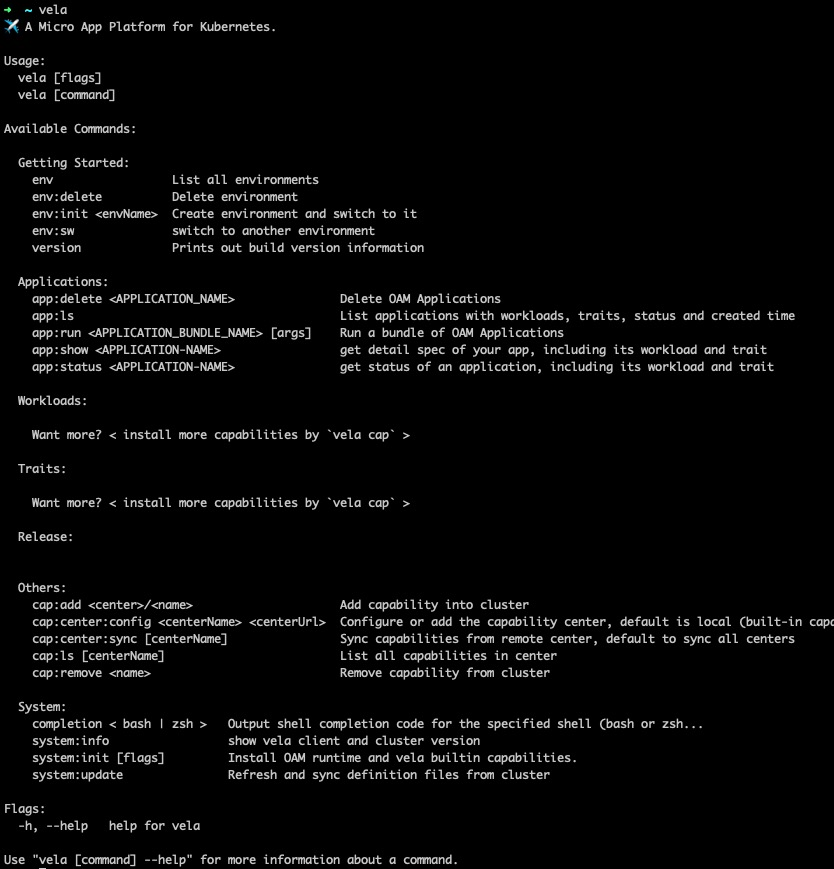

# Vela

Vela is a command-line tool to use OAM based micro-app engine.

## Develop
Check out [DEVELOPMENT.md](./DEVELOPMENT.md) to see how to develop with RudrX

## Install `vela` binary

```shell script
git clone git@github.com:cloud-native-application/RudrX.git
cd RudrX
make
mv bin/vela /usr/local/bin
```

## Vela commands

### Click the picture to watch the video

[](https://oam-budao.oss-cn-beijing.aliyuncs.com/Vela%20First%20PoC.mp4 "POC video")

#### env
```
$ vela env:init test --namespace test
Create env succeed, current env is test

$ vela env test
NAME	NAMESPACE
test	test

$ vela env
NAME   	NAMESPACE
default	default
test   	test

$ vela env:sw default
Switch env succeed, current env is default

$ vela env:delete test
test deleted

$ vela env:delete default
Error: you can't delete current using default
```

#### workload run
```shell script
$ vela containerized:run app123 -p 80 --image nginx:1.9.4
Creating AppConfig app123
SUCCEED
```

#### app
```
$ vela app:ls
NAME       	WORKLOAD             	TRAITS                     	STATUS	CREATED-TIME
app123     	ContainerizedWorkload	app123-manualscaler-trait  	False 	2020-08-05 20:19:03 +0800 CST
poc08032042	ContainerizedWorkload	                           	True  	2020-08-03 20:43:02 +0800 CST
poc1039    	ContainerizedWorkload	poc1039-manualscaler-trait 	False 	2020-08-02 10:39:54 +0800 CST


$ vela app:status app123
status: "False"
trait:
- apiVersion: core.oam.dev/v1alpha2
  kind: ManualScalerTrait
  metadata:
    creationTimestamp: null
    name: app123-manualscaler-trait
  spec:
    definitionRef:
      name: ""
workload:
  apiVersion: core.oam.dev/v1alpha2
  kind: ContainerizedWorkload
  metadata:
    creationTimestamp: null
    name: app123
  spec:
    definitionRef:
      name: ""


$ vela app:delete app123
Deleting AppConfig "app123"
DELETE SUCCEED
```

#### WorkloadDefinitions/TraitDefinitions
```shell script
$ vela traits
NAME                              	ALIAS	DEFINITION                        	APPLIES TO                                                  	STATUS
manualscalertraits.core.oam.dev   	     	manualscalertraits.core.oam.dev   	core.oam.dev/v1alpha2.ContainerizedWorkload                 	-
simplerollouttraits.extend.oam.dev	     	simplerollouttraits.extend.oam.dev	core.oam.dev/v1alpha2.ContainerizedWorkload, deployments....	-

$ vela workloads
NAME                               	SHORT	DEFINITION
containerizedworkloads.core.oam.dev	     	containerizedworkloads.core.oam.dev
deployments.apps                   	     	deployments.apps
```

#### Auto-Completion

##### bash

```shell script
To load completions in your current shell session:
$ source <(vela completion bash)

To load completions for every new session, execute once:
Linux:
  $ vela completion bash > /etc/bash_completion.d/vela
MacOS:
  $ vela completion bash > /usr/local/etc/bash_completion.d/vela
```

##### zsh

```shell script
To load completions in your current shell session:
$ source <(vela completion zsh)

To load completions for every new session, execute once:
$ vela completion zsh > "${fpath[1]}/_vela"
```

### Clean your environment

```shell script
$ helm uninstall core-runtime -n oam-system
release "core-runtime" uninstalled
```

```shell script
$ kubectl delete crd workloaddefinitions.core.oam.dev traitdefinitions.core.oam.dev
customresourcedefinition.apiextensions.k8s.io "workloaddefinitions.core.oam.dev" deleted
customresourcedefinition.apiextensions.k8s.io "traitdefinitions.core.oam.dev" deleted
```

```shell script
$ rm -r ~/.vela
```
