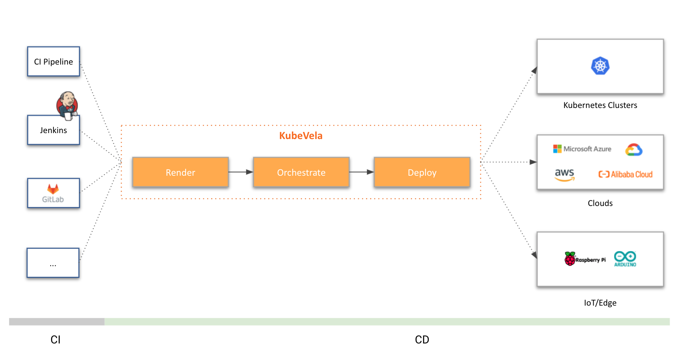

  

    
      
    <i>Make shipping applications more enjoyable.</i>
  

## Introduction

KubeVela is a modern application delivery platform that makes deploying and operating applications across today's hybrid, multi-cloud environments easier, faster and more reliable.

## Highlights

KubeVela practices the "render, orchestrate, deploy" workflow with below highlighted values added to existing ecosystem:

#### **Deployment as Code**

Declare your deployment plan as workflow, run it automatically with any CI/CD or GitOps system, extend or re-program the workflow steps with [CUE](https://cuelang.org/).
No ad-hoc scripts, no dirty glue code, just deploy. The deployment workflow in KubeVela is powered by [Open Application Model](https://oam.dev/).

#### **Built-in observability, multi-tenancy and security support**

Choose from the wide range of LDAP integrations we provided out-of-box, enjoy enhanced [multi-tenancy and multi-cluster authorization and authentication](https://kubevela.net/docs/platform-engineers/auth/advance),
pick and apply fine-grained RBAC modules and customize them per your own supply chain requirements.
All delivery process has fully [automated observability dashboards](https://kubevela.net/docs/platform-engineers/operations/observability).

#### **Multi-cloud/hybrid-environments app delivery as first-class citizen**

Natively supports multi-cluster/hybrid-cloud scenarios such as progressive rollout across test/staging/production environments,
automatic canary, blue-green and continuous verification, rich placement strategy across clusters and clouds,
along with automated cloud environments provision.

#### **Lightweight but highly extensible architecture**

Minimize your control plane deployment with only one pod and 0.5c1g resources to handle thousands of application delivery.
Glue and orchestrate all your infrastructure capabilities as reusable modules with a highly extensible architecture
and share the large growing community [addons](https://kubevela.net/docs/reference/addons/overview).

## Getting Started

* [Introduction](https://kubevela.io/docs)
* [Installation](https://kubevela.io/docs/install)
* [Deploy Your Application](https://kubevela.io/docs/quick-start)

## Documentation

Full documentation is available on the [KubeVela website](https://kubevela.io/).

## Blog

Official blog is available on [KubeVela blog](https://kubevela.io/blog).

## Community

We want your contributions and suggestions!
One of the easiest ways to contribute is to participate in discussions on the Github Issues/Discussion, chat on IM or the bi-weekly community calls.
For more information on the community engagement, developer and contributing guidelines and more, head over to the [KubeVela community repo](https://github.com/kubevela/community).

### Contact Us

Reach out with any questions you may have and we'll make sure to answer them as soon as possible!

- Slack:  [CNCF Slack kubevela channel](https://cloud-native.slack.com/archives/C01BLQ3HTJA) (*English*)
- [DingTalk Group](https://page.dingtalk.com/wow/dingtalk/act/en-home): `23310022` (*Chinese*)
- Wechat Group (*Chinese*): Broker wechat to add you into the user group.
 
  

### Community Call

Every two weeks we host a community call to showcase new features, review upcoming milestones, and engage in a Q&A. All are welcome!

- Bi-weekly Community Call:
  - [Meeting Notes](https://docs.google.com/document/d/1nqdFEyULekyksFHtFvgvFAYE-0AMHKoS3RMnaKsarjs).
  - [Video Records](https://www.youtube.com/channel/UCSCTHhGI5XJ0SEhDHVakPAA/videos).
- Bi-weekly Chinese Community Call:
  - [Video Records](https://space.bilibili.com/180074935/channel/seriesdetail?sid=1842207).

## Talks and Conferences

Check out [KubeVela videos](https://kubevela.io/videos/talks/en/oam-dapr) for these talks and conferences.

## Contributing

Check out [CONTRIBUTING](https://kubevela.io/docs/contributor/overview) to see how to develop with KubeVela.

## Report Vulnerability

Security is a first priority thing for us at KubeVela. If you come across a related issue, please send email to security@mail.kubevela.io .

## Code of Conduct

KubeVela adopts [CNCF Code of Conduct](https://github.com/cncf/foundation/blob/master/code-of-conduct.md).
