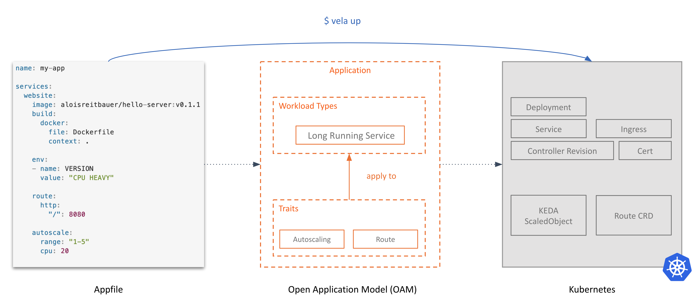

# KubeVela Design

This document is the detailed design and architecture of the KubeVela being built in this repository.

> All the diagram in this documentation could be found in [this slides](https://docs.google.com/presentation/d/1Y3gnKrd7fUZGgee7Ia9vBsRIYhcZLQwMUCDkk1RJvQc).

## User Stories

As a end user (e.g. application developers, operators etc) of the platform, I only want to focus on coding my business logic and ship them to various environments at ease. Let's say:
- Here's my source code.
- Here's my application configuration (described in end user PoV).
- Deploy it in test environment.
- Deploy it in production environment.
- Monitoring, debugging, rollout/rollback the application.
- Dockerfile is fine, but please keep it simple. 

As a platform engineer, I want to build a easy-to-use platform for end users. In detail, the platform should be:
- Heroku-like (_in terms of both user experience and functionality_). 
  - and I prefer to build my own version with OSS tools, particularly, with Kubernetes (for obvious reason).
- Easy to build. 
  -  I am too busy to reinvent any wheel, I want to reuse existing capabilities in Kubernetes community as features of my platform with minimal effort. Writing some simple CRD and controllers is fine, but please, just the simple ones.
- Powerful and highly extensible.
  - I don't want to lock users with restricted abstractions and capabilities like traditional PaaS or FaaS/Serverless. I love Kubernetes and what it has enabled. So in terms of capability, I hope my platform is fully open and has unlimited possibilities like Kubernetes itself, rather than another opinionated close system like traditional PaaS.

## Core Principles

For developers, KubeVela provides a out-of-the-box PaaS-ish experience that enables better productivity (i.e. focus, self-service, on-demand, and fast-feedback).

For platform builders, KubeVela works like a special Kubernetes "distro" or extensible PaaS core that could be used to build something more complex on top of. It enables platform builders to integrate existing capabilities in Kubernetes ecosystem with minimal effort, and/or develop a new capability at ease in a standard, Kubernetes-native approach.

## Design Details

### 1. Application Centric

Keywords: _focus_, _self-service_.

KubeVela intends to ensure developers only think in the scope of _application_, not container or infrastructure. We've seen lacking application context impacts the developer experience and raises the bar to adopt cloud native technology and we believe _application_ is the natural mindset for developers and it's the core API KubeVela should expose.


In KubeVela, it is only push code, deploy application in developer facing primitives, and claim operations policies that developers would do. Thus, KubeVela choose to:
1. Introduce _application_ as its first class API.
2. Build the whole system around "application", i.e. model capabilities of Kubernetes as application configuration, with clarity and manageability.

#### Solution

One common solution to introduce such concept of "application" to Kubernetes is creating an "application CRD". However, as an extensible PaaS core, KubeVela intends to support any application type and any operation feature in Kubernetes ecosystem, thus instead of creating a in-house and "monolithic" CRD, KubeVela adopts [Open Application Model (OAM)](https://github.com/oam-dev/spec) as its application definition. This is empowers KubeVela with high extensibility since every workload and operation feature in OAM is modeled by independent definition object with full freedom to extend. Besides, the model in OAM is also well-defined as it defines micro-services application by default, and models operation features as part of the application (i.e. `Traits`).

### 2. Capability Oriented Architecture

Keywords: _on-demand_.

Every capability in KubeVela is designed as a standalone "plug-in" in terms of implementation and configuration. This enables the extensibility of the platform, and gives platform builders full freedom to extend KubeVela into anything else they want (e.g. database PaaS, AI PaaS, etc.).


This loosely coupled design adopts the idea of Capability Oriented Architecture (COA), i.e. instead of creating a close system like traditional PaaS, KubeVela intends to become an application-centric framework that could connect developers with any underlying infrastructure capability per demand.

#### Solution

KubeVela core is built with [OAM Kubernetes Runtime](https://github.com/crossplane/oam-kubernetes-runtime) which met the requirements of KubeVela such as supporting bring in standalone controllers as workload type and trait. A set of abstraction and interfaces are defined in this library for KubeVela to assemble various Kubernetes capabilities into a platform without coupling them together or introducing any glue code.  

For example, there are several "built-in" workload types in KubeVela such as `Web Service` or `Task`. In implementation, KubeVela discovers them with OAM definition object, it does **NOT** need to be aware of the specification or implementation of these workload types, i.e. they could be Kubernetes built-in resources, or CRD controllers.

This means platform builders are free to bring their own workload types by simply install another CRD controller, or just reference another k8s built-in resource like StatefulSet as new workload type.

Similarly, all the operation features such as `scaling` or `rollout` (i.e. "traits" in KubeVela) are independent from workload implementations. In KubeVela, traits will attempt to understand how to interact with a workload instance following [its characteristic labels](https://github.com/oam-dev/spec/blob/master/4.workload_definitions.md#labels) instead of coupling with specific implementation of workload. This enables platform builders to bring their own traits freely by simply providing another CRD controller, or reference another k8s built-in resource like `HPA` or `NetworkPolicy`.

##### Capability Register and Discovery

KubeVela leverages [OAM definition objects](https://github.com/oam-dev/spec/blob/master/4.workload_definitions.md) to register and discover workloads and traits:


```console
$ kubectl apply -f workload-definition.yaml # register a new workload type
$ kubectl apply -f trait-definition.yaml # register a new trait
```

Note that OAM definition objects only care about API resource, not including the controllers. Thus KubeVela intends to include a **CRD registry** so whenever a new API resource is installed as workload or trait, KubeVela could install its controller automatically from the registry. That of course means we envision the CRD registry could register a CRD and Helm chart (which contains the manifest of the controller). In practice, we are currently evaluating RedHat's Operator Lifecycle Manager (OLM) but no the final conclusion yet.

##### Cloud Services Integration

For capabilities like cloud services, KubeVela intends to leverage [Crossplane](https://github.com/crossplane/crossplane) core to register and provision cloud services as OAM workload types.

### 3. Extensible User Interface

Keywords: _self-service_, _on-demand_, _fast-feedback_

So far, **ALL** functionalities of KubeVela core can be handled by simple `kubectl`, for example:

```yaml
$ kubectl apply -f frontend-component.yaml # create frontend component
$ kubectl apply -f backend-component.yaml # create backend component
$ kubectl apply -f application-config.yaml # assign operational traits to components and deploy the whole application
```

We call these server side API resources "the model objects" of KubeVela. They are essentially the [Control Plane Objects](https://github.com/oam-dev/spec/blob/master/2.overview_and_terminology.md#control-plane-objects) defined in OAM specification.

On the other hand, KubeVela intend to create a lightweight user facing layer on the top of the model objects, with following goals in mind:

- Shorten the learning curve of new developers. Most capabilities in Kubernetes are developed by big
companies that run very complex workloads. However, for the bigger developer community, the new user facing layer will provide a much simpler path to on-board these capabilities.
- Developers can describe their applications and behavior of their components without making assumptions on availability of specific Kubernetes API. For instance, a developer will be able to model auto-scaling needs without referring to the CRD of auto-scaling trait.
- Provides a single source of truth of the application description. The user facing layer allows developers to work with a single artifact to capture the application definition. This artifact is the definitive truth of how the application is supposed to look like. It simplifies administrative tasks such as change management. It also serves as an anchor for application truth to avoid configuration drifts during operation.
- Highly extensible. For example, when a new workload type or trait is installed, the end users could access this new capability directly from user interface layer, no re-compile or re-deploy of KubeVela is required.

#### Solution

In KubeVela, we introduced a docker-compose style "appfile" with higher level abstractions as the main user interface of the platform, so developers can define and deploy an application with a single command: `$ vela up`.

Plus, the schema of `appfile` is designed to be "assembled" with independent workload type and traits defined with OAM specification. For example:

```
services:
  frontend:
    type: webservice
    image: oamdev/testapp:v1

    route:
      domain: example.com
      http: # match the longest prefix
        "/": 8080
 ```

This `appfile` is composed by a `frontend` component with workload type of `Web Service` and a `route` trait. Developer fill in the values based on indepedent schema documentations for such workload type and trait, and KubeVela will check corresponding definitions objects in OAM Kubernetes implementation to validate and generate the final Kubernetes resources. This is how we make the user interface of KubeVela highly extensible.

Besides, in order to make building higher level abstractions easier, we adopted [CUElang](https://github.com/cuelang/cue) in the implementation of OAM on Kubernetes, especially, for creating last mile abstractions (i.e eliminate non user facing fields or compose multiple objects into one). This makes all the abstractions in `appfile` essentially defined by CUE templates in OAM Control Plane Objects and the platform builders are free to modify those template at any time. This update will take effect immediately in the schema of `appfile`.



> In OAM community, `appfile` is the experimental effort to introduce _User Facing Objects_ alongside with the existing _Control Plane Objects_ in OAM specification. Feel free to check its [design doc](./design/appfile-design.md) for more detail.

KubeVela also introduced a command line to which can generate `appfile` in easy approach. For example, the command below will generate and deploy the above `frontend` service to KubeVela directly:

```console
$ vela svc deploy frontend -t webservice --image oamdev/testapp:v1
```

Similarly, the dashboard of KubeVela is essentially a GUI version of `appfile` where the schema of forms are also highly extensible based on the mechanism above.

## Architecture


From highest level, KubeVela is composed by only **two components**:

### KubeVela User Interfaces
User interfaces of KubeVela, including: `appfile`, `cli` and `dashboard`.

### KubeVela Core
KubeVela core is a server side controller which is composed by:
- [Crossplane OAM Kubernetes runtime](https://github.com/crossplane/oam-kubernetes-runtime) to provide Control Plane Objects such as `Component` and `Application Configuration` etc.
- Built-in workload and trait implementations to provide core capabilities such as `webservice`, `route` and `rollout` etc.
- Capability Management: manage features (i.e. workload types and traits) of KubeVela as independent add-ons following the design of _Capability Oriented Architecture_ mentioned above.
- CRD Registry: register and discover Kubernetes controllers by its CRD. This enables KubeVela automatically install dependent controllers/operators triggered by "CRD missing" event when any new workload type or trait is added.
