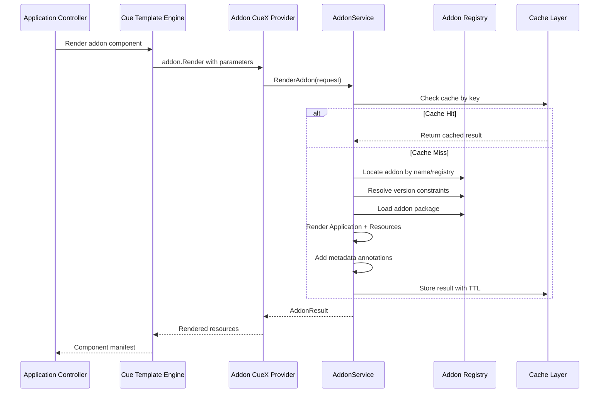

# Addon as Component

### Introduction

This proposal introduces the capability to use KubeVela addons as first-class components within Applications. Rather than creating a new Addon CRD with a dedicated controller, this approach reuses KubeVela's existing Application and Component infrastructure to reduce the need for additional controllers and to reduce the maintenance burden. This enables users to deploy and manage addons using the same declarative approach as regular workloads, bringing addon management into the GitOps workflow while leveraging all existing KubeVela features like policies, workflows, and traits.

### Background

Currently, KubeVela addons are managed separately from applications through CLI commands (`vela addon enable`), the VelaUX UI, or WorkflowRuns. While WorkflowRun support exists, it requires the vela-workflow addon to be pre-installed, still depends on CLI operations within workflow steps, and lacks proper lifecycle management — installation and deletion are separate workflows without automatic cleanup via finalizers or deletion propagation. This separation creates several challenges:

1. **GitOps Incompatibility**: Addons cannot be declaratively managed through Git
2. **Lifecycle Management**: Addons require manual intervention for installation, upgrades, and cleanup
3. **Dependency Management**: No easy means to orchestrate installation and dependencies between addons and other resources
4. **Environment Consistency**: Difficult to ensure the same addons are deployed across environments in non-multicluster setups
5. **Testing Complexity**: Cannot easily test applications with their required addons in CI/CD pipelines

### Goals & Non-Goals

**Goals:**
- Enable addons to be declared as components within Applications
- Support all existing addon features (version constraints, registries, properties)
- Maintain compatibility with existing addon management approaches
- Provide efficient rendering with built-in caching
- Enable GitOps workflows for addon management

**Non-Goals:**
- Replace the existing CLI/UI addon management (both approaches should coexist)
- Change the addon packaging format or registry structure
- Implement automatic dependency resolution (users must explicitly declare addon dependencies w/ workflows); this could be investigated as a future enhancement if required
- Support namespace override for addon resources (addons install to their designed namespaces)

### Proposal

#### 1. Component Definition

Create a new ComponentDefinition `addon` that renders addon packages via CueX:

```cue
import "vela/addon"

addon: {
  type: "component"
  annotations: {
    "category": "System Extensions"
  }
  description: "Install and render an addon as a component"
  attributes: {
    workload: {
      definition: {
        apiVersion: "core.oam.dev/v1beta1"
        kind:       "Application"
      }
      type: "applications.core.oam.dev"
    }
  }
}

template: {
  _addonRender: addon.#Render & {
    $params: {
      addon: parameter.addon
      properties: parameter.properties
      // ... version, registry, include conditionally
    }
  }
  
  output: _addonRender.$returns.application
  
  outputs: {
    for i, resource in _addonRender.$returns.resources {
      "addon-resource-\(i)": resource
    }
  }
  
  parameter: {
    addon: string | *context.name
    version?: string
    registry?: string
    properties: {...} | *{}
    include?: {...}
  }
}
```

#### 2. Implementation Approach

The addon component leverages a new CueX provider `vela/addon` that calls into the existing addon rendering infrastructure. 

> **Note**: The POC implementation required a service-based architecture pattern to circumvent circular dependencies between the CueX providers and addon packages. This pattern could be applied more broadly to resolve similar architectural challenges in KubeVela.

**Key Components:**
- CueX provider function: `addon.#Render`
- Addon service for rendering logic and caching
- Interface injection to break import cycles

#### 3. Component Usage

Users can declare addons as components:

```yaml
apiVersion: core.oam.dev/v1beta1
kind: Application
metadata:
  name: my-app
spec:
  components:
    # Deploy prometheus addon
    - name: prometheus
      type: addon
      properties:
        addon: prometheus        # Optional if matches component name
        version: ">=2.0.0"       # Version constraint
        registry: official       # Registry name
        properties:              # Addon configuration
          serviceType: LoadBalancer
        include:                 # Selective installation
          definitions: true
          resources: true
          configTemplates: false
          views: false
    
    # Application components that depend on the addon
    - name: my-service
      type: webservice
      properties:
        image: myapp:latest
```

#### 4. Features

**Version Management:**
- Single `version` field handles both exact versions and constraints
- Examples: `"1.2.3"` (exact), `">=1.0.0"` (constraint), `""` (latest)

**Registry Support:**
- Supports all existing registry types (Helm, Git, OSS, Gitee, GitLab)
- Registry metadata added as annotations for traceability

**Selective Installation:**
```yaml
include:
  definitions: true      # ComponentDefinitions, TraitDefinitions
  configTemplates: true  # Config templates
  views: true            # VelaQL views  
  resources: true        # Auxiliary resources
```

**Performance Optimization:**
- 5-minute TTL cache for rendered results
- Cache key based on all parameters (addon, version, registry, properties, include)
- Performance: ~100ms initial render, ~20μs for cached results

#### 5. Implementation Details

**Rendering Flow:**



1. Application Controller triggers component rendering
2. Cue Template Engine evaluates addon component template
3. Addon CueX Provider checks cache and renders if needed
4. Service locates addon in registries and resolves version
5. Renders Application workload and auxiliary resources
6. Adds traceability metadata and caches result
7. Returns structured resources to Application Controller

**Circular Dependency Resolution:**

The addon package cannot be directly imported in CueX providers due to circular dependencies:
```
cuex → addon → definition → cuex (CYCLE!)
```

Solution: Interface injection pattern
```
cuex/addon (defines interface) ← addon/service (implements)
                ↑
         (injected at startup)
```

### Examples

**Basic Usage:**
```yaml
apiVersion: core.oam.dev/v1beta1
kind: Application
metadata:
  name: monitoring-stack
spec:
  components:
    - name: prometheus
      type: addon
      properties: {}      # Uses component name as addon name
    
    - name: grafana-addon
      type: addon
      properties:
        addon: "grafana"  # Uses explicit addon naming
        version: "~8.0.0"
```

**Advanced Configuration:**
```yaml
apiVersion: core.oam.dev/v1beta1
kind: Application
metadata:
  name: observability-stack
spec:
  components:
    - name: prometheus-server
      type: addon
      properties:
        addon: prometheus-server
        registry: KubeVela
        version: "1.0.0"
        properties:
          serviceType: LoadBalancer
          storageClass: "standard"
          storageSizeGB: 10
        include:
          definitions: true
          resources: true
          configTemplates: true
          views: true
```

**Multi-Environment Deployment:**
```yaml
apiVersion: core.oam.dev/v1beta1
kind: Application
metadata:
  name: app-with-addons
spec:
  components:
    - name: fluxcd
      type: addon
      properties:
        version: ">=2.0.0"
  
  policies:
    - name: topology-dev
      type: topology
      properties:
        clusters: ["local"]
        namespace: "default"
    
    - name: topology-production
      type: topology
      properties:
        clusterLabelSelector:
          env: production
        namespace: "production"
    
    - name: override-production-versions
      type: override
      properties:
        components:
          - name: fluxcd
            properties:
              version: "2.1.0"  # Pin version in production
  
  workflow:
    steps:
      - name: deploy-dev
        type: deploy
        properties:
          policies: ["topology-dev"]
      - name: deploy-production
        type: deploy
        properties:
          policies: ["topology-production", "override-production-versions"]
```

### Progress / Timeline / Milestones

**Phase 1: POC Implementation (Completed)**
- [x] CueX provider with interface pattern
- [x] Service implementation with rendering logic
- [x] ComponentDefinition creation
- [x] Basic caching mechanism
- [x] Version constraint support
- [x] Registry metadata annotations
- [x] Selective installation via include parameter
- [x] Performance optimization (caching)

**Phase 2: Production Readiness (Planned)**
- [ ] Multi-cluster support with topology policies
- [ ] Comprehensive testing and documentation
- [ ] Migration guide from existing addon management

**Phase 3: Advanced Features (Future)**
- [ ] Resource filtering via CUE-in-CUE
- [ ] Post-render transformations (labels, annotations)
- [ ] Automatic dependency resolution

### Risks and Mitigations

**Risk 1: Breaking Changes**
- *Risk*: Changes to addon APIs could break the component
- *Mitigation*: Component uses stable addon rendering APIs that are already used by CLI

**Risk 2: Performance Impact**
- *Risk*: Rendering addons on every reconciliation could be slow
- *Mitigation*: Implemented 5-minute cache, reduces render time from ~100ms to 20μs

**Risk 3: Circular Dependencies**
- *Risk*: Direct import of addon package creates import cycles
- *Mitigation*: Implemented interface injection pattern in POC to break cycles; to be investigated more broadly

**Risk 4: User Confusion**
- *Risk*: Two ways to manage addons might confuse users
- *Mitigation*: Clear documentation showing when to use each approach

### Alternatives Considered

1. **Dedicated Addon CRD with Controller**
   - Create a new `Addon` CRD with its own reconciliation loop
   - Rejected: This would be a massive undertaking, introducing substantial additional code and duplicating much of the orchestration, lifecycle management, and status tracking logic that already exists in the Application controller. The component approach allows us to leverage existing KubeVela features (traits, policies, workflows) and adheres to the Kubernetes philosophy of reusing available infrastructure.

### Security Considerations

- Addon components inherit the same RBAC as regular components (allowing the addon component to be suitably restricted)
- Registry credentials are handled through existing secret mechanisms
- No additional privileges required beyond standard application deployment

### Testing Strategy

- Unit tests for the CueX provider and service implementation
- Integration tests for addon rendering with various registries
- E2E tests for full application deployment with addon components
- Performance benchmarks for cache effectiveness

### Documentation Required

- User guide for addon component usage
- Migration guide from CLI to component approach
- Troubleshooting guide for common issues