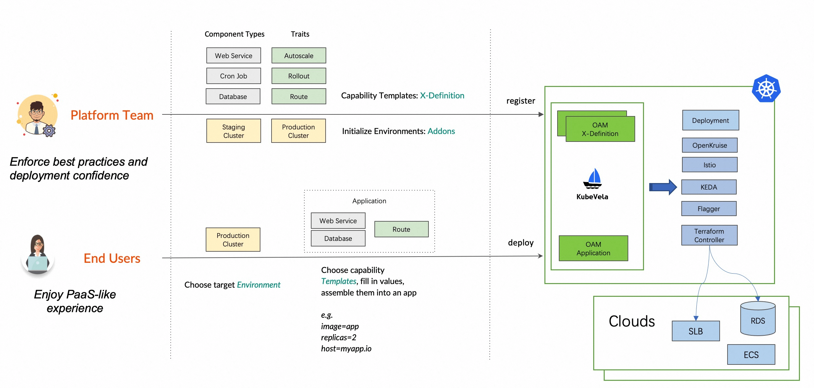

# SDK Generating

# Introduce

This proposal introduces a framework which can generate KubeVela multiple language SDKs from scaffolds and the real
world X-Definitions.

# Background

As KubeVela designs for separation of concerns, there are two roles of user: platform team and end user. They are
dealing with Application in different ways.



### For platform team

When platform team users typically build a platform. The platform allow end user to pass parameters to
component/trait/policy/workflow, then the platform assemble an Application automatically using the parameters.

Unfortunately, due to the extensibility of KubeVela X-Definition system, the property structure of different component (
also for traits, workflow steps, policies) varies. In the source code, we use a `map[string]interface{}` to accept all
kinds of properties. The unstructured code make it hard examine, modify, insert values of nested properties.

Before KubeVela provide the SDK, the problem is mainly solved by providing OpenAPI schema to frontend and generate the
form dynamically. There is also an enhancement scheme: ui-schema. After filling the form, the JSON returned by frontend
is already satisfied the specification of X-Definition properties. This is how VelaUX works when assembling Application.

### For end user

Basically there are two ways for end user to use Application:

1. Through dashboard provided by platform team like VelaUX. The data is kept by the internal platform. In this pattern
   user's behavior can be better guided with typed form and UI indications.
2. Storing Application as part of the codebase. Then through some way (e.g. GitOps) the application is applied to
   cluster.

### Goals & Non-Goals

Goals include the following:

1. Provide a framework to generate SDK for different languages. Definition can be discovered from
    - Local directory
    - KubeVela control plane cluster
2. Provide a Go SDK as one of the first core SDK to proof of concept.
3. The SDK must provide functions to meet the following scenarios:
    - Be able to do CRUD on OAM concepts including Component/Trait/Workflow/Policy.
    - Be able to generate application YAML and directly apply to KubeVela control plane cluster.

Non-goals include the following:

1. We hope to provide SDK for as many languages as we can, but it's not possible to provide sdks for all languages.
   We'll just target the popular languages such as Go, Typescript, Java, Python, PHP, and etc.

# Proposal

## Benefits

In the aforementioned ways of using Application, there are some issues for both roles.

### For platform team

There are some scenarios which use JSON data passed from frontend is not enough:

1. Platform is responsible for some examination and modification on user's application:
    1. Adding some traits and policies which is taken care of by platform team. (e.g. observability)
    2. Execute some check which can't be done with OpenAPI schema and ui-schema. (e.g. call other services to access
       needed data)
2. Platform want to execute some offline batch jobs. For example, add observability trait to existing Applications

In these scenarios, it's [painful](#3606) to develop with `map[string]interface{}`. With SDK, platform team can benefits
from the typed X-Definition properties and builds, examines, modifies application more easily.

### For end user

If user is writing Application YAML, they have to refer to the doc. Although we have done some toolchain on this topic
like `vela show`, a typed SDK also provide a possibility for end user to code Application in different languages.

## Design and tools

Thanks to the OpenAPI schema and related tool [openapi-generator](https://github.com/OpenAPITools/openapi-generator) in
ecosystem, we can re-use the almost ready templates to generate code. The whole generation process is shown below.


**Step0**: The scaffold is written to destination if `--init` is specified. (omitted in pic)

**Step1**: Generate OpenAPI schema from CUE. The generated schema may not fully prepared as input of openapi-generator
and it will be correct and adjust.

**Step2**: Call openapi-generator to generate SDK. After that some modification will be applied to make SDK API suited
for KubeVela user.

## Examples

This command requires `docker` in PATH as we'll run openapi-generator in docker.

```shell
# Initialize the SDK, generate API from all definitions, 
vela def gen-api --init -f /path/to/def/dir -o /path/to/sdk --language go

# Incrementally generate API from definitions
vela def gen-api -f /path/to/def/dir -o /path/to/sdk --language go
```

## Future work

This PR only provide a framework on generating SDK and there are lots of jobs to do to provide
user-friendly SDKs in multiple languages.

### For SDK generating

1. Provide SDK in other languages. This is a LFX mentorship: #5365
2. Allow user to customize the templates in Step2.

### For Golang SDK

1. The default value of properties is not set in apis. Although there is a `default` field in OpenAPI schema, it's not
   sed in generated code. We can set the default value in code.
2. Parameter validation using CUE. Sometimes the `parameter` field in CUE have more restrictions. We can use CUE to
   validate the parameters. (e.g. `parameter: { a : >=0 }`). For golang there is
   a [package](https://pkg.go.dev/cuelang.org/go/encoding/gocode/gocodec) that can help.
3. Validate if the trait type is suited to be attached to the component. For example, `K8s-object` can only
   accept `labels` and `annotation` trait.

## Known Issues

There are some problems when generating:

1. `apply-terraform-provider` workflow step. Parameter are like below will cause the problem. Related
   issue: https://github.com/cue-lang/cue/issues/2259

```cue
basic: { info: string }
#A:{ 
  info
  a: string 
}
#B:{ 
  info
  b: string 
}
parameter: *#A|#B
```

2. `label` and `annotation` trait. openapi-generator doesn't support top-level schema to be a map. The two traits'
   properties is actually just `map[string]string` so it's easy to build it without using SDK.
