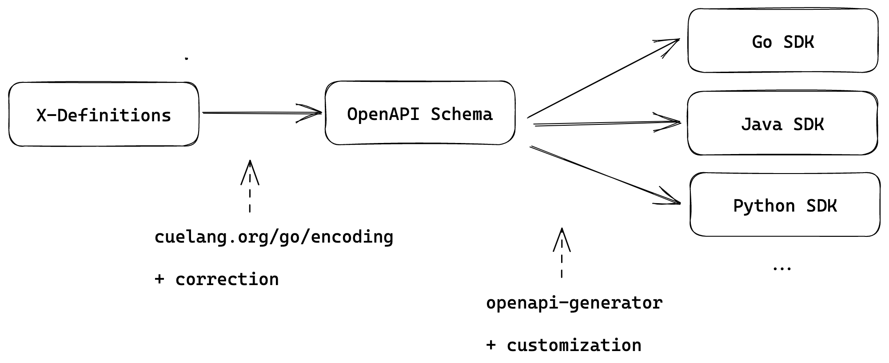

# SDK 生成

# 介绍

该提案引入了一个框架，该框架可以从脚手架以及 X-Definitions 生成 KubeVela SDK.

# 背景

由于 KubeVela 设计了关注点分离，因此有两个用户角色：平台团队和最终用户。他们以不同的方式处理Application。


### 对于平台团队

当平台团队用户组装Application，填写组件、特性和工作流程步骤时，他们实际上是在组装Application YAML.不幸的是，由于 KubeVela
X-Definition 系统的可扩展性，不同组件（包括特征、工作流步骤、策略）的属性结构各不相同。在源代码中，我们使用 `map[string]interface{}`
来接受各种属性。非结构化代码使得难以检查、修改、插入嵌套属性的值。

当平台团队用户通常构建平台时。该平台允许最终用户将参数传递给组件/运维特征/策略/工作流，然后平台使用参数自动组装应用程序。
不幸的是，由于 KubeVela X-Definition
系统的可扩展性，不同组件（同样对于特征、工作流步骤、策略）也是不同的。在源代码中，我们使用一个 `map[string]interface{}` 来接受所有
各种属性。非结构化代码使得难以检查、修改、插入嵌套属性的值。
在 KubeVela 提供 SDK 之前，主要通过提供 OpenAPI Schema 给前端，由前端动态生成表单来解决问题。还有一个增强方案：UI-Schema。在填充表单之后，前端返回的
JSON 已经满足 X-Definition 属性的规范。这也是 VelaUX 在组装Application时的工作方式。

### 对于最终用户

基本上，最终用户使用Application有两种方式：

1. 通过 VelaUX 等平台团队提供的仪表板。数据由内部平台保存。在这个模式中，用户的行为可以通过输入表单和 UI 指示得到更好的指导。
2. 将Application存储为代码库的一部分。然后通过某种方式（例如 GitOps）将Application应用到集群中。

### 目标和非目标

目标包括以下内容：

1. 提供一个框架来生成不同语言的 SDK.
2. 提供一个 Go SDK 作为示例。

非目标包括：

1. 虽然我们希望尽可能多地提供不同语言SDK，但是我们不会提供所有语言的SDK，我们的目标是为比较流行的语言提供SDK。

# 提案

## 好处

在上述使用Application的方式中，两个角色都面对一些问题。

### 对于平台团队

有一些场景使用从前端传递的 JSON 数据是不够的：

1. 平台负责对用户的Application进行一些审核和修改：
    1. 添加一些由平台团队负责的特性和策略。（例如可观测性）
    2. 执行一些无法使用 OpenAPI schema和 UI 模式完成的检查。（例如，调用其他服务以访问所需数据）
2. 平台想要执行一些脱机批处理作业。例如，向现有Application添加可观测性特征

在这些场景中，用`map[string]interface{}`来开发是[痛苦的](#3606)的。有了 SDK，平台团队可以从类型化的 X-Definition
属性中受益，并更轻松地构建、检查和修改Application。

### 对于最终用户

如果用户正在编写Application YAML，他们必须参考文档。虽然我们已经在这个主题上做了一些工具链，例如 `vela show` ，但类型化 SDK
也为最终用户提供了用不同语言编写Application的可能性。

## 设计和工具

感谢 OpenAPI Schema和其生态中的相关工具: [openapi-generator](https://github.com/OpenAPITools/openapi-generator)
，我们可以重复使用几乎准备好的模板来生成代码。整个生成过程如下所示。



**第0步**：如果 `--init` 指定了，则将脚手架写入目标位置。（图中省略）

**第1步**：从 CUE 生成 OpenAPI Schema。生成的Schema直接作为 OpenAPI-Generator 的输入可能有一些问题，它将被纠正和调整。

**第2步**：调用 openapi-generator 生成 SDK.在此之后，将应用一些修改，使 SDK API 适合 KubeVela 用户。

## 例子

这个命令在路径中需要 `docker`，因为我们正在利用 OpenAPI-Generator，将在 docker 中运行该程序。

```shell
# Initialize the SDK, generate API from all definitions, 
vela def gen-api -f /path/to/def/dir -o /path/to/sdk --init

# Incrementally generate API from definitions
vela def gen-api -f /path/to/def/dir -o /path/to/sdk
```

## 未来的工作

这个 PR 只提供了一个生成 SDK 的框架，还有很多工作要做，以提供多种语言的用户友好的 SDK.

### 对于 SDK 生成本身

1. 提供其他语言的 SDK.这是一个 LFX 指导项目 #5365
2. 允许用户自定义步骤 2 中的模板。

### 用于 Golang SDK

1 在 API 中, 属性的默认值没有设置。尽管 OpenAPI schema 中有一个“default ”字段，但它在生成的代码中不是 sed.我们可以在代码中设置默认值。

2. 使用 CUE 进行参数验证。有时，CUE 中的“参数”字段有更多限制。我们可以使用 CUE 来验证参数。（例如：` 参数：{a：>=0}`）。对于
   Golang，有一个 [套餐] （https：//pkg.go.dev/cuelang.org/go/encoding/gocode/gocodec）可以提供帮助。
   验证特征类型是否适合附加到组件。例如，' k8s-object '只能接受' label '和' annotation '特征。

## 已知问题

生成 SDK 时存在一些问题：

1. `apply-terraform-provider` 工作流程步骤。如下所示的参数将导致问题。相关问题：https://github.com/cue-lang/cue/issues/2259

```cue
basic: { info: string }
#A:{ 
  info
  a: string 
}
#B:{ 
  info
  b: string 
}
parameter: *#A|#B
```

2. `label` 和 `annotation` 特性。OpenAPI-Generator
   不支持将顶级Schema作为哈希表。不过这两个特征的属性实际上是 `map[string]string`, 很容易在不使用 SDK 的情况下构建它。
