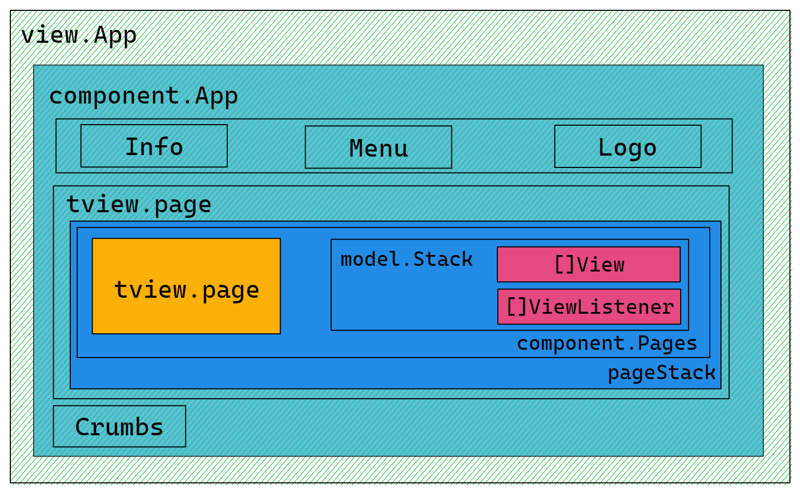
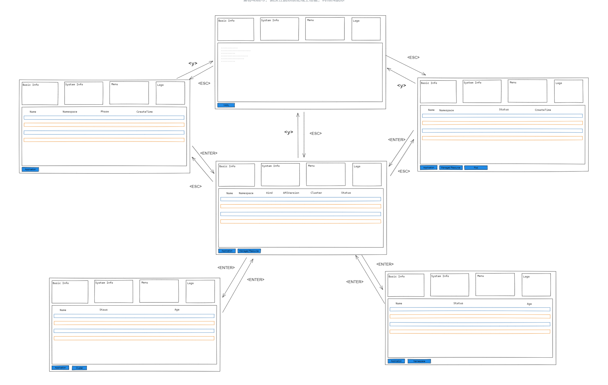
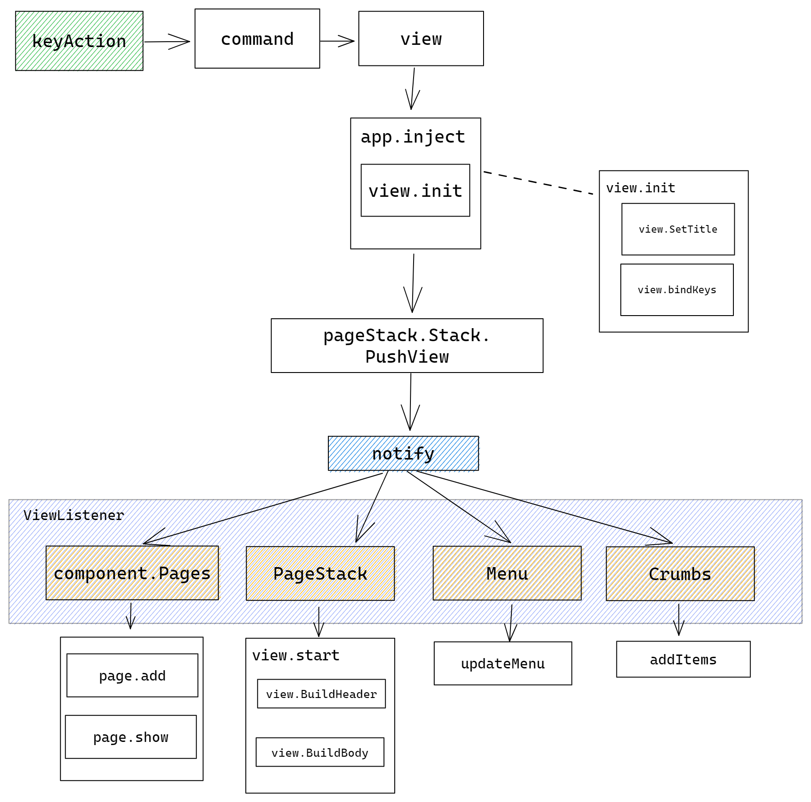
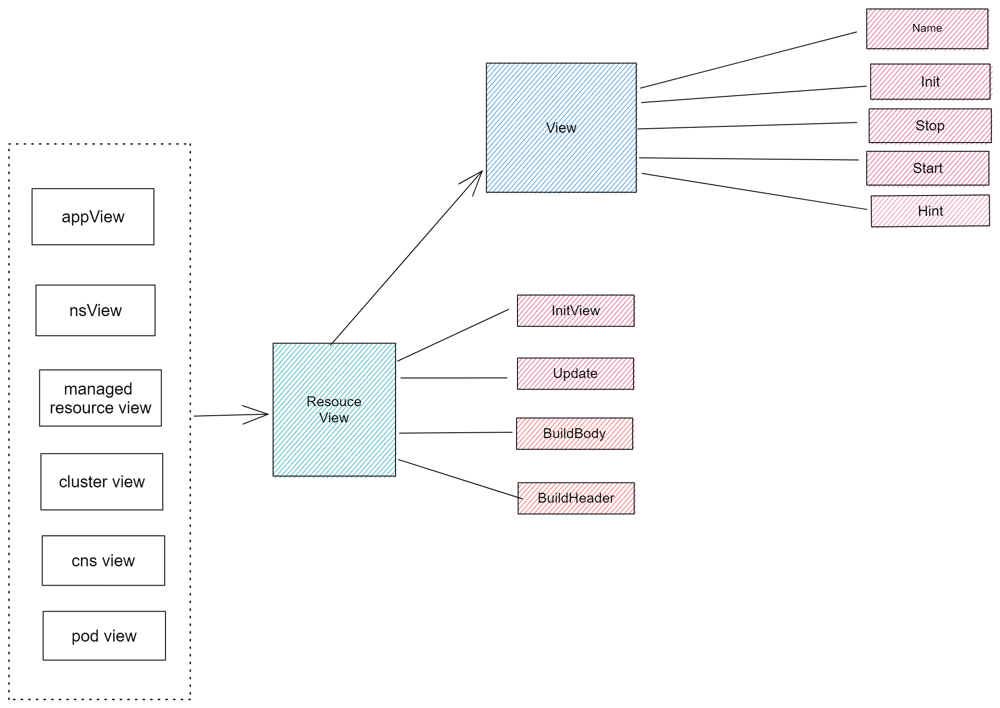

The directory structure of `vela top` code is as follows:

``` shell
├── component
├── config
├── model
├── utils
└── view
```
- The component directory stores the relevant definitions of basic components, such as information board components, menu components, logo components, etc. These components will be combined to form the UI interface of the tool.
- The config directory is used to store tool related configuration files, such as color and component size.
- The model directory is mainly used to store the code related to data loading. Each resource can find the corresponding file in this directory, which stores the function to obtain this resource information.
- The utils directory stores general tool functions that will be called by functions in other directories when needed.
- View directory store UI startup file `app.go`, as well as the most important component of the whole tool, namely the resource information table in the middle. This table is actually a component, but because it is the core of the tool, and it will perform multi-level switching and modify the data in the table according to the user's interaction, after the content of the component is refreshed, it can be considered to have entered a new resource view, so we put this component in a separate view directory, Instead of the component directory where the basic components are stored, the refresh of the resource view will trigger the refresh of the menu and bread crumb components, which will be described in detail in the **View** chapter.

## Component 

### Information board

The information board component is used to display the basic information of Kubernetes, including the currently used Context, Kubernetes version, and the number of clusters. In addition, the information board will also display the performance information of the KubeVela system, including the versions of Vela Core and Vela CLI, and the running applications in the KubeVela system account for all applications. Proportion, performance information of Vela controller (Vela Core) and Vela gateway (Vela Cluster GateWay) (the ratio of the current usage of CPU and memory to the two set values of request and limit respectively).

The performance information for the Vela Controller and Vela Gateway here actually comes from the performance information of the Pod where they are located. The function to obtain information about Pod performance (references/cli/top/utils/metrics.go) will be reused in subsequent Pod view. It should be noted that to collect the performance information of the Pod, you need to install the [metrics server](https://github.com/kubernetes-sigs/metrics-server) in the cluster, otherwise the performance information of the pod will not be obtained correctly.

### Menu board

The menu board will generate corresponding menu prompt items according to the key operations that the user can perform in the current view. There are two data structures involved here, `KeyAction` (references/cli/top/model/key_actions.go) and `MenuHint`, for how to render `MenuHint` according to the `KeyAction` in the new view when switching views, you can refer to **View** chapter of the introduction.

### Logo board

The Logo board will display the KubeVela Logo.

### Crumbs

The crumb component is located at the bottom of the entire UI and is used to indicate the hierarchical state of the current view. There are three resource views: Application, ManagedResource, and Pod. There are also two filter views: Cluster and Namespace. There are also Yaml views and help views.

### `ViewListener` interface

The menu component and breadcrumb component above implement a view listener interface `ViewListener`, which contains two methods `StackPop` and `StackPush`, these two methods correspond to when the view will be inserted or exited, the component should take Actions. For specific implementation, please refer to the introduction in the **View** chapter.

## View

The view is the core of the whole tool, and the code is the more complex part of the whole. The following image is the UI architecture of the entire tool, where the position of the view is in the blue `PageStack` position. `PageStack` encapsulates `component.Pages`, `tview.page` in `component.Pages` is responsible for loading views, and the `[]View` array in `model.Stack` is responsible for pushing old views onto the stack like stacks so that when the current view subsequently exits, the old view will be popped stack and rendered again. The `[]ViewListener` array is responsible for saving the components that monitor view switching.



### View switch

The view switching of the resource level can refer to the following image. After selecting a resource in the current resource level, you can enter the more fine-grained resources under the resource by pressing the ENTER key, which exist from Application -> Managed Resource -> Pod has three resource levels. At each resource level, you can use the Y key to view the Yaml text information corresponding to the current resource. In addition, the Managed Resource view can also switch to the Cluster view and the Namespace view to select the corresponding item to filter the Managed Resource resources.



Specifically, the process of switching the new view is shown in the following figure:
1. First triggered by the user's key operation.
2. Convert the user's keys into corresponding commands.
3. Then render the corresponding view according to the command.
4. Insert the view into app, the view will be initialized first when inserted.
5. The initialized view will then be inserted into `pageStack`, and `pageStack` will notify each component to update its content according to the listener recorded in `[]ViewListener`.



### Resource view

The resource view is the most frequent type of all views, and the structure of each view is similar, mainly composed of table header and table body, so the life cycle of these views can be abstracted as: first initialize the view, this stage will set the title, Set the border and bind the keys; then build the header and the body of the table. In addition, the content in these tables should be refreshed regularly. Therefore, we abstract the resource view as follows. These views first implement the View interface and have a view. The most basic method, and then implements the ResourceView interface, has the methods used in the entire life cycle of resource view loading data.


