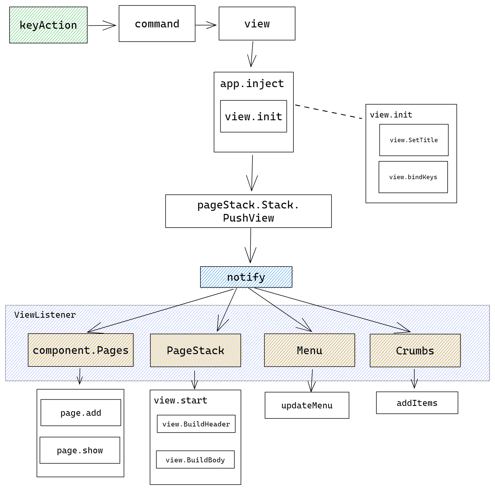
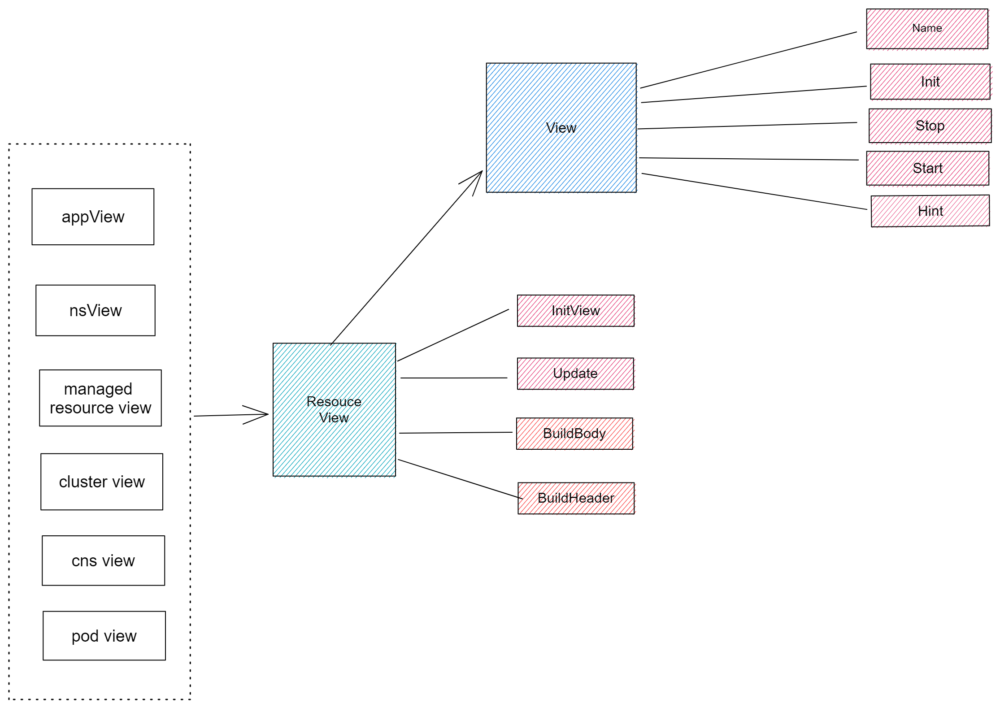

`vela top` 工具代码的目录结构如下所示：

``` shell
├── component
├── config
├── model
├── utils
└── view
```

- component 目录存储基础组件的相关定义如信息面板组件、菜单组件、Logo组件等，这些组件会被组合在一起组成工具的 UI 界面。
- config 目录用于存放工具相关的配置文件，如颜色、组件大小。
- model 目录主要用于存放与数据加载相关的代码，每种资源在该目录下都可以找到相对应的文件，该文件中存放了获取该种资源信息的函数。
- utils 目录中存放通用的工具函数，这些函数会在需要的时候被其他目录的函数调用。
- view 文件存放 UI 的启动文件 `app.go` ，以及整个工具最重要的组成部分，即位于中部的资源信息表格，该表格实际上也是一种组件，但因为其是整个工具的核心，并且会相应用户的交互进行多级切换并修改表格中的数据，该组件的内容刷新后即可认为进入了一个新的资源视图，因此我们将这个组件放置在单独的 view 目录下，而不是存放基础组件的 component 目录下，另外资源视图的刷新，会触发菜单、面包屑组件的刷新，这一点会在[[#视图]]章节中详细介绍。

# 组件

## 信息面板

信息面板组件用于展示 Kubernetes 基础信息包括当前使用的 Context 、Kubernetes 版本、集群数量，此外信息面板还会展示 KubeVela 系统的性能信息包括 Vela Core 与 Vela CLI 的版本、KubeVela 系统中运行 Application 占全部 Application 的比例、Vela 控制器（Vela Core）与 Vela 网关（Vela Cluster GateWay） 的性能信息（CPU 与 内存当前 usage 量分别占 request 与 limit 两个设定值的比例）。

这里对于 Vela 控制器与 Vela 网关的性能信息，实际来自于它们所在 Pod 的性能信息。关于 Pod 性能信息的获取函数（references/cli/top/utils/metrics.go）会在后续 Pod 资源视图中被复用。 需要注意的是采集 Pod 的性能信息，需要在集群中安装 [metrics server](https://github.com/kubernetes-sigs/metrics-server)，否则会无法正确获取到 Pod 的性能信息。

## 菜单面板

菜单面板会根据用户在当前视图可以进行的按键操作，生成相应的菜单提示项。这里涉及到两种数据结构，`KeyAction`（references/cli/top/model/key_actions.go）与  `MenuHint` ，关于切换视图时是如何根据新视图中的 `KeyAction` 渲染  `MenuHint`  的可以参照[[#视图]]章节中的介绍。

## Logo 面板

Logo 面板会展示 KubeVela Logo。

## 面包屑组件

面包屑组件位于整个 UI 的底部，用于指示当前视图的层级状态，资源视图共有三种：Application 、 ManagedResource 、Pod，此外还有两种筛选视图：Cluster 、 Namespace，此外还存在 Yaml 视图以及帮助视图。


## 视图监听接口

上文中的菜单组件与面包屑组件实现了一个视图监听接口 `ViewListener` ，该接口包含两个方法 `StackPop`  与  `StackPush` ，这两个方法分别对应当插入或退出视图时，组件分别应该采取的动作。具体实现可以参照[[#视图]]章节中的介绍。


# 视图

视图作为整个工具的核心，代码是整体中较为复杂的部分。下图是整个工具的 UI 架构，其中视图的位置位于蓝色 `PageStack` 位置处。`PageStack` 对 `component.Pages` 进行了封装，`component.Pages` 中的  `tview.page` 负责加载视图，`model.Stack`中的 `[]View` 数组负责像栈一样将旧的视图压栈，以便后续退出当前视图时，从栈中取出旧视图并再次渲染，`[]ViewListener` 数组负责保存监听视图切换的组件。


## 视图切换

资源层级的视图切换可以参照下图，选中当前资源层级中的某个资源后，可以通过敲击 ENTER 键的方式进入该资源下属的更细粒度的资源，共存在从 Application -> Managed Resource -> Pod 三种资源层级。每个资源层级都可以通过使用 Y 键查看当前资源对应的Yaml 文本信息，此外 Managed Resource 视图还可以切换至 Cluster 视图以及 Namespace 视图选中对应项对  Managed Resource 资源进行筛选。


具体来说切换新视图的流程如下图所示：
1. 首先由用户的按键操作触发。
2. 将用户的按键转换为对应的命令。
3. 然后根据命令渲染对应的视图。
4. 将视图插入 `app`，插入时会先对视图进行初始化。
5. 之后会将初始化后的视图插入 `pageStack` ，`pageStack` 根据 `[]ViewListener` 中记录的监听者，通知每个组件更新各自的内容。



> 视图退出的流程与此类似，这里不再赘述。


## 资源视图

资源视图是所有视图中出现次数最多的种类，并且每个视图的结构类似，主要由表头和表格主体构成，因此这些视图的生命周期都可以抽象为：首先初始化视图，这个阶段会设置标题、设置边框，绑定键位；然后构建表头与表格主体，此外这些表格中的内容还应该会定时刷新，因此我们对资源视图进行了如下的抽象，这些视图首先实现了 View 接口，具备了视图最基本的方法，然后实现了 ResourceView 接口，具备了资源视图加载数据整个生命周期所应用有方法。



