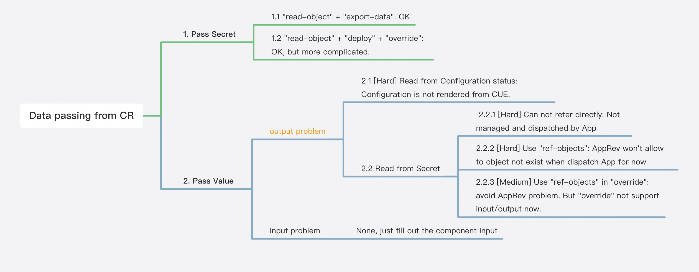
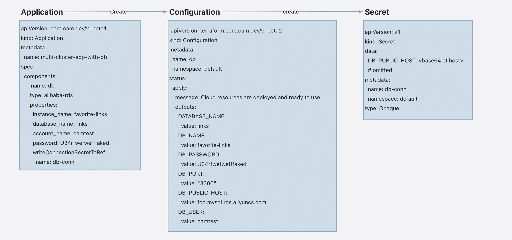

# Data Passing From Cloud Resource

## Introduction

This proposal is to explain how to pass data from cloud resource to other workloads.

## Background

In the issue [#4339](https://github.com/kubevela/kubevela/issues/4339), we have discussed how to pass data from cloud
resource to other workloads. Here's the summary of the discussion.

### Why

KubeVela leverages Terraform controller to provision cloud resource within Kubernetes environment.
In cases where cloud databases are involved, it is necessary to pass along connection information to the related
workloads. This information Secret is created by terraform controller and stored in Kubernetes Secrets.

### Goals

To pass data from cloud resource, there are two perspectives: method and workload location

**Workload Location**

1. Local cluster
2. Managed cluster

**Method**

1. Pass Secret: Secret Object is created at destination cluster. Workload refer to the Secret name and key.
2. Pass Value: Secret Object is **NOT** created at destination cluster. KubeVela fill the workload spec directly with
   connection information value.

## Proposal

There are four combinations of workload location and method. The implementation state is list below. We will discuss
each of them separately.

|            | Local | Managed Cluster |
|-------------|-------|----------------|
| Pass Secret | ✅     | ✅            |
| Pass Value  | ✅     |               |

### Workload in local cluster

#### Pass Secret

This combination is the most straightforward one. The Secret Object is already created at local cluster when
Configuration (cloud resource) is available. Workload can simply refer to the Secret name in Application spec.

```yaml
apiVersion: core.oam.dev/v1beta1
kind: Application
metadata:
  name: local-pass-secret
spec:
  components:
    - name: db
      type: alibaba-rds
      properties:
        instance_name: favorite-links
        database_name: links
        account_name: oamtest
        password: U34rfwefwefffaked
        writeConnectionSecretToRef:
          name: db-conn
    - name: favorite-links
      type: webservice
      dependsOn:
        - db
      properties:
        image: oamdev/nodejs-mysql-links:v0.0.1
        port: 4000
      traits:
        - type: service-binding
          properties:
            envMappings:
              DATABASE_HOST:
                secret: db-conn
                key: DB_PUBLIC_HOST
              DATABASE_NAME:
                secret: db-conn
                key: DATABASE_NAME
              DATABASE_USER:
                secret: db-conn
                key: DB_USER
              DATABASE_PASSWORD:
                secret: db-conn
                key: DB_PASSWORD
```

#### Pass Value

This combination is similar to the previous one. The difference is that we have to read the Secret Object values in
workflow. Then utilize component level input/output mechanism to pass value to workload.

**Note**: `apply-component` can pass value from workflow level output to component level input. It only works for local
cluster. So we can make use of it to pass value to workload. In the [_Pass Value_ + _Maneged
cluster_](#workload-in-managed-cluster) section, you'll see why it won't work in multi-cluster scenario.

```yaml
apiVersion: core.oam.dev/v1beta1
kind: Application
metadata:
  name: local-pass-value
spec:
  components:
    - name: sample-db
      type: alibaba-rds
      properties:
        instance_name: sample-db
        account_name: oamtest
        password: U34rfwefwefffaked
        writeConnectionSecretToRef:
          name: db-conn
    # Example from https://kubevela.io/docs/end-user/components/cloud-services/provision-and-consume-database
    - name: receiver
      type: webservice
      properties:
        image: zzxwill/flask-web-application:v0.3.1-crossplane
        port: 80
        env:
          - name: endpoint
          - name: DB_PASSWORD # keep the style to suit image
          - name: username
      inputs:
        - from: host
          parameterKey: env[0].value
        - from: password
          parameterKey: env[1].value
        - from: username
          parameterKey: env[2].value

  workflow:
    steps:
      - name: apply-db
        type: apply-component
        properties:
          component: sample-db
      - name: read-secret
        type: read-secret
        properties:
          name: db-conn
        outputs:
          - name: host
            valueFrom: output.value.DB_PUBLIC_HOST
          - name: username
            valueFrom: output.value.DB_USER
          - name: password
            valueFrom: output.value.DB_PASSWORD
      - name: apply-receiver
        type: apply-component
        properties:
          component: receiver
```

### Workload in managed cluster

For workload in managed cluster, passing secret can be implemented. But we are facing some issues to pass value.



As displayed in mind map above, the main problem to **pass value** is reading data from either Configuration or Secret
it created. Here is an image that tells relationship between Application, Configuration and Secret, which helps to
understand 2.1 and 2.2.1



#### Pass Secret

Here's a demo about passing secret from cloud resource component to other worload. In this demo application will first
create a database and then create two workloads in different clusters. The both workloads will use the same DB.

```yaml
apiVersion: core.oam.dev/v1beta1
kind: Application
metadata:
  name: multi-cluster-app-with-db
spec:
  components:
    - name: db
      type: alibaba-rds
      properties:
        instance_name: favorite-links
        database_name: links
        account_name: oamtest
        password: U34rfwefwefffaked
        writeConnectionSecretToRef:
          name: db-conn
    - name: favorite-links
      type: webservice
      properties:
        image: oamdev/nodejs-mysql-links:v0.0.1
        port: 4000
      traits:
        - type: service-binding
          properties:
            envMappings:
              DATABASE_HOST:
                secret: db-conn
                key: DB_PUBLIC_HOST
              DATABASE_NAME:
                secret: db-conn
                key: DATABASE_NAME
              DATABASE_USER:
                secret: db-conn
                key: DB_USER
              DATABASE_PASSWORD:
                secret: db-conn
                key: DB_PASSWORD
  policies:
    - name: worker
      type: topology
      properties:
        clusters:
          - cluster-worker
    - name: all-cluster
      type: topology
      properties:
        clusters:
          - cluster-worker
          - local
    - name: links-comp
      type: override
      properties:
        selector:
          - favorite-links
  workflow:
    steps:
      - name: create-rds
        type: apply-component
        properties:
          component: db
      - name: read-secret
        type: read-object
        properties:
          apiVersion: v1
          kind: Secret
          name: db-conn
        outputs:
          - name: db-host
            valueFrom: |
              import "encoding/base64"
              base64.Decode(null, output.value.data.DB_PUBLIC_HOST)
          - name: db-user
            valueFrom: |
              import "encoding/base64"
              base64.Decode(null, output.value.data.DB_USER)
          - name: db-password
            valueFrom: |
              import "encoding/base64"
              base64.Decode(null, output.value.data.DB_PASSWORD)
          - name: db-name
            valueFrom: |
              import "encoding/base64"
              base64.Decode(null, output.value.data.DATABASE_NAME)
      - name: export-secret
        type: export-data
        properties:
          name: db-conn
          namespace: default
          kind: Secret
          topology: worker
        inputs:
          - from: db-host
            parameterKey: data.DB_PUBLIC_HOST
          - from: db-user
            parameterKey: data.DB_USER
          - from: db-password
            parameterKey: data.DB_PASSWORD
          - from: db-name
            parameterKey: data.DATABASE_NAME

      - name: deploy-web
        type: deploy
        properties:
          policies: [ "all-cluster", "links-comp" ]
```

#### Discuss About Passing Value

There is still some scenarios we need to pass value to sub-cluster workload. For example: the helm chart is
off-the-shelf and can't be modified
like [wordpress](https://github.com/helm/charts/blob/master/stable/wordpress/values.yaml). It requires to pass the
database endpoint to values of chart. In this case, we can't pass a secret to it.

To fill the last grid of table, we have to solve either 2.1 or 2.2.

- To solve 2.1 we need to refactor the Configuration rendering logic and unify it to CUE.
- To solve 2.2, 2.2.3 is an easier way and need less effort.

Before we put in effort to solve this problem, we need to collect more requirements to see if it's necessary.

##### Apply-component and Deploy

Here's another discussion about why *apply-component* can't work for workload in managed cluster. In [Pass Value +
Local cluster](#workload-in-local-cluster) combination, we use `read-object` and `apply-component` to overcome the
problem that Secret
value can be read in `workflow` but not in `component` of Application.

Now switching to multi cluster scenario, `apply-component` is not working because it is designed before KubeVela has
multi-cluster capability. After KubeVela have multi-cluster capability, we have `deploy` workflow-step to dispatching
component to multi-cluster.

Unlike `apply-componnet` which has built-in capability to convert workflow-level input/output to component-level ones.
`deploy` can accept input/output, but they will be applied to workflow properties itself like most other
workflow-steps. In another word you can change this part:

```cue
 parameter: {
     //+usage=If set to false, the workflow will suspend automatically before this step, default to be true.
     auto: *true | bool
     //+usage=Declare the policies that used for this deployment. If not specified, the components will be deployed to the hub cluster.
     policies: *[] | [...string]
     //+usage=Maximum number of concurrent delivered components.
     parallelism: *5 | int
     //+usage=If set false, this step will apply the components with the terraform workload.
     ignoreTerraformComponent: *true | bool
 }
```

### Conclusion

For cloud resource data passing scenarios, we have solutions for three out of four scenarios. The last one still needs
some discussion and is waiting for more requirements.

