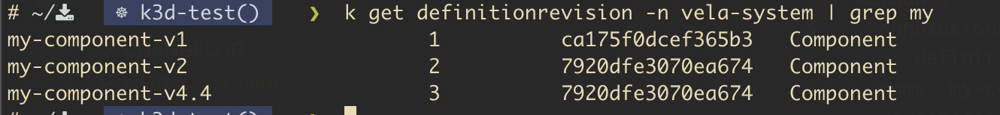

# Versioning Support for KubeVela Definitions

<!-- toc -->
- [Versioning Support for KubeVela Definitions](#versioning-support-for-kubevela-definitions)
  - [Summary](#summary)
  - [Scope](#scope)
  - [Motivation](#motivation)
    - [Goals](#goals)
    - [Non-Goals](#non-goals)
  - [Acceptance Criteria](#acceptance-criteria)
  - [Current Implementation](#current-implementation)
    - [Versioning](#versioning)
    - [Auto Upgrade](#auto-upgrade)
      - [Reference:](#reference)
  - [Proposal 1](#proposal-1)
    - [Details](#details)
    - [Issues](#issues)
  - [Proposal 2](#proposal-2)
      - [ComponentDefinition CRD](#componentdefinition-crd)
      - [ComponentDefinition v2beta1 Object](#componentdefinition-v2beta1-object)
    - [Implementation Details](#implementation-details)
      - [Reasons for selecting `v1beta1` for storage:](#reasons-for-selecting-v1beta1-for-storage)
    - [Upgrading](#upgrading)
    - [Handle existing Components](#handle-existing-components)
    - [Notes/Considerations](#notesconsiderations)
    - [Summary of High Level Changes](#summary-of-high-level-changes)
      - [ComponentDefinition](#componentdefinition)
      - [DefinitionRevision:](#definitionrevision)
      - [Application:](#application)
<!-- /toc -->

## Summary

Support Semantic versioning for KubeVela Components and a way to allow fine control over auto-upgrades of KubeVela Applications to new versions of a Component. The implementation should include support for consistent versioning across environments/clusters, meaning specific Revisions/Versions of a Component should have consistent behaviour.

## Scope

Although, this document limits the scope of discussion to ComponentDefinition Revisions/Versions, due to the current implementation, the changes will most likely apply to all [`Definition`](https://kubevela.io/docs/getting-started/definition/) types. These changes are planned to be explored and validated as part of the implementation.

## Motivation

OAM/KubeVela Definitions (referred to as ComponentDefinitions of Components in the rest
of the document) are the basic building blocks of the KubeVela platform. They
expose a contract similar to an API contract, which evolves from minor to major
versions. Applications are composed of Components that the KubeVela engine stitches
together.

KubeVela creates a `DefinitionRevision` for all changes in a Component `spec`.  
Currently, Applications can refer to a particular Revision of a Component. 
But, this versioning scheme has the following issues: 

- The `DefinitionRevision` does not denote the type of the change (patch/bug, minor or major). This hinders automation of automatic upgrades.
- The current scheme also doesn't allow much control over automatic upgrades to new Component Revisions. KubeVela automatically upgrades/reconciles the Application to the
latest when no Component Revision is specified. 
  > While we don't ideally want Application developers to bother with such details, there are use cases where
  > an automatic upgrade to the latest Component version is not desired.


### Goals

- Support Component versioning with Semantic Versions.
- Allow pinning specific and non-specific versions of a Component in the
  KubeVela Application.

### Non-Goals

- Support for version range in Application. For eg. "type: my-component@>1.2.0"

## Acceptance Criteria

**User Story: Component version specification**

>**AS A** Component author\
>**I SHOULD** be able to publish every version of my Component with the Semantic Versioning scheme\
>**SO THAT** an Application developer can use a specific version of the Component.

**BDD Acceptance Criteria**

>**GIVEN** an updated ComponentDefinition Specification \
>**AND** a version denoted by the ComponentDefinition is set to V\
>**WHEN** the Component is applied to KubeVela\
>**THEN** `V` should be listed as one of the many versions in the DefinitionRevision list

**User Story: Application Component version specification**

>**AS AN** Application developer\
>**I SHOULD** be able to specify a version (complete or partial) for every Component used\
>**SO THAT** I can control which version are deployed.

**BDD Acceptance Criteria**

>Scenario 1: Use the version specified in the Application manifest when deploying the service\
>**GIVEN** a Component A with versions 1.2.2 | 1.2.3\
>**AND** a Component B with versions 4.4.2 | 4.5.6\
>**AND** an Application composed of A 1.2.2 and B 4.4.2\
>**WHEN** the Application is deployed\
>**THEN** it uses Component A 1.2.2 and B 4.4.2
>
>**Variant:** Use the latest version for the part of the SemVer that is not specified.\
>**GIVEN** component A latest version is 1.2.3
>**AND** Component B latest version is 4.5.6
>**AND** an Application composed of A 1.2 and B 4\
>**WHEN** the Application is deployed\
>**THEN** it uses Component A 1.2.3 and B 4.5.6

> Scenario 2: Behaviour when auto-upgrade is disabled \
> **GIVEN** a component A with version 1.2.3\
> **AND** an Application composed of A-1.2.3\
> **IF** Auto-upgrade is disabled\
> **WHEN** a new version of Component A (A-1.2.5) is released\
> **THEN** the Application should continue to use A-1.2.3
>
> **Variant** Behaviour when auto-upgrade is disabled and exact version is unavailable.\
> **GIVEN** a component A with version 1.2.3\
> **AND** a new Application composed of A-1.2.2\
> **IF** Auto-upgrade is disabled\
> **WHEN** the Application is applied\
> **THEN** the Application deployment should fail.
>
> **Variant** Behaviour when auto-upgrade is disabled and exact version is unavailable.\
> **GIVEN** a component A with version 1.2.3\
> **AND** a new Application composed of A-1.2\
> **IF** Auto-upgrade is disabled\
> **WHEN** the Application is applied\
> **THEN** the Application deployment should fail.

> Scenario 3: Behaviour when auto-upgrade is enabled \
> **GIVEN** a component A with version 1.2.3\
> **AND** an Application composed of A-1.2\
> **IF** Auto-upgrade is enabled\
> **THEN** the Application should use A-1.2.3
> **AND WHEN** a new version of Component A (A-1.2.5) is released\
> **THEN** the Application should update to use A-1.2.5
>
> **Variant** Behaviour when auto-upgrade is enabled and exact version is unavailable \
> **GIVEN** a component A with version 1.2.3\
> **AND** a new Application composed of A-1.2.2\
> **IF** Auto-upgrade is enabled\
> **WHEN** the Application is applied\
> **THEN** the Application deployment should fail.
>
> **Variant** Behaviour when auto-upgrade is enabled and exact version is unavailable \
> **GIVEN** a component A with version 1.2.3\
> **AND** a new Application composed of A-1.2\
> **IF** Auto-upgrade is enabled\
> **WHEN** the Application is applied\
> **THEN** the Application deployment should use A-1.2.3.

> Scenario 4:  Expectations of consistent versioning across Environments/Clusters. \
> **GIVEN** a component A with versions 1.2.1|1.2.2|2.2.1\
> **AND** an Application composed of A-1.2.2\
> **IF** the Application needs to be deployed across Environments (Dev, Prod etc)\
> **OR** the Application needs to be deployed in multiple clusters managed independently\
> **WHEN** the Application  is deployed across Environments/Clusters \
> **THEN** The Application should behave consistently, as in all the clusters A-1.2.2 map to the same ComponentDefinition changes.

## Current Implementation

### Versioning

Currently, KubeVela has some support for controlling Definition versions based on K8s annotations and DefinitionRevisions. The annotation `definitionrevision.oam.dev/name` can be used to version the ComponentDefinition. For example if the following annotation is added to a ComponentDefinition, it produces a new DefinitionRevision and names the ComponentDefinition as `component-name-v4.4` .

> definitionrevision.oam.dev/name: "4.4"

This Component can then be referred in the Application as follows:

>"component-name@v4.4" - `NamedDefinitionRevision`

Alternatively, since DefinitionRevisions are maintained even if a **"named"** Revision is not specified via the annotation `definitionrevision.oam.dev/name`, Applications can still refer to a particular Revision of a Component via the auto-incrementing Revision numbers.

>"component-name@v2" - `DefinitionRevision`



This versioning scheme, although convenient, has the following issues:

- Applications which do not explicitly specify a target Revision of a ComponentDefinition, the "latest" applied revision of the ComponentDefinition is used. In scenarios where a cluster has to be replicated or re-created, this means that the sequence in which revisions of a ComponentDefinition are applied becomes important. Implicitly, this also means that the Component maintainers need to keep all Revisions of a ComponentDefinition in their deployment pipeline.\
If `definitionrevision.oam.dev/name` annotation is not added to ComponentDefinitions, even if the Applications are explicit about a Component Revision, there is currently no guarantee that the Application behaviour will be consistent across Environments/Clusters. For example, a `Dev` environment will typically have more churn in Revisions than a `Prod` one and a reference to Component Revision `v3` in an Application will not be the same in both environments.


### Auto Upgrade
KubeVela utilises the annotation `app.oam.dev/autoUpdate` for automatic upgrade.

Application reconciliation behaviour when the `app.oam.dev/autoUpdate` annotation is specified in the Application: 
- If a ComponentDefinition Revision is not specified, the Application will always use the latest available Revision.
- If a ComponentDefinition Revision is specified and a new Revision is released after the Application was created, the latest changes will not reflect in the Application.

Note: This feature is not documented in KubeVela documentation.

#### Reference:

- https://kubevela.io/docs/platform-engineers/x-def-version/
- [Auto Upgrade PR](https://github.com/kubevela/kubevela/pull/3217)


## Proposal 1

### Details

The following 3 implementation pieces need to be considered to enable auto-upgrade behaviour based on semantic versioning:

- Considering that there already exists a mechanism to specify a Revision of a ComponentDefinition, the following variations can be considered:\
  - *Option 1*: Add an optional field `version` in the ComponentDefinition `spec` and use it to generate the ComponentDefinition Revisions.
  - *Option 2*: Add a new annotation `definitionrevision.oam.dev/version` as suggested [here](https://github.com/kubevela/kubevela/issues/6435#issuecomment-1892372596) and use it to generate the ComponentDefinition Revisions.
  - *Option 3*: Use the existing annotation `definitionrevision.oam.dev/name` and add support for specifying Semantic versions. This will break backward compatibility.


- Update the auto-upgrade behaviour to also allow limiting upgrades for an Application within a specified ComponentDefinition version range.

- Implement Validating webhook to:
  - Ensure that the values of the annotation `definitionrevision.oam.dev/version`, `definitionrevision.oam.dev/name` or `version` field adhere to semantic versioning.

### Issues

The following issues assume adherence to strict backward compatibility, meaning the `definitionrevision.oam.dev/name` annotation should continue to work as is.

- It does not resolve inconsistent versioning behaviour across Environments/Clusters when explicit versions are not specified or named DefinitionRevisions are not used.
- If we introduce a new annotation or spec field, it might be very confusing for the users because there would be no distinction between the Revisions generated by the `name` | `version` annotation or `version` field.
- A decision priority needs to be made and clearly declared to the users between the 3 options mentioned above for taking in version preferences. This is needed for scenarios where more than one option is used.

## Proposal 2

This proposal targets the following major changes:

- Add a new API version(`v2beta1`) for ComponentDefinition CRD to support the new versioning model. Current Components should continue to work as is.
- Use Semantic versioning to identify new versions of a Component.
- Use the [Kubernetes API versioning model](https://kubernetes.io/docs/tasks/extend-kubernetes/custom-resources/custom-resource-definition-versioning/) for managing the Component versions, which is to store an array of all version specifications. Each individual element in the array `spec.versions`  will also include a new field called `version` to indicate a specific Component version.
- KubeVela Application users can refer to a particular version of a Component like `component-name@component-version`. The `version` must be a valid Semantic version without the prefix `v` for example, `1.1.0`, `1.2.0-rc.0`.

#### ComponentDefinition CRD
```
    apiVersion: apiextensions.k8s.io/v1
    kind: CustomResourceDefinition
    metadata:
      annotations:
        cert-manager.io/inject-ca-from: vela-system/kubevela-vela-core-root-cert
        controller-gen.kubebuilder.io/version: v0.11.4
      name: componentdefinitions.core.oam.dev
    spec:
      conversion:
        strategy: Webhook
        webhook:
          clientConfig:
            service:
              name: vela-core-webhook
              namespace: vela-system
              path: /convert
              port: 443
          conversionReviewVersions:
          - v1beta1
          - v2beta1
      group: core.oam.dev
      names: ...
      scope: Namespaced
      versions:
      - additionalPrinterColumns:
        - jsonPath: .spec.workload.definition.kind ...
        - jsonPath: .metadata.annotations.definition\.oam\.dev/ description ...
        name: v1beta1
        schema: ...
        served: true
        storage: true
        subresources:
          status: {}
      - additionalPrinterColumns:
        - jsonPath: .spec.workload.definition.kind ...
        - jsonPath: .metadata.annotations.definition\.oam\.dev/description ...
        name: v2beta1
        schema: ...
        served: true
        storage: false
        subresources:
          status: {}

```

#### ComponentDefinition v2beta1 Object

```
    apiVersion: core.oam.dev/v2beta1
    kind: ComponentDefinition
    metadata:
      annotations: {}
      name: my-component
      namespace: vela-system
    spec:
      versions:
      - version: "2"
        schematic: ...
        workload: ...
      - version: "3.4"
        schematic: ...
        workload: ...
```


The Application will then have the ability to refer to the version when using a
Definition as follows:
```
    apiVersion: core.oam.dev/v1beta1
    kind: Application
    metadata:
        name: app-with-comp-versioning
    spec:
        components:
            - name: backend
              type: my-component@v3.4
```

### Implementation Details

Kubernetes only supports storing one API Version per CRD. We are targeting the current( `v1beta1`) API version of `ComponentDefinition` for storage. We will need to implement a [Conversion webhook](https://kubernetes.io/docs/tasks/extend-kubernetes/custom-resources/custom-resource-definition-versioning/#webhook-conversion) to translate the incoming objects of `v2beta1` to `v1beta1`. It essentially means that even when we add a `Component` of the new API Version(`v2beta1`), only the translated object to `v1beta1` ever gets stored in the database.

#### Reasons for selecting `v1beta1` for storage:

-  We don't need to migrate existing `Component`'s to the new API Version(`v2beta1`) as part of the KubeVela upgrade.
-  In the interest of backward compatibility and stability, it is generally [advisable](https://github.com/kubernetes/community/blob/master/contributors/devel/sig-architecture/api_changes.md#operational-overview) to mark the most stable API Version of a CRD for storage. [Crossplane](https://github.com/crossplane-contrib/provider-upjet-aws/blob/main/apis/ec2/v1beta1/zz_instance_types.go#L1348 ) support for multiple versions also implements this.


### Upgrading

When selecting a Component version in the Application spec, it will be possible to
select a non-specific version, like `v1.0` or `v1`. KubeVela will
auto-upgrade the application to use the latest version in the specified version
series. For instance, if the application specifies `type: my-component-type@1.0`
and `v1.0.1` of the Definition is available, KubeVela will re-render the
Application using this version.

In case no Component version is specified, the latest exact version available at the time of Application creation will be pinned.

KubeVela will initiate the reconciliation of the Application as soon as a new
version of a Component is available and the Application is eligible (based on
the version specificity) to be upgraded.

> **Proposal Notes:** We are intentionally not planning to add a flag like `auto-upgrade:
> true|false` if one does not want to auto-upgrade their component. Application developers
> should always use specific Semantic versions in the Application spec to disable auto upgrades.
> This is also consistent
> with existing behavior where we always use the latest version of the
> Definition when the Application reconciles. We are just providing a way to opt
> out of this behavior by pinning the component version in the Application.
> This is also in line with the philosophy of keeping complexity at the platform
> level instead of the Application level.

> **For Definition Maintainers:** Ideally the upgrades to Definitions
> should be backward compatible for a given Major version. Updates to
> Definitions should never force the Application spec to change. If a
> Component is changing something significant, it should be a new Definition.

### Handle existing Components

- We will treat the existing `v1beta1` ComponentDefinition API Version as the legacy API version. These Components will continue to behave the same way, including their usage in an Application. This also applies to Applications & Components using the current `NamedDefinitionRevision` or `DefinitionRevision` versioning.
- An upgrade to KubeVela with this new versioning scheme support will automatically make it available for use. There will be no need for an explicit declaration.
- Conversion of Components between ComponentDefinition API Versions will be blocked. For example, a Component defined using the `v1beta1` API cannot be edited to `v2beta1` API version or vice-versa, even though due to K8s behavior all objects will be displayed after translation to the latest API version. This translation will be implicit and will be handled by the Conversion webhooks.
  > This is still under consideration and might not be enforced depending on the implementation difficulty/limitations.
- All auto upgrade behavior will only apply to `v2beta1` API Components and will **not** need to be enabled via deployment flags.


### Notes/Considerations
- K8s GET resource call always returns the [highest version by default]( https://kubernetes.io/docs/tasks/extend-kubernetes/custom-resources/custom-resource-definition-versioning/#version-priority ). When `v1beta1` objects are accessed, the conversion webhook will be used to translate the result to `v2beta1` before being returned.
- When a new Component is created with `v2beta1` API target, the following objects will be stored:
  - A Component with `v1beta1` API target which only includes the Spec of the highest version from the `v2beta1` object.
  - A DefinitionRevision for each Component version in the `v2beta1`  object will be created/updated.
- We need to be able to store all the information of the new API Version object. One way to do this is via adding a [new annotation](https://github.com/shivi28/kube-vaccine/blob/main/api/v2/conversion.go).
- An update to a Component version `spec` will require a change in the semantic version.
- Conversion webhooks work via a [Hub and Spoke model](https://book.kubebuilder.io/multiversion-tutorial/conversion-concepts). It is not required that the API Version stored in the database and the API version marked as the Hub should be the same.The Hub can then be marked as per ease of implementation.


### Summary of High Level Changes

#### ComponentDefinition
- Add a new CRD API version `v2beta1`.
  - `spec.versions` will be an array of all available/supported Component versions.
  - `status` for the Component will be modified to store the version's metadata.
- New Component versions and Revisions will be required for all `spec` changes.
  
#### DefinitionRevision:
- We are planning to keep the syntax for referring to a version of a Component in an Application.
- `v2beta1` Components will only be referable by the version and not the Revision. The Component version will continue to be appended to the `DefinitionRevision` Name.

#### Application:
- Update the Component version parsing for `v2beta1` Components, to allow for auto upgrades.
