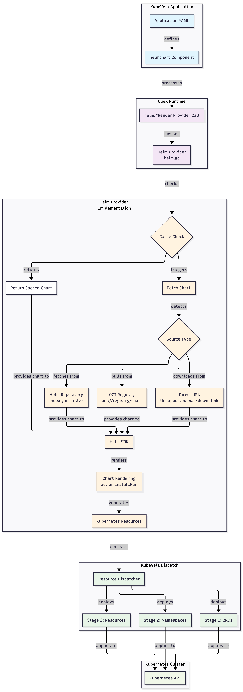
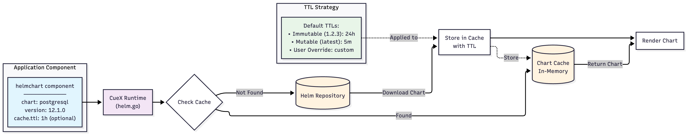

# Native Helm Chart Support

## Release Targets
- KubeVela v1.11: Alpha implementation (early access users* - marked experimental)
- KubeVela v1.12: Beta implementation (non-essential features - valuesFrom, auth, post rendering)
- KubeVela v1.13+ GA

_*The component will be opt-in by nature_

## Summary
This enhancement proposes adding native Helm chart support to KubeVela through a new helmchart component type. This eliminates the dependency on FluxCD for Helm deployments while providing a more integrated experience with KubeVela's core features like multi-cluster deployment, revision management, and unified workflows.

This ensures that KubeVela's internal extensions (i.e. workflow, kube-trigger, prism, et al.) have a consistent means of installation via Helm that does not involve duplication of resources and which has no dependencies to external products (Flux) and post-installation addons (fluxcd).

## Tracking Issue
[Issue #[6973]: Native Helm Support in KubeVela](https://github.com/kubevela/kubevela/issues/6973)

## Motivation
KubeVela currently supports Helm charts through the FluxCD addon, which introduces several challenges:

Current Problems
1. Addon Dependency Complexity
    - Users must install and manage the FluxCD addon to deploy Helm charts
    - Many users already have Flux installed separately, creating conflicts
    - The fluxcd addon causes issues when Flux is pre-installed
    - Many addons have dependencies to the fluxcd addon 
2. Resource Duplication
    - KubeVela's own addons duplicate Helm chart resources instead of consuming charts directly
        - This is hugely error prone as the CRDs etc. are converted to cue 
        - Addons are not always kept up to date
    - In multi-cluster setups, a Helm install to the Hub installs only to the Hub; mandating addon usage for spoke (managed cluster) installation
    - Maintaining duplicate YAML resources increases maintenance burden, risk of human error and resource drifts
3. Multi-cluster Limitations
    - For multi-cluster setups, rolling a Helm Chart out to all managed clusters relies entirely on FluxCD
    - This is acceptable for users already using, or wanting to use FluxCD - but forcing the dependency to fulfil KubeVela's internal requirements is a bad practice
4. Installation Bootstrap Problem
    - KubeVela cannot rely on its own Helm charts for core extensions
    - The Hub cannot install extensions via Helm without FluxCD pre-installed
    - Circular dependency: 
        - Need FluxCD Addon to install Helm charts
        - FluxCD Addon itself needs installation
    - User Experience Fragmentation
        - Different deployment models for Helm vs native KubeVela components
        - Helm releases managed separately from Application revisions
        - No unified status tracking and health checking

## Why Native Support
Native Helm support would:
- Enable direct Helm chart consumption without external dependencies
- Unify the deployment experience across all component types
- Leverage KubeVela's existing multi-cluster and revision capabilities
- Simplify the overall architecture and reduce operational complexity
- Better allow Helm resources to leverage KubeVela health status reporting (and correctly wait during workflows etc.)

## Goals
1. Native Helm Rendering: Add a helmchart component type that renders Helm charts directly
2. Multi-source Support: Support charts from HTTP(S) repositories, OCI registries, and direct URLs
3. Comprehensive Value Management: Enable value merging from multiple sources (inline KubeVela params, ConfigMap, Secret)
4. Multi-cluster Native: Seamless integration with KubeVela's placement policies
5. Performance: Implement caching and optimization for production workloads
6. Simplified Addons: Addons can simply wrap the existing Helm charts of external solutions (scope for generation in the future)

## Non-Goals
1. Replacing Helm as a package manager
2. Supporting Helm < v3 charts
4. Breaking compatibility with existing FluxCD addon users

## Proposal
Add a native helmchart component type to KubeVela that:
1. Renders Helm charts directly using the Helm Go SDK
2. Integrates via CueX as a provider function
3. Outputs Kubernetes resources that flow through KubeVela's standard pipeline
4. Maintains stateless operation with no server-side release storage
5. Provides familiar Helm UX while leveraging KubeVela's features

## User Stories
**As a KubeVela User**
- I want to deploy Helm charts directly without needing to understand or manage FluxCD
- I want a simpler KubeVela installation without mandatory addon dependencies
- I want the flexibility to choose between native Helm support and GitOps workflows
- I want to use existing Helm charts from any registry without modification
- I want a consistent experience whether deploying Helm charts or native components
- I want Helm chart resources to be visible within the existing KubeVela health framework

**As a Platform Engineer**
- I want to deploy Helm charts without installing FluxCD
- I want to use the same Application spec for all deployments
- I want Helm deployments to work with multi-cluster placement
- I want unified revision tracking across all component types

**As an Addon Developer**
- I want to reference upstream Helm charts instead of copying resources
- I want to maintain a single source of truth for my addon
- I want to leverage Helm's templating without duplicating it
- I want my addon to work regardless of FluxCD presence

**As a KubeVela Developer**
- I want to prevent resource drift between KubeVela Helm charts and addon definitions
- I want to reduce maintenance overhead by eliminating duplicate resource definitions
- I want a unified installation process for all KubeVela components and extensions
- I want to use our own Helm charts for internal extensions without circular dependencies
- I want to ensure consistency across different installation methods (standalone vs. addon)

## Design Details
### Component Definition Structure
The helmchart component would be defined as a built-in ComponentDefinition:

```cue 
// helmchart.cue - Component definition for Helm charts
import (
	"vela/helm"
)
"helmchart": {
	type: "component"
	annotations: {
		"definition.oam.dev/description": "Deploy Helm charts natively in KubeVela without FluxCD"
	}
	labels: {
		"custom.definition.oam.dev/category": "helm"
	}
	attributes: {
		workload: type: "autodetects.core.oam.dev"
		status: {
			healthPolicy: #"""
  			  // dynamic health assessment - supplied by the user
            """#
		}
	}
}
template: {
	output: _
	outputs: _
	parameter: {
		chart: {
			source: string
			repoURL?: string
			version?: string | *"latest"
		}
		release?: {
			name?: string | *context.name
			namespace?: string | *context.namespace
		}
		values?: {...}
		// Health status criteria - user defines when the Helm deployment is considered healthy
		healthStatus?: [...{
			resource: {
				kind: string
				name?: string
			}
			condition: {
				type: "Ready" | "Available" | "Progressing" | "ReplicasReady" | "PodReady" | "JobComplete"
				status?: "True" | "False"
			}
		}]
		options?: {
			includeCRDs?: bool | *true       // Install CRDs from chart
			skipTests?: bool | *true         // Skip test resources
			skipHooks?: bool | *false        // Skip hook resources
			createNamespace?: bool | *true   // Create namespace if it doesn't exist
			timeout?: string | *"5m"         // Rendering timeout
			maxHistory?: int | *10           // Revisions to keep
			atomic?: bool | *false           // Rollback on failure
			wait?: bool | *false             // Wait for resources
			waitTimeout?: string | *"10m"    // Wait timeout
			force?: bool | *false            // Force resource updates
			recreatePods?: bool | *false     // Recreate pods on upgrade
			cleanupOnFail?: bool | *false    // Cleanup on failure
		}
	}
	_release: {
		if parameter.release != _|_ {
			parameter.release
		}
		if parameter.release == _|_ {
			name: context.name
			namespace: context.namespace
		}
	}
	_rendered: helm.#Render & {
		$params: {
			chart: parameter.chart
			release: _release
			if parameter.values != _|_ {
				values: parameter.values
			}
			if parameter.valuesFrom != _|_ {
				valuesFrom: parameter.valuesFrom
			}
			if parameter.options != _|_ {
				options: parameter.options
			}
		}
	}
	if _rendered.$returns.resources != _|_ {
		if len(_rendered.$returns.resources) > 0 {
			// Take first resource as primary output
			output: _rendered.$returns.resources[0]
		}
		if len(_rendered.$returns.resources) > 1 {
			outputs: {
				for i, res in _rendered.$returns.resources if i > 0 {
					"helm-resource-\(i)": res
				}
			}
		}
	}
}
```
 
### CueX Provider Implementation
The Helm provider would be implemented as a CueX provider at `pkg/cue/cuex/providers/helm`:

```go
// Provider interface implementation
type Provider struct {
    cache  ChartCache
    client HelmClient
}
// Render is the main provider function
func (p *Provider) Render(ctx context.Context, params *RenderParams) (*RenderReturns, error) {
    // 1. Fetch chart (with caching)
    // 2. Merge values from all sources
    // 3. Render templates
    // 4. Post-process if configured
    // 5. Parse to unstructured objects
    // 6. Order resources (CRDs first, then namespaces, then other resources)
    // 7. Return to component to handle deployment (via outputs)
    return &RenderReturns{
        ...
    }, nil
}
```
 
### Integration with Application Controller
The helmchart component integrates with the existing application controller flow:



### Caching Strategy
Chart caching is critical for performance:

**Cache Key**: {cache-key-prefix}/{sourceType}/{source}/{version} where cache-key-prefix defaults to {appName}-{componentName} for application isolation

**Cache Location**: Controller pod's ephemeral storage with configurable size

**Cache Eviction**: LRU with configurable TTL:
    - Immutable versions (1.2.3, v2.0.0): 24h default
    - Mutable versions (latest, dev, main): 5m default
    - User-configurable per-chart via options.cache.ttl

**Cache Validation**: Version-based validation with smart TTL detection

**Cache Sharing**: Isolated by application/component by default, configurable via options.cache.key for shared scenarios



### Multi-cluster Deployment
The helmchart component naturally supports multi-cluster as the chart is rendered to standard KubeVela component outputs.

Policies and workflows will provide means to override chart versions per environment/cluster as per any other standard component. 

```yaml
apiVersion: core.oam.dev/v1beta1
  kind: Application
  metadata:
    name: postgresql-app
    namespace: examples
  spec:
    components:
    - name: database
      type: helmchart
      properties:
        chart:
          source: postgresql
          repoURL: https://charts.bitnami.com/bitnami
          version: "12.1.0"  # Base version for all environments
        values:
          global:
            postgresql:
              auth:
                database: myapp
        options:
          cache:
            immutableTTL: "24h"  # Conservative default
    policies:
    - name: dev-topology
      type: topology
      properties:
        clusters: ["dev-cluster"]
        namespace: development
    - name: prod-topology
      type: topology
      properties:
        clusters: ["prod-cluster"]
        namespace: production
    - name: dev-overrides
      type: override
      properties:
        components:
        - name: database
          properties:
            chart:
              version: "latest"  # Dev uses latest for rapid iteration
            options:
              cache:
                mutableTTL: "1m"   # Aggressive refresh for dev
                key: "dev-shared"  # Custom key for dev team sharing
    - name: prod-overrides
      type: override
      properties:
        components:
        - name: database
          properties:
            chart:
              version: "12.1.0"  # Prod stays on stable pinned version
            options:
              cache:
                immutableTTL: "24h"  # Long cache for stability
                key: "prod-shared"   # Custom key for prod team sharing
    workflow:
      steps:
      - type: deploy
        name: deploy-dev
        properties:
          policies: ["dev-topology", "dev-overrides"]
      - type: deploy
        name: deploy-prod
        properties:
          policies: ["prod-topology", "prod-overrides"]
```

### Staged Deployment Strategy
Helm charts can include Custom Resource Definitions (CRDs) and resources that depend on them, requiring careful ordering to prevent race conditions and deployment failures.

**Problem**: Traditional parallel deployment can cause failures when:
- CRDs are applied simultaneously with Custom Resources that depend on them
- Namespace-scoped resources are deployed before their target namespaces exist
- Dependencies between resource types are not respected

**Solution**: Enhanced KubeVela dispatch flow with Helm-aligned staged deployment:
- Stage 1 - Foundation: Deploy CRDs and wait for API server establishment
- Stage 2 - Infrastructure: Deploy namespaces and cluster-scoped resources
- Stage 3 - Applications: Deploy namespace-scoped resources and custom resources

This staged approach will be implemented into the core KubeVela dispatcher and automatically applied to all components (including helmchart), ensuring that CRD-heavy charts deploy reliably without requiring manual resource ordering or retry logic.

### Migration from FluxCD (Optional)
For users currently using the FluxCD addon - transferring to the new native helmchart should be simple but will require some field remapping to follow the updated schema.

Whilst the schema could follow the established practices of the FluxCD addon - it would be better to define a best practice chart and supply a migration guide in the documentation. 

#### Before (FluxCD):
```yaml
apiVersion: core.oam.dev/v1beta1
kind: Application
metadata:
  name: postgresql-fluxcd
spec:
  components:
  - name: database
    type: helm
    properties:
      repoType: helm
      url: https://charts.bitnami.com/bitnami
      chart: postgresql
      version: 12.1.0
      targetNamespace: default
      releaseName: postgres
      values:
        auth:
          database: myapp
```
#### After (Native):
```yaml
apiVersion: core.oam.dev/v1beta1
kind: Application
metadata:
  name: postgresql-native
spec:
  components:
  - name: database
    type: helmchart
    properties:
      chart:
        source: postgresql
        repoURL: https://charts.bitnami.com/bitnami
        version: "12.1.0"
      release:
        name: postgres
        namespace: default
      values:
        auth:
          database: myapp
```

## Implementation Plan
#### Phase 0: POC
- [x] Investigate and implement CRD ordering solution check mark button 
- [x] Implement basic Helm provider with repository support check mark button
- [x] Create helmchart component definition check mark button
- [x] Basic caching implementation check mark button
- [x] Internal KubeVela addon deployable to multi-cluster setup via Helm check mark button
- [x] Basic health logic working check mark button
- [x] Demo'able state
- [x] KEP Opened

#### Phase 1: Core Implementation (Alpha - v1.11)
- [ ] Refine Helm provider
- [ ] Finalise helmchart component definition
- [ ] Support inline values only
- [ ] Caching implementation tested and finalised
- [ ] Unit tests for provider
- [ ] E2E testing
- [ ] Basic examples including charts with CRDs
- [ ] Beta documentation

#### Phase 2: Full Features (Beta - v1.12)
- [ ] Authentication support for non-public charts
- [ ] valuesFrom (ConfigMap, Secrets, OCI) (can utilise workflows in interim)
- [ ] Addons updated to wrap Helm Charts where appropriate (and deemed stable enough)
- [ ] Performance Optimizations
- [ ] Production grade documentation

#### Phase 3: GA (v1.13+)
- [ ] Identified issues addressed
- [ ] Performance and stability deemed acceptable
- [ ] Community feedback acknowledged and addressed

### Test Plan
#### Unit Tests
- [ ] Chart fetching from different sources
- [ ] Value merging logic
- [ ] Template rendering
- [ ] Post-processing
- [ ] Cache operations

### Integration Tests
- [ ] Deploy popular charts (PostgreSQL, Redis, nginx)
- [ ] Multi-cluster deployments
- [ ] Value override scenarios
- [ ] Upgrade operations
- [ ] CRD installation

### E2E Tests
- [ ] Complete application lifecycle with helmchart & upgrades
- [ ] Multi-cluster scenarios
- [ ] Performance under load

### Performance Tests
- [ ] Rendering time for large charts
- [ ] Cache hit ratios
- [ ] Memory usage with many charts
- [ ] Concurrent rendering performance
- [ ] Health Evaluation with many charts

## Future Enhancements
- Support for KubeVela Configs in valueFrom (similar to ConfigMap/Secrets)
- Post-Rendering via Cue (needs a cue-in-cue provider?)

## Drawbacks
- Adds another component type to maintain
- Increases codebase size with Helm dependencies
- Helm Version Coupling
- Need to track Helm library updates (addon developer responsibility)
- Potential compatibility issues with charts
- Performance Considerations
- Chart fetching adds latency & resource consumption

## Implementation History
- 2025-11-07: Initial KEP created
- 2025-11-07: POC code pushed