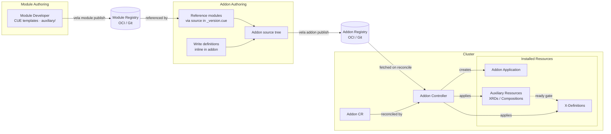
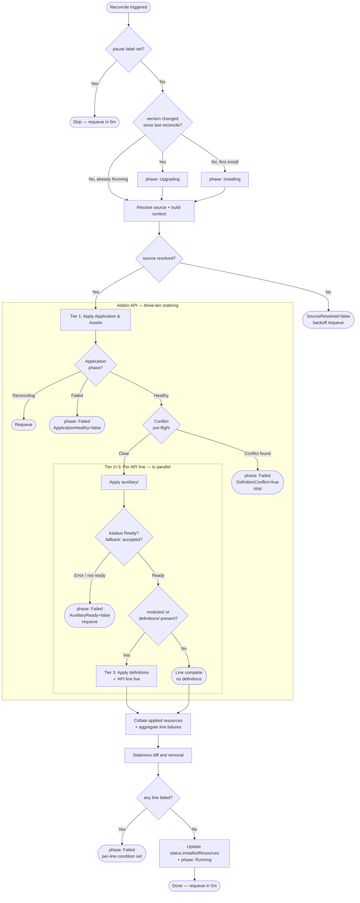
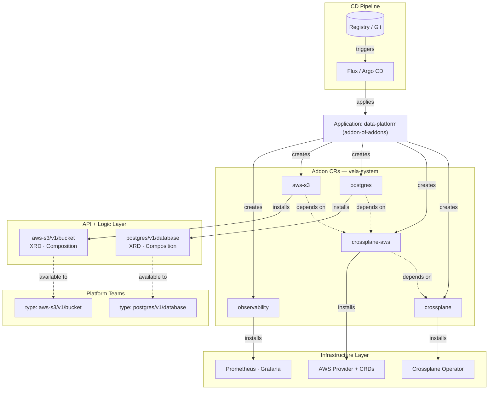
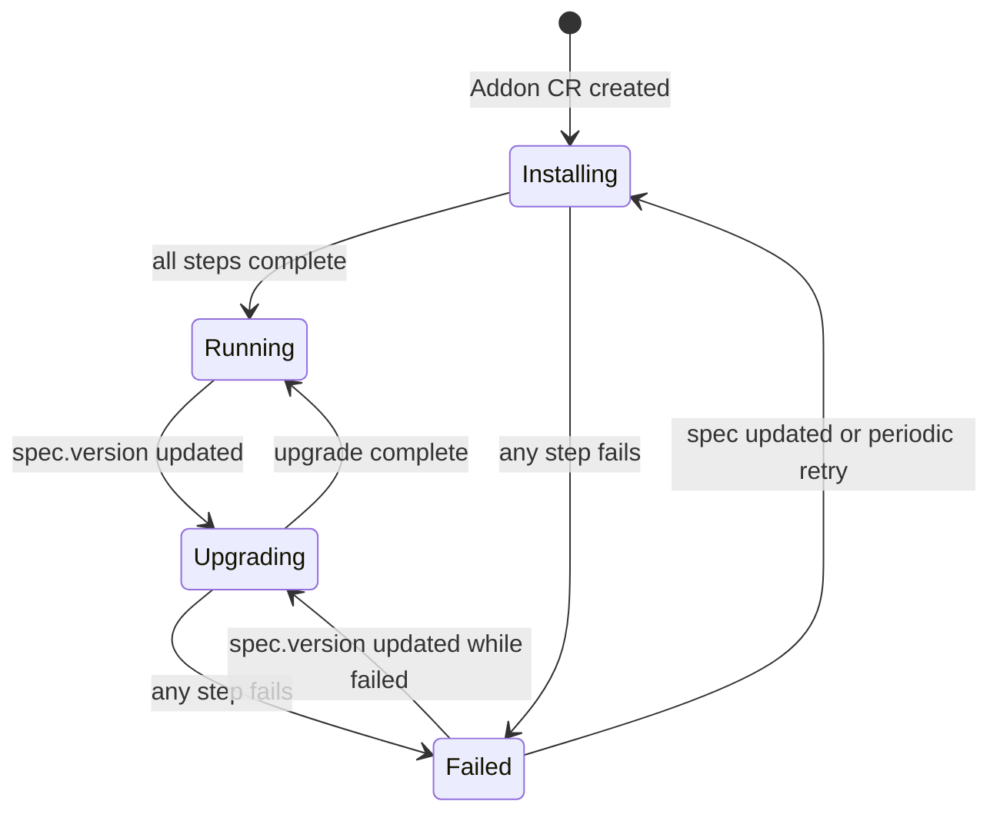

# KEP-2.13: Declarative Addon Lifecycle

**Status:** Ready for Review
**Parent:** [vNext Roadmap](../README.md)

Addons are the **delivery and distribution mechanism** for versioned X-Definition APIs. The module identity model, API line versioning, and definition naming convention that make those APIs stable and manageable are covered in [KEP-2.20](../2.20-module-versioning/README.md). This KEP covers the declarative addon lifecycle that powers that delivery: continuous reconciliation of the `Addon` CR, drift correction, and addon-of-addons composition.

Together, KEP-2.13 and KEP-2.20 form the complete declarative addon delivery model — KEP-2.20 defines the versioned API contract, KEP-2.13 defines how that contract is reliably delivered and kept in sync with the cluster.

## Problem

KubeVela addons today are installed imperatively via `vela addon enable` and managed one version at a time:

- **Imperative and one-shot**: `vela addon enable` is a single operation, not a continuously reconciled loop. The addon's owned Application drift-corrects its `resources/` components, but definitions, Views, ConfigTemplates, and Schemas are applied separately as auxiliary outputs outside the Application's `spec.components` — the Application controller has no knowledge of them, so out-of-band changes (manual edits, accidental deletes) are never detected or healed.
- **No GitOps support**: There is no CR that represents "addon X at version Y should be installed". Platform teams cannot declare addon state in git and have a controller drive the cluster toward it.
- **No context-aware installation**: Addon definitions cannot gate themselves on cluster capabilities without custom wrapper tooling.
- **Monolithic addon disable**: `vela addon disable` removes all installed definitions immediately, with no mechanism to defer removal until Applications have migrated.
- **Addon updates are dangerous**: When an addon author ships a new version that changes a definition's parameter schema, the change lands immediately on every consumer. There is no migration window, no coexistence period, and no warning — Applications using the definition either break silently or start rendering differently.
- **No composition model**: Installing multiple related addons with version pinning requires manual coordination.
- **No versioned API delivery**: Without continuous reconciliation, the X-Definition versioning model in KEP-2.20 cannot be reliably enforced — drift correction and deprecation lifecycle management require a continuously reconciled delivery layer.

## Goals

- Establish the `Addon` CR as the declarative delivery unit for versioned X-Definition APIs
- Extend the `Addon` CR to be continuously reconciled — a GitOps-compatible declaration of desired addon state
- Enable drift correction — re-apply definitions removed out of band, preserving the API contract
- Enable context-aware line installation via CueX-evaluated `enabled` in `_version.cue` (see KEP-2.20)
- Enable addon composition via the OAM Application model with a new `addon` component type
- Maintain full backwards compatibility with existing addons

## Overview



Modules are independently versioned and published to a registry. Addon authors either reference published modules (pulling definitions and auxiliary resources at install time via `source` in `_version.cue`) or write definitions directly inline in the addon source tree. The addon is published to a registry and installed by creating an `Addon` CR. The Addon controller fetches the source, creates the owned Application for infrastructure resources, applies auxiliary resources, and — once those are ready — applies the X-Definitions that platform teams consume.

The design has two explicit layers: the **Addon CR** is the declarative GitOps-facing interface that expresses desired addon state, and the **generated Application** in `vela-system` is the payload representation — the existing addon vehicle through which all installed resources are owned, tracked, and cleaned up. The Addon controller bridges the two, translating Addon CR desired state into Application content and resource operations on every reconcile cycle.

## Declarative Addon CR

This KEP introduces the `Addon` CR as the primary declarative unit for addon management — a desired-state declaration that the addon controller continuously reconciles. The controller realises that desired state by keeping a generated Application in `vela-system` aligned with the Addon CR: the Application is the pre-existing addon payload vehicle, preserved and reused; the Addon CR is the new GitOps-facing layer on top of it. See [Implementation Philosophy](#implementation-philosophy) for the "wrap, don't replace" rationale.

`Addon` is a **cluster-scoped** CRD — it represents a platform-wide capability, not a namespaced resource. The Application that the addon controller generates to carry the addon's payload is namespaced to `vela-system`.

```yaml
apiVersion: core.oam.dev/v1beta1
kind: Addon
metadata:
  name: aws-s3
spec:
  version: v1.2.0       # exact tag — pinned mode (recommended)
  # version: ">=1.2.0"  # semver constraint — tracking mode (requires upgradePolicy)
  # upgradePolicy: Manual  # default; notify on newer match but do not upgrade
  # upgradePolicy: Auto    # upgrade automatically when a newer match is found
  registry: my-registry
  parameters:
    region: us-east-1
    enableV2: true
  clusters:
    - local        # omit to deploy to all registered clusters (current default)
    # - cluster1   # add clusters explicitly for multi-cluster rollout
  overrideDefinitions: false
  skipVersionCheck: false
```

`vela addon enable aws-s3 --version v1.2.0` now creates or patches an `Addon` CR rather than directly invoking installation logic. The CLI and GitOps workflows are interchangeable — both operate on the same CR. See [CLI Commands](#cli-commands) for the full command set including local development mode.

Reconciliation is suspended by setting the label `controller.core.oam.dev/pause: "true"` on the `Addon` CR — consistent with how Application reconciliation is paused.

## Reconciliation Semantics

The addon controller reconciles continuously — on every change to the `Addon` CR and at a configurable periodic interval (default: 5 minutes).

The reconcile loop follows a strict three-tier ordering designed to ensure that no API surface is published until the infrastructure backing it is operational and ownership is unambiguous:

1. **Infrastructure first** — the owned Application (operators, CRDs, platform resources) is applied and must reach healthy status before anything else proceeds.
2. **Auxiliary readiness** — per-API-line auxiliary resources (XRDs, Compositions) are applied and gated on kstatus readiness. Only once a line's auxiliary resources are ready does that line's definitions become eligible for application.
3. **Definitions last** — definitions are the go-live signal. Applying a definition makes a new API type visible to all Application authors on the cluster. The ordering ensures that by the time a definition is applied, the infrastructure and compositions it depends on are already operational.

A definition conflict pre-flight runs between tiers 1 and 2 as a global check: if any definition the addon would install is already owned by a different addon (or is unowned), reconciliation stops before any definitions or per-line work begins.

On each cycle:

1. Check whether `spec.version` differs from `status.installedVersion` — if so, set `phase: upgrading`; if this is the first install, set `phase: installing`. Setting the phase before any work ensures status is meaningful during in-progress reconciles. On every reconcile, the source is re-fetched and re-rendered against the current CUE context — rendered outputs are never cached, since cluster context and parameters may change between reconciles. The remote digest (OCI manifest digest or Git commit SHA) is resolved cheaply first (OCI HEAD request / `git ls-remote`); if it matches `status.resolvedSourceDigest` a full re-fetch can be skipped and the source re-rendered from a local copy. If the remote is unreachable, set `SourceResolved=false` condition and requeue with exponential backoff (initial 30s, max 10m) — no stale rendered output is applied. The Addon phase remains at its current value (not set to `failed`) so that a transient registry outage does not trigger downstream alerts; persistent failure beyond the max backoff window surfaces as `phase: failed`.

> **Implementation note — source caching strategy:** Whether to cache raw source files (in-memory LRU, filesystem tarballs à la Flux source-controller, or no cache with always-fetch) is an implementation decision to be made based on observed performance. The digest-based change detection above is the important design constraint; the caching mechanism is an optimisation detail. Flux stores fetched artifacts as compressed tarballs on the filesystem served via a local HTTP server, avoiding memory pressure entirely — this is the reference approach if caching proves necessary.
2. Resolve the addon source from `spec.registry` and `spec.version`
3. Build addon context: query all `Config` resources in `vela-system` labelled `addon.oam.dev/cluster-context: "true"`, merge their values, and inject into the shared context for `_module.cue` and `_version.cue` evaluation (see KEP-2.20 — Cluster Context)
4. Apply addon-wide assets: create or update the owned Application CR — the payload representation of the addon, which owns and tracks all installed resources — rendering it from the top-level `resources/` content; apply `ConfigTemplate` resources; apply VelaQL `View` resources; apply UI `Schema` resources
5. Check the owned Application's health: inspect `status.conditions` for a condition of type `Ready` — if `status: "True"` the Application is healthy; if the Application's `status.phase` is `workflowFailed`, `workflowTerminated`, or if any component reports an error condition, set Addon `phase: failed` with `ApplicationHealthy=false`; if none of these match (e.g. `phase: rendering`, `phase: running` but not yet `Ready`), requeue and wait. **No definitions are applied until this gate passes** — infrastructure must be operational before any API surface is exposed.
6. **Definition conflict pre-flight (global):** if `spec.overrideDefinitions` is false, check every definition this addon would install against the cluster. If any definition already exists under a different owner (a different addon, or no owner), set `phase: failed` and `DefinitionConflict=True` with the condition message listing each conflicting definition name and its current owner. **Stop — no definitions are applied, no API lines proceed.** This check is global and all-or-nothing: a single conflict blocks the entire addon, not just the affected line. The operator must remove or retransfer the conflicting definition, or set `spec.overrideDefinitions: true`, before the next reconcile can proceed.
7. For each enabled API line (in parallel): apply `auxiliary/` resources via server-side apply; wait for readiness using kstatus: poll each resource for a `Ready` or `Established` condition with `status: "True"` (standard kstatus semantics). Resources that expose no kstatus conditions are considered ready once accepted by the API server without error — this is a best-effort gate for non-kstatus-compliant resources. Once the line's auxiliary resources are ready, apply definitions — definitions are the go-live gate for that line. Lines run in parallel; if one line fails, the others continue. After all parallel work completes, if any line failed the Addon phase is set to `failed` with the `AuxiliaryReady` or `ModulesSynced` condition recording which lines failed and why. The field manager string for all Addon controller SSA writes is `addon.oam.dev/controller`.
8. If `modules/` is present: module lifecycle semantics run within step 7 per API line (see KEP-2.20). If `definitions/` is present: definitions are applied at the end of step 7 after the Application health gate and conflict pre-flight. Both paths are independent and can coexist — `definitions/` is a permanent valid authoring path, not a migration target.
9. Run stale resource cleanup: compare `status.installedResources` from the previous reconcile against the set of resources produced by the current render. Hard-delete any metadata resources (Views, ConfigTemplates, Schemas) present in the previous set but absent from the current one. For definitions and auxiliary resources, skip hard-delete — they remain on the cluster. Deprecated resources (carrying `definition.oam.dev/deprecated: "true"`) follow the deprecation lifecycle in KEP-2.20; non-deprecated stale resources are retained indefinitely until explicitly removed by an operator. Update `status.installedResources` with the current set. Set `phase: running`.

For auxiliary resources that do not expose kstatus conditions, the tier-2 readiness guarantee is best-effort (API server acceptance only). See KEP-2.20 (Two-Tier Resource Model) for the broader rationale behind infrastructure-first ordering.

**Stale resource cleanup on upgrade** — the existing addon installer is purely additive: upgrading from v1.0.0 to v1.1.0 never removes resources that were installed by the old version but are absent from the new one. The new reconciler introduces cleanup on upgrade, with the strategy determined by a single question: **does a running Application depend on this resource at reconcile time?**

| Resource | Runtime dependency | On upgrade removal |
|---|---|---|
| Definitions | Yes — Applications bind to them by type | Deprecation lifecycle (KEP-2.20); never hard-deleted |
| Auxiliary (`auxiliary/`) | Yes — Compositions/XRDs back active Claims | Deprecation lifecycle; never hard-deleted |
| VelaQL Views | No — tooling/UI query metadata | Hard delete |
| ConfigTemplates | No — template metadata; existing Config instances are separate resources | Hard delete |
| Schemas | No — VelaUX rendering metadata | Hard delete |

The staleness diff uses `status.installedResources` — populated at the end of each reconcile from the set of resources actually applied — as its inventory. On the next reconcile, the controller compares the freshly rendered set against this inventory. Resources present in the inventory but absent from the rendered set are stale.

For Views, ConfigTemplates, and Schemas: stale resources are hard-deleted immediately. Stale metadata left in place causes user-visible pollution — ghost queries in the VelaQL catalogue, phantom config types in the UI.

For definitions and auxiliary resources: the staleness diff runs the same comparison, but hard-delete is skipped. These resources have runtime dependencies — Applications bind to definitions by type, and Compositions/XRDs back active Claims — so removal follows the deprecation lifecycle (KEP-2.20) rather than immediate delete. The Application controller does not track definitions as components and will never remove them independently of the Addon controller.

> **Note — label query vs inventory diff:** Labels (`addons.oam.dev/name`) are used to *populate* `status.installedResources` after each apply (querying all resources belonging to this addon). The staleness *diff* is then computed from that recorded inventory, not by re-querying labels on every reconcile. This means the inventory is always one reconcile cycle behind — a resource applied in cycle N appears in the inventory used for the diff in cycle N+1.



The existing `pkg/addon/` install and upgrade logic handles source loading, rendering, and all apply operations. The Addon controller wraps this with phase management and contributes two new steps that do not exist today: the Application health gate (currently the controller proceeds immediately without waiting) and the post-install resource collection + staleness diff. Applied resources are collected by querying resources labelled `addons.oam.dev/name: {addon-name}` — this gives the full current set, which is written to `status.installedResources` and used as the basis for the next reconcile's staleness check.

> **Auxiliary readiness gate — design decision:** The controller gates definition application on auxiliary resource readiness using kstatus: a resource is considered ready when it has a condition of type `Ready` or `Established` with `status: "True"` (standard kstatus semantics). Resources that expose no kstatus conditions — such as bare Crossplane `Composition` objects — are considered ready once accepted by the API server without error. This is a known limitation: for non-kstatus-compliant resources the gate is best-effort only, and definitions may be applied before those resources are fully operational. Addon authors using auxiliary resources that require genuine readiness guarantees should ensure those resources expose kstatus-compatible conditions. When definitions are applied after a best-effort gate pass, no condition is set to indicate that auxiliary was not fully operational at that point — the safety guarantee is best-effort only and is not separately observable in the Addon CR status.

| Event | Controller action |
|---|---|
| Addon CR created | Evaluate context; apply addon-wide assets & Application; once Application healthy, run conflict pre-flight (on conflict: set `DefinitionConflict=True`, stop); apply auxiliary resources per API line; once ready, apply definitions |
| Addon CR updated | Re-evaluate context; update addon-wide assets; once Application healthy, run conflict pre-flight (on conflict: set `DefinitionConflict=True`, stop); update auxiliary per line; once ready, update definitions |
| Addon CR updated with new `spec.version` | Re-evaluate context; upgrade addon-wide assets; once Application healthy, run conflict pre-flight (on conflict: set `DefinitionConflict=True`, stop); update auxiliary per line; once ready, update definitions |
| Addon CR deleted | Finalizer runs per `spec.deletionPolicy`: `Protect` blocks if any Application references an addon definition; once clear, deletes the owned Application and ResourceTracker GC explicitly removes all tracked resources. `Force` deletes the owned Application immediately; ResourceTracker GC removes all tracked resources. `Orphan` releases the finalizer without deleting the Application — definitions and aux resources remain on the cluster unmanaged. |
| Periodic reconcile | Same as update — re-evaluate and re-apply all assets in order; server-side apply is idempotent |

The controller uses a finalizer (`addon.oam.dev/cleanup`) to ensure ordered cleanup on deletion.

## Version Selection

Addon version selection has two modes, controlled by the shape of `spec.version` and the value of `spec.upgradePolicy`.

### Pinned mode (default, recommended for GitOps)

Set `spec.version` to an exact tag:

```yaml
spec:
  version: v1.2.0
```

The controller installs exactly this version. `spec.version` is never mutated autonomously. The cluster state always matches what is declared in git. This is the correct choice for most production environments.

`upgradePolicy` is ignored in pinned mode. To upgrade, update `spec.version` in git (or run `vela addon upgrade --version v1.3.0`).

### Tracking mode — `Manual` is GitOps-safe; `Auto` is opt-in

Set `spec.version` to a semver constraint:

```yaml
spec:
  version: ">=1.2.0"
  upgradePolicy: Manual  # default — notify but do not upgrade autonomously
```

The controller resolves the constraint against the registry on every periodic reconcile cycle, finding the highest matching version. What happens next depends on `spec.upgradePolicy`:

**`Manual` (default)** — if the resolved version is newer than `status.installedVersion`, the controller writes it to `status.availableUpgrade` and sets an `UpgradeAvailable` condition. Nothing is installed or changed. The operator applies the upgrade explicitly:

```bash
vela addon upgrade aws-s3 --version v1.4.0  # or update spec.version in git
```

This preserves GitOps determinism: upgrades are explicit, auditable events. `spec.version` in git never diverges from what is running.

**`Auto`** — if the resolved version is newer than `status.installedVersion`, the controller upgrades immediately without any operator action. `spec.version` is not mutated; the installed version is visible in `status.installedVersion` but **does not appear in git**. This means the cluster is running a version that is not recorded in the GitOps source of truth — upgrades are invisible to git history, audit logs, and pull request review.

```yaml
spec:
  version: ">=1.2.0"
  upgradePolicy: Auto
```

> **Operator guidance:** `Auto` is appropriate only when continuous delivery of the latest matching version is explicitly desired and the consequences are understood: definitions may change on any reconcile cycle, Applications consuming those definitions may break on major version bumps, and there is no git-visible record of when or why an upgrade occurred. For production platform APIs, `Manual` tracking or pinned mode is strongly preferred.

### Version omitted

If `spec.version` is omitted, the controller resolves to the latest available version at install time, installs it, and records the result in `status.installedVersion`. `spec.version` is not written back — subsequent reconciles treat the absence of a version constraint as "no change required" and do not re-resolve. The effective behaviour is a one-time pin to whatever was latest at install time.

**Not recommended for GitOps environments.** When `spec.version` is omitted, the installed version is only visible in `status.installedVersion` — not in the spec declared in git. The git representation of the Addon CR does not record what version is actually running, making it impossible to audit, reproduce, or reason about the installed state from the source of truth alone. Always set an explicit version in GitOps workflows.

### Summary

| `spec.version` | `spec.upgradePolicy` | Behaviour |
|---|---|---|
| Exact tag (`v1.2.0`) | any (ignored) | Pinned. Never changes autonomously. |
| Semver constraint | `Manual` (default) | Resolves on each reconcile; records candidate in `status.availableUpgrade`; does not upgrade. |
| Semver constraint | `Auto` | Resolves on each reconcile; upgrades immediately when a newer match is found. |
| Omitted | any (ignored) | Resolves latest at install time; behaves as a pin thereafter. |

## Ownership Model

> This section documents the existing ownership and cleanup mechanism. The core model — Application as payload owner, ResourceTracker GC for terminal cleanup — is preserved unchanged. This KEP adds one new mechanism on top: the Addon controller's staleness diff, which explicitly deletes stale metadata resources (Views, ConfigTemplates, Schemas) during upgrades without requiring an Application deletion. This section is included because the ownership model is not stated anywhere in the current codebase documentation and is a prerequisite for understanding the reconciliation semantics above.

```
Addon CR ──(finalizer gates deletion of)──► Application ──(ResourceTracker GC)──► Definitions
                                                                                    Auxiliary resources
                                                                                    Views / Schemas / ConfigTemplates
```

**Addon CR — lifecycle gate.** The Addon CR is the declarative desired state for the addon. A single finalizer (`addon.oam.dev/cleanup`) is the sole authority over when the owned Application is deleted. `spec.deletionPolicy` controls the conditions under which the finalizer releases: `Protect` waits until no Application references an addon definition; `Force` releases immediately; `Orphan` releases without deleting the Application at all.

**Application — payload representation and structural owner.** The Application in `vela-system` is the pre-existing addon vehicle that this KEP preserves: it is the concrete representation of what the addon has installed on the cluster. All addon-installed resources carry `ownerReferences` pointing to it (`addOwner()` in `pkg/addon/addon.go`). When the Application is deleted, the Application controller's ResourceTracker GC — KubeVela's own multi-generation tracking and explicit-delete engine — iterates through all tracked resources and deletes them, including cluster-scoped resources such as `ComponentDefinition` and `TraitDefinition`. This is distinct from Kubernetes' built-in cascade GC: the ResourceTracker finalizer loop handles cross-scope deletion that native GC cannot (a namespace-scoped Application cannot own a cluster-scoped resource via Kubernetes GC, but the ResourceTracker engine deletes them explicitly regardless of scope).

**Addon controller — reconciliation engine.** On every reconcile cycle the controller re-renders the addon source, SSA-applies all resources (adding and updating), and hard-deletes stale metadata resources (Views, ConfigTemplates, Schemas) explicitly via a staleness diff. The controller never deletes the Application itself except through the finalizer path on Addon CR deletion.

### Cleanup Responsibility

Two distinct mechanisms clean up addon resources. They apply to different resource types and fire at different lifecycle events:

| Resource type | Cleanup mechanism | When it fires |
|---|---|---|
| Definitions (`ComponentDefinition`, `TraitDefinition`, …) | ResourceTracker GC (Application controller finalizer, explicit delete) | Application deleted |
| Auxiliary resources (Crossplane CRDs, `Compositions`, …) | ResourceTracker GC (Application controller finalizer, explicit delete) | Application deleted |
| Views, Schemas, ConfigTemplates | Addon controller staleness diff (explicit delete) | Every reconcile when absent from the current rendered set |
| Views, Schemas, ConfigTemplates | ResourceTracker GC (Application controller finalizer, explicit delete) | Application deleted |

Views, Schemas, and ConfigTemplates appear in two rows because both mechanisms apply to them at different points in the lifecycle: the staleness diff removes them incrementally during upgrades (so the cluster stays clean without an Application deletion), and ResourceTracker GC removes any remaining ones as part of terminal cleanup when the Application is deleted. Definitions and auxiliary resources are only cleaned up at Application deletion — incremental removal during upgrades is handled by the deprecation lifecycle (KEP-2.20), not by hard-delete.

### Ownership Metadata

Resource ownership is tracked through two complementary mechanisms:

**Labels on installed resources** — every resource applied by the addon controller carries:
- `addons.oam.dev/name: {addon-name}` — identifies the owning addon
- `addons.oam.dev/version: {version}` — records the installed version

These labels allow the controller to list all resources belonging to an addon with a single label selector query, independent of ResourceTracker state.

**Annotations on the addon Application** — the Application records which definitions the addon created, as comma-separated name lists:
- `addon.oam.dev/componentDefinitions`
- `addon.oam.dev/traitDefinitions`
- `addon.oam.dev/workflowStepDefinitions`
- `addon.oam.dev/policyDefinitions`

The `Protect` deletion policy uses these annotations to scan all Applications on the cluster and check whether any component, trait, workflow step, or policy references an addon-installed definition before allowing the finalizer to proceed.

### Deprecation vs Deletion

Definition deprecation — marking a definition as superseded while leaving it available for existing consumers during a migration window — is a versioned API concern, not an addon lifecycle concern. It is handled at the definition level by KEP-2.20's API line versioning model. From KEP-2.13's perspective a definition is either present (applied by the controller) or absent (removed by the staleness diff or ResourceTracker GC); there is no intermediate deprecated-but-retained state managed here.

### Orphan Policy Gap

`DeletionPolicy: Orphan` releases the finalizer without deleting the Application. The Application and all owned resources remain on the cluster as **unmanaged** resources — no controller reconciles them and no Addon CR gates their lifecycle. A subsequent out-of-band deletion of the Application (by a human, a GitOps tool, or an accidental `kubectl delete`) will trigger the Application controller's ResourceTracker GC, which will explicitly delete all tracked definitions and auxiliary resources with no Addon-level protection or warning. This is intentional: the operator has explicitly chosen to release management control entirely. Operators choosing `Orphan` should document this and understand that any future Application deletion will be destructive.

## Addon-of-Addons Composition

Multiple addons can be composed into a capability set using the OAM Application model with a new built-in `addon` component type:

```yaml
apiVersion: core.oam.dev/v1beta1
kind: Application
metadata:
  name: data-platform
  namespace: vela-system
spec:
  components:
    - name: aws-s3           # name defaults to component name "aws-s3"
      type: addon
      properties:
        version: v1.3.0      # pinned
        parameters:
          region: us-east-1

    - name: postgres
      type: addon
      properties:
        version: v2.1.4      # pinned
        include:
          resources: false    # skip Application resources (no operator install); install definitions and auxiliary only

    - name: observability
      type: addon
      properties:
        version: v3.0.1      # pinned
        parameters:
          retention: 30d
```

To use tracking mode with automatic upgrades, set `upgradePolicy: Auto` explicitly. This is not recommended for production platform APIs — upgrades happen on any reconcile cycle and do not appear in git history:

```yaml
    - name: aws-s3
      type: addon
      properties:
        version: ">=1.2.0"        # semver constraint — tracking mode
        upgradePolicy: Auto       # upgrades automatically; not GitOps-safe
        parameters:
          region: us-east-1
```

The `addon` component type causes the Application controller to create or update `Addon` CRs for each component. Dependency ordering between addon components follows the existing OAM resource dependency model.

The following diagram shows how addon-of-addons can be used to compose a complete data platform from independent building blocks, delivered as a single GitOps unit:



A single Application in `vela-system` declares the entire platform capability set. Dependency ordering is enforced by the Application workflow — each addon component can declare `dependsOn` relationships, and the workflow will not advance to a dependent component until the upstream component's health check passes. The `addon` component type reports health by surfacing the Addon CR's `phase: running` and `Ready` condition back to the Application; a dependency that is still `installing` or `failed` holds the workflow at that step.

The composition is recursive — the `crossplane` addon is itself an addon-of-addons, internally bundling `crossplane-operator` and `crossplane-aws` as its own components. The `data-platform` author declares a single `crossplane` dependency; the crossplane addon author owns the internal wiring. Platform teams consume the resulting typed APIs without needing to know which addons back them.

### Addon CR Naming

The Addon CR name equals the addon name — `{name}` from `AddonComponentProperties`. Installing two components with the same `name` updates the same Addon CR.

> **Multi-instance addons** (where the Addon CR name is derived from instance parameters via `instance` in `_module.cue`) are deferred to [KEP-2.22](../2.22-multi-instance-addons/README.md). The `instance` field is reserved but not implemented in the initial delivery.

## CLI Commands

The `vela addon` subcommand is updated to operate on `Addon` CRs rather than invoking installation logic directly. The CLI is a thin CR writer — the controller does the actual work.

### Standard commands (CR-backed)

```bash
# Create or patch an Addon CR — equivalent to applying the YAML below
vela addon enable aws-s3 --version v1.2.0 --registry my-registry

# Delete the Addon CR (uses spec.deletionPolicy; defaults to Protect)
vela addon disable aws-s3

# Disable with an explicit policy override
vela addon disable aws-s3 --deletion-policy Force

# Patch spec.version; controller runs the upgrade path
vela addon upgrade aws-s3 --version v1.3.0

# List all Addon CRs and their phase/conditions
vela addon list

# Show full status for a single addon — phase, conditions, installed lines, blocked refs
vela addon status aws-s3
```

`vela addon enable` produces (or patches) an `Addon` CR and exits — it does not block waiting for the controller. Use `vela addon status aws-s3` or `kubectl wait addon/aws-s3 --for=condition=Ready` to observe progress.

`vela addon disable` patches `spec.deletionPolicy` to the requested value (defaulting to the existing value if already set) and then deletes the CR. Under `Protect`, the delete call will be blocked by the finalizer if referencing Applications exist; the CLI surfaces the blocking condition rather than hanging.

### Local development mode

For testing an addon source tree directly against a cluster — without publishing to a registry or creating an Addon CR:

```bash
# Apply the full addon directly to the current kubectl context
# Follows the same ordering as the controller: Application first,
# wait healthy, conflict pre-flight, aux per API line, wait ready, definitions last.
# No Addon CR is created; no registry is involved.
vela addon apply --local ./my-addon

# Apply a single module within a local addon tree
vela addon apply --local ./my-addon --module aws-s3

# Apply a specific API line only
vela addon apply --local ./my-addon --module aws-s3 --line v1

# Dry-run: show what would be applied without touching the cluster
vela addon apply --local ./my-addon --dry-run
```

`vela addon apply --local` is the inner development loop for addon authors. It is intentionally separate from `vela addon enable` to make the boundary between "testing locally" and "declaring desired cluster state" explicit — running `--local` does not leave a reconciling CR behind, so drift correction is not active. Resources applied this way are unmanaged until an Addon CR is created.

> **Relationship to `vela module deploy`** — `vela module deploy` (KEP-2.20) targets a single module within a larger addon tree and is aimed at module authors iterating on definitions and auxiliary resources in isolation. `vela addon apply --local` operates on the full addon — including the top-level `resources/` Application — and is aimed at addon authors testing the complete installation end-to-end.

## API Changes

### Owned Application Labels and Annotations

The Application created by the Addon controller (`addon-{name}` in `vela-system`) carries the following metadata. Labels are used for selection (identifying and grouping resources); annotations carry controller metadata not suitable for indexing.

```
Labels:
  addons.oam.dev/name:      {addon-name}        # existing — selects all resources belonging to this addon
  addons.oam.dev/version:   {installed-version} # existing — installed semver tag
  addons.oam.dev/registry:  {registry-name}     # existing — source registry

Annotations:
  addons.oam.dev/addon-uid: {addon-cr-uid}      # UID of the owning Addon CR; used for ownership verification, not selection
```

The `addons.oam.dev/addon-uid` annotation is written at Application create time and verified on every reconcile. A mismatch (e.g. the Addon CR was deleted and recreated) indicates a stale Application; the controller re-adopts it under the new Addon CR by resetting the annotation.

No owner reference is set from the Application to the Addon CR. Owner references would cause Kubernetes GC to cascade-delete the Application when the Addon CR is deleted, bypassing the finalizer and making `Orphan` deletion policy unimplementable. Deletion is fully controlled by the finalizer, which respects `spec.deletionPolicy`.

The same `addons.oam.dev/name` label is applied to all addon-installed resources (definitions, auxiliary resources, Views, ConfigTemplates, Schemas) enabling fleet-level queries — e.g. "all resources installed by the aws-s3 addon".

### Extended Addon CR Spec

```go
type AddonSpec struct {
    // Version is an exact semver tag (e.g. "v1.2.0") or a semver constraint
    // (e.g. ">=1.2.0", "~2.1.0", "^1.0.0").
    //
    // Exact tag — Pinned mode. The controller installs exactly this version and
    // never changes it autonomously. This is the recommended default for GitOps
    // workflows: the cluster state always matches what is declared in git.
    //
    // Semver constraint — Tracking mode. The controller resolves the constraint
    // against the registry on every periodic reconcile. What happens when a newer
    // matching version is found depends on spec.upgradePolicy.
    //
    // Omitting version resolves to the latest available version at install time
    // and is immediately written as a pinned exact tag in status.installedVersion.
    // The spec.version field is not mutated — subsequent reconciles treat it as
    // "no constraint" and do not re-resolve.
    Version             string                 `json:"version,omitempty"`
    // UpgradePolicy controls autonomous upgrade behaviour when spec.version is a
    // semver constraint (tracking mode). Ignored when spec.version is an exact tag.
    // Defaults to Manual.
    UpgradePolicy       AddonUpgradePolicy     `json:"upgradePolicy,omitempty"`
    Registry            string                 `json:"registry,omitempty"`
    Parameters          map[string]interface{} `json:"parameters,omitempty"`
    // Clusters lists the cluster names to deploy the addon's Application to.
    // Translated at reconcile time into an OAM topology policy on the owned Application.
    // Omitting this field deploys to all registered clusters — consistent with the
    // existing addon system behaviour.
    //
    // Existing behaviour: this field only takes effect if the addon's parameter.cue
    // defines a "clusters" parameter (types.ClustersArg = "clusters"). Addons that do
    // not declare this parameter in their API schema ignore spec.clusters entirely —
    // the field is a no-op for those addons. This is inherited from the current addon
    // system and is not changed by this KEP.
    //
    // Example — local cluster only:
    //   clusters: [local]
    // Example — explicit multi-cluster:
    //   clusters: [local, cluster1, cluster2]
    //
    // > **Implementation note:** At implementation time, evaluate whether the default
    // > should be changed to local-only. A local-only default would be safer for
    // > GitOps workflows (explicit opt-in for multi-cluster rollout) but would differ
    // > from the existing addon behaviour. If changed, the inheritance sweep must
    // > reconstruct spec.clusters from the legacy Application's topology policy rather
    // > than relying on the new default, to avoid silently narrowing the rollout scope
    // > for existing multi-cluster addons.
    //
    // Longer-term this field will be superseded by KEP-2.19 named topology groups.
    Clusters            []string               `json:"clusters,omitempty"`
    // OverrideDefinitions allows the addon to overwrite definitions that already exist
    // on the cluster under a different owner (i.e. owned by a different addon, or
    // not owned by any addon). When false (default), the presence of any such
    // definition fails the reconciliation immediately — phase is set to Failed and
    // a DefinitionConflict condition is set listing each conflicting definition name
    // and its current owner. No definitions are applied, ensuring the install is
    // never partially successful. The operator must either remove the conflicting
    // definition, transfer ownership, or set overrideDefinitions: true to proceed.
    OverrideDefinitions bool                   `json:"overrideDefinitions,omitempty"`
    // SkipVersionCheck bypasses the minKubeVelaVersion compatibility check declared in
    // the addon's metadata. Use with caution — skipping the check may result in
    // installing an addon against an incompatible KubeVela version.
    SkipVersionCheck    bool                   `json:"skipVersionCheck,omitempty"`
    // DeletionPolicy controls what happens when the Addon CR is deleted.
    // Defaults to Protect. See Deletion Policy below.
    DeletionPolicy      AddonDeletionPolicy    `json:"deletionPolicy,omitempty"`
}

// AddonUpgradePolicy controls when the controller acts on a newly resolved version
// in tracking mode (spec.version is a semver constraint).
type AddonUpgradePolicy string

const (
    // AddonUpgradePolicyManual (default) — when the constraint resolves to a version
    // newer than status.installedVersion, the controller writes the candidate to
    // status.availableUpgrade and sets an UpgradeAvailable condition, but does not
    // upgrade. The operator applies the upgrade by updating spec.version to the
    // candidate (or by running `vela addon upgrade`).
    // This preserves GitOps determinism: spec.version in git always matches what
    // is running, and upgrades are explicit, auditable events.
    AddonUpgradePolicyManual AddonUpgradePolicy = "Manual"

    // AddonUpgradePolicyAuto — when the constraint resolves to a version newer than
    // status.installedVersion, the controller upgrades immediately. spec.version is
    // not mutated; the installed version is visible in status.installedVersion.
    // Use when continuous delivery of the latest matching version is explicitly
    // desired and the operational implications (automatic definition changes,
    // potential Application breaks on major bumps) are understood and accepted.
    AddonUpgradePolicyAuto  AddonUpgradePolicy = "Auto"
)

// AddonDeletionPolicy controls the finalizer behaviour when an Addon CR is deleted.
type AddonDeletionPolicy string

const (
    // AddonDeletionPolicyProtect (default) — the finalizer blocks deletion if any
    // Application on the cluster references a definition installed by this addon.
    // Once no referencing Applications exist, the finalizer deletes the owned
    // Application; the Application controller's ResourceTracker GC then explicitly
    // deletes all tracked resources, including cluster-scoped definitions.
    AddonDeletionPolicyProtect AddonDeletionPolicy = "Protect"

    // AddonDeletionPolicyForce — the finalizer deletes the owned Application
    // immediately regardless of active references; the Application controller's
    // ResourceTracker GC explicitly deletes all tracked resources. Existing
    // Applications that reference addon definitions will break. Intended for
    // cluster teardown or emergency cleanup.
    AddonDeletionPolicyForce   AddonDeletionPolicy = "Force"

    // AddonDeletionPolicyOrphan — the finalizer is released without deleting the
    // owned Application. All addon-installed resources (definitions, auxiliary,
    // Views, ConfigTemplates, Schemas) remain on the cluster as unmanaged resources.
    // Useful when decommissioning addon management while keeping the capability running.
    AddonDeletionPolicyOrphan  AddonDeletionPolicy = "Orphan"
)
```

> **Implementation note:** `Protect` requires a scan for Applications referencing this addon's definitions at deletion time — an O(n Applications) query. This only runs when the Addon CR is being deleted, not on every reconcile, so the cost is acceptable.

### `addon` Component Type

The `addon` component type is a built-in `ComponentDefinition` shipped with KubeVela core. It renders an `Addon` CR from the component properties. The application controller treats it identically to any other component type; the addon controller reconciles the resulting `Addon` CR through its normal loop.

```go
type AddonComponentProperties struct {
    // Name is the addon name. Defaults to the component name if omitted.
    Name       string                 `json:"name,omitempty"`
    Registry   string                 `json:"registry,omitempty"`
    // Version is passed through directly to spec.version on the rendered Addon CR.
    // Accepts an exact tag ("v1.2.0") or a semver constraint (">=2.0.0", "~8.0.0",
    // "^1.0.0"). Version resolution and upgrade behaviour are governed by the Addon
    // CR's spec.upgradePolicy — see Version Selection for details.
    Version       string                 `json:"version,omitempty"`
    // UpgradePolicy is passed through to spec.upgradePolicy on the rendered Addon CR.
    // Defaults to Manual. See AddonUpgradePolicy for semantics.
    UpgradePolicy AddonUpgradePolicy     `json:"upgradePolicy,omitempty"`
    Parameters map[string]interface{} `json:"parameters,omitempty"`
    // Clusters is passed through to spec.clusters on the rendered Addon CR.
    // Omitting deploys to all registered clusters (current default). See AddonSpec.Clusters.
    Clusters   []string               `json:"clusters,omitempty"`
    // Include controls which addon asset categories are installed.
    // All categories default to true. Set a category to false to skip it.
    // Useful when a team only wants module definitions installed without
    // the accompanying Application resources (e.g. Crossplane compositions).
    Include    *AddonInclude          `json:"include,omitempty"`
}

type AddonInclude struct {
    Definitions     *bool `json:"definitions,omitempty"`     // default: true
    ConfigTemplates *bool `json:"configTemplates,omitempty"` // default: true
    Views           *bool `json:"views,omitempty"`           // default: true
    // Schemas controls installation of UI schema files from schemas/ — ConfigMaps
    // consumed by VelaUX to render parameter forms for definitions and addon parameters.
    Schemas         *bool `json:"schemas,omitempty"`         // default: true
    // Packages controls installation of CUE package files from packages/ — shared CUE
    // libraries that definitions in this addon import. Future feature; reserved for
    // when the packages/ directory is implemented.
    Packages        *bool `json:"packages,omitempty"`        // default: true
    // Resources controls installation of top-level resources/ — the owned Application
    // that installs addon infrastructure (operators, CRDs). Skipping this means the
    // addon's owned Application is not created or updated.
    Resources       *bool `json:"resources,omitempty"`       // default: true
    // Auxiliary controls installation of per-API-line auxiliary/ resources (e.g.
    // Crossplane Compositions, KRO ResourceGraphDefinitions). These are applied
    // after the owned Application is healthy. Skipping this installs only
    // definitions and top-level resources, without the line-specific compositions.
    Auxiliary       *bool `json:"auxiliary,omitempty"`       // default: true
}
```

#### Version Resolution

The `addon` component type passes `version` and `upgradePolicy` through to the rendered Addon CR unchanged. All resolution and upgrade behaviour is governed by the Addon CR itself — see [Version Selection](#version-selection) below.

#### Default Name Convention

The `name` property defaults to the OAM component name (`context.name`) when omitted. This allows concise component declarations:

```yaml
components:
  - name: aws-s3        # addon name also becomes "aws-s3"
    type: addon
    properties:
      version: v1.3.0   # pinned — recommended default
      parameters:
        region: us-east-1
```

Explicit `name` is required only when the component name differs from the addon name.

### Addon CR Status (lifecycle fields)

```go
type AddonStatus struct {
    Phase              AddonPhase              `json:"phase,omitempty"`
    ObservedGeneration int64                   `json:"observedGeneration,omitempty"`
    LastReconciledAt   *metav1.Time            `json:"lastReconciledAt,omitempty"`
    InstalledVersion   string                  `json:"installedVersion,omitempty"`
    InstalledRegistry  string                  `json:"installedRegistry,omitempty"`
    // AvailableUpgrade is set when spec.version is a semver constraint and the
    // controller has resolved a version newer than InstalledVersion. Only populated
    // when spec.upgradePolicy is Manual — cleared once the upgrade is applied.
    AvailableUpgrade   string                  `json:"availableUpgrade,omitempty"`
    // ResolvedSourceDigest is the content-addressable identifier of the addon source
    // artifact resolved at the last install or upgrade. For OCI sources this is the
    // manifest digest (e.g. "sha256:abc…"); for Git sources this is the full commit SHA.
    // On periodic reconciles where spec.version is unchanged, the controller compares
    // this value against the current remote digest/SHA. A change indicates the source
    // artifact has been mutated (mutable tag or branch) and triggers a re-apply.
    ResolvedSourceDigest string                 `json:"resolvedSourceDigest,omitempty"`
    ApplicationName    string                  `json:"applicationName,omitempty"`
    // ApplicationHealthy is a root-level boolean quick indicator of owned Application health.
    // Supplemented by the ApplicationHealthy condition for transition time and reason.
    ApplicationHealthy bool                    `json:"applicationHealthy,omitempty"`
    // Conditions provides structured Kubernetes-native status reporting, integrating
    // with kubectl wait, GitOps health checks, and status.conditions tooling.
    Conditions         []metav1.Condition      `json:"conditions,omitempty"`
    InstalledResources AddonInstalledResources  `json:"installedResources,omitempty"`
    // Modules records per-module API line states — see KEP-2.20
    Modules            []AddonModuleStatus     `json:"modules,omitempty"`
}

type AddonPhase string
const (
    AddonPhaseInstalling AddonPhase = "installing"
    AddonPhaseUpgrading  AddonPhase = "upgrading"
    AddonPhaseRunning    AddonPhase = "running"
    AddonPhaseFailed     AddonPhase = "failed"
)
```



```go
// Standard condition types set on the Addon CR.
const (
    // AddonConditionReady is true when all modules are synced and all API lines
    // that are enabled have their auxiliary resources ready and definitions applied.
    AddonConditionReady              = "Ready"
    // AddonConditionSourceResolved is true when the source artifact was successfully
    // fetched and its digest resolved. False indicates a registry/network failure;
    // the reconciler retries with exponential backoff and does not apply stale outputs.
    AddonConditionSourceResolved     = "SourceResolved"
    // AddonConditionApplicationHealthy is true when the owned Application has
    // reached Healthy status. False blocks auxiliary and definition application.
    AddonConditionApplicationHealthy = "ApplicationHealthy"
    // AddonConditionAuxiliaryReady is true when all enabled API line auxiliary
    // resources across all modules have reached Ready status.
    AddonConditionAuxiliaryReady     = "AuxiliaryReady"
    // AddonConditionModulesSynced is true when all modules have been evaluated
    // and their definitions applied without error on the last reconcile cycle.
    AddonConditionModulesSynced      = "ModulesSynced"
    // AddonConditionDefinitionConflict is true when one or more definitions this
    // addon would install already exist on the cluster under a different owner and
    // spec.overrideDefinitions is false. The condition message lists each conflicting
    // definition name and its current owner (addon name, or "no owner" if unmanaged).
    // Phase is set to Failed and no definitions are applied until the conflict is
    // resolved. Set spec.overrideDefinitions: true, or remove/retransfer the
    // conflicting definitions, to clear this condition.
    AddonConditionDefinitionConflict = "DefinitionConflict"
)

type AddonInstalledResources struct {
    Definitions     []AddonResourceRef `json:"definitions,omitempty"`
    VelaQLViews     []AddonResourceRef `json:"velaQLViews,omitempty"`
    ConfigTemplates []AddonResourceRef `json:"configTemplates,omitempty"`
    Schemas         []AddonResourceRef `json:"schemas,omitempty"`
    // Packages tracks CUE package files installed from packages/. Populated once
    // the packages/ feature is implemented.
    Packages        []AddonResourceRef `json:"packages,omitempty"`
}

type AddonResourceRef struct {
    Name         string `json:"name"`
    Kind         string `json:"kind"`
    Deprecated   bool   `json:"deprecated,omitempty"`
    DeprecatedAt string `json:"deprecatedAt,omitempty"`
}
```

```go
// AddonModuleStatus records the reconcile state of a single module within the addon.
type AddonModuleStatus struct {
    // Name is the module directory name under modules/.
    Name  string                  `json:"name"`
    Lines []AddonModuleLineStatus `json:"lines,omitempty"`
}
```

`AddonModuleLineStatus` (defined in KEP-2.20) is extended with one additional field to track applied auxiliary resources per API line:

```go
type AddonModuleLineStatus struct {
    APIVersion            string             `json:"apiVersion"`
    Enabled               bool               `json:"enabled"`
    Deprecated            bool               `json:"deprecated"`
    DeprecationReason     string             `json:"deprecationReason,omitempty"`
    // AuxiliaryResources tracks the auxiliary/ resources applied for this API line.
    AuxiliaryResources    []AddonResourceRef `json:"auxiliaryResources,omitempty"`
    ResolvedSourceVersion string             `json:"resolvedSourceVersion,omitempty"`
    Message               string             `json:"message,omitempty"`
}
```

> **Note:** Surfacing which Applications reference a deprecated line (blocking removal) is intentionally deferred. The admission webhook already prevents new Applications from using deprecated definitions; since automated removal is out of scope for initial delivery, an on-demand scan via CLI tooling is sufficient for the cases where explicit removal is needed.

## Implementation Location

Implemented entirely in KubeVela core (`github.com/kubevela/kubevela`):

- `pkg/addon/` — addon source loading, module tree scanning, local apply logic shared by CLI and controller
- `pkg/controller/addon/` — `AddonReconciler` extension with continuous reconciliation
- `pkg/webhook/core.oam.dev/v1beta1/application/` — semver range validation on `addon` component `version` field
- `references/cli/` — `vela addon` command group; CR write operations and `apply --local` path

### Implementation Philosophy

The core design principle is **wrap, don't replace**. The existing addon logic in `pkg/addon/` — encapsulated today in `vela addon enable`, `vela addon upgrade`, and `vela addon disable` — already handles source loading, rendering, and application of addon resources. The Addon CR and its controller are a declarative layer added on top of that existing machinery, not a replacement for it. The Application in `vela-system` remains the payload representation; the Addon CR is the new desired-state interface that drives it.

Concretely:
- Wrap the existing enable/upgrade/disable paths behind a finalizer and a reconcile loop rather than replacing them
- Add the deprecation annotation pass and stale-resource diff as incremental additions to the existing dispatch path
- Validate behaviour on a real cluster early and iterate based on testing and feedback rather than designing ahead of observed failure modes

## Backwards Compatibility

### Inheriting Already-Installed Addons

Clusters upgraded to the new controller may have addons installed by the old CLI that have no associated Addon CR. These are identifiable as Applications in `vela-system` carrying the `addons.oam.dev/name` label without a corresponding Addon CR.

The controller performs an inheritance sweep at startup:

1. List all Applications in `vela-system` with `addons.oam.dev/name` label
2. For each, check whether an Addon CR with the same name already exists
3. If not, reconstruct one from the data already on the cluster:
   - `spec.version` — from the `addons.oam.dev/version` label on the Application
   - `spec.registry` — from the `addons.oam.dev/registry` label on the Application
   - `spec.parameters` — from the `addon-secret-{name}` Secret in `vela-system` (parameters are JSON-marshalled into the secret's data under the key `"addonParameterDataKey"` — `AddonParameterDataKey` in `pkg/addon/addon.go`)
4. Create the Addon CR; the reconciler takes ownership of the Application from that point

This is feasible because all the information needed to reconstruct the Addon CR's installation state is already persisted on the cluster by the current CLI installation. `spec.deletionPolicy` is not reconstructed — it defaults to `Protect`, which is the safest choice for inherited addons. No data loss is expected for addons installed with `--set` parameters.

> **Feasibility caveat:** The inheritance path should be validated against real clusters during implementation. Edge cases to investigate: addons installed without explicit `--registry` (using the default registry), addons where the parameter secret has been manually modified post-install, and addons installed by very old CLI versions that may use different label keys.

### `definitions/` and `modules/` Directory Support

The `definitions/` directory is a permanent, first-class authoring path — not a migration target. Addon authors using `definitions/` are not expected or encouraged to migrate to `modules/` unless they specifically need API line versioning and coexistence.

Both directories are supported simultaneously. If an addon contains both `definitions/` and `modules/`, the reconciler runs both paths independently on each cycle — definitions from `definitions/` are installed as unversioned component types; modules from `modules/` are installed under the full API line model (see KEP-2.20).

Addons using only `definitions/` gain everything from KEP-2.13:
- Continuous reconciliation and drift correction
- GitOps-compatible Addon CR management
- Health-gated ordered apply
- Stale resource cleanup on upgrade
- `spec.deletionPolicy` on disable

Addons using `modules/` additionally gain:
- API line versioning and simultaneous coexistence (`v1` and `v2` live together)
- Context-aware `enabled` expressions per line
- Per-line auxiliary resource management and deprecation lifecycle

The `modules/` structure is an advanced feature for platform teams managing versioned capability APIs across large numbers of consumers. See KEP-2.20 for the full module authoring model.

## Security Considerations

- **RBAC for Addon CR creation**: Creating an `Addon` CR causes the controller to install arbitrary Definitions. RBAC should limit Addon CR creation to platform team service accounts.
- See KEP-2.20 for module-specific security considerations (definition name collision, remote defkit source trust boundary, CueX evaluation sandbox).

## Cross-KEP References

- **KEP-2.20** — Module identity, API line versioning, definition naming convention, deprecation lifecycle
- **KEP-2.22** — Multi-instance addons; `instance` field in `_module.cue`; per-instance Addon CR naming
- **KEP-2.19** — Named topology groups; forward migration target for `spec.clusters`
- **KEP-2.6** — KubeVela Operator installs and drift-corrects the addon controller deployment
