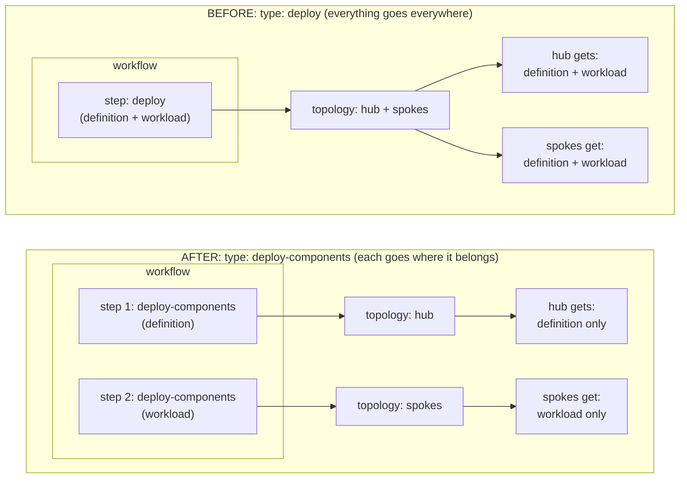

# Design 01: Per-Component Topology Placement

**Status:** Implemented (KubeVela PR [#7213](https://github.com/kubevela/kubevela/pull/7213)).

This document is a companion design note; it captures the design intent behind that
capability and its architectural role as the foundation for the layered
Application model described in the sibling design notes. It is not a proposal for
new work; the syntax examples below are illustrative and the merged PR is the
source of truth for the concrete API.

**Companion to:** [KEP-2.13](../README.md), [KEP-2.20](../../2.20-module-versioning/README.md)

> **TL;DR**
> - Before #7213, a deploy step sent *all* its components to *all* its clusters, so one
>   Application could not put definitions on the hub and workloads on the spokes.
> - #7213 adds **per-component topology placement**: a workflow step can select which
>   components it deploys and to which topology.
> - This is the foundation the whole layered model rests on — it lets one Application per
>   layer carry both hub and spoke resources, so no separate per-target Applications are needed.

## Overview

The evolved architecture for module and API line versioning reuses the KubeVela
`Application` as the common deployment engine at every lifecycle layer (Addon,
Module, and later API Line). A single `Application` at a given layer is expected to
carry two kinds of resource that belong on different clusters:

- **Control-plane resources** that live on the hub: X-Definitions, VelaQL Views, UI
  Schemas, ConfigTemplates.
- **Runtime resources** that must live on the spokes where workloads actually run:
  Deployments, Jobs, and other workload or implementation resources.

For that reuse to work, one `Application` must be able to place *different
components on different topology targets*. This note records why that was not
possible before #7213, what the capability provides, and why it is the load-bearing
foundation for the rest of the design.

## Prior to #7213

The gap was structural, not cosmetic. Grounding it in the code as it stood before
the change:

- **The `deploy` workflow step has no component selector.** Its properties
  (`pkg/workflow/step/types.go`, `DeployWorkflowStepSpec`) are `auto`, `policies`,
  `parallelism`, and `ignoreTerraformComponent`. There is no field naming a subset
  of the Application's components; the step operates on all components that survive
  policy filtering.

- **Topology policies select clusters only.** `TopologyPolicySpec`
  (`apis/core.oam.dev/v1alpha1/policy_types.go`) is `Placement` (clusters by name or
  `clusterLabelSelector`) plus a target `namespace`. There is no component-level
  dimension; a topology says *where*, never *which components*.

- **A deploy step sends all its components to all its clusters.** In
  `pkg/workflow/providers/multicluster/deploy.go`, `applyComponents` pairs every
  component with every target cluster, so each component the step deploys lands on
  each cluster in that step's topology. You cannot send some components to one cluster
  and others to a different cluster within a single step.

The practical consequence: the only pre-existing way to partition components was to
run *multiple* `deploy` steps, each deploying a different subset of components. But
each such step still fans its components across *all* clusters in that step's
topology. There was no way to say, within one Application, "deploy the Definitions to
the hub and the Compositions to the spokes." That single sentence is the requirement
the layered model depends on, and it was unexpressible.

The contrast, before and after:



Before, a step's topology applied to every one of its components, so a definition
meant for the hub also landed on the spokes (and vice versa). After, each step names
its components and its topology, so control-plane and runtime resources land only
where they belong.

## The capability

Per-component topology placement lets a single Application bind distinct
component sets to distinct topology targets within its workflow, so control-plane
and runtime resources coexist in one deployment unit while landing on different
clusters.

The essential shape (illustrative; see #7213 for the actual step/policy/field
names):

```yaml
# Illustrative only
workflow:
  steps:
    - name: deploy-hub-control-plane
      type: deploy-components
      properties:
        components:
          - definitions                # * X-Definition components (ComponentDefinition, TraitDefinition, etc.)
          - ui-schemas                 # * VelaUX parameter-form Schema components
          - config-templates           # * ConfigTemplate components
          - views                      # * VelaQL View components
        policies: [hub]

    - name: deploy-spoke-runtime
      type: deploy-components
      properties:
        components:
          - resources/                 # the definitions specified in resources/
        policies: [spokes]
```

> *NOTE: Each starred entry above stands for **the set of Application components in that
category**, not a single component and not a literal reserved keyword. The point
the example illustrates is only that a step can address *a subset of the
Application's components* and route it to a specific topology; the control-plane
categories go to the hub, the runtime categories go to the spokes.

Design 01 establishes only the placement primitive: a step can select components and
target a topology. How components are grouped into those hub and spoke sets is **not
decided here** and is a rendering concern. For full details see [Design 02](./02-application-managed-resources.md)
and [KEP-2.20 Design 01](../../2.20-module-versioning/design/01-module-crd.md), which cover:

- how the module-owned Application names and labels its components;
- whether steps select components by explicit name or by a category label / naming convention;
- how those groups map onto hub and spoke topologies.

The design principle:

> The Application remains the single deployment unit; a workflow step can select
> which components it deploys and through which topology, so placement is expressed
> inside the Application model rather than by splitting resources across multiple
> Applications.

## Implementation note: future consolidation with `deploy`

As shipped, the `deploy-components` step builds on the `#Apply` path rather than the
`#Deploy` path used by the standard `deploy` step. The two therefore traverse
somewhat different code paths to place resources on clusters. This is functional and
non-blocking, but it leaves two overlapping mechanisms in the deployment engine.

The cleaner long-term end-state is to unify them: expose `components: []` as an
optional input on the existing `#Deploy` operation and filter within that single
operation, rather than maintaining `deploy-components` as a parallel path. That
collapses back to one deploy code path with an optional component filter (`deploy`
= all components when unset, a named subset when set), instead of `deploy` (all)
plus `deploy-components` (subset via `#Apply`).

This consolidation is explicitly **not blocking**. The current implementation
satisfies the layered model's placement requirement; unifying the paths is a
maintainability improvement to be scheduled independently.

## Architectural role

This capability is the foundation the two downstream notes build on:

- **Design 02 (Application-managed hub resources)** relies on it so that one
  Application per lifecycle layer can own hub-placed control-plane resources and
  spoke-placed runtime resources together. Without per-component placement, each
  layer would need either bespoke hub/spoke deployment logic or a separate
  Application per target.

- **KEP-2.20 Design 01 (Module CRD and module-owned Application)** inherits that pattern: the
  module-owned Application uses per-component placement to deliver a module's
  Definitions to the hub and its auxiliary resources to the spokes as one unit.

Because placement is solved at the deployment-engine layer, the layered model does
**not** need a separate Application per (layer x target). One Application per layer
is sufficient. See the boundary note below.

## Non-goals and boundaries

- This note does not redesign topology or override policy semantics; it records the
  capability that closed the placement gap and its role in the layered design.
- It does not address how the generated Application **owns** the resources it places;
  that is covered in [Design 02](./02-application-managed-resources.md) and
  [KEP-2.20 Design 01](../../2.20-module-versioning/design/01-module-crd.md). (Definitions are
  namespaced, so ownership is ordinary; there is no cross-scope problem to solve here.)
- It does not define how components are named or grouped into hub/spoke sets; that
  is a [Design 02](./02-application-managed-resources.md) /
  [KEP-2.20 Design 01](../../2.20-module-versioning/design/01-module-crd.md) rendering concern.
- Concrete API (step name, properties, whether placement is a step field or a new
  policy type) is defined by the merged PR, not by this note.

## Open Discussions & Spikes

- **Spike-gated ruling.** The conclusion that the layered model needs no separate
  hub/spoke Applications *within* a layer (one Application per layer, split by
  per-component placement) is contingent on the outcome of the placement spike. If
  the spike surfaces a case that single-Application split placement cannot express
  (for example, divergent workflow ordering or health-gating between hub and spoke
  resource sets that cannot be modeled as ordered steps), this ruling is revisited
  and per-target Applications return as an option in Design 02.
- **Path unification.** Folding component selection into `#Deploy` (see
  implementation note above) is tracked as non-blocking follow-up.
