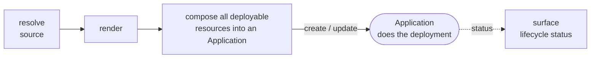
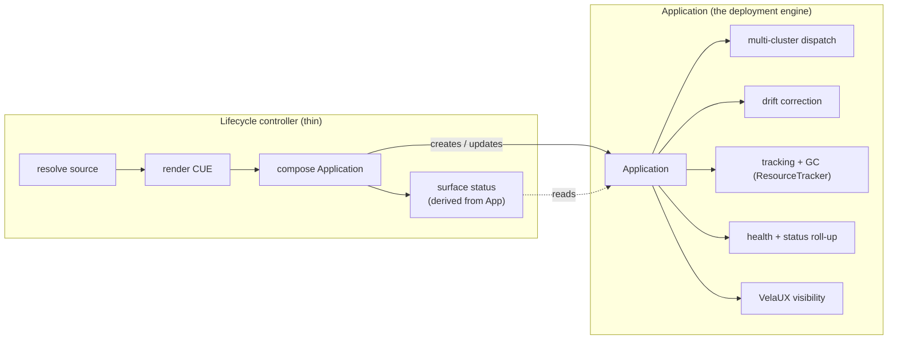
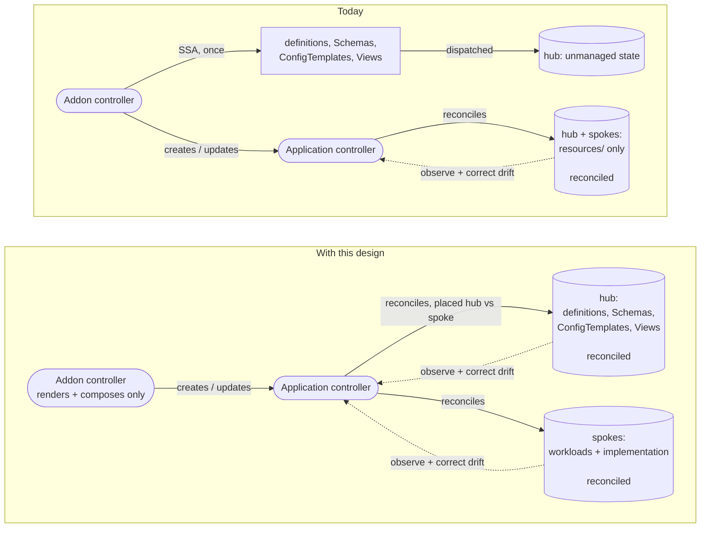

# Design 02: Application-Managed Resources ("Everything is an Application")

**Status:** In Progress 

Depends on the placement primitive in
[Design 01](./01-per-component-topology-placement.md) (implemented in #7213). This note's
"thin controller" and Design 03's "no controller" are the two sides of one directional fork,
not complementary layers; see the [design index](./README.md) for that framing.

**Companion to:** [KEP-2.13](../README.md), [KEP-2.20](../../2.20-module-versioning/README.md)

> **TL;DR**
> - A lifecycle resource (Addon/Module) should own **intent**, not deployment; the
>   **Application** owns deployment (dispatch, drift, tracking, GC, health, VelaUX).
> - With per-component placement (Design 01), *all* addon resources move inside the
>   generated Application's `spec.components` — the out-of-band apply path disappears, and
>   drift/GC/health come for free.
> - The controller shrinks to: resolve source → render → compose Application → surface status.
> - The author keeps their workflow (ordering/health gates); the controller owns only the
>   hub placement of control-plane resources.

## Thesis

A lifecycle resource (Addon today; Module and API Line later) should own **intent
and lifecycle**, not deployment. It declares what capability should exist and
governs when that capability may be removed. It should own none of the hard
distributed-systems machinery: multi-cluster dispatch, resource tracking, drift
correction, health evaluation, resource retention, and garbage collection.

All of that machinery already exists within the `Application`
controller. The lifecycle controller's job therefore collapses to a small, uniform
shape:

The Application does the rest. This is KubeVela's core philosophy applied one level
up:

> Everything is an Application.

User workloads are already delivered as Applications. Platform capabilities
(addons, modules, API lines) should be delivered the same way, through the same
engine, so that the same guarantees (dispatch, drift correction, tracking, GC,
topology, health, VelaUX visibility) apply uniformly from user workloads up to the
platform capabilities that serve them.

## Why this was not possible before per-component placement

The reason today's addon system cannot simply "put everything into an Application"
is placement, and it is established in full by [Design 01](./01-per-component-topology-placement.md):
before per-component placement, one Application could not send different components to
different topology targets. An addon's resources split across two destinations
(control-plane resources on the hub; runtime workloads on the spokes), so they could
not all live inside one Application's `spec.components`; the definitions and auxiliary
resources had to be applied out-of-band by the addon controller itself.

KEP-2.13 names this as the core problem with the current system directly: definitions,
Views, ConfigTemplates, and Schemas are "applied separately as auxiliary outputs
outside the Application's `spec.components` (the Application controller has no
knowledge of them, so out-of-band changes such as manual edits and accidental
deletes are never detected or healed)."

That out-of-band apply path is the forcing function behind most of the addon
controller's bespoke machinery. Because those resources live outside the
Application, the controller has to apply them itself (its own server-side apply
path), track them itself (label queries), diff them itself (the staleness diff),
and reason about their removal itself. Every one of those is a re-implementation, or
a work-around, of something the Application controller already does for the
resources that *are* inside `spec.components`.

## What per-component placement changes

Per-component placement removes the forcing function. Once a single Application can
place its Definition components on the hub and its Composition/auxiliary components
on the spokes (Design 01), there is no longer any reason for those resources to live
outside `spec.components`. They move **in**.

The moment they are inside the Application, the Application controller manages them
with the machinery it already has:

- **Dispatch:** placement across hub and spokes is a workflow/topology concern
  inside the Application, not a bespoke controller loop.
- **Drift correction:** out-of-band edits and accidental deletes of definitions and
  auxiliary resources are now detected and healed, because the Application controller
  reconciles them like any other component. This covers both object-level changes (deletion)
  and spec-level drift (a hand-edited definition schema is reverted to the rendered state),
  directly closing the "never detected or healed" gap.
- **Resource tracking and GC:** the ResourceTracker already tracks and reclaims every
  resource an Application owns, across generations and across clusters.
- **Health and status:** component health rolls up through the Application's existing
  status model.

The out-of-band apply path in the lifecycle controller disappears.

The division of labour, once resources are inside the Application:

The controller does only the left box; everything in the right box already exists in
the Application controller and is reused, not rebuilt.

## What the lifecycle controller stops owning

Because the Application absorbs deployment, the lifecycle controller sheds the
responsibilities that today make it a de facto orchestration engine. It no longer
needs to:

- run its own server-side apply for definitions, auxiliary resources, Views,
  ConfigTemplates, and Schemas;
- perform multi-cluster dispatch of those resources;
- detect and correct drift on them;
- maintain its own resource inventory and staleness diff to find and remove
  resources dropped between versions;
- implement its own health aggregation over dispatched resources;
- implement its own retention and cleanup logic.

What remains is genuinely small: resolve the source, render it, compose an
Application, reconcile that Application, and surface a higher-level lifecycle status
derived from the Application's status. This is the "deliberately repetitive reconcile
shape" that recurs at every layer.

The payoff is concrete:

- **Less code.** The bespoke apply / collect / staleness-diff machinery is deleted,
  not ported.
- **Less testing.** Dispatch, drift, tracking, and GC are already covered by the
  Application controller's test suite; the lifecycle controllers do not re-test them.
- **Less maintenance.** There is one deployment engine to maintain, not a shadow one
  inside each lifecycle controller.
- **Faster, simpler rollout.** Small, uniform controllers are quicker to build and
  safer to ship; the same thinning applies identically to the Module and API Line
  controllers when they arrive.
- **Native VelaUX visibility.** VelaUX already understands Applications; it renders
  their health, workflow, resources, events, drift, and topology. Because every
  lifecycle layer *is* an Application, a Module (and later an API Line) is visible in
  VelaUX with no new UI surface: the resource hierarchy becomes the UI hierarchy. This
  visibility is a direct consequence of the philosophy, not a separate feature to
  build.

## Roughly, how the render pipeline changes

The change to the rendering pipeline is small and localised. Two of the three steps
are what the addon system already does today; only the workflow generation changes.

1. **Render all resources** (unchanged). The controller renders the addon/module
   source into the full set of Kubernetes resources.
2. **Collate into `k8s-objects` components** (unchanged). Rendered resources are
   wrapped as Application components, as they are today.
3. **Prepend a controller-owned hub phase** (the new part). The controller knows which
   resources belong on the hub: they are exactly the ones that today deploy *outside* the
   Application; a bounded set of definition, schemas, ConfigTemplates, views, etc. These are identified by resource kind at render time (equivalently, marked with a
   hub-only signal during rendering - see the classification spike in
   [Design 03](./03-cuex-components-instead-of-crs.md)). It renders those and deploys them
   explicitly first, targeting only the hub, via `deploy-components` (Design 01). The author's
   own components and workflow for the spoke resources are left unchanged; the controller does
   not rewrite them. (The one wrinkle, an author `deploy` step that would re-dispatch
   everything, is the same open item flagged in
   [Design 03](./03-cuex-components-instead-of-crs.md).)

The architectural difference is not the number of steps; it is whether a rendered
resource sits inside a **reconciliation control loop** or not. Today, only `resources/`
is inside one; definitions, Schemas, ConfigTemplates and Views are applied once by the
addon controller and then left unmanaged (no loop observing or correcting them). The new
model places every resource inside the Application's control loop.

The diagrams below use one visual language: rounded nodes are **controllers** (actors),
rectangles are **rendered artifacts**, cylinders are **cluster state**, and a return
arrow is the **reconciliation loop** (observe + correct drift). The absence of a return
arrow is the point, not an omission.

In the old model the addon controller has two roles: it drives the Application
controller for `resources/` (a real control loop, dashed return arrow), *and* it applies
definitions and metadata directly with no loop back (they fall out of the diagram once
applied). In the new model the addon controller only renders and composes; the
Application controller reconciles everything, on both the hub and the spokes, each inside
a control loop.

Steps 1 and 2 are reused; step 3 replaces the separate out-of-band apply path that today
handles definitions and metadata with a controller-owned hub phase inside the Application.

### The author keeps their workflow; the controller owns only the hub phase

Orchestration (ordered rollout, health gates, dependency sequencing) is a real value of addons
and something authors should control. The controller therefore does not generate or replace
the author's workflow; it owns only the hub placement of control-plane resources.

The workflow encodes two separable concerns, and only one of them is the controller's:

- **Ordering, sequencing, and health-gating** belong to the **author**. This is the
  orchestration value; the author expresses it in `template.cue` as normal.
- **Hub placement of control-plane resources** belongs to the **controller**. The controller
  prepends a hub-only phase for the resources it knows are hub-destined (definitions, and for
  addons Schemas/ConfigTemplates/Views), so those land correctly regardless of what the author
  wrote. It does not otherwise touch the author's workflow.

So the author's workflow is preserved; the controller adds a phase it owns rather than
replacing what the author authored. The one unresolved interaction is an author `deploy` step
that re-dispatches all components (and so could undo the hub/spoke segregation); how to prevent
that is an explicit open item and spike in
[Design 03](./03-cuex-components-instead-of-crs.md). The precise author-vs-controller split
per layer (Addon vs Module) is part of that spike.

## Resource layering across lifecycle layers

The same "everything is an Application" pattern applies at each lifecycle layer, with
each layer's Application owning that layer's resources:

- **Addon Application** owns broad, shared platform infrastructure (for example the
  Crossplane AWS provider, shared CRDs, cluster-wide RBAC).
- **Module Application** owns capability-wide resources shared across all of a
  module's API lines (for example a module-wide XRD or provider configuration).
- **API Line Application** (subject to the API Line investigation) owns the
  version-specific contract and implementation resources (that line's definitions and
  the auxiliary resources that back them).

Each Application splits its own hub-bound and spoke-bound components using the Design
01 primitive. The layering of *which* resources belong to *which* layer is a Design
03 concern (and a later API Line concern); this note fixes only that every layer uses
an Application as its deployment engine.

## Non-goals and boundaries

- This note does not define how components are named, grouped, or rendered into an
  Application; that is a KEP-2.20 Design 01 rendering concern.
- It does not resolve whether the API Line is its own resource with its own
  Application; that is an open investigation deferred to the Module/API Line design
  work.
- It does not specify the namespace and ownership mechanics for the module-owned
  Application; those are detailed in KEP-2.20 Design 01.
- It does not change the Application controller; the entire premise is that no change
  to the deployment engine is required, only reuse of it.

## Open Discussions & Spikes

- **Spike confirmation.** As in Design 01, the conclusion that one Application per
  layer (rather than one per layer-and-target) is sufficient depends on the placement
  spike outcome. If split placement within a single Application cannot express a
  required hub-versus-spoke ordering or health-gate, the layering here is revisited.
- **Status roll-up.** How much of the owned Application's status (phase, conditions,
  per-component health) the lifecycle resource surfaces, and in what shape, is left to
  the per-layer designs. The principle is that lifecycle status is *derived from* the
  Application's status, not independently computed.
