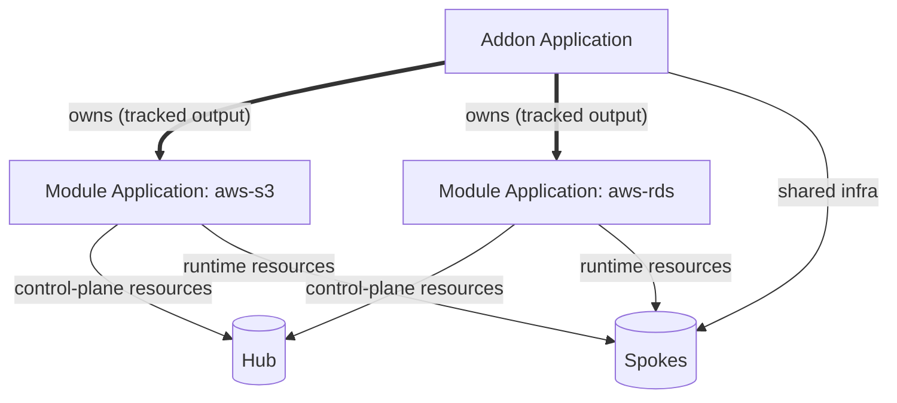
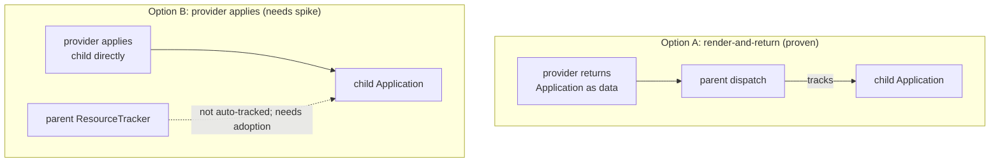

# Design 03: CueX Components Instead of CRs (No New CRD or Controller)

**Status:** In Progress 

Presents an **alternative** to the CRD-and-controller
model in [KEP-2.20 Design 01](../../2.20-module-versioning/design/01-module-crd.md) and
[KEP-2.20 Design 02](../../2.20-module-versioning/design/02-namespace-and-tenancy.md). It does
not retire that model; the two are the sides of one directional fork, documented so they can
be compared — see the [design index](./README.md) for that framing.

**Depends on:** [Design 01](./01-per-component-topology-placement.md) (per-component
placement) and [Design 02](./02-application-managed-resources.md) ("everything is an
Application").

**Companion to:** [KEP-2.13](../README.md), [KEP-2.20](../../2.20-module-versioning/README.md)

> **TL;DR**
> - If the Application owns deployment (Design 02), the residual controller job is just
>   resolve → render → create an Application — which is what a **CueX-backed component** does.
> - So an addon or module can be a **component** (no new CRD, no new controller) whose provider
>   renders a nested Application. Already prototyped: the `addon` component and the native Helm
>   component.
> - Ownership is a clean chain: parent Application owns the child Application as a tracked
>   output; the child owns its resources. Health gating and deprecation are handled by existing
>   Application mechanisms (health roll-up; a GC-retention policy).
> - This is the **alternative** to the CRD model (KEP-2.20 Design 01); both are documented. The
>   trade study is the "Investigation" section below. Key open item: a spike on keeping the
>   author's workflow from undoing hub/spoke placement.

## Overview

Designs 01 and 02 establish that once per-component placement exists, every deployable
resource moves inside the generated Application, and the Application controller does the
dispatch, drift correction, tracking, GC, health, and UI work. Design 02's "what the
lifecycle controller stops owning" list is long.

That raises an honest question: if a lifecycle controller stops owning all of that, what
is left for it to do? The residual job is exactly:

```
resolve source -> render CUE -> create an Application
```

This resolve-and-render work is exactly what **CueX providers in components** can now do:
a component's CUE template can call a Go provider to fetch and render from an external
source during evaluation, absolving the need for a dedicated controller. So the addon or
module need not be a CR with its own controller; it can be a **component** whose
CueX-backed template renders the capability and lets the existing Application machinery
install it. This has already been done in the original Addon component POC and the
native Helm component (see the next section).

This is "everything is an Application" reaching its conclusion:

> Addons are Applications. 
>
> Modules are components within Applications that render
> Applications. 
>
> API Lines are (debatably) components within Modules that render Applications.
> 
>There is no new CRD and no new controller; complexity is expressed with traits and policies.

## Precedents

The pattern is already implemented in the codebase in two forms. Both are
`ComponentDefinition`s backed by a CueX provider that renders from an external source;
they differ only in what the component emits.

### Addon component (nested-Application output)

Commit `ade26c3f5` ("Feat - Addon Component") adds an `addon` component whose provider
loads an addon package from a registry, renders it, and returns a complete
**Application** object. The component's primary output *is that Application*:

```cue
// vela-templates/definitions/internal/component/addon.cue (from ade26c3f5)
template: {
  _addonRender: addon.#Render & { $params: {
    addon:      parameter.addon
    properties: parameter.properties
    // ...
  }}

  // the rendered addon Application becomes the component's main output
  output: _addonRender.$returns.application

  // auxiliary resources become additional outputs
  outputs: {
    for i, resource in _addonRender.$returns.resources {
      "addon-resource-\(i)": resource
    }
  }
}
```

The Go provider returns `Application map[string]interface{}` plus
`Resources []map[string]interface{}`
(`pkg/cue/cuex/providers/addon/addon.go`). This is the **nested-Application** model
already built: a component that emits a child `kind: Application`.

### Helm component (resource output)

Commit `bdf647df8` (#7080, "native helm component and provider") adds a `helmchart`
component whose provider renders (and, in the shipped code, installs) a Helm chart and
returns its rendered resources; the component emits those resources as `outputs` and a
small audit ConfigMap as `output`
(`vela-templates/definitions/internal/component/helmchart.cue`,
`pkg/cue/cuex/providers/helm/helm.go`). No nested Application; the rendered resources flow
into the enclosing Application's pipeline. See the in-tree design note
[`helm-component.md`](../../../helm-component.md) for the full rationale (unify deployment,
drop the FluxCD dependency, reuse KubeVela multi-cluster and revision machinery).

### What the two precedents prove

- A component template can emit **any** Kubernetes object as output, including a nested
  `kind: Application`. 
- A CueX provider is an effective way to run render/fetch logic (Go) inside component
  evaluation. Addons and modules need the same thing the Helm and addon components
  already have.

## The generalisation: addons and modules as components

Applying the pattern uniformly and recursively:

- An **Addon** is delivered as an Application. Its shared infrastructure is expressed as
  ordinary components; the **modules it installs are `module` components**.
- A **`module` component** has a CueX provider that resolves the module source and renders
  a **child Module Application** as its `output` (exactly as the `addon` component renders
  a child addon Application today).
- That child Module Application contains the module's control-plane and runtime resources,
  split across hub and spokes by per-component placement (Design 01), and reconciled by the
  standard Application controller (Design 02).

The result is Applications-containing-components-that-render-Applications. The diagram
shows the recursion (an Application whose component renders another Application), the
ownership chain (each parent owns its child as a tracked output), and where the rendered
resources are placed (hub control plane vs spoke workload plane).



Reading it: the top-level **Addon Application** owns one **Module Application** per module
(as a tracked output; double arrows). Each Application places its own resources across the
hub (control plane) and spokes (workload plane). No `Addon` CR, no `Module` CR, no addon
controller, no module controller: each layer is an Application, and the mechanism at every
layer is a component whose provider renders the next Application down.

## How a nested Application is processed (the ownership chain)

The addon component returns the child Application as **data** (`output:
_addonRender.$returns.application`); it does not apply it. The child Application is therefore
the component's declared output, and ownership is a clean two-level chain:

- The **parent** Application tracks the child Application in its own ResourceTracker, exactly
  as it tracks any resource it renders. Drift on the child is healed by the parent, and if the
  module is removed from source the parent GCs the child.
- The **child** Application has its own ResourceTracker owning the module's resources. Drift
  and GC of those are the child's responsibility.

Each level uses machinery that already exists; nothing is applied as an untracked side-effect.
Deprecation is the one deliberate exception (retain the child instead of GC-ing it when it
leaves source), and it is a policy choice, not a change to this chain; see tension 4.

**The child must be wrapped as a health-aware `application` component, not `k8s-objects`.**
This is a firm requirement of the model. `k8s-objects` passes resources through as opaque
blobs with no health concept, so if the child Application were emitted that way the parent
would know only that it was *applied*, never whether it is *healthy*, and the layer-by-layer
health gating this design relies on would be broken. The model therefore needs an
`application` component type: it takes an Application spec as input and defines a health
policy that reads the child Application's own `status` (its phase and conditions) and reports
it upward. That is what lets the parent gate on "the child Application is healthy" rather than
merely "the child object exists." The health policy is a normal component health definition,
so this is an addition to the component library, not a change to the Application controller.

### Two ways to wire ownership

There are two ways the parent can come to own the child Application.

**Option A - render-and-return (proven; what the addon component does).** The provider returns
the child Application as data, the component declares it as `output`, and the parent's dispatch
path applies and tracks it. Ownership is automatic because the child *is* tracked output. No
new mechanism.

**Option B - provider applies, then back-references the parent (real alternative, needs a
spike).** The provider applies the child directly during evaluation and stamps ownership
metadata so the parent absorbs it afterwards. The open question is tracking: the ResourceTracker
is dispatch-populated, not ownerReference-populated, so a child created out-of-band is not
automatically tracked by the parent. Making it tracked would need either writing into the
parent's ResourceTracker from the provider layer or a label-based adoption pass on the next
reconcile, and the side-effect apply also races the parent's dispatch. These are what a spike
must resolve before Option B is viable.



Option A is the recommendation; Option B is kept only as a documented alternative pending that
spike.

## Health gating between layers falls out of health roll-up

The three-tier ordering that both KEPs are built around (infrastructure healthy, then
auxiliary ready, then definitions) does not need a new mechanism in the nested-Application
model. It is a direct consequence of two things Applications already do: components are
deployed in workflow-step order, and an Application rolls its components' health up into its
own status.

So each layer health-gates on the layer below exactly the way an Application gates on any
component. This is precisely why the child is wrapped as a health-aware `application`
component rather than `k8s-objects` (see the mechanics section): that component's health
policy reads the child Application's rolled-up status, so the `module` component's health
condition is `context.output.status.healthy: true` (the child Application is healthy only
when all *its* components are healthy, recursively). The parent's workflow will not advance
past a `module` component until that component reports healthy, which is precisely "wait for
the module to be fully installed and operational before proceeding." The same holds one level
down inside the Module Application: a `deploy-runtime` step gated on auxiliary health runs
before the definitions step.

The hierarchical ordering is therefore recursive and free: ordered workflow steps plus
per-component health gates plus health roll-up, at every layer. This is a point in favour of
the nested-Application model; it inherits the ordering guarantee rather than re-implementing
it.

## Cluster context

Context-aware `enabled` gating (e.g. install an API line only where `provider == "aws"`) is
fork-neutral and has its own note: see
[KEP-2.20 Design 04: Cluster Context](../../2.20-module-versioning/design/04-cluster-context.md).
The only component-model-specific point is that `enabled` evaluation lives naturally in the
module component's CueX provider (which already runs CueX to render the child Application), so
no new evaluation path is needed; the context values, the baseline-labels-then-Config-stretch
model, and the blocking hub-metadata prerequisite are all covered there.

## Investigation: component model vs CRD model

Both models reach the Design 01/02 goals (all resources inside Applications, thin or no
bespoke controller logic, native multi-cluster, VelaUX visibility). They share Designs 01,
02, and the namespace-per-module concept (KEP-2.20 Design 02). They differ only in whether a
capability is a **CR reconciled by a dedicated controller** (Designs 03/04) or a
**component that renders a nested Application** (this note).

The five dimensions where the choice actually bites:

### Tension 1: Governance / RBAC

- **CRD model:** the `Module` CR and its namespace are the access-control unit. RBAC can be
  granted per module ("team B may manage `aws-s3`").
- **Component model:** a component is not an independently RBAC-able object. Control over
  "who may install/modify the aws-s3 module" collapses to "who may edit the enclosing
  Application." You cannot grant rights to a single component within a shared Application.

*How the component model covers it:* the enclosing Application is the intended tenancy unit
for a platform team, so Application-level RBAC is usually the right grain. Where finer grain
is genuinely needed, the nested model already provides it: a **standalone module is its own
Application** (see tension 2), so "team B owns aws-s3" is expressed by giving team B their
own Application containing only the aws-s3 module component. And the *installed* resources
still land in `vela-module-aws-s3`, so resource-level RBAC on the namespace is unchanged
from KEP-2.20 Design 02.

Two existing mechanisms are the starting point, though the per-module grant is an enhancement
on top of them rather than something they deliver as-is:

- **Installing a module is gated by permission to use the module component.** Whoever can put
  the `module` component into an Application can install that module; that is the natural
  install-time control point.
- **Per-definition access control** exists via the `ValidateDefinitionPermissions` feature
  gate (`pkg/webhook/core.oam.dev/v1beta1/application/validation.go`), which checks (via
  SubjectAccessReview) that the Application's creator has RBAC `get` on each definition *type*
  it references. As shipped this is a per-definition-type check, not a per-namespace or
  per-module one.
- **Application-scoped identity** via `app.oam.dev/service-account-name` /
  `app.oam.dev/username` / `app.oam.dev/group` and the `AuthenticateApplication` feature gate
  (`pkg/oam/labels.go`, `pkg/auth/`) impersonates the Application's identity for all resource
  writes, scoping what an Application may install at Application grain.

*Honest residual and enhancement direction:* a clean per-module grant is not available today.
The most promising path is to **enhance `ValidateDefinitionPermissions` to factor in namespace
access**, so authorization can be evaluated against the module namespace
(`vela-module-aws-s3`) as a unit rather than resource by resource. Open questions to explore:
can a module be flagged `restricted` (for example via an annotation) so the permission gate is
enforced at the module/namespace boundary above its resources, rather than on each definition
individually?

### Tension 2: Standalone module independence

- **CRD model:** a `Module` CR can be installed without an umbrella Addon and survives
  independently.
- **Component model:** a "standalone module" is a minimal Application containing a single
  `module` component. Independence is preserved; it is expressed as "its own Application"
  rather than "its own CR."

*Assessment:* this is arguably cleaner, not weaker: everything is uniformly an Application,
and the standalone case is not a special resource type but the general case with one
component. No capability is lost.

### Tension 3: Per-layer status, conditions, and finalizers

- **CRD model:** each `Module` gets its own `status`, conditions, `kubectl get module`, and
  finalizer.
- **Component model (nested Applications):** because the child is a real Application object,
  it *also* gets independent status, conditions, a finalizer, and `kubectl get application
  module-aws-s3`. The parent's `status.services[]` rolls up child health.

*Assessment:* nested Applications give per-layer status and finalizers today, so this works
in principle without a CRD. (A flattened model, where the module component emits resources
into the parent like the Helm component does, would lose this; that is the reason to prefer
nested for the layered model.) Where the parent's roll-up of a child Application's health or
status is imperfect, that is a beneficial thing to surface: the remedy is an Application
status/health policy enhancement, which is reusable by any nested-Application use case, not a
workaround specific to this design. Discovering and closing such gaps through Application
policies strengthens the platform generally.

### Tension 4: Durable deprecation record

This is the hardest dimension and the one where the models most differ.

- **CRD model:** the design intent (KEP summary, deprecation-as-lifecycle) wanted a durable
  object that *outlives its absence from source*: a module/API line removed from the source
  is marked deprecated and retained, with its own finalizer, until consumers migrate.
- **Component model:** when a module is removed from the parent's source, the parent stops
  rendering the `module` component and GCs the child Application by default (the ownership
  chain working correctly; see mechanics above). To *retain* a no-longer-rendered child, the
  parent must opt out of that GC with a retention policy.

*How the component model covers it: a reusable garbage-collection policy enhancement.*

Deprecation in this model is fundamentally a **garbage-collection concern**, and GC is
already expressed as a policy in KubeVela. So the mechanism is an enhancement to the
garbage-collection policy (or a new sibling policy), not addon- or module-specific controller
logic:

- The existing `garbageCollect` policy already has retention behaviours (`apply-once`,
  `keepLegacyResource`). The enhancement is a **retain-and-mark-deprecated** mode: when the
  parent Application stops rendering a resource (here, a child Module/API-line Application),
  the policy retains it and stamps the deprecation marker rather than deleting it. The marker
  is an annotation on the retained resource (the same `definition.oam.dev/deprecated`-style
  annotation KEP-2.20 already defines, which the admission webhook reads to block new
  references); the exact key is a KEP-2.20 detail, not defined here.
- This is deliberately **reusable**. "Retain a no-longer-rendered resource and mark it
  deprecated, pending consumer migration" is not specific to addons; any Application retiring
  a component gracefully wants it. Framing deprecation as a general GC-policy capability keeps
  it out of any bespoke controller and makes it available cluster-wide, consistent with this
  note's "express complexity with traits and policies" principle.
- Deprecation *state* itself (blocking new references, surfacing active consumers) is
  admission-webhook and status behaviour that is independent of the CR-vs-component choice; it
  keys off the definition's deprecation annotation (KEP-2.20), which exists regardless.

*Assessment:* the CRD model gets "durable object that survives absence from source" from the
object's own lifecycle; the component model achieves the same via a retention-mode GC policy
on the parent plus the existing deprecation marker. The remaining work is to specify the
exact retain-vs-GC semantics for a nested Application whose component is no longer rendered,
and to build it as a reusable policy enhancement rather than a special case. This is a
bounded, reusable enhancement, not an open-ended gap, and it is the first thing to prototype
because it also benefits Applications well beyond this design.

> **Architectural principle: removal from desired source is a lifecycle transition, not
> necessarily deletion.** When a resource (a module, an API line, any rendered output)
> disappears from the desired source, the default of immediate deletion is not always correct;
> the resource may need to transition to a *deprecated* state and be retained while consumers
> migrate. This is broader than API lines and applies wherever desired-state reconciliation
> drives lifecycle. The mechanism differs by model (a durable CR that persists; a retained
> child Application via a GC-retention policy), but the principle is the same: **absence from
> source signals intent to remove, which is a state transition to reconcile, not an
> instruction to delete.** How this applies to API lines specifically, and how each model
> realises the full deprecation lifecycle, is compared in
> [KEP-2.20 Design 03: API Line investigation](../../2.20-module-versioning/design/03-api-line-investigation.md).

### Tension 5: A wrapping Application is mandatory

- **CRD model:** an addon can be installed as a single standalone object. `kubectl apply` an
  `Addon` CR and the controller does the rest; there is no enclosing object.
- **Component model:** there is no standalone addon object. Installing an addon *always*
  requires a wrapping Application to carry the addon component. Even installing a single addon
  means authoring (or generating) a one-component Application.

*Assessment:* in isolation this is a genuine cost, more ceremony for the trivial "install one
addon" case. But it is a cost that inverts into a benefit the moment more than one addon is
involved, which is the common case. Addons are rarely installed alone; a platform capability
set is a *composed* group of addons with dependency ordering (for example crossplane before
the AWS provider before the s3 module). Composition with ordering, health gates, and atomic
rollout is exactly what an Application's workflow provides. So the wrapper that feels like
overhead for one addon is the same object that delivers `dependsOn` ordering, per-step health
gating, and whole-set rollout/rollback for many. The mandatory wrapper is a poor fit for the
degenerate single-addon case and a natural fit for the real multi-addon case; a generated
"install this one addon" Application (via CLI) removes the authoring burden for the degenerate
case without giving up the composition benefits.

## What both models share (unchanged)

- **Design 01** (per-component placement) and **Design 02** (everything is an Application)
  are the foundation of both; nothing here changes them.
- **Namespace-per-module** (KEP-2.20 Design 02) survives. In the component model the child Module
  Application's **workflow creates `vela-module-<name>` as its first step** (the
  `createNamespace` and staged-deployment patterns already exist in the Helm component). The
  namespace is a generated-workflow convention rather than the home of a CR, but its
  tenancy, ownership, and resolution consequences are identical to KEP-2.20 Design 02.
- **Native ownership, deterministic resolution, and VelaUX visibility** all hold; they were
  consequences of the Application and the namespace, not of any CR.

## Expressing complexity with traits and policies

The per-node concerns a dedicated controller would otherwise encode map onto existing
Application mechanisms:

| Concern | Mechanism (no controller code) |
|---|---|
| Hub-vs-spoke placement | per-component placement + topology policies (Design 01) |
| Install ordering / health gates | workflow step ordering + health policy on the child Application |
| Namespace creation | first workflow step in the generated child Application |
| Retention / deprecation | garbage-collect / retention policy on the parent + deprecation annotation |
| Dependency waits | workflow `dependsOn` between components / `depends-on-app` |
| Multi-cluster rollout | topology / override policies, as in the Helm component example |

Where a genuinely new behaviour is needed, the extension point is a **trait or policy**, not
a new controller.

## Open Discussions & Spikes

### Preventing the author workflow from undoing hub/spoke segregation (spike)

The controller owns a hub-only phase for the resources it knows are hub-destined (definitions,
and for addons Schemas/ConfigTemplates/Views); the author owns the workflow for the remaining
(spoke) resources (see [Design 02](./02-application-managed-resources.md), "The author keeps
their workflow"). The open problem: an author's `template.cue` can contain a bare `deploy`
step, which re-dispatches **all** components and, with no topology policy named, defaults to
hub-only (`pkg/policy/topology.go`). That collides with the controller's hub phase and could
re-send hub resources to spokes or duplicate the hub deploy.

Three candidate directions, to be resolved by a spike (not decided here):

1. **Mark resources hub-only during rendering.** Annotate the hub-destined resources at render
   time and have the multi-cluster dispatch logic skip them for spoke dispatch *irrespective of
   workflow structure*. This is the most robust of the three because the marking travels with
   the resource and does not depend on how the author authored their workflow; a bare `deploy`
   simply never sends a hub-only resource to a spoke.
2. **Constrain or intercept `deploy` in addon templates.** Disallow a bare `deploy`, or
   intercept it so it only targets spoke resources.
3. **Provide a constrained deploy variant** the author must use for spoke resources, leaving the
   hub phase entirely to the controller.

The per-layer question is part of this spike: what exactly the author versus the controller
owns may differ between an **Addon** (orchestration is a selling point, so the author owns more
of the workflow) and a **Module** (the strict API unit, where the controller may own both the
hub and spoke phases). The Module remaining the strict end of the spectrum is the current lean,
not a settled rule; see [KEP-2.20 Design 01](../../2.20-module-versioning/design/01-module-crd.md).

### Cluster context (fork-neutral; see Design 04)

Context-aware `enabled` gating and its blocking prerequisite (the local hub has no
cluster-metadata entry today) are owned by
[KEP-2.20 Design 04: Cluster Context](../../2.20-module-versioning/design/04-cluster-context.md),
not here.