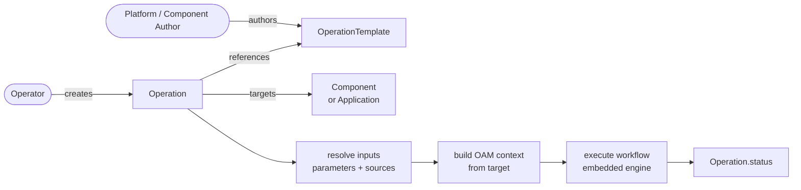

> ⚠️ **Early concept draft.** This KEP is an early-stage exploration. It is **incomplete and may be inaccurate**, its direction is unsettled, and it should not be relied upon for implementation or as a description of committed behaviour. Expect substantial change.

# KEP-2.15: OperationTemplate & Operation

**Status:** Drafting (Not ready for consumption)
**Parent:** [vNext Roadmap](../README.md)

Day 2 operations are a first-class OAM primitive. `OperationTemplate` and `Operation` allow component and application authors to ship operational runbooks — backup, restore, rotate-credentials, failover — alongside their Definitions, with full access to the OAM context of the target Component or Application. KubeVela does not execute the actual work; it resolves the context and delegates to external tools (Argo Workflows, Crossplane claims, external APIs) via `WorkflowStepDefinition` primitives.

An `OperationTemplate` declares three things and nothing else: what it **attaches to**, what **parameters** it takes, and the **workflow** it runs. When an `Operation` is created, the operation-controller builds the OAM context for the target and executes that workflow using the embedded workflow engine; the steps read the context as component and trait templates already do.

The baseline is deliberately built on capabilities that exist today. An [optional layer](#optional-expression-based-inputs) adds declarative source bindings and `$( )` expressions on top, and an [alternative execution model](./design/01-application-wrapper.md) is documented separately; neither is required to ship this.



## Mental Model

| Layer | Artefact | Author | Responsibility |
|---|---|---|---|
| Template | `OperationTemplate` | Platform / component author | Declares attachment rules, input schema, and the workflow to run |
| Invocation | `Operation` | Operator | Names a template and a target, supplies parameters, records the result |
| Execution | embedded workflow engine | Controller | Resolves inputs once, builds context, runs the workflow to completion |

The separation matters: an `OperationTemplate` is a high-trust artefact published alongside a `ComponentDefinition`, carrying arbitrary workflow steps. An `Operation` is low-trust — it names a template and supplies parameters against a validated schema, and cannot alter what the template does.

## OperationTemplate

`OperationTemplate` is a namespaced CRD in the `core.oam.dev/v2alpha1` API version.

```yaml
apiVersion: core.oam.dev/v2alpha1
kind: OperationTemplate
metadata:
  name: s3-backup
  namespace: payments-prod
spec:
  # ── what this operation may attach to ──
  attach:
    scope: Component
    allowedComponentTypes: [aws-s3-bucket]

  # ── operation flags. Anything describing the target is read from the
  #    context by the steps themselves, not asked of the operator. ──
  parameters:
    type: object
    properties:
      verify:
        type: boolean
        default: true
        description: Verify the backup after writing it
      retentionDays:
        type: integer
        default: 30

  # ── what it does ──
  workflow:
    steps:
      - name: backup
        # reads context.output.status.atProvider.* for the bucket and region,
        # and context.parameters.retentionDays — see the definition below
        type: s3-backup-job

      - name: verify
        if: context.parameters.verify
        type: s3-verify-backup

      - name: record
        type: write-status
        properties:
          patch:
            lastBackup:
              status: success

      - name: cleanup
        if: always
        type: clean-jobs
        properties:
          labelSelector:
            operation.oam.dev/name: context.operationName
```

The step definitions read the target directly, as a `healthPolicy` would:

```cue
// s3-backup-job.cue
"s3-backup-job": {
  type: "workflow-step"
  labels: "scope.oam.dev/operation": "true"
}
template: {
  output: {
    apiVersion: "batch/v1"
    kind:       "Job"
    metadata: {
      name: "backup-\(context.operationName)"
      labels: "operation.oam.dev/name": context.operationName
    }
    spec: template: spec: {
      restartPolicy: "Never"
      containers: [{
        name:  "backup"
        image: "amazon/aws-cli:2.15.0"
        env: [
          {name: "SRC_BUCKET",     value: context.output.status.atProvider.bucketName},
          {name: "SRC_REGION",     value: context.output.status.atProvider.region},
          {name: "RETENTION_DAYS", value: "\(context.parameters.retentionDays)"},
        ]
        args: ["s3", "sync", "s3://$(SRC_BUCKET)", "s3://$(DEST)/\(context.appName)/\(context.name)"]
      }]
    }
  }
}
```

Everything here works against the feature set that exists today. The `OperationTemplate` is plain YAML with no expression language; step properties are literal; `if:` is the engine's own CUE, evaluated at step time with `context` in scope; and step templates read `context` exactly as component and trait templates already do. Nothing in this baseline depends on [KEP-2.16](../2.16-source-definition/README.md) or on any change to it.

> **Optional addition:** [Expression-based inputs](#optional-expression-based-inputs) describes layering KEP-2.16's `$( )` expressions and `spec.sources[]` on top, so that *generic* steps such as `apply-object` can receive target and platform data as properties instead of requiring a purpose-built step per shape. It is genuinely useful and genuinely additive — nothing in the baseline changes if it is never adopted, and it carries dependencies the baseline does not.

A CUE **authoring** front-end for the template itself is a separate matter again — see [Authoring in CUE](#authoring-in-cue).

> **Design exploration (not yet accepted):** [Design 01](./design/01-application-wrapper.md) proposes an alternative execution model in which an `Operation` renders a temporary `Application` and lets the Application controller run the workflow, gaining `components`, `traits`, and policy-driven placement and resource lifecycle. It is a strict superset of the model described here — the `attach`, `parameters`, and `sources` blocks are identical — so it remains available as a later increment. This KEP's direct workflow execution remains the baseline.

### Parameters

`spec.parameters` is an OpenAPI v3 schema. This is deliberately the same form KubeVela already stores: a Definition's CUE `parameter{}` block is compiled to OpenAPI by `GenOpenAPI` (`pkg/utils/common/common.go`) and persisted that way for `vela def show`, VelaUX form rendering, and `ConfigTemplate.data.schema`. Authoring it directly skips a transform rather than losing expressiveness, and it makes the CRD structurally validatable by the API server.

A compact shorthand that expands to OpenAPI is deliberately **not** offered. Two spellings of one schema drift. A CUE authoring front-end is offered instead, below — it is a *compiler*, not a second schema language.

### Authoring in CUE

An `OperationTemplate` may be authored as a `.cue` file and applied with `vela def apply`, which compiles it to the YAML CR above. This is the same relationship every X-Definition already has with its stored form, and it reuses the existing converter: a CUE `parameter{}` block becomes OpenAPI via `GenOpenAPI` (`pkg/utils/common/common.go`), with `// +usage=` comments becoming field descriptions and `?` / `*default |` becoming optionality and defaults.

```cue
// s3-backup.cue  —  vela def apply

"s3-backup": {
  type:        "operation-template"
  description: "Back up a component's data to S3"
  attributes: attach: {
    scope:                 "Component"
    allowedComponentTypes: ["aws-s3-bucket"]
  }
}

parameter: {
  // +usage=Verify the backup after writing it
  verify: *true | bool
  // +usage=Days to retain the backup
  retentionDays: *30 | int
}

workflow: steps: [
  {name: "backup", type: "s3-backup-job"},
  {name: "verify", type: "s3-verify-backup", if: "context.parameters.verify"},
]
```

Two properties keep this a convenience rather than a second dialect.

**The front-end may not express anything the YAML cannot.** CUE comprehensions, conditionals, and imported fragments are permitted *at authoring time* — generating a repetitive step list, sharing a parameter fragment across templates — but the output is always a static, fully-enumerated `OperationTemplate`. The moment the CUE form can express something the YAML cannot, YAML stops being the source of truth and the two forms begin to drift in capability rather than in convenience.

**Conversion is one-way.** The CUE source is not stored on the CR. `vela def get` returns the YAML that is actually in the cluster, not the file the author wrote. Round-tripping by stashing the source in an annotation was considered and rejected: an annotation that silently disagrees with the spec after someone edits the YAML is worse than not having it.

#### `\(parameter.…)` must be rejected in template bodies

The `parameter{}` block of an `OperationTemplate` is a *schema*, not values — the values arrive per `Operation`, long after `vela def apply` has run. Interpolating one at authoring time is therefore never what the author meant, and the failure modes differ dangerously:

| Written | What happens |
|---|---|
| `"region=\(parameter.region)"` | Fails loudly — `parameter.region` is `string`, not concrete, so CUE cannot interpolate it. |
| `"verify=\(parameter.verify)"` | **Fails silently.** `verify` has default `*true`, so this compiles to the literal `"verify=true"` and the parameter is permanently baked out of the template. |

The second row is why the converter must reject `\(parameter.…)` outright rather than leaving it to CUE's own error reporting: with a default present it produces a working template that silently ignores its own parameter. Steps read operation parameters at run time from `context.parameters`; nothing in a template body should interpolate them.

(If the [optional expression layer](#optional-expression-based-inputs) is adopted, `$( )` is the counterpart that *is* correct here — it is inert to CUE, since `$` carries no meaning in the language, so it survives compilation and resolves per step.)

### Attachment

`spec.attach` declares what the operation may be run against. It answers *availability* — "is this operation offered for this target at all" — and nothing more.

**Component scope** restricts by component type:

```yaml
attach:
  scope: Component
  allowedComponentTypes: [aws-s3-bucket]   # empty means unrestricted
```

**Application scope** restricts by label, annotation, and the presence of component types:

```yaml
attach:
  scope: Application
  selector:
    matchLabels:
      dr.oam.dev/enabled: "true"
    matchExpressions:
      - {key: env, operator: In, values: [prod, staging]}
    requiredComponentTypes: [postgres]     # all listed types must be present
```

Two enforcement points:

- **Admission** rejects an `Operation` whose target does not match the selector.
- **Discovery** — `vela operation list --app <name>` and VelaUX offer only the templates whose selector matches. This is the primary value: an operator should not be offered "failover" on an Application that has no replicas.

> **The attach selector is not the fan-out selector.** `attach.selector` decides whether an operation is available for a target. The selector on a `dispatch-operations` step (see [Composition](#composition-and-fan-out)) decides which components it acts on. They will often look similar and they are not the same thing — an operation may be available on an Application because it has a `postgres` component while acting on its `aws-s3-bucket` ones.

## Operation

`Operation` is a namespaced, run-to-completion CR. Each represents a single execution. Recurring operations are achieved by creating new `Operation` CRs (via CronJob, automation, or `vela operation run`).

```yaml
apiVersion: core.oam.dev/v2alpha1
kind: Operation
metadata:
  name: backup-payments-db-20260804
  namespace: payments-prod
spec:
  template: s3-backup

  # target names the Component or Application this operation attaches to.
  target:
    kind: Component
    name: payments-db

  # clusters optionally restricts execution. If omitted, the operation runs on
  # every cluster the target is dispatched to.
  clusters: [eu-west-1]

  # Flags only. Nothing here describes the bucket — the steps read that from
  # the target's own context. With the optional expression layer, these values
  # may themselves be expressions; in the baseline they are literals.
  parameters:
    retentionDays: 90
    verify: true

  # retention governs the Operation record itself, not the resources it creates.
  retention:
    ttlAfterFinished: 1h
    onFailure: Retain

  # execution declares where the workflow runs.
  # spoke: dispatched to each target cluster (default).
  # hub:   executed on the hub, for cross-cluster coordination.
  execution: spoke
```

## Execution Model

The operation-controller executes the workflow using the **embedded workflow engine** — the Go library described in [KEP-2.7](../2.7-workflowrun/README.md), which is "always present on the spoke" wherever a component-controller runs.

It deliberately does **not** create a `WorkflowRun`. KEP-2.7 makes the standalone WorkflowRun controller *optional* (bundled by default, disableable). An `Operation` that depended on it would silently fail to run wherever it had been switched off. The embedded engine has no such failure mode, and the component-controller already embeds it for Component lifecycle workflows, so this follows an established pattern rather than introducing one.

This also draws the boundary between the two features: **an Operation is attached; a WorkflowRun is not.** KEP-2.7 lists "standalone operational runbooks" as a motivation for `WorkflowRun`; those are the ones with no Component or Application to attach to. Everything that operates *on* an OAM target is an `Operation`.

### Type reuse

Neither CRD introduces a type that already exists. The novel surface is small and deliberately so:

| Field | Type | Source |
|---|---|---|
| `spec.workflow` | `WorkflowSpec` | `github.com/kubevela/pkg` — `apis/oam/v1alpha1/workflow_types.go` |
| `spec.workflow.steps[]` | `WorkflowStep` | same |
| `spec.sources[]` | source binding | the type [KEP-2.16](../2.16-source-definition/README.md) introduces for `Application.spec.sources[]` |
| `spec.parameters` | OpenAPI v3 schema | as produced by `GenOpenAPI` for every Definition today |
| `status.workflow` | `WorkflowRunStatus` | `github.com/kubevela/workflow` — the same status an Application stores |
| **`spec.attach`** | new | the only genuinely new concept |
| **`spec.retention`, `status.steps[].attempts[]`** | new | run-to-completion lifecycle |

The consequence worth stating: an `Operation` is close to *`Application` minus `components`, `policies` and `traits`, plus `attach`*. Where the two overlap they are the same types, so a change to `WorkflowStep` reaches both without a porting step.

### The workflow is an Application workflow

`OperationTemplate.spec.workflow` reuses `WorkflowSpec` from `github.com/kubevela/pkg` (`apis/oam/v1alpha1/workflow_types.go`) — the same type an `Application` and a `WorkflowRun` use, not a lookalike. There is no translation layer between the template and the engine.

Everything a step can do in an Application workflow it can do here:

| Field | Notes for Operations |
|---|---|
| `name`, `type`, `properties` | as in an Application |
| `if` | including `always`, which supplies cleanup and compensation |
| `timeout` | per-step bound; an operation that hangs must not hang forever |
| `dependsOn` | explicit ordering independent of list order |
| `inputs` / `outputs` | step-to-step data passing — a snapshot step emits an identifier the restore step consumes |
| `subSteps` + `mode` | `DAG` or `StepByStep`, so a fan-out group runs in parallel while the operation as a whole stays ordered |
| `meta.alias` | human-facing label |

`inputs`/`outputs` matter more here than they might appear. An operation is often a chain where each step's result is the next step's argument — snapshot ID, lease token, promoted endpoint — and that already works without a bespoke mechanism.

Consistency is the default, and deviating from it is what needs justifying: a step author writing for both surfaces should not have to learn two shapes, and the engine should not need an adapter that can drift.

### Executing the workflow

The operation-controller follows the same sequence the application-controller uses (`pkg/controller/core.oam.dev/v1beta1/application/generator.go` and `application_controller.go`). The differences are in what is supplied, not in how it is driven.

```go
// 1. Build the CUE process context — this is what steps see as `context`.
//    The Application builds it from the app; the Operation builds it from the
//    resolved target, with parameters and sources already frozen.
pCtx := velaprocess.NewContext(generateContextDataFromOperation(ctx, op, target, resolved))

// 2. Inject runtime capabilities. An Operation needs a strict subset of the
//    Application's: it renders no components, so ComponentApply and
//    ComponentRender are omitted. WorkloadRender and ComponentHealthCheck are
//    retained — they are how context.output and .outputs are populated,
//    the same routine that serves healthPolicy.
ctx.SetContext(oamprovidertypes.WithRuntimeParams(ctx.GetContext(), oamprovidertypes.RuntimeParams{
    WorkloadRender:       ...,   // renders the target component
    ComponentHealthCheck: ...,   // reads its live objects
    KubeHandlers:         &providertypes.KubeHandlers{Apply: h.Apply, Delete: h.Delete},
    ConfigFactory:        ...,
    KubeClient:           h.Client,
    // ComponentApply / ComponentRender / Appfile / App: not supplied
}))

// 3. Build the WorkflowInstance. ChildOwnerReferences point at the Operation,
//    so the engine's context backend is collected with the Operation record.
instance := &wfTypes.WorkflowInstance{
    WorkflowMeta: wfTypes.WorkflowMeta{
        Name: op.Name, Namespace: op.Namespace, UID: op.UID,
        Labels: op.Labels, Annotations: op.Annotations,
        ChildOwnerReferences: []metav1.OwnerReference{ /* → Operation */ },
    },
    Steps: template.Workflow.Steps,
    Mode:  template.Workflow.Mode,
}
instance.Status = copyWorkflowStatusToInstance(op)   // resume across reconciles
executor.InitializeWorkflowInstance(instance)

// 4. Generate runners and execute.
runners, err := generator.GenerateRunners(ctx, instance, wfTypes.StepGeneratorOptions{
    Compiler:       providers.DefaultCompiler.Get(),
    ProcessCtx:     pCtx,
    TemplateLoader: template.NewWorkflowStepTemplateRevisionLoader(...),
})
state, err := executor.New(instance).ExecuteRunners(authCtx, runners)
```

Four points where an Operation differs:

**No `StepConvertor`.** The Application controller rewrites `apply-component` into its builtin form because it owns components. An Operation has none, so the map is empty. This is also the mechanism by which `WorkflowStepDefinition.scope` is enforced: a step scoped to `Application` is not loadable in an Operation's generator.

**The process context is built from the target, not the app.** `generateContextDataFromOperation` is the analogue of `generateContextDataFromApp`, and it is the single place the OAM context the KEP is built on gets assembled — target output and outputs from the health-assessment routine, frozen parameters and sources, cluster metadata.

**Status round-trips through `WorkflowRunStatus`.** `copyWorkflowStatusToInstance` restores phase, suspend state, step statuses, and the context backend reference across reconciles, exactly as the Application does — which is what makes suspend/resume and re-execution work without bespoke state. `Operation.status.workflow` stores it verbatim; the attempt history sits alongside rather than replacing it.

**Terminal handling differs, and only here.** The Application maps `WorkflowStateSucceeded` back to `ApplicationRunning` and keeps reconciling. The Operation maps it to `Succeeded`, records `completionTime`, stops, and lets `spec.retention` govern the record. This is the entire behavioural difference between the two controllers.

### Observability additions go in `meta`

Where Operations do need more than an Application, the extension point is `WorkflowStepMeta`, which already exists for `alias` and is the designated home for human-facing metadata. Adding optional fields there keeps `WorkflowStep` itself identical for the engine, which ignores `meta` entirely, while the CLI and UI render it.

```yaml
- name: promote-replicas
  type: dispatch-operations
  meta:
    alias: Promote replicas
    description: >
      Promotes each replica to primary in the secondary region.
      Writes are unavailable until this completes.
    impact: Irreversible
  properties:
    selector: {componentType: postgres, matchLabels: {role: replica}}
    template: promote-replica
```

| Field | Purpose |
|---|---|
| `alias` | existing — short label |
| `description` | what the step does and why, rendered by `vela operation status`. A runbook read during an incident is read by someone who did not write it. |
| `impact` | `Safe` / `Disruptive` / `Irreversible`. Renders in `status`, and gates re-execution alongside the step definition's `idempotent` declaration. |

`impact` is the one with teeth. `vela operation status` showing which steps have already had irreversible effects is the difference between an operator who can reason about a half-failed failover and one who is guessing. It is deliberately author-declared rather than inferred — the engine cannot know, and a wrong inference here is worse than none.

These are additive optional fields on a shared type, so an `Application` gains them too and simply does not render them. That is preferable to forking `WorkflowStep` for Operations, which would put the two surfaces on a path to drifting.

### Fields worth adding to `StepStatus`

`StepStatus` (`github.com/kubevela/workflow`, `api/v1alpha1/types.go`) is `{ID, Name, Type, Phase, Message, Reason, FirstExecuteTime, LastExecuteTime}`. Everything a step wants to say beyond phase has to go through free-text `Message`, which callers then parse. Three additions would serve Applications and `WorkflowRun` as much as Operations, and each has precedent in `ApplicationComponentStatus` or an existing engine behaviour that is computed but discarded.

| Field | Why | Precedent |
|---|---|---|
| `Details map[string]string` | Structured progress without string-parsing a message — e.g. `deploy` with `parallelism` reporting per-batch counts. **Two-part change:** the field on `StepStatus`, plus a writer on the `Action` interface, which today exposes only string-valued methods. | `ApplicationComponentStatus.Details` |
| `Retries int` | The engine already computes retry state (`failedAfterRetries`, `checkFailedAfterRetries` in `pkg/executor/workflow.go`) but persists only a message constant. How many times a step retried before succeeding is currently unknowable from status. | behaviour exists; only the count is missing |
| `Cluster string` | Which cluster the step executed against. Absent today, and needed the moment a workflow targets more than one — true for multi-cluster Applications as much as for Operations. | `ApplicationComponentStatus.Cluster` |

`Retries` is the strongest of the three: the information already exists inside the executor and is discarded at the status boundary, which is a pure loss and the first question anyone asks about a step that eventually went green.

`Details` is explicitly **not** required by this KEP. [Surfacing child status](#surfacing-child-status-on-the-parent) deliberately routes structured data through `Operation.status.children[]` rather than through step status, which is the more durable path anyway. `Details` is worth having for steps that have no owned objects to aggregate from — batch and parallel steps — but nothing here is blocked on it, and it is the largest of the three changes.

**`Retries` and `Operation.status.steps[].attempts[]` are different things** and should not be conflated. `Retries` counts the engine's own retries *within a single execution*; `attempts[]` records operator-triggered re-runs *across executions*, each with its own trigger and timestamps. An operation can legitimately show `attempts: 2` where the second attempt itself has `retries: 3`.

Two caveats worth stating before anyone opens a PR. These are types in `github.com/kubevela/workflow`, a separate repository on its own release cycle, and consumed here through a pinned version rather than a local replace — so the change lands upstream first and arrives later. And status fields are API surface: additive and optional is cheap, removal is not. That argues for taking the three with clear precedent and leaving speculative ones (execution attribution, structured outputs) until something concrete needs them.

### Resource ownership and cleanup

Resources created by workflow steps are **not tracked**. There is no ResourceTracker, no owning Application, and no garbage collection. The consequences are deliberate:

- Anything a step applies **persists until something removes it**. An operation whose purpose is to leave something behind — a restored PVC, a rotated Secret, a promoted replica — does so by default, with no policy required.
- Cleanup of transient resources is the template author's responsibility, expressed as a step. The workflow engine supports `if: always` (`pkg/executor/workflow.go`), which gives ordinary finally semantics:

```yaml
- name: cleanup
  if: always
  type: clean-jobs
  properties:
    labelSelector:
      operation.oam.dev/name: '$(context.operationName)'
```

The failure polarity of this choice is the reason for it. If an author forgets to think about lifecycle, the failure is a leaked Job — visible in `kubectl get jobs` and cleanable. The alternative model, in which the operation owns its resources and collects them on completion, fails the other way: a forgotten retention marker means a successful restore silently reverts itself. See [Design 01](./design/01-application-wrapper.md) for how that model addresses it and what it costs.

## Optional: Expression-Based Inputs

**Nothing in this section is required.** The baseline works without it, and an implementation may ship without any of it. It is documented because it addresses a real limitation, and because deciding it later is cheaper if the shape is agreed now.

**The limitation it addresses.** In the baseline, a step that needs target or platform data must read it itself, which means a purpose-built `WorkflowStepDefinition` per data shape. That is right when the step ships alongside the component it understands ([two ways a step gets its data](#two-ways-a-step-gets-its-data)), and wrong when the step is generic. There is no way to hand `apply-object` a bucket name from the target without writing an `s3-apply-object` that knows where bucket names live.

**What it adds.** KEP-2.16's `$( )` expressions in step properties, plus `spec.sources[]` bindings on the `OperationTemplate` and the `Operation`:

```yaml
spec:
  sources:
    - name: backup-vault
      type: backup-vault-reader
      properties: {scope: platform}

  workflow:
    steps:
      - name: notify-start
        type: notification              # generic step, no bespoke definition
        properties:
          slack:
            url: '$(source["backup-vault"].slackWebhook)'
            message:
              text: 'Backing up $(context.name)'
```

The gain is that data flow becomes visible at the call site and checkable at admission, and generic steps become usable where a bespoke one would otherwise be required.

**What it costs.** Two dependencies the baseline does not carry — the `$(parameter.*)` expression root and registration of `Operation.spec.parameters` as a consuming surface, both of which are KEP-2.16's to grant ([open questions](#open-questions)) — and a second way to do something the baseline already does, which is the drift KEP-2.16 itself warns about.

The remainder of this section specifies the behaviour if it is adopted.

### Source resolution

Sources behave exactly as [KEP-2.16](../2.16-source-definition/README.md) specifies, with no operation-specific resolution mode. Resolution is **lazy and just-in-time**: a source is processed when a surface referencing it is rendered — here, when a workflow step that carries the expression executes — checking the cache first and executing the `SourceDefinition`'s `template:` only on a miss or expiry.

Laziness is not incidental and should not be optimised away. A step guarded by `if: false` never renders, so its sources are never resolved and their `template:` blocks — which perform real I/O — never run. An operation-controller that eagerly resolved every declared binding at creation would execute network calls for sources no executed step ever reads, and could fail an operation on a source irrelevant to the path it actually took.

What each source resolution observed is recorded in `Operation.status.resolved.sources` for audit, so the run stays reconstructible without changing when resolution happens.

### The template is snapshotted, not referenced

`Operation.spec.template` names a template; it does not mean the controller re-reads it. At creation, the operation-controller copies the template into `status.template` **with its expressions intact, unresolved**. Every subsequent reconcile executes from that snapshot. What gets resolved when is [a separate question](#resolution-timing-by-root), and keeping the snapshot unresolved is what makes both answers available.

Snapshotting the source text rather than a render also keeps the record legible: `status.template` diffs directly against the `OperationTemplate` it came from, so "did this run use the version I think it did" is answerable by eye, not by reconstructing a render.

Referencing live would be wrong in three separate ways:

| | Failure if the template is read live |
|---|---|
| Mid-run edit | Steps 1–4 came from one template, step 5 from another. The run is incoherent and nothing records that it happened. |
| Re-execution | `restart --step` an hour later replays against whatever the template says *now*, so the attempt history describes runs that never occurred. |
| Audit | "What ran?" has no answer once the template has moved on — the worst case being the failed operation you retained precisely in order to investigate. |

This follows the established rule rather than inventing one: KEP-2.9 specifies that re-renders and rollbacks "always use the snapshotted Definition versions — not whatever is currently installed in the cluster", and `DefinitionRevision` exists for the same reason.

**Inline the render rather than pinning a revision.** Both would be correct; inlining suits this object better. An `Operation` is short-lived with a TTL, so the storage cost is bounded and temporary, and inlining makes the record self-contained — readable without chasing a revision that may itself have been garbage-collected, which KEP-2.9 notes is an active concern for template revisions. It also avoids making `OperationTemplate` grow its own revision and GC machinery before anything needs it.

Template identity and a content hash are recorded alongside for provenance, so two operations can be compared without diffing their full templates.

**Editing a template does not affect operations already running, by design.** To run a changed template, create a new `Operation` — `restart` replays what this run was, which is the only thing that makes its attempt history meaningful.

### Resolution timing by root

**Everything in a template resolves at the same moment: when the step carrying the expression executes.** There is no substitution pass at creation and the snapshot in `status.template` is never rewritten. Whether a root's value came from the CR, a cache, or a live read is invisible to the expression — all operands are concrete by the time it is evaluated.

| Root | Where the value comes from at step time |
|---|---|
| `parameter.*` | the `Operation` CR — fixed for the life of the object |
| `source.*` | KEP-2.16 resolution: cache hit within `storageTTL`, otherwise the `SourceDefinition` executes |
| `context.*` | a live read of the target |

So an expression mixing roots poses no question at all:

```yaml
target: '$(source["backup-vault"].bucket + "/" + context.name)'
```

One evaluation, when the step runs. This is the main reason not to resolve roots at different times: a two-pass scheme would make this expression ill-defined *and* would mean rewriting the template snapshot mid-run, destroying the property that makes it worth keeping.

The one surface that differs is `Operation.spec.parameters` on the CR. Those expressions evaluate at creation, before any step exists, so every root there — `context` included — is creation-time. That is a property of the surface, not an exception: there is no step to defer to.

**Stability across steps comes from the cache, not from a freeze.** Two steps reading the same source within its `storageTTL` get the same value, served from the same `Config` entry — that is what the cache key and TTL are *for*. What the cache does not promise is stability across a TTL boundary, so a long or suspended operation can legitimately see a source change between steps.

Where a value must be identical across steps regardless, the mechanism already exists and is explicit: read it in an early step and carry it forward through step `outputs`/`inputs`. That puts the pinning in the workflow where a reader can see it, rather than in a resolution rule they have to know about.

An earlier draft of this KEP froze all sources at creation to guarantee that stability. It was the wrong trade: it broke laziness, diverged from KEP-2.16 for the one consumer least able to justify a bespoke mode, and hid a decision that `outputs`/`inputs` express perfectly well in the open.

The case that forces live `context` is concrete: a failover promotes a replica at step 3, then at step 5 wants the new primary's endpoint. Determined at start, `context.output` describes the world as it was *before the operation ran*, and step 5 silently uses a pre-promotion endpoint. Reading it at each step is the correct behaviour, not a convenience — and it costs nothing structurally, since each step's CUE template is already evaluated at execution time by the engine.

The early-failure property this KEP cares about is preserved by admission, not by resolution timing. Every expression's path, type and surface are checked at `kubectl apply` (KEP-2.16's admission rules, unchanged), so configuration errors — an undeclared binding, a mistyped parameter, a path not in a source's schema — are rejected before an `Operation` is ever created. What remains at run time is failure of the *external system*: a source that cannot be reached, or a path absent because the world is not yet in the expected shape. Neither is knowable in advance under any resolution scheme.

**Suspend is the sharp edge.** An operation held overnight for approval and resumed at 09:00 re-reads everything: `context` against a world that has moved on, which is usually right since the approver is approving what happens *now*; and any source whose `storageTTL` has since expired. A template that needs the value the operation started with must have captured it in a step output before suspending. This is worth calling out in author-facing documentation, because "it was fine in testing, where the whole thing took ninety seconds" is exactly how this class of bug reaches production.

`read-object` remains available and is still the right tool for reading something that is *not* the target — a related resource, a lease, another component's state. `context` covers the target; steps cover everything else.

### Two sets of bindings

| | `OperationTemplate.spec.sources[]` | `Operation.spec.sources[]` |
|---|---|---|
| Author | Platform / component author | Operator |
| Consumable from | Workflow step properties | `Operation.spec.parameters` |
| Trust | High — published with the template | Low — supplied per invocation |

They are separate namespaces. Neither can reference the other's bindings; values cross the boundary only through `parameters`. Within each set, KEP-2.16's ordering rules apply unchanged — declaration order, forward references only.

As in KEP-2.16, an expression naming a binding that is not declared is rejected at admission. A template that consumes `$(source["platform-endpoints"].slackWebhook)` must declare `platform-endpoints` in its own `spec.sources[]`.

### Expressions

Consumption uses KEP-2.16's `$( )` expressions, unchanged in grammar and type-checking.

**This KEP depends on one extension to KEP-2.16: `parameter` as an expression root.** Today the type-checker rejects `$(parameter.image)` with *unknown identifier "parameter"*, because parameter substitution in Applications is specified separately in [KEP-2.9](../2.9-app-templates/README.md) as the `fromParameter` directive — the structural twin of the `fromSource` directive KEP-2.16 removed on the grounds that a directive can name a value but not compute with one, and that two mechanisms mean two enforcement paths that drift.

Adding the root reuses the existing machinery rather than introducing any: the OpenAPI parameter schema supplies the declared types, sentinels are materialised from it, and the result kind is compared against the consuming step parameter exactly as it is for source fields today. It buys admission-time detection of the errors that would otherwise surface mid-operation:

| Written | Rejected at admission with |
|---|---|
| `days: '$(parameter.retentionDayz)'` | *not declared in the template's parameter schema* |
| `replicas: '$(parameter.secondaryRegion)'` | *is string but step "scale" parameter expects int* |
| `region: '$(parameter.optionalRegion)'` | *may be absent and feeds required … supply a default with `*… \| <fallback>`* |

This resolves the KEP-2.9 / KEP-2.16 disagreement with one mechanism rather than deepening it. The decision is not this KEP's to make alone; see [Open Questions](#open-questions).

**What expressions deliberately cannot do.** KEP-2.16's grammar admits "no conditionals, no comparisons, no function calls, and exactly one disjunction" — the restriction that makes the result type a function of operand types, and therefore makes admission-time checking sound. So an expression can substitute a value into a step; it cannot decide whether a step exists, or emit one step per item in a list.

For the case that actually arises — one operation per matching component — that gap is closed by making fan-out *data* rather than control flow, which is what `dispatch-operations` and its selector do. Whether the general case is needed is the subject of [Alternatives Considered](#alternatives-considered), which sets out the render-time CUE option and why it is not the baseline.

## Where Inputs Come From

This is the centre of the feature, and the easiest thing to get wrong when authoring a template. Inputs have distinct origins, and confusing them produces runbooks that ask an operator to retype what the platform already knows.

| Origin | Answers | Example |
|---|---|---|
| **Target context** | *What is this thing?* | the bucket's name, its region, the database's endpoint, the current replica count |
| **Parameters** | *What should this run do?* | verify or not, retention days, dry-run, which region to fail over to |
| **Sources** *(optional layer)* | *What does the platform provide?* | the backup vault, the Slack webhook, the PagerDuty URL |

In the baseline, target context and parameters both reach a step through `context`, read by the step's own template. Platform data has no dedicated mechanism: a step that needs it reads it the way any controller would, with a `read-object` or `read-config` step, or by being written to know where it lives. [Sources](#optional-expression-based-inputs) are the optional layer that makes that declarative.

**If an operator could not answer a question without looking it up in the cluster, it is not a parameter.** A backup that asks for `--bucket` when it is attached to a bucket component has pushed the platform's own knowledge onto the person least placed to supply it, and re-introduces exactly the manual data-passing this KEP exists to remove.

Parameters remain the right home for operation-specific flags and for genuine decisions — a failover's target region is a choice, not a lookup.

### The target's context is built the same way health assessment builds it

The operation-controller does not define a context shape of its own. It fills the existing one with the target's values, using the same status-collection call that serves `healthPolicy` and `customStatus` — so `context.output` and `context.outputs.<name>` mean in a step template exactly what they mean in `task.cue` or `expose.cue`. See [CUE Context](#cue-context) for the field list, including the one field whose meaning is operation-specific, and [Reusing the health-evaluation path](#reusing-the-health-evaluation-path) for the call chain.

The trade is that an `OperationTemplate` reads the component's raw status shape, so it is coupled to the component type — which is what `attach.allowedComponentTypes` is really guarding. A declared contract would decouple them; [KEP-2.17](../2.17-component-exports/README.md)'s `exports` is the obvious candidate if and when it lands, and would let an operation attach to any component type satisfying a shape rather than to a named list.

### Two ways a step gets its data

A `WorkflowStepDefinition`'s CUE template has `context` in scope, so there are two ways for target data to reach a step.

**Implicit — the step reads `context` itself. This is the baseline.** The template names only the step; the step definition knows the shape. It requires nothing that does not already exist.

```yaml
- name: run-backup
  type: s3-backup-job          # reads context.output.status.atProvider.* internally
```

```cue
// s3-backup-job.cue
template: {
  output: {
    apiVersion: "batch/v1"
    kind:       "Job"
    spec: template: spec: containers: [{
      env: [{name: "SRC_BUCKET", value: context.output.status.atProvider.bucketName}]
    }]
  }
}
```

| | Explicit | Implicit |
|---|---|---|
| What the template shows | the data the step consumes | the step's name |
| Coupling to the component's status shape | in the `OperationTemplate`, per use | in the `WorkflowStepDefinition`, once |
| Admission checking | expression path and type validated against the step's `parameter` schema | none — there is no expression to check |
| Reuse | generic step, many component types | one step per shape it understands |
| Verbosity | high | minimal |

**The coupling exists either way. The question is where it is declared, and whether it is visible.** Explicit puts it in the template, where a reviewer reading the runbook can see what it touches and admission can check it. Implicit moves it into the step definition, where it is checked by nothing and invisible to anyone reading the operation.

Implicit is nonetheless the right choice in one clear case: a step shipped *alongside* the `ComponentDefinition` whose status it reads, by the same author, as part of the same module. There the coupling is internal rather than across a boundary, and forcing the shape out into every template that uses the step would spread a private detail across artefacts that should not know it. A `postgres` module shipping `postgres-promote` is the shape to expect.

The KEP already uses both, and the split is a reasonable model to follow: [`write-status`](#status-writeback) reads its target implicitly — it always writes to the operation's target, which is not a parameter — while taking its `patch` explicitly, because that is the caller's decision rather than the platform's.

**Implicit steps make `scope` load-bearing.** A step presuming an Operation's context will misbehave in an Application workflow, where `context.output` is the rendered component being applied rather than an operation's target — and it will do so silently, since there is no expression whose path could fail. Any step reading `context` directly should declare `scope.oam.dev/operation` and rely on [enforcement in the template loader](#workflowstepdefinition-scope). This is the strongest argument in the KEP for promoting scope from advisory metadata to something the generator refuses.

This is the same trade-off as a workflow reference that can be handed additional context: convenient, and it works, but what the callee actually reads stops being visible at the call site. Neither form is wrong; the cost is paid in different places, and it should be a deliberate choice rather than whichever the author reached for first.

Resolution timing is identical either way: a step's CUE template is evaluated when the step executes, which is exactly when its expressions would have been. Choosing implicit changes what is visible, not what is fresh.

### `$( )` collides with Kubernetes env expansion

Operations apply Pod specs far more often than Applications do, so a collision that is theoretical elsewhere is routine here: **Kubernetes expands `$(VAR)` in container `args` and `env` itself**, using the same delimiter as KEP-2.16 expressions and the same `$$(` escape.

An unescaped `$(SRC_BUCKET)` in a container's args is read as an expression, fails to name a declared root, and is rejected at admission — loudly, which is the good case. The rule is:

| Written | Resolved by |
|---|---|
| `$(context.name)` | the operation-controller, before the workflow runs |
| `$$(SRC_BUCKET)` | Kubernetes, when the container starts |

Shell command substitution in a `command:` array has the same problem and the same fix. This should be prominent in author-facing documentation rather than discovered.

## CUE Context

**The context is the existing one, populated for the target.** No `context.target` namespace, no parallel vocabulary. `velaprocess.ContextData` (`pkg/cue/process/handle.go`) already carries `AppName`, `CompName`, `AppLabels`, `AppAnnotations`, `Cluster` and `Output`, and `process.NewContext` maps `CompName` to `context.name`. An Operation fills the same struct with its target's values.

The payoff is that a `ComponentDefinition` author who has written a `healthPolicy` against `context.output.status` already knows how to write an operation. The spelling is identical, and snippets move between the two unchanged.

| Field | Populated with | Existing? |
|---|---|---|
| `context.name` | the target Component's name, or the Application's name for Application scope | existing (`CompName`) |
| `context.appName` | owning Application name | existing |
| `context.namespace` | target namespace | existing |
| `context.appLabels` / `context.appAnnotations` | owning Application labels / annotations | existing |
| `context.cluster` | the cluster this execution is targeting | existing |
| `context.output` | the target's live workload object | existing |
| `context.outputs` | the target's trait and auxiliary resources, keyed by name | existing |
| `context.parameters` | the `Operation`'s resolved parameters, validated against the template's schema | existing name, operation meaning |
| `context.revision` | the target's component revision | existing |
| `context.operationName` | `Operation` CR name | **new** |
| `context.startTime` | ISO8601 timestamp when the Operation was triggered | **new** |
| `context.scope` | `Component` or `Application`, from `attach.scope` | **new** |
| `context.appParams` | `Application.spec.parameters` — see [Application Parameters Contract](#application-parameters-contract) | **new** |
| `context.application` | full Application spec (Application scope only) | **new** |

Note the Application workflow already sets `CompName: app.Name` (`generateContextDataFromApp`, `generator.go`), so `context.name` meaning "the thing this workflow is about" is established behaviour, not a reinterpretation. For a component-scoped Operation it is the component; for an application-scoped one it is the app.

**`context.parameters` is the Operation's parameters, not the target component's.** This is the one place the operation context assigns an existing name a different meaning, and it is deliberate: in a step template, the parameters a step author needs are the ones the operator supplied, and it is how the baseline delivers them without an expression language. The target's own declared properties are reachable through the live object at `context.output.spec`, which is where a step author would look for them anyway.

Note the distinction from a step's own `parameter.*`, which is unchanged: inside a `WorkflowStepDefinition` template, `parameter` is that step's properties from the workflow spec, and `context.parameters` is the operation's. Both are available, and they are different things.

### Reusing the health-evaluation path

The target's `output`, `outputs` and status are not re-derived. They come from the same call the workflow engine already makes for health checks, exposed as the `ComponentHealthCheck` runtime parameter:

```
oamprovidertypes.ComponentHealthCheck                        (runtime param)
  └─ AppHandler.checkComponentHealth(appParser, af)          generator.go
       ├─ prepareWorkloadAndManifests(...)                   renders the component
       ├─ renderComponentsAndTraits(...)                     workload + traits
       └─ AppHandler.collectHealthStatus(...)                apply.go
            └─ collectWorkloadHealthStatus(...)
               returns (status, output, outputs, isHealth, err)
```

`collectHealthStatus` returns exactly the three things the Operation context needs — `*common.ApplicationComponentStatus`, the workload `*unstructured.Unstructured`, and the trait `[]*unstructured.Unstructured` — so `generateContextDataFromOperation` calls it and maps the result onto `ContextData.Output` and the outputs hook. Nothing about status collection is reimplemented; if health evaluation changes, operations follow.

This is also why the Operation controller retains `WorkloadRender` and `ComponentHealthCheck` in its runtime params while omitting `ComponentApply` — see [Executing the workflow](#executing-the-workflow).

**`context.componentName` remains unpopulated.** It is not part of this context shape, and a `SourceDefinition` keyed on it resolves per rendered component. Reads are rejected rather than silently mapped onto `context.name`, which would key a shared cache entry under an identity its author did not intend.

## Cluster Targeting

`Operation.spec.clusters` restricts execution to the named clusters. If omitted, the operation runs on every cluster the target is dispatched to. `context.cluster` is populated per cluster, so a step may branch on cluster labels:

```yaml
- name: pagerduty-alert
  if: context.cluster.labels["env"] == "production"
  type: pagerduty-notify        # reads the platform's PagerDuty config itself
```

`if:` is the engine's own CUE, evaluated with `context` in scope when the step runs, so cluster branching needs nothing beyond the baseline.

Individual steps may also target a cluster directly via their own `cluster:` parameter, as they do in Application workflows today.

> **Design exploration (not yet accepted):** [Design 01](./design/01-application-wrapper.md) obtains cluster placement declaratively from the `topology` policy instead, replacing both `spec.clusters` and per-step targeting with a mechanism operators already know. This KEP's explicit cluster list remains the baseline.

## Composition and Fan-out

An `Operation` may dispatch child `Operation`s. This is how an Application-scoped operation acts across many components, and it replaces the phase state machine of earlier drafts: ordering is step ordering, branching is `if:`, and compensation is `if: always`.

Fan-out is expressed as **data, not control flow**. The workflow spec stays a static list of steps; a `dispatch-operations` step takes a selector, creates one child `Operation` per matching component, and waits for all of them.

```yaml
apiVersion: core.oam.dev/v2alpha1
kind: OperationTemplate
metadata:
  name: dr-failover
spec:
  attach:
    scope: Application
    selector:
      matchLabels:
        dr.oam.dev/enabled: "true"
      requiredComponentTypes: [postgres]

  parameters:
    type: object
    required: [secondaryRegion]
    properties:
      secondaryRegion:
        type: string

  workflow:
    steps:
      - name: quiesce-databases
        type: dispatch-operations
        properties:
          selector: {componentType: postgres}
          template: db-quiesce
          onChildFailure: failFast

      - name: snapshot-buckets
        type: dispatch-operations
        properties:
          selector: {componentType: aws-s3-bucket}
          template: s3-backup
          parameters:
            retentionDays: 90
          # inheritParameters copies named parameters from the parent operation
          # into each child, so a value the operator supplied once reaches every
          # child without an expression language to carry it.
          inheritParameters: [secondaryRegion]

      - name: promote-replicas
        type: dispatch-operations
        properties:
          selector:
            componentType: postgres
            matchLabels: {role: replica}
          template: promote-replica
          onChildFailure: failFast

      - name: unquiesce
        if: always
        type: dispatch-operations
        properties:
          selector: {componentType: postgres}
          template: db-unquiesce
```

Per-component status lives in the child `Operation` CRs, each with its own phase, step list, and retention. The parent links them in `status.children[]` rather than flattening twelve components into its own step list.

### Surfacing child status on the parent

A step has exactly one channel to its own status, and it carries a string. The `Action` interface a provider is handed (`github.com/kubevela/workflow`, `pkg/types/types.go`) is:

```go
type Action interface {
    Suspend(message string)
    Resume(message string)
    Terminate(message string)
    Wait(message string)
    Fail(message string)
    Message(message string)
    GetStatus() v1alpha1.StepStatus
}
```

Every writer takes free text. `StepStatus` itself has no structured field to receive anything else. **So child detail does not flow *through* the step — it flows around it.** The step reports a human-readable summary; the structured record is assembled by the controller from objects it already owns.

**While running — the step's `Message`, via `Action.Message`.** The `dispatch-operations` provider updates it as children complete:

```yaml
- name: promote-replicas
  type: dispatch-operations
  phase: running
  message: "9/12 succeeded, 1 failed, 2 running"
```

This works today with no engine change, and it is what an operator watching `vela operation status` sees live. It is a summary, not data: nothing should parse it.

**Durably — `Operation.status.children[]`, populated by the controller.** Children carry both an owner reference to the parent and a label identifying it. The two do different jobs, and only the label makes them findable:

| Mechanism | Provides | Does not provide |
|---|---|---|
| `ownerReferences` → parent | cascade delete when the parent is removed; provenance; `Owns(&Operation{})` in the builder, so a child's phase change re-reconciles the parent | any way to *list* children — the API server has no owner index |
| `operation.oam.dev/parent` label (+ namespace) | `client.MatchingLabels` lookup, server-side | lifecycle; a label is not ownership |

This is exactly the pattern `ResourceTracker` uses: owner-referenced by its Application for lifecycle, but *found* by `client.MatchingLabels{oam.LabelAppName, oam.LabelAppNamespace}` (`pkg/resourcetracker/app.go`), with a field index built over those same labels when list optimisation is enabled (`cache.AppIndex`, `pkg/cache/optimize.go`) so the lookup stays cheap at scale. Operations should follow it rather than inventing a third convention.

The `Owns()` watch is the part that genuinely is automatic, and it is what makes `dispatch-operations` work without polling. The loop:

1. A child reaches a terminal phase.
2. The `Owns()` watch reconciles the parent.
3. The controller lists children by label and rebuilds `status.children[]`.
4. The workflow re-executes; the `dispatch-operations` step lists the same children and either calls `Action.Wait` again or completes.

**Two consumers, two purposes.** The step's list drives *control flow* — it is the step deciding whether to keep waiting, exactly as `apply-component` does with `Action.Wait("wait healthy")`. The controller's list drives the *record*. They read the same label selector and should not be collapsed into one: the record must be maintained even when no workflow is executing, such as while the operation is suspended or after it has finished.

**Child creation must be idempotent.** The step re-executes on every reconcile while waiting, so it must not create a second generation of children each time. Child names are therefore derived deterministically from the parent, the target component, and the template — `<parent>-<component>` — so a create on the second pass is a no-op rather than a duplicate.

**Terminal children are snapshotted, not just referenced.** Children have their own `retention.ttlAfterFinished`, so a parent that only re-derived `status.children[]` from a live list would watch its own record hollow out as children are collected. Once a child reaches a terminal phase its name, template, component, phase and message are written into `status.children[]` and kept there; only non-terminal children are re-read live. The parent's record of what happened outlives the objects it happened to.

The same labels carry the recursion depth counter, so a child knows its own depth without reading the parent.

Aggregation itself mirrors how the application-controller fills `status.services[]` from component health — a controller-owned status field derived from objects it owns, not something the workflow engine produces.

Routing the structured record this way rather than through the step is not a workaround for the string-only `Action`; it is better regardless. Step status is rewritten on every re-execution, so anything held there is lost when a step is re-run — whereas the child `Operation` CRs persist independently, subject to their own retention. The parent can be restarted, or its step status reset, without losing the record of what its children did.

```yaml
status:
  children:
    - {name: promote-payments-db, template: promote-replica, component: payments-db, phase: Succeeded}
    - {name: promote-orders-db,   template: promote-replica, component: orders-db,   phase: Failed,
       message: "replica lag exceeded threshold", step: promote}
```

Each entry carries enough to triage — which component, which template, which step failed — and the child `Operation` remains a first-class object with its own full status one `kubectl get` away. Deep-flattening is deliberately avoided: twelve children of six steps each is seventy-two rows in the parent, which is not a status anyone reads.

**Do not inject into `status.workflow.steps[]`.** It is tempting to synthesise `SubStepsStatus` entries so children render as sub-steps in existing tooling with no new status shape. This is unsafe here: `copyWorkflowStatusToInstance` feeds the stored workflow status *back into* the `WorkflowInstance` on every reconcile (`generator.go`), so anything the controller writes there is handed to the engine as if the engine had produced it, and is liable to be overwritten or to confuse resumption. `status.workflow` is the engine's; `status.children` is the controller's. Keeping that boundary is what makes suspend, resume and re-execution safe.

**Recursion must be bounded.** A template that dispatches itself, directly or through a cycle, spawns without limit. Admission catches static self-reference, but `template:` may be supplied by parameter, so the enforcement is a depth counter carried on the child's labels alongside its parent reference, with a configurable cap. The child fails; the parent does not.

## Partial Failure

**This is the hardest question in app-scoped operations and it is not yet settled.** It is the difference between an operation that is safe to run at 3am and one that is not.

When a `dispatch-operations` step fans out to twelve children and three fail, the correct behaviour depends entirely on the operation:

| Operation | Desired behaviour when 3 of 12 fail |
|---|---|
| Backup | Continue. Nine backups are worth having; report the three. |
| Failover | Stop, and ideally undo. A half-promoted cluster set is worse than a clean failure. |
| Credential rotation | Ambiguous — depends on whether consumers tolerate mixed credentials. |

The step therefore carries an explicit policy rather than a default:

| `onChildFailure` | Behaviour |
|---|---|
| `continue` | Run all children; the step succeeds if any succeeded; failures are reported. |
| `failFast` | Cancel outstanding children on the first failure; the step fails. |
| `threshold: <n>` | The step succeeds if at least *n* children succeeded. |

**There is no rollback primitive, and this KEP does not propose one.** `if: always` can run a compensating step, but compensation is the template author's code and can itself fail. An operation that cannot tolerate partial application must be written so that its irreversible step is last and singular, or must not be written as a fan-out at all. This constraint should be stated in author-facing documentation, not discovered.

## Status

The `Operation` CR is the durable record of the run.

```yaml
status:
  phase: Succeeded            # Pending | Running | Succeeded | Failed | Cancelled
  startTime: "2026-08-04T02:00:00Z"
  completionTime: "2026-08-04T02:04:11Z"

  # the template as copied at creation, expressions intact
  template:
    name: s3-backup
    hash: sha256:a3f9c21b7e4d…
    spec: {...}

  # parameters are fixed on the CR; sources are recorded as observed, not frozen
  resolved:
    parameters:
      verify: true
      retentionDays: 30
    sources:
      backup-vault:
        resolvedAt: "2026-08-04T02:00:14Z"   # when a step first read it
        readBySteps: [notify-start, run-backup, verify]
        phase: Resolved

  clusters:
    - name: eu-west-1
      phase: Succeeded

  # WorkflowRunStatus, stored verbatim — phase, suspend state, context backend
  workflow:
    phase: succeeded
    finished: true
    contextBackend: {name: workflow-backup-payments-db-20260804-context, kind: ConfigMap}

  # extends the engine's WorkflowStepStatus (phase, message, reason,
  # firstExecuteTime, lastExecuteTime, id); meta is carried through from the
  # template so status is readable without opening the OperationTemplate
  steps:
    - {name: notify-start, type: notification, phase: succeeded, meta: {impact: Safe}}
    - {name: run-backup,   type: apply-object, phase: succeeded, meta: {impact: Disruptive}}
    - {name: verify,       type: request,      phase: skipped, message: 'if: false'}
    - {name: record,       type: write-status, phase: succeeded}
    - {name: cleanup,      type: clean-jobs,   phase: succeeded}

  # controller-owned, aggregated from child Operations via owner references —
  # the same pattern as Application.status.services[]. Never written by a step.
  children:
    - {name: quiesce-payments-db, template: db-quiesce, component: payments-db, phase: Succeeded}
```

`spec.retention` governs this record: `ttlAfterFinished` deletes it after a delay, and `onFailure: Retain` overrides the TTL for failed runs so a failure is always available for diagnosis.

## CLI

`vela operation` mirrors `vela workflow` (`references/cli/workflow.go`), which already provides `suspend`, `resume`, `terminate`, `restart`, `rollback`, `logs`, `debug` and `list`, with a `--step/-s` flag on the verbs that support step scoping.

```
vela operation run <template> --app <app> [--component <comp>] [--param k=v]...
vela operation list           [--app <app>] [--component <comp>]
vela operation status  <name> [--step <step>]
vela operation logs    <name> [--step <step>]
vela operation suspend <name>
vela operation resume  <name> [--step <step>]
vela operation restart <name> [--step <step>] [--only] [--failed-only] [--refresh-inputs]
vela operation terminate <name>
vela operation render  <template> --app <app> [--component <comp>]   # dry run
```

**Step scoping is a flag, not a sub-noun.** `vela operation status --step backup` rather than `vela operation step status`. This is not a preference: operators already know the `vela workflow --step` form, and a second convention for the same concept in an adjacent command is a papercut that never gets fixed.

`--component` is omitted for Application-scoped operations. `vela operation list` filters by what `attach.selector` admits, so it answers "what can I run against this app" — the discovery case that justifies the selector in the first place.

## Re-execution

An `Operation` is a record of one execution, but not necessarily of one *attempt*. Re-running a step after fixing an external system is the normal recovery path for an operational runbook, and it needs to be first-class rather than a matter of deleting the CR and starting over.

### Attempts

`status.steps[]` gains an attempt history. The `Operation` remains a single record; what changes is that a step's result is the latest of several, with the earlier ones retained:

```yaml
status:
  phase: Succeeded
  attempts: 2
  steps:
    - name: run-backup
      type: apply-object
      phase: succeeded
      attempts:
        - {n: 1, phase: failed,    startTime: "...", message: "AccessDenied: bucket policy"}
        - {n: 2, phase: succeeded, startTime: "...", triggeredBy: "vela operation restart --step run-backup"}
```

Retaining failed attempts is the point. An operation that succeeded on the third try is a materially different fact from one that succeeded first time, and the record should say so.

### Inputs are reused, not re-resolved

Because inputs are frozen at operation start, a re-run uses the values already recorded in `status.resolved` by default. A step re-executed an hour later writes to the same bucket, with the same prefix, as the step it replaces — which is the entire reason for freezing.

This applies to `parameter` values, which are fixed on the CR, and to the template snapshot. It does **not** apply to `context` or `source`: both resolve when the step executes ([Resolution timing](#resolution-timing-by-root)), so a re-run necessarily observes the world as it is now. That is the point — the reason to re-run a step is usually that something about the world was fixed.

`--refresh-inputs` therefore does not un-freeze anything; it invalidates the cached `Config` entries backing this operation's sources, so the next step to read one re-executes its `SourceDefinition` rather than serving a value still inside its TTL. It is the CLI form of KEP-2.16's documented refresh — delete the cache entry and let the controller re-execute — scoped to one operation.

### Idempotency is not assumed

Re-running `notify-start` is harmless. Re-running `promote-replica` promotes twice. The engine cannot tell these apart, so the step author declares it:

```yaml
# WorkflowStepDefinition
spec:
  idempotent: false     # default when unset for Operation-scoped steps
```

Re-running a step declared non-idempotent requires `--force` and an interactive confirmation naming the step. This is deliberately more friction than `vela workflow restart --step`, because an Application workflow step re-runs against a convergent desired state, whereas an operation step re-runs against whatever the world looks like now.

### Scope of a re-run

| Invocation | Behaviour |
|---|---|
| `restart <name>` | Re-runs the whole workflow from the first step. |
| `restart <name> --step <s>` | Re-runs from `<s>` onward. Downstream steps re-execute. |
| `restart <name> --step <s> --only` | Re-runs `<s>` alone; downstream steps keep their prior results. |
| `restart <name> --failed-only` | For a `dispatch-operations` step, re-runs only the children that failed. |

`--only` exists for the case where a step failed on something external and downstream steps already succeeded against a partial result — but it can leave the record internally inconsistent, so it is not the default.

`--failed-only` matters for fan-out: re-running a twelve-child failover because three children failed would re-promote the nine that worked. This interacts directly with [Partial Failure](#partial-failure) and is the recovery half of that section.

### Permitted states

| Operation phase | `restart` | `resume` |
|---|---|---|
| `Failed` | yes | — |
| `Suspended` | yes | yes |
| `Running` | no | — |
| `Succeeded` | `--force` only | — |
| `Cancelled` | yes | — |

`Suspended` arises from the `suspend` step type, which gives an operation a human approval gate — a natural fit for failover, where the decision to promote is often a person's rather than a controller's.

## Status Writeback

The `write-status` `WorkflowStepDefinition` is provided by the operation-controller runtime. It accepts a `patch` (a partial status object) and applies it as a strategic merge patch to `status.operationStatus` on the target Component or Application. This lets component authors surface operational state — last backup time, last restore result, credential rotation timestamp — directly on the target without a custom controller.

```yaml
- name: record
  type: write-status
  properties:
    patch:
      lastBackup:
        status: success
        time: '$(context.startTime)'
        operation: '$(context.operationName)'
```

The target is implicit: `write-status` always writes to the operation's target. An earlier draft made it an explicit parameter, which allowed an operation to write status onto an object it had no relationship with.

## WorkflowStepDefinition Scope

Restricting which steps may run in an Operation versus an Application uses the `scope` label that step definitions already carry. No new API field is required.

**What exists today.** A definition's CUE `labels:` block is written to the CR's `metadata.labels` by `vela def` (`pkg/definition/definition.go` — `case "labels"`, `SetLabels`) and read back on round-trip. So this:

```cue
// vela-templates/definitions/internal/workflowstep/apply-component.cue
labels: {
  "scope": "Application"
}
```

is present on the object, queryable, and stable across `vela def get` / `apply`. Eight of the built-in step definitions declare it. Definition lookup by label is also already a pattern in the same file (`client.MatchingLabels`), so scope can be resolved with a server-side selector rather than by fetching and filtering.

**What is missing is enforcement, not data.** Nothing in the controller reads the label today — the only Go reference that touches it is `references/cli/dryrun.go`, which sets it. It is currently descriptive metadata for tooling.

Enforcement belongs in the step generator. `GenerateRunners` loads templates through a `TemplateLoader`, which is the single point every step passes through, so a step whose scope excludes the current execution context fails to load with a named error rather than running where it does not belong. This is what keeps `write-status` and `dispatch-operations` out of application delivery workflows, and `apply-component` out of Operations.

**Multi-scope needs one key per scope.** A label value holds a single token — Kubernetes label values are alphanumeric plus `-_.`, so a delimited list is not available — and plenty of steps (`notification`, `request`, `suspend`, `read-object`) are legitimately valid everywhere. The shape that stays in labels and stays selectable is one key per permitted context:

```cue
labels: {
  "scope.oam.dev/application": "true"
  "scope.oam.dev/operation":   "true"
}
```

with the legacy bare `scope: X` read as `scope.oam.dev/<x>: "true"`, so the eight existing definitions keep their meaning unchanged.

**Absence stays permissive.** The ~25 built-ins that declare no scope remain unrestricted. Tightening that default is a breaking change this KEP does not make — but it is worth deciding early, because "unset means anywhere" is far harder to reverse once definition authors outside the repo rely on it.

## Application Parameters Contract

`Application.spec.parameters` ([KEP-2.9](../2.9-app-templates/README.md)) is available to Operations via `context.appParams`. The safety contract depends on whether the target Application was created from an `ApplicationDefinition`.

**Templated Applications** (`spec.definition` is set): the `ApplicationDefinition` declares a validated parameter schema. An `OperationTemplate` may declare `requiredAppDefinition` to assert it only runs against Applications of that type. The operation-controller enforces this at admission, and `context.appParams` is then schema-guaranteed:

```yaml
spec:
  attach:
    scope: Application
    requiredAppDefinition: multi-region-app   # enforced at admission
  workflow:
    steps:
      - name: failover
        type: dispatch-operations
        properties:
          selector: {componentType: postgres}
          template: spoke-failover
          parameters:
            # guaranteed present by the multi-region-app parameter schema
            primaryRegion: '$(context.appParams.primaryRegion)'
```

**Non-templated Applications**: `context.appParams` is whatever the Application declares, with no schema guarantee. Authors must handle absence with defaults (`'$(*context.appParams.region | "us-east-1")'`).

The rule: **if an `OperationTemplate` relies on `context.appParams`, it declares `requiredAppDefinition`.** An operation designed for generic use across any Application declares what it needs in `parameters` instead and has the caller wire it explicitly.

## Relationship to Other KEPs

- **[KEP-2.2](../2.2-spoke-controller/README.md) (Spoke component-controller)** — hosts the embedded workflow engine the operation-controller executes against; bundled in the same binary.
- **[KEP-2.4](../2.4-dispatchers/README.md) (Dispatcher)** — `execution: spoke` uses the same Dispatcher lookup as Component dispatch.
- **[KEP-2.7](../2.7-workflowrun/README.md) (WorkflowRun controller)** — establishes the embedded-engine / standalone-controller split this KEP relies on. `WorkflowStepDefinition` primitives are shared across both.
- **[KEP-2.9](../2.9-app-templates/README.md) (App Templates)** — supplies `Application.spec.parameters` and `requiredAppDefinition`; shares the unresolved parameter-substitution question below.
- **[KEP-2.16](../2.16-source-definition/README.md) (SourceDefinition)** — supplies `$( )` expressions and source bindings; this KEP requires the `parameter` root extension.
- **[KEP-2.17](../2.17-component-exports/README.md) (Component Exports)** — not a dependency. Operations read the target's live objects through the health-assessment context, which couples a template to its component type's status shape. If `exports` lands, it offers a declared contract to attach against instead; see [Where Inputs Come From](#where-inputs-come-from).

## Alternatives Considered

**Operation as a temporary Application** — documented in full as [Design 01](./design/01-application-wrapper.md). An `Operation` renders an ephemeral `Application`, lets the Application controller run the workflow, and deletes it on completion, gaining components, traits, policy-driven placement and tracked resource lifecycle. Deferred rather than rejected: it is a strict superset of this design, so it can be added additively, and its central risk (resources being collected on completion, silently reverting the operation's effect) needs a settled answer first.

**A phase state machine** — earlier drafts of this KEP defined a named map of phases with `onSuccess` / `onFailure` / `onSkip` transitions. This is a second, weaker workflow language beside the real one. Workflow steps already provide ordering, `if:` conditions including `always`, sub-steps, dependencies, timeouts, and suspend/resume. Removed.

**Wrapping `WorkflowRun`** — rejected because KEP-2.7 makes the standalone controller optional; see [Execution Model](#execution-model).

### How dynamic values reach the template

Three approaches were considered. They differ in *when* the template is evaluated, and everything else follows from that.

| | Evaluated | Substitute values | Generate steps | Errors surface | Per-step resolution |
|---|---|---|---|---|---|
| **1. `$( )` expressions** (baseline) | per step, as it executes | yes | no | `kubectl apply` | **used** — expressions survive into the snapshot |
| **2. Render-time CUE template** | once, per operation | yes | yes — conditionals, comprehensions | operation run time | foreclosed — one render, then frozen |
| **3. Field mapping / patching** | per operation | yes, by path | no | operation run time | possible |

**Option 1 — `$( )` expressions. The baseline.** Values from `context` and `source` are substituted into an otherwise static template. Bounded grammar, checked at admission, one mechanism shared with Applications. Described throughout this KEP; see [Expressions](#expressions).

**Option 2 — the whole template as CUE, evaluated at render.** The `OperationTemplate` becomes a CUE template producing a workflow, exactly as [KEP-2.9](../2.9-app-templates/README.md)'s `ApplicationDefinition` produces an Application spec from `template.output`. Because evaluation happens per operation with `context` and `parameter` concrete, steps can be conditional and generated:

```cue
template: {
  parameter: {verify: *true | bool}
  output: workflow: steps: [
    for name, res in context.outputs if res.kind == "PersistentVolumeClaim" {
      {name: "snapshot-\(name)", type: "apply-object", properties: {...}}
    },
  ] + [
    if parameter.verify {
      {name: "verify", type: "request", properties: {...}}
    },
  ]
}
```

This is genuinely more powerful, and "one step per PVC this component happens to have" is not expressible any other way. It also *converges* with KEP-2.9 rather than diverging from it, which would close [Open Question 9](#open-questions).

Not the baseline, for four reasons. It moves every error from `kubectl apply` to the middle of an operation — the worst possible moment for a runbook to fail on a typo. It makes the stored template opaque to the API server, so no structural validation and no `kubectl explain`. The case that actually motivates generation, per-component fan-out, is already handled by `dispatch-operations` treating fan-out as data.

And it forecloses per-step resolution — which this KEP does not merely keep open but [actively relies on](#resolution-timing-by-root). A whole-template render happens once, so every value in every step is fixed before step 1 runs; there is no later moment at which `context` could be re-read, because there is no later resolution. A failover that promotes a replica at step 3 and needs the new endpoint at step 5 is therefore not expressible under option 2 without falling back to explicit `read-object` steps for state the target already exposes. Expressions survive into the snapshot as text, so each step resolves them as it executes.

This is worth revisiting on evidence: if templates start needing per-trait or per-resource step generation that a selector cannot express, option 2 is the answer, and it is compatible — `spec.workflow` could accept either a static list or a CUE template producing one, since the engine consumes the same `WorkflowSpec` either way. Note this is a different question from the [CUE authoring front-end](#authoring-in-cue), which compiles at `vela def apply` and therefore cannot see the target or the parameters at all.

**Option 3 — field mapping / patching.** A list of `fromFieldPath` / `toFieldPath` pairs copying values from the target into step properties, in the manner of Crossplane compositions. Rejected. It is a third data-flow mechanism beside expressions and workflow `inputs`/`outputs`; it is stringly-typed with no admission-time checking; and it can name a value but not compute with one — precisely the argument KEP-2.16 used to remove the `fromSource` directive, noting that two mechanisms for one job "meant two enforcement paths, and they drifted". Adding a third would repeat a mistake the ecosystem has already made once.

## Open Questions

1. **Whether to adopt [expression-based inputs](#optional-expression-based-inputs) at all.** The baseline does not need them. Adopting them brings two dependencies that are KEP-2.16's to grant — the `$(parameter.*)` expression root, which KEP-2.9 currently answers with the `fromParameter` directive that KEP-2.16 removed on principle; and registration of `Operation.spec.parameters` as a consuming surface, which resolves sources before any Application exists and is therefore a new surface shape rather than a copy of an existing row. Deciding *not* to adopt is a legitimate outcome and costs this KEP nothing.
2. **If adopted, whether both mechanisms should coexist.** A generic step taking `$( )` properties and a bespoke step reading `context` do the same job by different means. Two ways to do one thing is the drift KEP-2.16 warns about; the counter-argument is that they serve genuinely different cases (published-generic versus module-internal). Worth an explicit position rather than letting authors discover both.
3. **Partial-failure defaults.** `onChildFailure` has no safe default; see [Partial Failure](#partial-failure). Whether it should be required rather than defaulted is open.
4. **Naming.** This KEP uses `OperationTemplate`; [KEP-2.9](../2.9-app-templates/README.md) refers to `OperationDefinition` in two places. The rename is deliberate — this artefact is not a CUE-schematic X-Definition — but KEP-2.9 needs updating to match, or the name reverting.
5. **Recursion cap value.** A depth limit is required; the specific cap and whether it is operator-configurable are open.
6. **Upstream type changes in `github.com/kubevela/workflow` and `github.com/kubevela/pkg`.** Three groups, all additive and all shared with Applications and `WorkflowRun`: `idempotent` on `WorkflowStepDefinition`; `description` / `impact` on `WorkflowStepMeta`; and `Details` / `Retries` / `Cluster` on `StepStatus` ([Fields worth adding](#fields-worth-adding-to-stepstatus)). They land in separate repositories on their own release cycles and arrive here through a pinned version, so they should be batched into one deliberate change rather than trickled. Nothing breaks — every field is optional — but they are not this KEP's types to change unilaterally. The default for steps that do not declare `idempotent` also needs settling: this KEP assumes `false` for Operation-scoped steps, which is safe but makes `--force` common enough to become reflexive.
7. **Step `scope` enforcement and its default.** See [WorkflowStepDefinition Scope](#workflowstepdefinition-scope). The label already exists and is reliable; the work is enforcement in the `TemplateLoader` plus a multi-scope key shape. Two things need settling: whether unset should keep meaning "anywhere", and whether the per-scope key form is preferable to promoting `scope` to a typed `spec` field as `PolicyDefinition` has (`policy_scope_index.go`) — labels are server-side selectable, a spec field is not without an index, which favours labels.
8. **Whether `retention.ttlAfterFinished` should be suspended for re-runnable operations.** A failed operation retained for one hour is a diagnosis window; it is also the window in which `restart` is possible. Tying re-runnability to a TTL designed for garbage collection may be conflating two things.
9. **Divergence from KEP-2.9's authoring form.** `ApplicationDefinition` is authored in CUE and *evaluated* as CUE at render (`template.output` producing an Application spec). `OperationTemplate` accepts CUE authoring but compiles it away, storing and evaluating YAML. Authors see the same file format; the controllers do not. Whether the two should converge — 2.9 compiling ahead of time too, or 2.15 evaluating at render ([option 2](#how-dynamic-values-reach-the-template)) — is open. The [Authoring in CUE](#authoring-in-cue) front-end narrows this to a question about the stored form rather than the authored one, but does not close it. The deciding evidence is whether real templates need step *generation* rather than step *substitution*.
