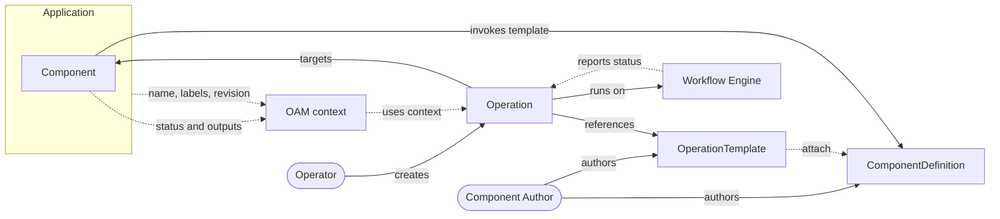
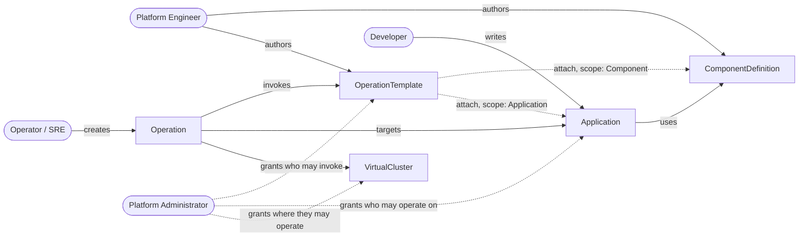
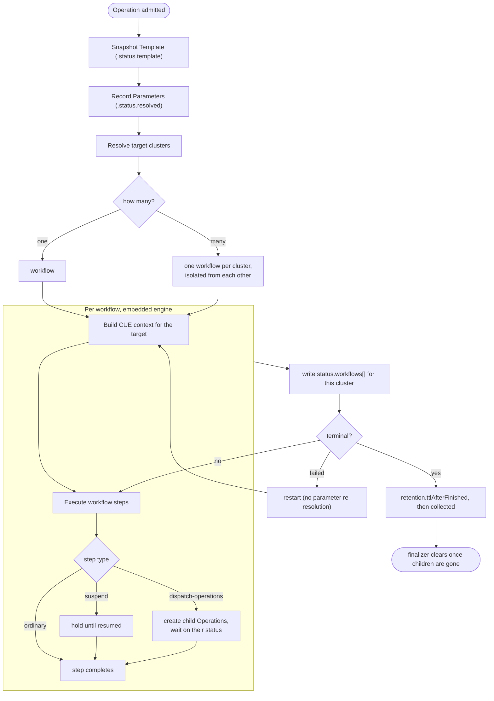
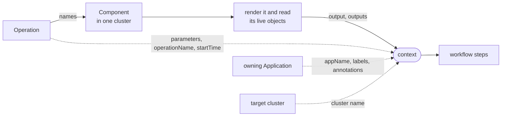
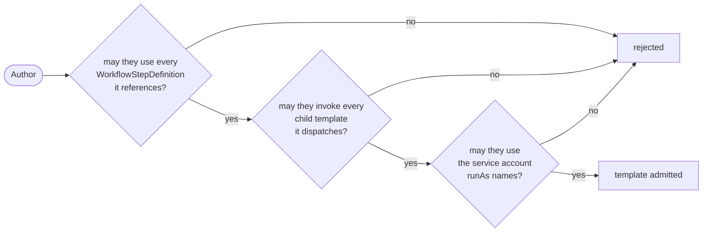
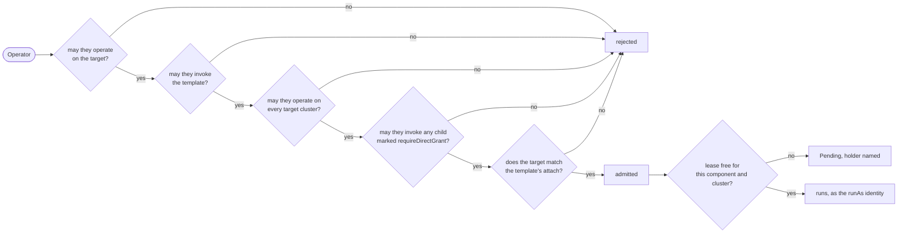
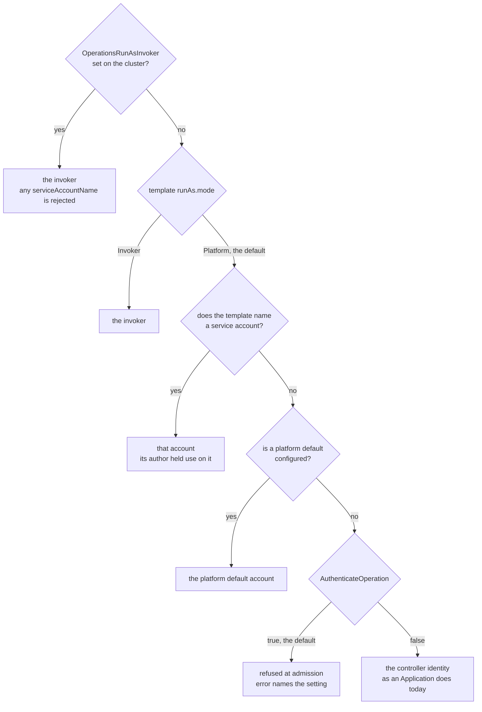

# KEP-2.15: OperationTemplate & Operation

**Status:** Ready for Review
**Parent:** [vNext Roadmap](../README.md)

**A `ComponentDefinition` is an act of encapsulation.** Its author takes expertise about a thing: how an S3 bucket should be configured, what a Postgres instance needs, which knobs a Kafka topic exposes, and packages it so that consumers get the benefit without acquiring the expertise. That is the whole point of the abstraction, and it is why the same author also declares `healthPolicy`; judging whether the thing is *working* is expertise too, and it is theirs.

**That authority currently stops at deployment, and the boundary is arbitrary.** The person who knows how a Postgres instance should be configured is the same person who knows how it is backed up, restored, failed over, and how its credentials are rotated. The definition already reaches past deployment to say what healthy means; it simply has no way to say what *operating* means. So the knowledge lands somewhere else: runbooks, Confluence pages, reactive automations, where it is separated from the component it describes, versioned separately if at all, and free to drift.

`OperationTemplate` and `Operation` close that gap. Day 2 procedures are authored by the component author, shipped with the `ComponentDefinition`, versioned with it, and attached to it, so a team consuming the component inherits its operational knowledge the same way they inherit its configuration. KubeVela does not perform the work; it links the operation to its target, resolves that target's OAM context, and delegates execution to `WorkflowStepDefinition` primitives that call out to whatever actually does the job (Argo Workflows, Crossplane claims, cloud APIs).



The dotted edge from `OperationTemplate` to `ComponentDefinition` is the attachment, which under Component scope is `attach.allowedComponentTypes`. The definition determines the status shape, the template is written against it, and the two are authored and versioned together.

A template may instead attach to the Application, selected by label, in which case it coordinates rather than does the work: its steps dispatch child operations against the components underneath. The picture above is the component case because that is where the encapsulation argument lives; see [Composition and Fan-out](#composition-and-fan-out) for the other.

The OAM context is not a thing anyone declares. It falls out of the Application and the Component that already exist: the app contributes its name, labels and revision, the component contributes the live status and outputs of whatever it rendered. An `Operation` consumes that rather than being told it, which is why an operator invoking a backup does not have to know a bucket name to run one.

The consequence for consumers is the one that matters. A team adopting a `postgres` component today gets deployment and health assessment from its author, and is left to write their own failover. Under this KEP they get the failover too, and when the component author learns something (a new pause-writes step, a corrected ordering), that improvement reaches every consumer through the same upgrade path as any other change to the definition.

## Who Does What



One author, two consumers. The platform engineer publishes a component and the operations that go with it; the developer consumes the first, the operator consumes the second, and both paths converge on the same running Application without either consumer reading what the platform engineer wrote.

| Role | Writes | So that |
|---|---|---|
| **Platform engineer** | `ComponentDefinition`, `WorkflowStepDefinition`, and the `OperationTemplate`s that accompany them | a component arrives with both how to deploy it and how to run it |
| **Developer** | `Application`, naming component types | they get a working deployment without acquiring the expertise behind it |
| **Operator / SRE** | `Operation`, against a component or an application | they get the runbook without acquiring that expertise either |
| **Platform administrator** | RBAC grants on templates, targets and clusters | who may run what, and where, is a decision rather than a convention |

The first two rows are the model KubeVela already has, and [KEP-2.9](../2.9-app-templates/README.md) sets out the same split for delivery: platform engineers publish capability, developers consume it.

**The third row is new.** The delivery KEPs stop at the developer, because delivery stops when the thing is running. Operations add a second consumer of the same encapsulation, arriving later and asking a different question. A developer asks *what can I deploy*; an operator asks *what can I do to what is already deployed*. Both are answered by artifacts the platform engineer wrote, and neither has to read them.

The operator is frequently not the developer and frequently not on the same team, which is why [discovery](#what-this-requires) and [permissions](#permissions) carry as much weight in this KEP as the execution model does. An operation nobody can find, or that anyone can run, fails the person in the third row regardless of how well the first two are served.

## What This Requires

Four things. The first three make the encapsulation real; the fourth is what makes it safe to hand to anyone.

**1. Operations must be declarative.** Platforms sprawl. Runbooks and automations get distributed and lost across disparate systems and teams. Declared rather than programmed, an operation lives beside the definition it accompanies, reviewable in a pull request and versioned with the component, so the knowledge travels from the people who build the component to the people who run it.

**2. Operations must be discoverable.** Encapsulation only pays off if the consumer can find what they have been given. Someone holding a component should be able to ask *what can I do to this?* and be told, without reading the definition's source, and without prior knowledge that a failover procedure exists at all. That means operations are queryable against a target and surfaceable as a list of offered actions, not a set of files somebody has to already know about.

Discoverability is also a safety property rather than only a convenience. If the platform knows which operations apply to which components, it can decline the ones that do not, and nobody is offered a failover for something with no replica to promote.

**3. Operations must be context aware and integrated with OAM concepts.** An operation attached to a bucket should know that bucket's name and region without an operator retyping them; a failover should know the instance's replicas. This is what separates an operation from a `WorkflowRun` that happens to be filed nearby: it participates in the OAM model, reading the target's live state through the same context that component rendering and health assessment already use. Without it the component author's expertise cannot actually be encoded, because the procedure would have to ask its user for the very details the abstraction exists to hide.

**4. Operations must be permissioned.** Day 2 procedures are not uniformly safe. Reading a backup manifest and promoting a replica during an incident are different acts, and the platform has to be able to tell one set of people apart from another. Three distinct questions, all of which need answering:

- *May this user act on this target?* An operation changes a running Application, so being allowed to run backups in general says nothing about being allowed to run one against `payments`. The target is checked in its own right.
- *May this user invoke this operation?* The privileged act is not creating an `Operation`, it is utilising a particular `OperationTemplate` within an Operation. Permission therefore belongs on the template, checked against the invoking user at admission, exactly as an `Application` is checked against the X-Definitions it references today.
- *What may the operation do once it runs?* By default, whatever the template was written to do, under an identity the platform provides. Requiring every operation to impersonate its invoker would mean a developer needed direct RBAC over Jobs and Secrets before they could run a backup, which is the low-level access the abstraction exists to remove. So the grant on the template is the decision, and the identity it runs under bounds the damage if that decision was wrong. Templates that warrant a named human behind them can [ask to assume the invoker's identity instead](#choosing-the-identity-per-template), and a cluster can require it of everything.

The first two are independent and both required. Holding a template does not let you point it at somebody else's application, and owning an application does not let you run procedures nobody granted you.

Requirements 1, 2 and 4 are largely settled and are covered in [Attachment](#attachment), [CLI](#cli) and [Permissions](#permissions). Requirement 3 has [three viable answers](#injecting-the-oam-context-three-options), differing in where coupling sits, how much CUE an author has to write, and what they depend on.

## Scope: Orchestration, Not Execution

KubeVela has no opinion on how an operation actually does its work, and should acquire none. It contributes four things: the **attachment** that links a procedure to the component it belongs to, the **OAM context** that tells the procedure what it is operating on, the **workflow engine** that runs the steps, and the **record** of what happened. The work itself is somebody else's.

Whether a backup turns out to be a Kubernetes Job, an Argo Workflow, a Crossplane claim, a call to a vendor API or an HTTP request to an internal CI system or service is entirely the template author's business. `WorkflowStepDefinition` is already an open vocabulary, and this KEP adds no blessed execution substrate, no `backup` primitive, and no notion of what a correct operation looks like.

**The value is derived from context and attachment, not execution.** What is powerful here is the unification of what is deployed with how it is managed: one description, versioned in one place, for the whole life of the thing. That is what reins platform sprawl back into a single declarative system, and no execution engine can supply it, because the knowledge lives in the OAM model rather than in whatever runs the steps.

**Existing investment can be adopted rather than rewritten.** A team whose backups already run as a GitHub Actions workflow does not port that into an `OperationTemplate`. They wrap the dispatch in a step, attach the template to the component, and get discovery, permissioning, context and a record on top of what they already run.

**Correctness of the procedure is not KubeVela's to guarantee.** It orchestrates, records and refuses to run what the target does not match. Whether the backup is actually restorable, or the failover ordering is right, belongs to the author, which is precisely why [requirement 1](#what-this-requires) insists the procedure be readable enough for a team to check it.

## Mental Model

| Layer | Artifact | Author | Responsibility |
|---|---|---|---|
| Template | `OperationTemplate` | Component / platform author | Declares attachment rules, parameter schema, and the workflow to run |
| Invocation | `Operation` | Operator | Names a template and, unless the template is unattached, a target; supplies parameters; records the result |
| Execution | embedded workflow engine | Controller | Builds the target's context (if any) and runs the workflow to completion |

The separation matters: an `OperationTemplate` is a high-trust artifact published alongside a `ComponentDefinition`, carrying arbitrary workflow steps. An `Operation` is low-trust: it names a template and supplies parameters against a validated schema, and cannot alter what the template does.

**"Target" means the Component or Application an operation was pointed at**, per `attach.scope`, which defaults to `Component`. An Application-scoped operation coordinates; a Component-scoped one does the work; a `None`-scoped one has no target at all and runs its steps directly. See [Composition and Fan-out](#composition-and-fan-out) and [Scope: None](#scope-none-the-unattached-case).

## Injecting the OAM Context: Three Options

All three deliver the same capability and differ in how a workflow step obtains the target's data. They are presented as peers; this KEP uses **Option 1** for its worked examples because it requires nothing that does not already exist, but that is a starting point rather than a conclusion.

### Option 1: Static template, context read by the step definition

The `OperationTemplate` is static YAML naming steps. Each `WorkflowStepDefinition` reads `context` in its own CUE template, exactly as a `healthPolicy` does.

```yaml
- name: backup
  # a step written specifically for aws-s3-bucket components: the template names
  # it and passes a destination, but the step is what knows that a bucket's name
  # lives at status.atProvider.bucketName on the target
  type: s3-backup-job
  properties:
    destination: acme-archive
```

```cue
// s3-backup-job.cue, ships with the aws-s3-bucket ComponentDefinition
template: {
  parameter: destination: string
  output: {
    apiVersion: "batch/v1", kind: "Job"
    spec: template: spec: containers: [{
      image: "my-org/backup-s3:1.4.0"
      env: [
        {name: "SRC_BUCKET",  value: context.output.status.atProvider.bucketName},
        {name: "DEST_BUCKET", value: parameter.destination},
      ]
    }]
  }
}
```

**Coupling moves into the step definition.** `s3-backup-job` knows where an S3 bucket keeps its name, so it is effectively part of the S3 component's module, shipped by the same author, versioned together. That is coherent when the two genuinely belong together.

**The cost is that the step library multiplies with the components.** A step can only read `context` for a shape it was written against, so *every* operation needing target data needs a step written for that component type. A given component might need to offer backup, restore, failover, promote-replica and rotate-credentials, so its module ships five or more bespoke `WorkflowStepDefinition`s, each a CUE file to write, test, scope-label, version and maintain. The next component along ships its own five, differing only in where a hostname or an identifier happens to live.

Worse, it puts the platform's existing step library largely out of reach. `notification`, `request`, `webhook`, `apply-object` and `read-object` all work fine, until the message needs to contain the bucket name, or the URL needs the instance endpoint. At that point there is no way to pass the value in, so the author writes `s3-notification` and `postgres-request`, and the generic steps get reimplemented once per component type.

The counter-argument is real: a well-factored module ships a handful of good steps and reuses them across its own operations, and a step that encapsulates "how we back up S3" is genuinely valuable. But the reuse stops at the module boundary: nothing in `s3-backup-job` is available to any component that is not an S3 bucket, however similar the procedure.

Works today. No dependency on any other KEP. Detailed in [Two ways a step gets its data](#two-ways-a-step-gets-its-data).

### Option 2: CUE template rendered at invocation

The `OperationTemplate` is a CUE template producing a workflow, as [KEP-2.9](../2.9-app-templates/README.md)'s `ApplicationDefinition` produces an Application spec. It is evaluated per `Operation`, with the target's context and the operator's parameters concrete.

```cue
template: {
  parameter: {destination: string, verify: *true | bool}
  output: workflow: steps: [
    {
      name: "backup"
      type: "job"                 // generic step, as in Option 3
      properties: {
        name:  "backup-\(context.operationName)"
        image: "my-org/backup-s3:1.4.0"
        env: {
          SRC_BUCKET:  context.output.status.atProvider.bucketName
          DEST_BUCKET: parameter.destination
        }
      }
    },
    // only this option can decide whether a step exists at all
    if parameter.verify {
      {name: "verify", type: "job", properties: {
        image: "my-org/backup-s3:1.4.0"
        env: {MODE: "verify", DEST_BUCKET: parameter.destination}
      }}
    },
  ]
}
```

**The most powerful, and the most to maintain.** Steps can be generated and conditional: the `if` above, or "one snapshot step per PVC this component happens to have", which is expressible here and nowhere else. Note the step itself is the same generic `job` as Option 3 uses; what differs is that the workflow around it is computed. The costs are real: authors write and test non-trivial CUE, errors move from `kubectl apply` to the middle of a running operation, and the stored template is opaque to the API server, so no structural validation and no `kubectl explain`.

It also stops being a new kind of object. In this form the artifact is an X-Definition, and should be named `OperationDefinition`, inheriting `vela def`, `DefinitionRevision`, and distribution through the addon and module machinery that already ships `ComponentDefinition`s.

Detailed in [Option 2 in detail](#option-2-in-detail-render-time-cue).

### Option 3: Expressions carry context into generic steps

The `OperationTemplate` stays static YAML, but step properties may contain the bounded expressions [KEP-2.16](../2.16-source-definition/README.md) introduces, so context and platform data can be passed into steps that know nothing about the component.

```yaml
- name: backup
  type: job                       # generic step; the template supplies the data
  properties:
    name:  'backup-$(context.operationName)'
    image: my-org/backup-s3:1.4.0
    env:
      SRC_BUCKET:  '$(context.output.status.atProvider.bucketName)'
      DEST_BUCKET: acme-archive
```

**Coupling stays visible in the template and is checked at admission.** The expression grammar is deliberately bounded: no conditionals, comparisons or function calls, so result types are a function of operand types and paths can be type-checked before an `Operation` is ever created. That restriction is also why it cannot generate steps, only fill them.

All three examples above run the same container with the same environment. What differs is where the line `SRC_BUCKET = context.output.status.atProvider.bucketName` is written:

| | Where that line lives | Consequence |
|---|---|---|
| 1 | inside `s3-backup-job.cue` | written once, reused by every operation on that component type, invisible to anyone reading the operation |
| 2 | in the template's CUE | visible, and the surrounding workflow can be computed from it |
| 3 | in the template's YAML | visible and admission-checked, but restated by every operation that needs it |

It is not three architectures; it is one line of knowledge and three places to keep it.

> **The `job` step is hypothetical.** There is no built-in `job` `WorkflowStepDefinition` today. The examples above use one because a step taking a name, an image and some environment reads clearly and keeps the comparison about where knowledge lives rather than about YAML. In practice the equivalent is `apply-object` carrying a `batch/v1` Job, or a purpose-built step of the kind Option 1 requires anyway. The same applies to `s3-backup-job` and the other named steps throughout this KEP: they are illustrative, not proposed additions to the built-in library.

Detailed in [Option 3 in detail](#option-3-in-detail-expression-based-inputs).

### Comparison

| | 1: Static + step reads context | 2: CUE template | 3: Expressions |
|---|---|---|---|
| Where the component coupling lives | `WorkflowStepDefinition` | the template | the template |
| Visible at the call site | no | yes | yes |
| Checked before running | no | no | yes, at admission |
| Generic steps usable | no | yes | yes |
| Can generate / loop steps | no | **yes** | no |
| Author must write CUE | for each step | for the template | no |
| Existing step library usable with target data | no | yes | yes |
| Steps to write and maintain | one or more **per component type × operation** | none beyond what exists | none beyond what exists |
| Depends on other KEPs | none | none | KEP-2.16 extensions |
| Available today | **yes** | needs a renderer | needs KEP-2.16 |

The step-count row is the one that compounds. Options 2 and 3 let an operation author reach for whatever already exists: the platform's steps, another module's steps, a step they wrote for something else, and supply the differences declaratively. Option 1 requires that any step touching target data be written for that component type, so the library grows with the product of components and operations rather than staying a shared set. At one component it is invisible; at twenty it is the dominant maintenance cost of the feature.

They are not mutually exclusive. Option 1 and Option 3 compose: a template can pass some values explicitly and let a bespoke step read others, which is a feature when a module ships its own steps, and a hazard if it becomes the path of least resistance in both directions. Option 2 subsumes both and replaces the template format.

### What does not depend on this choice

Most of this KEP. Attachment, the `Operation` CR, execution through the workflow SDK, re-execution, the CLI, status and retention are identical under all three. The decision is scoped to how a step obtains its data, not to three competing designs, and can be revisited without disturbing the rest.

## OperationTemplate

`OperationTemplate` is a namespaced CRD in the `core.oam.dev/v2alpha1` API version.

```yaml
apiVersion: core.oam.dev/v2alpha1
kind: OperationTemplate
metadata:
  name: s3-backup
  namespace: payments-prod
spec:
  # ── what this operation may attach to ──
  attach:
    scope: Component
    allowedComponentTypes: [aws-s3-bucket]

  # ── operation flags. Anything describing the target is read from the
  #    context by the steps themselves, not asked of the operator. ──
  parameters:
    openAPIV3:
      type: object
      properties:
        verify:
          type: boolean
          default: true
          description: Verify the backup after writing it
        retentionDays:
          type: integer
          default: 30

  # ── what it does ──
  workflow:
    steps:
      - name: backup
        # reads context.output.status.atProvider.* for the bucket and region,
        # and context.operationParams.retentionDays. See the definition below
        type: s3-backup-job
        properties:
          destination: acme-archive

      - name: verify
        if: context.operationParams.verify
        type: s3-verify-backup

      - name: record
        type: write-status
        properties:
          patch:
            lastBackup:
              status: success

      - name: cleanup
        if: always
        type: clean-jobs
        properties:
          labelSelector:
            operation.oam.dev/name: context.operationName
```

The step definitions read the target Component's live state directly, the same way that component's own `healthPolicy` would. That is not a figure of speech: it is the same context map, built by the same call.

`Component.GetTemplateContext` (`pkg/appfile/appfile.go`) asks the rendering engine for the component's live objects and adds its parameters, and `Component.EvalStatus` evaluates the CUE against the result. The application-controller reaches it through `collectWorkloadHealthStatus` and `collectHealthStatus` (`pkg/controller/core.oam.dev/v1beta1/application/apply.go`), which is what populates `context.output` and `context.outputs` for a `healthPolicy` today. An operation's step templates are handed the same map, so a component author who has written one already knows how to write the other. The full chain is in [Reusing the health-evaluation path](#reusing-the-health-evaluation-path).

```cue
// s3-backup-job.cue
"s3-backup-job": {
  type: "workflow-step"
  labels: "scope.oam.dev/operation": "true"
}
template: {
  // the step's own properties, from the workflow spec
  parameter: destination: string

  output: {
    apiVersion: "batch/v1"
    kind:       "Job"
    metadata: {
      name: "backup-\(context.operationName)"
      labels: "operation.oam.dev/name": context.operationName
    }
    spec: template: spec: {
      restartPolicy: "Never"
      containers: [{
        name:  "backup"
        image: "my-org/backup-s3:1.4.0"
        env: [
          {name: "SRC_BUCKET",     value: context.output.status.atProvider.bucketName},
          {name: "SRC_REGION",     value: context.output.status.atProvider.region},
          {name: "DEST_BUCKET",    value: parameter.destination},
          {name: "DEST_PREFIX",    value: "\(context.appName)/\(context.componentName)"},
          {name: "RETENTION_DAYS", value: "\(context.operationParams.retentionDays)"},
        ]
      }]
    }
  }
}
```

Everything here works against the feature set that exists today. The `OperationTemplate` is plain YAML with no expression language; step properties are literal; `if:` is the engine's own CUE, evaluated at step time with `context` in scope; and step templates read `context` exactly as component and trait templates already do. Nothing in this baseline depends on [KEP-2.16](../2.16-source-definition/README.md) or on any change to it.

> **This example uses [Option 1](#option-1-static-template-context-read-by-the-step-definition).** Under [Option 3](#option-3-in-detail-expression-based-inputs) the `backup` step would name a generic step and receive `SRC_BUCKET` as a property, so there would be no `s3-backup-job.cue` at all; under [Option 2](#option-2-in-detail-render-time-cue) the `workflow` block would be a CUE template producing these steps rather than listing them. The `attach` and `parameters` blocks, and everything from [`Operation`](#operation) onward, are identical in all three.

> **Design exploration (not yet accepted):** [Design 01](./design/01-application-wrapper.md) proposes an alternative execution model in which an `Operation` renders a temporary `Application` and lets the Application controller run the workflow, gaining `components`, `traits`, and policy-driven placement and resource lifecycle. It is a strict superset of the model described here, the `attach`, `parameters`, and `sources` blocks are identical, so it remains available as a later increment. This KEP's direct workflow execution remains the baseline.

### Parameters

`spec.parameters` declares what an operator may supply, as either an OpenAPI v3 schema or a CUE `parameter{}` block.

**Offering OpenAPI at all differs from KubeVela convention.** Every other artifact in the ecosystem declares its inputs as CUE, and an author moving between a `ComponentDefinition` and an `OperationTemplate` would reasonably expect the same.

The argument for offering it is that OpenAPI is already generated and persisted for every definition, just not in the definition itself. On reconcile, the definition controllers call `StoreOpenAPISchema` (`pkg/controller/utils/capability.go`), which compiles the CUE `parameter{}` block and writes an OpenAPI v3 schema into a companion ConfigMap, for both the definition and its revision. That ConfigMap is what UIs render forms from, and [KEP-2.16](../2.16-source-definition/README.md) describes the same form backing `ConfigTemplate.data.schema`. SDK generation (`vela def gen-api`, `pkg/definition/gen_sdk`) has its own OpenAPI path and is a separate consumer.

So the shape is already there; the question is where it lives. Declaring it in the CR puts the schema in the object rather than in a generated sidecar, and lets the API server validate it structurally, which it cannot do for a CUE string.

**Both forms are supported, and the field says which.** This follows the shape `Schematic` already uses for the same kind of choice (`apis/core.oam.dev/common/types.go`), where `cue` and `terraform` are mutually exclusive keys rather than a guessed type:

```yaml
# OpenAPI, the form a Kubernetes user reads everywhere else
parameters:
  openAPIV3:
    type: object
    required: [destination]
    properties:
      destination: {type: string}
      verify: {type: boolean, default: true}
```

```yaml
# CUE, the form every other KubeVela artifact uses
parameters:
  cue: |
    destination: string
    verify: *true | bool
```

The controller resolves whichever is present when the `Operation` is admitted: an OpenAPI schema validates the supplied parameters directly, a CUE block unifies them and reports CUE's own errors. Both are checked before the operation runs, so this is not a trade of safety for convenience.

Supporting both is cheap because neither is new. OpenAPI validation is ordinary, and the CUE path is the same compilation the definition controllers already perform in `StoreOpenAPISchema`.

**Exactly one of them, and it needs enforcing.** `parameters` itself is optional, but if it is present then exactly one of `openAPIV3` and `cue` must be set. This is the one place not to follow the precedent: `Schematic` permits both, and `pkg/appfile/template.go` resolves the ambiguity by assigning the CUE template and then letting Terraform overwrite it. An object with both set is accepted and quietly behaves as one of them. Nothing rejects it, and nothing tells the author which one won.

Rejection belongs at admission, alongside the checks the definition validating handlers already run. A CRD-level rule would be tighter still, since `x-kubernetes-validations` with `has(self.openAPIV3) != has(self.cue)` catches it in the API server with no webhook round trip, but no CRD in this repo uses CEL validation yet, so that would be a first rather than a reuse. Either is fine; silently preferring one is not.

**CUE is more expressive than OpenAPI, so the two are not interchangeable.** Constraints CUE can state and OpenAPI cannot will validate under one form and not the other. That is already true of every definition today, where the derived OpenAPI is a lossy view of the CUE, so it is a known asymmetry rather than a new one. Worth documenting, not worth designing around.

**Two forms means two paths to keep behaving alike.** The guard is that they share a compiler and neither is bespoke to Operations. It is also why a *third* compact shorthand is still deliberately not offered: two established forms with existing tooling is reuse, a third invented spelling is drift.

Which form suits depends on the artifact rather than on the author. A YAML manifest reads better with OpenAPI, and it is what a Kubernetes user already knows how to read. Under [Option 2](#option-2-in-detail-render-time-cue), where the whole artifact is CUE, a `parameter{}` block belongs with the rest of it. Supporting both means that choice does not have to be made now, and does not have to be unpicked if Option 2 is adopted later.

The broader question, whether KubeVela should declare OpenAPI generally rather than deriving it, is wider than one KEP and is recorded in the [open questions](#open-questions).

### Attachment

`spec.attach` declares what the operation may be run against. It answers *availability*: is this operation offered for this target at all, and nothing more. A template never acts on anything; the `Operation` does, and only against a target the template admits.

**Two of the three scopes attach to different kinds of thing, which is worth noticing.** Component scope binds to a component *type*, so a template written against an `aws-s3-bucket` is applicable wherever that definition is used and nowhere else. Application scope has no type to bind to, so it selects Application *instances* by label. The third scope, `None`, attaches to nothing at all; see [below](#scope-none-the-unattached-case).

That asymmetry follows from what exists. A `ComponentDefinition` is the contract a component-scoped template is written against, and reading its status shape is the whole point. There is no equivalent contract for an Application: two Applications carrying the same label may contain entirely different components. So an application-scoped template can assert what must be present (`requiredComponentTypes`) but cannot be written against a declared shape the way a component-scoped one is, and its steps [dispatch to components](#composition-and-fan-out) rather than reading the Application directly.

**Component scope** restricts by component type:

```yaml
attach:
  scope: Component
  allowedComponentTypes: [aws-s3-bucket]   # empty means unrestricted
```

**Application scope** restricts by label, annotation and the presence of component types:

```yaml
attach:
  scope: Application
  selector:
    matchLabels:
      dr.oam.dev/enabled: "true"
    matchExpressions:
      - {key: env, operator: In, values: [prod, staging]}
    requiredComponentTypes: [postgres]     # all listed types must be present
```

**Either scope may also constrain clusters.** `allowedComponentTypes` and `selector` say what the template understands on the target axis; `clusterSelector` says the same on the cluster axis, and it is optional in both scopes:

```yaml
attach:
  scope: Component
  allowedComponentTypes: [aws-ebs-volume]
  clusterSelector:
    matchLabels:
      provider: aws                        # this snapshot procedure is not portable
```

It is evaluated by listing clusters and matching their labels, which works today: a `VirtualCluster` carries `Labels`, and `FindVirtualClustersByLabels` (`pkg/multicluster/virtual_cluster.go`) is the existing lookup. Nothing about it requires cluster metadata in the CUE context, which is a separate question owned by [KEP-2.20 Design 04](../2.20-module-versioning/design/04-cluster-context.md) and still open. `clusterSelector` is meaningful under `None` too, in the narrower sense of restricting which clusters the operator may pass in `spec.clusters`; see [below](#scope-none-the-unattached-case).

**A cluster excluded by `clusterSelector` is refused, not skipped.** That is a deliberate difference from the [operator's own selector](#running-across-clusters), where a cluster matching `--clusters region=eu` but not running the component is skipped and reported. The operator's net was wide and being in an EU cluster without the component is not an error. `clusterSelector` is the author saying the procedure does not work there, so naming such a cluster explicitly fails at admission rather than quietly dropping it. Skip when the operator's net was wide; fail when the author's constraint was crossed.

`scope` defaults to `Component`. An Application-scoped operation exists to coordinate: its workflow dispatches [child operations](#composition-and-fan-out) against the components underneath, and it is the level at which "fail this application over" is a single reviewable thing rather than a script.

**Coordinating does not mean running centrally.** The `Application` object lives on the hub, but an Application-scoped operation still [fans out to a workflow per cluster](#cluster-targeting) like any other, and those workflows run in the target clusters rather than on the hub. The [failover example](#worked-example-dr-failover-with-a-human-gate) leans on this: `spec.clusters` names only the surviving region, so the coordinating workflow runs *there*, which is the point when the region being abandoned might have taken the hub with it. Scope decides what a workflow does once it is running, dispatch children or act directly; it does not decide where it runs.

**One kind with a scope field, not three kinds.** All three share parameters, workflow, sources, permissions, `runAs`, retention and status; what differs is `attach`, part of the context, and which steps make sense. That is a mode rather than a different artifact, so splitting them would duplicate a schema to express one field. It also keeps RBAC, discovery and the webhook path singular, and means a future fourth scope is a value rather than another CRD. `None` in particular earns its keep only because it is a value here rather than a second controller with its own schema, RBAC and CLI verb; see [Execution Model](#execution-model) for what that convergence is worth.

`OperationTemplate` avoids that by **mirroring `scope` into a label**, for the same reason [step scope](#workflowstepdefinition-scope) belongs in labels: they are server-side selectable. Discovery then filters with a selector rather than fetching and inspecting, and nobody has to build an index to answer "which of these apply to an Application" — or, for `None`, "which of these need no target at all".

Fields that are only meaningful in one scope, `selector` under Application and `allowedComponentTypes` under Component, are rejected in the wrong one at admission; under `None` both are rejected. `clusterSelector` is the exception, being meaningful in every scope, `None` included. That is the same validation obligation as the [parameters union](#parameters), and the same two ways of discharging it.

### Scope: None, the unattached case

`scope: None` is what makes `Operation` capable of everything `WorkflowRun` does today, inside the same primitive rather than a neighboring one:

```yaml
attach:
  scope: None   # no target, no context, no placement resolution
```

**`spec.target` is optional, and only under this scope.** Every other scope requires it; `None` is the one case where an `Operation` may be created without one. When it is absent, the controller skips both steps that a target would otherwise drive: it does not build a CUE context from a target's live status (there is no target to read), and it does not resolve placement from a topology policy (there is nothing to place). The workflow's steps run directly, against whatever they name themselves, exactly as a `WorkflowRun`'s steps do today.

**This is parity, not a reduced mode.** Permissions, discovery, retention, `runAs`, and the CLI are unchanged: an unattached operation is checked against the invoker exactly as an attached one is, [`clusterSelector`](#attachment) still restricts which clusters an operator may name in `spec.clusters` (there is no target to fan out over, but nothing stops an operator asking for a step to run in more than one), and it shows up in `vela operation list` and `status` like any other. What it does not get, because there is nothing for it to get, is a populated `context.output`/`context.outputs` and automatic multi-cluster placement — a step wanting either has to be pointed at a target instead, which is what the other two scopes are for.

**Why this, and not a fourth CRD or an upstream change to `WorkflowRun`.** `WorkflowRun` is delivered as an optional addon precisely so an install can omit it (KEP-2.7); extending its type would either force every install to carry the controller or leave `Operation` unable to rely on it being present, and the type itself lives in a separately-released module (`github.com/kubevela/workflow`), so the change would need upstream coordination before it reached here at all. `scope: None` needs none of that: it is a value on a type this KEP already introduces, checked by the webhook this KEP already specifies, so the cost of the unattached case is the cost of making `None` a first-class value rather than a fourth CRD, a second controller, or a second release train.

Two enforcement points, serving the two requirements attachment exists for:

- **Discovery**, `vela operation list --app <name>` and VelaUX offer only the templates whose selector matches, so a consumer can ask what can be done to a component and be told. This is requirement 2, and it is the primary purpose of the selector rather than a by-product of it.
- **Admission** rejects an `Operation` whose target does not match. An operator is never offered a failover for something with no replica to promote, and cannot construct one by hand either.

Attachment is therefore doing two jobs that look similar and are not: describing what an operation *understands* (which component types expose the status shape it reads), and controlling what it is *offered for*. Both are expressed here because they coincide in the common case, but a template that understands a type it should not be routinely offered on, a destructive repair procedure, say, is a real case, and one the selector should be able to express without widening what admission permits.

## Operation

`Operation` is a namespaced, run-to-completion CR. Each represents a single execution. Recurring operations are achieved by creating new `Operation` CRs (via CronJob, automation, or `vela operation run`).

```yaml
apiVersion: core.oam.dev/v2alpha1
kind: Operation
metadata:
  name: backup-payments-db-20260804
  namespace: payments-prod
spec:
  template: s3-backup

  # target names the Component or Application this operation attaches to.
  # Required for every scope except None, where it is omitted entirely:
  # see [Scope: None](#scope-none-the-unattached-case).
  target:
    kind: Component
    name: payments-db

  # clusters restricts which of the target's clusters are operated on.
  # Omitted means every cluster the target is dispatched to. Under scope
  # None there is no target to dispatch from, so clusters names them directly.
  clusters: [eu-west-1, eu-central-1]


  # Flags only. Nothing here describes the bucket: the steps read that from
  # the target's own context. With the optional expression layer, these values
  # may themselves be expressions; in the baseline they are literals.
  parameters:
    retentionDays: 90
    verify: true

  # retention governs the Operation record itself, not the resources it creates.
  retention:
    ttlAfterFinished: 1h
    onFailure: Retain

```

## Execution Model

The operation-controller executes the workflow using the **embedded workflow engine**, the Go library described in [KEP-2.7](../2.7-workflowrun/README.md), which is "always present on the spoke" wherever a component-controller runs.

It deliberately does **not** create a `WorkflowRun`. KEP-2.7 makes the standalone WorkflowRun controller *optional* (bundled by default, disableable). An `Operation` that depended on it would silently fail to run wherever it had been switched off. The embedded engine has no such failure mode, and the component-controller already embeds it for Component lifecycle workflows, so this follows an established pattern rather than introducing one.

**`Operation` and `WorkflowRun` converge rather than staying permanently separate features.** An early draft of this KEP drew a hard boundary — "an `Operation` is hub-orchestrated and cluster-aware; a `WorkflowRun` is spoke-local and single-cluster" — and treated the two as different kinds of thing for different jobs. That is the wrong place to draw it. `WorkflowRun`'s own KEP describes it as "an independent controller for running arbitrary workflows outside Component/Application scope" (KEP-2.7), which is exactly [`scope: None`](#scope-none-the-unattached-case): no target, no context, no placement resolution, steps that run as they are written. An `Operation` under that scope *is* what a `WorkflowRun` is today, inside the primitive this KEP already specifies, with the same permissions, discovery, retention and CLI every other scope gets for free.

Three implementation paths were weighed for closing this gap:

- **Extend `WorkflowRun` itself** to be target- and cluster-aware. Rejected: the type lives in `github.com/kubevela/workflow`, a separately-released module, so this is a coordinated upstream change rather than a local one; it also reverses KEP-2.7's own rationale for keeping the controller optional, since an `Operation` depending on it would fail silently wherever it was disabled; and once extended this way it is `Operation` under a different name, which is the "two ways to do one thing" drift this KEP rejects everywhere else, one level up.
- **Let `Operation` support the unattached case**, via `scope: None`. Adopted. One controller, one CLI, one permissions model, whether or not a given operation has a target. The cost is low because the machinery is being built either way; what changes is treating `None` as a first-class value rather than a validation-skipping afterthought.
- **Client-side execution**, where the CLI itself fetches a template and runs its steps against the invoker's own kubeconfig rather than an on-cluster controller. Considered and deferred: it trades away exactly the property this KEP exists to provide, a durable, resumable, auditable record of what ran, for simpler RBAC. Out of scope for this KEP.

**Migration is incremental, not a flag day.** The `WorkflowRun` addon stays available and unchanged while `scope: None` operations are proven out; it is deprecated only once parity is confirmed, at which point a cluster can retire the addon without losing anything a bare workflow could do. Nothing here requires migrating existing `WorkflowRun`s on any particular timeline.

So attachment is something an `Operation` usually has rather than what defines it, and there is a real class of work with an OAM target of neither kind: fleet-wide reads, cluster bootstrap checks, anything whose subject is the cluster. That is distinct from the unattached case above, since the cluster *is* a target, just not a Component or Application one. [Design 04](./design/04-cluster-scope.md) works that case through as a further `scope: Cluster`. It is deliberately secondary to the thesis of this KEP and shares its machinery rather than extending its argument.

### The shape of a reconcile

Admission is covered by the two decision trees under [Permissions](#permissions) and is not repeated here. This is what happens once an `Operation` is admitted:



Three things in that flow are the ones worth arguing with, and each is stated elsewhere in this KEP rather than only in the picture.

**Parameters and the template are fixed at creation; nothing else is.** `spec.parameters` evaluate once and are recorded, and the template is snapshotted, so a `restart` runs the same procedure with the same arguments. `context` and sources deliberately are *not* fixed: both resolve when a step executes, so a re-run observes the world as it is now. See [Stability across steps](#resolution-timing-by-root), where freezing sources was considered and rejected.

**Clusters fan out, children do not.** One `Operation` becomes N workflows because it is one procedure applied in several places. Dispatched children are separate `Operation` objects because they are *different* procedures against different targets. Those two multiplicities are easy to conflate and behave differently under failure.

**A child is an ordinary `Operation`.** It is created by the controller, admitted like any other, and finalized like any other, which is why the parent cannot go until its children have. What child admission does *not* do is re-litigate the invoker's grants: those were settled when the parent was applied, [`requireDirectGrant`](#requiring-a-direct-grant-instead) included, so a permission refusal never surfaces mid-run. What can still fail at dispatch is anything that depends on the state at that moment, a target that no longer matches `attach` or a [lease](#concurrency) held by someone else.

### Type reuse

Neither CRD introduces a type that already exists. The novel surface is small and deliberately so:

| Field | Type | Source |
|---|---|---|
| `spec.workflow` | `WorkflowSpec` | `github.com/kubevela/pkg`, `apis/oam/v1alpha1/workflow_types.go` |
| `spec.workflow.steps[]` | `WorkflowStep` | same |
| `spec.sources[]` | source binding | the type [KEP-2.16](../2.16-source-definition/README.md) introduces for `Application.spec.sources[]` |
| `spec.parameters` | OpenAPI v3 schema | the same shape `StoreOpenAPISchema` already derives for every Definition |
| `status.workflows[].` (phase, steps, contextBackend) | `WorkflowRunStatus` | `github.com/kubevela/workflow`, the same status an Application stores |
| **`spec.attach`** | new | the only genuinely new concept |
| **`spec.retention`, `attempts[]`, `children[]`** | new | run-to-completion lifecycle and composition |

An `Operation` is close to *`Application` minus `components`, `policies` and `traits`, plus `attach`*. Where the two overlap they are the same types, so a change to `WorkflowStep` reaches both without a porting step.

**The subtraction is where this most likely goes next.** An `Operation` is an Application with a short lifecycle, and the fields it currently lacks are exactly the ones that would let a template reach for the platform's definition library instead of hand-written step YAML: `components` for the work itself, `traits` for what surrounds it. That would close the [step-count problem](#comparison) at its root rather than working around it, since a `task` component brings a parameter schema, a health policy and a status reader that somebody already maintains.

[Design 01](./design/01-application-wrapper.md) sets out what that buys and the one thing that makes it hard: owning resources means collecting them, and an operation whose purpose is to leave something behind must not silently revert on success. That is a solvable problem rather than a reason to rule it out, and it is why this KEP treats the omission as a starting point rather than a boundary.

`policies` is the exception and should stay subtracted. It is [a compilation target, not an authoring surface](./design/01-application-wrapper.md#policies-are-compiled-never-exposed): the moment a template can write raw policies, an `Operation` becomes an Application with extra steps and the abstraction stops earning anything.

### Workflow reuse

An `Operation`'s workflow is not an Application's workflow, but it is not a lookalike either. `OperationTemplate.spec.workflow` is `WorkflowSpec` from `github.com/kubevela/pkg` (`apis/oam/v1alpha1/workflow_types.go`), the same Go type an `Application` and a `WorkflowRun` use, so there is no translation layer between the template and the engine and nothing to drift.

Everything a step can do in an Application workflow it can do here:

| Field | Notes for Operations |
|---|---|
| `name`, `type`, `properties` | as in an Application |
| `if` | including `always`, which supplies cleanup and compensation |
| `timeout` | per-step bound, including on a `dispatch-operations` step waiting on children, so nothing waits forever unless it was told to |
| `dependsOn` | explicit ordering independent of list order |
| `inputs` / `outputs` | step-to-step data passing, a snapshot step emits an identifier the restore step consumes |
| `subSteps` + `mode` | `DAG` or `StepByStep`, so a fan-out group runs in parallel while the operation as a whole stays ordered |
| `meta.alias` | human-facing label |

`inputs`/`outputs` matter more here than they might appear. An operation is often a chain where each step's result is the next step's argument: a snapshot ID, a lease token, a promoted endpoint, and that already works without a bespoke mechanism.

Consistency is the default, and deviating from it is what needs justifying: a step author writing for both surfaces should not have to learn two shapes, and the engine should not need an adapter that can drift.

### Executing the workflow

The operation-controller follows the same sequence the application-controller uses (`pkg/controller/core.oam.dev/v1beta1/application/generator.go` and `application_controller.go`). The differences are in what is supplied, not in how it is driven.

```go
// 1. Build the CUE process context. This is what steps see as `context`.
//    The Application builds it from the app; the Operation builds it from the
//    target, plus the parameters fixed on the CR.
pCtx := velaprocess.NewContext(generateContextDataFromOperation(ctx, op, target))

// 1a. Attach the identity the operation runs as, resolved from the template's
//     runAs mode. Everything that touches the cluster inherits it.
ctx = auth.ContextWithUserInfo(ctx, identityFor(op, template))

// 2. Inject runtime capabilities. An Operation needs a strict subset of the
//    Application's: it renders no components, so ComponentApply and
//    ComponentRender are omitted. WorkloadRender and ComponentHealthCheck are
//    retained: they are how context.output and .outputs are populated,
//    the same routine that serves healthPolicy.
ctx.SetContext(oamprovidertypes.WithRuntimeParams(ctx.GetContext(), oamprovidertypes.RuntimeParams{
    WorkloadRender:       ...,   // renders the target component
    ComponentHealthCheck: ...,   // reads its live objects
    KubeHandlers:         &providertypes.KubeHandlers{Apply: h.Apply, Delete: h.Delete},
    ConfigFactory:        ...,
    KubeClient:           h.Client,
    // ComponentApply / ComponentRender / Appfile / App: not supplied
}))

// 3. Build the WorkflowInstance. ChildOwnerReferences point at the Operation,
//    so the engine's context backend is collected with the Operation record.
instance := &wfTypes.WorkflowInstance{
    WorkflowMeta: wfTypes.WorkflowMeta{
        Name: op.Name, Namespace: op.Namespace, UID: op.UID,
        Labels: op.Labels, Annotations: op.Annotations,
        ChildOwnerReferences: []metav1.OwnerReference{ /* → Operation */ },
    },
    Steps: template.Workflow.Steps,
    Mode:  template.Workflow.Mode,
}
instance.Status = copyWorkflowStatusToInstance(op)   // resume across reconciles
executor.InitializeWorkflowInstance(instance)

// 4. Generate runners and execute.
runners, err := generator.GenerateRunners(ctx, instance, wfTypes.StepGeneratorOptions{
    Compiler:       providers.DefaultCompiler.Get(),
    ProcessCtx:     pCtx,
    TemplateLoader: template.NewWorkflowStepTemplateRevisionLoader(...),
})
state, err := executor.New(instance).ExecuteRunners(authCtx, runners)
```

Four points where an Operation differs:

**The process context is built from the target, not the app.** `generateContextDataFromOperation` is the analogue of `generateContextDataFromApp`, and it is the single place the OAM context the KEP is built on gets assembled: target output and outputs from the health-assessment routine, the operation's parameters, cluster metadata. Sources are not in it. They only exist at all under [Option 3](#option-3-in-detail-expression-based-inputs), and there they resolve per step as their expressions are evaluated rather than being assembled into the context up front.

**Status round-trips through `WorkflowRunStatus`.** `copyWorkflowStatusToInstance` restores phase, suspend state, step statuses, and the context backend reference across reconciles, exactly as the Application does, which is what makes suspend/resume and re-execution work without bespoke state. Each entry in `Operation.status.workflows[]` stores one verbatim; the cluster, children and attempt history sit alongside rather than replacing it.

**The execution identity is explicit.** The application-controller wraps its context with `auth.ContextWithUserInfo` before applying (`generator.go`), sourced from annotations on the Application. An Operation resolves the same annotations, but the value comes from [`runAs`](#choosing-the-identity-per-template) on the template rather than from the target: a named service account, the invoker, or the invoker regardless if the cluster gate demands it.

**Terminal handling differs, and only here.** The Application maps `WorkflowStateSucceeded` back to `ApplicationRunning` and keeps reconciling. The Operation maps it to `Succeeded`, records `completionTime`, stops, and lets `spec.retention` govern the record. This is the entire behavioural difference between the two controllers.

### Observability additions go in `meta`

Where Operations do need more than an Application, the extension point is `WorkflowStepMeta`, which already exists for `alias` and is the designated home for human-facing metadata. Adding optional fields there keeps `WorkflowStep` itself identical for the engine, which ignores `meta` entirely, while the CLI and UI render it.

```yaml
- name: promote-replica
  type: promote-replica-job
  meta:
    alias: Promote replica
    description: >
      Promotes the read replica to primary. Writes are unavailable
      until this completes, and it cannot be undone by re-running.
    impact: Irreversible
```

| Field | Purpose |
|---|---|
| `alias` | existing, short label |
| `description` | what the step does and why, rendered by `vela operation status`. A runbook read during an incident is read by someone who did not write it. |
| `impact` | `Safe` / `Disruptive` / `Irreversible`. Renders in `status`, and gates re-execution alongside the step definition's `idempotent` declaration. |

`impact` is the one with teeth. `vela operation status` showing which steps have already had irreversible effects is the difference between an operator who can reason about a half-failed failover and one who is guessing. It is deliberately author-declared rather than inferred, the engine cannot know, and a wrong inference here is worse than none.

These are additive optional fields on a shared type, so an `Application` gains them too and simply does not render them. That is preferable to forking `WorkflowStep` for Operations, which would put the two surfaces on a path to drifting.

### Fields worth adding to `StepStatus`

`StepStatus` (`github.com/kubevela/workflow`, `api/v1alpha1/types.go`) is `{ID, Name, Type, Phase, Message, Reason, FirstExecuteTime, LastExecuteTime}`. Everything a step wants to say beyond phase has to go through free-text `Message`, which callers then parse. Three additions would serve Applications and `WorkflowRun` as much as Operations, and each has precedent in `ApplicationComponentStatus` or an existing engine behaviour that is computed but discarded.

| Field | Why | Precedent |
|---|---|---|
| `Details map[string]string` | Structured progress without string-parsing a message, e.g. `deploy` with `parallelism` reporting per-batch counts. **Two-part change:** the field on `StepStatus`, plus a writer on the `Action` interface, which today exposes only string-valued methods. | `ApplicationComponentStatus.Details` |
| `Retries int` | The engine already computes retry state (`failedAfterRetries`, `checkFailedAfterRetries` in `pkg/executor/workflow.go`) but persists only a message constant. How many times a step retried before succeeding is currently unknowable from status. | behaviour exists; only the count is missing |
| `Cluster string` | Which cluster the step executed against. Absent today, and needed the moment a workflow targets more than one, true for multi-cluster Applications as much as for Operations. | `ApplicationComponentStatus.Cluster` |

`Retries` is the strongest of the three: the information already exists inside the executor and is discarded at the status boundary, which is a pure loss and the first question anyone asks about a step that eventually went green.

`Details` is explicitly **not** required by this KEP. [Child status](#child-status-and-lifecycle) is aggregated by the controller from objects it owns rather than reported by the step, which is the more durable path anyway. `Details` is worth having for steps with nothing to aggregate from, batch and parallel ones especially, but nothing here is blocked on it, and it is the largest of the three changes.

**`Retries` and `attempts[]` are different things** and should not be conflated. `Retries` counts the engine's own retries *within a single execution*; `attempts[]` records operator-triggered re-runs *across executions*, each with its own trigger and timestamps. An operation can legitimately show `attempts: 2` where the second attempt itself has `retries: 3`.

These are types in `github.com/kubevela/workflow`, a separate repository on its own release cycle, and consumed here through a pinned version rather than a local replace, so the change lands upstream first and arrives later. And status fields are API surface: additive and optional is cheap, removal is not. That argues for taking the three with clear precedent and leaving speculative ones (execution attribution, structured outputs) until something concrete needs them.

### Resource ownership and cleanup

Resources created by workflow steps are **not tracked**. There is no ResourceTracker, no owning Application, and no garbage collection. The consequences are deliberate:

- Anything a step applies **persists until something removes it**. An operation whose purpose is to leave something behind, a restored PVC, a rotated Secret, a promoted replica, does so by default, with no policy required.
- Cleanup of transient resources is the template author's responsibility, expressed as a step. The workflow engine supports `if: always` (`pkg/executor/workflow.go`), which gives ordinary finally semantics:

```yaml
- name: cleanup
  if: always
  type: clean-jobs
  properties:
    labelSelector:
      operation.oam.dev/name: context.operationName
```

The failure polarity of this choice is the reason for it. If an author forgets to think about lifecycle, the failure is a leaked Job, visible in `kubectl get jobs` and cleanable. The alternative model, in which the operation owns its resources and collects them on completion, fails the other way: a forgotten retention marker means a successful restore silently reverts itself. See [Design 01](./design/01-application-wrapper.md) for how that model addresses it and what it costs.

## Option 2 in Detail: Render-Time CUE

Adopting [Option 2](#option-2-cue-template-rendered-at-invocation) replaces the template format: `spec.workflow` becomes a CUE template producing a `WorkflowSpec`, evaluated once per `Operation` with the target's context and the operator's parameters concrete. This is [KEP-2.9](../2.9-app-templates/README.md)'s `ApplicationDefinition` model applied to workflows, and it converges the two authoring stories rather than leaving them divergent.

```cue
template: {
  parameter: {verify: *true | bool}
  output: workflow: steps: [
    for name, res in context.outputs if res.kind == "PersistentVolumeClaim" {
      {name: "snapshot-\(name)", type: "apply-object", properties: {...}}
    },
  ] + [
    if parameter.verify {
      {name: "verify", type: "request", properties: {...}}
    },
  ]
}
```

**What only this option can do.** Generate steps from the target's actual shape. "One snapshot step per PVC this component happens to have" is not expressible under Option 1 or 3 at all.

**What it costs.**

*Authoring and testing.* Every template becomes a program. Component authors write comprehensions and conditionals, and the failure modes of CUE evaluation, non-concrete values, unintended unification, incomplete errors, become theirs. This is the cost the KEP's declarative premise was meant to avoid, and it should not be waved away: the artifact stops being reviewable by someone who does not write CUE.

*Error timing.* Errors move from `kubectl apply` to the middle of a running operation. For a runbook executed during an incident this is the worst possible moment for a typo to surface.

*Opacity.* The stored template is a CUE string, so no structural validation, no `kubectl explain`, and `spec.workflow` cannot be schema-checked by the API server.

*Per-step resolution is foreclosed.* A whole-template render happens once, so every value is fixed before step 1 runs and `context` cannot be re-read later. A failover that promotes a replica at step 3 and needs the new endpoint at step 5 must fall back to explicit `read-object` steps for state the target already exposes. Options 1 and 3 both resolve as each step executes.

**If this option is chosen, the artifact is an X-Definition and should be named one.** A metadata block, `template:` at the top level, `parameter` and `output` inside it. that is the `ComponentDefinition` / `TraitDefinition` / `SourceDefinition` shape exactly. Calling it `OperationTemplate` while it behaves in every respect like a definition would invent a parallel concept for no reason. Under Option 2 it becomes **`OperationDefinition`**, which is also the name [KEP-2.9](../2.9-app-templates/README.md) already uses for it.

The name is not the point; what comes with it is. As a definition it inherits machinery this KEP would otherwise specify from scratch:

| Comes free | What this KEP currently proposes instead |
|---|---|
| `vela def apply / get / list / show / vet / del` | nothing; the CR is applied with `kubectl` like any other manifest |
| `DefinitionRevision`, immutable, versioned | an [inline template snapshot](#the-template-is-snapshotted-not-referenced) in `Operation.status` |
| Parameter schemas derived and published for UIs automatically | `vela op list` output assembled by hand |
| Definition admission and validation webhooks | operation-specific admission |
| Snapshotting into `ApplicationRevision` alongside other definitions ([KEP-2.9](../2.9-app-templates/README.md)) | not addressed |
| Distribution through addons and modules ([KEP-2.13](../2.13-addons/README.md), [KEP-2.20](../2.20-module-versioning/README.md)) | not addressed |

The last row is the thesis of this KEP rather than a convenience. Definitions are how capability is packaged and shipped in this ecosystem. If an operation is a definition, it travels with the `ComponentDefinition` through the module and addon machinery that already exists, which is precisely what "authored together, versioned together, shipped together" requires. Under Options 1 and 3 that distribution path has to be established for a new kind of object.

The counter-weight is real too: this makes CUE mandatory for every operation author, including those writing a three-step runbook that needs no computation at all. Options 1 and 3 keep the simple case in YAML.

**Compatibility.** Adopting this later does not invalidate work done now: `spec.workflow` could accept either a static list or a CUE template producing one, since the engine consumes the same `WorkflowSpec` either way. Under Options 1 and 3 the artifact stays a YAML manifest applied like any other; an author wanting CUE for the parameter schema alone already has [`parameters.cue`](#parameters) without the artifact becoming a definition.

## Option 3 in Detail: Expression-Based Inputs

Adopting [Option 3](#option-3-expressions-carry-context-into-generic-steps) means step properties may carry KEP-2.16's bounded expressions, and `spec.sources[]` bindings become available on both the `OperationTemplate` and the `Operation`. It can be adopted alongside Option 1 or instead of it; nothing elsewhere in the KEP changes either way.

**What it solves.** Under Option 1 alone, a step needing target or platform data must read it itself, which means a purpose-built `WorkflowStepDefinition` per data shape. That is right when the step ships alongside the component it understands, and wrong when the step is generic. There is no way to hand `apply-object` a bucket name without writing an `s3-apply-object`.

**What it adds.** Expressions in step properties, plus declarative source bindings:

```yaml
spec:
  sources:
    - name: backup-archive
      type: backup-archive-reader
      properties: {scope: platform}

  workflow:
    steps:
      - name: notify-start
        type: notification              # generic step, no bespoke definition
        properties:
          slack:
            url: '$(source["backup-archive"].slackWebhook)'
            message:
              text: 'Backing up $(context.componentName)'
```

The gain is that data flow becomes visible at the call site and checkable at admission, and generic steps become usable where a bespoke one would otherwise be required.

**What it costs.** Two dependencies Option 1 does not carry, the `$(parameter.*)` expression root and registration of `Operation.spec.parameters` as a consuming surface, both of which are KEP-2.16's to grant ([open questions](#open-questions)), and, if adopted alongside Option 1, a second way to do one job, which is the drift KEP-2.16 itself warns about.

The remainder of this section specifies the behaviour if it is adopted.

### Source resolution

Sources behave exactly as [KEP-2.16](../2.16-source-definition/README.md) specifies, with no operation-specific resolution mode. Resolution is **lazy and just-in-time**: a source is processed when a surface referencing it is rendered, here, when a workflow step that carries the expression executes, checking the cache first and executing the `SourceDefinition`'s `template:` only on a miss or expiry.

Laziness is not incidental and should not be optimised away. A step guarded by `if: false` never renders, so its sources are never resolved and their `template:` blocks, which perform real I/O, never run. An operation-controller that eagerly resolved every declared binding at creation would execute network calls for sources no executed step ever reads, and could fail an operation on a source irrelevant to the path it actually took.

What each source resolution observed is recorded in `Operation.status.resolved.sources` for audit, so the run stays reconstructible without changing when resolution happens.

### The template is snapshotted, not referenced

`Operation.spec.template` names a template; it does not mean the controller re-reads it. At creation, the operation-controller copies the template into `status.template` **with its expressions intact, unresolved**. Every subsequent reconcile executes from that snapshot. What gets resolved when is [a separate question](#resolution-timing-by-root), and keeping the snapshot unresolved is what makes both answers available.

Snapshotting the source text rather than a render also keeps the record legible: `status.template` diffs directly against the `OperationTemplate` it came from, so "did this run use the version I think it did" is answerable by eye, not by reconstructing a render.

Referencing live would be wrong in three separate ways:

| | Failure if the template is read live |
|---|---|
| Mid-run edit | Steps 1–4 came from one template, step 5 from another. The run is incoherent and nothing records that it happened. |
| Re-execution | `restart --step` an hour later replays against whatever the template says *now*, so the attempt history describes runs that never occurred. |
| Audit | "What ran?" has no answer once the template has moved on, the worst case being the failed operation you retained precisely in order to investigate. |

This follows the established rule rather than inventing one: KEP-2.9 specifies that re-renders and rollbacks "always use the snapshotted Definition versions, not whatever is currently installed in the cluster", and `DefinitionRevision` exists for the same reason.

**Inline the render rather than pinning a revision.** Both would be correct; inlining suits this object better. An `Operation` is short-lived with a TTL, so the storage cost is bounded and temporary, and inlining makes the record self-contained, readable without chasing a revision that may itself have been garbage-collected, which KEP-2.9 notes is an active concern for template revisions. It also avoids making `OperationTemplate` grow its own revision and GC machinery before anything needs it.

Template identity and a content hash are recorded alongside for provenance, so two operations can be compared without diffing their full templates.

**Editing a template does not affect operations already running, by design.** To run a changed template, create a new `Operation`, `restart` replays what this run was, which is the only thing that makes its attempt history meaningful.

### Resolution timing by root

**Everything in a template resolves at the same moment: when the step carrying the expression executes.** There is no substitution pass at creation and the snapshot in `status.template` is never rewritten. Whether a root's value came from the CR, a cache, or a live read is invisible to the expression, all operands are concrete by the time it is evaluated.

| Root | Where the value comes from at step time |
|---|---|
| `parameter.*` | the `Operation` CR, fixed for the life of the object |
| `source.*` | KEP-2.16 resolution: cache hit within `storageTTL`, otherwise the `SourceDefinition` executes |
| `context.*` | a live read of the target |

So an expression mixing roots poses no question at all:

```yaml
target: '$(source["backup-archive"].bucket + "/" + context.componentName)'
```

One evaluation, when the step runs. This is the main reason not to resolve roots at different times: a two-pass scheme would make this expression ill-defined *and* would mean rewriting the template snapshot mid-run, destroying the property that makes it worth keeping.

The one surface that differs is `Operation.spec.parameters` on the CR. Those expressions evaluate at creation, before any step exists, so every root there, `context` included, is creation-time. That is a property of the surface, not an exception: there is no step to defer to.

**Stability across steps comes from the cache, not from a freeze.** Two steps reading the same source within its `storageTTL` get the same value, served from the same `Config` entry. that is what the cache key and TTL are *for*. What the cache does not promise is stability across a TTL boundary, so a long or suspended operation can legitimately see a source change between steps.

Where a value must be identical across steps regardless, the mechanism already exists and is explicit: read it in an early step and carry it forward through step `outputs`/`inputs`. That puts the pinning in the workflow where a reader can see it, rather than in a resolution rule they have to know about.

An earlier draft of this KEP froze all sources at creation to guarantee that stability. It was the wrong trade: it broke laziness, diverged from KEP-2.16 for the one consumer least able to justify a bespoke mode, and hid a decision that `outputs`/`inputs` express perfectly well in the open.

The case that forces live `context` is concrete: a failover promotes a replica at step 3, then at step 5 wants the new primary's endpoint. Determined at start, `context.output` describes the world as it was *before the operation ran*, and step 5 silently uses a pre-promotion endpoint. Reading it at each step is the correct behaviour, not a convenience, and it costs nothing structurally, since each step's CUE template is already evaluated at execution time by the engine.

The early-failure property this KEP cares about is preserved by admission, not by resolution timing. Every expression's path, type and surface are checked at `kubectl apply` (KEP-2.16's admission rules, unchanged), so configuration errors are rejected before an `Operation` is ever created: an undeclared binding, a mistyped parameter, a path not in a source's schema. What remains at run time is failure of the *external system*: a source that cannot be reached, or a path absent because the world is not yet in the expected shape. Neither is knowable in advance under any resolution scheme.

**Suspend is the sharp edge.** An operation held overnight for approval and resumed at 09:00 re-reads everything: `context` against a world that has moved on, which is usually right since the approver is approving what happens *now*; and any source whose `storageTTL` has since expired. A template that needs the value the operation started with must have captured it in a step output before suspending. This is worth calling out in author-facing documentation, because "it was fine in testing, where the whole thing took ninety seconds" is exactly how this class of bug reaches production.

`read-object` remains available and is still the right tool for reading something that is *not* the target, a related resource, a lease, another component's state. `context` covers the target; steps cover everything else.

### Two sets of bindings

| | `OperationTemplate.spec.sources[]` | `Operation.spec.sources[]` |
|---|---|---|
| Author | Platform / component author | Operator |
| Consumable from | Workflow step properties | `Operation.spec.parameters` |
| Trust | High, published with the template | Low, supplied per invocation |

They are separate namespaces. Neither can reference the other's bindings; values cross the boundary only through `parameters`. Within each set, KEP-2.16's ordering rules apply unchanged, declaration order, forward references only.

As in KEP-2.16, an expression naming a binding that is not declared is rejected at admission. A template that consumes `$(source["platform-endpoints"].slackWebhook)` must declare `platform-endpoints` in its own `spec.sources[]`.

### Expressions

Consumption uses KEP-2.16's `$( )` expressions, unchanged in grammar and type-checking.

**This KEP depends on one extension to KEP-2.16: `parameter` as an expression root.** Today the type-checker rejects `$(parameter.image)` with *unknown identifier "parameter"*, because parameter substitution in Applications is specified separately in [KEP-2.9](../2.9-app-templates/README.md) as the `fromParameter` directive, the structural twin of the `fromSource` directive KEP-2.16 removed on the grounds that a directive can name a value but not compute with one, and that two mechanisms mean two enforcement paths that drift.

Adding the root reuses the existing machinery rather than introducing any: the OpenAPI parameter schema supplies the declared types, sentinels are materialised from it, and the result kind is compared against the consuming step parameter exactly as it is for source fields today. It buys admission-time detection of the errors that would otherwise surface mid-operation:

| Written | Rejected at admission with |
|---|---|
| `days: '$(parameter.retentionDayz)'` | *not declared in the template's parameter schema* |
| `replicas: '$(parameter.secondaryRegion)'` | *is string but step "scale" parameter expects int* |
| `region: '$(parameter.optionalRegion)'` | *may be absent and feeds required … supply a default with `*… \| <fallback>`* |

This resolves the KEP-2.9 / KEP-2.16 disagreement with one mechanism rather than deepening it. The decision is not this KEP's to make alone; see [Open Questions](#open-questions).

**What expressions deliberately cannot do.** KEP-2.16's grammar admits "no conditionals, no comparisons, no function calls, and exactly one disjunction", the restriction that makes the result type a function of operand types, and therefore makes admission-time checking sound. So an expression can substitute a value into a step; it cannot decide whether a step exists, or emit one step per item in a list.

Whether that matters in practice is what separates [Option 2](#option-2-in-detail-render-time-cue) from the baseline: render-time CUE is the only form that can generate steps rather than fill them.

## Where Inputs Come From

This is the centre of the feature, and the easiest thing to get wrong when authoring a template. Inputs have distinct origins, and confusing them produces runbooks that ask an operator to retype what the platform already knows.

| Origin | Answers | Example |
|---|---|---|
| **Target context** | *What is this thing?* | the bucket's name, its region, the database's endpoint, the current replica count |
| **Parameters** | *What should this run do?* | verify or not, retention days, dry-run, which region to fail over to |
| **Sources** *(optional layer)* | *What does the platform provide?* | the backup archive, the Slack webhook, the PagerDuty URL |

Under [Option 1](#option-1-static-template-context-read-by-the-step-definition), target context and parameters both reach a step through `context`, read by the step's own template, and platform data has no dedicated mechanism, a step needing it reads it as any controller would, with a `read-object` or `read-config` step. [Option 3](#option-3-in-detail-expression-based-inputs) makes both declarative, at the call site. [Option 2](#option-2-in-detail-render-time-cue) makes both available to the template renderer. The distinction between the three origins holds regardless of which is chosen.

**If an operator could not answer a question without looking it up in the cluster, it is not a parameter.** A backup that asks for `--bucket` when it is attached to a bucket component has pushed the platform's own knowledge onto the person least placed to supply it, and re-introduces exactly the manual data-passing this KEP exists to remove.

Parameters remain the right home for operation-specific flags and for genuine decisions, a failover's target region is a choice, not a lookup.

### The target's context is built the same way health assessment builds it

The operation-controller does not define a context shape of its own. It fills the existing one with the target's values, using the same status-collection call that serves `healthPolicy` and `customStatus`, so `context.output` and `context.outputs.<name>` mean in a step template exactly what they mean in `task.cue` or `expose.cue`. See [CUE Context](#cue-context) for the field list, including the one field whose meaning is operation-specific, and [Reusing the health-evaluation path](#reusing-the-health-evaluation-path) for the call chain.

The trade is that an `OperationTemplate` reads the component's raw status shape, so it is coupled to the component type, which is what `attach.allowedComponentTypes` is really guarding. A declared contract would decouple them; [KEP-2.17](../2.17-component-exports/README.md)'s `exports` is the obvious candidate if and when it lands, and would let an operation attach to any component type satisfying a shape rather than to a named list.

### Two ways a step gets its data

A `WorkflowStepDefinition`'s CUE template has `context` in scope, so there are two ways for target data to reach a step.

**Implicit, the step reads `context` itself. This is the baseline.** The template names only the step; the step definition knows the shape. It requires nothing that does not already exist.

```yaml
- name: backup
  type: s3-backup-job          # reads context.output.status.atProvider.* internally
```

```cue
// s3-backup-job.cue
template: {
  output: {
    apiVersion: "batch/v1"
    kind:       "Job"
    spec: template: spec: containers: [{
      env: [{name: "SRC_BUCKET", value: context.output.status.atProvider.bucketName}]
    }]
  }
}
```

| | Explicit | Implicit |
|---|---|---|
| What the template shows | the data the step consumes | the step's name |
| Coupling to the component's status shape | in the `OperationTemplate`, per use | in the `WorkflowStepDefinition`, once |
| Admission checking | expression path and type validated against the step's `parameter` schema | none. There is no expression to check |
| Reuse | generic step, many component types | one step per shape it understands |
| Verbosity | high | minimal |

**The coupling exists either way. The question is where it is declared, and whether it is visible.** Explicit puts it in the template, where a reviewer reading the runbook can see what it touches and admission can check it. Implicit moves it into the step definition, where it is checked by nothing and invisible to anyone reading the operation.

Implicit is nonetheless the right choice in one clear case: a step shipped *alongside* the `ComponentDefinition` whose status it reads, by the same author, as part of the same module. There the coupling is internal rather than across a boundary, and forcing the shape out into every template that uses the step would spread a private detail across artifacts that should not know it. A `postgres` module shipping `postgres-promote` is the shape to expect.

The KEP already uses both, and the split is a reasonable model to follow: [`write-status`](#status-writeback) reads its target implicitly: it always writes to the operation's target, which is not a parameter, while taking its `patch` explicitly, because that is the caller's decision rather than the platform's.

**Implicit steps make `scope` load-bearing.** A step presuming an Operation's context will misbehave in an Application workflow, where `context.output` is the rendered component being applied rather than an operation's target, and it will do so silently, since there is no expression whose path could fail. Any step reading `context` directly should declare `scope.oam.dev/operation` and rely on [enforcement in the template loader](#workflowstepdefinition-scope). This is the strongest argument in the KEP for promoting scope from advisory metadata to something the generator refuses.

This is the same trade-off as a workflow reference that can be handed additional context: convenient, and it works, but what the callee actually reads stops being visible at the call site. Neither form is wrong; the cost is paid in different places, and it should be a deliberate choice rather than whichever the author reached for first.

Resolution timing is identical either way: a step's CUE template is evaluated when the step executes, which is exactly when its expressions would have been. Choosing implicit changes what is visible, not what is fresh.

### `$( )` collides with Kubernetes env expansion

Operations apply Pod specs far more often than Applications do, so a collision that is theoretical elsewhere is routine here: **Kubernetes expands `$(VAR)` in container `args` and `env` itself**, using the same delimiter as KEP-2.16 expressions and the same `$$(` escape.

An unescaped `$(SRC_BUCKET)` in a container's args is read as an expression, fails to name a declared root, and is rejected at admission, loudly, which is the good case. The rule is:

| Written | Resolved by |
|---|---|
| `$(context.componentName)` | the operation-controller, before the workflow runs |
| `$$(SRC_BUCKET)` | Kubernetes, when the container starts |

Shell command substitution in a `command:` array has the same problem and the same fix. This should be prominent in author-facing documentation rather than discovered.

## CUE Context

**The context is the existing one, populated for the target.** No `context.target` namespace, no parallel vocabulary. `velaprocess.ContextData` (`pkg/cue/process/handle.go`) already carries `AppName`, `CompName`, `AppLabels`, `AppAnnotations`, `Cluster` and `Output`, and `process.NewContext` maps `CompName` to `context.componentName`. An Operation fills the same struct with its target's values.

The payoff is that a `ComponentDefinition` author who has written a `healthPolicy` against `context.output.status` already knows how to write an operation. The spelling is identical, and snippets move between the two unchanged.

Where each part comes from:



The solid path is the only part that does any work: the target is rendered and its live objects read, which is where `context.output` and `context.outputs` come from. Everything else is copied in from what the `Operation` already knows.

| Field | Populated with | Scope | Existing? |
|---|---|---|---|
| `context.name` | the `Operation`'s name, the thing this execution is about | all three | existing (`CompName`) |
| `context.operationName` | `Operation` CR name | all three | **new** |
| `context.operationParams` | the `Operation`'s resolved parameters, validated against the template's schema | all three | **new** |
| `context.operationScope` | `Component`, `Application` or `Cluster`, from `attach.scope` | all three | **new** |
| `context.startTime` | ISO8601 timestamp when the Operation was triggered | all three | **new** |
| `context.stepName` | the name of the step currently executing | all three | existing |
| `context.appName` | owning Application name | Component, Application | existing |
| `context.namespace` | target namespace | all three | existing |
| `context.appLabels` / `context.appAnnotations` | owning Application labels / annotations | Component, Application | existing |
| `context.appRevision` / `context.appRevisionNum` | the Application revision the target was rendered from | Component, Application | existing |
| `context.components` | the Application's components | Component, Application | existing |
| `context.cluster` | the name of the cluster this execution is targeting, as a string | all three | existing |
| `context.clusterVersion` | the target cluster's Kubernetes version | all three | existing |
| `context.componentName` | the target Component's name | Component | KEP-2.16 (`#ComponentIdentity`) |
| `context.componentType` | the target's component type, the thing `allowedComponentTypes` matches | Component | existing |
| `context.componentParams` | the target component's own `properties`, as its `healthPolicy` sees them | Component | existing (`comp.Params`) |
| `context.revision` | the target's component revision | Component | existing |
| `context.replicaKey` | the replica key, where the target is replicated | Component | existing |
| `context.output` | the target's live workload object | Component | existing |
| `context.outputs` | the target's trait and auxiliary resources, keyed by name | Component | existing |
| `context.status.healthy` | whether the target's own `healthPolicy` says it is healthy | Component | existing (`StatusResult`) |
| `context.status.message` | the target's `customStatus` message | Component | existing (`StatusResult`) |
| `context.status.details` | the target's structured `details`, values keeping their CUE types | Component | existing (`templateContext["status"]["details"]`) |

### Context Surfaces

The table above should not be restated in Go. [KEP-2.16](../2.16-source-definition/README.md) introduces exactly this problem and solves it: the `pkg/definition/sourceexpr/context.cue` it proposes declares every context field once, in groups (`#AppIdentity`, `#ClusterIdentity`, `#ComponentIdentity`, `#StepIdentity`) composed into a type per call site, and Go reads that file rather than repeating it, so the types an expression is checked against at admission and the values it is evaluated against at render come from one place and cannot disagree.

Operations are two more surfaces in that model, not a parallel mechanism:

```cue
#OperationIdentity: {operationName: string, operationParams: {...}, operationScope: string, startTime: string}

surfaces: {
    operationComponent:   {#AppIdentity, #ClusterIdentity, #ComponentIdentity, #StepIdentity, #OperationIdentity, name: string}
    operationApplication: {#AppIdentity, #ClusterIdentity, #StepIdentity, #OperationIdentity, name: string}
    operationCluster:     {#ClusterIdentity, #StepIdentity, #OperationIdentity, name: string}
}
```

Each scope is a surface, and they nest: Application scope is Component scope minus `#ComponentIdentity`, and [Cluster scope](./design/04-cluster-scope.md) is that minus `#AppIdentity` again. The Scope column is therefore the context set itself, and admission validates against it exactly as it does for Applications.

**This subsumes much of what step `scope` was being asked to do.** A `WorkflowStepDefinition` reading `context.operationParams` fails unification against the Application workflow surface, at admission, with a message naming the field. No label needs consulting, and the check cannot drift from the values the step is later evaluated against, because both come from one declaration.

What `scope` is still needed for is the case context typing cannot see: a step that reads nothing operation-specific but is semantically wrong elsewhere. `write-status` is the example. It would type-check perfectly well in an Application workflow and still has no business there. So both mechanisms remain, doing different jobs: the surface model catches what a step *reads*, `scope` catches what a step *means*.

**Everything component-facing is absent under Application scope**, because there is no single component to read it from. An Application-scoped operation knows which components exist (`context.components`) but not the shape, status or parameters of any one of them.

That is not a gap to be filled later. It is the same fact that makes an [application-scoped template a coordinator](#attachment): with no component in hand there is nothing for its steps to act on directly, so they [dispatch to child operations](#composition-and-fan-out) which do have one. A template author reaching for `context.output` under Application scope has written the wrong kind of template, and admission can tell them so.

**`context.status` is the component author's own assessment, and operations should prefer it to re-deriving one.** `EvalStatus` returns `health.StatusResult{Healthy, Message, Details}` (`pkg/cue/definition/health/health.go`), evaluated from the `healthPolicy`, `customStatus` and `details` blocks the same author wrote in the `ComponentDefinition`. It is already computed on the path an Operation uses to build `context.output`, so exposing it costs nothing.

It is also the right thing for a runbook to read. A backup that should not run against a degraded database can say `if: context.status.healthy`, and a step that needs to know *why* has the author's own structured diagnostics in `context.status.details` rather than having to interpret a raw workload status it does not understand. Re-deriving health from `context.output` would mean a template guessing at what the definition already states.

**`details` must be the typed form, not the stringified one.** `getStatusMap` (`pkg/cue/definition/health/health.go`) produces both from a single evaluation: `detailsMap map[string]interface{}`, decoded so an int stays an int, and `status map[string]string`, formatted for display. The typed map is the one already placed in the template context (`statusContext["details"] = detailsMap`); the stringified map is what surfaces on `ApplicationComponentStatus` for `vela status` to print.

An Operation must receive the first. A step writing `if: context.status.details.replicaCount > 2` needs an integer, and handing it `"2"` turns a comparison into either a type error or, worse, a lexicographic one. The same applies to booleans, where the stringified form makes every value truthy.

**The `operation`-prefixed keys exist only here, and that makes some steps incompatible with Application workflows.** A `WorkflowStepDefinition` reading `context.operationName` or `context.operationParams` cannot run in an Application's workflow, because those keys are not populated there. It is not a matter of taste: the step will fail, and depending on how the CUE is written it may fail obscurely rather than clearly.

That is caught by declaring Operations as [surfaces in KEP-2.16's context model](#context-surfaces), where a step reading a field the surface does not carry fails unification at admission. [`scope` on `WorkflowStepDefinition`](#workflowstepdefinition-scope) remains for the narrower case that typing cannot see, a step that reads nothing operation-specific but still belongs nowhere near an Application workflow.

Note the Application workflow already sets `CompName: app.Name` (`generateContextDataFromApp`, `generator.go`), so `context.name` meaning "the thing this execution is about" is established behaviour rather than a reinterpretation. In an Application workflow it is the Application; in an Operation it is the `Operation`, with `context.operationName` as the explicit alias exactly as `context.appName` is in the other. What the operation is acting *on* is `context.componentName`.

**The operation's parameters are `parameter` where the template is being evaluated, and `context.operationParams` inside a step definition.** Both spellings exist, and which one applies depends on what is being rendered rather than on preference.

| Where | Spelling | Why |
|---|---|---|
| Template properties, [Option 3](#option-3-in-detail-expression-based-inputs) | `$(parameter.retentionDays)` | Matches every other X-Definition |
| Template body, [Option 2](#option-2-in-detail-render-time-cue) | `parameter.retentionDays` | The artifact is a CUE definition; identical to `ComponentDefinition` |
| Inside a `WorkflowStepDefinition` | `context.operationParams.retentionDays` | `parameter` is already the step's own properties |

That last row is forced, not chosen. `apply-component.cue` declares `parameter: {component: string, cluster: *"" | string, ...}`, populated from the step's `properties:` block, so a step template cannot also use `parameter` for the operation's parameters without breaking every step definition that exists.

The component's own properties are a third thing again, and they are available as `context.componentParams`. `Component.GetTemplateContext` already sets them (`templateContext[velaprocess.ParameterFieldName] = comp.Params`, `pkg/appfile/appfile.go`), which is what a `healthPolicy` reads as `parameter`; an Operation surfaces the same values under a name that does not collide.

They are not the same as `context.output.spec`. That is the *rendered* workload, the output of the component's template, so a property like `version: "15"` may be transformed, renamed or absorbed on the way through and never appear verbatim. A step that needs what the component was configured with should read `context.componentParams`; one that needs what actually exists in the cluster should read `context.output`.

So there are three parameter-shaped things in scope, and they answer different questions:

| | Answers |
|---|---|
| `parameter` | what was passed to *this step* |
| `context.operationParams` | what the operator supplied when running the operation |
| `context.componentParams` | what the component was configured with when it was deployed |

### Reusing the health-evaluation path

The target's `output`, `outputs` and status are not re-derived. They come from the same call the workflow engine already makes for health checks, exposed as the `ComponentHealthCheck` runtime parameter:

```
oamprovidertypes.ComponentHealthCheck                        (runtime param)
  └─ AppHandler.checkComponentHealth(appParser, af)          generator.go
       ├─ prepareWorkloadAndManifests(...)                   renders the component
       ├─ renderComponentsAndTraits(...)                     workload + traits
       └─ AppHandler.collectHealthStatus(...)                apply.go
            └─ collectWorkloadHealthStatus(...)              apply.go
                 ├─ Component.GetTemplateContext(...)        appfile.go
                 │    └─ engine.GetTemplateContext(...)      reads the live objects
                 └─ Component.EvalStatus(templateContext)    appfile.go
                      evaluates healthPolicy / customStatus
               returns (status, output, outputs, isHealth, err)
```

`GetTemplateContext` is the bottom of it, and the reason the claim about `healthPolicy` is literal rather than analogous. It asks the rendering engine for the component's live objects and sets `parameter` to the component's own params, producing exactly the map a `healthPolicy` is evaluated against.

Its return values are the Operation context, more or less directly:

| `collectHealthStatus` returns | Becomes |
|---|---|
| `*common.ApplicationComponentStatus` | `context.status.healthy` / `.message` / `.details` |
| workload `*unstructured.Unstructured` | `context.output` |
| traits `[]*unstructured.Unstructured` | `context.outputs` |

`generateContextDataFromOperation` calls it and maps the result onto `ContextData.Output` and the outputs hook. Nothing about status collection is reimplemented, so if health evaluation changes, operations follow.

This is also why the Operation controller retains `WorkloadRender` and `ComponentHealthCheck` in its runtime params while omitting `ComponentApply`. See [Executing the workflow](#executing-the-workflow).

**`context.componentName` is new, and it is what makes the identity unambiguous.** No such key exists today; a component's name is `context.name` in its own render. Giving the target its own key means a `SourceDefinition` keyed on the component resolves against the component, while `context.name` resolves against the operation, and neither can be mistaken for the other. The earlier alternative, letting `context.name` mean the component inside an Operation, would have keyed a shared cache entry under an identity its author did not intend.

## Cluster Targeting

A component dispatched to several clusters has several live instances, and they are not interchangeable. `context.output` is the target's live workload, read under `multicluster.ContextWithClusterName` (`generator.go`), so a component in three clusters has three different `context.output` values. A bucket name or endpoint read in one cluster is simply wrong in another.

**So one `Operation` runs one workflow per target cluster.** Same template, same parameters, a different context each time. `spec.clusters` names them, and omitting it means every cluster the target is dispatched to.

This is a multiplicity within one operation rather than several operations, because it is one thing the operator asked for happening in several places. There is one record to watch, one thing to restart, and one place the failures are visible together. `status.workflows[]` is where they live, keyed by cluster.

```yaml
status:
  workflows:
    - {cluster: eu-west-1,    phase: succeeded}
    - {cluster: eu-central-1, phase: failed, message: "AccessDenied: bucket policy"}
```

**Steps therefore run once per cluster, and template authors must expect that.** An operation that calls an external API will call it once per cluster. Usually right, since each instance genuinely needs the work done. Where it is not, the operation names a single cluster.

### An author consideration: CueX calls do not know which cluster you mean

A step definition's CueX operations take an explicit cluster and default to the hub when it is omitted. `read-object` passes `cluster: parameter.cluster` into `kube.#Read`, with `parameter.cluster: *"" | string` (`vela-templates/definitions/internal/workflowstep/read-object.cue`), and empty means local. `apply-object` is the same.

In an Application workflow that default is usually harmless. In an Operation it is a trap in both directions, because the step body runs once per target cluster.

**A step that means the target must say so.** A `kube.#Read` or `kube.#Apply` without a cluster reads or writes on the hub, not on the cluster the workflow is running for. It will not error; it will quietly operate on the wrong place, and on a single-cluster setup where hub and target coincide it will even appear to work. Anything acting on the target passes `cluster: context.cluster`.

**A step that means the hub must expect to run N times.** Writing a platform-side record, or calling an external API, executes once per cluster workflow. Idempotent writes are fine. Appends, counters, ticket creation and notifications are not, and three tickets for one failover is the sort of thing that gets a feature turned off.

Gating is ordinary workflow syntax. For "only when acting centrally", test the hub; for "exactly once regardless of targets", name a cluster and test that, because a hub test does not fire when the hub is not a target:

```yaml
- name: sync-platform-inventory
  if: context.cluster == "local"                                  # only on the hub
  type: write-platform-record

- name: open-incident
  if: context.cluster == context.operationParams.primaryCluster   # exactly once
  type: create-ticket
```

None of this is new machinery, and none of it is checkable by admission: a missing `cluster` parameter is valid CUE that means something else. It belongs in author-facing documentation for `WorkflowStepDefinition`s intended for Operations, and it is a reason to prefer steps that take the cluster explicitly over steps that assume one.

Which clusters an operator gets is a CLI concern rather than a template one, and `--clusters` takes either explicit names or a label selector: see [Running across clusters](#running-across-clusters) and, for recovering from a single cluster's failure, [Restarting a single cluster](#restarting-a-single-cluster).

**Partial failure across clusters needs a policy**, and its default is genuinely unsettled:

| `onClusterFailure` | Behaviour |
|---|---|
| `continue` | Run every cluster and report the failures. Right for a backup, where two of three succeeding is worth having. |
| `failFast` | Stop dispatching on the first failure. Right where clusters are not independent and a half-applied change is worse than none. |

Neither is safe as a blanket default and this KEP does not pick one, so a template states its own. What it does commit to is isolation: a failure in one cluster does not corrupt another's record, and `restart --cluster` re-runs one without touching the others.

`context.cluster` is populated per workflow, so a step may branch on where it is running. The useful comparison is usually against `local`, the hub's name (`multicluster.Local`, `types.ClusterLocalName`), because that is the line between acting centrally and acting alongside the workload:

```yaml
# hub side: touch platform-owned state
- name: record-centrally
  if: context.cluster == "local"
  type: write-platform-record

# spoke side: act on the workload where it actually lives
- name: pause-writes
  if: context.cluster != "local"
  type: pause-writes
```

`if:` is the engine's own CUE, evaluated with `context` in scope when the step runs, so this needs nothing beyond what exists.

Note what `== "local"` does and does not mean. It fires when *this* workflow is running for a hub-dispatched instance, so it is the right gate for "only relevant on the hub". It is not a way to run something once: if the operation targets two spokes and not the hub, it never fires at all. Running exactly once across a multi-cluster operation needs a designated cluster, not a hub test.

**Branching on cluster *labels* is not available and this KEP does not add it.** `ContextData.Cluster` (`pkg/cue/process/handle.go`) is a string, the cluster's name, and nothing in KubeVela exposes cluster labels to CUE today. [KEP-2.20 Design 04](../2.20-module-versioning/design/04-cluster-context.md) proposes exactly that as its baseline, and records a blocking prerequisite: the hub has no cluster-metadata entry, so label-based context would resolve on spokes and not on the hub. Inventing a second version of it here would be the cross-KEP drift this repository keeps getting bitten by.

Until it lands, a template that needs more about a cluster than its name reads it explicitly, with a `read-object` step or a `SourceDefinition` keyed on `context.cluster`. That is more verbose and it is honest about doing I/O. If Design 04 ships, `context.cluster` gains structure and these templates get simpler without any of them breaking.

## Composition and Fan-out

An `Operation`'s workflow may dispatch child `Operation`s. This is how an Application-scoped operation acts across the components underneath it, and it is a different multiplicity from the per-cluster one above:

| Across | Because | Shape |
|---|---|---|
| **Clusters** | Same procedure, different context | N workflows inside one `Operation` |
| **Components** | Different procedures. `postgres` pauses writes, `aws-s3-bucket` snapshots | Child `Operation`s, one per component |

Neither collapses into the other. Child CRs per cluster would misrepresent one action happening in three places; parallel workflows per component would misrepresent genuinely different operations as one.

`dispatch-operations` takes a selector and a template, creates one child `Operation` per matching component, and waits. It may also name a `cluster`, which is what makes an asymmetric operation expressible: a failover pauses writes in one region and promotes in another, so the children of a single workflow can target different clusters. Omitted, a child inherits the cluster of the workflow that dispatched it.

```yaml
apiVersion: core.oam.dev/v2alpha1
kind: OperationTemplate
metadata:
  name: dr-failover
spec:
  attach:
    scope: Application
    selector:
      matchLabels:
        dr.oam.dev/enabled: "true"
      requiredComponentTypes: [postgres]

  parameters:
    openAPIV3:
      type: object
      required: [secondaryRegion]
      properties:
        secondaryRegion: {type: string}

  workflow:
    steps:
      - name: pause-database-writes
        type: dispatch-operations
        properties:
          selector: {componentType: postgres}
          template: pause-writes
          onChildFailure: failFast

      - name: snapshot-buckets
        type: dispatch-operations
        properties:
          selector: {componentType: aws-s3-bucket}
          template: s3-backup
          parameters: {retentionDays: 90}
          # inheritParameters copies named parameters from the parent into each
          # child, so a value the operator supplied once reaches every child.
          inheritParameters: [secondaryRegion]

      - name: promote-replicas
        type: dispatch-operations
        properties:
          selector: {componentType: postgres, matchLabels: {role: replica}}
          template: promote-replica
          onChildFailure: failFast

      - name: resume-writes
        if: always
        type: dispatch-operations
        properties:
          selector: {componentType: postgres}
          template: resume-writes
```

Ordering is step ordering, branching is `if:`, and compensation is `if: always`. There is no phase state machine, because the workflow language already has all three.

### Dispatch is explicit, and that has a cost

Each `dispatch-operations` step names a component type and the template to run against it. That needs nothing from component authors and is obvious to read, but the application-level template has to enumerate the types it expects. Add a component type to the application tomorrow and this failover runs, reports success, and silently does not touch it, because no selector matched.

For a backup, the place that is discovered is a restore. Mitigations, in increasing order of ambition:

- `onMissing: Fail` on a step, so a selector matching nothing is an error rather than a no-op. Cheap, and it catches the case where a type was renamed.
- A template-level assertion that every component in the target was covered by some step. Still explicit, but the gap becomes loud.
- Role-based dispatch, where component authors declare which of their operations fulfils `backup`, and the application-level step asks for the role rather than the type. That closes it properly and is [deferred](#role-based-dispatch), because it needs a vocabulary and an ecosystem-wide ask.

### Child status and lifecycle

Children carry both an owner reference to the parent and a label identifying it. The two do different jobs, and only the label makes them findable:

| Mechanism | Provides | Does not provide |
|---|---|---|
| `ownerReferences` | cascade delete, provenance, and `Owns(&Operation{})` so a child's phase change reconciles the parent | any way to *list* children; the API server has no owner index |
| `operation.oam.dev/parent` label | `client.MatchingLabels` lookup, server-side | lifecycle; a label is not ownership |

This is the pattern `ResourceTracker` already uses: owner-referenced by its Application for lifecycle, found by `client.MatchingLabels{oam.LabelAppName, oam.LabelAppNamespace}` (`pkg/resourcetracker/app.go`), with a field index over those labels when list optimisation is on (`cache.AppIndex`, `pkg/cache/optimize.go`).

The loop, with no polling anywhere:

1. A child reaches a terminal phase.
2. The `Owns()` watch reconciles the parent.
3. The controller lists children by label and rebuilds `status.workflows[].children[]`.
4. The workflow re-executes; the `dispatch-operations` step lists the same children and either calls `Action.Wait` again or completes.

**Child creation must be idempotent.** The step re-executes on every reconcile while waiting, so child names are derived deterministically from the parent, the component and the cluster, and a create on the second pass is a no-op rather than a duplicate.

**Terminal children are snapshotted, not just referenced.** Children have their own `retention.ttlAfterFinished`, so a parent that only re-derived from a live list would watch its own record hollow out as children are collected. Once a child is terminal its name, template, component, cluster, phase and message are written into the parent's status and kept; only non-terminal children are re-read live.

**Recursion must be bounded.** A template that dispatches itself, directly or through a cycle, spawns without limit. Admission catches static self-reference, but `template:` may come from a parameter, so enforcement is a depth counter carried on the child's labels alongside its parent reference, with a configurable cap. The child fails; the parent does not.

### Partial failure

This is the hardest question in composed operations and it is not settled. It is the difference between an operation that is safe to run at 3am and one that is not.

When a `dispatch-operations` step fans out to twelve children and three fail, the right behaviour depends entirely on the operation:

| Operation | Desired behaviour when 3 of 12 fail |
|---|---|
| Backup | Continue. Nine backups are worth having; report the three. |
| Failover | Stop, and ideally undo. A half-promoted set is worse than a clean failure. |
| Credential rotation | Ambiguous: depends on whether consumers tolerate mixed credentials. |

So the step carries an explicit policy rather than a default:

| `onChildFailure` | Behaviour |
|---|---|
| `continue` | Run all children; the step succeeds if any did; failures are reported. |
| `failFast` | Cancel outstanding children on first failure; the step fails. |
| `threshold: <n>` | The step succeeds if at least *n* children succeeded. |

**There is no rollback primitive, and this KEP does not propose one.** `if: always` can run a compensating step, but compensation is the template author's code and can itself fail. An operation that cannot tolerate partial application must be written so its irreversible step is last and singular, or must not be written as a fan-out at all. That constraint belongs in author-facing documentation, not in a footnote.

## Worked Example

One application, two component types, two clusters, using [Option 3](#option-3-in-detail-expression-based-inputs) expressions throughout. The application `payments` runs in `eu-west-1` and `eu-central-1`, with a `postgres` component and an `aws-s3-bucket` component in each.

### The coordinating template

```yaml
apiVersion: core.oam.dev/v2alpha1
kind: OperationTemplate
metadata:
  name: payments-backup
  namespace: payments-prod
  labels:
    operation.oam.dev/scope: Application     # mirrors spec.attach.scope, for discovery
spec:
  attach:
    scope: Application
    selector:
      matchLabels:
        backup.oam.dev/enabled: "true"
      requiredComponentTypes: [postgres, aws-s3-bucket]

  parameters:
    openAPIV3:
      type: object
      properties:
        retentionDays: {type: integer, default: 30}

  sources:
    - name: platform
      type: platform-endpoint-reader
      properties: {scope: notifications}

  workflow:
    steps:
      - name: notify-start
        type: notification
        properties:
          slack:
            url: '$(source["platform"].slackWebhook)'
            message:
              text: 'Backing up $(context.componentName) in $(context.cluster)'

      - name: back-up-databases
        type: dispatch-operations
        properties:
          selector: {componentType: postgres}
          template: pg-dump
          inheritParameters: [retentionDays]
          onChildFailure: continue

      - name: back-up-buckets
        type: dispatch-operations
        properties:
          selector: {componentType: aws-s3-bucket}
          template: s3-snapshot
          inheritParameters: [retentionDays]
          onChildFailure: continue
```

It coordinates and nothing else. It knows there are databases and buckets and what order to do them in; it knows nothing about where a Postgres endpoint or a bucket name lives.

### The two component templates

```yaml
apiVersion: core.oam.dev/v2alpha1
kind: OperationTemplate
metadata:
  name: pg-dump
  labels:
    operation.oam.dev/scope: Component
spec:
  attach:
    scope: Component
    allowedComponentTypes: [postgres]

  parameters:
    openAPIV3:
      type: object
      properties:
        retentionDays: {type: integer, default: 30}

  sources:
    - name: archive
      type: backup-archive-reader
      properties: {scope: platform}

  workflow:
    steps:
      - name: dump
        type: job
        properties:
          name:  'pg-dump-$(context.operationName)'
          image: my-org/pg-backup:2.1.0
          env:
            PGHOST:         '$(context.output.status.atProvider.endpoint)'
            PGDATABASE:     '$(context.output.status.atProvider.dbName)'
            DEST_BUCKET:    '$(source["archive"].bucket)'
            DEST_PREFIX:    '$(context.appName)/$(context.componentName)/$(context.cluster)'
            RETENTION_DAYS: '$(parameter.retentionDays)'

      - name: record
        type: write-status
        properties:
          patch:
            lastBackup: {status: success}
```

```yaml
apiVersion: core.oam.dev/v2alpha1
kind: OperationTemplate
metadata:
  name: s3-snapshot
  labels:
    operation.oam.dev/scope: Component
spec:
  attach:
    scope: Component
    allowedComponentTypes: [aws-s3-bucket]

  parameters:
    openAPIV3:
      type: object
      properties:
        retentionDays: {type: integer, default: 30}

  sources:
    - name: archive
      type: backup-archive-reader
      properties: {scope: platform}

  workflow:
    steps:
      - name: sync
        type: job
        properties:
          name:  'snapshot-$(context.operationName)'
          image: my-org/backup-s3:1.4.0
          env:
            SRC_BUCKET:     '$(context.output.status.atProvider.bucketName)'
            SRC_REGION:     '$(context.output.status.atProvider.region)'
            DEST_BUCKET:    '$(source["archive"].bucket)'
            DEST_PREFIX:    '$(context.appName)/$(context.componentName)/$(context.cluster)'
            RETENTION_DAYS: '$(parameter.retentionDays)'
```

Each knows exactly one component type's status shape, and neither knows anything about the other or about the application above it. That is the encapsulation the KEP is for: the `postgres` module ships `pg-dump`, the `aws-s3-bucket` module ships `s3-snapshot`, and neither had to agree with the other about anything beyond the parameter name they both accept.

### Invoking it

```
$ vela op run payments-backup --app payments --clusters eu-west-1,eu-central-1 retentionDays=90
created operation payments-backup-20260806-a3f9
  eu-west-1     pending
  eu-central-1  pending
```

```yaml
apiVersion: core.oam.dev/v2alpha1
kind: Operation
metadata:
  name: payments-backup-20260806-a3f9
  namespace: payments-prod
spec:
  template: payments-backup
  target:
    kind: Application
    name: payments
  clusters: [eu-west-1, eu-central-1]
  parameters:
    retentionDays: 90
  retention:
    ttlAfterFinished: 24h
    onFailure: Retain
```

### What exists at runtime

```
Operation payments-backup-20260806-a3f9        (1 record, the thing you watch)
├── workflow  eu-west-1
│   ├── notify-start
│   ├── back-up-databases  → Operation pg-dump-payments-db-eu-west-1
│   └── back-up-buckets    → Operation s3-snapshot-payments-assets-eu-west-1
└── workflow  eu-central-1
    ├── notify-start
    ├── back-up-databases  → Operation pg-dump-payments-db-eu-central-1
    └── back-up-buckets    → Operation s3-snapshot-payments-assets-eu-central-1
```

One `Operation` the operator created, two workflows because the application spans two clusters, four child `Operation`s because two component types are dispatched in each. Both multiplicities are visible, and they arise for different reasons: the workflows are the same procedure in different places, the children are different procedures.

### When one cluster fails

```
$ vela op status payments-backup-20260806-a3f9
CLUSTER       PHASE      CHILDREN                 MESSAGE
eu-west-1     Succeeded  2/2 succeeded            -
eu-central-1  Failed     1/2 succeeded            child s3-snapshot-payments-assets-eu-central-1 failed

$ vela op status payments-backup-20260806-a3f9 --cluster eu-central-1
STEP                PHASE      MESSAGE
notify-start        succeeded  -
back-up-databases   succeeded  1/1 succeeded
back-up-buckets     failed     AccessDenied: archive bucket policy

$ vela op restart payments-backup-20260806-a3f9 --cluster eu-central-1 --failed-only
```

The three succeeded children are untouched, the failed one re-runs, and the record still describes a single thing the operator asked for.

## Worked Example: DR Failover With a Human Gate

The backup above is symmetric and short. A failover is neither: it acts on two regions differently, and the interesting part is the days-long pause in the middle. Like that example, this one presumes [Option 3](#option-3-in-detail-expression-based-inputs) and therefore the KEP-2.16 work it depends on.

`payments` runs in `eu-west-1` (primary) and `eu-central-1` (standby). The primary has degraded. The operator fails over now, and fails back whenever the primary is trustworthy again, which might be an hour or a week.

```yaml
apiVersion: core.oam.dev/v2alpha1
kind: OperationTemplate
metadata:
  name: dr-failover
  labels:
    operation.oam.dev/scope: Application
spec:
  attach:
    scope: Application
    selector:
      matchLabels: {dr.oam.dev/enabled: "true"}
      requiredComponentTypes: [postgres]

  parameters:
    openAPIV3:
      type: object
      required: [from, to]
      properties:
        from: {type: string, description: Region being failed away from}
        to:   {type: string, description: Region taking over}

  workflow:
    steps:
      - name: pause-writes-in-primary
        type: dispatch-operations
        meta:
          alias: Pause writes in the primary
          impact: Disruptive
        properties:
          selector: {componentType: postgres}
          cluster: '$(parameter.from)'
          template: pause-writes
          # the primary may already be unreachable, which is why we are here
          onChildFailure: continue

      - name: promote-standby
        type: dispatch-operations
        meta:
          alias: Promote the standby to primary
          impact: Irreversible
        properties:
          selector: {componentType: postgres}
          cluster: '$(parameter.to)'
          template: promote-replica
          onChildFailure: failFast

      - name: switch-routing
        type: job
        meta: {alias: Point traffic at the new primary, impact: Disruptive}
        properties:
          name:  'route-$(context.operationName)'
          image: my-org/dns-switch:3.0.1
          env:
            TARGET_REGION: '$(parameter.to)'

      # ── everything above is the failover. Everything below is the failback. ──

      - name: await-primary-recovery
        type: suspend
        meta:
          alias: Wait for the primary region to recover
          description: >
            Holds here until an operator confirms the old primary is healthy
            and ready to take traffic again. There is no timeout: an operation
            waiting is a truer record than one that gave up.

      - name: resync-primary
        type: dispatch-operations
        meta: {alias: Rebuild the old primary from the new one, impact: Disruptive}
        properties:
          selector: {componentType: postgres}
          cluster: '$(parameter.from)'
          template: rebuild-replica
          onChildFailure: failFast

      - name: switch-routing-back
        type: job
        meta: {alias: Return traffic to the original primary, impact: Disruptive}
        properties:
          name:  'route-back-$(context.operationName)'
          image: my-org/dns-switch:3.0.1
          env:
            TARGET_REGION: '$(parameter.from)'
```

Note `cluster` differing between steps. `pause-writes-in-primary` dispatches into the region being abandoned, `promote-standby` into the one taking over, from a single workflow. Without per-child cluster targeting this would have to be two operations with a human holding the ordering in their head.

### Running it

```
$ vela op run dr-failover --app payments --clusters eu-central-1 \
    from=eu-west-1 to=eu-central-1
created operation dr-failover-payments-20260806-c41d

$ vela op status dr-failover-payments-20260806-c41d --tree
dr-failover-payments-20260806-c41d           Application/payments        Suspended
└─ eu-central-1                                                          Suspended
   ├─ pause-writes-in-primary      dispatch-operations           0/1   failed    primary unreachable
   ├─ promote-standby      dispatch-operations           1/1   succeeded
   ├─ switch-routing       job                                 succeeded
   └─ await-primary-recovery  suspend                          suspended
      Wait for the primary region to recover
```

`spec.clusters` names only `eu-central-1`, so there is one workflow: the surviving region coordinates. The children reach into `eu-west-1` because their steps say so.

The operation now sits suspended, for as long as it takes. When the primary is back:

```
$ vela op resume dr-failover-payments-20260806-c41d
```

### What a long pause actually means

**The record stays open, and retention does not touch it.** `retention.ttlAfterFinished` applies to finished operations. A suspended one has not finished, so nothing collects it, and `vela op list` shows an operation mid-flight rather than an absence.

**Editing the template changes nothing.** `status.template` was [snapshotted at creation](#the-template-is-snapshotted-not-referenced), so a week of ordinary work on `dr-failover` does not alter the run that is waiting. The failback that executes is the failback that was reviewed when the failover started.

**Post-resume steps see the world as it is now.** `context` is read [per step](#resolution-timing-by-root), so `resync-primary` observes the recovered primary rather than the wreckage that was there when the operation began. For a failback that is not a nicety, it is the entire point.

**Sources re-resolve, and that is the sharp edge.** A source read before the suspend may have expired its `storageTTL` by the time the operation resumes. Values that were consistent across the failover can differ across the failback. A template that needs the value it started with has to capture it in a step output before suspending. This is worth saying loudly in author-facing documentation, because it will never show up in testing, where the whole thing takes ninety seconds.

### Who may resume

Resuming is an act of the same weight as invoking: it releases `promote-replica` and a routing change. It is therefore permission-checked the same way, against the [template](#may-the-invoker-use-the-template) and the [target](#may-the-invoker-act-on-the-target), and not merely against whoever can edit the `Operation`.

The resumer is often not the person who started it, which is the point of an approval gate. The operation continues to run under the identity resolved at creation, so the change of hands is recorded in the attempt history rather than silently changing what the workflow can do. Whether resuming should instead re-resolve `runAs` from the resumer is a real question and is left open; the safer default is the one that does not quietly widen an operation's reach midway through.

## Deferred

### Role-Based Dispatch

[Dispatch is explicit](#dispatch-is-explicit-and-that-has-a-cost): an application-scoped template names a component type and the template to run against it. The gap is that adding a component type means it is silently not covered.

The design that closes it has component authors declare what *role* an operation fulfils, so the application-level step dispatches by intent rather than by name:

```yaml
# on the OperationTemplate the aws-s3-bucket module ships
spec:
  role: backup

# in an application-scoped template
- name: back-up-everything
  type: dispatch-operations
  properties:
    selector: {all: true}
    role: backup
    onMissing: Fail          # Skip | Report | Fail
```

"Back up this application" then means "run each component's own backup, whatever that is". A new component type is covered the day it is added, because it brought its backup with it.

It is deferred rather than rejected because it needs a role vocabulary agreed across the ecosystem, and every module publishing templates has to adopt it before it is worth more than explicit dispatch. Explicit dispatch works today with no ecosystem ask, and the two compose: a step can name a template or a role, and role-based dispatch can arrive without changing anything already written.

### Invoker-Chosen Identity

An operator cannot currently choose the identity an operation runs under; the template and the platform decide between them. A `vela op run --as system:serviceaccount:ns:name` would let them, checked by the ordinary `impersonate` rule against the invoker, so they could only ever assume something they already hold.

It has real uses in both directions. An operator could *narrow* deliberately, running a risky procedure under a restricted account rather than the template's broader one. Or they could reach an account the template does not name, which is bounded by their own rights and therefore not an escalation.

Deferred because it changes who owns the decision. Identity is currently a property of the template and the platform, which is what makes [`OperationsRunAsInvoker`](#two-settings-not-one) and [`requireDirectGrant`](#requiring-a-direct-grant-instead) meaningful as floors: a template author and a platform administrator can reason about what an operation will run as. Letting the invoker override it means both of those need to say whether they permit it, which is a third dimension on an already three-dimensional model.

**Delegation chains are a separate idea, and a worse one.** The variant worth naming is a namespace holding an account that may in turn impersonate a central one, so a team reaches `vela-system:op-failover` through their own account rather than being granted it directly.

It solves nothing that is still open. Bounding a central account per team is already what `RoleBinding`s do: a namespace that grants `op-failover` nothing gives it nothing there, so the namespace administrator already decides both whether it acts and what it may do.

And it trades away the property this model is built on. With direct grants, *who can reach `op-failover`* is a query: list the subjects holding `impersonate` on it. With chains it is a graph traversal, and a binding added anywhere can open a path nobody reviewed. A permission model whose central claim is that granting a template is a weighable decision should not make the set of people holding that grant expensive to enumerate.

It is also not free mechanically. Impersonation does not chain within a request, so reaching an account through another means the controller authenticating as the first and requesting the second, with the API server checking the first's rights over it.

### System-Invoked Operations

Migrations, of the kind an API line version change needs ([KEP-2.20](../2.20-module-versioning/README.md), [KEP-2.8](../2.8-migration/README.md)), look a great deal like operations: a declarative procedure, attached to the thing it acts on, versioned with it, and recorded when it runs. Expressing them as `OperationTemplate`s is worth exploring and nothing here precludes it.

Two assumptions in the current model would need answering first, and neither is a missing field.

**Invocation assumes a human.** [Permissions](#permissions) gate on a `SubjectAccessReview` against the invoking user, and `runAs` resolves either to a service account or to that user. An operation triggered by a version transition has no invoker. Both the gate and the identity need a different answer, and "the controller did it" is not one, because it reintroduces exactly the escalation the model exists to prevent.

**Discovery assumes browsing.** `vela op list` answers what an operator may run against a target. A migration should not appear in it, and offering one to a person would be actively wrong.

A `type` discriminator (`standard`, `migration`, and so on) is the obvious way to separate the two, and is deliberately not added now: an optional field defaulting to `standard` is non-breaking to introduce whenever something actually needs it, so reserving it early buys nothing. It is also worth checking first whether the real difference is *what it attaches to* rather than *what kind of thing it is*. If a migration attaches to an API line or a Module rather than a Component, then `attach.scope` grows a value and no second discriminator is needed.

## Status

The `Operation` CR is the durable record of the run.

```yaml
status:
  phase: Succeeded            # Pending | Running | Succeeded | Failed | Cancelled
  startTime: "2026-08-04T02:00:00Z"
  completionTime: "2026-08-04T02:04:11Z"

  # the template as copied at creation, expressions intact
  template:
    name: s3-backup
    hash: sha256:a3f9c21b7e4d…
    spec: {...}

  # parameters are fixed on the CR; sources are recorded as observed, not frozen
  resolved:
    parameters:
      verify: true
      retentionDays: 30
    # only present under Option 3, where spec.sources[] exists
    sources:
      backup-archive:
        resolvedAt: "2026-08-04T02:00:14Z"   # when a step first read it
        readBySteps: [notify-start, backup, verify]
        phase: Resolved

  # one workflow execution per target cluster. Each carries the engine's
  # WorkflowRunStatus verbatim, plus the cluster it ran against and any
  # child Operations its steps dispatched.
  workflows:
    - cluster: eu-west-1
      phase: succeeded
      finished: true
      contextBackend: {name: op-backup-payments-db-eu-west-1-context, kind: ConfigMap}
      steps:
        - {name: backup,  type: s3-backup-job,    phase: succeeded, meta: {impact: Disruptive}}
        - {name: verify,  type: s3-verify-backup, phase: skipped, message: 'if: false'}
        - {name: record,  type: write-status,     phase: succeeded}
        - {name: cleanup, type: clean-jobs,       phase: succeeded, meta: {impact: Safe}}
      # dispatched by this workflow. `cluster` is the child's own target, which
      # may differ from the workflow that dispatched it: a failover run in one
      # region legitimately promotes a replica in another.
      children:
        - {name: pause-writes-payments-db-eu-west-1, template: pause-writes,
           component: payments-db, cluster: eu-west-1, phase: Succeeded}

    - cluster: eu-central-1
      phase: failed
      message: "AccessDenied: bucket policy"
      steps: [...]
```

Every `Operation` has `workflows[]` with one or more entries, so a single-cluster backup is one entry rather than a different shape. `vela op status` collapses it for display when there is only one.

The list is named for what it holds. Each entry has a phase, steps and children, which is a workflow execution; the cluster is one of its attributes. Naming it `clusters[]` would name the discriminator instead of the object, and would then have to explain why a cluster has steps.

`spec.retention` governs this record: `ttlAfterFinished` deletes it after a delay, and `onFailure: Retain` overrides the TTL for failed runs so a failure is always available for diagnosis.

## CLI

`vela operation` mirrors `vela workflow` (`references/cli/workflow.go`), which already provides `suspend`, `resume`, `terminate`, `restart`, `rollback`, `logs`, `debug` and `list`, with a `--step/-s` flag on the verbs that support step scoping.

It is aliased to **`vela op`**, following the convention the CLI already uses for its longer nouns (`vela components` is aliased `comp`, `vela config-template` is `ct`). Operations are typed most often during an incident, by someone who wants the shortest thing that works.

```
vela op run <template> --app <app> [--component <comp>] [--clusters <names|selector>]
            [key=value ...] [-f params.yaml]
vela op list           [--app <app>] [--component <comp>]
vela op status  <name> [--step <step>] [--cluster <c>] [-t, --tree]
vela op logs    <name> [--step <step>]
vela op suspend <name>
vela op resume  <name> [--step <step>]
vela op restart <name> [--cluster <c>] [--step <step>] [--only] [--failed-only] [--refresh-inputs]
vela op terminate <name>
vela op render  <template> --app <app> [--component <comp>]   # dry run
```

**Step scoping is a flag, not a sub-noun.** `vela operation status --step backup` rather than `vela operation step status`. This is not a preference: operators already know the `vela workflow --step` form, and a second convention for the same concept in an adjacent command is a papercut that never gets fixed.

`vela operation list` is [requirement 2](#what-this-requires) made concrete: it filters by what `attach` admits, so it answers *what can I do to this component* for someone who does not already know the answer. It is the command a consumer runs first, and the one VelaUX renders as a list of offered actions. Its output should therefore carry each template's description and the parameters it needs, enough to choose between operations without opening any of them:

```
$ vela op list --app payments --component payments-db
NAME              DESCRIPTION                                  PARAMETERS
s3-backup         Back up bucket contents to the archive         verify, retentionDays
promote-replica   Promote a read replica to primary            (none)
rotate-creds      Rotate the instance's generated credentials  notifyChannel
```

### Supplying parameters

Parameters are positional `key=value` arguments, using the same form and the same parser as `vela addon enable`: `strvals.ParseInto` (`references/cli/addon.go`). That brings nested keys, list indices and type coercion without inventing anything.

```
vela op run s3-backup --app payments --component payments-db \
  destination=acme-archive verify=false retentionDays=90
```

`-f` takes the same values as YAML, for anything long enough that a shell line stops being readable, or for values a team wants to keep in version control rather than retype:

```
vela op run s3-backup --app payments --component payments-db -f dr-params.yaml
```

Values are checked against the template's schema at admission, not in the CLI. A wrong type or a missing required parameter is refused by the same check whether the `Operation` came from `vela op run`, `kubectl apply`, a CronJob or VelaUX, so there is one answer rather than one per entry point. The CLI's job is to render that error legibly and to have said what was needed beforehand, which is what the `PARAMETERS` column of `vela op list` is for.

`vela op render` accepts parameters identically and produces the `Operation` without creating it, which is the dry run for "what would this actually do".

### Running across clusters

An `Operation` runs [one workflow per target cluster](#cluster-targeting), so operating across clusters is one object, not many. `--clusters` maps straight onto `spec.clusters` and accepts either form:

| | |
|---|---|
| `--clusters eu-west-1,eu-central-1` | explicit names |
| `--clusters region=eu` | a label selector, resolved to names before the `Operation` is created |
| *(omitted)* | every cluster the target is dispatched to |

The two are told apart by the `=`, which a cluster name cannot contain.

Resolving a selector client-side is deliberate: the `Operation` always records the concrete list it targeted. Reading the record in six months tells you which clusters were operated on, rather than a selector that would resolve differently now.

```
$ vela op run s3-backup --app payments --component payments-db --clusters region=eu retentionDays=90
created operation s3-backup-payments-db-8f2a
  eu-west-1     pending
  eu-central-1  pending
skipped
  us-east-1     component not dispatched there
```

A cluster matching the selector but not running the component is skipped and reported rather than treated as an error. The operator asked for "the EU clusters", and being told which of them were not applicable is more useful than a refusal. Naming a cluster explicitly that the component is not in is an error, because there the operator asserted something untrue rather than described a set.

### Seeing the whole thing at once

`vela op status <name> --tree` renders the operation, its workflows and its children as one tree. It reuses the `--tree/-t` flag `vela status` already has (`references/cli/status.go`), whose printer already carries a `ClusterNameMapper`, so clusters are not a new concept for it.

```
$ vela op status payments-backup-20260806-a3f9 --tree
payments-backup-20260806-a3f9                    Application/payments         Failed
├─ eu-west-1                                                                  Succeeded
│  ├─ notify-start         notification                                       succeeded
│  ├─ back-up-databases    dispatch-operations                     1/1        succeeded
│  │  └─ pg-dump-payments-db-eu-west-1           Component/payments-db        Succeeded
│  └─ back-up-buckets      dispatch-operations                     1/1        succeeded
│     └─ s3-snapshot-payments-assets-eu-west-1   Component/payments-assets    Succeeded
└─ eu-central-1                                                               Failed
   ├─ notify-start         notification                                       succeeded
   ├─ back-up-databases    dispatch-operations                     1/1        succeeded
   │  └─ pg-dump-payments-db-eu-central-1        Component/payments-db        Succeeded
   └─ back-up-buckets      dispatch-operations                     0/1        failed
      └─ s3-snapshot-payments-assets-eu-central-1 Component/payments-assets   Failed
         AccessDenied: archive bucket policy
```

Three levels, each of which is a real object or execution rather than a rendering conceit: the `Operation`, its per-cluster workflows, and the child `Operation`s its steps dispatched. Because a child is itself an `Operation`, the tree recurses, bounded by the same [depth cap](#child-status-and-lifecycle) that bounds dispatch.

**It renders from status, not from live objects.** Children are [snapshotted when they reach a terminal phase](#child-status-and-lifecycle), so the tree still draws correctly after their own TTL has collected them. A post-mortem an hour later shows what happened rather than an increasingly empty tree, which is the failure mode a purely live view would have.

**One command answers "what is going on".** The flat `vela op status` output is better for a single-cluster operation and for scripting; the tree is what an operator wants when a composed operation has partly failed and they need to see where. Both read the same status, so neither can disagree with the other.

### Restarting a single cluster

Because each cluster is its own workflow, failure and recovery are per cluster:

```
$ vela op status s3-backup-payments-db-8f2a
CLUSTER       PHASE      STEP     MESSAGE
eu-west-1     Succeeded  -        -
eu-central-1  Failed     backup   AccessDenied: bucket policy

$ vela op restart s3-backup-payments-db-8f2a --cluster eu-central-1
```

That re-runs one workflow and leaves the succeeded one alone, which is the behaviour that makes a multi-cluster operation recoverable rather than all-or-nothing. `--cluster` combines with `--step` to re-run a single step in a single cluster.

## Re-execution

An `Operation` is a record of one execution, but not necessarily of one *attempt*. Re-running a step after fixing an external system is the normal recovery path for an operational runbook, and it needs to be first-class rather than a matter of deleting the CR and starting over.

### Attempts

Each step in `status.workflows[].steps[]` gains an attempt history. The `Operation` remains a single record; what changes is that a step's result is the latest of several, with the earlier ones retained:

```yaml
status:
  phase: Succeeded
  attempts: 2
  steps:
    - name: backup
      type: s3-backup-job
      phase: succeeded
      attempts:
        - {n: 1, phase: failed,    startTime: "...", message: "AccessDenied: bucket policy"}
        - {n: 2, phase: succeeded, startTime: "...", triggeredBy: "vela op restart --step backup"}
```

Retaining failed attempts is the point. An operation that succeeded on the third try is a materially different fact from one that succeeded first time, and the record should say so.

### Parameters are reused, not re-resolved

Because parameters are evaluated once at creation, a re-run uses the values already recorded in `status.resolved` by default. A step re-executed an hour later writes to the same bucket, with the same prefix, as the step it replaces, which is the entire reason for fixing them.

This applies to `parameter` values and to the template snapshot, and to nothing else. It does **not** apply to `context` or `source`: both resolve when the step executes ([Resolution timing](#resolution-timing-by-root)), so a re-run necessarily observes the world as it is now. That is the point, the reason to re-run a step is usually that something about the world was fixed.

`--refresh-inputs` therefore does not un-freeze anything; it invalidates the cached `Config` entries backing this operation's sources, so the next step to read one re-executes its `SourceDefinition` rather than serving a value still inside its TTL. It is the CLI form of KEP-2.16's documented refresh, delete the cache entry and let the controller re-execute, scoped to one operation.

### Idempotency is not assumed

Re-running `notify-start` is harmless. Re-running `promote-replica` promotes twice. The engine cannot tell these apart, so the step author declares it:

```yaml
# WorkflowStepDefinition
spec:
  idempotent: false     # default when unset for Operation-scoped steps
```

Re-running a step declared non-idempotent requires `--force` and an interactive confirmation naming the step. This is deliberately more friction than `vela workflow restart --step`, because an Application workflow step re-runs against a convergent desired state, whereas an operation step re-runs against whatever the world looks like now.

### Scope of a re-run

| Invocation | Behaviour |
|---|---|
| `restart <name>` | Re-runs the whole workflow from the first step. |
| `restart <name> --step <s>` | Re-runs from `<s>` onward. Downstream steps re-execute. |
| `restart <name> --step <s> --only` | Re-runs `<s>` alone; downstream steps keep their prior results. |
| `restart <name> --cluster <c>` | Re-runs one cluster's workflow, leaving the others as they are. |
| `restart <name> --failed-only` | For a `dispatch-operations` step, re-runs only the children that failed. |

`--only` exists for the case where a step failed on something external and downstream steps already succeeded against a partial result, but it can leave the record internally inconsistent, so it is not the default.

### Permitted states

| Operation phase | `restart` | `resume` |
|---|---|---|
| `Failed` | yes | n/a |
| `Suspended` | yes | yes |
| `Running` | no | n/a |
| `Succeeded` | `--force` only | n/a |
| `Cancelled` | yes | n/a |

`Suspended` arises from the `suspend` step type, which gives an operation a human approval gate, a natural fit for failover, where the decision to promote is often a person's rather than a controller's.

## Concurrency

**At most one operation runs against a given component instance at a time.** Two backups racing is untidy; a backup racing a failover is a corrupt restore. The unit is the component *in a cluster*, since the same component in two regions is two independent things.

Admission alone cannot enforce this. Two `Operation`s created at the same moment both pass a "is anything else running against this target" check, because admission is not serialised. Something atomic is required, and Kubernetes already provides it: creating an object with a specific name either succeeds or fails with `AlreadyExists`.

So there are two layers, doing different jobs:

**A `Lease` is the lock.** `coordination.k8s.io/v1`, named deterministically from the target, for example `op-<namespace>-<component>-<cluster>`. The controller acquires it before the first step executes and renews it while the operation runs, exactly as controller-runtime's own leader election does (`cmd/core/app/server.go`). Renewal matters: a controller that dies mid-operation lets the lease expire rather than blocking the target forever, and a *suspended* operation keeps renewing, which is correct. A week-long failover gate should block a nightly backup on the same database.

**Admission is the courtesy.** It lists non-terminal `Operation`s on the same target and rejects with a message naming the one already running. It catches every case a human will actually hit, and it fails at `kubectl apply` rather than leaving an object that never runs. The lease is what makes it correct; admission is what makes it pleasant.

An `Operation` that cannot acquire its lease goes `Pending` with the holder named, rather than failing. Automation colliding with an incident should wait or be cancelled by a person, not disappear.

### Lock granularity, and why it does not deadlock

| Scope | Locks |
|---|---|
| Component | the target component in the target cluster |
| Application | the Application, not the components underneath it |

If an Application-scoped operation took locks on the components it was about to dispatch to, it would hold exactly the locks its own children then need, and deadlock on its first step. Locking one level up keeps the hierarchy strict: a parent never holds anything a child wants, and the children serialise against each other and against any directly-invoked component operation.

The consequence is that two application-scoped operations on the same Application are mutually exclusive, which is what anyone would want, and a component-scoped backup can still run while an unrelated application-scoped operation is in flight, up until the moment that operation dispatches a child to the same component.

### Declaring what a template needs, without minting it

A template can state the access its steps require:

```yaml
spec:
  runAs:
    mode: Platform
    serviceAccountName: op-s3-backup
    requires:
      - {apiGroups: [""], resources: [secrets], verbs: [get], resourceNames: [payments-db-creds]}
      - {apiGroups: ["batch"], resources: [jobs], verbs: [create, get, list]}
```

This is worth having for three reasons that have nothing to do with creating anything. It makes the template self-describing, so a reviewer can see what a runbook will reach for without reading its steps. It lets admission check the configured service account actually holds those permissions, so a missing grant fails at `kubectl apply` rather than as a `Forbidden` halfway through a failover. And it gives the platform administrator granting the template a concrete list to weigh, rather than a name.

It also pairs with the [`use` check](#choosing-the-identity-per-template): that one establishes the author was granted the account, this one establishes the account can actually do the job. Together they answer both halves of "is this the right identity", and both fail at apply time rather than mid-run.

**Provisioning it can be componentised, and that needs nothing from this KEP.** The account, its `Role` and its `RoleBinding`s are ordinary Kubernetes objects, so a platform can deliver them as an `Application` like anything else. A purpose-built `operation-permissions` `ComponentDefinition` taking the same shape as `requires:` would make that tidy:

```yaml
components:
  - name: backup-permissions
    type: operation-permissions
    properties:
      serviceAccountName: op-backup
      namespaces: [payments-prod, orders-prod]
      rules:
        - {apiGroups: [""], resources: [secrets], verbs: [get]}
        - {apiGroups: ["batch"], resources: [jobs], verbs: [create, get, list]}
```

A service account has no permissions of its own. It is an identity, and what it may do in a namespace comes entirely from `RoleBinding`s in *that* namespace. So `op-backup` lives in `vela-system`, while the Jobs it creates and the Secrets it reads are in whichever namespace the target Component lives in:

```
vela-system                    payments-prod                  reporting-dev
└── ServiceAccount/op-backup   ├── Role/op-backup-ops         (nothing)
      identity only,           │     get secrets
      zero permissions         │     create jobs                op-backup can
                               └── RoleBinding                  do nothing here
                                     subject:
                                       vela-system/op-backup
```

That is what the `namespaces` parameter is: the namespaces this account is permitted to operate in, one `Role` and `RoleBinding` pair rendered into each. The alternative is a `ClusterRole` and `ClusterRoleBinding`, which would grant those powers in every namespace including ones that never wanted operations running in them. Listing them is the bounded version, and it is the same mechanism that made a `Local` mode unnecessary: a namespace that is not in the list refuses the operation.

The definition is unremarkable: a `ServiceAccount`, a `Role` and `RoleBinding` pair looped into each listed namespace, and the `use` grant. It is written out in full, alongside its consumer-side sibling, in [Design 03](./design/03-permission-components.md).

Applied in `vela-system`, it yields the account there, a `Role` and `RoleBinding` in every namespace it serves, and the `use` grant that lets a named group author templates naming it:

```yaml
kind: Application
metadata: {name: backup-permissions, namespace: vela-system}
spec:
  components:
    - name: op-backup
      type: operation-permissions
      properties:
        serviceAccountName: op-backup
        namespaces: [payments-prod, orders-prod]   # where it may operate
        rules:
          - {apiGroups: [""], resources: [secrets], verbs: [get]}
          - {apiGroups: ["batch"], resources: [jobs], verbs: [create, get, list]}
        templateAuthors:
          - {kind: Group, name: platform-engineers}
```

Three grants, one object: what the account may do, where it may do it, and who may point a template at it. Removing the Application removes all of it, which is the part a hand-rolled set of `RoleBinding`s across four namespaces tends not to get right.

**Who needs which grant**, since four different subjects need four different things and they are easy to conflate:

| Subject | Needs | Resource | For |
|---|---|---|---|
| template author | `use` | the `ServiceAccount` | naming it in `runAs`. Checked at template apply. Confers no API access |
| operator | `invoke` | the `OperationTemplate` | running it. The service account never appears in their RBAC |
| operator | `operate` | the target `Application` | acting on it, distinct from editing it |
| operator | `create` | `operations` in the namespace | the coarse gate, an ordinary API write |
| the service account | `Role` + `RoleBinding` per namespace | whatever the steps touch | what the operation actually does |
| the operation-controller | `impersonate` | `serviceaccounts` | assuming the account at run time. Already in the chart when `authentication.enabled` |

Three of those are verbs Kubernetes does not define, and one is not. `create` on `operations` is a real API write and the API server enforces it, so it stays standard. `use`, `invoke` and `operate` are authorization decisions that map to no request, so each gets its own verb and nothing else confers it.

The operator's three rows are the whole consumer-facing model: `invoke` on the procedure, `operate` on the thing it acts upon, and `create` where the record lands. Everything else is arranged beforehand by people they never have to talk to.

**Those three componentise the same way**, as a sibling that grants rather than provisions:

```yaml
kind: Application
metadata: {name: payments-oncall, namespace: payments-prod}
spec:
  components:
    - name: oncall
      type: operation-access
      properties:
        subjects: [{kind: Group, name: payments-oncall}]
        templates:                            # invoke, in the template's namespace
          - {namespace: vela-system, names: [s3-backup, restart-workload, dr-failover]}
        applications: [payments]              # operate, here
        allowCreate: true                     # create on operations, here
```

Which renders a `Role` and `RoleBinding` in `payments-prod` for the target and the `Operation` itself, plus a pair in `vela-system` for the `invoke` grants, since a template's grant has to live where the template does. [Design 03](./design/03-permission-components.md) has both definitions in full, an Application applying the pair together, and the rendered objects laid out side by side.

Two components, split by who owns them. `operation-permissions` is the platform administrator's, changes when a runbook needs a new API, and lives with the module. `operation-access` is the team's, changes when someone joins the rota, and lives with the team. Rolling them into one would tie an on-call change to a re-review of what the service account may touch.

The pairing is the point: the template *declares* what it needs, the component *provisions* it, and the two are the same list. A module can then ship its `ComponentDefinition`, the `OperationTemplate`s that go with it, and the permissions those templates require, as one reviewable unit. That completes the thesis rather than extending it, since today a template travels with its component and the RBAC that makes it work does not.

Two things to be clear about. This is a `ComponentDefinition` somebody writes, not an API this KEP adds. And it is only meaningfully safe under the authenticated posture: Kubernetes prevents a subject creating a `Role` granting more than it holds, which binds the *applier* only when the platform impersonates them. With `authentication.enabled` off, an Application applies with the controller's identity and that check does not bite. That is already true of any Application carrying RBAC objects, so it is a property to know rather than one introduced here.

**The controller does not create the service account, and should not.** Generating one per operation, binding the declared rules to it, and tearing it down afterwards is the obvious next step and it inverts the security model. Kubernetes prevents privilege escalation through RBAC: a subject cannot create a Role granting permissions it does not itself hold, absent the `escalate` verb. So a controller that mints bindings from template declarations must hold the union of everything any template might ever declare, and anyone able to publish a template can then reach it.

That is strictly worse than what this KEP proposes, where the controller borrows an identity rather than being able to grant one. It would also need a policy bounding what a template may request, which is a subsystem in its own right, and it does not deliver the ephemerality it promises: a [suspended operation](#worked-example-dr-failover-with-a-human-gate) holds its account for as long as it waits, which may be a week.

Declaring requirements and verifying them keeps the useful half. The service account remains something a platform administrator creates deliberately, once, with a name the template refers to.

## Drift Correction During an Operation

An `Application` is convergent: it re-applies its desired state and corrects drift. An `Operation` deliberately changes that state. Left alone, the two fight, and the Application wins, because it reconciles forever and the operation finishes.

**This is not a problem for most operations, and that matters.** A backup creates a Job the Application does not own and calls an external API; nothing it does is drift. Suspending reconciliation for it would be pure cost, and worse than cost: a component that starts crash-looping mid-backup would not be repaired, because repair is exactly what was switched off.

It bites for the operations that mutate what the Application manages. Promoting a replica, scaling for a maintenance window, patching a CR in place: the operation succeeds, the Application state-keeps, and the change is reverted somewhere between immediately and the next resync. From the operator's side the operation reported success and nothing happened.

### Not automatic

Auto-suspending reconciliation while an operation runs is the tempting answer and the wrong one, for three reasons.

It is too coarse. Reconciliation is an Application-level concern, so pausing it for an operation targeting one component stops drift correction for every other component in that Application, for the duration.

It is usually unnecessary, as above, and a default that is wrong most of the time trains people to ignore it.

And it removes self-healing at the moment risk is highest. An operation is a deliberate change to a running system; that is precisely when you want the platform still watching.

### Declared on the template, not stepped in the workflow

Where an operation does need it, the template says so:

```yaml
spec:
  attach:
    scope: Component
    allowedComponentTypes: [postgres]
  suspendTargetReconciliation: true    # default false
```

A `suspend-reconciliation` / `resume-reconciliation` step pair would be more flexible and is the wrong shape, because it can leak. If the workflow dies between the two, or the controller restarts, or a step panics, reconciliation stays off with nothing left running to turn it back on. `if: always` narrows that window without closing it.

Declaring it on the template lets the controller own the lifecycle: acquired before the first step, released when the operation reaches a terminal phase, and released by the [finalizer](#deletion) if the `Operation` is deleted mid-flight. The same guarantee that releases the [concurrency lease](#concurrency) releases this.


## Deletion

Deleting an `Operation` deletes what it created *as records*, and does not undo what it did.

**A finalizer orders the teardown.** `operation.oam.dev/finalizer` on the `Operation` holds deletion until, in order: running workflows are terminated, child `Operation`s are deleted and confirmed gone, and the lease is released. Children have the same finalizer, so a tree tears down depth-first without the parent's record vanishing while its children are still running.

Owner references alone would not be enough. They give cascade deletion, but in the default background propagation the parent disappears immediately and the children are collected whenever the garbage collector gets to them. For an operation that is mid-promotion, "the record is gone but the work is still happening" is the worst available state.

**Deletion is not rollback.** Resources a step created are [untracked](#resource-ownership-and-cleanup), so they persist. Deleting a failover does not fail back, and deleting a restore does not un-restore. This is the same property that makes an operation's effects durable, seen from the other side, and it belongs in author-facing documentation because "delete the Operation" is exactly what someone will try when a run goes wrong.

**The record outlives its target.** An `Operation` references its Application, it is not owned by it, so deleting the Application does not delete the history of what was done to it. An operation whose target disappears mid-run terminates with a message saying so rather than failing obscurely on a context it can no longer build.

## Status Writeback

The `write-status` `WorkflowStepDefinition` is provided by the operation-controller runtime. It accepts a `patch` (a partial status object) and applies it as a strategic merge patch to `status.operationStatus` on the target Component or Application. This lets component authors surface operational state, last backup time, last restore result, credential rotation timestamp, directly on the target without a custom controller.

```yaml
- name: record
  type: write-status
  properties:
    patch:
      lastBackup:
        status: success
        time: context.startTime
        operation: context.operationName
```

The target is implicit: `write-status` always writes to the operation's target. An earlier draft made it an explicit parameter, which allowed an operation to write status onto an object it had no relationship with.

## WorkflowStepDefinition Scope

Restricting which steps may run in an Operation versus an Application uses the `scope` label that step definitions already carry. No new API field is required.

**What exists today.** A definition's CUE `labels:` block is written to the CR's `metadata.labels` by `vela def` (`pkg/definition/definition.go`, `case "labels"`, `SetLabels`) and read back on round-trip. So this:

```cue
// vela-templates/definitions/internal/workflowstep/apply-component.cue
labels: {
  "scope": "Application"
}
```

is present on the object, queryable, and stable across `vela def get` / `apply`. Eight of the built-in step definitions declare it. Definition lookup by label is also already a pattern in the same file (`client.MatchingLabels`), so scope can be resolved with a server-side selector rather than by fetching and filtering.

**What is missing is enforcement, not data.** Nothing in the controller reads the label today, the only Go reference that touches it is `references/cli/dryrun.go`, which sets it. It is currently descriptive metadata for tooling.

Enforcement belongs at admission, where the cost of being wrong is a rejected apply rather than a runbook that fails halfway. An `Application` or `OperationTemplate` whose workflow names a step the scope excludes is refused, in the same webhook that already checks the definitions an Application references.

The step generator is the backstop. `GenerateRunners` loads templates through a `TemplateLoader`, the single point every step passes through, so anything that reaches execution without having been admitted still fails to load with a named error rather than running where it does not belong. Between them, this keeps `write-status` out of application delivery workflows and `apply-component` out of Operations.

**Multi-scope needs one key per scope.** A label value holds a single token, Kubernetes label values are alphanumeric plus `-_.`, so a delimited list is not available, and plenty of steps (`notification`, `request`, `suspend`, `read-object`) are legitimately valid everywhere. The shape that stays in labels and stays selectable is one key per permitted context:

```cue
labels: {
  "scope.oam.dev/application": "true"
  "scope.oam.dev/operation":   "true"
}
```

with the legacy bare `scope: X` read as `scope.oam.dev/<x>: "true"`, so the eight existing definitions keep their meaning unchanged.

**Absence stays permissive.** The 24 built-ins that declare no scope remain unrestricted. Tightening that default is a breaking change this KEP does not make, but it is worth deciding early, because "unset means anywhere" is far harder to reverse once definition authors outside the repo rely on it.

## Permissions

Three separate questions, answered with existing mechanisms rather than new ones. The first two are both checked at admission and both must pass.

This mirrors what creating an `Application` requires when a platform has opted in: RBAC on the `Application` resource itself, *and* a `SubjectAccessReview` against every X-Definition it references. An `Operation` is the same shape, with the target in place of the Application and the template in place of the definitions. Note the Application check is gated on `authorization.definitionValidationEnabled`, which defaults to `false`, so wherever this document says Applications already do something, it means they can be configured to.

Two paths, checked at two different moments against two different people. [Design 02](./design/02-permission-scenarios.md) works the whole model through five scenarios with real roles and grants, including the ones that get refused.

**Applying an `OperationTemplate`**, checked against its author:



**Creating an `Operation`**, checked against its invoker:



Everything down to *admitted* happens in the webhook, so a refusal costs a `kubectl apply` and nothing else. The [lease](#concurrency) is acquired later by the controller, before the first step, because that is the only place it can be held for the duration of the run.

Note what is absent from the second path: the steps, the service account, and every child not marked [`requireDirectGrant`](#requiring-a-direct-grant-instead). All were checked once, against the author, when the template was applied.

### May the invoker act on the target

An `Operation` names a target and then changes it. Permission to run backups in the abstract is not permission to run one against a particular application, so the target is checked in its own right: on admission, a `SubjectAccessReview` for the invoking user against the target `Application`.

The verb is `operate`, its own verb for the same reason `invoke` is: `update` on an `Application` means permission to edit its spec, which is a different capability. Conflating them would mean an SRE cannot fail over an application unless they can also rewrite it, and that anyone who can rewrite it can fail it over.

Severity is expressed by naming distinct verbs rather than by reusing the read/write pair, so the KEP's [`meta.impact`](#observability-additions-go-in-meta) vocabulary carries through: a template whose steps are all `Safe` asks for `operate`, and one carrying anything `Irreversible` asks for `operate-irreversible`. A role can then permit routine procedures against an application while withholding the destructive ones, which naming `get` and `update` cannot express at all.

```yaml
kind: Role
rules:
  - apiGroups: ["core.oam.dev"]
    resources: ["applications"]
    resourceNames: ["payments"]
    verbs: ["operate"]                 # routine procedures only
```

**Targets stay namespace-local.** An `Operation` targets an Application in its own namespace. Cross-namespace targeting would need a permission model of its own and buys little that a second `Operation` does not, so it is out of scope here.

### May the invoker act on the target *there*

Which clusters an operation runs in is derived from where the component landed, not from anything the invoker was granted. So an Application spanning staging and production means `operate` on that Application is `operate` on it in production, and the model has no way to say otherwise.

The cluster is therefore checked in its own right, with the same verb against the object cluster-gateway already serves:

```yaml
kind: ClusterRole
rules:
  - apiGroups: ["cluster.core.oam.dev"]
    resources: ["virtualclusters"]
    resourceNames: ["eu-west-1", "eu-central-1"]   # non-prod only
    verbs: ["operate"]
```

`VirtualCluster` is the right object for three reasons. It carries no credentials, its spec being alias, endpoint, acceptance and credential *type*, so granting on it is not granting a kubeconfig the way granting on a cluster secret would be. It is uniform across backings, since it is already the abstraction unifying cluster secrets and OCM `ManagedCluster`s. And it is served by cluster-gateway, which is the multicluster substrate rather than an optional component, so the gate exists wherever multiclustering does. It is also where `clusterSelector` reads its labels, so selection and permission point at one object rather than two.

**This makes the model uniform across every scope:**

| Scope | act on the target | run the procedure | run it there |
|---|---|---|---|
| Component | `operate` on the `Application` | `invoke` on the `OperationTemplate` | `operate` on each `VirtualCluster` |
| Application | `operate` on the `Application` | `invoke` on the `OperationTemplate` | `operate` on each `VirtualCluster` |
| None | no target, so no check | `invoke` on the `OperationTemplate` | `operate` on each `VirtualCluster` named in `spec.clusters` |
| [Cluster](./design/04-cluster-scope.md) | the cluster *is* the target | `invoke` on the `OperationTemplate` | the same check, collapsed |

`None` drops the first gate rather than collapsing it: there is no target object to check the invoker against, only the template grant and, if `spec.clusters` names any, the cluster grant. Cluster scope is a different collapse, where the first and third gates ask the same question about the same object. Neither needs permission machinery beyond what Component and Application scope already require.

**A platform that does not want the distinction pays nothing for it.** Granting `operate` on `virtualclusters` with no `resourceNames` covers every cluster, so the check passes always and the gate costs one rule per role. The verbosity only arrives when a platform actually wants to draw the line, which is the right way round.

### May the invoker use the template

**The `OperationTemplate` is what carries the permission, not the `Operation`.** Creating an `Operation` is an ordinary namespaced write and can be granted broadly; what matters is which template it names, because that is what decides whether the act is reading a backup manifest or promoting a replica mid-incident. RBAC cannot distinguish those on the `Operation` resource, since both are `create` on `operations` and the thing that differs is a field value.

This is the model KubeVela offers for Applications and the X-Definitions they reference. `checkDefinitionPermission` (`pkg/webhook/core.oam.dev/v1beta1/application/validation.go`) issues a `SubjectAccessReview` for the submitting user against the referenced definition, checking the system namespace and then the Application's own. It runs only when `authorization.definitionValidationEnabled` is set, which is not the default, so for Applications this is a posture a platform chooses rather than one it gets.

Operations follow the same shape with one difference: the verb is `invoke`, not `get`. Granting someone the ability to run backups is then an ordinary RBAC rule naming the templates:

```yaml
kind: Role
rules:
  - apiGroups: ["core.oam.dev"]
    resources: ["operationtemplates"]
    resourceNames: ["s3-backup", "rotate-creds"]
    verbs: ["invoke"]
```

**Why `invoke` and not `get`.** Using a data-access verb as an authorization decision means every bulk grant of that verb confers the decision. A read-only role carrying `resources: ["*"], verbs: ["get", "list", "watch"]`, one of the most common shapes in any cluster, would be able to run every operation published on the platform. Auditors, dashboards and monitoring integrations would acquire the ability to fail over production without anyone deciding they should.

This is the same reasoning as [`use` on the service account](#choosing-the-identity-per-template), and it generalises into one rule this KEP follows throughout:

> An authorization decision gets a verb of its own. Data-access verbs are granted in bulk, for reasons that have nothing to do with the decision, so reusing one silently hands the decision to whoever holds it.

An on-call role adds `dr-failover`; a developer role does not have it. Nothing new to learn, and it composes with whatever the cluster already does for definitions.

This also has to bound [discovery](#cli): `vela operation list` should show what the caller may actually run. A list including operations that admission will refuse is worse than not listing them, because it advertises capability that is not there and does so during an incident.

### The template author is checked against its steps, the invoker is not

An `Application` submitter can be permission-checked against every definition their spec references, workflow steps included: `ValidateDefinitionPermissions` handles a `workflowStepLocation` case alongside components, traits and policies (`pkg/webhook/core.oam.dev/v1beta1/application/validation.go`), when `authorization.definitionValidationEnabled` is set.

Operations split that check across two moments, because two different people are making two different choices.

| Moment | Who | Checked against |
|---|---|---|
| `OperationTemplate` applied | the template author | every `WorkflowStepDefinition` the workflow references, the service account `runAs` names, and any [child templates](#dispatched-children-inherit-the-grant) it dispatches |
| `Operation` created | the invoker | the template, and the target |

**The author is choosing the steps, so the author is checked.** This is the same check an Application submitter gets, applied to the person actually writing the references. It means a template cannot smuggle in a step its author was not permitted to use, which matters because the template is then handed to operators as a single grantable unit.

**The invoker is not choosing them, so the invoker is not checked.** An operator naming `dr-failover` did not select `promote-replica-job`; the author did, weeks earlier. Requiring the operator to hold permission on every step inside would mean reading the template to know what to ask for, and being granted its internals one by one. That is the same mistake as [impersonating the invoker](#what-the-operation-may-do-when-it-runs): an abstraction whose consumer must hold every permission it uses is not an abstraction.

The template stays the unit of trust. Grant it and you have granted what it contains, which is why [granting it is a decision worth weight](#what-the-operation-may-do-when-it-runs) rather than a formality.

### Dispatched children inherit the grant

An application-scoped operation dispatches child `Operation`s. Those children are created by the controller, not by the operator, so whose authorisation applies to them?

**The parent's, and no separate grant is needed.** An operator granted `dr-failover` can run it, including the `promote-replica` children it dispatches, without being granted `promote-replica` in its own right.

This is the default because it is usually the more useful posture. Being permitted to promote a replica *as one step of a reviewed, ordered failover* is a different privilege from being permitted to promote any replica at any time, and a platform usually wants to grant the first without the second. Inheritance is what expresses that difference.

**The safety comes from checking the parent's author, not its invoker.** Dispatch is [explicit](#dispatch-is-explicit-and-that-has-a-cost): a parent template names the child templates it dispatches, so its author knows exactly what they are composing. They are therefore checked against those child templates when the parent is applied, exactly as they are against its step definitions:

| Moment | Who | Checked against |
|---|---|---|
| `OperationTemplate` applied | the template author | its `WorkflowStepDefinition`s, the service account `runAs` names, **and every child template it dispatches** |
| `Operation` created | the invoker | the template, and the target |

Without that check, composition would be an escalation path: anyone able to publish a parent could wrap a template they were never granted and hand it out.

**Each child resolves its own identity.** A child runs under the `runAs` its own template declares, not the parent's, because a child template knows what it needs and the parent may dispatch several that need different things. [`OperationsRunAsInvoker`](#two-settings-not-one) still applies to all of them, so a child can be stricter than the parent and never looser.

### Requiring a direct grant instead

Inheritance is a default, not a rule. Some procedures should not be reachable by being wrapped, and there are two places to say so.

**A child template can refuse to be dispatched transitively:**

```yaml
# on promote-replica
spec:
  requireDirectGrant: true    # default false
```

Any parent dispatching it then requires the invoker to hold `promote-replica` as well as the parent. This belongs on the child because that is where the knowledge is: the author of a destructive procedure knows it is destructive, and does not need to anticipate which parents might wrap it.

**A cluster can require it of everything**, alongside the [`OperationsRunAsInvoker`](#two-settings-not-one), for platforms that want no transitive grants at all. The cost is verbosity rather than impossibility: a parent dispatches a handful of children, so granting an on-call role a failover becomes five RBAC rules instead of one.

The default stays inheritance because the alternative makes the common case worse for the common platform, and because a parent template is itself a reviewed artifact whose author was [checked against every child it names](#dispatched-children-inherit-the-grant). Requiring a direct grant is the answer when that review is not trusted to be enough, which is a real position for some operations and some organisations, and the wrong one to impose on everybody.

### What the operation may do when it runs

**What the template was written to do, and not by impersonating the person who asked.** This follows the trust model the rest of the ecosystem already uses: authoring a definition is a high-trust act, referencing one is a narrow act, and permission to reference an abstraction is permission for what that abstraction does. [KEP-2.16](../2.16-source-definition/README.md) states the same split for `SourceDefinition`, where a binding author "cannot alter its resolution logic" but is trusted with its results.

Impersonating the invoker would defeat the feature. A developer permitted to run `s3-backup` would then also need direct RBAC to create Jobs, read the bucket's Secret and patch status, which is precisely the low-level access the component author encapsulated so that nobody would need it. An abstraction that requires its consumer to hold every permission it uses is not an abstraction.

So the identity is the platform's, not the invoker's. KubeVela already has the mechanism: `auth.ContextWithUserInfo` (`pkg/auth`) attaches an identity to the context used for applying resources, sourced from `app.oam.dev/service-account-name` or `app.oam.dev/username` on the object (`pkg/oam/labels.go`), and the application-controller threads it through rendering, health collection and dispatch (`generator.go`). An `Operation` resolves the same way, from a service account named by the template or configured for the namespace.

**Granting access to a template grants its capability in full.** There is no partial trust: if `dr-failover` can promote a replica, then anyone holding that template and a qualifying target can promote a replica, whatever their own RBAC over the underlying resources says. That is the design working as intended, and it is why the gates sit [on the target](#may-the-invoker-act-on-the-target) and [on the template](#may-the-invoker-use-the-template) rather than anywhere downstream. It also puts real weight on those two grants, which is the right place for it.

**The service account bounds the blast radius, so it should be scoped per template.** A template able to promote replicas does not need permission to delete namespaces. Running every operation under one broad account would make the template gate the only control that matters; a narrow account per template means an over-permissive grant is still bounded by what that operation can actually reach. Steps calling outward to cloud APIs authenticate with credentials read under the same identity, so the same bound applies to them.

### Choosing the identity, per template

Operations differ too much in risk for one cluster-wide answer. Forcing every operation to run as its invoker would mean a developer needed `create` on Jobs and `get` on Secrets before they could trigger a routine backup, which is exactly the low-level access [requirement 3](#what-this-requires) set out to remove. Forcing every operation to run as a platform account is too loose for the procedures that genuinely warrant a named human behind them.

So the template declares it:

```yaml
spec:
  runAs:
    mode: Platform                    # Platform (default) | Invoker
    serviceAccountName: op-s3-backup  # only meaningful with mode: Platform
```

| `mode` | Runs as | Suits |
|---|---|---|
| `Platform` (default) | the service account the template names, or the platform's configured default | Routine procedures where the point is that a consumer needs no low-level RBAC. |
| `Invoker` | the user who created the `Operation`, impersonated | Destructive or audited procedures, where the act should be attributable to a person and bounded by what that person could already do. |

`mode: Invoker` together with `serviceAccountName` is rejected at admission. That mirrors the rule Applications apply when `authentication.enabled` is set, where the mutating handler refuses the `service-account-name` annotation: *"service-account annotation is not permitted when authentication enabled"* (`pkg/webhook/core.oam.dev/v1beta1/application/mutating_handler.go`). It defaults to `false`. Allowing both would let a caller name an account more powerful than themselves and escalate straight past the identity they were supposed to assume.

**Naming a service account requires being granted it.** Without that, `mode: Platform` is unbounded: it is the easier choice for an author, so every author takes it, and pointing it at an existing privileged account would raise the ceiling of every template they publish.

There is no ordinary RBAC for this. Verbs on `serviceaccounts` govern get, list, create and delete of the *object*, not using one as an identity. Kubernetes has the same gap for Pods, where anyone who can create a Pod in a namespace can set `serviceAccountName` to any account in it, checked by nothing.

So on applying an `OperationTemplate` that names an account, the author is checked against it with a `use` verb:

```yaml
# SubjectAccessReview issued for the applying author
verb:      use
group:     ""
resource:  serviceaccounts
name:      op-s3-backup
namespace: <the template's namespace>
```

Choosing what a template runs as is then a granted act rather than a side effect of being able to write a template.

**`use` rather than `impersonate`, and the difference matters.** `impersonate` is real authority: a subject holding it can `kubectl --as` that account and do everything it does, so checking with it would hand the template author the very permissions the abstraction exists to hide. Granting someone the right to write a backup template would grant them Secret access.

RBAC verbs are free-form strings and the API server enforces only those that map to a request. `use` on `serviceaccounts` maps to nothing, so it confers no API access whatever: it is an authorization marker that only this webhook consults, following the pattern `PodSecurityPolicy` established with `use` on `podsecuritypolicies`. The author is granted permission to *name* the account, and nothing else.

`impersonate` remains what the *controller* needs, to actually assume the account at run time, and it already holds it (`charts/vela-core/templates/kubevela-controller.yaml`).

**Not `get` either, though it is the tempting choice.** It is standard, `kubectl auth can-i get serviceaccount/op-backup` answers it without explanation, and KubeVela already uses `get` as its authorization signal for definitions in `checkDefinitionPermission`. Consistency points that way.

The problem is that `get` is granted in bulk. A read-only role carrying `resources: ["*"], verbs: ["get", "list", "watch"]` is one of the most common shapes in any cluster, and making `get` the signal would silently give every such role the authority to name any service account in a template. Auditors and dashboards would acquire it without anyone deciding.

Custom verbs are an ordinary RBAC extension point rather than a trick. Verbs are matched as strings, so a rule may carry any word, and a webhook may ask about any word through a `SubjectAccessReview`. Kubernetes uses this itself for verbs that map to no HTTP request at all: `impersonate` on subjects, `bind` and `escalate` on roles, and `use` on `podsecuritypolicies` before it was removed. `kubectl auth can-i use serviceaccount/op-backup` works against a cluster that has never heard of the verb, and answers `no` until someone grants it.

A verb nothing else consults cannot be granted by accident. That is the same reasoning that led `PodSecurityPolicy` to `use` rather than `get`, and it is worth the unfamiliarity: a `RoleBinding` carrying `verbs: ["use"]` on a named service account is doing exactly one thing, and a reviewer can see what it is.

The exception is `verbs: ["*"]`, which matches custom verbs like any other. A cluster-admin-shaped role therefore carries `use` implicitly, which is the correct outcome: the point is that it is not acquired by roles enumerating `get`, `list` and `watch`, not that it is unreachable.

**This is stricter than Applications are today, deliberately.** Nothing checks whether an Application submitter may use the account named in `app.oam.dev/service-account-name`: `handleIdentity` (`pkg/webhook/core.oam.dev/v1beta1/application/mutating_handler.go`) rejects the annotation on *presence* when authentication is enabled and ignores it entirely when it is not, and never looks at the name. The same gap should be closed there, and doing it for Applications first would be the more coherent order, at the cost of a breaking change for anyone relying on the current behaviour.

Resolution, in full:



Four outcomes, and which one you get is a platform decision at every branch except the second. A template chooses only between running as its invoker and running as a platform account; everything about *which* platform account, and what happens when it names none, belongs to whoever installed KubeVela.

**A template that names nothing uses a platform default, configured once:**

```
--default-operation-service-account=vela-operations
```

The platform administrator provisions that account in the namespaces operations run in and binds whatever operations legitimately need. It is a deliberate, reviewable grant, and it means the common template carries no `serviceAccountName` at all.

**What happens when it is not configured is what `AuthenticateOperation` actually decides.**

| `AuthenticateOperation` | A template naming no account |
|---|---|
| `true` (default) | Refused at admission, with an error naming the setting to configure |
| `false` | Falls back to the controller's identity, exactly as an Application does today |

The permissive row is not a wart. With `authentication.enabled` off, which is the default, an `Application` already deploys using the controller's identity, so anyone who can create one effectively borrows it. Operations behaving the same way is consistent rather than novel, and a platform that has made that choice for its deployments has no reason to be blocked from making it for its operations.

The default is the other row because the flag would otherwise achieve nothing. If naming an account requires a `use` grant while naming none silently yields something broader, the cheap path is the privileged one and the check is decoration. Refusing keeps the incentive pointing the right way: the easy thing is to use the account the platform provisioned.

The namespace's `default` account appears in neither row deliberately. It is safe only while it is powerless, and the moment a platform grants it enough for operations to work, every Pod in that namespace without an explicit account inherits those permissions, which is a well-known anti-pattern rather than a configuration mistake.

**The account resolves in the template's namespace, not the `Operation`'s.** Those can differ, and getting it wrong means the account you checked is not the account that runs. Step by step.

**1. The platform publishes the template centrally.** The account it names lives beside it:

```
vela-system
├── ServiceAccount/op-backup              provisioned by the platform admin,
│                                         bound to exactly what backups need
└── OperationTemplate/s3-backup
      runAs:
        mode: Platform
        serviceAccountName: op-backup
```

On apply, the author is checked against that account, in that namespace:

```
    may the author use
    the service account vela-system/op-backup ?       -> yes, admit
```

**2. An operator invokes it from their own namespace.**

```
sre-tools
├── Application/payments
└── Operation/backup-payments-0806
      template: s3-backup        -> resolves to vela-system/s3-backup
      target:   payments         -> must be in sre-tools, targets stay local
```

**3. Resolving the bare name locally is the bug.** If the controller simply copies `op-backup` onto the `Operation` as a service-account name, `GetUserInfoInAnnotation` builds the subject from *that object's* namespace:

```
    Operation is in sre-tools
    annotation: app.oam.dev/service-account-name: op-backup
                                  |
                                  v
    system:serviceaccount:sre-tools:op-backup
                          ^^^^^^^^^
                          a different account, in a different namespace,
                          which nobody checked and which may not even exist
```

**4. Resolving in the template's namespace is the fix**, and it needs no new machinery. `GetUserInfoInAnnotation` prefers `app.oam.dev/username` over the service-account name, so the controller resolves the account where the template lives and stamps the fully-qualified subject:

```
    annotation: app.oam.dev/username:
                  system:serviceaccount:vela-system:op-backup
                                  |
                                  v  (username wins, no local resolution)
    system:serviceaccount:vela-system:op-backup
                          ^^^^^^^^^^^
                          exactly the account the author was checked against
```

It also gives the better operational shape: a template published once uses one account, provisioned once, rather than requiring an identically-named account in every namespace it might be invoked from.

### Templates resolve two-tier, identity does not

An `Operation` finds its template the way everything else in KubeVela finds a definition: the `Operation`'s own namespace first, then `vela-system`. A team can publish or shadow a template locally, and the platform's copy is the fallback. Nothing surprising, and it is what an author will expect.

**Service accounts deliberately do not work that way**, and the difference is worth being explicit about because the inconsistency will look like an oversight otherwise.

Two-tier lookup would mean whoever creates an account decides whose authority a procedure runs with. A team could create `op-backup` in their own namespace, bind it to something narrower, differently scoped, or simply wrong, and the platform's template would silently use it instead. There is no escalation in that, since a namespace admin can only bind what they already hold, but the procedure now runs as an identity its author never chose and nothing anywhere says so.

It fails in the other direction too. A platform publishing `dr-failover` with DNS credentials attached has no way to insist the procedure uses *that* account, because any consuming namespace can shadow it.

So the account is exactly the one the template names, in the template's namespace, and nowhere else is consulted.

| | Resolution |
|---|---|
| the template | local namespace, then `vela-system` |
| the service account | exactly where the template names it |

Shadowing a definition is overriding *code*, which is a familiar and deliberate act. Silently picking up whichever account happens to exist is overriding *authority*, which is a different kind of thing and should not happen by accident.

**Bounding a central account per team needs no extra mechanism.** A `ServiceAccount` in `vela-system` holds, in any given namespace, exactly what that namespace's `RoleBinding`s grant it. So one centrally published template with one central account is already bounded team by team, by each team's own administrator:

```
payments-prod                            reporting-dev
└── RoleBinding/allow-restarts           (no binding for op-local)
      subjects:
        - kind: ServiceAccount
          name: op-local
          namespace: vela-system
      roleRef: can-delete-pods
```

`restart-workload` then works in `payments-prod` and fails with a clear `Forbidden` in `reporting-dev`, without the template knowing either namespace exists. An earlier draft proposed a `serviceAccountNamespace: Local` mode to get this; it was removed because ordinary RBAC already does it, in the place a Kubernetes administrator would look.

So the two namespaces do two different jobs:

| Namespace | Determines |
|---|---|
| the template's | which service account the operation runs as, and where that grant was checked |
| the `Operation`'s | which Applications it may [target](#may-the-invoker-act-on-the-target), since targets stay local |

An operator in `sre-tools` therefore gets the template's provisioned identity, which may be more capable than anything they hold themselves, while still only being able to point it at Applications in `sre-tools`. The identity is bounded by what the template was built to do; the blast radius is bounded by where the operator can create an `Operation`.

### Two settings, not one

`AuthenticateApplication` conflates two decisions: *resolve a real identity* and *force the submitter's identity*. Applications separate the second into `authentication.withUser`; Operations name both. That is why it defaults to `false` (`pkg/features/controller_features.go`), because turning it on to get the first also imposes the second. Operations are greenfield and can separate them:

| Setting | Default | Means |
|---|---|---|
| `AuthenticateOperation` | **true** | Every operation resolves to an explicit identity, and naming a service account requires the `use` grant above. No falling back to the controller's own identity. `mode: Platform` still works. |
| `OperationsRunAsInvoker` | `false` | The strict posture: every operation runs as its invoker and `serviceAccountName` is rejected, whatever the template asked for. |

**`AuthenticateOperation` defaults on because it can afford to.** There is no installed base to break, and it does not disable the primary design: a template may still run as a platform account, it just has to have been granted one. That is the difference between a permission model and a permission model nobody switched on.

`OperationsRunAsInvoker` stays off by default, because forcing every operation to run as its invoker means a developer needs `create` on Jobs and `get` on Secrets before they can trigger a backup, which is the low-level access [requirement 3](#what-this-requires) exists to remove. A template may be stricter than the platform default, never looser.

The existing `skipUsers` list on the handler covers controller and system identities, and applies unchanged.

## Open Questions

1. **Which of the three rendering approaches to adopt.** This is the decision the rest of the KEP hangs off, and it is not settled. [Option 1](#option-1-static-template-context-read-by-the-step-definition) is the baseline and needs nothing that does not exist. [Option 2](#option-2-in-detail-render-time-cue) makes the artifact a CUE template evaluated at render, the only option that can *generate* steps rather than fill them. [Option 3](#option-3-in-detail-expression-based-inputs) keeps the YAML manifest and fills step properties with `$( )` expressions.

   Three things resolve with it rather than separately:

   - **Whether Options 1 and 3 coexist.** A generic step taking `$( )` properties and a bespoke step reading `context` do the same job by different means. Two ways to do one thing is the drift KEP-2.16 warns about; the counter-argument is that they serve genuinely different cases, published-generic against module-internal. Worth an explicit position rather than letting authors discover both.
   - **How parameters are declared.** Options 1 and 3 leave a YAML manifest, where OpenAPI is what a Kubernetes user expects to read; Option 2 leaves a CUE artifact, which wants a CUE `parameter{}` block like every other X-Definition. See [Parameters](#parameters). The residual question the option choice does *not* answer is the ecosystem-wide one: whether KubeVela should declare OpenAPI directly and stop deriving it from CUE. That is bigger than this KEP and worth settling before more artifacts pick a side.
   - **What Option 3 costs.** It brings two dependencies that are KEP-2.16's to grant: the `$(parameter.*)` expression root, which KEP-2.9 currently answers with the `fromParameter` directive that KEP-2.16 removed on principle, and registration of `Operation.spec.parameters` as a consuming surface, which resolves sources before any Application exists and is therefore a new surface shape rather than a copy of an existing row.

   Deciding on Option 1 and adopting neither of the others is a legitimate outcome and costs this KEP nothing.

2. **Whether reconciliation pausing needs finer granularity than an Application.** See [Drift Correction During an Operation](#drift-correction-during-an-operation). Pausing is an Application-level concern today, so `suspendTargetReconciliation` on an operation against one component also stops drift correction for every other component in that Application. A pause scoped to the target component would be the right granularity and does not exist. The question is whether that granularity is worth building, and whether it belongs here or in the Application controller, since nothing about the need is specific to Operations.
