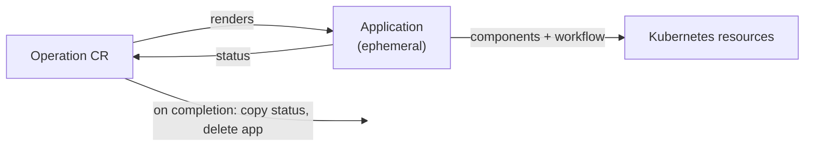

# Design 01: Operation as a Temporary Application

**Status:** Under evaluation (not accepted). Deferred behind the direct-workflow model in [KEP-2.15](../README.md).

This document is a companion design note. It describes an alternative execution model for `Operation` in which the controller renders a temporary `Application`, lets the Application controller run the workflow, and deletes it on completion — obtaining OAM composition, policy-driven placement, and tracked resource lifecycle instead of implementing them. It is not a proposal for immediate work; the syntax below is illustrative.

**Companion to:** [KEP-2.15](../README.md), [KEP-2.9](../../2.9-app-templates/README.md), [KEP-2.13 Design 02](../../2.13-addons/design/02-application-managed-resources.md)

> **TL;DR**
> - KEP-2.15 executes an `OperationTemplate`'s workflow directly against the embedded workflow engine. This note asks whether it should instead render a temporary `Application` and delete it when the workflow finishes.
> - Doing so obtains `components`, `traits`, cluster placement, resource tracking, drift suppression, and the existing `vela` tooling **for free**, and continues the "everything is an Application" line of [KEP-2.13 Design 02](../../2.13-addons/design/02-application-managed-resources.md).
> - Policies are never exposed. The `Operation` API stays a vocabulary of intent (`attach`, `retention`, `clusters`) that **compiles** to policies, so the abstraction is enforced by the CRD schema rather than by documentation.
> - The blocking risk is that deletion triggers garbage collection: an operation whose purpose is to leave something behind can silently revert itself on success. This note proposes a required per-component `retention` field to close it.
> - It is a **strict superset** of KEP-2.15's model — same `attach`, `parameters`, and `sources` — so it can be adopted additively later. That is why KEP-2.15 ships first.

## Overview

An `Application` is *convergent*: declare desired state, hold it, correct drift indefinitely. An `Operation` is *transactional*: perform a transition, then stop. They share rendering, composition, placement, and lifecycle machinery and differ only in reconciliation semantics.

That observation suggests the implementation: an `Operation` is an `Application` with a terminal lifecycle. The operation-controller renders one, the Application controller runs it, and on workflow completion the Application is torn down while the `Operation` CR retains the record.



## What it obtains without implementing

| KEP-2.15 implements | The Application already has |
|---|---|
| `spec.clusters` + per-step `cluster:` targeting | `topology` policy — clusterSelector, labelSelector, `override` per cluster |
| `execution: hub \| spoke` | topology placement; dispatch is what the Application controller does |
| Manual cleanup via `if: always` steps | ResourceTracker + `garbage-collect` policy |
| Nothing — resources are untracked | `apply-once`, `shared-resource`, `read-only`, drift suppression |
| A dedicated `dispatch-operations` step | `apply-component` health gating (see [Composition](#composition)) |
| Nothing — steps use `apply-object` with raw YAML | `components` and `traits`: the platform's whole definition library |

The last row is the substantive one. Under KEP-2.15 an operation that runs a Job writes raw `batch/v1` YAML into an `apply-object` step. Under this model it writes `type: task` and gets a parameter schema, a health policy, and a status reader that the platform already maintains.

## Policies are compiled, never exposed

The `Operation` API must not surface `policies:`. If it did, `Operation` would be `Application` with extra steps and the abstraction would earn nothing. Instead the API is a vocabulary of intent, and policies are its compilation target.

| Policy | Operation surface | Set by |
|---|---|---|
| `topology` | `Operation.spec.clusters` / `clusterSelector` | Operator |
| `garbage-collect` | `components[].retention` | Template author |
| `apply-once` | *none* — always injected | Controller |
| `read-only` | *none* — injected for attached target resources | Controller |
| `shared-resource` | implied by declaring a target resource mutable | Template author |
| `resource-update` | per-component escape hatch, if needed | Template author |
| `override`, `replication`, `take-over` | not exposed | — |

Two of these are load-bearing rather than cosmetic.

**`apply-once`, injected unconditionally, is the convergent → transactional switch.** It carries `enable: bool` plus rules with `affect: onUpdate | onStateKeep | always` (`apis/core.oam.dev/v1alpha1/applyonce_policy_types.go`). Without it the Application controller keeps state-keeping after the workflow succeeds, re-applying a one-shot transition indefinitely. It is not a field anyone sets; it is what `Operation` means.

**`read-only` is how attachment stays safe.** Its definition is "no update / state-keep" (`vela-templates/definitions/internal/policy/read-only.cue`). An operation attaches by pulling the target's live resources into the rendered app as a `ref-objects` component and marking that component read-only — so the operation can read and template against them without taking ownership, and without garbage collection touching them at teardown. Mutation becomes an explicit opt-in that compiles to `shared-resource` (co-ownership with the parent Application), which is a far better place to put that hazard than a bare policy list.

`take-over` is deliberately unlisted: it adopts resources that "belong to no application", so it addresses orphans, not reaching into a live app. It does not do what an author would assume from the name.

## Retention

The blocking risk in this model is that deletion means collection. The ResourceTracker finalizer (`pkg/resourcetracker/app.go`) recycles everything an Application owns when the Application is deleted — and here, deletion is the *normal* terminal event, not an exceptional one. An operation that restores a PVC, rotates a Secret, or promotes a replica would undo itself on success.

Every component therefore declares whether it outlives the operation:

```yaml
components:
  - name: backup-job
    type: task
    retention: Discard          # → garbage-collect strategy: onAppDelete
  - name: restored-volume
    type: k8s-objects
    retention: Retain           # → garbage-collect strategy: never
```

**The field is required, with no default.** Both candidate defaults have a bad failure mode, and they are bad in different ways:

| Default | Failure when the author does not think about it |
|---|---|
| `Discard` | A restore silently reverts on success. Invisible, destructive, found when the data is needed. |
| `Retain` | Every backup Job leaks. Visible in `kubectl get jobs`, cleanable. |

`Discard` is the dangerous one, which argues for `Retain` — but most components in an operation genuinely are scaffolding, so `Retain` makes the common case both verbose and leaky. When neither default is safe, requiring the field is the honest answer: admission rejects a component that does not state its intent, and no silent wrong outcome exists. The cost is paid once, at authoring time, by a platform engineer.

`Operation.spec.retention` uses the same vocabulary one level up — `Retain` / `Discard` for the operation's own record. One word to learn, two scopes.

## What the author writes, and what the controller derives

The word "Application" appears nowhere in the authoring model. `attach`, `parameters`, and `sources` are identical to KEP-2.15; `components` and `retention` are the additions.

```yaml
apiVersion: core.oam.dev/v2alpha1
kind: OperationTemplate
metadata: {name: s3-backup}
spec:
  attach:
    scope: Component
    allowedComponentTypes: [aws-s3-bucket]

  parameters:
    type: object
    properties:
      retentionDays: {type: integer, default: 30}

  sources:
    - name: backup-vault
      type: backup-vault-reader
      properties: {scope: platform}

  components:
    - name: backup-job
      type: task
      retention: Discard
      properties:
        image: amazon/aws-cli:2.15.0
        restart: Never
        # the source bucket is the target's own, read from its live workload
        cmd: ["s3", "sync",
              's3://$(context.output.status.atProvider.bucketName)',
              's3://$(source["backup-vault"].bucket)/$(context.name)']

  workflow:
    steps:
      - name: notify-start
        type: notification
        properties:
          slack:
            url: '$(source["backup-vault"].slackWebhook)'
            message: {text: 'Backing up $(context.name)'}
      - name: backup
        type: apply-component
        properties: {component: backup-job}
```

There is deliberately **no `application:` wrapper block**. Nesting an ApplicationSpec would leak the mechanism into the API and, worse, invite the question "why can't I add `policies:` here?". Flattened, the CRD schema simply has no `policies:` field, the abstraction is enforced by the type, and `kubectl explain operationtemplate.spec.components` works against a real schema rather than a preserve-unknown-fields blob.

Note also that `components[]` here is **not** `ApplicationComponent` — it carries `retention`, which no Application component has. It was never literally an ApplicationSpec, so presenting it as one would claim a compatibility that does not exist.

What the controller produces:

```yaml
apiVersion: core.oam.dev/v1beta1
kind: Application
metadata:
  name: op-backup-payments-db-20260804-a3f9
  labels:
    operation.oam.dev/name: backup-payments-db-20260804
  ownerReferences:
    - {apiVersion: core.oam.dev/v2alpha1, kind: Operation,
       name: backup-payments-db-20260804, controller: true, blockOwnerDeletion: true}
spec:
  components:
    - name: backup-job                     # from the template, parameters substituted
      type: task
      properties:
        image: amazon/aws-cli:2.15.0
        cmd: ["s3", "sync", "/data", "s3://acme-backups-prod/payments/payments-db"]
    - name: attach-payments-db             # injected by attach:
      type: ref-objects
      properties:
        objects:
          - {apiVersion: v1, kind: Secret, name: payments-db-creds}
  policies:
    - {name: op-topology,      type: topology,        properties: {clusters: [eu-west-1]}}
    - {name: op-transactional, type: apply-once,      properties: {enable: true}}
    - {name: op-attach,        type: read-only,       properties: {rules: [{selector: {componentNames: [attach-payments-db]}}]}}
    - {name: op-retention,     type: garbage-collect, properties: {rules: [{selector: {componentNames: [backup-job]}, strategy: onAppDelete}]}}
  workflow: {...}
```

The rendered Application carries no `spec.sources[]`. As in KEP-2.15, the operation-controller resolves all sources before rendering and freezes them, so the produced Application is fully concrete. This keeps one interpolation mechanism per artefact — `$( )` in the template, nothing left to resolve in the output — and avoids two syntaxes resolving minutes apart in the same string.

## Composition

Child operations need no dedicated step type under this model. An `operation` `ComponentDefinition` renders an `Operation` CR, and its `healthPolicy` gates on the child's phase:

```cue
healthPolicy: #"""
  isHealth: context.output.status.phase == "Succeeded"
  """#
```

`apply-component` waits for component health by default — `waitHealthy` defaults true and the step parks on `Action.Wait` until the component reports healthy (`pkg/workflow/providers/oam/apply.go`). So sequencing child operations falls out of machinery that already ships, with no polling logic and no `dispatch-operations` provider to maintain.

**Retention composes in a way that must be stated explicitly, because getting it wrong destroys data.** The chain: parent finishes → parent's Application deleted → child `Operation` CR collected (`Discard` → gc `onAppDelete`) → the child's own Application cascade-deleted via ownerRef → the child's gc policy runs → the child's `Retain` components survive, its `Discard` ones do not. Discarding a child operation discards its *record*, not its *effects* — but only because retention is per-component in the child. Nothing about `retention: Discard` on the parent's component says so.

Fan-out by selector still needs a step (or a component type that expands), so [KEP-2.15's `dispatch-operations`](../README.md#composition-and-fan-out) does not disappear entirely; it gains the option of being expressed as components instead.

## Costs

**Status must outlive the object.** The Application is deleted, so the full workflow status — per-step results, timings, failure messages — has to be copied into `Operation.status` first, crash-safely: copy → mark → delete. A controller restart between copy and delete must not lose the record.

**Failure must not delete.** If success tears down, failure has to retain, or a failed operation cannot be diagnosed. `Operation.spec.retention.onFailure: Retain` covers it, but it makes retention semantics a correctness requirement rather than a convenience.

**The rendered Application must be inspectable.** It is ephemeral and policy-generated, so when an operation misbehaves the operator has nothing to look at. `vela operation render` (dry-run) and the generated spec on `Operation.status` are prerequisites, not niceties. An abstraction that cannot be unfolded for debugging is a black box.

**Injected policies can collide with author intent.** A template marking a component `Retain` while the controller injects `read-only` over the same selector needs a stated precedence rule. Controller-injected safety policies should win, and the conflict should be rejected loudly at admission rather than silently merged.

**Object count.** One operation is not one object: a three-child operation is 4 `Operation`s + 4 `Application`s + the resources. Each is cheap and the pattern is uniform, but operators will see it in `kubectl get`.

**`Application.spec.components` is required** (`apis/core.oam.dev/v1beta1/application_types.go` — no `omitempty`), so a workflow-only operation still renders at least an empty list. Whether the CRD accepts `components: []` needs confirming.

## Why KEP-2.15 ships first

This model is a **strict superset**. `attach`, `parameters`, `sources`, and `$( )` are identical in both; adding `components` and `retention` later is additive — a new field plus an `apply-component` step. Removing them after they have shipped is not.

So nothing in KEP-2.15's API forecloses this design, and the upgrade path is real rather than aspirational. The evidence that would justify adopting it is concrete: if operation authors are repeatedly hand-rolling `apply-object` blocks that an existing `ComponentDefinition` already expresses, the composition model has earned its way in.

The converse also holds. KEP-2.15's untracked resources fail toward leaking; this model's tracked resources fail toward silently reverting. The first failure is visible and cheap; the second is invisible and destructive. Adopting this design means accepting that a required `retention` field is sufficient protection — a claim worth testing against real templates before committing to it.

## Open Questions Specific to This Design

1. **Is `retention: required` enough?** It removes the silent default but not author error. Whether admission can do better — e.g. inferring that a `PersistentVolumeClaim` is unlikely to be scaffolding — is worth exploring.
2. **Precedence between injected and authored policies**, and whether conflicts are rejected or merged.
3. **Should `OperationTemplate` be an `ApplicationDefinition`** with operation attributes rather than a distinct kind? Both produce an Application spec from parameters. Kept separate here on the grounds of different admission rules and reconciliation semantics, but the unification deserves an explicit argument rather than an assumption.
4. **Interaction with [KEP-2.13 Design 02/03](../../2.13-addons/design/)** — the nested-Application ownership chain explored for addons and modules raises the same ownership and GC questions. If those land first, this design should reuse their answers rather than invent parallel ones.
