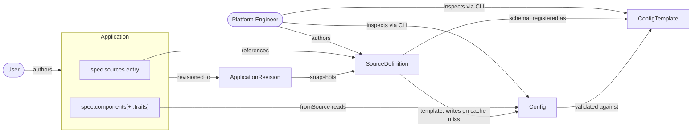
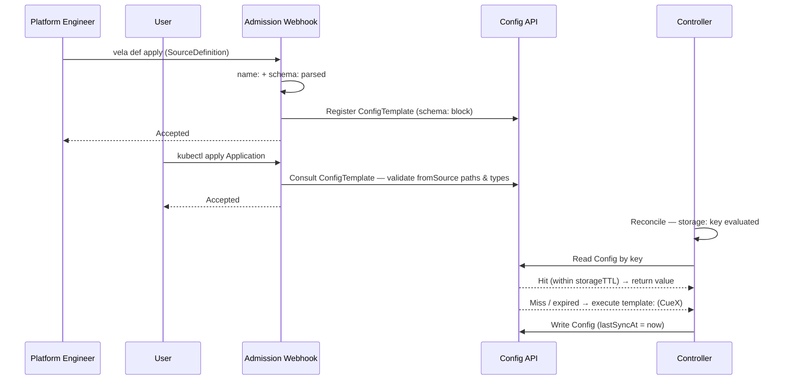
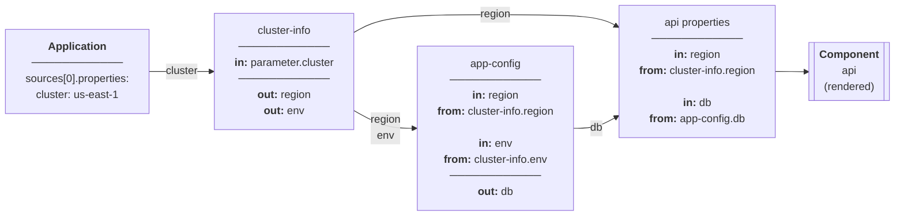
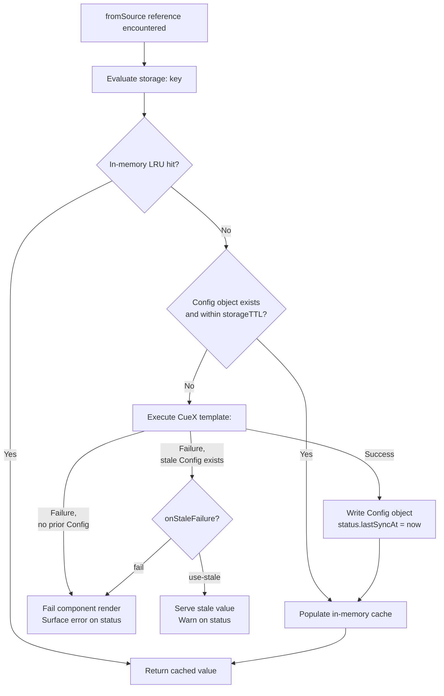

# KEP-2.16: SourceDefinition & fromSource

**Status:** Ready for Review
**Parent:** [vNext Roadmap](../README.md)

External and contextual data resolution is a first-class primitive in the vNext Roadmap. Today, retrieving external data (from APIs, ConfigMaps, Secrets, cluster metadata) requires components, workflow steps, and manual data passing — exposing too much of the workflow engine to users for what should be a common declarative operation.

`SourceDefinition` and `fromSource` introduce a clean abstraction: platform engineers define reusable data sources as Definitions, and application authors reference them inline within properties without writing any workflow logic.



## SourceDefinition Authoring Model

A `SourceDefinition` is a single `.cue` file following the standard KubeVela Definition format — a named root block followed by top-level blocks:

```
cluster-config-reader.cue
```

The file has four distinct top-level blocks evaluated at different times:

| Block | Context needed | Cost | When evaluated |
|---|---|---|---|
| `<name>:` | None | Parse only | Install / admission |
| `schema:` | None | Parse only | Admission |
| `storage:` | `context.cluster`, `parameter.*` | String interpolation | Pre-cache lookup |
| `template:` | Full context + parameters | CueX execution (I/O) | Cache miss only |



The controller always does the cheapest thing first — `storage:` is evaluated to get the cache key, the backing `Config` is checked, and `template:` is only executed if the Config is missing or expired. `schema:` is never evaluated at runtime — it is static and used only at admission time.

### Custom Error Messages (`errs:`)

The `template:` block supports the `errs:` field — a `[]string` — consistent with components (since v1.11) and traits. This allows definition authors to surface human-readable failure messages when resolution fails a logic check rather than a CUE evaluation error:

```cue
template: {
  parameter: {
    entityRef: string
  }

  _catalog: http.#Do & { ... }

  errs: [
    if _catalog.$returns.status != 200 { "catalog lookup failed: HTTP \(_catalog.$returns.status)" },
    if _catalog.$returns.metadata.name == _|_ { "catalog entity \(parameter.entityRef) has no name field" },
  ]

  output: { ... }
}
```

If any entry in `errs` is non-empty, the `template:` execution is treated as failed and the messages are surfaced on the Application status. Definition authors should prefer `errs:` over relying on raw CUE evaluation errors, which are harder for application teams to interpret.

### Concreteness Enforcement

As a new Definition type, `SourceDefinition` takes the opportunity to enforce that the entire `template:` block is fully concrete after evaluation — not just `output:`. Unlike older Definition types where incomplete renders could pass silently, the controller rejects any `template:` evaluation that leaves abstract or unresolved CUE values anywhere in the block.

Definition authors must use CUE's optionality markers correctly:

- **`field?: type`** — the field is optional; if absent from the resolved data it is omitted. Valid for fields that may not always be present.
- **`field!: type`** — the field is required and must be concrete after evaluation. If the resolved value is `_|_` or absent, the controller surfaces a concreteness error.
- **`field: type`** without a default — treated as required; fails the concreteness check if not resolved to a concrete value.

```cue
schema: {
  region:       string          // required — must be concrete
  environment:  string          // required — must be concrete
  vpcId?:       string          // optional — may be absent
  accountId!:   string          // explicitly required and concrete
}
```

Concreteness is checked after CueX execution (cache miss path), not at admission. The admission webhook validates structural correctness of the `schema:` block; concreteness of the full `template:` can only be verified once CueX has executed with real data.

**Fail-fast parameter validation:** The `parameter:` block within `template:` is an exception — its values come entirely from `spec.sources[].properties`, which are concrete before CueX execution begins. The controller validates that all required (non-optional) `parameter` fields are concrete *before* invoking the `template:` render. This avoids expensive CueX I/O (HTTP calls, Kubernetes API reads) for a render that would fail due to a missing parameter value. Definitions should declare optional parameters with `field?:` and required ones without, so the pre-render check can distinguish them.

`spec.sources` entries are resolved **sequentially in declaration order**. Before evaluating source N's `storage:` or `template:`, the controller resolves any `fromSource` references in `spec.sources[N].properties` using the already-resolved outputs of sources 1…N-1. This means all `parameter.*` values are concrete by the time `storage:` runs — the source chaining model mostly eliminates the unresolved-property hazard.

| Field | Stable in `storage:`? | Notes |
|---|---|---|
| `context.appName` | ✅ | Always stable |
| `context.componentName` | ✅ | Always stable |
| `context.componentType` | ✅ | Always stable |
| `context.namespace` | ✅ | Always stable |
| `context.cluster` | ✅ | Always stable |
| `parameter.*` (source-level, from `spec.sources[].properties`) | ✅ | Fully resolved before `storage:` runs — includes values piped from earlier sources |

`context.appName`, `context.componentName`, and `context.cluster` together produce a globally unique, stable key covering the vast majority of real use cases.

## Source Chaining

Because sources are resolved in declaration order, a later source can reference the resolved output of an earlier one by using `fromSource` in its `spec.sources[].properties`:



```yaml
spec:
  sources:
    # Resolved first — fetches cluster metadata
    - name: cluster-info
      type: cluster-config-reader

    # Resolved second — uses cluster-info output as input
    - name: app-config
      definition: app-config-reader
      properties:
        region:
          fromSource: cluster-info.region      # resolved before app-config's storage:/template: run
        environment:
          fromSource: cluster-info.environment

  components:
    - name: api
      type: webservice
      properties:
        dbEndpoint:
          fromSource: app-config.dbEndpoint
```

By the time `app-config-reader`'s `storage:` block is evaluated, `parameter.region` and `parameter.environment` already hold concrete values from the `cluster-info` resolution. The `storage.key` for `app-config` can safely interpolate them:

```cue
storage: {
  key: "app-config-\(parameter.region)-\(parameter.environment)"
}
```

**Cycle detection:** The admission webhook rejects `spec.sources` lists where a source's `properties` reference a source declared later in the list, or where a cycle exists. Resolution is strictly forward — source N may only reference sources 0…N-1.

## Caching Model

Resolution results are stored in two layers:

**In-memory cache** — per controller-process LRU cache. Prevents redundant API server reads within a busy reconcile window. Lost on controller restart. The reusable LRU caching mechanism being developed as part of the Helm renderer feature should be used here — `fromSource` resolution is a natural consumer of the same abstraction.

**Backing Config object** — a `Config` CRD instance (KEP-2.18) named by the resolved `key`. This is the persistent source of truth. The controller reads it first; if it exists and `now - status.lastSyncAt < storageTTL`, the cached value is used directly. If missing or expired, the CueX `template:` block executes, and the result is written back to the `Config` object.

**Resolution flow:**



1. Check in-memory cache for `key` → hit: return immediately (in-memory TTL is a fixed implementation detail, not configurable)
2. Miss → read `Config` object named by `key`
3. Config exists and `now - status.lastSyncAt < storageTTL` → populate in-memory cache, return
4. Config missing or expired → execute CueX `template:`, write updated `Config` with `status.lastSyncAt = now`, populate in-memory cache, return

`storageTTL` defaults to `"15m"` when not specified — the `storage:` block schema enforces this default so the field is always concrete by the time the controller evaluates it.

The `key` field in `storage:` is a CUE expression that resolves to the `Config` object name. It interpolates `context` values and `parameter` values to produce a unique, deterministic name per source instance. The key serves double duty — it is both the Config object name and the in-memory cache lookup key.

**Key validity** — the resolved key is validated against `[a-z0-9-]` (lowercase alphanumeric and hyphens only; max 253 characters). Any character outside this set — including dots, colons, slashes, and uppercase letters — causes a fail-fast error surfaced on the Application status at resolution time. The controller does not sanitize automatically. Definition authors must ensure that all interpolated `parameter` and `context` values produce valid keys — if an input value may contain invalid characters (e.g. a Backstage entity reference like `component:default/api`), the `parameter` schema in `template:` should constrain the input format, or the `SourceDefinition` should validate via `errs:` before the key is formed.

**Cache key cardinality** — the key discriminator determines sharing behaviour. A key scoped only to `context.cluster` produces one `Config` per cluster, shared across all Applications on that cluster. Including `context.appName` and `context.namespace` produces one `Config` per Application instance. Definition authors should choose the narrowest discriminator that correctly models the data's scope.

Cross-application sharing of `Config` cache objects is a natural consequence of key-based caching and is intentional. When two Applications on the same cluster use the same `SourceDefinition` with the same key, they share the backing `Config` object — the second resolution is a cache hit. The key design determines the sharing boundary: a `context.cluster`-scoped key models a cluster-level fact shared by all consumers; a `context.appName`-scoped key models a per-Application fact private to one.

## Resolution Failure

**No prior data (first load):** If `template:` execution fails and no backing `Config` object exists, the component render fails with a clear error surfaced on the Application status. There is no prior value to fall back to.

**Prior data available (subsequent loads):** If `template:` execution fails but a stale `Config` object exists (TTL has expired but data is present), the controller can optionally serve the stale value rather than failing the render. This behaviour is controlled by `storage.onStaleFailure`:

```cue
storage: {
  key:            "cluster-config-reader-\(context.cluster)"
  storageTTL:     "15m"
  onStaleFailure: *"use-stale" | "fail"   // default: use-stale
}
```

`use-stale` (default) — serve the last known good value and surface a warning condition on the Application. The component renders with potentially outdated data rather than blocking the reconcile loop.

`fail` — treat a failed refresh the same as a first-load failure: block the render and surface an error. Use this for sources where stale data is worse than no render (e.g. security-sensitive lookups).

## ConfigTemplate Versioning

The `schema:` block is registered as a `ConfigTemplate` named `{source-definition-name}-v{N}` where `N` is a monotonically incrementing integer — for example `cluster-config-reader-v1`, `cluster-config-reader-v2`. A hash of the `schema:` block is computed and stored as an annotation on the ConfigTemplate (`definition.oam.dev/schema-hash`). This hash drives the install/upgrade decision:

1. Compute the hash of the new `schema:` block
2. Check whether any existing ConfigTemplate for this SourceDefinition carries a matching `definition.oam.dev/schema-hash` annotation
3. **Match found:** attach the new SourceDefinition revision to the existing ConfigTemplate — `N` is not incremented, no new object is created
4. **No match:** create `{name}-v{N+1}` with the hash annotation

This means `N` only increments on genuine schema changes, and if a SourceDefinition revision reverts to a previously-used schema it will re-attach to the corresponding existing ConfigTemplate rather than creating a duplicate. The controller always reads and writes `Config` objects against the `ConfigTemplate` version that matches the `SourceDefinition` revision in the `ApplicationRevision` snapshot — preventing type mismatches between stored data and the schema the controller expects. Garbage collection of old versioned `ConfigTemplate` entries is left to a future enhancement.

Resolution is lazy and per-component: `fromSource` references are resolved in the `Complete()` phase of each component or trait, after the component context has been built but before the CUE template is rendered. If multiple components in the same Application reference the same `SourceDefinition`, the cached `Config` entry from the first resolution is reused for subsequent ones. Each `DefinitionRevision` for a `SourceDefinition` should record the name of its attached versioned `ConfigTemplate`, providing the authoritative link between a pinned Definition revision and the cache schema it expects.

## Full Example: cluster-config-reader

```cue
// cluster-config-reader.cue

"cluster-config-reader": {
  type:        "source"
  description: "Reads platform metadata from the cluster-config ConfigMap in platform-data namespace"
  attributes: {
    scope: "spoke"   // explicitly spoke — controller uses cluster gateway to read per-cluster ConfigMap
  }
}

// schema declares the public output contract.
// Registered as ConfigTemplate "cluster-config-reader-v<schema-hash>" on install.
// Admission webhook validates fromSource path references against this schema.
// No context injection required — evaluated at parse time only.
schema: {
  region:      string
  environment: string
  // +sensitive
  vpcId:       string
  // +sensitive
  accountId:   string
}

// storage declares cache key and TTL.
// Evaluated with context.cluster and parameter.* only — cheap string interpolation.
// May not reference context.output, context.status, or CueX providers.
storage: {
  key:        "cluster-config-reader-\(context.cluster)"
  storageTTL: parameter.cacheDuration | *"15m"
}

// template contains the CueX resolution logic.
// Only executed on cache miss or storageTTL expiry.
template: {
  parameter: {
    // +usage=How long to cache the resolved cluster config before re-fetching
    cacheDuration?: *"15m" | string
  }

  _clusterConfig: ex.#Read & {
    $params: {
      apiVersion: "v1"
      kind:       "ConfigMap"
      metadata: {
        name:      "cluster-config"
        namespace: "platform-data"
      }
    }
  }

  output: {
    region:      _clusterConfig.$returns.data.region
    environment: _clusterConfig.$returns.data.environment
    vpcId:       _clusterConfig.$returns.data.vpcId
    accountId:   _clusterConfig.$returns.data.accountId
  }
}
```

## Application Usage

Application authors declare source instances in `spec.sources` and reference them via `fromSource`. The shorthand string form is preferred for simple references:

```yaml
apiVersion: core.oam.dev/v1beta1
kind: Application
spec:
  sources:
    - name: cluster-info
      definition: cluster-config-reader
      properties:
        cacheDuration: "1h"

  components:
    - name: api
      type: webservice
      properties:
        region:
          fromSource: cluster-info.region       # shorthand: <source>.<path>
        accountId:
          fromSource: cluster-info.accountId
        image: myapp:v1
```

Use the map form when a `default` is needed:

```yaml
        region:
          fromSource:
            name: cluster-info
            path: region
            default: "us-east-1"
```

The generated `Config` object on the spoke (keyed by `cluster-config-reader-us-east-1`):

```yaml
apiVersion: config.oam.dev/v1beta1
kind: Config
metadata:
  name: cluster-config-reader-us-east-1
  namespace: vela-system   # or configured System Namespace
spec:
  template: cluster-config-reader-v1   # {name}-v{N}; N advances only on schema change
  properties:
    region:      us-east-1
    environment: production
    vpcId:       vpc-0abc123def456
    accountId:   "123456789012"
status:
  phase:      Valid
  lastSyncAt: "2026-03-30T10:00:00Z"
```

## Parameterised Example: backstage-component

For comparison, a SourceDefinition with parameters — the `key` includes `parameter.*` values to namespace cache entries per-instance:

```cue
// backstage-component.cue

"backstage-component": {
  type:        "source"
  description: "Reads component metadata from Backstage software catalog"
  attributes: {
    scope: "hub"
  }
}

schema: {
  name:        string
  description: string
  team:        string
  tier:        string
}

storage: {
  key:        "backstage-component-\(parameter.entityRef)"
  storageTTL: "10m"
}

template: {
  parameter: {
    entityRef: string
  }

  _catalog: http.#Do & {
    method: "GET"
    url:    "https://backstage.internal/api/catalog/entities/by-ref/\(parameter.entityRef)"
  }

  output: {
    name:        _catalog.$returns.metadata.name
    description: _catalog.$returns.metadata.description
    team:        _catalog.$returns.spec.owner
    tier:        _catalog.$returns.metadata.annotations["backstage.io/techdocs-ref"]
  }
}
```

## Platform Pattern: Governance Metadata

The previous examples use `parameter.*` (source properties set by the application author) to drive resolution. But `context.appLabels` — the labels on the Application CR — opens a complementary pattern: sources whose resolution is supported by platform labelling conventions, reducing or eliminating the need for author-supplied properties.

Platform teams can standardise a set of governance labels on every Application. Configurable Application Policies (introduced in v1.11) are the natural mechanism for enforcing this — a platform-level policy can validate or inject standard labels, ensuring every Application carries the expected metadata before sources are resolved.

A `SourceDefinition` can then read those labels to look up extended metadata from a service catalog. Because the source key is derived from `context.appLabels` and `context.cluster`, the source needs no `parameter:` block — the application author never needs to supply resolution inputs beyond following the labelling convention.

```cue
// governance-metadata.cue

"governance-metadata": {
  type:        "source"
  description: "Fetches governance metadata from the service catalog using Application labels"
  attributes: {
    scope: "hub"
  }
}

schema: {
  serviceName: string
  owner:       string
  department:  string
  tier:        string
  costCentre:  string
}

storage: {
  // Key derived from Application labels and cluster — no author properties needed.
  // If example.org/service-name is absent, key computation fails with a fail-fast error,
  // enforcing the labelling convention at resolution time.
  key:        "governance-\(context.appLabels["example.org/service-name"])-\(context.cluster)"
  storageTTL: "1h"
}

template: {
  parameter: {}   // no source properties — all inputs come from context.appLabels

  _serviceName: context.appLabels["example.org/service-name"]

  _catalog: http.#Do & {
    method: "GET"
    url:    "https://service-catalog.internal/api/services/\(_serviceName)"
  }

  errs: [
    if _catalog.$returns.status != 200 { "service catalog lookup failed for \(_serviceName): HTTP \(_catalog.$returns.status)" },
  ]

  output: {
    serviceName: _serviceName
    owner:       _catalog.$returns.owner
    department:  _catalog.$returns.department
    tier:        _catalog.$returns.tier
    costCentre:  _catalog.$returns.costCentre
  }
}
```

The Application is minimal — just labels and a source reference with no properties:

```yaml
apiVersion: core.oam.dev/v1beta1
kind: Application
metadata:
  name: checkout
  labels:
    example.org/service-name: checkout
    example.org/owner:        platform-team
    example.org/department:   engineering
spec:
  sources:
    - name: governance
      definition: governance-metadata
      # no properties — resolution is driven entirely by Application labels

  components:
    - name: api
      type: webservice
      properties:
        department:
          fromSource: governance.department
        costCentre:
          fromSource: governance.costCentre
        tier:
          fromSource: governance.tier
```

Because the source has no properties, it can be injected transparently — with platform teams using policies to assure every Application has the governance source attached without requiring application authors to declare it. The only contract the author must honour is the labelling convention.

If the required label is absent, the `storage:` key interpolation produces an error at resolution time — the missing label surfaces as a fail-fast error on the Application status before any CueX I/O is attempted. This makes the labelling convention self-enforcing: an unlabelled Application cannot successfully render components that consume governance data.

## fromSource Semantics

`fromSource` supports two forms:

**Shorthand** — a dot-separated string `<source>.<path>`. The parser splits on the first dot; everything after is the path (which may itself contain dots for nested fields):

```yaml
fromSource: cluster-info.region
fromSource: cluster-info.nested.field   # path: nested.field
```

**Map form** — required when a `default` is needed:

```yaml
fromSource:
  name: cluster-info
  path: region
  default: "us-east-1"   # used when the resolved output does not include this field
```

`default` covers the case where a `schema:` field is declared optional (the `SourceDefinition` author does not always populate it) but the consuming component's `parameter` marks it as required. If the resolved `Config` does not contain the field, `default` is substituted. `default` is **not** a fallback for `template:` execution failures — those are governed by `storage.onStaleFailure`. The admission webhook enforces that `default` is supplied whenever `path` refers to an optional schema field and the target component parameter is required; otherwise rendering would fail at runtime.

`fromSource` is detected structurally during render — not by string matching. It is valid at any depth within `properties`, including nested objects and array entries. It is not valid as a map key. The admission webhook validates that `path` references a field declared in the `schema:` block — unknown paths are rejected at apply time.

## CUE Context in SourceDefinition

| Field | Value |
|---|---|
| `context.cluster` | target deployment cluster name |
| `context.hubCluster` | hub cluster name |
| `context.namespace` | Application namespace |
| `context.componentName` | name of the component referencing this source |
| `parameter.*` | source instance properties from `spec.sources[].properties` |

## Resolution Scope: hub vs spoke

The `ex.#Read` CueX provider executes against the cluster where the controller is running. For hub-side SourceDefinitions (e.g., a central service registry ConfigMap), resolution runs on the hub. For spoke-local SourceDefinitions (e.g., `cluster-config` which is per-cluster), resolution runs on the spoke component-controller.

`scope` is declared in `attributes` inside the named root block, consistent with the standard Definition authoring model:

```cue
"cluster-config-reader": {
  type: "source"
  attributes: {
    scope: *"hub" | "spoke"   // default: hub
  }
}
```

`scope: hub` — resolution executes on the hub application-controller using the hub's local client. A single `Config` object is shared across all spokes for the same key.

`scope: spoke` — the controller must obtain a spoke-scoped client via the cluster gateway before executing CueX. The implementation checks `attributes.scope` at resolution time and, when `spoke` is set, constructs a client targeting the appropriate spoke cluster (identified by `context.cluster`) through the configured cluster gateway. Each spoke gets its own `Config` object (key should include `context.cluster` to prevent cross-spoke cache collisions).

## ApplicationRevision Snapshot

`SourceDefinition` is included in the `ApplicationRevision` definition snapshot alongside `ComponentDefinition`, `TraitDefinition`, `WorkflowStepDefinition`, and `PolicyDefinition`. When an `ApplicationRevision` is created, the hub resolves the current revision of every `SourceDefinition` referenced in `spec.sources` and stores it in the revision. All subsequent renders of that revision — including re-renders and rollbacks — use the snapshotted `SourceDefinition`, not the live cluster version.

This ensures the `key` (which may include the Definition revision) remains stable across re-renders of the same `ApplicationRevision`, and that the `ConfigTemplate` version used for backing Config lookups matches what was active when the revision was originally applied.

## Application Status

Resolved source data is surfaced in `status.services[]` per component, alongside existing health and trait information. Each component entry gains a `sources:` sub-field listing the sources it consumed, the Config object backing the resolution, and the field values that were injected — top-level `// +sensitive` fields redacted, all others shown in full regardless of type.

```yaml
status:
  services:
    - name: api
      namespace: default
      cluster: us-east-prod
      healthy: true
      sources:
        - name: cluster-info              # matches spec.sources[].name
          definition: cluster-config-reader
          phase: Resolved                 # Resolved | Pending | Failed | Stale
          config: cluster-config-reader-us-east-prod   # Config object — inspect with: kubectl get config
          resolvedFields:
            region:      us-east-1
            environment: production
            vpcId:       <redacted>       # // +sensitive
            accountId:   <redacted>       # // +sensitive
        - name: backstage-info
          definition: backstage-component
          phase: Stale                    # template: refresh failed; prior data in use
          config: backstage-component-my-api
          resolvedFields:
            name:        my-service
            description: Handles inbound API traffic
            team:        platform
            tier:        tier-1
            endpoints:                    
              - us-east-1.backstage.internal
              - eu-west-1.backstage.internal
```

`phase` mirrors the resolution outcome for that source on that cluster:
- `Resolved` — Config is current within `storageTTL`
- `Stale` — TTL expired; `template:` refresh failed; prior value in use (`onStaleFailure: use-stale`)
- `Pending` — first resolution in progress
- `Failed` — first-load failure; no prior value available; component render blocked

`config` is the name of the backing Config object. Operators can inspect the full resolved output directly: `kubectl get config <config> -n vela-system`.

## Security

- `SourceDefinition` resolution runs under the controller's service account. Platform engineers control which external endpoints and cluster resources are accessible by controlling which `SourceDefinition` definitions are published.
- `fromSource` cannot reference fields not declared in the `schema:` block — consumers cannot access internal resolution state or raw HTTP response bodies.
- Individual top-level `schema:` fields can be marked `// +sensitive`. The controller redacts those fields (replacing the entire value with `<redacted>`, regardless of type) from `status.services[].sources[].resolvedFields` and from logs. Non-sensitive fields are shown in full, including nested objects and arrays. This marker is introduced as part of this KEP, implemented in `pkg/schema/` following the same pattern as `// +immutable`.
- Controller-managed `Config` objects (backing source cache entries) carry `config.oam.dev/managed-by: source-controller` label and are protected by RBAC — application authors cannot overwrite cached values.

### Guidance: Credentials and Highly Sensitive Values

`SourceDefinition` is not the recommended mechanism for distributing raw credentials or secrets to components. While `// +sensitive` prevents exposure in status output, the resolved value still flows through the controller, is written to a Config object, and may end up in rendered resource manifests.

For credentials, the recommended pattern is to return a **reference** from the `SourceDefinition` rather than the value itself — for example, the name of a Kubernetes Secret that already exists on the spoke, or an external secret store path. The component then consumes the reference and the underlying platform (Kubernetes, ESO, Vault agent) handles the actual secret injection at the resource level.

This cannot be enforced by the controller — it is a design guideline for `SourceDefinition` authors. Platform teams should document and review `SourceDefinition` implementations that handle credentials to ensure they follow this pattern.

### Threat Model

| Threat | Mitigation |
|---|---|
| **Malicious/compromised SourceDefinition exfiltrates cluster data via HTTP** | `http.#Do` and other outbound CueX providers execute under the controller service account. Network policy and CueX provider allowlists are the mitigation. Publishing a `SourceDefinition` is a high-trust operation — RBAC on `SourceDefinition` creation should be restricted to platform engineers. |
| **Application author accesses data beyond their permitted scope** | `SubjectAccessReview` at admission ensures the submitting user has `get` permission on each referenced `SourceDefinition`. The schema contract limits what fields are accessible — raw resolution state and HTTP responses are never reachable via `fromSource`. |
| **Sensitive values exposed via Application status** | `// +sensitive` top-level schema markers cause the controller to replace the entire field value with `<redacted>` in `status.services[].sources[].resolvedFields` and in logs. Privileged operators can inspect the raw values directly via the backing Config/Secret in `vela-system`. |
| **Sensitive values exposed in hub API server** | Sensitive data never appears in Application or Component specs — values are substituted at render time on the controller, not stored in the Application CR. The only copies are the Config object in `vela-system` and the rendered resource on the spoke. |
| **Spoke vela-system namespace holds plaintext sensitive data** | For `scope: spoke`, the Config object containing resolved values is written to the spoke's `vela-system`. Spoke `vela-system` RBAC is a load-bearing security boundary — access to this namespace should be restricted to platform operators. |
| **Sensitive values leak into spoke resource manifests** | After substitution, sensitive values flow through the CUE renderer and may end up in spoke resources. The platform engineer authoring the `SourceDefinition` and `ComponentDefinition` is responsible for handling sensitive values correctly at the resource level. Where possible, return references rather than raw values — see guidance above. |

### Application Admission RBAC

The existing Application admission webhook (`pkg/webhook/core.oam.dev/v1beta1/application/validation.go`) performs `SubjectAccessReview` checks for every definition type referenced in an Application — `ComponentDefinition`, `TraitDefinition`, `PolicyDefinition`, and `WorkflowStepDefinition`. These checks verify that the user submitting the Application has `get` permission on the referenced definition in either `vela-system` or the Application's own namespace.

`SourceDefinition` must be added to these checks. The `definitionUsage` struct and `collectDefinitionUsage` function must be extended:

```go
// Add to definitionUsage struct:
sourceTypes map[string][]int   // spec.sources[i].definition → indices

// Add to collectDefinitionUsage:
for i, source := range app.Spec.Sources {
    usage.sourceTypes[source.Definition] = append(usage.sourceTypes[source.Definition], i)
}
```

And a corresponding `validateDefinitions` call added to `ValidateDefinitionPermissions` for `SourceDefinition`. Without this, a user could reference a `SourceDefinition` they do not have access to and the Application would be accepted at admission — the permission gap would only surface at reconcile time rather than at apply time.

## Implementation Location

`fromSource` resolution is implemented inside `pkg/cue/definition/template.go`, in the `workloadDef.Complete()` method. Traits support `fromSource` identically — trait context (`context.cluster`, `context.namespace`, `context.componentName`, `parameter.*`) is structurally the same as component context, so the same resolution hook in the trait `Complete()` method applies without modification.

The hook sits **after** the process context is fully built (`ctx.BaseContextFile()` has returned — `context.cluster`, `context.namespace`, `context.componentName` and all stable context fields are available) but **before** `paramFile` is marshaled and passed to `cuex.DefaultCompiler`. This ordering is required because the `storage:` cache key is constructed from context fields.

```
ctx.BaseContextFile()           ← context fully built
  ↓
Walk params for fromSource nodes
  → for each fromSource: source.field
      1. Resolve source properties (chaining: earlier sources already resolved)
      2. Compute storage.key via string interpolation against ctx
      3. Check LRU cache (shared with Helm renderer feature)
      4. On miss: read Config object; if absent/expired → evaluate template:, write Config
      5. Extract field at path from resolved output
      6. Substitute node value
  ↓
json.Marshal(resolvedParams) → paramFile
  ↓
cuex.DefaultCompiler.CompileString(template + paramFile + contextFile)
```

Source resolution is **lazy and per-component**: only the sources actually referenced by that component's `fromSource` directives are evaluated. Because `fromSource` resolution is per-component and cached, multiple components referencing the same source incur only one `SourceDefinition` `template:` evaluation per cache TTL window.

## Observability and Compatibility via `vela config` Commands

**Implementation note:** This KEP is delivered against the existing v1 ConfigTemplate and Config backing store (ConfigMaps and Secrets in `vela-system`). The migration to first-class `ConfigTemplate` and `Config` CRDs is covered by KEP-2.18 and should be transparent to `SourceDefinition` — the Config API surface is the same; only the storage primitive changes, with automated migration handled as part of that KEP.

Because `SourceDefinition` resolution reuses the existing `ConfigTemplate` and `Config` infrastructure, all existing `vela config` commands work against source cache entries without any new CLI surface area. This also preserves full compatibility with existing Config consumers — workflow steps and other platform tooling that reads `Config` objects can observe and interact with source-resolved data through the same interfaces they already use.

**Inspect registered schema versions for a SourceDefinition:**

```bash
# List all ConfigTemplate versions for a SourceDefinition
vela config-template list | grep cluster-config-reader
# cluster-config-reader-v1   source   2026-04-01

# Render the output schema of a specific version as human-readable docs
# (shows resolved field names, types, and descriptions from the schema: block)
vela config-template show cluster-config-reader-v1
```

A registered ConfigTemplate is stored as a `ConfigMap` in `vela-system`. The ConfigMap name carries the `config-template-` prefix used by the existing factory loader — the CLI presents the name without it:

```yaml
apiVersion: v1
kind: ConfigMap
metadata:
  # ConfigMap name = "config-template-" + template name (factory convention)
  name: config-template-cluster-config-reader-v1
  namespace: vela-system
  labels:
    config.oam.dev/catalog: velacore-config
    config.oam.dev/scope:   system
  annotations:
    config.oam.dev/description: "Reads platform metadata from the cluster-config ConfigMap"
    definition.oam.dev/schema-hash: "a3f9c21b"   # hash of schema: block; drives version deduplication
data:
  template: |
    <CUE source of the template: block>
  schema: |
    <YAML-serialised JSON Schema of the schema: block>
```

**Inspect cached resolution results:**

```bash
# List all Config entries backed by a given ConfigTemplate version
vela config list -t cluster-config-reader-v1
# NAME                               TEMPLATE                    CREATED-TIME
# cluster-config-reader-us-east-1   cluster-config-reader-v1   2026-04-01 10:00:00

# List all cached entries across all versions of a SourceDefinition
vela config list | grep cluster-config-reader
```

A resolved Config cache entry is stored as a `Secret` in `vela-system`:

```yaml
apiVersion: v1
kind: Secret
metadata:
  name: cluster-config-reader-us-east-1
  namespace: vela-system
  labels:
    config.oam.dev/catalog: velacore-config
    config.oam.dev/type:    cluster-config-reader-v1   # links back to ConfigTemplate version
    config.oam.dev/scope:   system
  annotations:
    config.oam.dev/template-namespace: vela-system
data:
  input-properties: |
    <YAML-serialised resolved output properties>
```

Platform engineers can inspect what data is cached for each source, verify that cache entries are current (via `status.lastSyncAt`), and identify stale entries — all using the same tooling already familiar from managing provider credentials and other platform configs.

**Reuse in Workflow steps:**

Because resolved source outputs are stored as standard `Config` objects, any workflow step that can read a `Config` can consume them directly — no `fromSource` directive needed. A workflow step that needs the same cluster metadata a `SourceDefinition` already resolved simply reads the `Config` object by its well-known key (`cluster-config-reader-{cluster}`). The data is already there, already validated against the `ConfigTemplate` schema, and already cached. This means `SourceDefinition` resolution and workflow-driven config consumption are not parallel systems — they share the same backing store, and a value resolved by one is immediately visible to the other.

## Non-Goals

- Replacing workflow steps for runtime data passing
- Arbitrary runtime dependency orchestration
- `fromContext` — OAM context fields needed in properties should be exposed via a `SourceDefinition` authored by the platform engineer, keeping the resolution model consistent

## Future Enhancements

- **`fromSource` in workflow steps and policies** — `fromSource` in component and trait properties is the highest priority and the scope of this KEP. The same mechanism can be extended to `workflow: steps[]` and policy properties — both have access to `spec.sources[]` and the declarative type-safety model applies equally. The critical requirement for this extension is that the `fromSource` resolution logic is implemented behind a reusable internal API, callable from any rendering context without duplicating the cache lookup, key computation, or CueX execution paths.
- **Configurable Config namespace** — allow resolved Config objects that contain no `// +sensitive` fields to be written to a user-accessible namespace (e.g. the Application's namespace) so that end users can inspect resolved source data without access to `vela-system`. Requires a focused design pass on the scope/access model and enforcement that definitions with any `// +sensitive` fields cannot opt into this.
- **Garbage collection of old ConfigTemplate versions** — remove versioned `ConfigTemplate` entries once no `ApplicationRevision` references that Definition revision.

## Cross-KEP References

| KEP | Relationship |
|---|---|
| **KEP-2.18** (ConfigTemplate & Config CRDs) | This KEP is delivered against the existing v1 ConfigMap/Secret backing store. The migration to first-class `ConfigTemplate` and `Config` CRDs is covered by KEP-2.18 and transparent to `SourceDefinition`. |
| **KEP-2.21** (`from*` resolution model) | KEP-2.21 defines the unified resolution model for all `from*` directives. `SourceDefinition` implements the `fromSource` case of that model. |
