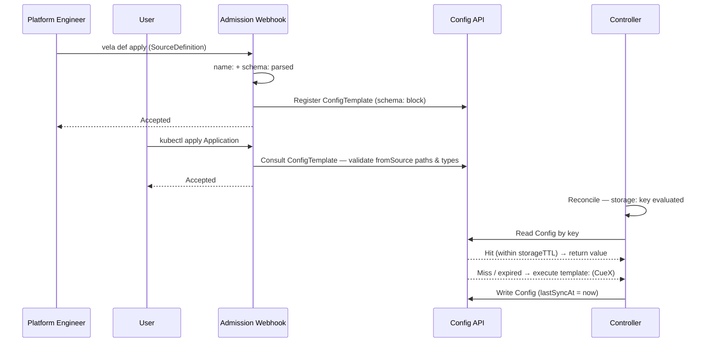
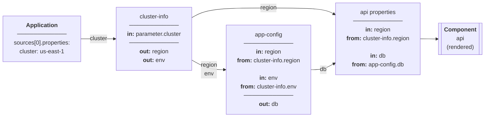
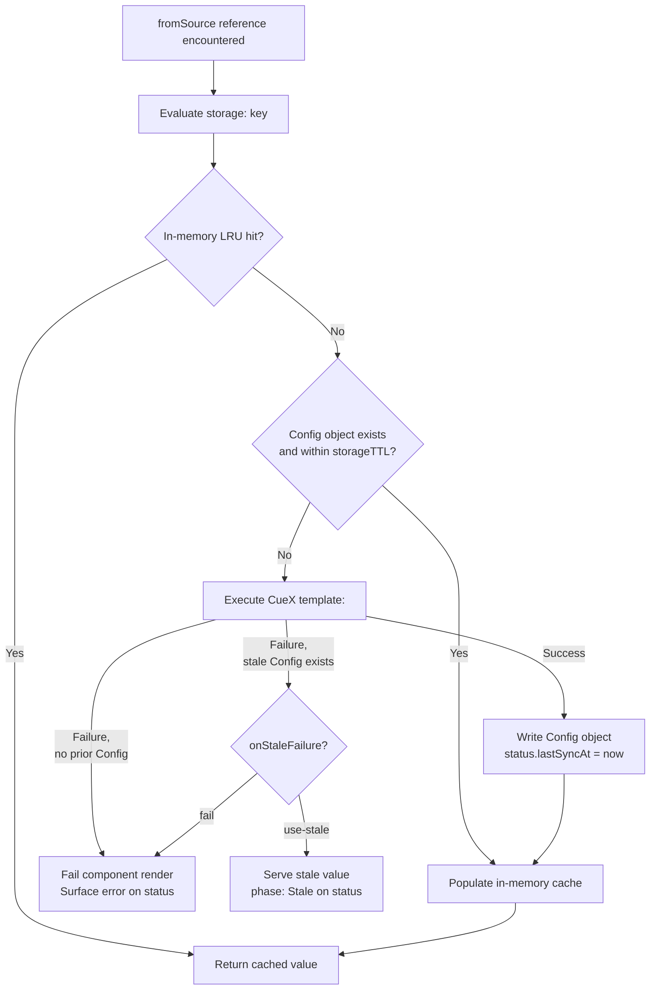

# KEP-2.16: SourceDefinition & fromSource

**Status:** Ready for Review
**Parent:** [vNext Roadmap](../README.md)

`SourceDefinition` and `fromSource` introduce a four-layer model for declarative data resolution:

| Layer | Artefact | Author | Responsibility |
|---|---|---|---|
| Definition | `SourceDefinition` | Platform engineer | Declares the output schema, cache key, and resolution logic |
| Binding | `spec.sources[]` | Application author | Names a `SourceDefinition`, scopes it to this Application, supplies instance properties |
| Resolution | `Config` object | Controller | Evaluates the cache key, serves a cached value or executes `template:`, writes result |
| Consumption | `fromSource` directive | Application author | Substitutes a resolved field value into a component or trait property at render time |

Today, retrieving external data requires workflow steps and manual data passing — exposing orchestration concerns to application authors for what should be a static, declarative lookup. `SourceDefinition` eliminates that exposure: the application author declares *what* data they need and *where* it goes; the platform controls *how* it is fetched and *when* it is cached.

**Trust boundary:** The platform engineer and the application author operate at different trust levels. A `SourceDefinition` carries arbitrary CueX logic — it can make HTTP calls, read cluster resources, and write resolved values into the controller's cache. Authoring and publishing a `SourceDefinition` is therefore a high-trust operation, equivalent in scope to writing a `ComponentDefinition`. The application author's trust is deliberately narrower: they can bind a named `SourceDefinition` and supply properties, but they cannot alter its resolution logic, access fields outside its declared `schema:`, or read raw resolution state. This separation is load-bearing — the feature's security properties depend on it.


## KubeVela Config and ConfigTemplate

`SourceDefinition` builds on two existing KubeVela platform primitives. Both are live features — managed by `pkg/config/factory.go` and surfaced through the `vela config` and `vela config-template` CLI commands.

**ConfigTemplate** — an existing schema registry entry. Each ConfigTemplate is a Kubernetes ConfigMap in `vela-system`, named `config-template-<name>`, labelled `config.oam.dev/catalog: velacore-config`. Its `data.schema` field holds an OpenAPI3 schema describing the shape of a valid Config; its `data.template` field holds the CUE rendering logic used to produce one. `SourceDefinition` registers its `schema:` block as a ConfigTemplate on install (hash-versioned to avoid duplicates on schema-identical upgrades).

**Config** — an existing resolved-value store. Each Config is a Kubernetes Secret in `vela-system`, labelled `config.oam.dev/catalog: velacore-config` and `config.oam.dev/type: <template-name>`. Its `data.input-properties` field holds the YAML-serialised resolved output, validated against the referenced ConfigTemplate's schema. `SourceDefinition` uses Config objects as its cache: one Config per unique `storage:` key, written on first resolution and refreshed on TTL expiry. This KEP introduces the annotation `config.oam.dev/last-sync-at` on these Secrets to record when the entry was last successfully written — the controller uses this to evaluate freshness against `storageTTL`.

Both are identified by the `config.oam.dev/catalog: velacore-config` label, not by Kubernetes object type. They are not arbitrary ConfigMaps or Secrets. Operators interact with them through `vela config list`, `vela config delete`, `vela config-template list`, and `vela config-template show` — the same tooling used for provider credentials and other platform-managed configuration today.

> **KEP-2.18** proposes graduating ConfigTemplate and Config from labelled ConfigMaps/Secrets into first-class CRDs (or Aggregated API resources), giving them proper status subresources, server-side validation, and watch semantics. This KEP is delivered against the existing v1 backing store and is transparent to that migration — the `SourceDefinition` caching layer will work unchanged once KEP-2.18 lands, with no schema or key format changes required.

## SourceDefinition Authoring Model

A `SourceDefinition` is a single `.cue` file following the standard KubeVela Definition format — a named root block followed by top-level blocks:

```
cluster-config-reader.cue
```

The file has four distinct top-level blocks evaluated at different times:

| Block | Context needed | Cost | When evaluated |
|---|---|---|---|
| `<name>:` | None | Parse only | Install / admission |
| `schema:` | None | Parse only | Admission (path validation) + runtime (concreteness check against resolved output) |
| `storage:` | `context.cluster`, `parameter.*` | String interpolation | Pre-cache lookup |
| `template:` | Full context + parameters | CueX execution (I/O) | Cache miss only |

**Note:** `schema:` serves two roles backed by one artefact. At admission, the webhook uses it to validate that every `fromSource` path in the Application references a declared field. At runtime, the controller uses it to verify that the resolved `output:` is fully concrete. Neither check substitutes for the other.



The controller always does the cheapest thing first — `storage:` is evaluated to get the cache key, the backing Config is checked, and `template:` is only executed if the Config is missing or expired. `schema:` is parsed statically and requires no runtime context; its two uses (admission path validation and post-execution concreteness check) are described in the note above.

### Admission vs. Runtime Responsibilities

The admission webhook and the reconcile controller operate on different information at different times:

**Admission (synchronous, no I/O):**
- Parses `name:` and `schema:` blocks of every referenced `SourceDefinition` (static; no CueX)
- Validates that every `fromSource` path refers to a field declared in `schema:`
- Validates `default:` presence where required (optional schema field consumed by required parameter)
- Checks `SubjectAccessReview` for `get` on each referenced `SourceDefinition`
- Detects forward-reference cycles in `spec.sources` chaining
- **Does not resolve values. Does not execute `template:`. Does not read Config objects.**

**Reconcile (asynchronous, I/O permitted):**
- Evaluates `storage:` to compute the cache key (cheap; string interpolation only)
- Checks in-memory LRU cache, then backing `Config` object
- On miss or TTL expiry: executes `template:` via CueX, writes updated `Config`
- Substitutes resolved field values into component/trait properties before CUE template render
- Surfaces per-source phase (`Resolved` / `Stale` / `Pending` / `Failed`) on `status.services`

### Custom Error Messages (`errs:`)

The `template:` block supports the `errs:` field — a `[]string` — consistent with components (since v1.11) and traits. This allows definition authors to surface human-readable failure messages when resolution fails a logic check rather than a CUE evaluation error:

```cue
template: {
  parameter: {
    entityRef: string
  }

  _catalog: http.#Do & { ... }

  errs: [
    if _catalog.$returns.status != 200 { "catalog lookup failed: HTTP \(_catalog.$returns.status)" },
    if _catalog.$returns.metadata.name == _|_ { "catalog entity \(parameter.entityRef) has no name field" },
  ]

  output: { ... }
}
```

If any entry in `errs` is non-empty, the `template:` execution is treated as failed and the messages are surfaced on the Application status. Definition authors should prefer `errs:` over relying on raw CUE evaluation errors, which are harder for application teams to interpret.

### Concreteness Enforcement

As a new Definition type, `SourceDefinition` enforces that the entire `template:` block is fully concrete after CueX execution — not just `output:`. Unlike older Definition types where incomplete renders could pass silently, the controller rejects any execution that leaves abstract or unresolved CUE values anywhere in the block.

The `schema:` block serves as the contract between the definition author and the application author:

- **For the definition author:** `schema:` declares which fields the `output:` must populate. The controller verifies this after every CueX execution.
- **For the application author:** `schema:` is the complete set of fields reachable via `fromSource`. The admission webhook validates every `fromSource` path against it at apply time — unknown paths are rejected before any resolution occurs.

Whether a field is optional or required in `schema:` has downstream consequences for application authors consuming it. Definition authors must declare this accurately:

| `schema:` declaration | Meaning | Consequence for consumers |
|---|---|---|
| `field: string` | Required — must be concrete after execution | `fromSource: src.field` always resolves; no `default:` needed |
| `field!: string` | Explicitly required — same as above, more explicit | Same |
| `field?: string` | Optional — may be absent from the resolved output | `fromSource: src.field` may yield nothing; consumer must supply `default:` if the target parameter is required |

```cue
schema: {
  region:      string   // required — always present in output
  environment: string   // required — always present in output
  vpcId?:      string   // optional — may be absent (e.g. non-VPC deployments)
  accountId!:  string   // explicitly required — same effect as region/environment
}
```

Concreteness is checked after CueX execution, not at admission. The admission webhook validates structural correctness of the `schema:` block; whether the resolved `output:` is fully concrete can only be verified once CueX has run with real data.

**Fail-fast parameter validation:** The `parameter:` block within `template:` is an exception — its values come entirely from `spec.sources[].properties`, which are concrete before CueX execution begins. The controller validates that all required (non-optional) `parameter` fields are concrete *before* invoking CueX. This avoids expensive I/O (HTTP calls, Kubernetes API reads) for an execution that would fail due to a missing input. Definitions should declare optional parameters with `field?:` and required ones without, so the pre-execution check can distinguish them.

## Source Chaining

### Ordering and dependency rules

`spec.sources[]` entries are processed **in declaration order**. Before the controller evaluates a source's `storage:` key or executes its `template:`, it first resolves any `fromSource` references in that source's `properties` using the already-resolved outputs of earlier sources. This guarantees that all `parameter.*` values are concrete before `storage:` is interpolated, and before CueX execution begins.

The rule is strict: **a source may only reference sources declared earlier in `spec.sources[]`**. The admission webhook enforces this — any `fromSource` in `spec.sources[N].properties` that names a source at position N or later is rejected. This constraint exists because `storage:` key computation and CueX execution both require concrete inputs. A forward reference would mean the depended-on source hasn't been processed yet; a cycle would mean no source could ever be processed first. Forward-only ordering makes the resolution sequence a predictable linear walk, not a graph traversal.

### Laziness and transitive resolution

Resolution is lazy and per-component: a source is only processed when a component or trait being rendered has a `fromSource` reference to it (directly or through a chain). Sources declared in `spec.sources[]` but not referenced in the current render are never evaluated — their `storage:` key is not computed and their `template:` is not executed.

Chaining makes laziness transitive. If component `api` has `fromSource: app-config.dbEndpoint`, and `app-config`'s `properties` contain `fromSource: cluster-info.region`, then rendering `api` will process `cluster-info` first, then `app-config`, then substitute into `api` — even though `api` has no direct reference to `cluster-info`. The controller follows the dependency chain to whatever depth is needed, always in declaration order.

A source that is not referenced directly or transitively by any component in the current reconcile is never evaluated and will not appear in `status.services[].sources`.

### Chaining example

A later source can use `fromSource` in its `spec.sources[].properties` to receive the resolved output of an earlier one as its input:



```yaml
spec:
  sources:
    # Resolved first — fetches cluster metadata
    - name: cluster-info
      type: cluster-config-reader

    # Resolved second — uses cluster-info output as input
    - name: app-config
      definition: app-config-reader
      properties:
        region:
          fromSource: cluster-info.region      # resolved before app-config's storage:/template: run
        environment:
          fromSource: cluster-info.environment

  components:
    - name: api
      type: webservice
      properties:
        dbEndpoint:
          fromSource: app-config.dbEndpoint
```

By the time `app-config-reader`'s `storage:` key is interpolated, `parameter.region` and `parameter.environment` already hold concrete values from the `cluster-info` resolution:

```cue
storage: {
  key: "app-config-\(parameter.region)-\(parameter.environment)"
}
```

## Caching Model

The cache is a first-class subsystem, not an implementation convenience. Its purpose is threefold: avoid redundant I/O to external systems on every reconcile, bound load on external APIs and cluster resources, and allow the controller to continue serving components when a data source is temporarily unreachable. The cache is the authoritative record of what was last successfully resolved and when.

### Freshness and Staleness

A cache entry is **fresh** if the backing `Config` object exists and `now - status.lastSyncAt < storageTTL`. It is **stale** once `storageTTL` has elapsed since `lastSyncAt`, regardless of whether the underlying data has changed.

`storageTTL` is declared in the `storage:` block and defaults to `"15m"` when not specified — the `storage:` block schema enforces this default so the field is always concrete by the time the controller evaluates it. It controls how long a successfully resolved value is trusted before a refresh is attempted. Setting a shorter TTL means more frequent re-fetches and fresher data; setting a longer TTL reduces external load at the cost of potentially serving older values.

**The cache never proactively pushes fresh data.** Refresh is demand-driven: the controller attempts a refresh only when a component render needs the value and the entry is missing or stale. There is no background refresh loop.

### Two-Layer Cache Structure

The cache uses two layers with different scopes and lifetimes:

**Layer 1 — In-memory LRU** (per controller-process): Eliminates API server reads for the same key within a single busy reconcile window. Lost on controller restart. The TTL of this layer is a fixed implementation detail, not configurable by definition authors or application authors. Because it sits in front of the Config check, the worst-case staleness window for a running controller is `storageTTL + in-memory TTL` — operators should account for this when choosing `storageTTL` for time-sensitive sources. The reusable LRU abstraction from the Helm renderer feature is used here.

**Layer 2 — Backing Config object** (persistent, in API server): A `Config` CRD instance (KEP-2.18) named by the resolved `key`. Survives controller restarts. `status.lastSyncAt` is the canonical timestamp of the last successful `template:` execution. This is what operators inspect to determine when data was last fetched. The controller reads it on every in-memory miss and writes it after every successful refresh.

### Resolution Flow



1. Check in-memory cache for `key` → hit: return immediately
2. Miss → read `Config` object named by `key`
3. Config exists and `now - status.lastSyncAt < storageTTL` (fresh) → populate in-memory cache, return
4. Config missing or stale → execute CueX `template:`
   - **Success:** write updated `Config` with `status.lastSyncAt = now`, populate in-memory cache, return
   - **Failure, no prior Config:** fail the component render; surface error on Application status (`phase: Failed`)
   - **Failure, stale Config exists:** apply `onStaleFailure` policy (see below)

**When does CueX `template:` execute?** Only when both of the following are true: (a) the in-memory LRU cache has no entry for this key, and (b) the backing Config object is absent or its `lastSyncAt` is older than `storageTTL`. Every other path — in-memory hit, fresh Config object — returns the cached value without any I/O. The `storage:` key interpolation always runs (it is cheap string interpolation), but CueX execution is strictly bounded by the cache state.

### Stale-Data Policy (`onStaleFailure`)

When a refresh attempt fails and a stale `Config` object already exists, the `onStaleFailure` field governs the controller's behaviour:

```cue
storage: {
  key:            "cluster-config-reader-\(context.cluster)"
  storageTTL:     "15m"
  onStaleFailure: *"use-stale" | "fail"   // default: use-stale
}
```

**`use-stale` (default)** — serve the last known good value. The component renders with potentially outdated data and the source `phase` is set to `Stale` on the Application status. The reconcile loop is not blocked. On each subsequent reconcile, the controller re-attempts the refresh — if it eventually succeeds, `lastSyncAt` is updated and the `phase` returns to `Resolved`.

**`fail`** — treat a failed refresh identically to a first-load failure: block the component render and surface an error. Use this for sources where serving outdated data is worse than blocking the render — for example, security-sensitive lookups where a stale value could grant or deny access incorrectly.

**Choosing a policy:** Most sources should use `use-stale`. It makes the platform resilient to transient external failures and prevents a flapping data source from cascading into application downtime. Use `fail` only when correctness of the data is more important than availability of the render, and document this choice in the `SourceDefinition` description.

**Stale data is time-bounded only by `storageTTL`.** When `use-stale` is in effect, the controller will keep serving the stale value indefinitely as long as refresh continues to fail. There is no automatic expiry after which a stale entry is evicted and the render is forced to fail. Operators monitoring `phase: Stale` sources should treat a prolonged stale phase as an alert — the underlying data source is consistently unreachable.

### Cache Key

The `key` field in `storage:` is a CUE expression that resolves to the `Config` object name. It interpolates `context` values and `parameter` values to produce a unique, deterministic name per source binding. The key serves double duty — it is both the Config object name and the in-memory cache lookup key.

**Key validity** — the resolved key is validated against `[a-z0-9-]` (lowercase alphanumeric and hyphens only; max 253 characters). Any character outside this set — including dots, colons, slashes, and uppercase letters — causes a fail-fast error surfaced on the Application status at resolution time. The controller does not sanitize automatically. Definition authors must ensure that all interpolated `parameter` and `context` values produce valid keys — if an input value may contain invalid characters (e.g. a Backstage entity reference like `component:default/api`), the `parameter` schema in `template:` should constrain the input format, or the `SourceDefinition` should validate via `errs:` before the key is formed.

**Cache key cardinality** — the key discriminator determines sharing behaviour. A key scoped only to `context.cluster` produces one `Config` per cluster, shared across all Applications on that cluster. Including `context.appName` and `context.namespace` produces one `Config` per Application instance. Definition authors should choose the narrowest discriminator that correctly models the data's scope.

Cross-application sharing of `Config` cache objects is a natural consequence of key-based caching and is intentional. When two Applications on the same cluster use the same `SourceDefinition` with the same key, they share the backing `Config` object — the second resolution is a cache hit. The key design determines the sharing boundary: a `context.cluster`-scoped key models a cluster-level fact shared by all consumers; a `context.appName`-scoped key models a per-Application fact private to one.

### Operator Guidance: Inspecting Cache State

Configs (labelled Secrets in `vela-system`) are accessed through the `vela config` CLI — not via `kubectl get secret` or similar direct object commands. Use the following:

```bash
# List all cache entries for a SourceDefinition
vela config list -t cluster-config-reader-v1

# Check Application status for per-source phase (Resolved / Stale / Pending / Failed)
kubectl get application <name> -o jsonpath='{.status.services}'

# Force a refresh: delete the cache entry — the controller will re-execute template: on next reconcile
vela config delete cluster-config-reader-us-east-1
```

Deleting the cache entry is the supported mechanism for forcing an immediate refresh — the controller treats a missing entry as a cache miss and unconditionally executes `template:` on the next reconcile. If `template:` fails after deletion, there is no stale value to fall back to: the component render will fail until the source becomes reachable again.

## ConfigTemplate Versioning

The `schema:` block is registered as a `ConfigTemplate` named `{source-definition-name}-v{N}` where `N` is a monotonically incrementing integer — for example `cluster-config-reader-v1`, `cluster-config-reader-v2`. A hash of the `schema:` block is computed and stored as an annotation on the ConfigTemplate (`definition.oam.dev/schema-hash`). This hash drives the install/upgrade decision:

1. Compute the hash of the new `schema:` block
2. Check whether any existing ConfigTemplate for this SourceDefinition carries a matching `definition.oam.dev/schema-hash` annotation
3. **Match found:** attach the new SourceDefinition revision to the existing ConfigTemplate — `N` is not incremented, no new object is created
4. **No match:** create `{name}-v{N+1}` with the hash annotation

This means `N` only increments on genuine schema changes, and if a `SourceDefinition` revision reverts to a previously-used schema it will re-attach to the corresponding existing `ConfigTemplate` rather than creating a duplicate. Each `DefinitionRevision` records the name of its attached versioned `ConfigTemplate` — this link is what allows the controller to determine the correct cache schema for any snapshotted revision, including during rollbacks (see [ApplicationRevision Snapshot](#applicationrevision-snapshot)). Garbage collection of old versioned `ConfigTemplate` entries is left to a future enhancement.

Resolution is lazy and per-component: `fromSource` references are resolved in the `Complete()` phase of each component or trait, after the component context has been built but before the CUE template is rendered. If multiple components in the same Application reference the same `SourceDefinition`, the cached `Config` entry from the first resolution is reused for subsequent ones.

## Full Example: cluster-config-reader

```cue
// cluster-config-reader.cue

"cluster-config-reader": {
  type:        "source"
  description: "Reads platform metadata from the cluster-config ConfigMap in platform-data namespace"
  attributes: {
    scope: "spoke"   // explicitly spoke — controller uses cluster gateway to read per-cluster ConfigMap
  }
}

// schema declares the output contract for this SourceDefinition.
// It serves two purposes:
//   1. Admission: the webhook validates that fromSource path references name fields declared here.
//   2. Runtime: the controller verifies that the resolved output: is fully concrete against this schema.
// Registered as a versioned ConfigTemplate on install (hash-deduplicated).
// No runtime context is available at this stage — evaluated at parse time only.
schema: {
  region:      string
  environment: string
  // +sensitive
  vpcId:       string
  // +sensitive
  accountId:   string
}

// storage declares the cache key, TTL, and stale-data policy.
// Evaluated with context.cluster and parameter.* only — cheap string interpolation.
// May not reference context.output, context.status, or CueX providers.
// onStaleFailure defaults to "use-stale" — serve prior data if refresh fails.
storage: {
  key:        "cluster-config-reader-\(context.cluster)"
  storageTTL: parameter.cacheDuration | *"15m"
}

// template contains the CueX resolution logic.
// Only executed on cache miss or storageTTL expiry.
template: {
  parameter: {
    // +usage=How long to cache the resolved cluster config before re-fetching
    cacheDuration?: *"15m" | string
  }

  _clusterConfig: ex.#Read & {
    $params: {
      apiVersion: "v1"
      kind:       "ConfigMap"
      metadata: {
        name:      "cluster-config"
        namespace: "platform-data"
      }
    }
  }

  output: {
    region:      _clusterConfig.$returns.data.region
    environment: _clusterConfig.$returns.data.environment
    vpcId:       _clusterConfig.$returns.data.vpcId
    accountId:   _clusterConfig.$returns.data.accountId
  }
}
```

## Application Usage

Application authors declare source bindings in `spec.sources` and reference them via `fromSource`. Each entry names a `SourceDefinition` (via `definition:`), assigns it a local name (via `name:`), and supplies instance properties that parameterise this particular use. The local name is the namespace for all `fromSource` references within this Application — components and traits read resolved values as `<local-name>.<field-path>`, never referencing the `SourceDefinition` directly.

The shorthand string form is preferred for simple references:

```yaml
apiVersion: core.oam.dev/v1beta1
kind: Application
spec:
  sources:
    - name: cluster-info
      definition: cluster-config-reader
      properties:
        cacheDuration: "1h"

  components:
    - name: api
      type: webservice
      properties:
        region:
          fromSource: cluster-info.region       # shorthand: <source>.<path>
        accountId:
          fromSource: cluster-info.accountId
        image: myapp:v1
```

Use the map form when a `default` is needed:

```yaml
        region:
          fromSource:
            name: cluster-info
            path: region
            default: "us-east-1"
```

The resulting Config (a labelled Secret in `vela-system`, keyed by `cluster-config-reader-us-east-1`). The YAML below shows the abstract Config model; the KEP-2.18 CRD will formalise this shape:

```yaml
apiVersion: config.oam.dev/v1beta1
kind: Config
metadata:
  name: cluster-config-reader-us-east-1
  namespace: vela-system   # or configured System Namespace
spec:
  template: cluster-config-reader-v1   # {name}-v{N}; N advances only on schema change
  properties:
    region:      us-east-1
    environment: production
    vpcId:       vpc-0abc123def456
    accountId:   "123456789012"
status:
  phase:      Valid
  lastSyncAt: "2026-03-30T10:00:00Z"
```

## Parameterised Example: backstage-component

For comparison, a SourceDefinition with parameters — the `key` includes `parameter.*` values to namespace cache entries per-instance:

```cue
// backstage-component.cue

"backstage-component": {
  type:        "source"
  description: "Reads component metadata from Backstage software catalog"
  attributes: {
    scope: "hub"
  }
}

schema: {
  name:        string
  description: string
  team:        string
  tier:        string
}

storage: {
  key:        "backstage-component-\(parameter.entityRef)"
  storageTTL: "10m"
}

template: {
  parameter: {
    entityRef: string
  }

  _catalog: http.#Do & {
    method: "GET"
    url:    "https://backstage.internal/api/catalog/entities/by-ref/\(parameter.entityRef)"
  }

  output: {
    name:        _catalog.$returns.metadata.name
    description: _catalog.$returns.metadata.description
    team:        _catalog.$returns.spec.owner
    tier:        _catalog.$returns.metadata.annotations["backstage.io/techdocs-ref"]
  }
}
```

## Platform Pattern: Governance Metadata

The previous examples use `parameter.*` (source properties set by the application author) to drive resolution. But `context.appLabels` — the labels on the Application CR — opens a complementary pattern: sources whose resolution is supported by platform labelling conventions, reducing or eliminating the need for author-supplied properties.

Platform teams can standardise a set of governance labels on every Application. Configurable Application Policies (introduced in v1.11) are the natural mechanism for enforcing this — a platform-level policy can validate or inject standard labels, ensuring every Application carries the expected metadata before sources are resolved.

A `SourceDefinition` can then read those labels to look up extended metadata from a service catalog. Because the source key is derived from `context.appLabels` and `context.cluster`, the source needs no `parameter:` block — the application author never needs to supply resolution inputs beyond following the labelling convention.

```cue
// governance-metadata.cue

"governance-metadata": {
  type:        "source"
  description: "Fetches governance metadata from the service catalog using Application labels"
  attributes: {
    scope: "hub"
  }
}

schema: {
  serviceName: string
  owner:       string
  department:  string
  tier:        string
  costCentre:  string
}

storage: {
  // Key derived from Application labels and cluster — no author properties needed.
  // If example.org/service-name is absent, key computation fails with a fail-fast error,
  // enforcing the labelling convention at resolution time.
  key:        "governance-\(context.appLabels["example.org/service-name"])-\(context.cluster)"
  storageTTL: "1h"
}

template: {
  parameter: {}   // no source properties — all inputs come from context.appLabels

  _serviceName: context.appLabels["example.org/service-name"]

  _catalog: http.#Do & {
    method: "GET"
    url:    "https://service-catalog.internal/api/services/\(_serviceName)"
  }

  errs: [
    if _catalog.$returns.status != 200 { "service catalog lookup failed for \(_serviceName): HTTP \(_catalog.$returns.status)" },
  ]

  output: {
    serviceName: _serviceName
    owner:       _catalog.$returns.owner
    department:  _catalog.$returns.department
    tier:        _catalog.$returns.tier
    costCentre:  _catalog.$returns.costCentre
  }
}
```

The Application is minimal — just labels and a source reference with no properties:

```yaml
apiVersion: core.oam.dev/v1beta1
kind: Application
metadata:
  name: checkout
  labels:
    example.org/service-name: checkout
    example.org/owner:        platform-team
    example.org/department:   engineering
spec:
  sources:
    - name: governance
      definition: governance-metadata
      # no properties — resolution is driven entirely by Application labels

  components:
    - name: api
      type: webservice
      properties:
        department:
          fromSource: governance.department
        costCentre:
          fromSource: governance.costCentre
        tier:
          fromSource: governance.tier
```

Because the source has no properties, it can be injected transparently — with platform teams using policies to assure every Application has the governance source attached without requiring application authors to declare it. The only contract the author must honour is the labelling convention.

If the required label is absent, the `storage:` key interpolation produces an error at resolution time — the missing label surfaces as a fail-fast error on the Application status before any CueX I/O is attempted. This makes the labelling convention self-enforcing: an unlabelled Application cannot successfully render components that consume governance data.

## fromSource Semantics

`fromSource` is the **consumption mechanism**: it substitutes a field from a resolved source output into a component or trait property at render time. Resolution (the cache lookup and optional `template:` execution) always precedes consumption — `fromSource` reads an already-resolved value, not an in-flight one. Resolution is triggered during reconcile: the `fromSource` references in a component's properties determine which sources are resolved and in what order when that component is rendered. `fromSource` does not proactively trigger resolution ahead of render time — it is a declaration of what is needed, evaluated when the component is rendered.

`fromSource` supports two forms:

**Shorthand** — a dot-separated string `<source>.<path>`. The parser splits on the first dot; everything after is the path (which may itself contain dots for nested fields):

```yaml
fromSource: cluster-info.region
fromSource: cluster-info.nested.field   # path: nested.field
```

**Map form** — required when a `default` is needed:

```yaml
fromSource:
  name: cluster-info
  path: region
  default: "us-east-1"   # used when the resolved output does not include this field
```

`default` bridges the gap between an optional schema field and a required target. If the resolved `Config` does not contain the field (because the definition's `output:` omitted it for this instance), `default` is substituted instead. `default` is **not** a fallback for `template:` execution failures — execution failures are governed by `storage.onStaleFailure`.

Whether `default:` is required, allowed, or unnecessary depends on two things: whether the schema field is optional, and whether the target parameter is required:

| Schema field | Target parameter | `default:` | Outcome |
|---|---|---|---|
| Required (`field: string`) | Required | Not needed | Field always present; admission allows omission of `default:` |
| Required (`field: string`) | Optional | Not needed | Field always present; nothing to default |
| Optional (`field?: string`) | Required | **Required** | Admission rejects if `default:` absent — field may be absent at runtime, leaving a required parameter unresolvable |
| Optional (`field?: string`) | Optional | Allowed | If field absent and no `default:`, the parameter is simply omitted |

```yaml
# schema declares vpcId? as optional
# component parameter expects vpcId as required → default: is mandatory
properties:
  vpcId:
    fromSource:
      name: cluster-info
      path: vpcId
      default: ""          # required: schema field is optional, target parameter is required

# region is required in schema → default: is unnecessary (but harmless)
  region:
    fromSource: cluster-info.region
```

The admission webhook enforces the third row: if `path` names an optional schema field and the target parameter is required, the webhook rejects the Application if `default:` is absent. This check happens at apply time — before any resolution occurs — so the failure surfaces immediately rather than at render time.

`fromSource` is detected structurally during render — not by string matching. It is valid at any depth within `properties`, including nested objects and array entries. It is not valid as a map key. The admission webhook validates that every `path` names a field declared in the `schema:` block — unknown paths are rejected at apply time.

### Validation summary

`schema:` is checked at two different times by two different actors:

| When | Who | What is checked |
|---|---|---|
| `kubectl apply Application` (admission) | Webhook | Every `fromSource` path names a declared `schema:` field; `default:` is present where required (optional field, required target); `SubjectAccessReview` passes for each referenced `SourceDefinition` |
| Reconcile, cache miss (runtime) | Controller | Resolved `output:` fields match the `schema:` contract; required fields are concrete; optional fields are either present or absent |

Errors from the admission pass surface immediately and block the apply. Errors from the runtime pass surface on `status.services[].sources[].phase` as `Failed` and block the component render. Neither pass substitutes for the other.

## CUE Context in SourceDefinition

| Field | Value |
|---|---|
| `context.cluster` | target deployment cluster name |
| `context.hubCluster` | hub cluster name |
| `context.namespace` | Application namespace |
| `context.componentName` | name of the component referencing this source |
| `parameter.*` | source binding properties from `spec.sources[].properties` |

## Resolution Scope: hub vs spoke

The `ex.#Read` CueX provider executes against the cluster where the controller is running. For hub-side SourceDefinitions (e.g., a central service registry ConfigMap), resolution runs on the hub. For spoke-local SourceDefinitions (e.g., `cluster-config` which is per-cluster), resolution runs on the spoke component-controller.

`scope` is declared in `attributes` inside the named root block, consistent with the standard Definition authoring model:

```cue
"cluster-config-reader": {
  type: "source"
  attributes: {
    scope: *"hub" | "spoke"   // default: hub
  }
}
```

`scope: hub` — resolution executes on the hub application-controller using the hub's local client. A single `Config` object is shared across all spokes for the same key.

`scope: spoke` — the controller must obtain a spoke-scoped client via the cluster gateway before executing CueX. The implementation checks `attributes.scope` at resolution time and, when `spoke` is set, constructs a client targeting the appropriate spoke cluster (identified by `context.cluster`) through the configured cluster gateway. Each spoke gets its own `Config` object (key should include `context.cluster` to prevent cross-spoke cache collisions).

## ApplicationRevision Snapshot

### What is snapshotted and why

Without snapshotting, a rollback or re-render could silently use a different version of the `SourceDefinition` than was active when the revision was originally applied — one with different resolution logic, a different cache key structure, or a schema change that alters what `fromSource` paths are valid. The result would be a render that produces different output from the original despite being nominally the same revision. Snapshotting prevents this: every render of a given `ApplicationRevision` uses exactly the resolution logic that was current when that revision was created.

`SourceDefinition` is therefore included in the `ApplicationRevision` definition snapshot alongside `ComponentDefinition`, `TraitDefinition`, `WorkflowStepDefinition`, and `PolicyDefinition`. When an `ApplicationRevision` is created, the hub copies the full body of every `SourceDefinition` revision referenced in `spec.sources` into the revision object. This is a self-contained copy — not a reference to the live cluster version. Subsequent updates or deletion of the live `SourceDefinition` do not affect renders of the snapshotted revision.

All subsequent renders of that revision — including triggered re-renders and explicit rollbacks — use the snapshotted definition body, not the live cluster version.

### What is not snapshotted: resolved data

The snapshot preserves the **resolution logic** (the `storage:`, `schema:`, and `template:` blocks) but not the **resolved data** (the `Config` cache entry). When a snapshotted revision is re-rendered or a rollback is executed, the controller re-executes the snapshotted `template:` against the external data source as it exists at that moment — it does not restore the data values from the time of the original render.

This is intentional. Snapshotting external data at revision time would be impractical and often counterproductive — a rollback that restores stale cluster metadata or stale Backstage entries would be worse than fetching current values with the original logic. The invariant is: **rollbacks reproduce the resolution behaviour of the original revision, not the resolved values**.

Operators should be aware of this when rolling back in environments where the underlying data source has changed significantly since the original render. In most cases this is desirable; for sources where data stability is critical, the `storageTTL` and `onStaleFailure` controls govern how aggressively the cache is refreshed.

### Revision stability invariants

The snapshot guarantees three properties that together make renders deterministic:

1. **Same resolution logic** — the `template:` block used to fetch data is identical across all renders of the same revision.
2. **Same schema** — the `ConfigTemplate` version used to validate cache entries matches the snapshotted definition's schema. The controller always reads and writes `Config` objects against the `ConfigTemplate` version attached to the snapshotted `SourceDefinition` revision, preventing type mismatches between cached data and the schema the controller expects.
3. **Same cache key structure** — the `storage:` block used to compute the Config object name is identical, so cache hits and misses behave consistently regardless of when the render occurs.

## Application Status

Resolved source data is surfaced in `status.services[]` per component, alongside existing health and trait information. Each component entry gains a `sources:` sub-field listing the sources it consumed, the Config object backing the resolution, and the field values that were injected — top-level `// +sensitive` fields redacted, all others shown in full regardless of type.

```yaml
status:
  services:
    - name: api
      namespace: default
      cluster: us-east-prod
      healthy: true
      sources:
        - name: cluster-info              # matches spec.sources[].name
          definition: cluster-config-reader
          phase: Resolved                 # Resolved | Pending | Failed | Stale
          config: cluster-config-reader-us-east-prod   # backing cache entry — inspect with: vela config list
          resolvedFields:
            region:      us-east-1
            environment: production
            vpcId:       <redacted>       # // +sensitive
            accountId:   <redacted>       # // +sensitive
        - name: backstage-info
          definition: backstage-component
          phase: Stale                    # template: refresh failed; prior data in use
          config: backstage-component-my-api
          resolvedFields:
            name:        my-service
            description: Handles inbound API traffic
            team:        platform
            tier:        tier-1
            endpoints:                    
              - us-east-1.backstage.internal
              - eu-west-1.backstage.internal
```

`phase` mirrors the resolution outcome for that source on that cluster:
- `Resolved` — Config is fresh (`now - lastSyncAt < storageTTL`); value is current
- `Stale` — TTL has expired; refresh attempt failed; prior value is being served (`onStaleFailure: use-stale`). The data being served was last successfully fetched at `lastSyncAt` on the backing Config object. The controller will re-attempt refresh on every subsequent reconcile until it succeeds or the source binding is removed.
- `Pending` — first resolution in progress; no value available yet
- `Failed` — first-load failure or refresh failed with `onStaleFailure: fail`; no prior value available; component render is blocked until the source becomes reachable

`config` is the name of the backing Config. Operators can inspect it via `vela config list -t <definition>-v<N>` or list all entries with `vela config list | grep <definition>`.

## Practical Operations

This section describes runtime behavior at each stage of the cache lifecycle and explains what operators should expect and how to respond.

### Scenario: first resolution (no cache entry)

**What happens:** The controller interpolates the `storage:` key, finds no LRU entry, and finds no Config in `vela-system`. It executes the CueX `template:`. On success it writes the result as a new Config (setting `config.oam.dev/last-sync-at = now`), populates the LRU, and substitutes the resolved fields into the component properties. `phase: Resolved`.

**What to expect:** A short delay on the first reconcile while CueX executes. All subsequent reconciles within `storageTTL` will be cache hits with no I/O.

---

### Scenario: LRU hit (fresh)

**What happens:** The controller finds the key in the in-memory LRU. The cached value is returned immediately. No Config read occurs. No `template:` execution occurs. `phase: Resolved`.

**What to expect:** No I/O at all. This is the common path for busy reconcile windows where the same source is referenced by multiple components or reconciles in rapid succession.

---

### Scenario: LRU miss, Config fresh

**What happens:** The controller finds no LRU entry, reads the Config from `vela-system`, and finds `now - last-sync-at < storageTTL`. The value from the Config is served, the LRU is repopulated, and `template:` is not executed. `phase: Resolved`.

**What to expect:** One API server read; no external I/O. This is the normal path after a controller restart or when the LRU has evicted an entry.

---

### Scenario: LRU miss, Config stale, refresh succeeds

**What happens:** The controller reads the Config, finds `now - last-sync-at >= storageTTL`, and re-executes `template:`. On success the Config is overwritten with fresh data, `last-sync-at` is reset, and the LRU is repopulated. `phase: Resolved`.

**What to expect:** Normal TTL-driven refresh. The prior Config value is still present until overwritten — if the refresh had failed instead, it would have been available as a fallback under `use-stale`.

---

### Scenario: LRU miss, Config stale, refresh fails

**What happens:** The controller reads the Config, finds it stale, and re-executes `template:`. CueX execution fails. The existing Config is kept unchanged. Behavior then depends on `onStaleFailure`: with `use-stale` (default), the prior resolved value is served and `phase: Stale` is set; with `fail`, the component render is blocked and `phase: Failed` is set — identical to a first-load failure. The controller retries on every subsequent reconcile.

**What to expect:** Components continue to render with the last known good data indefinitely — there is no automatic eviction. `phase: Stale` is the signal that data may be outdated.

**What to check:**
```bash
kubectl get application <name> -o jsonpath='{.status.services}'  # phase: Stale, check error message
vela config list | grep <definition>                              # check lastSyncAt to assess how stale
```

**How to respond:** Investigate why the data source is unreachable. The controller will refresh automatically on the next reconcile once it recovers. To force a refresh and drop the stale value (accepting that a subsequent failure will block the render):
```bash
vela config delete <cache-entry-name>
```

---

### Scenario: Config missing, execution fails (first-load failure)

**What happens:** No Config exists and `template:` execution fails. There is no prior value to fall back to. `phase: Failed`. The component render is blocked. The controller retries on every reconcile. Other components that do not reference this source are unaffected.

**What to check:**
```bash
kubectl get application <name> -o jsonpath='{.status.services}'  # phase: Failed, error message
kubectl describe application <name>                               # events may include the raw error
```

---

### Inspecting cache state

| Task | Command |
|---|---|
| List all cache entries for a definition | `vela config list \| grep <definition>` |
| List entries by schema version | `vela config list -t <definition>-v<N>` |
| Check the registered output schema | `vela config-template show <definition>-v<N>` |
| Force a cache refresh | `vela config delete <cache-entry-name>` |
| Check per-source phase per component | `kubectl get application <name> -o jsonpath='{.status.services}'` |

### Expected operational failures

| Failure | `phase` | Likely cause | Resolution |
|---|---|---|---|
| Source never resolves on first apply | `Failed` | External endpoint unreachable, missing parameter, `errs:` check failing | Check `status.services` error; verify endpoint reachability and parameters |
| Source resolved initially, now `Stale` | `Stale` | Transient or persistent failure after a successful first fetch | Components render with stale data; investigate source; use `onStaleFailure: fail` if stale data is unacceptable |
| Source path rejected at `kubectl apply` | Admission error | `fromSource` path not in `schema:`, missing `default:`, or no `get` permission on `SourceDefinition` | Check admission error; verify path is declared in `schema:` and `default:` is present where required |
| Key computation fails | `Failed` | `storage:` interpolation references a label or parameter that is absent | Check `status.services` error; verify required Application labels or parameters are present |

## Security

### Trust Model

`SourceDefinition` resolution executes inside the controller process under the controller's service account. The `template:` block may make arbitrary outbound HTTP calls, read cluster resources, and write resolved values into Configs in `vela-system`. **The controller does not sandbox or audit this execution** — the platform engineer's definition is trusted code, in the same way that a `ComponentDefinition`'s CUE template is trusted code.

This means the security posture of `SourceDefinition` rests on two properties:

1. **Only trusted platform engineers can author and publish `SourceDefinition` resources.** RBAC on `SourceDefinition` creation is the primary control. If an untrusted user can publish a definition, they can cause the controller to exfiltrate data or make arbitrary API calls under the controller's identity.

2. **Application authors can only bind and consume, not alter.** The admission webhook enforces that `fromSource` can only reference fields declared in the `schema:` block. Application authors cannot reach raw resolution state, CueX provider responses, or any field not explicitly exported by the definition author.

The controller enforces (2) structurally. (1) is an operational requirement — it must be enforced via RBAC before `SourceDefinition` is deployed in any environment.

### What the Controller Enforces

| Property | Enforced by |
|---|---|
| `fromSource` paths are limited to declared `schema:` fields | Admission webhook (structural check) |
| Application authors have `get` permission on referenced `SourceDefinition` | Admission webhook (`SubjectAccessReview`) |
| Resolved cache entries cannot be overwritten by application authors | RBAC on `config.oam.dev/managed-by: source-controller` Secrets |
| Sensitive fields are redacted from `status` and logs | Controller (`// +sensitive` marker) |
| Sensitive values are not stored in the Application CR | Controller (substitution at render time, not at apply time) |

### What the Controller Does Not Enforce

| Property | Required operational control |
|---|---|
| Only trusted users can publish `SourceDefinition` resources | RBAC: restrict `create`/`update` on `sourcedefinitions` to platform engineers |
| CueX providers cannot reach unauthorized endpoints | Network policy and/or CueX provider allowlists on the controller pod |
| Sensitive values do not appear in spoke resource manifests | Definition author responsibility — return references, not raw values (see below) |
| `vela-system` Secrets are not accessible to untrusted users | RBAC on `vela-system` namespace — this is a load-bearing security boundary |

### Credentials and Sensitive Values

`SourceDefinition` is not the right mechanism for distributing raw credentials to components. `// +sensitive` prevents values from appearing in `status` output and logs, but it does not prevent the value from being:
- written to a Config in `vela-system` (the cache entry, a labelled Secret)
- passed through the CUE renderer
- written into a rendered resource on the spoke

For credentials, the recommended pattern is to return a **reference** — the name of a Kubernetes Secret, an ESO `ExternalSecret` path, or a Vault reference — rather than the credential value itself. The component consumes the reference and the platform (Kubernetes, ESO, Vault agent) handles injection at the resource level.

This cannot be enforced by the controller. Platform teams should code-review any `SourceDefinition` that handles credentials to verify it follows this pattern, and treat definitions that return raw credential values as requiring heightened scrutiny.

### Threat Model

| Threat | Who mitigates | Mitigation |
|---|---|---|
| **SourceDefinition exfiltrates data or makes unauthorized API calls** | Operator | RBAC restricting `SourceDefinition` authorship to platform engineers; network policy on the controller pod; CueX provider allowlists |
| **Application author references a SourceDefinition they should not access** | Controller | `SubjectAccessReview` at admission — user must have `get` on the `SourceDefinition` in `vela-system` or the Application namespace |
| **Application author reads fields beyond the declared schema** | Controller | Structural enforcement — `fromSource` paths are validated against `schema:` at admission; raw CueX state is never reachable |
| **Sensitive values exposed in Application status or logs** | Controller | `// +sensitive` schema markers redact the entire field value in `status.services[].sources[].resolvedFields` and in all controller logs |
| **Sensitive values stored in hub API server** | Controller | Values are substituted at render time on the controller — they are never written to Application or Component specs; the only API-server copy is the Config in `vela-system` |
| **Sensitive values accessible via vela-system** | Operator | `vela-system` RBAC must restrict access to platform operators — this namespace holds plaintext resolved values for `scope: spoke` definitions |
| **Sensitive values appear in spoke resource manifests** | Definition author | Return references rather than raw values; the controller cannot prevent a definition from passing a resolved value through to a rendered resource |

### Application Admission RBAC

The existing Application admission webhook (`pkg/webhook/core.oam.dev/v1beta1/application/validation.go`) performs `SubjectAccessReview` checks for every definition type referenced in an Application — `ComponentDefinition`, `TraitDefinition`, `PolicyDefinition`, and `WorkflowStepDefinition`. These checks verify that the user submitting the Application has `get` permission on the referenced definition in either `vela-system` or the Application's own namespace.

`SourceDefinition` must be added to these checks. The `definitionUsage` struct and `collectDefinitionUsage` function must be extended:

```go
// Add to definitionUsage struct:
sourceTypes map[string][]int   // spec.sources[i].definition → indices

// Add to collectDefinitionUsage:
for i, source := range app.Spec.Sources {
    usage.sourceTypes[source.Definition] = append(usage.sourceTypes[source.Definition], i)
}
```

And a corresponding `validateDefinitions` call added to `ValidateDefinitionPermissions` for `SourceDefinition`. Without this, a user could reference a `SourceDefinition` they do not have access to and the Application would be accepted at admission — the permission gap would only surface at reconcile time rather than at apply time.

### Operational Guardrails

`SourceDefinition` is safe to deploy when the following controls are in place. These are not enforced by the controller — they are the operator's responsibility.

| Control | Why it matters |
|---|---|
| RBAC: restrict `create`/`update` on `sourcedefinitions` to platform engineers | A `SourceDefinition` runs arbitrary CueX logic under the controller's service account. Unrestricted authorship is equivalent to granting arbitrary cluster API access. |
| Network policy on the controller pod | Limits the endpoints reachable by `http.#Do` and other CueX outbound providers. Without this, a definition can call any endpoint reachable from the cluster network. |
| CueX provider allowlist | If the CueX runtime supports provider allowlisting, restrict which providers are available to `SourceDefinition` templates. |
| RBAC on `vela-system` namespace | Configs (labelled Secrets in `vela-system`) may contain plaintext resolved values. Access must be restricted to platform operators. |
| Code review of definitions handling credentials | The controller cannot prevent a definition from returning a raw credential value. Platform teams must review any `SourceDefinition` that touches credentials and verify it returns references, not values. |

Environments that cannot enforce all of these controls should treat `SourceDefinition` as a privileged feature and gate its availability accordingly.

## Implementation Location

`fromSource` resolution is implemented inside `pkg/cue/definition/template.go`, in the `workloadDef.Complete()` method. Traits support `fromSource` identically — trait context (`context.cluster`, `context.namespace`, `context.componentName`, `parameter.*`) is structurally the same as component context, so the same resolution hook in the trait `Complete()` method applies without modification.

The hook sits **after** the process context is fully built (`ctx.BaseContextFile()` has returned) but **before** `paramFile` is marshaled and passed to `cuex.DefaultCompiler`. Context fields such as `context.cluster`, `context.namespace`, and `context.componentName` are populated by the standard workflow context pipeline before `Complete()` is called — the same fields components and traits already use. The hook requires them to be available because `storage:` key computation interpolates against them.

```
ctx.BaseContextFile()           ← standard workflow context already populated
  ↓
Walk params for fromSource nodes
  → for each fromSource: source.field
      1. Resolve source properties (chaining: earlier sources already processed)
      2. Interpolate storage.key (string interpolation only — no I/O)
      3. Check LRU cache
      4. On miss: read Config object; if absent/expired → execute CueX template:, write Config
      5. Extract field at path from resolved output
      6. Substitute node value
  ↓
json.Marshal(resolvedParams) → paramFile
  ↓
cuex.DefaultCompiler.CompileString(template + paramFile + contextFile)
```

Source resolution is **lazy and per-component**: only sources actually referenced by a component's (or trait's) `fromSource` directives are processed during that component's render. Because resolved outputs are cached, multiple components referencing the same source incur only one CueX `template:` execution per cache TTL window.

## Observability and Compatibility via `vela config` Commands

Because `SourceDefinition` resolution reuses the existing `ConfigTemplate` and `Config` infrastructure, all existing `vela config` commands work against source cache entries without any new CLI surface area. This also preserves full compatibility with existing Config consumers — workflow steps and other platform tooling that reads `Config` objects can observe and interact with source-resolved data through the same interfaces they already use.

**Inspect registered schema versions for a SourceDefinition:**

```bash
# List all ConfigTemplate versions for a SourceDefinition
vela config-template list | grep cluster-config-reader
# cluster-config-reader-v1   source   2026-04-01

# Render the output schema of a specific version as human-readable docs
# (shows resolved field names, types, and descriptions from the schema: block)
vela config-template show cluster-config-reader-v1
```

A registered ConfigTemplate is stored as a `ConfigMap` in `vela-system`. The ConfigMap name carries the `config-template-` prefix used by the existing factory loader — the CLI presents the name without it:

```yaml
apiVersion: v1
kind: ConfigMap
metadata:
  # ConfigMap name = "config-template-" + template name (factory convention)
  name: config-template-cluster-config-reader-v1
  namespace: vela-system
  labels:
    config.oam.dev/catalog: velacore-config
    config.oam.dev/scope:   system
  annotations:
    config.oam.dev/description: "Reads platform metadata from the cluster-config ConfigMap"
    definition.oam.dev/schema-hash: "a3f9c21b"   # hash of schema: block; drives version deduplication
data:
  template: |
    <CUE source of the template: block>
  schema: |
    <YAML-serialised JSON Schema of the schema: block>
```

**Inspect cached resolution results:**

```bash
# List all Config entries backed by a given ConfigTemplate version
vela config list -t cluster-config-reader-v1
# NAME                               TEMPLATE                    CREATED-TIME
# cluster-config-reader-us-east-1   cluster-config-reader-v1   2026-04-01 10:00:00

# List all cached entries across all versions of a SourceDefinition
vela config list | grep cluster-config-reader
```

A resolved Config is stored as a labelled Secret in `vela-system`. The `config.oam.dev/last-sync-at` annotation is introduced by this KEP:

```yaml
apiVersion: v1
kind: Secret
metadata:
  name: cluster-config-reader-us-east-1
  namespace: vela-system
  labels:
    config.oam.dev/catalog: velacore-config
    config.oam.dev/type:    cluster-config-reader-v1   # links back to ConfigTemplate version
    config.oam.dev/scope:   system
  annotations:
    config.oam.dev/template-namespace: vela-system
    config.oam.dev/last-sync-at: "2026-04-01T10:00:00Z"   # set by this KEP; compared against storageTTL to determine freshness
data:
  input-properties: |
    <YAML-serialised resolved output properties>
```

Platform engineers can inspect what data is cached for each source, verify that cache entries are current (via `status.lastSyncAt`), and identify stale entries — all using the same tooling already familiar from managing provider credentials and other platform configs.

**Reuse in Workflow steps:**

Because resolved source outputs are stored as standard `Config` objects, any workflow step that can read a `Config` can consume them directly — no `fromSource` directive needed. A workflow step that needs the same cluster metadata a `SourceDefinition` already resolved simply reads the `Config` object by its well-known key (`cluster-config-reader-{cluster}`). The data is already there, already validated against the `ConfigTemplate` schema, and already cached. This means `SourceDefinition` resolution and workflow-driven config consumption are not parallel systems — they share the same backing store, and a value resolved by one is immediately visible to the other.

## Non-Goals

- Replacing workflow steps for runtime data passing
- Arbitrary runtime dependency orchestration
- `fromContext` — OAM context fields needed in properties should be exposed via a `SourceDefinition` authored by the platform engineer, keeping the resolution model consistent

## Future Enhancements

- **`fromSource` in workflow steps and policies** — `fromSource` in component and trait properties is the highest priority and the scope of this KEP. The same mechanism can be extended to `workflow: steps[]` and policy properties — both have access to `spec.sources[]` and the declarative type-safety model applies equally. The critical requirement for this extension is that the `fromSource` resolution logic is implemented behind a reusable internal API, callable from any rendering context without duplicating the cache lookup, key computation, or CueX execution paths.
- **Configurable Config namespace** — allow resolved Config objects that contain no `// +sensitive` fields to be written to a user-accessible namespace (e.g. the Application's namespace) so that end users can inspect resolved source data without access to `vela-system`. Requires a focused design pass on the scope/access model and enforcement that definitions with any `// +sensitive` fields cannot opt into this.
- **Garbage collection of old ConfigTemplate versions** — remove versioned `ConfigTemplate` entries once no `ApplicationRevision` references that Definition revision.

## Cross-KEP References

| KEP | Relationship |
|---|---|
| **KEP-2.18** (ConfigTemplate & Config CRDs) | Graduates ConfigTemplate and Config from labelled ConfigMap/Secret objects to first-class CRDs. `SourceDefinition` is transparent to this migration — see [KubeVela Config and ConfigTemplate](#kubevela-config-and-configtemplate). |
| **KEP-2.21** (`from*` resolution model) | KEP-2.21 defines the unified resolution model for all `from*` directives. `SourceDefinition` implements the `fromSource` case of that model. |
