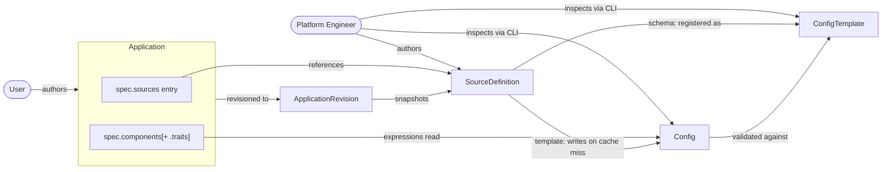
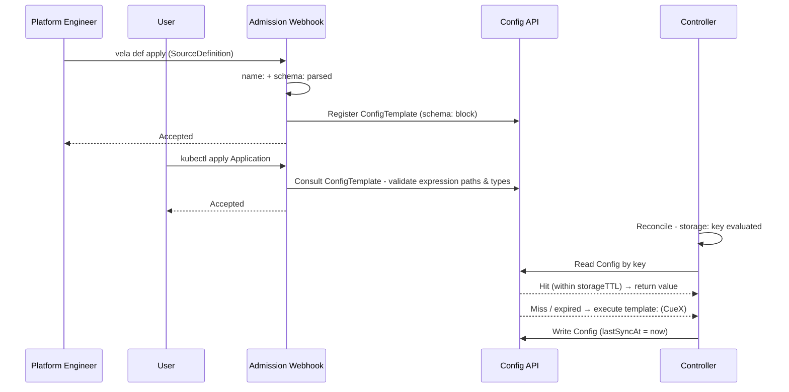
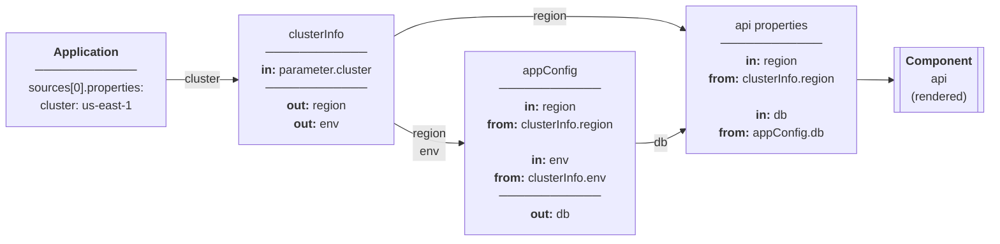
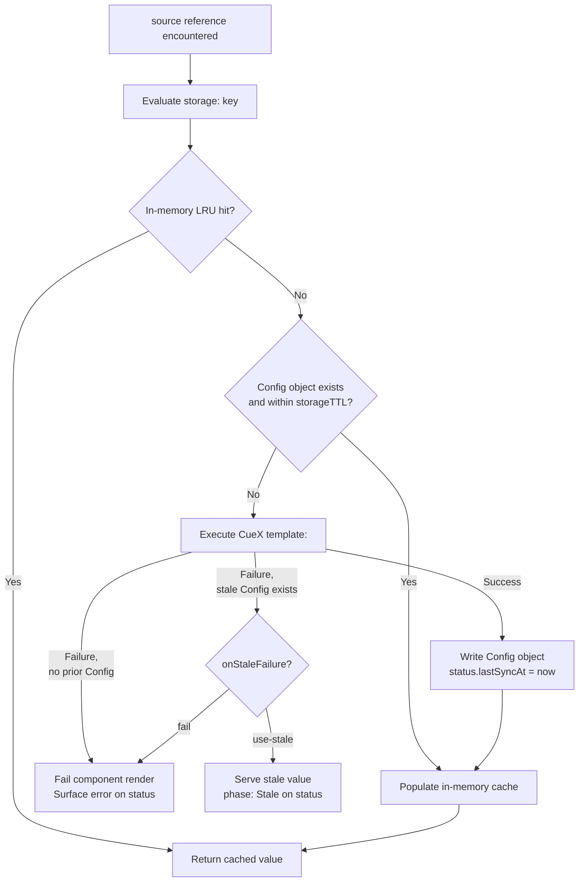

# KEP-2.16: SourceDefinition

**Status:** Ready for Review
**Parent:** [vNext Roadmap](../README.md)

`SourceDefinition` introduces a four-layer model for declarative data resolution:

| Layer | Artefact | Author | Responsibility |
|---|---|---|---|
| Definition | `SourceDefinition` | Platform engineer | Declares the output schema, cache key, and resolution logic |
| Binding | `spec.sources[]` | Application author | Names a `SourceDefinition`, scopes it to this Application, supplies instance properties |
| Resolution | `Config` object | Controller | Evaluates the cache key, serves a cached value or executes `template:`, writes result |
| Consumption | `$( )` expression | Application author | Declares which resolved value goes into which property; substitution occurs before the consuming template runs |

Today, retrieving external data requires workflow steps and manual data passing (exposing orchestration concerns to application authors for what should be a static, declarative lookup). `SourceDefinition` eliminates that exposure: the application author declares *what* data they need and *where* it goes; the platform controls *how* it is fetched and *when* it is cached.

**Trust boundary:** The platform engineer and the application author operate at different trust levels. A `SourceDefinition` carries arbitrary CueX logic (it can make HTTP calls, read cluster resources, and write resolved values into the controller's cache). Authoring and publishing a `SourceDefinition` is therefore a high-trust operation, equivalent in scope to writing a `ComponentDefinition`. The application author's trust is deliberately narrower: they can bind a named `SourceDefinition` and supply properties, but they cannot alter its resolution logic, access fields outside its declared `schema:`, or read raw resolution state. This separation is load-bearing; the feature's security properties depend on it.


```mermaid
graph LR
    PE([Platform Engineer]) -->|authors| SD[SourceDefinition]
    PE -->|inspects via CLI| CT[ConfigTemplate]
    PE -->|inspects via CLI| Config[Config]
    U([User]) -->|authors| App

    subgraph App[Application]
        SI[spec.sources entry]
        Comp["spec.components[+ .traits]"]
    end

    SI -->|references| SD
    Comp -->|expressions read| Config

    SD -->|schema: registered as| CT
    SD -->|template: writes on cache miss| Config
    Config -->|validated against| CT
    App -->|revisioned to| AR[ApplicationRevision]
    AR -->|snapshots| SD
```

## Mental Model

**`SourceDefinition`: reusable source provider (platform engineer)**

A `SourceDefinition` declares how to fetch a piece of external data. Its `template:` block is CueX logic (it can make HTTP calls, read cluster resources, or do any I/O the platform engineer specifies). The controller executes this logic when it needs a fresh value. Application authors never see or modify it.

**`spec.sources[]`: application binding (application author)**

Binds a named `SourceDefinition` to this Application, gives it a local alias, and supplies instance-specific properties. The admission webhook validates the binding at apply time; the `SourceDefinition` must exist, the properties must conform to its schema, and every expression referencing this source must name a declared field. No data is fetched at this point.

**`$( )` expressions: consumption (application author)**

Substitutes a resolved field value into a component or trait property, just before that component's rendering template runs. The rendering template (in the `ComponentDefinition`) receives a concrete value; it does not perform resolution itself.

**How it fits together**

When the controller processes a component whose properties carry an expression, it resolves the required sources before the component's CUE template runs (checking the cache, and executing the `SourceDefinition`'s `template:` only on a cache miss or expiry). Once the resolved values are substituted into the component's properties, the rendering template runs against those concrete inputs. I/O is bounded by the cache: on a cache hit, no external calls occur at all.

```
spec.sources declares:  "use SourceDefinition X with these properties"
$(source.X.Y) declares:  "put field Y from source X into this property"

At reconcile time, before the CUE template runs:
  controller checks cache for X
    → stale or missing: executes SourceDefinition template: (I/O) → writes cache
    → fresh: uses cached value
  substitutes resolved field Y into the property
  component CUE template runs with concrete inputs
```

**What this means in practice**

- All I/O is in the `SourceDefinition`'s `template:` block, executed by the controller on cache miss or expiry. Application authors declare what they need; the platform controls how and when it is fetched.
- Admission validates every expression's path against the `SourceDefinition`'s declared schema at `kubectl apply` time. Invalid paths are rejected before any resolution occurs.

## KubeVela Config and ConfigTemplate

`SourceDefinition` builds on two existing KubeVela platform primitives. Both are live features, managed by `pkg/config/factory.go` and surfaced through the `vela config` and `vela config-template` CLI commands.

**ConfigTemplate:** an existing schema registry entry. Each ConfigTemplate is a Kubernetes ConfigMap in `vela-system`, named `config-template-<name>`, labelled `config.oam.dev/catalog: velacore-config`. Its `data.schema` field holds an OpenAPI3 schema describing the shape of a valid Config; its `data.template` field holds the CUE rendering logic used to produce one. `SourceDefinition` registers its `schema:` block as a ConfigTemplate on install (hash-versioned to avoid duplicates on schema-identical upgrades).

**Config:** an existing resolved-value store. Each Config is a Kubernetes Secret in `vela-system`, labelled `config.oam.dev/catalog: velacore-config` and `config.oam.dev/type: <template-name>`. Its `data.input-properties` field holds the YAML-serialised resolved output, validated against the referenced ConfigTemplate's schema. `SourceDefinition` uses Config objects as its cache: one Config per unique `storage:` key, written on first resolution and refreshed on TTL expiry. This KEP introduces the annotation `config.oam.dev/last-sync-at` on these Secrets to record when the entry was last successfully written; the controller uses this to evaluate freshness against `storageTTL`.

Both are identified by the `config.oam.dev/catalog: velacore-config` label, not by Kubernetes object type. They are not arbitrary ConfigMaps or Secrets. Operators interact with them through `vela config list`, `vela config delete`, `vela config-template list`, and `vela config-template show` (the same tooling used for provider credentials and other platform-managed configuration today).

> **KEP-2.18** proposes graduating ConfigTemplate and Config from labelled ConfigMaps/Secrets into first-class CRDs (or Aggregated API resources), giving them proper status subresources, server-side validation, and watch semantics. This KEP is delivered against the existing v1 backing store and is transparent to that migration; the `SourceDefinition` caching layer will work unchanged once KEP-2.18 lands, with no schema or key format changes required.

## Built-in SourceDefinitions

Eight ship with the chart, generated into `charts/vela-core/templates/defwithtemplate/`
from `vela-templates/definitions/internal/source/`. Most Applications never need to
author one.

| Type | Reads |
|---|---|
| `configmap-local` | A ConfigMap's `data`, from the Application's own namespace on the cluster being rendered for, and nowhere else. Values are strings, as Kubernetes stores them. |
| `git-file` | A file from a registry configured in this cluster, optionally at a branch or tag. YAML and JSON are parsed; anything else comes back as a string. |
| `http-get` | A URL. The response is parsed when Content-Type says JSON or YAML; a non-2xx fails the source rather than becoming its value. |
| `vela-config` | A KubeVela Config: its properties, the ConfigTemplate it satisfies, and references to what that template produced. Output values are never returned, only their references, and a Config marked sensitive is refused. |
| `vela-app` | The status of another Application - phase, health, workflow state, and per-component status broken down by the cluster each is placed in. Status only; never its spec. |
| `vela-component` | The status of one placement of one component - health, message, details and traits keyed by type. Status only; never its spec. |
| `vela-addon` | Whether an addon is installed and running, and the name and namespace of the Application it built. Chain into `vela-app` for the detail. |
| `vela-env` | The environment an Application is deployed into - its name, namespace, whether the namespace is a managed env, and the labels and annotations a platform keeps there. The Application's own namespace only. |

**Only the local reader ships.** An earlier draft also shipped a `configmap`
taking optional `namespace` and `cluster`, so one definition could read any
ConfigMap on any cluster the controller can reach. Two things argued against it.

A parameter cannot be taken away: a platform that grants the reaching definition
has granted the reach, and nothing an Application author writes can narrow it
again. Binding a definition is what RBAC can see, so the boundary belongs at the
definition rather than at a field inside it, and shipping only the narrow one
makes the safe option the default rather than the one that takes work.

It also collided. Definition revisions are named `<definition>-v<n>` and do not
carry the kind, and KubeVela already ships a `configmap` **trait**, so the two
interleaved: the trait took `configmap-v1` and the source got `configmap-v2`.
`configmap@v1` pinned the trait, and the source's first revision was not
pinnable at all.

A platform that genuinely needs to read across namespaces writes that definition
itself, using `configmap-local` as the starting point. It is a dozen lines, and
authoring it deliberately is the point.

The four `vela-*` readers of KubeVela's own state exist because the alternative is a
component reaching for the Kubernetes API itself, which needs credentials, gets no
caching, and cannot be type-checked at admission.

They return status, never spec. A spec is its author's intent and can carry properties
they never meant to publish; a status is observable state the controller already writes
for anyone with read access. Keeping to status makes these a health signal rather than
a way to read somebody else's configuration.

## SourceDefinition Authoring Model

Generated fields (`key`, `keyInputs`) are written by `vela def` into a `$internal:`
block. `storage:` holds only authored fields (`storageTTL`, `onStaleFailure`) and is
optional - a source with no caching preferences declares none. The split exists
because one block holding both kinds, with nothing to distinguish them, is how a
demo manifest in this repository came to carry a wrong hand-written key.

A `SourceDefinition` is a single `.cue` file following the standard KubeVela Definition format (a named root block followed by top-level blocks):

```
cluster-config-reader.cue
```

The file has four distinct top-level blocks evaluated at different times:

| Block | Context needed | Cost | When evaluated |
|---|---|---|---|
| `<name>:` | None | Parse only | Install / admission |
| `schema:` | None | Parse only | Admission (path validation) + runtime (concreteness check against resolved output) |
| `storage:` | `context.cluster`, `parameter.*` | String interpolation | Pre-cache lookup |
| `template:` | Full context + parameters | CueX execution (I/O) | Cache miss only |

**Note:** `schema:` serves two roles backed by one artefact. At admission, the webhook uses it to validate that every expression in the Application references a declared field. At runtime, the controller uses it to verify that the resolved `output:` is fully concrete. Neither check substitutes for the other.


```mermaid
sequenceDiagram
    participant PE as Platform Engineer
    participant U as User
    participant AW as Admission Webhook
    participant CA as Config API
    participant Ctrl as Controller

    PE->>AW: vela def apply (SourceDefinition)
    AW->>AW: name: + schema: parsed
    AW->>CA: Register ConfigTemplate (schema: block)
    AW-->>PE: Accepted

    U->>AW: kubectl apply Application
    AW->>CA: Consult ConfigTemplate - validate expression paths & types
    AW-->>U: Accepted

    Ctrl->>Ctrl: Reconcile - storage: key evaluated
    Ctrl->>CA: Read Config by key
    CA-->>Ctrl: Hit (within storageTTL) → return value
    CA-->>Ctrl: Miss / expired → execute template: (CueX)
    Ctrl->>CA: Write Config (lastSyncAt = now)
```

The controller always does the cheapest thing first; `storage:` is evaluated to get the cache key, the backing Config is checked, and `template:` is only executed if the Config is missing or expired. `schema:` is parsed statically and requires no runtime context; its two uses (admission path validation and post-execution concreteness check) are described in the note above.

### Admission vs. Runtime Responsibilities

The admission webhook and the reconcile controller operate on different information at different times:

**Admission (synchronous, no I/O).** Two webhooks are involved. When a `SourceDefinition` is applied, its own validating webhook checks that it declares a CUE template, a non-empty `schema:` block, and a `storage.key` whose statically-knowable text is a valid cache key. When an `Application` is applied, its webhook checks the binding:
- Parses `name:` and `schema:` blocks of every referenced `SourceDefinition` (static; no CueX)
- Validates that every expression's path refers to a field declared in `schema:`
- Validates `default:` presence where required (optional schema field consumed by required parameter)
- Checks `SubjectAccessReview` for `get` on each referenced `SourceDefinition`
- Detects forward-reference cycles in `spec.sources` chaining
- **Does not resolve values. Does not execute `template:`. Does not read Config objects.**

**Reconcile (asynchronous, I/O permitted):**
- Evaluates `storage:` to compute the cache key (cheap; string interpolation only)
- Checks in-memory LRU cache, then backing `Config` object
- On miss or TTL expiry: executes `template:` via CueX, writes updated `Config`
- Substitutes resolved field values into component/trait properties before CUE template render
- Surfaces per-source phase (`Resolved` / `Stale` / `Failed` / `Unused`) on `status.sources`

### Custom Error Messages (`errs:`)

The `template:` block supports the `errs:` field (a `[]string`), consistent with components (since v1.11) and traits. This allows definition authors to surface human-readable failure messages when resolution fails a logic check rather than a CUE evaluation error:

```cue
template: {
  parameter: {
    entityRef: string
  }

  _catalog: http.#Do & { ... }

  errs: [
    if _catalog.$returns.status != 200 { "catalog lookup failed: HTTP \(_catalog.$returns.status)" },
    if _catalog.$returns.metadata.name == _|_ { "catalog entity \(parameter.entityRef) has no name field" },
  ]

  output: { ... }
}
```

If any entry in `errs` is non-empty, the `template:` execution is treated as failed and the messages are surfaced on the Application status. Definition authors should prefer `errs:` over relying on raw CUE evaluation errors, which are harder for application teams to interpret.

### Concreteness Enforcement

After CueX execution the controller validates the resolved `output:` against the declared `schema:`, unified as a **closed** struct. Every field the schema declares as required must be present and concrete, and any field the output produces that the schema does not declare is rejected. Unlike older Definition types where an incomplete render could pass silently, a `SourceDefinition` whose output is missing a declared field or carries an undeclared one fails resolution.

The check is scoped to `output:`, not to the whole `template:` block: helper fields (`_foo`) and provider scaffolding are implementation detail of the definition and are not part of the contract the application author consumes. `schema:` is what that contract is expressed in, so it is what gets enforced.

**A `schema:` block is mandatory.** The admission webhook rejects a `SourceDefinition` that declares none, or declares an empty one. Both enforcement points depend on it - the webhook validates expression paths against it, and the controller validates the resolved output against it - so a schema-less definition would leave consumption unchecked at both layers and let an Application read any field the resolution happened to produce. Requiring it is what makes the guarantees in [Security](#security) hold.

The `schema:` block serves as the contract between the definition author and the application author:

- **For the definition author:** `schema:` declares which fields the `output:` must populate. The controller verifies this after every CueX execution.
- **For the application author:** `schema:` is the complete set of fields an expression may read. The admission webhook validates every path against it at apply time; unknown paths are rejected before any resolution occurs.

Whether a field is optional or required in `schema:` has downstream consequences for application authors consuming it. Definition authors must declare this accurately:

| `schema:` declaration | Meaning | Consequence for consumers |
|---|---|---|
| `field: string` | Required (must be concrete after execution) | `$(source.src.field)` always resolves; no `default:` needed |
| `field!: string` | Explicitly required (same as above, more explicit) | Same |
| `field?: string` | Optional (may be absent from the resolved output) | `$(source.src.field)` may be absent; the consumer must guard it with `has(...) ? ... : <fallback>` if the target parameter is required |

```cue
schema: {
  region:      string   // required - always present in output
  environment: string   // required - always present in output
  vpcId?:      string   // optional - may be absent (e.g. non-VPC deployments)
  accountId!:  string   // explicitly required - same effect as region/environment
}
```

Concreteness is checked after CueX execution, not at admission. The admission webhook validates structural correctness of the `schema:` block; whether the resolved `output:` is fully concrete can only be verified once CueX has run with real data.

**Fail-fast parameter validation:** The `parameter:` block within `template:` is an exception; its values come entirely from `spec.sources[].properties`, which are concrete before CueX execution begins. The controller validates that all required (non-optional) `parameter` fields are concrete *before* invoking CueX. This avoids expensive I/O (HTTP calls, Kubernetes API reads) for an execution that would fail due to a missing input. Definitions should declare optional parameters with `field?:` and required ones without, so the pre-execution check can distinguish them.

### Restricting where a source may be consumed (`consumableFrom`)

By default a `SourceDefinition` may be consumed from any surface that resolves sources. A definition that only makes sense in one place can say so, and admission enforces it:

```cue
// Keyed by component, so consuming it from a trait would resolve against the
// component's identity anyway - declare the restriction rather than rely on it.
consumableFrom: ["component"]

schema: { ... }
storage: { ... }
```

`consumableFrom` is a list of surfaces. Omit the field entirely to allow every supported surface - there is no catch-all value, so there is nothing to mistype into a silently broader permission. Declaring a surface that does not resolve sources is rejected at admission, so a definition cannot advertise a capability the controller does not have.

The accepted values are not listed here on purpose. They are derived in code from the set of surfaces that actually resolve, less source chaining, which is plumbing between sources rather than a place an Application consumes a value. Naming them in prose is how the two drifted once already: a surface was enabled for resolution while `consumableFrom` still refused it, leaving a definition unable to declare a capability the controller had.

## Source Chaining

### Ordering and dependency rules

`spec.sources[]` entries are processed **in declaration order**. Before the controller evaluates a source's `storage:` key or executes its `template:`, it first resolves any expressions in that source's `properties` using the already-resolved outputs of earlier sources. This guarantees that all `parameter.*` values are concrete before `storage:` is interpolated, and before CueX execution begins.

The rule is strict: **a source may only reference sources declared earlier in `spec.sources[]`**. The admission webhook enforces this; any expression in `spec.sources[N].properties` naming a source at position N or later is rejected. This constraint exists because `storage:` key computation and CueX execution both require concrete inputs. A forward reference would mean the depended-on source hasn't been processed yet; a cycle would mean no source could ever be processed first. Forward-only ordering makes the resolution sequence a predictable linear walk, not a graph traversal.

### Laziness and transitive resolution

Resolution is lazy and per-component: a source is only processed when a component or trait being rendered references it (directly or through a chain). Sources declared in `spec.sources[]` but not referenced in the current render are never evaluated; their `storage:` key is not computed and their `template:` is not executed.

Chaining makes laziness transitive. If component `api` has `$(source.appConfig.dbEndpoint)`, and `appConfig`'s `properties` contain `$(source.clusterInfo.region)`, then rendering `api` will process `clusterInfo` first, then `appConfig`, then substitute into `api` (even though `api` has no direct reference to `clusterInfo`). The controller follows the dependency chain to whatever depth is needed, always in declaration order.

A source that is not referenced directly or transitively by any component in the current reconcile is never evaluated, and is reported as `Unused` in `status.sources[]`.

### Chaining example

A later source can use an expression in its `spec.sources[].properties` to receive the resolved output of an earlier one as its input:


```mermaid
flowchart LR
    App["<b>Application</b><br/>────────────<br/>sources[0].properties:<br/>cluster: us-east-1"]
    S1["clusterInfo<br/>────────────<br/><b>in:</b> parameter.cluster<br/>────────────<br/><b>out:</b> region<br/><b>out:</b> env"]
    S2["appConfig<br/>────────────<br/><b>in:</b> region<br/><b>from:</b> clusterInfo.region<br/><br/><b>in:</b> env<br/><b>from:</b> clusterInfo.env<br/>────────────<br/><b>out:</b> db"]
    Props["api properties<br/>────────────<br/><b>in:</b> region<br/><b>from:</b> clusterInfo.region<br/><br/><b>in:</b> db<br/><b>from:</b> appConfig.db"]
    C[["<b>Component</b><br/>api<br/>(rendered)"]]

    App -->|"cluster"| S1
    S1 -->|"region<br/>env"| S2
    S1 -->|"region"| Props
    S2 -->|"db"| Props
    Props --> C
```

```yaml
spec:
  sources:
    # Resolved first - fetches cluster metadata
    - name: clusterInfo
      type: cluster-config-reader

    # Resolved second - uses clusterInfo output as input
    - name: appConfig
      type: app-config-reader
      properties:
        region: '$(source.clusterInfo.region)'      # resolved before appConfig's storage:/template: run
        environment: '$(source.clusterInfo.environment)'

  components:
    - name: api
      type: webservice
      properties:
        dbEndpoint: '$(source.appConfig.dbEndpoint)'
```

By the time `app-config-reader`'s `storage:` key is interpolated, `parameter.region` and `parameter.environment` already hold concrete values from the `clusterInfo` resolution:

```cue
storage: {
  key: "app-config-\(parameter.region)-\(parameter.environment)"
}
```

## Caching Model

The cache is a first-class subsystem, not an implementation convenience. Its purpose is threefold: avoid redundant I/O to external systems on every reconcile, bound load on external APIs and cluster resources, and allow the controller to continue serving components when a data source is temporarily unreachable. The cache is the authoritative record of what was last successfully resolved and when.

### Freshness and Staleness

A cache entry is **fresh** if the backing `Config` object exists and the time elapsed since its last successful write is less than `storageTTL`. It is **stale** once `storageTTL` has elapsed, regardless of whether the underlying data has changed.

> **Implementation note:** In the current v1 backing store (Secrets), last-write time is stored as the annotation `config.oam.dev/last-sync-at`. Once KEP-2.18 graduates Config to a first-class CRD, this becomes `status.lastSyncAt`. The logical behaviour is identical; the controller reads the timestamp, compares it against `storageTTL`, and refreshes if expired.

`storageTTL` is declared in the `storage:` block and defaults to `"15m"` when not specified; the `storage:` block schema enforces this default so the field is always concrete by the time the controller evaluates it. It controls how long a successfully resolved value is trusted before a refresh is attempted. Setting a shorter TTL means more frequent re-fetches and fresher data; setting a longer TTL reduces external load at the cost of potentially serving older values.

**The cache never proactively pushes fresh data.** Refresh is demand-driven: the controller attempts a refresh only when a component render needs the value and the entry is missing or stale. There is no background refresh loop.

### Two-Layer Cache Structure

The cache uses two layers with different scopes and lifetimes:

**Layer 1: In-memory LRU** (per controller-process): a process-level singleton LRU keyed by the resolved `storage.key`, so entries are shared across all Applications resolving to the same key and survive across reconciles. Eliminates API server reads for the same key within the in-memory freshness window. Lost on controller restart. The TTL of this layer is a fixed implementation detail (30s), not configurable by definition authors or application authors, and it is capped at `min(30s, storageTTL)` so that a source with a short `storageTTL` is not masked by a longer in-memory entry. The worst-case staleness window for a running controller is therefore `storageTTL`, not `storageTTL` plus the in-memory TTL. Stale Layer 2 values are never promoted into Layer 1, so a stale entry always flows through the `onStaleFailure` logic rather than being masked as an in-memory hit. (Implemented directly on `k8s.io/utils/lru`; the reusable LRU abstraction the Helm renderer feature is expected to introduce can replace this later with no behavioural change.)

**Layer 2: Backing Config object** (persistent, in API server): A `Config` CRD instance (KEP-2.18) named by the resolved `key`. Survives controller restarts. `status.lastSyncAt` is the canonical timestamp of the last successful `template:` execution. This is what operators inspect to determine when data was last fetched. The controller reads it on every in-memory miss and writes it after every successful refresh.

### Resolution Flow


```mermaid
flowchart TD
    A[source reference encountered] --> B[Evaluate storage: key]
    B --> C{In-memory LRU hit?}
    C -- Yes --> G[Return cached value]
    C -- No --> D{Config object exists<br/>and within storageTTL?}
    D -- Yes --> E[Populate in-memory cache]
    E --> G
    D -- No --> F[Execute CueX template:]
    F -- Success --> H[Write Config object<br/>status.lastSyncAt = now]
    H --> E
    F -- Failure,<br/>no prior Config --> I[Fail component render<br/>Surface error on status]
    F -- Failure,<br/>stale Config exists --> J{onStaleFailure?}
    J -- use-stale --> K[Serve stale value<br/>phase: Stale on status]
    J -- fail --> I
```

1. Check in-memory cache for `key` → hit: return immediately
2. Miss → read `Config` object named by `key`
3. Config exists and `now - status.lastSyncAt < storageTTL` (fresh) → populate in-memory cache, return
4. Config missing or stale → execute CueX `template:`
   - **Success:** write updated `Config` with `status.lastSyncAt = now`, populate in-memory cache, return
   - **Failure, no prior Config:** fail the component render; surface error on Application status (`phase: Failed`)
   - **Failure, stale Config exists:** apply `onStaleFailure` policy (see below)

**When does CueX `template:` execute?** Only when both of the following are true: (a) the in-memory LRU cache has no entry for this key, and (b) the backing Config object is absent or its `lastSyncAt` is older than `storageTTL`. Every other path (in-memory hit, fresh Config object) returns the cached value without any I/O. The `storage:` key interpolation always runs (it is cheap string interpolation), but CueX execution is strictly bounded by the cache state. The component's CUE rendering template always receives concrete, already-resolved values; source resolution completes before the rendering template runs.

### Stale-Data Policy (`onStaleFailure`)

When a refresh attempt fails and a stale `Config` object already exists, the `onStaleFailure` field governs the controller's behaviour:

```cue
storage: {
  key:            "cluster-config-reader-\(context.cluster)"
  storageTTL:     "15m"
  onStaleFailure: *"use-stale" | "fail"   // default: use-stale
}
```

**`use-stale` (default):** serve the last known good value. The component renders with potentially outdated data and the source `phase` is set to `Stale` on the Application status. The reconcile loop is not blocked. On each subsequent reconcile, the controller re-attempts the refresh; if it eventually succeeds, `lastSyncAt` is updated and the `phase` returns to `Resolved`.

**`fail`:** treat a failed refresh identically to a first-load failure: block the component render and surface an error. Use this for sources where serving outdated data is worse than blocking the render (for example, security-sensitive lookups where a stale value could grant or deny access incorrectly).

**Choosing a policy:** Most sources should use `use-stale`. It makes the platform resilient to transient external failures and prevents a flapping data source from cascading into application downtime. Use `fail` only when correctness of the data is more important than availability of the render, and document this choice in the `SourceDefinition` description.

**Stale data is time-bounded only by `storageTTL`.** When `use-stale` is in effect, the controller will keep serving the stale value indefinitely as long as refresh continues to fail. There is no automatic expiry after which a stale entry is evicted and the render is forced to fail. Operators monitoring `phase: Stale` sources should treat a prolonged stale phase as an alert; the underlying data source is consistently unreachable.

### Cache Key

The key is **generated, not authored**. `vela def` scans the template for `context`
reads, orders them by policy, and writes the result into a `$internal:` block.
Admission re-derives it and rejects a mismatch, so it cannot be edited by hand.

```cue
// Generated from the context this template reads - do not edit.
$internal: {
	key:       "tenant-data-\(context.cluster)-\(context.namespace)"
	keyInputs: ["cluster", "namespace"]
}

storage: {
	storageTTL:     "15m"
	onStaleFailure: "use-stale"
}
```

**Why generated.** The original design made the sharing boundary the author's
obligation and gave no feedback when they got it wrong. The failure was silent and
severe: a key omitting a discriminating input meant the second Application to
resolve received the first's data, and nothing objected. Inference removes the
obligation - everything the template reads is in the key by construction, so that
class of bug cannot be written. The author keeps the choice that mattered: a
template reading `context.cluster` is keyed per cluster, one reading nothing is
shared everywhere. That is decided by what the template reads, which is the honest
signal; the previous design let the key and the template disagree.

An author can no longer widen the cache deliberately - read a value but exclude it
from the key. That is exactly the operation that produced the silent-sharing bug,
so it is withheld rather than supported.

**The identity is `<readable prefix>-<hash>`.** The prefix is the generated key
expression and is cosmetic; uniqueness lives in the hash, which covers a structured
document: the template's fingerprint, the binding's properties, and exactly the
context values named by `keyInputs`. Three things follow:

- **Normalisation is not the author's job.** A value that cannot be rendered into a
  legal object name - a struct, a label value containing `/` or `.` - contributes to
  the hash and not the prefix.
- **Absent, empty and set are three identities.** The hash is structured, so `nil`,
  `""` and `"platform"` are distinct. A template may branch on that difference, so
  the identity has to draw it.
- **Over-long identities trim the prefix, never the hash.** A shorter prefix cannot
  collide; re-hashing would discard readability exactly when the name is longest.

**The template fingerprint closes finding #11.** Cached values are served without
re-validation, so a definition whose fetch logic changed must stop addressing the
entries its previous version produced. Hashing the schema alone would miss the case
that matters - a changed URL behind an unchanged output shape. Because the whole
template is hashed, an edit of any kind orphans the old entries.

**`keyInputs` matters more than the key.** Only some fields are inlined into the
key expression, so a hashed-only input could be deleted by hand while the key still
validated perfectly - collapsing every value that input distinguished onto one
entry. Both are re-derived at admission.

**On the `$` prefix.** It follows the convention CueX already uses for `$params` and
`$returns`. A leading underscore would be the CUE idiom for "internal", but hidden
fields are dropped from exported output and these must stay visible - GitOps diffs
them and admission re-derives them. `__` is reserved by CUE and does not compile.

**Cardinality and sharing.** The keyed set determines the sharing boundary. A
template reading only `context.cluster` produces one entry per cluster, shared by
every Application there; one also reading `context.appName` produces one per
Application. Cross-application sharing is a natural consequence of key-based
caching and is intentional.

Caller identity - `componentName`, `traitType`, `stepName`, `policyName` and their
types - is keyable, which is what makes a per-component source possible. A source
reading one of those is consumable only where that field exists; see
[Where a source may be consumed](#where-a-source-may-be-consumed).

### Operator Guidance: Inspecting Cache State

Each entry records its identity inputs on itself, as labels and annotations, so it
can be found by selector and read without decoding the key:

```yaml
labels:
  sourcedefinition.oam.dev/name: tenant-lookup
  sourcedefinition.oam.dev/ctx.cluster: local
annotations:
  sourcedefinition.oam.dev/key-inputs: ["cluster","namespace"]
  sourcedefinition.oam.dev/context: {"cluster":"local"}
  sourcedefinition.oam.dev/properties: {"fallback":"unknown"}
  sourcedefinition.oam.dev/template-hash: 14f35523
```

Only identity inputs are recorded. An entry is shared by every binding that
resolves to it, so anything outside the identity - the consuming Application, say -
differs between sharers, and recording it would describe whichever one wrote the
entry first. Labels are selectable but constrained to 63 characters of a restricted
alphabet, so only context values legal as both a label key and value become labels;
annotations carry the rest. Resolved output is deliberately not recorded:
encryption-at-rest covers a Secret's `data` but not its metadata, so mirroring
output there would quietly defeat it.

Configs (labelled Secrets in `vela-system`) are accessed through the `vela config` CLI (not via `kubectl get secret` or similar direct object commands). Use the following:

```bash
# List all cache entries for a SourceDefinition
vela config list -t cluster-config-reader-a3f9c21b

# Check per-source phase (Resolved / Stale / Failed / Unused), and who read each value
vela status <name> --sources

# Force a refresh: delete the cache entry - the controller will re-execute template: on next reconcile
vela config delete cluster-config-reader-us-east-1
```

Deleting the cache entry is the supported mechanism for forcing an immediate refresh; the controller treats a missing entry as a cache miss and unconditionally executes `template:` on the next reconcile. If `template:` fails after deletion, there is no stale value to fall back to: the component render will fail until the source becomes reachable again.

## ConfigTemplate Versioning

The `schema:` block is registered as a `ConfigTemplate` whose name embeds a hash of that schema: `{source-definition-name}-{schema-hash}` (for example `cluster-config-reader-a3f9c21b`). The hash is the schema's identity, so the name is deterministic rather than sequential:

1. Compute the hash of the new `schema:` block
2. Derive the ConfigTemplate name from it
3. **Name already exists:** the schema is unchanged; the SourceDefinition revision attaches to the existing ConfigTemplate and no new object is created
4. **Name does not exist:** create it

A new ConfigTemplate therefore appears only on a genuine schema change, and a `SourceDefinition` revision that reverts to a previously-used schema re-attaches to that schema's existing `ConfigTemplate` rather than creating a duplicate. The current name and hash are recorded on the SourceDefinition's `status.configTemplateRef`.

> **Note:** an earlier draft of this KEP specified a monotonically incrementing `{name}-v{N}` scheme with the hash carried in a `definition.oam.dev/schema-hash` annotation. The shipped implementation derives the name from the hash directly, which gives the same deduplication with no counter to maintain and no ordering to reason about. Operator commands below use the hash-suffixed form.

Each `DefinitionRevision` records the name of its attached `ConfigTemplate`; this link is what allows the controller to determine the correct cache schema for any snapshotted revision, including during rollbacks (see [ApplicationRevision Snapshot](#applicationrevision-snapshot)). Garbage collection of `ConfigTemplate` entries whose schema is no longer referenced is left to a future enhancement.

If multiple components in the same Application reference the same `SourceDefinition`, the cached `Config` entry from the first resolution is reused for subsequent ones; the second component's reconcile is a cache hit.

## Full Example: cluster-config-reader

```cue
// cluster-config-reader.cue

"cluster-config-reader": {
  type:        "source"
  description: "Reads platform metadata from the cluster-config ConfigMap in platform-data namespace"
  attributes: {
    scope: "spoke"   // advisory: reads a per-cluster ConfigMap. The read below routes to the spoke via cluster: context.cluster
  }
}

// schema declares the output contract for this SourceDefinition.
// It serves two purposes:
//   1. Admission: the webhook validates that expression paths name fields declared here.
//   2. Runtime: the controller verifies that the resolved output: is fully concrete against this schema.
// Registered as a versioned ConfigTemplate on install (hash-deduplicated).
// No runtime context is available at this stage - evaluated at parse time only.
schema: {
  region:      string
  environment: string
  // +sensitive
  vpcId:       string
  // +sensitive
  accountId:   string
}

// storage declares the cache key, TTL, and stale-data policy.
// Evaluated with context.cluster and parameter.* only - cheap string interpolation.
// May not reference context.output, context.status, or CueX providers.
// onStaleFailure defaults to "use-stale" - serve prior data if refresh fails.
storage: {
  key:        "cluster-config-reader-\(context.cluster)"
  storageTTL: parameter.cacheDuration | *"15m"
}

// template contains the CueX resolution logic.
// Only executed on cache miss or storageTTL expiry.
template: {
  parameter: {
    // +usage=How long to cache the resolved cluster config before re-fetching
    cacheDuration?: *"15m" | string
  }

  _clusterConfig: ex.#Read & {
    $params: {
      cluster:    context.cluster   // route to the spoke; omit for a hub-local read
      apiVersion: "v1"
      kind:       "ConfigMap"
      metadata: {
        name:      "cluster-config"
        namespace: "platform-data"
      }
    }
  }

  output: {
    region:      _clusterConfig.$returns.data.region
    environment: _clusterConfig.$returns.data.environment
    vpcId:       _clusterConfig.$returns.data.vpcId
    accountId:   _clusterConfig.$returns.data.accountId
  }
}
```

## Application Usage

Application authors declare source bindings in `spec.sources` and reference them with `$( )` expressions. Each entry names a `SourceDefinition` (via `type:`), assigns it a local name (via `name:`), and supplies instance properties that parameterise this particular use. The local name is the namespace for every expression within this Application; components and traits read resolved values as `<local-name>.<field-path>`, never referencing the `SourceDefinition` directly.

The shorthand string form is preferred for simple references:

```yaml
apiVersion: core.oam.dev/v1beta1
kind: Application
spec:
  sources:
    - name: clusterInfo
      type: cluster-config-reader
      properties:
        cacheDuration: "1h"

  components:
    - name: api
      type: webservice
      properties:
        region: '$(source.clusterInfo.region)'       # shorthand: <source>.<path>
        accountId: '$(source.clusterInfo.accountId)'
        image: myapp:v1
```

Supply a default when the field is optional and the target parameter is required:

```yaml
        region: '$(has(source.clusterInfo.region) ? source.clusterInfo.region : "us-east-1")'
```

The resulting Config (a labelled Secret in `vela-system`, keyed by `cluster-config-reader-us-east-1`). The YAML below shows the abstract Config model; the KEP-2.18 CRD will formalise this shape:

```yaml
apiVersion: config.oam.dev/v1beta1
kind: Config
metadata:
  name: cluster-config-reader-us-east-1
  namespace: vela-system   # or configured System Namespace
spec:
  template: cluster-config-reader-a3f9c21b   # {name}-{schema-hash}; changes only when the schema does
  properties:
    region:      us-east-1
    environment: production
    vpcId:       vpc-0abc123def456
    accountId:   "123456789012"
status:
  phase:      Valid
  lastSyncAt: "2026-03-30T10:00:00Z"
```

## Parameterised Example: backstage-component

For comparison, a SourceDefinition with parameters (the `key` includes `parameter.*` values to namespace cache entries per-instance):

```cue
// backstage-component.cue

"backstage-component": {
  type:        "source"
  description: "Reads component metadata from Backstage software catalog"
  attributes: {
    scope: "hub"
  }
}

schema: {
  name:        string
  description: string
  team:        string
  tier:        string
}

storage: {
  key:        "backstage-component-\(parameter.entityRef)"
  storageTTL: "10m"
}

template: {
  parameter: {
    entityRef: string
  }

  _catalog: http.#Do & {
    method: "GET"
    url:    "https://backstage.internal/api/catalog/entities/by-ref/\(parameter.entityRef)"
  }

  output: {
    name:        _catalog.$returns.metadata.name
    description: _catalog.$returns.metadata.description
    team:        _catalog.$returns.spec.owner
    tier:        _catalog.$returns.metadata.annotations["backstage.io/techdocs-ref"]
  }
}
```

## Platform Pattern: Governance Metadata

The previous examples use `parameter.*` (source properties set by the application author) to drive resolution. But `context.appLabels` (the labels on the Application CR) opens a complementary pattern: sources whose resolution is supported by platform labelling conventions, reducing or eliminating the need for author-supplied properties.

Platform teams can standardise a set of governance labels on every Application. Configurable Application Policies (introduced in v1.11) are the natural mechanism for enforcing this; a platform-level policy can validate or inject standard labels, ensuring every Application carries the expected metadata before sources are resolved.

A `SourceDefinition` can then read those labels to look up extended metadata from a service catalog. Because the source key is derived from `context.appLabels` and `context.cluster`, the source needs no `parameter:` block; the application author never needs to supply resolution inputs beyond following the labelling convention.

```cue
// governance-metadata.cue

"governance-metadata": {
  type:        "source"
  description: "Fetches governance metadata from the service catalog using Application labels"
  attributes: {
    scope: "hub"
  }
}

schema: {
  serviceName: string
  owner:       string
  department:  string
  tier:        string
  costCentre:  string
}

storage: {
  // Key derived from Application labels and cluster - no author properties needed.
  // If example.org/service-name is absent, key computation fails with a fail-fast error,
  // enforcing the labelling convention at resolution time.
  key:        "governance-\(context.appLabels["example.org/service-name"])-\(context.cluster)"
  storageTTL: "1h"
}

template: {
  parameter: {}   // no source properties - all inputs come from context.appLabels

  _serviceName: context.appLabels["example.org/service-name"]

  _catalog: http.#Do & {
    method: "GET"
    url:    "https://service-catalog.internal/api/services/\(_serviceName)"
  }

  errs: [
    if _catalog.$returns.status != 200 { "service catalog lookup failed for \(_serviceName): HTTP \(_catalog.$returns.status)" },
  ]

  output: {
    serviceName: _serviceName
    owner:       _catalog.$returns.owner
    department:  _catalog.$returns.department
    tier:        _catalog.$returns.tier
    costCentre:  _catalog.$returns.costCentre
  }
}
```

The Application is minimal (just labels and a source reference with no properties):

```yaml
apiVersion: core.oam.dev/v1beta1
kind: Application
metadata:
  name: checkout
  labels:
    example.org/service-name: checkout
    example.org/owner:        platform-team
    example.org/department:   engineering
spec:
  sources:
    - name: governance
      type: governance-metadata
      # no properties - resolution is driven entirely by Application labels

  components:
    - name: api
      type: webservice
      properties:
        department: '$(source.governance.department)'
        costCentre: '$(source.governance.costCentre)'
        tier: '$(source.governance.tier)'
```

Because the source has no properties, it can be injected transparently; platform teams can use policies to assure every Application has the governance source attached without requiring application authors to declare it. The only contract the author must honour is the labelling convention.

If the required label is absent, the `storage:` key interpolation produces an error at resolution time; the missing label surfaces as a fail-fast error on the Application status before any CueX I/O is attempted. This makes the labelling convention self-enforcing: an unlabelled Application cannot successfully render components that consume governance data.

## Enablement: the delimiter problem

`$( )` is not a free choice of delimiter. `$(VAR_NAME)` is Kubernetes' own syntax
for a dependent environment variable, documented and ordinary in `env`, `command`
and `args`. This repository contains an instance of it:
`e2e/addon/mock/testdata/fluxcd/.../source-controller.yaml` passes
`--storage-adv-addr=source-controller.$(RUNTIME_NAMESPACE).svc.cluster.local.`

With the expression pass running, that value is read as an expression and the
Application is refused, at admission and again at render. It fails loudly rather
than rendering wrong, which is the right failure, but it is still a breaking
change to every Application that uses the Kubernetes form. An installed base that
has never heard of this feature must not have to escape anything.

Alternatives considered: a different delimiter (`${ }` collides with shell,
`{{ }}` with Helm and with every templating layer already wrapped around
KubeVela); an escape-free grammar that only reads `$(source.` and `$(context.`
prefixes (rejected because it makes the language's shape depend on what happens to
be defined today, and a future root silently changes the meaning of stored
Applications). Refusing to run at all until asked is the only option that leaves
existing Applications untouched by construction.

So two gates, giving three states:

| State | `EnableCelExpressions` | `RequireCelExpressionOptIn` | Read |
| --- | --- | --- | --- |
| Off (default) | `false` | - | Nothing |
| Opt-in | `true` | `true` (default) | Applications annotated `app.oam.dev/cel-expressions: "true"` |
| On | `true` | `false` | Every Application |

`ExpressionsEnabledFor` in `pkg/sources` is the single place that answers the
question, so admission and render cannot disagree about whether an Application is
in scope, which is the recurring shape of bug in this feature.

**Named for CEL, not for sources.** `$(context.appName)` needs no SourceDefinition
at all, so the gate and the annotation are named for the mechanism rather than for
its first consumer. Sources are what made expressions worth having; they are not
the boundary of what expressions will be used for.

**Opt-in is per Application, not per namespace.** What is being opted in to is a
new reading of the Application's own property values, and only its author knows
whether any of them mean `$(VAR)` in the Kubernetes sense. A namespace-level
switch would make one team's decision break another team's container.

The migration path for an operator is therefore: enable the feature, let teams
annotate as they audit their own properties, and only drop
`RequireCelExpressionOptIn` once the fleet has been swept. Going straight to the
third state re-reads every Application at once, and a break surfaces at some
unrelated later admission looking like a regression in something else.

## Consuming a Source

A property may be a [CEL](https://github.com/google/cel-spec) expression, delimited
by `$( )`. That is the only consumption mechanism; the `fromSource` directive it
replaced is gone, along with its `FromSource` and `SourceSelector` API types.

```yaml
image:      '$(source.catalog.image + ":1.25.0")'   # concatenation
replicas:   '$(source.tenant.maxReplicas / 2)'      # integer arithmetic
port:       '$(source.catalog.httpPort)'            # stays an int
labels:     '$(source.catalog.standardLabels)'      # a struct, whole
value:      '$(has(source.registry.mirror) ? source.registry.mirror : "none")'
value:      '$(context.appName + "." + context.namespace)'
value:      'https://$(source.registry.host)/health'  # embedded in text
```

CEL was chosen over a purpose-built language because it is already the expression
language of Kubernetes - CRD validation rules, admission policies, authorisation -
so consumers largely know it, `k8s.io/apiserver/pkg/cel` was already a transitive
dependency, and its checker gives a static result type without evaluating anything.
The alternative was growing a bespoke grammar to cover ternaries, comparisons,
string functions and iteration, each of which had to be specified, implemented and
explained.

The function set is CEL's standard library plus its Strings and Lists extensions:
operators and macros (`has`, `all`, `exists`, `map`, `filter`), string handling
(`split`, `join`, `replace`, `substring`, `trim`, `indexOf`, case conversion), list
indexing and `slice`, and the `int`/`string`/`double`/`bool` conversions. Both
extensions are pure and total, so the sandbox argument below is unchanged. `sort`
and `distinct` need a newer cel-go than Kubernetes pins and are therefore absent.

`$$(` escapes the delimiter.

**A binding name must be a CEL identifier.** A binding is read as a field selection,
so `source.cluster-info` parses as subtraction, and there is no bracket escape:
`source` is an object type rather than a map, so `source.clusterInfo` does not
compile either. Hyphenated names are therefore refused when the binding is declared
- which reports the problem once, at the declaration, instead of as a compile
failure inside every expression that reads it. Write `clusterInfo`.

Substitution happens before the consuming template runs. Resolution - the cache
lookup and, on miss or expiry, `template:` execution - always completes first, so an
expression reads an already-resolved value, never an in-flight one. The expressions
in a component's properties determine which sources are resolved during that
component's reconcile, and in what order.

**Why not a directive.** `fromSource` could *name* a value but not compute with one.
Concatenating a tag onto an image, halving a granted quota, or building a hostname
from two fields each required a bespoke `WorkflowStepDefinition` - written,
installed and maintained per platform - or was hardcoded and left to drift. Two
mechanisms also meant two enforcement paths, and they drifted: `fromSource` had a
single list of where it resolved, expressions grew separate surface handling, and
admission came to accept `$(context...)` in every policy while only some
substituted it.

### Type checking

The expression is type-checked at admission against the parameter it feeds. The
source's `schema:` - a `cue.Value` - is translated into an
`apiservercel.DeclType`, the expression is compiled against an environment holding
one such type per binding, and CEL's `OutputType()` reports the result type. Nothing
is evaluated: the type is a property of the expression and the declared schema, so
no data has to exist at admission.

The CUE schema remains the single contract. It is the definition author's
declaration and the consumer's type check; the translation into CEL's type system is
mechanical and invisible to both.

| Written | Rejected at admission with |
|---|---|
| `port: '$(source.catalog.image)'` | *is string but component "webservice" parameter expects int* |
| `image: '$(source.catalog.standardLabels)'` | *is object but … expects string* |
| `image: '$(source.catalog.standardLabels)-x'` | *cannot be combined with text* |
| `image: '$(source.registry.mirror)'` | *may be absent and feeds required … guard it with `has(…) ? … : <fallback>`* |
| `image: '$(source.registry.nope)'` | *undefined field 'nope'* |
| `image: '$(parameter.image)'` | *undeclared reference to 'parameter'* |

**Validation is two-phase, and the second is gated on the first.** Soundness comes
first - expressions compile, their types fit the parameters they feed, sources are
declared and ordered, names are unique, permissions hold - and rendering is
attempted only when all of it passes.

| Phase | Answers | Cost |
|---|---|---|
| Soundness | is the Application well-formed? | static; no evaluation, no side effects |
| Rendering | does it actually render? | generates the appfile, evaluates every template and trait, **resolves every source for real** |

The gate exists because rendering was restating soundness failures in the
evaluator's words and from a coarser field path: a type error reported precisely
against `spec.components[0].properties.tags` reappeared as an opaque failure
against `"schematic"`, so the same mistake was reported twice and the second
telling was the worse one. It also stops an Application already known to be
invalid from issuing whatever HTTP, git or Kubernetes reads its sources perform -
admission-time resolution is real resolution.

The cost is that a soundness failure hides a rendering failure until it is fixed.
That is the usual compiler trade, and it is why the two phases are named: they
answer different questions and only one of them can be answered cheaply.

The last row is the sandbox: an environment declares exactly `source` and `context`,
so any other identifier fails to compile. It needs no grammar restriction to
enforce, and it holds inside a macro body, which is the one place an author could
plausibly introduce a name.

**Element types are compared too.** A CUE kind says only "list", so `list(string)`
feeding a `[...int]` parameter would pass and fail at render - the failure this
feature exists to prevent. CEL carries the element type, so the check is made on
it. It judges collections only, and only where both sides are concrete: a struct,
an untyped region and a `dyn` fail open, because a false rejection there is
unfixable from the Application.

**Conditionals are supported.** An earlier revision of this KEP excluded them, and
the move to CEL reversed that. The exclusion rested on two arguments and CEL
dissolved both.

The soundness argument was mechanical: CUE has no conditional *expression* - `if` is
a comprehension, so only the list-index idiom `[if c {a}, b][0]` parses as a value -
and the checker materialised the schema into sentinels and evaluated once, so a
conditional would branch on fake data and mistype. CEL's checker types a ternary
statically and requires both arms to unify, so the result is value-independent by
construction.

The design argument was that an expression should surface a value, not decide what
the platform does, and that branching in an Application moves platform logic into
the artefact least able to review it. That remains sound as *guidance*, and
definition authors should still put real decisions in the definition, where CUE is
unrestricted and the output is validated against a schema:

```cue
schema: {replicas: int}
output: {
	if _data.tier == "gold" { replicas: 10 }
	if _data.tier != "gold" { replicas: 2 }
}
```

But it was never worth a checker to enforce, and enforcing it is no longer possible
anyway: the ternary is how CEL spells a guarded read of a possibly-absent value
(`has(x) ? x : fallback`), so the construct has to be available. What was a
restriction is now a convention.

**Defaults are target-aware.** A default is required exactly when a possibly-absent
read feeds a *required* parameter:

| Schema field | Target parameter | Default | Outcome |
|---|---|---|---|
| Required | Required | Not needed | Field always present |
| Required | Optional | Not needed | Nothing to default |
| Optional | Required | **Required** | Admission rejects without one |
| Optional | Optional | Allowed | Absent field simply omits the parameter |

A default is not a fallback for execution failures; those are governed by
`storage.onStaleFailure`.

### Where a source may be consumed

| Surface | `source` | `context` |
|---|---|---|
| Component properties | yes | yes |
| Trait properties | yes | yes |
| Later `spec.sources[]` (chaining) | yes | yes |
| Workflow step properties | yes | yes |
| Policy with a CUE template (renders resources) | yes | yes |
| Built-in policy (`topology`, `override`, …) | no | yes |
| Application-scoped policy | no | yes |

The last two rows are a property of those paths, not a gap. A built-in policy's
properties are read straight off the appfile by a provider, so nothing renders them
and there is no resolver to reach a source through. An Application-scoped policy
renders before the appfile exists, so there is no parsed `spec.sources[]` at all. In
both cases `context` is available and `source` is not, so permitting `context` lets
the surface carry expressions rather than being excluded because half the feature
cannot work there.

Reading `source` where it cannot resolve is rejected with a reason, not silently
substituted with nothing:

```
"source" cannot be read here; this surface permits "context"
```

"Policy" is three surfaces, not one, and only the rendering kind resolves sources.
Only `spec.scope` on the `PolicyDefinition` distinguishes the scoped kind from the
rendering kind - the type name looks identical - so every enforcement point looks it
up rather than deciding for itself.

**A source is further restricted by what it reads.** One keyed on
`context.componentName` resolves per component and cannot be consumed where no
component is rendered:

```
SourceDefinition "per-component" reads context.componentName,
which is unavailable in workflow steps
```

This is enforced per binding at admission and reported by `vela def show` before
anything is applied. It is what makes a per-component source safe rather than
silently resolving against the wrong identity somewhere else.

**The component is the unit of consumption.** An expression resolves identically in a
component's properties or in one of its traits': same context, same key, same entry.
A trait has no separate identity in source resolution, so it is reported as a
consumer named `<component>/<trait>` in `status.sources[].consumedBy` rather than as
something a source resolves for on its own terms.

Expressions are found structurally, at any depth within `properties`, including
nested objects and array entries - a `k8s-objects` component whose parameter is an
open list of open structs is substituted the same as any other.

### Validation summary

`schema:` is checked at two different times by two different actors:

| When | Who | What is checked |
|---|---|---|
| `kubectl apply Application` (admission) | Webhook | Every expression's path names a declared `schema:` field; its result type fits the consuming parameter; a default is present where required; the surface permits the roots read; the source's own context reads are satisfiable on every consuming surface; `SubjectAccessReview` passes for each referenced `SourceDefinition` |
| Reconcile, cache miss (runtime) | Controller | Resolved `output:` matches the `schema:` contract; required fields are concrete; optional fields are present or absent |

Every surface is type-checked, not just components and traits. Errors from admission
block the apply; runtime errors surface on the Application status and block the
render. Neither substitutes for the other.

## Context in a SourceDefinition

A source is compiled against a context built from the cache-key policy, narrowed to
the surface consuming it:

```
source context = ( keyed ∩ surfaces[callerSurface] ) + name := binding
```

A field that would not contribute to the key is *absent*, so it cannot be read even
where admission is disabled. Reading anything else fails admission with one message:
additional data reaches a source as a property instead. With the key covering what
the template reads, the converse has to hold too, or a template could depend on a
value the key ignores - reintroducing silent sharing through a different door.

`context.name` is the `spec.sources[]` binding entry, not the consuming component,
so it is stable on every surface. Because `context.name` means something different
at each call site, every definition kind also gets its own pair, set before it
renders:

| Render | Own | Inherited |
|---|---|---|
| component | `componentName`, `componentType` | - |
| trait | `traitType` | `componentName`, `componentType` |
| workflow step | `stepName`, `stepType` | - |
| policy | `policyName`, `policyType` | - |

There is no `traitName`: `ApplicationTrait` carries only a `Type`, and inventing an
instance name would recreate the ambiguity this removes.

**One declaration, per surface.** `pkg/definition/sourceexpr/context.cue` declares
every field once, in groups composed into a type per call site. Go reads it rather
than restating it, so the types an expression is checked against at admission and
the values it is evaluated against at render come from one place and cannot
disagree.

```cue
#ComponentIdentity: {componentName: string, componentType: string, ...}
#TraitIdentity:     {traitType: string}

surfaces: {
	component:    {#AppIdentity, #DeliveryIdentity, #ClusterIdentity, #ComponentIdentity, name: string}
	trait:        {surfaces.component, #TraitIdentity}
	workflowstep: {#AppIdentity, #DeliveryIdentity, #ClusterIdentity, #StepIdentity, name: string}
	...
}
```

Declared type against real type is *unification* rather than a comparison someone
has to write:

```
surfaces.component & <a real render context>
→ appRevisionNum: conflicting values "3" and int (mismatched types string and int)
```

Membership is pinned both ways: a field the render context carries must be placed in
a group or in `excluded` with a `+reason` the loader requires at startup. Exclusion
messages are derived, not prose - a field offered elsewhere reports *"available on:
component, trait, workflow step"*.

## Resolution Scope: hub vs spoke

Source resolution executes the `template:` in the controller process. The target cluster for any I/O is **chosen by the definition author on the CueX read provider itself**, not by a separate controller code path. The KubeVela `kube` / `ex.#Read` providers accept a `cluster:` field and route the read to that cluster through the configured cluster gateway; when `cluster:` is empty they read the local (hub) cluster. This means hub-vs-spoke resolution is a property of how the definition is authored, and no special controller wiring is required.

**Reading from the hub (default).** Omit `cluster:` (or set it to the empty string / the hub cluster name). This is the right choice for central data such as a service registry ConfigMap on the hub. A single `Config` cache entry is shared across all consumers for the same key.

```cue
template: {
  _clusterConfig: ex.#Read & {
    $params: {
      // no cluster: → reads the hub/local cluster
      apiVersion: "v1"
      kind:       "ConfigMap"
      metadata: { name: "service-registry", namespace: "platform-data" }
    }
  }
  output: { ... }
}
```

**Reading from a spoke.** Set `cluster: context.cluster` (or an explicit cluster name) on the read. The provider routes the read to that spoke through the cluster gateway. Include `context.cluster` in the `storage.key` so each spoke gets its own cache entry and cross-spoke collisions are avoided.

```cue
storage: {
  key: "cluster-config-reader-\(context.cluster)"   // per-spoke cache entry
}

template: {
  _clusterConfig: ex.#Read & {
    $params: {
      cluster:    context.cluster                    // route to the spoke
      apiVersion: "v1"
      kind:       "ConfigMap"
      metadata: { name: "cluster-config", namespace: "platform-data" }
    }
  }
  output: { ... }
}
```

**`attributes.scope` is advisory documentation.** It may still be declared in the named root block to communicate intent to platform reviewers, but the controller does not construct a spoke client from it; the effective cluster is whatever the read provider's `cluster:` field resolves to.

```cue
"cluster-config-reader": {
  type: "source"
  attributes: {
    scope: *"hub" | "spoke"   // advisory: documents where this source reads from
  }
}
```

> **Note:** because the author controls the target cluster directly on the read, a single `SourceDefinition` can even read from different clusters across bindings (e.g. driven by `context.cluster`). Definition authors handling per-spoke data must key their cache by `context.cluster` as shown above.

## Propagating a Re-resolved Value (opt-in)

Resolution is demand-driven, but a value that has been re-resolved still has to reach the cluster. A
succeeded workflow short-circuits, so nothing re-dispatches on its own and StateKeep goes on enforcing
the manifest stored when the workflow last ran.

This is **opt-in per binding**, on the binding itself:

```yaml
spec:
  sources:
    - name: registry
      type: configmap-local
      autoUpdate: true       # a new image rolls out as soon as it is published
    - name: flags
      type: configmap-local
      autoUpdate: false      # flags wait for a deliberate rollout
    - name: cluster
      type: cluster-lookup   # unset: the controller-wide default applies
```

It sits on the binding rather than on the Application because it is a property of the data, not of the
app. A registry address is worth picking up the moment it moves; a feature flag should wait for someone
to decide; one Application routinely reads both. An unset field defers to the `EnableSourceAutoUpdate`
feature gate, so a platform sets the fleet's posture and an Application disagrees per binding, in either
direction.

**A `publishVersion` pin suppresses it.** An explicit pin is hard, and a source value changing must not
move what is deployed until the pin is bumped - the rule a helmchart `valuesFrom` fingerprint already
follows. Two external-data features answering the same question differently would make "pinned" mean
one thing for one and something else for the other.

**How the change is detected.** Each dispatched workload is stamped with `source.oam.dev/resolved-hash`,
a per-source hash of the values that render actually consumed. A re-render whose hash differs from the
live workload's re-dispatches; one that matches does not.

**Scope.** Components and traits only. A workflow step or a policy resolves its sources once, when it
runs. Re-dispatching a component is safe in a way that re-running a step is not: a step may notify,
approve or deploy, and repeating it because a ConfigMap changed is not something to do implicitly.

**What a refresh must also do.** Re-dispatch changes desired state without minting an ApplicationRevision,
which is the invariant garbage collection depends on: GC recycles whole ResourceTrackers, and a tracker
retires only when a new revision supersedes it. A component whose rendered set shrank would therefore
leave the difference tracked and running forever. The refresh path prunes what a component no longer
renders, diffing against the tracker entries attributed to it. This is most visible when a resource name
derives from source data - the rename dispatches a second object rather than updating the first - but any
shrink in the rendered set leaks the same way.

Pruning is all-or-nothing per component. A partial view of what a component renders would make a
transient render error look like a deletion.

**Why it is opt-in.** Re-dispatching on every resolved-value change turns any volatile source into a
continuous deployment trigger, which is a decision an Application should make rather than inherit.

**Cadence.** Re-dispatch cannot be faster than resolution, which is bounded by `storageTTL` and the
reconcile interval. A short TTL with auto-update off means status shows a fresh value that no running
workload has.

## ApplicationRevision Snapshot

### What is snapshotted and why

Without snapshotting, a rollback or re-render could silently use a different version of the `SourceDefinition` than was active when the revision was originally applied (one with different resolution logic, a different cache key structure, or a schema change that alters which paths are valid). The result would be a render that produces different output from the original despite being nominally the same revision. Snapshotting prevents this: every render of a given `ApplicationRevision` uses exactly the resolution logic that was current when that revision was created.

`SourceDefinition` is therefore included in the `ApplicationRevision` definition snapshot alongside `ComponentDefinition`, `TraitDefinition`, `WorkflowStepDefinition`, and `PolicyDefinition`. When an `ApplicationRevision` is created, the hub copies the full body of every `SourceDefinition` revision referenced in `spec.sources` into the revision object. This is a self-contained copy (not a reference to the live cluster version). Subsequent updates or deletion of the live `SourceDefinition` do not affect renders of the snapshotted revision.

All subsequent renders of that revision (including triggered re-renders and explicit rollbacks) use the snapshotted definition body, not the live cluster version.

### What is not snapshotted: resolved data

The snapshot preserves the **resolution logic** (the `storage:`, `schema:`, and `template:` blocks) but not the **resolved data** (the `Config` cache entry). When a snapshotted revision is re-rendered or a rollback is executed, the controller re-executes the snapshotted `template:` against the external data source as it exists at that moment; it does not restore the data values from the time of the original render.

This is intentional. Snapshotting external data at revision time would be impractical and often counterproductive; a rollback that restores stale cluster metadata or stale Backstage entries would be worse than fetching current values with the original logic. The invariant is: **rollbacks reproduce the resolution behaviour of the original revision, not the resolved values**.

Operators should be aware of this when rolling back in environments where the underlying data source has changed significantly since the original render. In most cases this is desirable; for sources where data stability is critical, the `storageTTL` and `onStaleFailure` controls govern how aggressively the cache is refreshed.

### Revision stability invariants

The snapshot guarantees three properties that together make renders deterministic:

1. **Same resolution logic:** the `template:` block used to fetch data is identical across all renders of the same revision.
2. **Same schema:** the `ConfigTemplate` version used to validate cache entries matches the snapshotted definition's schema. The controller always reads and writes `Config` objects against the `ConfigTemplate` version attached to the snapshotted `SourceDefinition` revision, preventing type mismatches between cached data and the schema the controller expects.
3. **Same cache key structure:** the `storage:` block used to compute the Config object name is identical, so cache hits and misses behave consistently regardless of when the render occurs.

## Application Status

Source consumption is reported **once per Application**, in `status.sources[]`. A binding is declared
once in `spec.sources[]`, so whether it resolved, what backs it and when that expires are properties of
the binding rather than of each component reading it.

```yaml
status:
  sources:
    - name: cluster-info
      type: cluster-config-reader@v2   # the revision, where one was pinned
      phase: Failed                    # worst across the instances below
      autoUpdate: true
      resolutions:
        - storageKey: cluster-config-reader-eu-west-prod
          clusters: [eu-west-prod]
          phase: Resolved
          expiresAt: "2026-08-19T16:30:00Z"
        - storageKey: cluster-config-reader-us-east-prod
          clusters: [us-east-prod]
          phase: Failed
          message: "dial tcp: i/o timeout"
      consumedBy:
        - definitionKind: component
          name: api
          type: webservice
          cluster: eu-west-prod
          namespace: default
          values:
            - property: image
              sourceAttr: data.image
              value: ghcr.io/acme/api:1.4.0
        - definitionKind: workflowstep
          name: notify
          type: notification
          values:
            - property: slack.message
              sourceAttr: data.channel
              value: "#deploys"
```

**Resolutions are keyed by storage key, not by cluster.** The key is what a resolution is. A source
keyed on `context.cluster` has an entry per cluster, each with its own expiry and its own state; one
keyed on `context.componentName` has an entry per component inside a single cluster; one keyed on
nothing has a single entry serving everything. Reporting a single `config` and `expiresAt` per binding
named one of several arbitrarily, and keying the list by cluster would invent entries in the first case
and collapse them in the third. The binding's own `phase` is the worst of its resolutions, so which
cluster reconciled last cannot decide whether the Application looks healthy.

| Phase | Means |
|---|---|
| `Resolved` | fetched, serving a current value |
| `Stale` | a refresh failed and the previous value is still served. The Application works and its data has stopped moving |
| `Failed` | could not be resolved |
| `Unused` | declared but nothing reads it |

**Consumption hangs off the source rather than off each consumer.** Not every consumer has somewhere to
put it: a workflow step's status is `workflowv1alpha1.WorkflowStepStatus`, owned by the `kubevela/workflow`
module, and that engine is deliberately unaware sources exist since properties are substituted before it
ever sees them. Recording there would mean teaching another repository about a concept it was designed not
to know. Inverting it also gives one place to answer both "did my data arrive" and "who used it".

**A value records where it went, not only what it was.** `sourceAttr` is what was read, `property` is the
consumer property that received it. A list rather than a map, because one attribute can feed several
properties and one property can be assembled from several attributes - `host: "$(source.db.addr):$(source.db.port)"`
is two values into one property, which a map cannot express.

**Reads are attributed to the reader that made them.** A chained source resolves through the same resolver
as the component that triggered it, so without this the component is credited with reads it never made and
the chain is invisible.

Values marked `// +sensitive`, and any path the binding's `statusPolicy` masks, are redacted wherever they
appear - including inside a struct or list that was substituted whole, where a mark one level below the
read would otherwise not match.

### `statusPolicy`

A definition author marks what is secret with `// +sensitive`; `statusPolicy` is how the *consuming*
Application narrows what reaches its own status, for a value the author had no reason to consider secret
but this Application does.

```yaml
spec:
  sources:
    - name: db
      type: db-config
      statusPolicy:
        maskPaths: [password, "tls.key"]   # redacted to *** wherever they appear
        exposeConsumedValues: false        # omit every value; the properties are still listed
```

| Field | Unset | Effect |
|---|---|---|
| `maskPaths` | mask nothing beyond `// +sensitive` | a path here, or anything beneath it, is replaced with `***` |
| `exposeConsumedValues` | expose | `false` omits `values[].value` entirely, keeping `property` and `sourceAttr` |

The two are independent, and unset is not the same as `false`. Masking one path narrows what is published;
it does not ask for silence, so the fields not named stay visible. `exposeConsumedValues` is the blunt
instrument for a source whose whole output is sensitive, where naming the paths would mean keeping a list
in step with a schema that can change under you.

Neither affects what a component *renders* - only what is reported. A masked value still reaches the
workload; `status` is not the security boundary, RBAC on the `SourceDefinition` is.

There is no per-component copy. `status.services[].sources` carried one, and everything in it was in
`status.sources[].consumedBy` alongside the property each value landed in and where the component was
placed, so it was strictly less information stored twice - and it multiplied by components and clusters,
where this design is already closest to outgrowing an etcd object.

**On the CLI.** `vela status` lists each binding with its instances and consumers; `vela status --sources`
adds what each consumer took and where, with `--component` and `--cluster` filters and `-o yaml|json|jsonpath`
for scripting.

## Practical Operations

This section describes runtime behavior at each stage of the cache lifecycle and explains what operators should expect and how to respond.

### Scenario: first resolution (no cache entry)

**What happens:** The controller interpolates the `storage:` key, finds no LRU entry, and finds no Config in `vela-system`. It executes the CueX `template:`. On success it writes the result as a new Config (setting `config.oam.dev/last-sync-at = now`), populates the LRU, and substitutes the resolved fields into the component properties. `phase: Resolved`.

**What to expect:** A short delay on the first reconcile while CueX executes. All subsequent reconciles within `storageTTL` will be cache hits with no I/O.

---

### Scenario: LRU hit (fresh)

**What happens:** The controller finds the key in the in-memory LRU. The cached value is returned immediately. No Config read occurs. No `template:` execution occurs. `phase: Resolved`.

**What to expect:** No I/O at all. This is the common path for busy reconcile windows where the same source is referenced by multiple components or reconciles in rapid succession.

---

### Scenario: LRU miss, Config fresh

**What happens:** The controller finds no LRU entry, reads the Config from `vela-system`, and finds `now - last-sync-at < storageTTL`. The value from the Config is served, the LRU is repopulated, and `template:` is not executed. `phase: Resolved`.

**What to expect:** One API server read; no external I/O. This is the normal path after a controller restart or when the LRU has evicted an entry.

---

### Scenario: LRU miss, Config stale, refresh succeeds

**What happens:** The controller reads the Config, finds `now - last-sync-at >= storageTTL`, and re-executes `template:`. On success the Config is overwritten with fresh data, `last-sync-at` is reset, and the LRU is repopulated. `phase: Resolved`.

**What to expect:** Normal TTL-driven refresh. The prior Config value is still present until overwritten; if the refresh had failed instead, it would have been available as a fallback under `use-stale`.

---

### Scenario: LRU miss, Config stale, refresh fails

**What happens:** The controller reads the Config, finds it stale, and re-executes `template:`. CueX execution fails. The existing Config is kept unchanged. Behavior then depends on `onStaleFailure`: with `use-stale` (default), the prior resolved value is served and `phase: Stale` is set; with `fail`, the component render is blocked and `phase: Failed` is set (identical to a first-load failure). The controller retries on every subsequent reconcile.

**What to expect:** Components continue to render with the last known good data indefinitely; there is no automatic eviction. `phase: Stale` is the signal that data may be outdated.

**What to check:**
```bash
vela status <name> --sources          # phase: Stale, with the message saying why
vela config list | grep <definition>  # check lastSyncAt to assess how stale
```

**How to respond:** Investigate why the data source is unreachable. The controller will refresh automatically on the next reconcile once it recovers. To force a refresh and drop the stale value (accepting that a subsequent failure will block the render):
```bash
vela config delete <cache-entry-name>
```

---

### Scenario: Config missing, execution fails (first-load failure)

**What happens:** No Config exists and `template:` execution fails. There is no prior value to fall back to. `phase: Failed`. The component render is blocked. The controller retries on every reconcile. Other components that do not reference this source are unaffected.

**What to check:**
```bash
vela status <name> --sources         # phase: Failed, with the message saying why
kubectl describe application <name>  # events may include the raw error
```

---

### Inspecting cache state

| Task | Command |
|---|---|
| List all cache entries for a definition | `vela config list \| grep <definition>` |
| List entries by schema version | `vela config list -t <definition>-<schema-hash>` |
| Check the registered output schema | `vela config-template show <definition>-<schema-hash>` |
| Force a cache refresh | `vela config delete <cache-entry-name>` |
| Check per-source phase, and who read each value | `vela status <name> --sources` |

### Expected operational failures

| Failure | `phase` | Likely cause | Resolution |
|---|---|---|---|
| Source never resolves on first apply | `Failed` | External endpoint unreachable, missing parameter, `errs:` check failing | Check the message in `vela status --sources`; verify endpoint reachability and parameters |
| Source resolved initially, now `Stale` | `Stale` | Transient or persistent failure after a successful first fetch | Components render with stale data; investigate source; use `onStaleFailure: fail` if stale data is unacceptable |
| Source path rejected at `kubectl apply` | Admission error | Expression path not in `schema:`, a missing default, a type mismatch, or no `get` permission on `SourceDefinition` | Check the admission error; verify the path is declared in `schema:` and a default is present where required |
| Key computation fails | `Failed` | `storage:` interpolation references a label or parameter that is absent | Check the message in `vela status --sources`; verify required Application labels or parameters are present |

## Security

### Trust Model

The separation is load-bearing, and expressions moved where the line sits. It is no
longer *"the author has no language"*; it is *"the author has a language that cannot
escape the schema"*. What holds it is structural rather than advisory:

| Property | Enforced by |
|---|---|
| Only `source` and `context` are reachable; no `parameter`, no imports | The CEL environment declares those two variables and nothing else |
| Only the surface's permitted roots and declared context fields | Per-surface context schema, compiled into the environment |
| Only fields the source's `schema:` declares | The schema's `DeclType`; an undeclared field fails to compile |
| No I/O, no provider calls | CEL has no I/O, and no extension functions are registered |
| The environment is built from Go data, never concatenated as CUE text | Types are constructed, and values encode via JSON |

CEL narrowed this rather than widening it. The sandbox used to depend on a grammar
walk refusing constructs - a check that has to enumerate everything unsafe and stays
correct only while nothing is added. It now depends on what the environment
*declares*, which is a closed list: an identifier that was not declared cannot
compile, whatever it is. Function calls are the one deliberate relaxation, and only
CEL's own built-ins, which are total, pure and have no access to anything outside
their arguments.

The last row is correctness, not style. Binding names and label keys come from the
Application spec, so they are attacker-controlled if the author is hostile; a name
like `a": {pwned: "yes"}, "b` concatenated into CUE source would inject fields,
silently. Constructing types and encoding values means a name can only ever be a
key. It has its own regression test.

An author can now construct a value the platform did not anticipate -
`source.a.host + source.b.path` - from fields the platform did publish. The platform
still decides what exists and what is readable, and no longer decides what may be
computed from it.

`SourceDefinition` is designed around a deliberate two-tier trust model. The two tiers have different capabilities and different responsibilities:

**Platform engineer (high trust).** A `SourceDefinition` carries arbitrary CueX logic (it can make outbound HTTP calls, read cluster resources, and write resolved values into Configs in `vela-system`). Executing that logic runs inside the controller process under the controller's service account, with no sandboxing or auditing. This is intentional and mirrors the trust model of `ComponentDefinition`: the platform engineer is a trusted author, and the controller executes their definition faithfully. The security boundary for this tier is RBAC; only platform engineers should be permitted to create or update `SourceDefinition` resources.

**Application author (narrower trust).** The application author binds a named `SourceDefinition` and supplies properties, but cannot alter its resolution logic, access fields outside its declared `schema:`, or read raw resolution state. This constraint is structural and enforced by the controller; it is not a policy the operator needs to configure.

The feature's security properties depend on maintaining this separation. The controller enforces the application author's boundary structurally. The platform engineer's boundary is an operational requirement: it must be established via RBAC before `SourceDefinition` is deployed in any environment.

**Why this model is tighter than workflow-step data passing.** Before `SourceDefinition`, the pattern for injecting external data into components was workflow steps that made arbitrary calls and passed raw values through Application parameters or context. That model gave application authors (or whoever could author workflow steps) unconstrained access to any data the workflow could reach, with no schema enforcement, no caching boundary, and no structural separation between who fetched the data and who consumed it. `SourceDefinition` replaces that with a capability-based model: the platform engineer declares exactly what can be fetched and exactly what fields are exportable; the application author can only consume declared fields. The execution that performs I/O is platform-controlled code, not application-controlled code. This gives operators a single auditable locus (the `SourceDefinition`) rather than distributed, ad-hoc workflow logic scattered across applications.

### Controller Guarantees

The following properties are enforced by the controller and do not require operator configuration.

| Property | Enforced by |
|---|---|
| Expression paths are limited to declared `schema:` fields | Admission webhook (structural check) |
| Application authors have `get` permission on referenced `SourceDefinition` | Admission webhook (`SubjectAccessReview`) |
| Resolved cache entries cannot be overwritten by application authors | RBAC on `config.oam.dev/managed-by: source-controller` Secrets |
| Sensitive fields, and every field beneath them, are redacted from `status` and logs | Controller (`// +sensitive` marker in `schema:` or `output:`) |

`// +sensitive` covers the field it names and every field beneath it, matched on
path segments - `propertiesExtra` is a different field and is not covered. The
marker can only be written where a schema declares a field, so a source exposing an
open struct (`properties: _`) has nowhere to put one except on the struct itself;
exact matching would redact a read of `properties` while publishing
`properties.token` in the status beside it, which is precisely the case the marker
exists for.
| Sensitive values are not stored in the Application CR | Controller (substitution at render time, not at apply time) |

### Application Admission RBAC

The existing Application admission webhook (`pkg/webhook/core.oam.dev/v1beta1/application/validation.go`) performs `SubjectAccessReview` checks for every definition type referenced in an Application (`ComponentDefinition`, `TraitDefinition`, `PolicyDefinition`, and `WorkflowStepDefinition`). These checks verify that the user submitting the Application has `get` permission on the referenced definition in either `vela-system` or the Application's own namespace.

`SourceDefinition` must be added to these checks. The `definitionUsage` struct and `collectDefinitionUsage` function must be extended:

```go
// Add to definitionUsage struct:
sourceTypes map[string][]int   // spec.sources[i].type → indices

// Add to collectDefinitionUsage:
for i, source := range app.Spec.Sources {
    usage.sourceTypes[source.Type] = append(usage.sourceTypes[source.Type], i)
}
```

And a corresponding `validateDefinitions` call added to `ValidateDefinitionPermissions` for `SourceDefinition`. Without this, a user could reference a `SourceDefinition` they do not have access to and the Application would be accepted at admission; the permission gap would only surface at reconcile time rather than at apply time.

### Operator Responsibilities

The following properties are the operator's responsibility. They are not enforced by the controller; they are the platform controls that give the controller's guarantees their meaning.

| Property | Required operational control |
|---|---|
| Only trusted users can publish `SourceDefinition` resources | RBAC: restrict `create`/`update` on `sourcedefinitions` to platform engineers |
| CueX providers cannot reach unauthorized endpoints | Network policy and/or CueX provider allowlists on the controller pod |
| Sensitive values do not appear in spoke resource manifests | Definition author responsibility; return references, not raw values (see below) |
| `vela-system` Secrets are not accessible to untrusted users | RBAC on `vela-system` namespace (this is a load-bearing security boundary) |

### Credentials and Sensitive Values

**Where the marker goes.** `// +sensitive` is honoured on a field in either the `schema:` block (its documented home, as in the `cluster-config-reader` example above) or the `output:` block. Marking the field in `schema:` is preferred - it states the sensitivity as part of the published contract rather than as a property of one implementation - but both are recognised, and a field marked in either is redacted.

`SourceDefinition` is not the right mechanism for distributing raw credential values to components. `// +sensitive` redacts values from `status` output and logs, but a sensitive value can still be written to a Config in `vela-system`, passed through the CUE renderer, and written into a rendered resource on the spoke.

The recommended pattern is to return a **reference** (the name of a Kubernetes Secret, an ESO `ExternalSecret` path, or a Vault reference) rather than the credential value itself. The component consumes the reference and the platform handles injection at the resource level. Platform teams should code-review any `SourceDefinition` that handles credentials to verify it follows this pattern.

### Threat Model

| Threat | Mitigation |
|---|---|
| **SourceDefinition exfiltrates data or makes unauthorized API calls** | Operator: RBAC restricting `SourceDefinition` authorship to platform engineers; network policy on the controller pod; CueX provider allowlists |
| **Application author references a SourceDefinition they should not access** | Controller: `SubjectAccessReview` at admission; user must have `get` on the `SourceDefinition` in `vela-system` or the Application namespace |
| **Application author reads fields beyond the declared schema** | Controller: Structural enforcement; expression paths are validated against `schema:` at admission; raw CueX state is never reachable |
| **Sensitive values exposed in Application status or logs** | Controller: `// +sensitive` schema markers redact the entire field value wherever it appears in `status.sources[]`, including inside a struct or list that was substituted whole, and in all controller logs |
| **Sensitive values stored in hub API server** | Controller: Values are substituted at render time on the controller; they are never written to Application or Component specs; the only API-server copy is the Config in `vela-system` |
| **Sensitive values accessible via vela-system** | Operator: `vela-system` RBAC must restrict access to platform operators; this namespace holds plaintext resolved values for `scope: spoke` definitions |
| **Sensitive values appear in spoke resource manifests** | Definition author: Return references rather than raw values; the controller cannot prevent a definition from passing a resolved value through to a rendered resource |

### Operational Posture

The controls in the Operator Responsibilities table above collectively define the expected deployment posture for `SourceDefinition`. Environments where one or more of these controls cannot be enforced should restrict `SourceDefinition` availability accordingly. In practice this means one of:

- **Namespace-scoping:** deploy `SourceDefinition` only in namespaces where the operator controls authorship, and deny creation in multi-tenant namespaces.
- **Feature flag / admission policy:** use an admission webhook or OPA/Kyverno policy to reject `SourceDefinition` creation in environments below a defined compliance baseline.
- **Privileged-only environments:** reserve `SourceDefinition` for environments where full network policy and RBAC controls are in place (e.g., a dedicated platform-engineer-only cluster or namespace), and disable the feature in developer sandbox environments.

The controller itself does not gate availability; that decision belongs to the operator, implemented through the mechanisms above.

## Implementation Location

Source resolution is implemented inside `pkg/cue/definition/template.go`, in the `workloadDef.Complete()` method. Traits resolve identically; trait context (`context.cluster`, `context.namespace`, `context.name`, `parameter.*`) is structurally the same as component context, so the same resolution hook in the trait `Complete()` method applies without modification.

The hook sits **after** the process context is fully built (`ctx.BaseContextFile()` has returned) but **before** `paramFile` is marshaled and passed to `cuex.DefaultCompiler`. Context fields such as `context.cluster`, `context.namespace`, and `context.name` are populated by the standard workflow context pipeline before `Complete()` is called (the same fields components and traits already use). The hook requires them to be available because `storage:` key computation interpolates against them.

```
ctx.BaseContextFile()           ← standard workflow context already populated
  ↓
Walk params for expressions
  → for each $(source.source.field)
      1. Resolve source properties (chaining: earlier sources already processed)
      2. Interpolate storage.key (string interpolation only - no I/O)
      3. Check LRU cache
      4. On miss: read Config object; if absent/expired → execute CueX template:, write Config
      5. Extract field at path from resolved output
      6. Substitute node value
  ↓
json.Marshal(resolvedParams) → paramFile
  ↓
cuex.DefaultCompiler.CompileString(template + paramFile + contextFile)
```

Source resolution is **lazy and per-component**: only sources actually referenced by a component's (or trait's) expressions are processed during that component's render. Because resolved outputs are cached, multiple components referencing the same source incur only one CueX `template:` execution per cache TTL window.

## Observability and Compatibility via `vela config` Commands

Because `SourceDefinition` resolution reuses the existing `ConfigTemplate` and `Config` infrastructure, all existing `vela config` commands work against source cache entries without any new CLI surface area. This also preserves full compatibility with existing Config consumers; workflow steps and other platform tooling that reads `Config` objects can observe and interact with source-resolved data through the same interfaces they already use.

**Inspect registered schema versions for a SourceDefinition:**

```bash
# List all ConfigTemplate versions for a SourceDefinition
vela config-template list | grep cluster-config-reader
# cluster-config-reader-a3f9c21b   source   2026-04-01

# Render the output schema of a specific version as human-readable docs
# (shows resolved field names, types, and descriptions from the schema: block)
vela config-template show cluster-config-reader-a3f9c21b
```

A registered ConfigTemplate is stored as a `ConfigMap` in `vela-system`. The ConfigMap name carries the `config-template-` prefix used by the existing factory loader; the CLI presents the name without it:

```yaml
apiVersion: v1
kind: ConfigMap
metadata:
  # ConfigMap name = "config-template-" + template name (factory convention)
  name: config-template-cluster-config-reader-a3f9c21b
  namespace: vela-system
  labels:
    config.oam.dev/catalog: velacore-config
    config.oam.dev/scope:   system
  annotations:
    config.oam.dev/description: "Reads platform metadata from the cluster-config ConfigMap"
    config.oam.dev/description: ...              # the schema hash is carried in the name, not an annotation
data:
  template: |
    <CUE source of the template: block>
  schema: |
    <YAML-serialised JSON Schema of the schema: block>
```

**Inspect cached resolution results:**

```bash
# List all Config entries backed by a given ConfigTemplate version
vela config list -t cluster-config-reader-a3f9c21b
# NAME                               TEMPLATE                          CREATED-TIME
# cluster-config-reader-us-east-1   cluster-config-reader-a3f9c21b   2026-04-01 10:00:00

# List all cached entries across all versions of a SourceDefinition
vela config list | grep cluster-config-reader
```

A resolved Config is stored as a labelled Secret in `vela-system`. The `config.oam.dev/last-sync-at` annotation is introduced by this KEP:

```yaml
apiVersion: v1
kind: Secret
metadata:
  name: cluster-config-reader-us-east-1
  namespace: vela-system
  labels:
    config.oam.dev/catalog: velacore-config
    config.oam.dev/type:    cluster-config-reader-a3f9c21b   # links back to the ConfigTemplate
    config.oam.dev/scope:   system
  annotations:
    config.oam.dev/template-namespace: vela-system
    config.oam.dev/last-sync-at: "2026-04-01T10:00:00Z"   # set by this KEP; compared against storageTTL to determine freshness
data:
  input-properties: |
    <YAML-serialised resolved output properties>
```

Platform engineers can inspect what data is cached for each source, verify that cache entries are current (via the `config.oam.dev/last-sync-at` annotation on the backing Secret), and identify stale entries, all using the same tooling already familiar from managing provider credentials and other platform configs.

**Reuse in Workflow steps:**

Because resolved source outputs are stored as standard `Config` objects, any workflow step that can read a `Config` can consume them directly (no expression needed). A workflow step that needs the same cluster metadata a `SourceDefinition` already resolved simply reads the `Config` object by its well-known key (`cluster-config-reader-{cluster}`). The data is already there, already validated against the `ConfigTemplate` schema, and already cached. This means `SourceDefinition` resolution and workflow-driven config consumption are not parallel systems; they share the same backing store, and a value resolved by one is immediately visible to the other.

## Non-Goals

- Replacing workflow steps for runtime data passing
- Arbitrary runtime dependency orchestration
- `fromContext`: OAM context fields needed in properties should be exposed via a `SourceDefinition` authored by the platform engineer, keeping the resolution model consistent

## Future Enhancements

- **~~Expressions in workflow steps and policies~~** - *closed.* Workflow steps
  resolve sources; a policy that renders resources does too. The two policy kinds
  that never render cannot, which is a property of those paths rather than a gap.
  The `context.name` hazard originally recorded here was closed by binding
  `context.name` to the `spec.sources[]` entry, and by giving each definition kind
  its own `{kind}Name` / `{kind}Type` pair.
- **Configurable Config namespace:** allow resolved Config objects that contain no `// +sensitive` fields to be written to a user-accessible namespace (e.g. the Application's namespace) so that end users can inspect resolved source data without access to `vela-system`. Requires a focused design pass on the scope/access model and enforcement that definitions with any `// +sensitive` fields cannot opt into this.
- **Garbage collection of old ConfigTemplate versions:** remove versioned `ConfigTemplate` entries once no `ApplicationRevision` references that Definition revision.

## Changelog

The design above is current. This records what implementation changed, for anyone
who read an earlier draft. Each entry was applied to the body rather than kept as
an appendix; the reasoning that is not obvious from the result is under
[Implementation notes](#implementation-notes).

| # | Change |
|---|---|
| A1 | The cache key is inferred from the template, not authored |
| A2 | Generated fields live in `$internal:`; `storage:` is authored-only and optional |
| A3 | Cache identity is a readable prefix plus a hash of every resolution input |
| A4 | A source reads only the context that is part of its key |
| A5 | Cache entries carry their identity as labels and annotations |
| A6 | A property may be a CEL expression, type-checked against the parameter it feeds |
| A7 | Expressions resolve on workflow steps, not just components and traits |
| A8 | The author/platform boundary widened; a sandbox holds it rather than the absence of a language |
| A9 | `// +sensitive` covers every field beneath the one it marks |
| A10 | `fromSource` is removed; expressions are the only consumption mechanism |
| A11 | Every surface type-checks its expressions |
| A12 | Context is declared once in CUE, per surface, and read by Go rather than restated |
| A13 | A resource-rendering policy resolves sources; "policy" was one name for three surfaces |
| A14 | A source may key on its caller's identity, which restricts where it can be consumed |
| A15 | Expressions are CEL; the purpose-built expression engine is removed, and conditionals - previously excluded by A6 - are supported |
| A16 | The Strings and Lists extensions are offered, and a collection's element type is checked against the parameter it feeds |
| A17 | Validation is two-phase: rendering is attempted only when soundness passes |
| A18 | Auto-update moves from an Application annotation to `spec.sources[].autoUpdate`, defaulted by a feature gate |
| A19 | A `publishVersion` pin suppresses source-driven re-dispatch, as it already does a helmchart `valuesFrom` |
| A20 | A refresh prunes what a component no longer renders; GC is tracker-level and cannot see it |
| A21 | Source status moves to `status.sources[]`, once per binding rather than once per component |
| A22 | A binding reports one resolution per storage key, not a single arbitrary one |
| A23 | Consumption records the property each value landed in, and the reader that read it |
| A24 | SourceDefinitions get DefinitionRevisions, so `type: my-source@v1` can be pinned |
| A25 | `vela status` reports sources, with `--sources` for detail and `-o` for scripting |

Nothing in this feature has shipped, so none of these carried compatibility debt.
A15 changed authored syntax with nothing in the field to migrate.

## Implementation notes

Findings that shaped the design and are not visible in the result. Most were found
by applying the shipped source library to a real cluster rather than by a unit
suite, which is the strongest recurring argument in this list.

**Two declarations of the same fact drift in both directions at once.** What an
expression could read was declared in Go twice - once for admission, once for
render. `context.appRevisionNum` passed the check and failed at render as an
undefined field, while `context.policyName` was supplied at render and refused by
the check. Neither table was neglected; both were maintained, and they still
disagreed. That is the argument for the registry being read rather than restated.

**A surface accepted at admission and unhandled at render fails as literal text.**
Admission permitted `$(context...)` in every policy while only Application-scoped
policies substituted it. A `topology` policy reading `$(context.namespace)` was
accepted at apply and failed at deploy with `namespaces "$(context.namespace)" not
found` - the expression used verbatim as a name. Two enforcement points disagreeing
about a surface is the failure mode a single derived list exists to prevent.

**A field that renders empty is worse than one that is absent.** `context.cluster`
was declared on the policy surface while that render path never assigned it. It
type-checked at admission and rendered `""`. Measured on a cluster: in one
reconcile a component read `local` while the policy beside it read `""`. An absent
field fails loudly; an always-empty one tells the author nothing.

**A check that fails open, fails silently.** The target-type check never ran for
workflow steps: `loadTargetParameter` compiled the whole definition template, which
needs every package it imports registered with the compiler in hand. Every
workflow-step definition failed to compile, the check failed open, and it logged at
`klog.V(4)`. Compiling only the `parameter:` block fixed it.

**A feature gate that is off in development hides the paths it guards.**
`ValidateComponentParams` validated *unresolved* params, so an expression reached
CUE as literal text and collided with any non-string constraint. It only fires with
`EnableCueValidation=true`, which defaults to false and was disabled in every local
run and e2e setup - so the feature was built and tested with the one check that
inspects raw params switched off. Reported by a user running with it on.

**Schema lookup had never handled three shapes the library's own sources use.**
Routing every read through one pass exposed `labels["platform.io/team"]` (a dotted
key), `traits.scaler.healthy` (a key of an open map) and `properties.endpoint`
(below an open field) - all ordinary reads, all rejected as undeclared. None was
caught by a unit suite.

**A guard built before the case it guards is worth landing anyway.** Surface
compatibility shipped while it could be proven inert - every keyable field existed
on every surface, so no definition could trip it. Adding caller identity to the
keyed rules is what made it bite, and it worked, having been written and tested
when there was nothing to break.

**Hand-authored keys were wrong in this repository's own demo manifests.** A
manifest carried a key that omitted a discriminating input, precisely because the
field sat beside `storageTTL` and looked equally authorable. That is why generated
fields moved to `$internal:` and why the key is inferred.


**A registry written for one type system served another unchanged.** The context
registry (A12) was built to stop two Go tables drifting. When the expression engine
was replaced with CEL, it was the reason the swap was affordable: every context
field and surface was already declared once, in CUE, so both type systems could be
driven from it without an edit. The engine changed; the declaration did not. Making
a fact readable rather than restated paid out in a way that was not foreseen when it
was written.

**CEL's checker does not model absence, so optionality is an AST property.**
`source.cfg.note` on an optional field compiles cleanly as a string and fails at
evaluation with "no such key". The rule that a possibly-absent read feeding a
required parameter must be defended is therefore enforced by walking the checked AST
for `has()` and `in` tests. Two rounds of adversarial questioning were needed to get
it right: the first version accepted `has(other) ? note : x`, which defends nothing
about `note`, and the second treated a read in a nested ternary's *condition* as
guarded, though a condition is always evaluated. Both were found by being asked how
resilient the analysis was - neither was reachable from the tests that existed,
because those tests were written by the same reasoning that wrote the guard.

**Replacing a language removes more than it adds.** The purpose-built engine - its
own grammar, scope resolver, type checker and evaluator - came to about 1,490 lines
and was queued to grow with every construct anyone asked for. The CEL engine
replacing it is 1,451 lines including its tests, and the net change across the
migration was +2,029 / −3,597. Interpolation needed no migration at all: `$( )`
splitting is text handling, and was never part of the expression language.


**A value that survived JSON stopped being an integer.** Resolved source values
reach evaluation having been JSON-decoded, where every number is a float64 and the
int/float distinction is gone. CEL has no mixed-numeric overloads, so
`source.cfg.port + 1000` failed at render with "no such overload" - an error naming
neither the field nor the cause - on an expression that type-checked cleanly at
admission because the schema said `port: int`. The type system was right and the
values had quietly stopped matching it.

The fix belongs in `Eval`, not in its callers. It was first applied to `EvalTree`,
which left the render-side resolver in `pkg/cue/definition` building its own input
map and still failing; the symptom moved rather than went away, and only a second
e2e run showed it. The same shape as the two-Go-tables drift the registry removed:
when two paths construct the same thing, fixing one is indistinguishable from
fixing both until something exercises the other.

**Tests inherited from a replaced language test the replaced language.** The suite
carried over from the CUE engine covered paths, defaults, concatenation and
arithmetic, because that was the whole grammar. After the swap it passed 30/30
while saying nothing about conditionals, comprehensions, string functions or
element types - every one of which was now reachable. Three defects were sitting in
that gap. A green suite is evidence about the code it was written for.


**Accumulating every check's errors made the precise ones worth less.** Validation
ran soundness and rendering and reported both, so a type error arrived alongside
the render's restatement of it - the same mistake twice, and the second telling
against `"schematic"` rather than the property that caused it. The fix was not a
better message but an ordering: answer the cheap question first, and only ask the
expensive one when the answer is yes. Admission-time source resolution is real
resolution, so the expensive question also has consequences outside the cluster.

## Cross-KEP References

| KEP | Relationship |
|---|---|
| **KEP-2.18** (ConfigTemplate & Config CRDs) | Graduates ConfigTemplate and Config from labelled ConfigMap/Secret objects to first-class CRDs. `SourceDefinition` is transparent to this migration (see [KubeVela Config and ConfigTemplate](#kubevela-config-and-configtemplate)). |
| **KEP-2.21** (`from*` resolution model) | KEP-2.21 defines the unified resolution model for all `from*` directives. `SourceDefinition` implements the source case of that model, with `$( )` expressions in place of a `from*` directive. |
