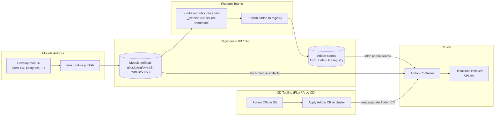
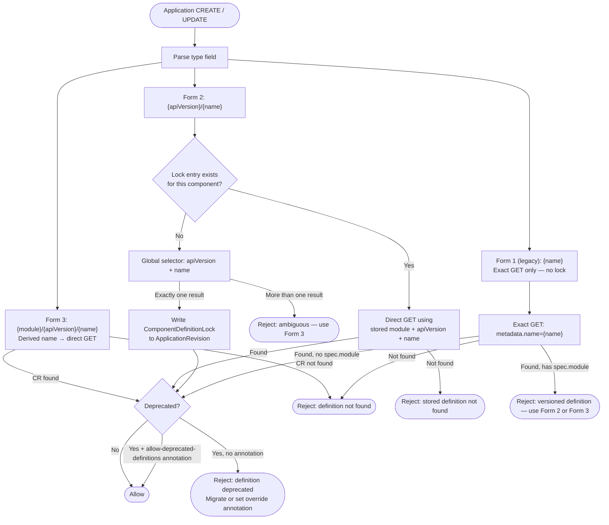
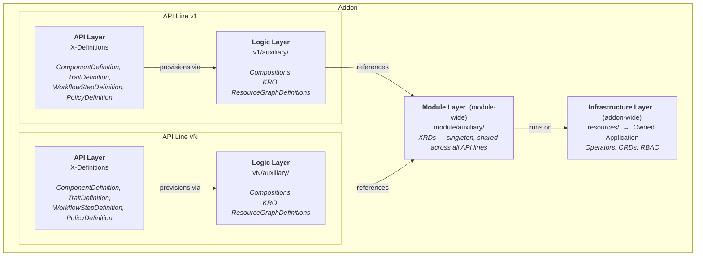
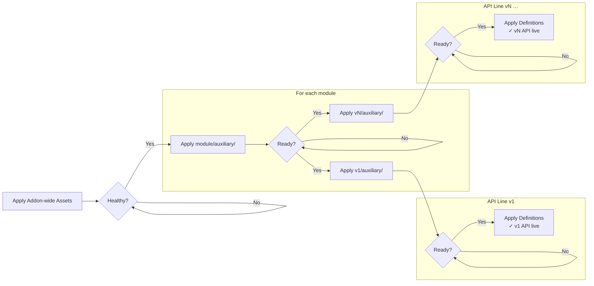
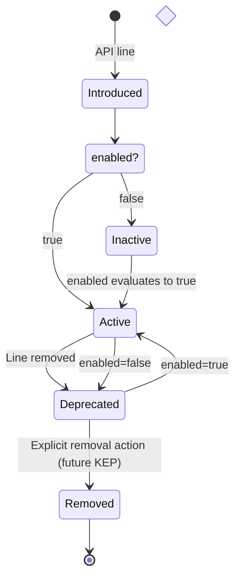
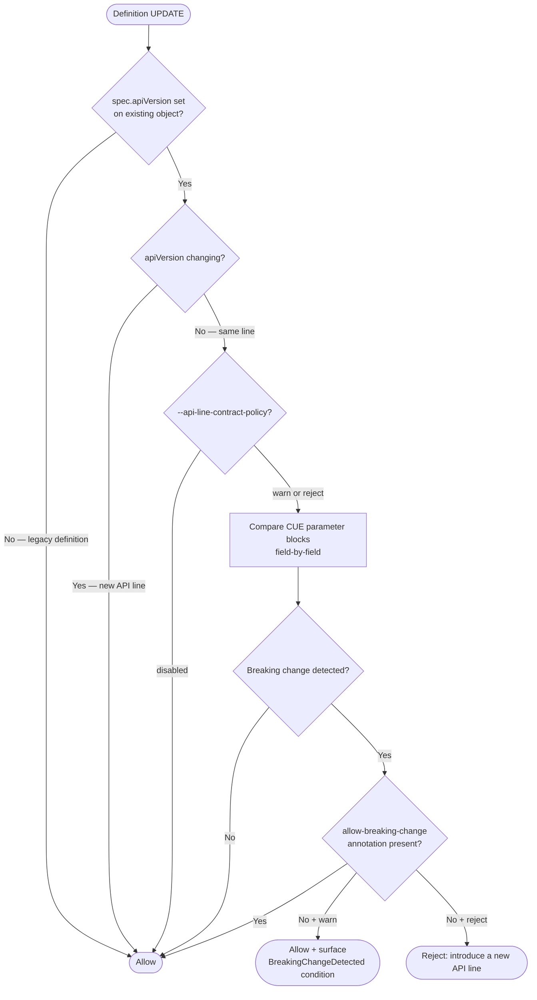

# KEP-2.20: Module & API Line Versioning

**Status:** Ready for Review
**Parent:** [vNext Roadmap](../README.md)
**Depends on:** [KEP-2.13](../2.13-addons/README.md)

This KEP covers the module identity model, API line naming convention, type reference resolution, and API line deprecation lifecycle. It is an **advanced feature** for platform teams managing versioned capability APIs across large numbers of consumers — teams that need to introduce breaking changes without immediately disrupting consumers, run `v1` and `v2` API lines simultaneously, and give consumers a migration window before old lines are removed.
I
The versioning model is implemented at the **X-Definition level** — `spec.module` and `spec.apiVersion` are fields on the definitions themselves, not on the addon. Addons are the delivery mechanism; the `modules/` directory structure is opt-in. Addons using only `definitions/` continue to work and receive the full benefit of KEP-2.13 (continuous reconciliation, drift correction, stale cleanup) without adopting this model. The declarative addon lifecycle (Addon CR, reconciliation, drift correction) is covered in [KEP-2.13](../2.13-addons/README.md).

## Problem

KubeVela Applications act as a contract between Platform Engineering teams and platform users, abstracting away underlying platform complexity. The X-Definition suite (`ComponentDefinition`, `TraitDefinition`, `WorkflowStepDefinition`, `PolicyDefinition`) is that contract — the stable surface through which users declare what they need.

But today, definitions have no stable identity model. This creates several concrete problems for teams managing capability APIs at scale:

- **Addon updates are dangerous**: Upgrading an addon replaces its definitions in place. A breaking parameter change — a renamed field, a new required property, a changed output schema — lands on every consumer immediately. There is no migration window, no coexistence period, no warning. The practical consequence is that platform teams avoid upgrading addons, or resort to appending `-v2` to definition names and treating the new version as an entirely separate resource.
- **No stable type reference**: There is no stable `type` syntax that survives addon upgrades. Applications break silently when the definitions they depend on are replaced out from under them.
- **Semver is a release concept, not an API stability concept**: Addon semver tracks which *release* shipped a definition, not whether the parameter contract remains fulfillable across upgrades. Users pin to specific addon versions as a workaround, but this is operationally fragile: definitions may not be present on freshly built clusters, may be garbage-collected, and the pin provides no guarantee against breaking parameter changes.
- **No deprecation lifecycle**: There is no mechanism to defer definition removal until Applications have migrated to a new API line. Disable removes definitions immediately, with no transition window.

The new model inverts this: the **API version** (`v1`, `v1beta1`) is the stable contract that users bind to. Module authors are expected to treat an API line as a commitment that the parameter contract remains fulfillable for its lifetime — if the contract must be broken (for example by adding a new mandatory field), that requires a new API line, not an in-place modification. The admission webhook provides optional best-effort tooling to detect obvious parameter schema violations (see API Line Parameter Schema Check), but behavioral compatibility — including template logic, output schema, and auxiliary resource changes — is the module author's responsibility and is not mechanically enforced.

## Goals

- **Make addon updates safer** — breaking changes to a definition's parameter contract should introduce a new API line, not an in-place replacement. The old line stays live until all consumers have migrated. The admission webhook can surface obvious parameter schema breakage when the `warn` or `reject` policy flag is enabled, but full behavioral compatibility (template logic, outputs, auxiliary resources) is not mechanically enforced.
- **Standardise versioned API delivery** — platform teams can publish, version, and deprecate capability APIs using the same conventions engineers already know from Kubernetes API evolution (`v1alpha1` → `v1beta1` → `v1`), replacing ad-hoc `-vN` definition name suffixes with a first-class model.
- Introduce the `module` + `apiVersion` identity model at the X-Definition level — fields on the definitions themselves, populated by the addon controller at install time
- Install definitions from module-aware addons under a stable naming convention encoding module, definition name, and API line
- Enable API line coexistence — `v1` and `v2` lines installed simultaneously, so consumers can migrate at their own pace without a flag day
- Implement context-aware line installation via CueX-evaluated `enabled` in `_version.cue`
- Implement API line deprecation and removal driven by line presence/absence in new addon versions, with blocking-reference checks enforcing that no consumer is broken silently
- Maintain full backwards compatibility with existing addons and un-versioned definitions — the module system is opt-in

## Ecosystem Overview

The following diagram shows how the actors in the ecosystem relate — from module authors publishing independent versioned artifacts, through platform teams bundling them into addons, to CD tooling and the addon controller delivering them to the cluster.



## Definition Identity — module, apiVersion, name

Two new optional fields are added to all Definition CRD specs:

```go
// Added to ComponentDefinition, TraitDefinition,
// WorkflowStepDefinition, and PolicyDefinition.

// Module is the globally unique module identifier this definition belongs to.
// Typically set by the addon controller when installing module-managed definitions,
// but may also be set manually on hand-authored definitions to opt into the module
// identity and API line versioning model.
// Absent for legacy definitions outside the module system.
// +optional
Module string `json:"module,omitempty"`

// APIVersion is the API line identifier for this definition (e.g. "v1", "v2", "v1beta1").
// Must follow the Kubernetes API stability level convention: v{N}, v{N}beta{M}, or v{N}alpha{M}.
// Validated by the admission webhook against the pattern ^v\d+(alpha\d+|beta\d+)?$
// Typically set by the addon controller when installing module-managed definitions,
// but may also be set manually on hand-authored definitions.
// Absent for legacy definitions outside the module system.
// +optional
APIVersion string `json:"apiVersion,omitempty"`
```

| Field | Example | Set by | Visible to |
|---|---|---|---|
| `spec.module` | `aws-s3` | addon controller or manual | Operators, resolution logic |
| `spec.apiVersion` | `v1` | addon controller or manual | Application authors (for `type: aws-s3/v1/bucket`) |
| `spec.version` | `v1.2.3` | addon controller | Operators (internal, not for pinning) |

`spec.version` continues to work exactly as today — it is the addon release semver stamped by the controller and used for internal versioning. Application authors should never reference it directly. `spec.apiVersion` is the user-facing stable contract identifier.

`spec.apiVersion` is validated at admission against the pattern `^v\d+(alpha\d+|beta\d+)?$` — the Kubernetes API stability level convention. Values such as `1.0`, `v1.2`, `latest`, or arbitrary strings are rejected. Valid examples: `v1`, `v2`, `v1beta1`, `v1alpha2`.

The canonical identity of a definition within the module system is the triple
`{module}/{apiVersion}/{name}`. All three fields must be present for a definition to
participate in versioned resolution — definitions missing `spec.module` or `spec.apiVersion`
are treated as non-module definitions and resolved by exact name match only. The canonical
triple is the authoritative reference used by the admission webhook, the deprecation check,
and the Application status record.

**Two independent models.** A definition is either *legacy* — no `spec.module`, no `spec.apiVersion`, resolved by exact name only — or *versioned* — both fields present, participates in the module system and canonical triple resolution. There is no partial participation: a definition missing either field is treated as legacy and is outside the module versioning system entirely. The two models do not intersect at resolution time.

> **Canonical identity:** `{module}/{apiVersion}/{name}` is the stable, fully-qualified
> identity of a definition. It is the only form that is a stable contract. Form 2
> (`apiVersion/name`) is resolved to this triple once at first admission and the result
> is stored in the definition lock; all subsequent admissions use the stored triple
> directly — the shorthand form is not re-evaluated. Form 3 encodes the triple directly
> in the type string and derives it on every admission without a lock.
>
> Within a given component reference, only the `apiVersion` component of the canonical
> triple may change between ApplicationRevisions (an explicit API line migration). The
> `module` and `name` components are fixed for the lifetime of that reference — changing
> either would alter the underlying contract entirely and requires a new component
> definition in the Application, or a deliberate migration. The admission webhook
> enforces this: a `type` change that would mutate the stored `module` or `name` is
> rejected.
>
> Platform teams and tooling SHOULD use Form 3 (which encodes the triple directly) for
> any durable reference.

## Definition Naming Convention

Definitions installed by the module system are named using the pattern:

```
{module}-{apiVersion}-{definition-name}
```

The API version sits before the definition name, reflecting the containment hierarchy: the definition belongs to an API line which belongs to a module. This also means DefinitionRevision counters (appended as `-v{N}`) are unambiguously attached to the definition name rather than the API line:

| Module | Definition | API Version | Installed Name | DefinitionRevision example |
|---|---|---|---|---|
| `aws-s3` | `bucket` | `v1` | `aws-s3-v1-bucket` | `aws-s3-v1-bucket-v3` |
| `aws-s3` | `bucket` | `v2` | `aws-s3-v2-bucket` | `aws-s3-v2-bucket-v1` |
| `aws-s3` | `encryption-policy` | `v1beta1` | `aws-s3-v1beta1-encryption-policy` | `aws-s3-v1beta1-encryption-policy-v2` |
| `postgres` | `database` | `v1` | `postgres-v1-database` | `postgres-v1-database-v1` |

If the derived name exceeds 253 characters, it is truncated and an 8-character hash suffix appended:

```
{truncated-prefix}-{8-char-hash}
```

The hash is computed over the full untruncated name — stable across reconcile cycles.

**Why not use DefinitionRevisions for coexistence?** `DefinitionRevision` tracks history within a single definition — only one revision is "current". Applications pinning `type: bucket@v5` are frozen on a historical snapshot with no maintained evolution path. API lines are different: `aws-s3-bucket-v1` and `aws-s3-bucket-v2` are two *simultaneously active, independently maintained* definitions — both receive updates, both are "current", and teams migrate between them on their own schedule. The two mechanisms are complementary: DefinitionRevisions still track the update history *within* each API line.

**Breaking change note**: This naming convention is a breaking change for tooling that hardcodes definition names. Legacy definitions (installed by addons without `_version.cue`) keep their existing names. Migration guidance must address tools that reference definition names directly.

## Definition Labels and Annotations

All module-managed definitions carry a standard label and annotation set:

**Labels** — used for fast selector-based lookups:

```yaml
labels:
  definition.oam.dev/module: aws-s3
  definition.oam.dev/api-version: v1
  definition.oam.dev/name: bucket
  addon.oam.dev/name: aws-s3
```

**Annotations** — internal metadata:

```yaml
annotations:
  addon.oam.dev/version: v1.2.3
  addon.oam.dev/managed-by: controller
  definition.oam.dev/full-name: aws-s3-v1-bucket
```

**Lifecycle annotations** (set dynamically):

```yaml
annotations:
  definition.oam.dev/deprecated: "true"
  definition.oam.dev/deprecated-at: "2026-03-24T10:00:00Z"
  definition.oam.dev/disabled: "true"    # set when enabled evaluates to false
```

## Type Reference Syntax

> **Design principle:** The API version is the stability contract. Any reference form that
> guesses or discovers the version undermines that contract — and anyone using the module
> versioning system has already opted in to caring about it. Module discovery is permitted
> (Form 2) because the module is a delivery namespace, not a contract boundary. The version
> must always be explicit.

Applications reference definitions using an extended type syntax. For a summary of which
form to use in each context, see [Recommended Usage](#recommended-usage) below.

> **Quick reference — which form to use:**
> | Goal | Form | Example |
> |---|---|---|
> | Production, GitOps, version control | Form 3 | `type: aws-s3/v1/bucket` |
> | Version known, module not pinned | Form 2 | `type: v1/bucket` |
> | Legacy hand-authored definitions | Form 1 | `type: bucket` |
>
> The rest of this section explains the parsing rules and trade-offs for each form.

```yaml
components:
  # Form 3: Fully qualified — recommended for production, GitOps, and automated pipelines.
  # Module and API version are both explicit; resolution is fully deterministic.
  - name: my-bucket
    type: aws-s3/v1/bucket

  # Form 2: Version-scoped. API version is explicit; module is discovered from cluster state
  # at first admission and stored in the lock. Use when the API version is known but
  # the module does not need to be pinned. For full determinism, use Form 3.
  - name: my-bucket
    type: v1/bucket

  # Form 1: Unqualified name only — legacy path for hand-authored definitions.
  # Supported ONLY for non-module definitions (spec.module absent): exact-name match,
  # no lock, no module system involvement.
  # ⚠️  If the matched definition has spec.module set, admission is rejected:
  #     versioned definitions must use Form 2 or Form 3.
  - name: my-bucket
    type: bucket
```

The `type` field is parsed by segment count:

| Segments | First segment | Form | Pattern | Nickname |
|---|---|---|---|---|
| 1 | — | Form 1 | `{definition-name}` | Unqualified |
| 2 | matches `^v\d+` | Form 2 | `{apiVersion}/{definition-name}` | Version-scoped |
| 3 | — | Form 3 | `{module}/{apiVersion}/{definition-name}` | Fully qualified |

**Form 2** (`{apiVersion}/{definition-name}`, e.g. `v1/bucket`): the API version is
explicit, but the module is discovered from cluster state at first admission. The webhook
performs a global label selector (`definition.oam.dev/api-version={apiVersion},
definition.oam.dev/name={name}`) across all installed modules. If exactly one result is
found, its module is stored in the lock and the reference is accepted. If more than one
result is found — that is, two or more modules both provide the same definition name at
the same API version — the reference is rejected with an ambiguity error; the author must
use Form 3 to specify the module explicitly. Once locked, the stored canonical triple is
used for all subsequent admissions — no lookup of any kind occurs. Use Form 2 when the
API version is known but the module does not need to be pinned. Use Form 3 when both must
be fully deterministic from the moment the manifest is written.

The order mirrors both the installed name convention (`{module}-{apiVersion}-{definition-name}`)
and the Kubernetes API URL structure (`/apis/{group}/{version}/{resource}`). There is no
separate `module` field on the component — module scoping is expressed entirely within `type`.

**Form 3 is the canonical reference form.** Forms 1 and 2 are resolved to the canonical
triple `{module}/{apiVersion}/{name}` once at first admission. The resolved triple is
stored in the **definition lock**; all subsequent admissions use the stored triple
directly via a deterministic GET — the shorthand form is not re-evaluated. Form 3 is
the required form for any manifest that will be stored in version control, shared across
clusters, or applied by an automated pipeline, because it encodes the canonical triple
directly without a resolution step.

**Choosing a form:**

| Scenario | Recommended form |
|---|---|
| Production manifest, GitOps repo, automated pipeline | **Form 3** (`module/apiVersion/name`) |
| API version known, module not pinned | Form 2 (`apiVersion/name`) — module discovered but version explicit |
| Legacy un-versioned (hand-authored) definition | Form 1 (`name`) — exact-name match, no dynamic resolution (non-module path only) |
| New module-backed definition | Form 2 or Form 3 — Form 1 is rejected for module-backed definitions |

**Form 2 defers module discovery only — the version is explicit and is the contract.**
On first admission, the module is discovered from cluster state and locked. After that,
the stored canonical triple is used directly; nothing is re-evaluated. Form 2 is not
portable across fresh clusters until a lock exists — use Form 3 for GitOps.

**Form 1 is for non-module definitions only.** No version is involved; resolution is a
direct name lookup. If the matched definition has `spec.module` set, admission is rejected.

Only Form 3 — which encodes the full canonical triple in the type string — requires no
cluster state at any point and is safe from the moment it is written.

### Resolution Rules

All resolution is performed at admission time. Resolution is normalisation: the admission
webhook resolves the type reference to the canonical triple `{module}/{apiVersion}/{name}`
before any downstream operation. For Form 2, the resolved triple is written to the
`ApplicationRevision` lock — the status record is derived from that. For Form 3, the
triple is derived directly from the type string with no lookup. For non-module definitions
(no `spec.module`), only exact-name matching applies and no canonical triple is produced —
those definitions are outside the module versioning system entirely.

The three rules that govern all versioned resolution:

1. **Version is always explicit.** There is no version inference or fallback. A type string without an explicit `apiVersion` segment is not a versioned reference.
2. **Module is required when ambiguous.** If a global selector on `(apiVersion, name)` returns more than one result, the reference is rejected. The author must supply the module (Form 3).
3. **Ambiguity is always a hard failure.** There is no "pick the best" fallback, no stability ranking used for selection, and no implicit default. Exactly one candidate must exist.

> **Ambiguity invariant:** see rules 1–3 above. The short version: version always explicit,
> module required when ambiguous, ambiguity always fails hard.

Form selection is determined solely by parsing the `type` string — segment count and
first-segment pattern. There is no fallback between forms: a type string is resolved as
its parsed form or rejected; it does not silently fall back to another form's resolution.

**Resolution priority order:**

Each form follows a strict priority sequence. Steps are evaluated in order; once a step
succeeds or definitively fails, no later step is reached.

**Form 3** (`{module}/{apiVersion}/{definition-name}`):
1. Derive CR name from naming convention → direct GET → accept or reject.

**Form 2** (`{apiVersion}/{definition-name}`):
1. Stored lock present → direct GET on (stored-module, apiVersion, name) → accept or reject. No fallback.
2. No stored lock → global selector (`definition.oam.dev/api-version={apiVersion}, definition.oam.dev/name={name}`)
   → if more than one result: reject with ambiguity error (use Form 3); exactly one: store lock → accept.

**Form 1** (`{definition-name}`):
1. Exact-name GET (`metadata.name = name`):
   - Found, `spec.module` absent → legacy path: accept, no lock written.
   - Found, `spec.module` present → **reject**: this is a versioned definition; use Form 2 or Form 3.
   - Not found → reject: definition not found.

Form 1 never writes a definition lock. It operates entirely outside the module versioning system.

No fallback exists between forms.

**Form 3 — fully qualified** (`{module}/{apiVersion}/{definition-name}`):
The controller derives the exact CR name using the naming convention
(`{module}-{apiVersion}-{definition-name}`, with truncation+hash if needed) and performs a
direct `GET`. No selector query. Ambiguity is impossible — the name is deterministic. If
the computed CR does not exist, admission is rejected.

**Form 1 — legacy path** (`{definition-name}`):
Performs a direct exact-name GET (`metadata.name = {name}`). No selector. No lock.
- Found, `spec.module` **absent**: the definition is outside the module system — accept,
  no lock written.
- Found, `spec.module` **present**: the definition is versioned; Form 1 cannot address it.
  Reject: use Form 2 (`apiVersion/name`) or Form 3 (`module/apiVersion/name`).
- Not found: reject — definition not found.

Form 1 is the unchanged pre-module resolution path. It has no knowledge of modules,
API lines, or the canonical triple, and does not interact with the definition lock.

> **Legacy priority is unconditional.** Because legacy authors have no syntax available to
> disambiguate — `type: bucket` is already maximally specific for a non-module definition —
> the exact-name GET must resolve before any other check. Installing a module definition
> with label `definition.oam.dev/name=bucket` does **not** shadow an existing non-module
> definition named `bucket`. Platform teams introducing module definitions for a name that
> was previously served by a legacy definition must be aware that the legacy definition
> continues to win for Form 1 references until it is removed.

**API version stability ordering:** Stability class takes absolute precedence over version
number. This ordering is relevant for the deprecation lifecycle — it is not used to
implicitly select among multiple candidates (the ambiguity invariant means any resolver
that encounters more than one candidate rejects rather than ranks). The ordering, highest first:

1. `vN` — stable, N descending (`v2` > `v1`)
2. `vNbetaM` — beta, N descending, M descending (`v2beta1` > `v1beta2` > `v1beta1`)
3. `vNalphaM` — alpha, N descending, M descending (`v2alpha1` > `v1alpha2`)

This means `v1` (stable) always ranks above `v2beta1` (beta), which always ranks above
`v3alpha1` (alpha), regardless of the version number. A `v2alpha1` line installed alongside
a `v1` stable line does **not** shadow the stable line — they are distinct API lines and
an author must explicitly choose which one to reference. This follows the
[Kubernetes API versioning convention](https://kubernetes.io/docs/reference/using-api/#api-versioning), not semver.



### Resolution Stability Summary

| Form | Module | API version | Production use |
|------|---|---|---|
| **3** `aws-s3/v1/bucket` | Explicit + pinned | Explicit + pinned | ✅ Recommended — fully deterministic from first admission |
| **2** `v1/bucket` | Discovered; sticky after first admission | Explicit + pinned | ⚠️ Version pinned, module discovered — use Form 3 for full determinism |
| **1** `bucket` | None | None — outside module system | ✅ Legacy path — exact-name match for non-module definitions only |

> **Note:** If the matched definition has `spec.module` set, admission is rejected — Form 1 cannot address versioned definitions. This is not a Form 1 failure mode; it is a model mismatch.

**Definition lock** is the one-time resolution record for shorthand forms. The lifecycle
is: **input → resolve once → store canonical triple → reuse directly**. At first
admission of a Form 2 reference, the webhook runs the selector, resolves the module, and
stores the canonical triple `{module}/{apiVersion}/{name}` as a `ComponentDefinitionLock`
entry in `ApplicationRevision` — the authoritative source of truth.
`.status.services[i].resolvedDefinition` is a read-only projection for human readability.
On every subsequent admission, the webhook reads the stored triple and performs a direct
GET — the shorthand form is ignored. The selector never runs again for that component.
Publishing a new API line does not affect any Application with a stored lock.

Form 2 is therefore **not safe for fresh-cluster GitOps**: a manifest applied to a cluster
with no pre-existing lock depends on cluster state at first admission to resolve the
module. Form 3 requires no resolution step and is safe from the moment it is written.

**To upgrade to a new API line**, the Application author must explicitly update `type` to
Form 3 with the new version (e.g. `type: aws-s3/v2/bucket`). The webhook detects the
changed `type` string and resolves the new canonical triple directly from the Form 3 name
(no selector, no lock). Any stale lock entry from a prior Form 2 admission is superseded —
Form 3 derives the triple on every admission and does not consult or write a lock. There
is no implicit upgrade path — any spec change that does not also change the `type` string
continues to resolve using the stored lock (for Form 2) or the type string itself (for
Form 3).

**To clear the definition lock** (force re-resolution from current cluster state), a
platform operator may remove the relevant `ComponentDefinitionLock` entry from the
`ApplicationRevision`. The `.status.services[i].resolvedDefinition` projection will
reflect the cleared state on the next status sync. The next apply will re-run the selector
and store a new lock. If a new matching API line has been published since the original lock
was set, the Application will resolve to it (subject to the ambiguity invariant).

**Lock staleness — failure mode and recovery:** If the module that owns a stored lock is
uninstalled, re-applying the Application will fail at the direct-GET step ("stored
definition not found") — even if a definition with the same name exists under a different
module or as a legacy definition. The stored canonical triple is treated as authoritative; no fallback or re-resolution
occurs. This is intentional: silent re-resolution after a module uninstall would be a
silent contract change, which the module system is designed to prevent.

The admission error in this case is:

```
Error: component "my-bucket" has a stored definition lock for "aws-s3-v1-bucket"
but that definition no longer exists. Update `type` to Form 3 with the replacement
definition, or remove the ComponentDefinitionLock entry from the ApplicationRevision
to force re-resolution.
```

Recovery — two options:

- **Update `type` to Form 3** (`{module}/{apiVersion}/{name}` of the replacement
  definition): the webhook detects the changed type string and resolves directly from the
  Form 3 name — no lock consulted, no lock written. Any stale Form 2 lock entry for the
  component is superseded and should be removed from the `ApplicationRevision` to keep
  the record clean, but it does not block admission. No manual status editing required.
  Use this when you know exactly which definition should replace the stale one.

- **Clear the lock manually**: remove the `ComponentDefinitionLock` entry for the affected
  component from the `ApplicationRevision`. Identify the revision name from
  `Application.status.latestRevision`, then remove the matching entry by component name.

  ```bash
  # Find the current ApplicationRevision name
  kubectl get application <app-name> -o jsonpath='{.status.latestRevision.name}'

  # Remove the lock entry for the affected component
  kubectl patch applicationrevision <revision-name> --type=json \
    -p='[{"op":"remove","path":"/spec/definitionLocks/<i>"}]'
  ```

  On the next apply, resolution restarts from the form's initial lookup step (fresh selector
  for Form 2) and stores a new lock based on current cluster state. Use this when you want
  re-resolution to pick the available definition automatically (e.g. after installing a
  replacement module).

**Adding a new API line (v1 → v2 coexistence):** When a `v2` API line is added to an
existing module, both `aws-s3-v1-bucket` and `aws-s3-v2-bucket` are installed
simultaneously. Applications with a stored lock continue to resolve to `v1` indefinitely —
neither the addon upgrade nor any unrelated spec change causes re-resolution. To migrate
to `v2`, the author must change `type` to `aws-s3/v2/bucket` (Form 3). The `v1` line
remains active until explicitly deprecated and removed.

## Recommended Usage

The guidance below summarises the most important usage rules for consumers and module
authors. The single most impactful rule: **use Form 3 (`module/apiVersion/name`) for any
manifest that will be stored in version control, applied by a GitOps agent, or shared
across clusters.** Form 2 (`apiVersion/name`) is a convenience for interactive and
exploratory use — it resolves against cluster state at first admission and is not
reproducible across environments until a lock is stored. Within a given API line,
treat the parameter contract as stable: do not make breaking changes in place; introduce a
new API line instead. The subsections below expand on each rule.

### Use Form 3 for production and GitOps

`type: aws-s3/v1/bucket` is the only form that is fully deterministic from the moment the
manifest is written. The CR name is derived without any cluster state lookup — the same
manifest resolves identically on any cluster where the definition is installed. Use Form 3
for:

- Applications managed by Flux, Argo CD, or any GitOps agent
- Manifests stored in version control
- Automated pipelines and CI/CD-generated Applications
- Any context where an unexpected version change would be a production incident

### Use Form 1 for legacy definitions only

Form 1 (`type: bucket`) is the legacy resolution path. It is the correct form for
hand-authored definitions that do not participate in the module system — those with no
`spec.module` field.

The choice between Form 1 and Forms 2/3 is not a syntax preference — it is determined by
the definition itself. If a definition has `spec.module` set, it is a versioned definition
and Form 1 cannot address it; the webhook rejects the reference and the author must use
Form 2 or Form 3. If a definition has no `spec.module`, it is a legacy definition and
Form 1 is the only applicable path — Forms 2 and 3 do not apply to it.

These two models do not overlap. Migrating a hand-authored definition into the module
system requires setting `spec.module` and `spec.apiVersion` on the definition and updating
all Application references to Form 2 or Form 3. That is a deliberate migration, not a
transparent upgrade.

### Treat API lines as stable contracts

An API line (`v1`, `v2`) is a convention — and where the schema check is enabled, a
partially enforced rule — that the parameter contract remains fulfillable for the lifetime
of that line. Do not make breaking changes within a line; introduce a new line instead.
The admission webhook can detect obvious parameter schema violations when
`--api-line-contract-policy=warn` or `reject` is set, but template body changes, output
schema changes, and auxiliary resource changes are outside the scope of static schema
comparison and are the module author's responsibility to manage safely. Consumers who have
pinned to `v1` via Form 3 are isolated from `v2` until they explicitly migrate.

### Do not rely on implicit re-resolution

The definition lock (stored in `ApplicationRevision.spec.definitionLocks`, projected
read-only to `.status.services[i].resolvedDefinition`) binds the component to the
resolved canonical triple after first admission. Nothing changes it implicitly — not a
new API line being published, not an unrelated spec change. To change the resolved
version, the `type` field must be explicitly updated to Form 3 with the new version.
The `module` and `name` components of the stored triple cannot be changed in place —
doing so would alter the underlying contract of the reference, not merely migrate it.
This is intentional: implicit contract changes are the problem the module system is
designed to prevent.

### Migrating between API lines

Perform the migration in two explicit steps:

```yaml
# Step 1: Ensure you are on Form 3 at the current version.
#         If you were using Form 2 (type: v1/bucket), this makes the module explicit in
#         the type string. The component now resolves directly from the Form 3 name — no
#         selector. Lock updated to canonical triple {aws-s3, v1, bucket}.
type: aws-s3/v1/bucket

# Step 2: Migrate to the new API line — explicit, reviewable in a pull request.
#         The webhook resolves directly to aws-s3-v2-bucket (no selector). Lock updated
#         to the new canonical triple {aws-s3, v2, bucket}. The v1 line is unchanged.
type: aws-s3/v2/bucket
```

Separating the steps makes each change independently reviewable. The old `v1` line remains
available for any consumers that have not yet migrated.

## Module Structure in Addon Source Tree

The addon controller scans `modules/` for `_module.cue` files to discover modules, then looks for `_version.cue` in subdirectories to discover API lines. The full addon controller reconciliation loop — source resolution, drift correction, owned Application management — is covered in [KEP-2.13](../2.13-addons/README.md). This section describes only the module source tree layout that KEP-2.13's controller consumes.

There are two ways to include modules in an addon source tree: **inline** (definitions authored directly in the addon) and **imported** (definitions fetched from a published OCI or Git artifact at reconcile time). Both can coexist in the same addon.

### Inline Modules

Modules authored directly inside the addon source tree. The controller discovers them by scanning for `_module.cue` files under `modules/`:

```
my-addon/
  metadata.cue
  template.cue
  resources/                # Tier 1: addon infrastructure; compiled into owned Application
  definitions/              # legacy path; still supported with deprecation warning
  modules/
    aws-s3/
      _module.cue           # module identity
      auxiliary/            # Tier 2: module-wide auxiliary (XRDs — singleton, shared across API lines)
      v1/
        _version.cue        # API line v1 metadata
        bucket.cue
        encryption-policy.cue
        auxiliary/          # Tier 3: API-line auxiliary (Compositions, KRO ResourceGraphDefinitions)
      v2/
        _version.cue        # API line v2 metadata
        bucket.cue
        auxiliary/
    postgres/
      _module.cue
      auxiliary/            # Tier 2: module-wide auxiliary (XRD)
      v1/
        _version.cue
        database.cue
        auxiliary/          # Tier 3: API-line auxiliary (Composition for v1)
```

### Imported Modules — `_imports.cue`

> **Status: Proposal — to be validated during implementation**

For addons that bundle independently published modules rather than authoring definitions inline, a single `modules/_imports.cue` file replaces the per-module directory tree. The controller detects the presence of `_imports.cue` and resolves each entry from its declared source at reconcile time.

```
my-addon/
  metadata.cue
  template.cue
  modules/
    _imports.cue            # all external module references declared here
```

```cue
// modules/_imports.cue
imports: [
    {
        module:  "aws-s3"
        enabled: true        // AND-ed with the fetched module's own _module.cue enabled
        sources: [
            {
                oci:      { ref: "ghcr.io/org/aws-s3-module", version: "~1.0.0" }
                versions: ["v1", "v1beta1"]   // API lines to install from this artifact
            },
            {
                oci:      { ref: "ghcr.io/org/aws-s3-module", version: "~2.0.0" }
                versions: ["v2"]
            },
        ]
    },
    {
        module:  "postgres"
        enabled: true
        sources: [
            {
                oci:      { ref: "ghcr.io/org/postgres-module", version: "~1.0.0" }
                // no versions filter — installs all API lines present in the artifact
            },
        ]
    },
    {
        module:  "microservice"   // DefKit module — apiLine assigned at import time
        sources: [
            { oci: { ref: "ghcr.io/org/microservice-module", version: "~1.0.0" }, apiLine: "v1" },
        ]
    },
]
```

**`sources` fields:**

| Field | Type | Description |
|-------|------|-------------|
| `registry` | string | Named addon registry (configured in KubeVela). The module name is resolved within this registry. Preferred over raw `oci`/`git` refs — registry configuration is the single source of truth for artifact locations. |
| `oci` | object | Raw OCI artifact reference (`ref` + `version` semver range). Use when the module lives outside a configured registry. |
| `git` | object | Raw Git repository reference (`url` + `version` branch/tag/semver range). Use when the module lives outside a configured registry. |
| `version` | string | Semver range for the module artifact. Used with `registry` — the registry resolves the range against its index. |
| `versions` | `[string]` | API lines to install from this artifact. If absent, all lines are installed. Only applies to CUE modules. |
| `apiLine` | string | Assigns an API line identifier to all definitions from a DefKit artifact. Mutually exclusive with `versions`. See DefKit note above. |

**Registry resolution — preferred source form:** When modules are published to a configured KubeVela addon registry, the `registry` + `version` form is preferred over raw `oci`/`git` refs. The full artifact URL is an infrastructure detail that belongs in registry configuration — not repeated across every `_imports.cue`. This also means migrating to a different registry (e.g. from Artifactory to GHCR) requires no changes to any addon source files.

```cue
// Preferred — registry-resolved
sources: [
    { registry: "oam-modules", version: "~1.0.0", versions: ["v1"] },
]

// Explicit — raw OCI ref (use when module is outside a configured registry)
sources: [
    { oci: { ref: "ghcr.io/myorg/aws-s3-module", version: "~1.0.0" }, versions: ["v1"] },
]
```

**`versions` default — all lines:** Omitting `versions` is intentional shorthand for "install all API lines present in the artifact". Addon authors should specify `versions` explicitly when they want to restrict which lines are exposed — for example, to hold back a `v2` line until consumers have been notified. The absence of `versions` is not an error and produces no warning.

**`enabled` AND semantics:** The `enabled` field on an import entry is AND-ed with the `enabled` expression in the fetched module's own `_module.cue`. The module is installed only if both evaluate to true. The controller records the source of the gate (`addon` or `module`) in the Addon CR status when a module is skipped.

**CueX evaluation:** `_imports.cue` is evaluated as a CueX expression with the same full context contract as `_module.cue` and `_version.cue` — `parameter.*`, `context.*`, and controller-injected fields (`context.addonName`, `context.addonVersion`) are all available. This means import entries, `enabled` expressions, and `sources` fields can all reference cluster context at reconcile time.

A practical example — rolling out a new `v2alpha1` API line to a single region for initial testing before broader promotion:

```cue
// modules/_imports.cue
imports: [
    {
        module:  "aws-s3"
        enabled: true
        sources: [
            {
                // v1 ships everywhere
                oci:      { ref: "artifactory.guidewire.com/atmos-helm-release/modules/aws-s3", version: "~1.0.0" }
                versions: ["v1"]
            },
            {
                // v2alpha1 only installs in us-east-1 for initial rollout
                oci:      { ref: "artifactory.guidewire.com/atmos-helm-release/modules/aws-s3", version: "~2.0.0-alpha" }
                versions: ["v2alpha1"]
                enabled:  context.region == "us-east-1"
            },
        ]
    },
]
```

When `context.region` is not `us-east-1` the second source entry is skipped entirely — no `v2alpha1` definitions are applied, no auxiliary resources fetched. The Addon CR status records which source entries were skipped and why. Once testing is complete the `enabled` constraint is removed and the line promotes to all regions on the next reconcile.

**Inline and imported modules may coexist** in the same addon — `_imports.cue` is processed alongside any inline `_module.cue` directories present under `modules/`.

### Three-Tier Resource Model

The addon source tree supports three categories of deployable resources with distinct semantics and installation ordering. Together with the definitions they back, they form four conceptual layers:



The scoping hierarchy: Infrastructure (`resources/`) is **addon-wide**. Module auxiliary (`module/auxiliary/`) is **module-wide** — shared across all API lines within a module. Logic (`v{N}/auxiliary/`) and API (Definitions) are **per API line** — each line carries its own compositions and definitions, allowing v1 and v2 to have independent contracts and backing logic.

**Tier 1 — Addon Application resources (`resources/`)**

The top-level `resources/` directory contains version-agnostic infrastructure the addon as a whole requires. These files are compiled into the addon's owned Application CR and support the full OAM workflow model — ordered component deployment, health gates, workflow steps, and conditions. Typical contents: operator deployments (Crossplane, KRO, cert-manager), CRDs, RBAC.

> **Note:** `resources/` components use built-in KubeVela types to install infrastructure — they do not reference module definitions from the same addon, since definitions are the API *to* those resources, not the mechanism that installs them. If an addon needs to consume another addon's definitions, that is expressed through addon-of-addons composition (see KEP-2.13) rather than within a single addon's `resources/`.

**Tier 2 — Module-wide auxiliary resources (`module/auxiliary/`)**

Each module may contain a top-level `auxiliary/` directory for resources that are shared across all API lines within that module. The primary use case is the Crossplane `CompositeResourceDefinition` (XRD) — a singleton resource that spans all versions and must exist before any API-line Composition referencing it is applied.

> **Crossplane note:** A single XRD serves multiple Composition versions (v1alpha1, v1beta1, etc.) by listing all served versions internally. The XRD cannot be split per API line — Crossplane does not support multiple XRDs for the same resource type. The module-level `auxiliary/` directory is the correct home for this singleton. When transitioning to KRO, the XRD in `module/auxiliary/` disappears entirely — each API line's `ResourceGraphDefinition` is self-contained and owns its own schema and version, making module-level auxiliary unnecessary for KRO-based modules.

**Tier 3 — API-line auxiliary resources (`v{N}/auxiliary/`)**

Each API line may contain an `auxiliary/` directory with resources specific to that line's contract — the logic layer that definitions in the line depend on at runtime. Typical contents: versioned Crossplane `Composition` objects (referencing the module-level XRD at their specific version), or KRO `ResourceGraphDefinition` resources (self-contained, no module-level XRD needed).

Auxiliary resources at both Tier 2 and Tier 3 are intentionally simpler than Tier 1: they are YAML manifests or CUE templates (for parameter-driven generation) and do not support OAM workflow steps. They are applied by the addon controller via server-side apply.

**Installation ordering**

Definitions are applied last — they are the go-live gate that signals the API is open for business:



1. Apply addon-wide assets (no health dependency):
   - Create/update owned Application from top-level `resources/`
   - Apply `ConfigTemplate` resources
   - Apply VelaQL `View` resources
   - Apply UI `Schema` resources
2. Wait for owned Application → Healthy
3. For each module, apply module-wide auxiliary (`module/auxiliary/`) — e.g. Crossplane XRD
4. Wait for module auxiliary → Ready
5. For each enabled API line (in parallel):
   - Apply `v{N}/auxiliary/` resources (e.g. Crossplane Composition)
   - Wait for auxiliary resources → Ready
   - Apply definitions (`ComponentDefinition`, `TraitDefinition`, etc.) — go-live gate

This ordering has three important guarantees:

- **Infrastructure-before-logic**: Crossplane Compositions and XRDs are never applied before the Crossplane CRDs exist. Applying them before the operator is running fails immediately; the Application health gate prevents that.
- **Schema-before-implementation**: Crossplane XRDs (module-level) are always applied and ready before any Composition (API-line-level) referencing them. A Composition applied before its XRD is registered fails immediately.
- **Logic-before-API**: Definitions are never visible to Application authors until the compositions backing them are ready. Without this, a user who writes `type: aws-s3/v1/bucket` immediately after an addon install will get a reconciliation failure from a missing Composition rather than a working bucket. Definitions land only once the full stack beneath them is operational.

On upgrade the same ordering applies — updated definitions land only after updated auxiliary resources are ready, preventing a window where the old definition renders against a new incompatible composition.

If the owned Application does not reach Healthy, auxiliary resources and definitions are not applied and the Addon CR transitions to `Failed` with a condition identifying the blocking Application component. If auxiliary resources do not reach Ready, definitions are withheld and the condition identifies the unready resource.

**Auxiliary resource content**

Auxiliary files are plain YAML (`.yaml`) or CUE (`.cue`). CUE files in `auxiliary/` — at both module level and API-line level — are evaluated with the **full addon context** before being applied. This is the same context available to `_version.cue` and `_module.cue`:

- `parameter.*` — all addon parameters and their current values
- `context.apiVersion` — the API line version (API-line auxiliary only)
- `context.provider`, `context.region`, and all other cluster context values from `Config` resources
- `context.addonName`, `context.addonVersion` — controller-injected addon identity fields

This means module authors can use parameter guards in auxiliary CUE to conditionally configure resources — for example, controlling which XRD versions are served based on addon parameters, or parameterising a Composition's region or account ID from `parameter.region`. Auxiliary CUE has the same expressive power as `_version.cue` for conditional logic.

```yaml
# modules/aws-s3/auxiliary/xrd.yaml  ← module-wide singleton
apiVersion: apiextensions.crossplane.io/v1
kind: CompositeResourceDefinition
metadata:
  name: xbuckets.s3.aws.example.com
spec:
  versions:
    - name: v1alpha1
      served: true
      referenceable: true
  # ...

# modules/aws-s3/v1alpha1/auxiliary/composition.yaml  ← API-line specific
apiVersion: apiextensions.crossplane.io/v1
kind: Composition
metadata:
  name: aws-s3-v1alpha1-bucket
spec:
  # ...
```

The `AddonInclude` type in KEP-2.13 includes separate `auxiliary` categories for both module-wide and API-line auxiliary resources alongside `resources`, `definitions`, `configTemplates`, and `views` — allowing addon composition scenarios to install auxiliary resources independently of top-level Application resources.

## _module.cue Fields

```cue
// modules/aws-s3/_module.cue (CUE source module)
module:  "aws-s3"
type:    "cue"      // "cue" (default) | "defkit"
version: "1.0.0"   // semver tag; authoritative version for vela module publish

// enabled is evaluated by CueX at reconcile time with injected cluster context.
// Defaults to true if absent. If false, the entire module is skipped — no
// auxiliary resources, no API lines, no definitions are installed.
// Supports the same CueX expressions as _version.cue enabled.
enabled: context.provider == "aws"  // or simply: true

// metadata carries structured internal fields for organisational tooling.
// Typed and queryable — used by CI/CD, ownership registries, cost allocation.
// The Dependencies field from legacy metadata.cue is omitted — dependency
// ordering is now structural (module auxiliary/ before api-line definitions/).
metadata: {
    departmentCode: 275
    maintainedBy:   "pod-ajanta"
    createdBy:      "sgopalani"
    stage:          "release"  // "alpha" | "beta" | "release"
}

// labels are arbitrary string key-value pairs stamped onto installed resources
// alongside standard addon controller labels. Namespaced by domain to avoid
// collisions. Consumed by external tooling; the addon controller passes them
// through without interpretation.
labels: {
    "gwcp.guidewire.com/maintained-by": "pod-ajanta"
    "gwcp.guidewire.com/created-by":    "sgopalani"
    "gwcp.guidewire.com/stage":         "release"
    "gwcp.guidewire.com/dept":          "275"
}
```

`type: "defkit"` signals that the module was authored in Go and compiled to CUE at publish time. The source artifact for each API line is declared in `_version.cue` — see below.

> **DefKit and API line versioning — implementation investigation required**
>
> DefKit compiles to a flat set of definitions without the `v1/`, `v2/` API line structure. DefKit modules therefore cannot natively express API lines or participate in the `_version.cue` enabled/coexistence model.
>
> A proposed compatibility model for addon imports: the `_imports.cue` `sources` entry carries an `apiLine` field that the controller stamps as `spec.apiVersion` onto all definitions fetched from that artifact. This allows addon authors to assign and evolve API lines at the import layer without changes to DefKit:
>
> ```cue
> // _imports.cue — DefKit module with addon-assigned API line
> imports: [
>     {
>         module: "microservice"
>         sources: [
>             { oci: { ref: "ghcr.io/org/microservice-module", version: "~1.0.0" }, apiLine: "v1" },
>             { oci: { ref: "ghcr.io/org/microservice-module", version: "~2.0.0" }, apiLine: "v2" },
>         ]
>     },
> ]
> ```
>
> Two artifacts with different `apiLine` values gives coexistence without DefKit encoding API lines natively. Whether this is sufficient or whether DefKit needs first-class API line support is **to be investigated during implementation**. DefKit enhancements will be considered if the import-layer model proves insufficient.`

`version` is the module's own semver tag, independent of the addon version. It is read by `vela module publish` to determine the registry tag — no `--version` flag needed in the common case. It is also used by `vela module validate --check-breaking` to identify which previously-published artifact to compare against.

`enabled` is evaluated at reconcile time — the entire module (auxiliary, API lines, definitions) is skipped if it evaluates to false. This is the module-level equivalent of `_version.cue`'s `enabled` field. Disabling a module is cleaner than disabling every API line individually.

`metadata` carries structured internal organisational fields. Unlike `labels`, these are typed CUE values queryable by internal tooling. The `Dependencies` field from the legacy `metadata.cue` format is intentionally absent — inter-module dependency ordering is now expressed structurally through the three-tier resource model rather than declared as metadata.

`labels` are pass-through string key-value pairs for external tooling — CI/CD systems, ownership registries, cost allocation. The addon controller stamps them onto installed resources alongside the standard addon labels.

### `instance` — Multi-Instance Addons

> **Deferred.** Multi-instance addon support (the `instance` field and its implications for definition scoping, namespace isolation, and deduplication) is out of scope for this KEP and will be addressed in a dedicated follow-on KEP. The `instance` field is reserved in `_module.cue` but not implemented in the initial delivery.

## _version.cue Fields

```cue
// modules/aws-s3/v1/_version.cue

// apiVersion is the user-facing API line identifier.
apiVersion: "v1"

// enabled is evaluated by CueX at reconcile time with injected cluster context.
// Defaults to true if absent.
enabled: context.provider == "aws"

// minKubeVelaVersion enforces a minimum version constraint (semver >=).
// Line surfaces as Disabled if constraint is not met.
// Pre-release KubeVela versions (e.g. v1.11.0-rc.1) have their pre-release
// suffix stripped before comparison — v1.11.0-rc.1 satisfies minKubeVelaVersion: "v1.11.0".
minKubeVelaVersion: "v1.11.0"

// source specifies where the controller fetches the compiled definitions and
// auxiliary resources for this API line. Required for DefKit modules; optional
// for CUE modules whose files are inline in the addon source tree.
// Accepts an OCI registry reference or a Git repository.
// Both forms accept an exact tag or a semver range.
source: {
    oci: {
        ref:     "ghcr.io/myorg/aws-s3-module"
        version: "~1.5.0"   // patch-compatible range: >=1.5.0 <1.6.0 — resolved to highest matching tag at reconcile
    }
}
// Wider minor range (allows all 1.x updates up to 2.0 — use with care):
// source: { oci: { ref: "ghcr.io/myorg/aws-s3-module", version: ">=1.5.0 <2.0.0" } }
//
// Exact pin (fully deterministic — no implicit updates):
// source: { oci: "ghcr.io/myorg/aws-s3-module:v1.5.2" }
//
// Git with patch-compatible range:
// source: {
//     git: {
//         url:     "https://github.com/myorg/aws-s3-module.git"
//         version: "~1.5.0"   // patch-compatible range: >=1.5.0 <1.6.0
//     }
// }
//
// The `~` (patch-compatible) range is recommended for production _version.cue files.
// It permits patch-level fixes without operator intervention while requiring an explicit
// file edit to accept a new minor version. Exact pins are appropriate for environments
// where any unreviewed update is unacceptable.
```

Each API line declares its own `source`, allowing v1 and v2 to ship from independent artifacts with decoupled release cycles. If `source` is absent, the controller expects the definition `.cue` files to be present inline in the addon source tree alongside `_version.cue`.

When a semver range is specified, the addon controller resolves it against the registry at each reconcile cycle and fetches the highest matching version. The resolved concrete tag is recorded in `AddonModuleLineStatus.resolvedSourceVersion` — see the API Changes section. This means a module author can publish patch releases independently and addons that declare a compatible range will pick them up automatically, without an addon rollout.

## Cluster Context

Module expressions in `_version.cue` (such as `enabled`) can reference platform-supplied context values via `context.*`. Context values are supplied by the platform team through labelled `Config` resources — a single query serves all addons with no per-module I/O.

> **Cross-KEP note:** The `cluster-context-schema` ConfigTemplate and `Config`-based context mechanism described here is consistent with the cluster metadata model proposed in the Cluster Infrastructure KEP. As that KEP matures, the `ClusterController` may auto-populate the standard `cluster-context` Config from `Cluster` CR status, removing the need for manual maintenance of well-known fields.

### Built-in ConfigTemplate

KubeVela ships a built-in `ConfigTemplate` named `cluster-context-schema`. It defines well-known fields that addon authors can rely on, plus an open extension for any additional primitive values platform teams need:

```yaml
# Built-in ConfigTemplate (ships with KubeVela core)
apiVersion: core.oam.dev/v1alpha1
kind: ConfigTemplate
metadata:
  name: cluster-context-schema
  namespace: vela-system
spec:
  schema: |
    // provider: cloud provider identifier ("aws" | "gcp" | "azure" | "bare-metal")
    provider?: string
    // region: cloud region (e.g. "us-east-1", "eu-west-1")
    region?: string
    // kubeVersion: Kubernetes server version (e.g. "v1.29.0")
    kubeVersion?: string
    // platformVersion: platform team's own versioning scheme for the cluster configuration
    platformVersion?: string
    // Additional custom fields — any primitive key-value pair
    [string]: int | string | bool
```

Platform teams create a `Config` resource in `vela-system` referencing this template, labelled `addon.oam.dev/cluster-context: "true"`. Multiple Config resources are allowed for separation of concerns — they are merged in alphabetical name order:

```yaml
apiVersion: core.oam.dev/v1alpha1
kind: Config
metadata:
  name: cluster-context
  namespace: vela-system
  labels:
    addon.oam.dev/cluster-context: "true"
spec:
  template: cluster-context-schema
  config:
    provider: aws
    region: us-east-1
    kubeVersion: v1.29.0
    platformVersion: "v2"
    crossplaneInstalled: true
```

**Module context contract**

Module authors declare which context fields their module depends on via `context.required` in `_module.cue`. This makes the dependency explicit and allows the controller to validate it before evaluating any CUE:

```cue
// modules/aws-s3/_module.cue
context: {
    required: ["provider", "accountId", "region"]
}
```

At reconcile time, before evaluating `enabled` or any auxiliary CUE, the controller checks that all `required` fields are present in the resolved cluster context. If any are missing the module is skipped and the Addon CR transitions to `Failed` with a descriptive condition:

```
module aws-s3 requires context fields [accountId region] but they are not set —
populate a Config resource implementing cluster-context-schema in vela-system
```

This gives module authors a formal way to document their context contract, and gives operators a clear error rather than a cryptic CUE evaluation failure deep in reconciliation.

**Discovery and merge**

At each reconcile cycle the addon controller discovers context by:

1. Querying all `Config` resources in `vela-system` with label `addon.oam.dev/cluster-context: "true"` and `spec.template: cluster-context-schema`
2. Sorting results by `metadata.creationTimestamp` ascending — oldest first
3. Merging their `config` maps in that order, with later-created Configs overriding earlier ones on key conflict

This means a base `cluster-context` Config can be created at bootstrap with well-known fields, and supplementary Configs created later can extend or selectively override it without modifying the original. The merge is shallow — values are primitive, so there is no nested merging to reason about.

**Public API**

The discovery and merge logic is implemented as a reusable public Go package in KubeVela core rather than embedded in the addon controller. Any controller that needs cluster context — the addon controller, DefKit, the Cluster Infrastructure controller — imports the same package:

```go
// pkg/clustercontext

// Resolve queries all Config resources implementing cluster-context-schema
// in the given namespace, merges them in creation order, and returns the
// resulting context map. Controllers inject the result into their own
// evaluation context.
func ResolveClusterContext(ctx context.Context, client client.Client, namespace string) (map[string]any, error)
```

This ensures the discovery rules, merge semantics, and reserved-field protection are applied consistently regardless of which controller is consuming the context.

Module `_version.cue` expressions reference these values directly — no I/O, no CueX calls:

```cue
// _version.cue — pure references
enabled: context.provider == "aws"
```

### Gating an API Line on Platform Version

A common use case is gating an API line on the platform team's own versioning — for example, a `v2` API line that depends on a newer Crossplane composition model that was only rolled out as part of `platformVersion: "v2"`:

```cue
// modules/aws-s3/v2/_version.cue
apiVersion: "v2"

// v2 line requires platformVersion v2 — earlier clusters stay on v1
enabled: context.platformVersion == "v2"
```

When a cluster's Config is updated to `platformVersion: "v2"`, the addon controller's next reconcile automatically enables the `v2` line on that cluster. Clusters still on `platformVersion: "v1"` continue to see only the `v1` line. This gives platform teams a clean mechanism for staged capability rollout without touching addon versions.

### Populating Context Dynamically

For clusters where context values need to be derived from cluster state, the platform team is responsible for creating and maintaining the `Config` resource. The simplest approach is a static manifest applied at cluster bootstrap or updated as cluster capabilities change:

```yaml
apiVersion: core.oam.dev/v1alpha1
kind: Config
metadata:
  name: cluster-info
  namespace: vela-system
  labels:
    addon.oam.dev/cluster-context: "true"
spec:
  template: cluster-context-schema
  config:
    provider: aws
    region: us-east-1
    crossplaneInstalled: true
```

For dynamic population — where values need to be read from cluster resources at runtime — a KubeVela `WorkflowRun` (one-shot) or `Application` workflow (continuous reconciliation) can read the relevant resources and write the resulting `Config`. The KubeVela workflow step library provides read and apply primitives suited to this pattern. The resulting `Config` is automatically picked up by all addon reconcile cycles.

### Context Schema

The full context available to `_version.cue` and `_module.cue` expressions combines controller-injected fields with platform-supplied Config values:

```cue
// Top-level — addon parameters, consistent with ComponentDefinition template convention
parameter: {}    // from Addon CR spec.parameters

context: {
    // Controller-injected — always present, cannot be overridden
    addonName:    "aws-s3"
    addonVersion: { version: "v1.2.0", major: 1, minor: 2, patch: 0 }
    apiVersion:   "v1"           // version-level context only
    clusterVersion: {
        version: "v1.29.0", major: 1, minor: 29, gitVersion: "v1.29.0"
    }
    velaVersion: { version: "v1.11.0", major: 1, minor: 11, patch: 0 }
    addonPhase:  "installing"    // installing | upgrading | running | failed

    // Platform-supplied — merged from Config resources labelled addon.oam.dev/cluster-context: "true"
    provider:            "aws"
    region:              "us-east-1"
    crossplaneInstalled: true
}
```

Controller-injected fields take precedence over platform-supplied values — a Config resource cannot override `addonName`, `addonVersion`, `apiVersion`, `clusterVersion`, `velaVersion`, or `addonPhase`. The controller silently drops any platform-supplied key that collides with the reserved set and records a warning condition on the Addon CR.

## API Line Deprecation

### Deprecation Detection

A line enters the deprecation lifecycle under two conditions:

**1. Line removed from a new addon version** — on each addon upgrade (version bump in the `Addon` CR):

1. Scan `_version.cue` files in the new addon version to determine the set of API lines present
2. Diff against the previous installed version's line set (recorded in Addon CR status)
3. Any line present in the previous version but absent from the new version is marked deprecated

**2. `enabled` evaluates to false** — when the cluster context changes such that a previously-enabled line's `enabled` expression now returns `false` (e.g. `platformVersion` downgraded, provider changed), the line enters the same deprecation lifecycle as a removed line. It is not removed immediately.

In both cases, deprecated definitions remain fully functional — Applications pinned to them continue to work. Deprecation surfaces as a warning condition on the Addon CR. This ensures that a cluster context change never silently breaks running Applications.



The two deprecation paths have different reversiblity: `disabled-by-context` deprecation is reversible — if the cluster context changes such that `enabled` evaluates to `true` again (e.g. provider restored, `platformVersion` upgraded), the line transitions back to Active on the next reconcile. `line-removed` deprecation is one-way — the line is absent from the addon source and cannot reactivate without a new addon version that restores it.

### Admission Gate for Deprecated Lines

Deprecated definitions remain on the cluster indefinitely — they are never removed automatically. Existing Applications that reference a deprecated definition continue to work unchanged.

The admission webhook blocks **new** Applications from referencing a deprecated definition:

```
Error: component "bucket" uses definition "aws-s3-v1-bucket" which is deprecated.
Migrate to the current API line or set annotation
app.oam.dev/allow-deprecated-definitions: "true" to override.
```

The `app.oam.dev/allow-deprecated-definitions: "true"` annotation on an Application allows it to reference deprecated definitions — this is an escape hatch for teams that need time to migrate and is expected to be a temporary measure.

### Explicit Removal

Removal of a deprecated API line — its definitions **and** its auxiliary resources — is an explicit action, not driven by the addon controller. Auxiliary resources (Compositions, XRDs, ResourceGraphDefinitions) must be removed together with their definitions: deleting them while deprecated definitions remain on the cluster would break any existing Claims or workloads that the deprecated definitions still provision.

The blocking Applications check (surfaced in Addon CR status) serves as a pre-deletion guard — tooling that performs removal should validate zero active references before proceeding.

```
Addon aws-s3: api line v1 is deprecated.
  Blocking applications (cannot reference this line in new deployments):
  - application "data-processing" (namespace: production) references aws-s3-v1-bucket
  - application "batch-jobs" (namespace: staging) references aws-s3-v1-bucket
```

Dedicated CLI commands, `WorkflowStepDefinition` resources, and a formal removal API are out of scope for the initial delivery and will be addressed in a follow-on KEP.

## API Line Parameter Schema Check

When a definition with `spec.apiVersion` set is updated — whether by the addon controller, `kubectl apply`, or any other means — the admission webhook can perform a best-effort check for obvious breaking changes to the `parameter:` input schema. This is a static AST-level comparison and does not constitute a full API compatibility guarantee. Changes to the definition's template body, auxiliary resources (Compositions, ResourceGraphDefinitions), or output schema are outside the scope of this check and are not detected.

The check fires when the existing definition has `spec.apiVersion` set and the incoming update preserves the same `spec.apiVersion` value. Cross-line updates (changing `spec.apiVersion`) are never checked — introducing a new API line is the intended mechanism for breaking changes. 

### Policy Flag

Contract validation is controlled by a cluster-level feature flag set on the KubeVela controller:

```
--api-line-contract-policy=disabled|warn|reject
```

| Mode | Behaviour | Recommended for |
|---|---|---|
| `disabled` | No check performed | Default; teams exploring the API versioning model |
| `warn` | Obvious parameter schema breakage is surfaced as a `BreakingChangeDetected` condition on the definition, but the apply proceeds | Teams who want a safety signal while iterating; does not replace review of template body and auxiliary changes |
| `reject` | Obvious parameter schema breakage causes the webhook to hard-reject the update | Teams who want a hard gate on input schema changes; note that template body and auxiliary changes are not covered |

The default is `disabled` so that teams adopting `spec.apiVersion` incrementally are not immediately blocked. The graduation path is `disabled` → `warn` → `reject` as confidence grows.



### Breaking vs Non-Breaking Changes

The following categories are inspired by the [Kubernetes API compatibility guidelines](https://github.com/kubernetes/community/blob/master/contributors/devel/sig-architecture/api_changes.md), adapted for CUE `parameter:` blocks. They cover only the parameter input schema — not runtime behaviour, output schema, or auxiliary resource changes, which are outside the scope of static schema comparison.

| Change | Classification | Reason |
|---|---|---|
| Field removed | **Breaking** | Existing Applications referencing the field break |
| Optional → mandatory (`field?` → `field`) | **Breaking** | Applications that omitted the field now fail validation |
| New mandatory field added (no `?`, no default) | **Breaking** | Existing Applications do not supply the field |
| Type narrowed (`string \| int` → `string`) | **Breaking** | Applications passing the removed type break |
| Disjunction value removed (`"a" \| "b"` → `"a"`) | **Breaking** | Applications using the removed value break |
| Constraint tightened (`string` → `string & =~"^v[0-9]+"`) | **Breaking** | Existing values that don't match the new constraint break |
| Default removed from previously-defaulted field | **Breaking** | Applications relying on the default now get no value |
| Default value changed (`*"a"` → `*"b"`) | **Breaking** | Silent behaviour change for Applications that rely on the default — treated as breaking even though existing values remain valid |
| New optional field added | Non-breaking | Existing Applications simply don't supply it |
| Type widened (`string` → `string \| int`) | Non-breaking | Existing values remain valid |
| Disjunction value added (`"a"` → `"a" \| "b"`) | Non-breaking | More permissive than before |
| Constraint loosened (`string & =~"^v[0-9]+"` → `string`) | Non-breaking | Previously valid values remain valid; more values now accepted |
| Default added to previously undefaulted field | Non-breaking | More permissive than before |
| Field description or label changed | Non-breaking | No schema effect |

The webhook compares the CUE AST of the `parameter:` block from the existing definition against the incoming one. Field presence, optionality markers (`?`), type constraints, and default values are compared field-by-field. The check is best-effort: complex or computed CUE constraints that cannot be compared structurally at the AST level may produce false negatives (a real breaking change not detected) or false positives (an equivalent rewrite flagged as breaking). A clean result means no obvious structural breakage was detected — it is not a guarantee of full compatibility.

### Error Message (reject mode)

```
definition "aws-s3-v1-bucket" (apiVersion: v1): breaking parameter change detected
  - field "encryptionKey" changed from optional to mandatory
  - field "region" removed
If this change is intentional, introduce a new API line (v2) instead of modifying v1.
To override for this apply, set annotation definition.oam.dev/allow-breaking-change: "true".
```

### Per-Apply Bypass Annotation

```yaml
annotations:
  definition.oam.dev/allow-breaking-change: "true"
```

Bypasses the check for that specific apply operation regardless of the cluster-wide policy. It is not persisted — it must be re-supplied on each apply that would otherwise be rejected. The expected long-term path for genuine breaking changes is a new API line, not repeated use of this annotation.

### Implementation Location

New validation steps in the existing X-Definition validating webhook handlers (`pkg/webhook/core.oam.dev/v1beta1/`):

1. **`spec.apiVersion` format** (`CREATE` and `UPDATE`): if `spec.apiVersion` is non-empty, validate it matches `^v\d+(alpha\d+|beta\d+)?$`. Rejection is unconditional — no bypass annotation.
2. **`metadata.name` convention** (`CREATE`): each field independently enforces its portion of the naming convention — catching manual applies that omit the required prefix:
   - `spec.module` set → `metadata.name` must start with `{module}-`
   - `spec.apiVersion` set → `metadata.name` must start with `*-{apiVersion}-` (i.e. the api version segment follows the module prefix)
   - Both set → `metadata.name` must start with `{module}-{apiVersion}-`
   The addon controller always produces correctly-named definitions; this check is a safety net for user mistakes. On rejection the error message computes and surfaces the expected name. Mutating webhooks cannot change `metadata.name`, so rejection with a suggestion is the only available mechanism.
3. **Parameter contract check** (`UPDATE`): when the existing object has `spec.apiVersion` set and the incoming update preserves the same value, compare the CUE `parameter:` block from `spec.schematic.cue` against the prior definition using the CUE Go API. Behaviour controlled by `--api-line-contract-policy`.

## Legacy → Module Transition

When an addon author adds `_version.cue` to an existing addon, the controller detects the
new module structure on the next reconcile and performs the following:

1. Installs module-named definitions (`{module}-{apiVersion}-{name}`) alongside the
   existing legacy-named ones.
2. Marks the legacy-named definitions as deprecated — immediately, on the same reconcile
   that installs the module-named ones. Deprecated definitions remain fully functional;
   the admission webhook blocks only **new** Applications from referencing them by the
   deprecated name directly.
3. Existing Applications continue to resolve to the legacy definition via Form 1
   exact-name GET — legacy priority is unconditional (see Resolution Rules). No existing
   Application is broken by the transition.

**`definitions/` and `modules/` can coexist.** Adding `modules/` to an addon that still
has `definitions/` is supported — the controller applies legacy semantics to `definitions/`
and module semantics to `modules/` independently in the same reconcile. This allows a
gradual migration without a flag day. However, the mixed layout is not recommended as a
permanent state; the controller emits an advisory condition on the Addon CR when both
directories are present.

**Consumer migration path:**

Consumers migrate at their own pace by updating their Application `type` field:

| Before | After | Notes |
|---|---|---|
| `type: bucket` | `type: aws-s3/v1/bucket` | **Recommended.** Fully qualified; deterministic from first apply; no lock stored |
| `type: bucket` | `type: v1/bucket` | Version-scoped; module discovered at first admission and stored in lock. Use Form 3 for full determinism. |

After updating `type`, `.status.services[i].resolvedDefinition` is populated with the
resolved module and apiVersion on the next admission. The Application now resolves via the
module system and the legacy definition is no longer referenced.

**Rollback:** If the addon is reverted to a version without `_version.cue`, the
module-named definitions are removed by the addon controller's stale-cleanup logic (per
KEP-2.13). Legacy-named definitions are restored to non-deprecated status. Applications
that had already migrated to `type: aws-s3/v1/bucket` will fail admission — the
module-named definition no longer exists — until the addon is re-upgraded or the
Application `type` is reverted.

```bash
# Find deprecated legacy definitions with no active references, older than 7 days
vela def list-deprecated --addon aws-s3 --no-references --older-than 7d
```

## Controller Detection Logic

The controller determines which semantics to apply by inspecting the addon source tree
structure. Detection is performed once per reconcile, before any resources are applied.

### Layout forms

An addon source tree may take one of three forms, which may coexist:

| Layout | Indicator | Semantics applied |
|---|---|---|
| **Legacy** | `definitions/` directory present | Legacy install — definitions applied by name, no module system |
| **Inline module** | `modules/{module}/_module.cue` present | Module lifecycle — auxiliary and definitions installed per API line |
| **Imported module** | `modules/_imports.cue` present | Module lifecycle — definitions fetched from external OCI/Git artifact |

All three may coexist in the same addon. Legacy and module layouts are processed
independently in the same reconcile cycle.

### Detection rules

```
1. If definitions/ is present:
     → apply legacy install semantics to all files in definitions/
     → emit Addon CR condition: LegacyLayoutDetected (advisory, not an error)
     → if modules/ is also present:
         emit Addon CR condition: MixedLayoutDetected
         (advisory — supported for migration windows; consolidate to modules/ when ready)

2. If modules/_imports.cue is present:
     → evaluate _imports.cue as a CueX expression
     → for each import entry: fetch and apply module lifecycle (see _imports.cue Fields)

3. Scan modules/ recursively for _module.cue files:
     → for each _module.cue found:
         scan descendant directories for _version.cue files
         → for each _version.cue found:
             apply module lifecycle for this (module, apiVersion) pair
         → if no _version.cue found under this _module.cue:
             emit Addon CR condition: ModuleHasNoAPILines (warning)
             no definitions installed for this module

4. If a _version.cue is found with no _module.cue in its ancestor chain
   (e.g. placed directly under modules/ without a module subdirectory):
     → skip this _version.cue
     → emit Addon CR condition: OrphanedVersionFile (warning, identifies the path)
     → the previously installed version of this API line, if any, is left in place
       (stale cleanup applies on the next successful reconcile of the owning module)
```

### Condition reference

| Condition | Severity | Meaning |
|---|---|---|
| `LegacyLayoutDetected` | Advisory | `definitions/` is in use; no action required but migration to `modules/` is encouraged |
| `MixedLayoutDetected` | Advisory | Both `definitions/` and `modules/` present; supported during migration |
| `ModuleHasNoAPILines` | Warning | A `_module.cue` was found but no `_version.cue` files beneath it |
| `OrphanedVersionFile` | Warning | A `_version.cue` has no `_module.cue` in its ancestor chain; skipped |

### Directory name convention

Module discovery scans `modules/` by convention — the directory name is explicit and
intentional. Placing `_module.cue` or `_version.cue` files outside `modules/` is not
supported and will not be detected. The Non-Goals section entry "Mandating `modules/` as
the directory name — module discovery is by `_version.cue` presence" is superseded by
this rule.

## API Changes

### New Fields on Definition CRDs

See "Definition Identity" section above. `spec.module` and `spec.apiVersion` are additive optional fields on `ComponentDefinitionSpec`, `TraitDefinitionSpec`, `WorkflowStepDefinitionSpec`, and `PolicyDefinitionSpec`.

### Extended `type` Field on Application Component

The `type` field on `ApplicationComponent` is extended to accept 1-, 2-, or 3-segment slash-separated values. No new fields are added to the struct — module scoping is expressed entirely within `type`. The parser determines the form from segment count and whether the first segment matches `^v\d+(alpha\d+|beta\d+)?$`.

### New Fields on ApplicationRevision (authoritative lock)

The definition lock is stored in `ApplicationRevision.spec.definitionLocks`. This is the
authoritative source of truth for resolution binding. The admission webhook reads and writes
this field; nothing else does. `Application.status` is a derived, read-only projection
computed from this field and carries no binding authority — clearing status has no effect
on resolution.

```go
// ComponentDefinitionLock holds the resolved canonical identity for one component.
// Added as []ComponentDefinitionLock to ApplicationRevisionSpec.
// Written by the admission webhook at first admission of a Form 2 shorthand reference only.
// Form 3 derives the canonical triple from the type string on every admission and does not
// write a lock entry. Never written at reconcile time.
// The webhook reads this field on every subsequent admission to perform a direct GET —
// the original type string is not re-parsed for resolution once a lock is present.
type ComponentDefinitionLock struct {
    // ComponentName is the Application component this lock applies to.
    ComponentName string `json:"componentName"`
    // ResolvedDefinition is the canonical identity locked at admission.
    // Absent for legacy non-module components (Form 1 exact-name match).
    // Once set, Module and Type are immutable for the lifetime of this reference.
    // Only APIVersion may change, via an explicit type string update (API line migration).
    ResolvedDefinition *ResolvedDefinitionRef `json:"resolvedDefinition,omitempty"`
}

// ResolvedDefinitionRef is the canonical triple {module}/{apiVersion}/{type}.
// This is the only representation used for binding decisions — it is not derived
// from runtime state after first admission.
type ResolvedDefinitionRef struct {
    // Module is the module identifier. e.g. "aws-s3"
    // Immutable once set — changing the module means a different contract.
    Module string `json:"module"`
    // APIVersion is the API line. e.g. "v1"
    // The only field that may change, via an explicit type string update.
    APIVersion string `json:"apiVersion"`
    // Type is the bare definition name. e.g. "bucket"
    // Immutable once set — changing the type name means a different contract.
    Type string `json:"type"`
    // FullyQualifiedName is the derived CR name, for human readability only.
    // e.g. "aws-s3-v1-bucket"
    // Derive programmatically from Module+APIVersion+Type; do not parse this field.
    FullyQualifiedName string `json:"fullyQualifiedName,omitempty"`
}
```

### New Fields on Application Component Status (read-only projection)

Two fields are added to the per-component entry in `.status.services[]`. These are
populated by the controller as a convenience projection from the `ApplicationRevision`
lock — they have no binding authority and must not be used for resolution decisions.
To force re-resolution, remove the `ComponentDefinitionLock` entry from the
`ApplicationRevision`; clearing these status fields alone has no effect.

```go
// Added to the existing ApplicationComponentStatus struct.

// ResolvedType is the bare definition name resolved for this component.
// Set for all resolution paths including legacy.
// e.g. "bucket" (from any of: type: bucket, type: v1/bucket, type: aws-s3/v1/bucket)
// Read-only projection — do not use for binding decisions.
ResolvedType string `json:"resolvedType,omitempty"`

// ResolvedDefinition is a read-only projection of the canonical triple from the
// ApplicationRevision lock. Present for all module-backed components; absent for
// legacy non-module definitions. Mutations to this field are ignored — update the
// ApplicationRevision lock entry to change resolution binding.
ResolvedDefinition *ResolvedDefinitionRef `json:"resolvedDefinition,omitempty"`
```

| Form | `resolvedType` | `resolvedDefinition` | Notes |
|---|---|---|---|
| Form 3 `aws-s3/v1/bucket` | `"bucket"` | `{module, apiVersion, type, fullyQualifiedName}` | Populated directly from type string; no selector |
| Form 2 `v1/bucket` | `"bucket"` | `{module, apiVersion, type, fullyQualifiedName}` | Resolved at first admission; module discovered; frozen in ApplicationRevision lock |
| Form 1 `bucket` | `"bucket"` | absent | Legacy exact-name match; outside module system |

> **Note:** If the matched definition has `spec.module` set, admission is rejected — this is a model mismatch, not a Form 1 behaviour. Form 1 is only valid for non-module definitions.

### Label and Annotation Constants

```go
const (
    LabelDefinitionModule              = "definition.oam.dev/module"
    LabelDefinitionAPIVersion          = "definition.oam.dev/api-version"
    LabelDefinitionName                = "definition.oam.dev/name"
    AnnotationDefinitionFullName       = "definition.oam.dev/full-name"
    AnnotationDefinitionDeprecated     = "definition.oam.dev/deprecated"
    AnnotationDefinitionDeprecatedAt   = "definition.oam.dev/deprecated-at"
    AnnotationDefinitionDisabled       = "definition.oam.dev/disabled"
)
```

### AddonModuleStatus Types

```go
type AddonModuleStatus struct {
    Module string                 `json:"module"`
    Lines  []AddonModuleLineStatus `json:"lines,omitempty"`
}

type AddonModuleLineStatus struct {
    APIVersion  string `json:"apiVersion"`
    // Enabled reflects the current evaluation of the _version.cue enabled expression.
    // When this transitions from true to false, the line enters the deprecation lifecycle
    // (Deprecated is set to true) rather than being removed immediately.
    Enabled     bool   `json:"enabled"`
    // Deprecated is true when the line is absent from the current addon version or
    // enabled has evaluated to false. Deprecated lines remain on the cluster
    // indefinitely — they are never removed automatically. New Applications are
    // blocked from referencing them by the admission webhook.
    Deprecated  bool   `json:"deprecated"`
    // DeprecationReason records why the line was deprecated: "line-removed" or "disabled-by-context".
    // "disabled-by-context" deprecation is reversible — if enabled evaluates to true again on a
    // subsequent reconcile, Deprecated is cleared and the line returns to Active.
    // "line-removed" is one-way — the line is absent from the current addon source.
    DeprecationReason string `json:"deprecationReason,omitempty"`
    // ResolvedSourceVersion is the concrete tag the controller resolved the
    // _version.cue source.version constraint to on the last reconcile.
    // Empty when source is inline (no registry reference).
    ResolvedSourceVersion string `json:"resolvedSourceVersion,omitempty"`
    Message               string `json:"message,omitempty"`
}
```

## Built-in `vela` Module

KubeVela ships its own built-in definitions — the `addon` component type, built-in workflow step types, and other core capability definitions — as a reserved module named `vela`. These definitions follow the same module identity model and versioning convention as addon-delivered modules.

The `vela` module is distinguished from addon-delivered modules in one way: it is bundled with the KubeVela controller image and installed during controller startup, not by the addon controller. It does not have a registry entry and cannot be managed via an `Addon` CR.

Built-in definition naming follows the same convention:

| Module | Definition | API Version | Installed Name |
|---|---|---|---|
| `vela` | `addon` | `v1` | `vela-v1-addon` |
| `vela` | `apply-once` | `v1` | `vela-v1-apply-once` |
| `vela` | `webservice` | `v1` | `vela-v1-webservice` |

Applications reference built-in definitions using the same type reference syntax. The fully qualified form (`type: vela/v1/addon`) is always safe and recommended for any version-controlled manifest. The unqualified form (`type: addon`) follows Form 1 resolution rules — it is convenient for interactive use but is cluster-state-dependent and not a stable contract.

The `vela` module name is reserved — addon authors may not ship a module named `vela`. The admission webhook rejects `Addon` CRs or addon source trees with `module: "vela"` set in `_module.cue`.

Built-in API lines are versioned independently of the KubeVela release version. A KubeVela v2.1 release may ship `vela-v1-addon` unchanged while introducing `vela-v2-webservice`. The deprecation lifecycle for built-in API lines follows the same rules as addon-delivered lines — deprecated definitions remain on the cluster, new Applications are blocked from referencing them, and removal is an explicit action. For built-in lines, removal requires a KubeVela controller upgrade rather than an addon upgrade.

## Module Developer Workflow

Modules are independently versioned artifacts. The `vela module` CLI subcommand covers the full lifecycle from local development through registry publication.

### Versioning Hierarchy

Three independent versioning axes operate at different cadences:

| Level | Mechanism | Author | Cadence |
|---|---|---|---|
| **Definition** | `spec.version` / DefinitionRevision (e.g. `-v3`) | addon controller (automatic) | Every definition update |
| **Module** | OCI/git tag from `_module.cue version` | module author | API patch/minor releases, independent of addon |
| **Addon** | Addon semver (`Addon CR spec.version`) | platform team | Infrastructure changes, composition overhauls |

This separation means a module author can publish a new definition patch (`aws-s3-module:v1.5.3`) and every addon that declares `version: "~1.5.0"` in its `_version.cue source` picks it up on the next reconcile — no addon rollout required. Larger changes that need infrastructure updates (new Crossplane provider, updated CRDs) flow through an addon version bump instead.

### CLI Commands

**Development iteration — deploy directly to the current cluster:**

```bash
# Apply a module's definitions and auxiliary resources directly to the cluster
# Reads from a local path; no packaging or publishing involved
vela module deploy ./aws-s3

# Deploy a specific API line only
vela module deploy ./aws-s3 --line v1

# Deploy without applying auxiliary resources (definitions only)
vela module deploy ./aws-s3 --no-auxiliary
```

`vela module deploy` is the inner development loop. It applies definitions and auxiliary resources to the current `kubectl` context, following the same installation ordering as the addon controller (Application health gate, auxiliary ready gate, definitions last), but without creating an Addon CR or touching a registry.

**Validation:**

```bash
# Validate CUE syntax, _module.cue and _version.cue fields, and naming conventions
vela module validate ./aws-s3

# Check for breaking parameter changes against the previously published version
# (reads version from _module.cue, fetches prior tag from the registry)
vela module validate ./aws-s3 --check-breaking --registry ghcr.io/myorg

# Check against an explicit version
vela module validate ./aws-s3 --check-breaking --against ghcr.io/myorg/aws-s3-module:v1.4.0
```

`--check-breaking` runs the same contract check as the admission webhook (see API Line Contract Validation) locally before publish, comparing `parameter:` blocks field-by-field across all API lines.

**Publishing to a registry:**

```bash
# Publish — version tag read from _module.cue
vela module publish ./aws-s3 --registry ghcr.io/myorg

# Override the version tag (e.g. for release candidates)
vela module publish ./aws-s3 --registry ghcr.io/myorg --version v1.5.3-rc1

# Publish to a git remote (creates a tag and pushes)
vela module publish ./aws-s3 --git https://github.com/myorg/aws-s3-module.git

# Dry-run — show what would be published without pushing
vela module publish ./aws-s3 --registry ghcr.io/myorg --dry-run
```

`vela module publish` packages the module directory — `_module.cue`, all `_version.cue` files and their sibling definition files, and `auxiliary/` directories — as an OCI artifact and pushes it to the registry under the version tag from `_module.cue`. The tag must be a valid semver string.

**Private registry authentication** — registry credentials for both `vela module publish` and the addon controller's module artifact pulls use the existing KubeVela registry configuration (`vela addon registry add`), extended to support OCI source types.

**Inspecting installed modules:**

```bash
# List all modules installed in the current cluster
vela module list

# Show resolved source versions for all lines
vela module list --show-versions

# Show details for a specific module including resolved source version per line
vela module describe aws-s3
```

### Addon as Module Consumer

An addon can reference a published module in `_version.cue` with a semver range. When it does, the addon directory contains no inline definition files for that line — they are fetched from the published module artifact at reconcile time:

```
my-platform-addon/
  metadata.yaml
  resources/              # Crossplane operator, provider configs
  modules/
    aws-s3/
      _module.cue         # module: "aws-s3", type: "cue" — no version here (addon doesn't own it)
      v1/
        _version.cue      # source points to published aws-s3-module artifact
      v2/
        _version.cue
```

```cue
// modules/aws-s3/v1/_version.cue in the addon
apiVersion: "v1"
enabled: context.provider == "aws"
source: {
    oci: {
        ref:     "ghcr.io/myorg/aws-s3-module"
        version: "~1.5.0"   // auto-update within 1.5.x; a jump to 1.6.x requires updating this file
    }
}
```

The addon `_module.cue` omits `version` — version is the module artifact's concern, not the addon's. The addon controls *which range* it tracks in `_version.cue source`; the module author controls what is published within that range.

Alternatively, addons can continue to inline definition files directly alongside `_version.cue` without publishing to a registry — the `source` block is optional. Publishing as a separate module artifact is a choice, not a requirement.

The semver range governs non-breaking updates only. Breaking API changes always require a new API line (`v2/`) regardless of the range — the range cannot cross a breaking boundary because breaking changes mandate a new `apiVersion`.

### Testing (Future Enhancement)

Testing support for modules and addons is intentionally deferred. The intended commands are:

```bash
# Run tests against a module
vela module test ./aws-s3

# Run tests against an addon
vela addon test ./my-platform-addon
```

Testing at this level is non-trivial: meaningful tests require a live cluster (to verify auxiliary resources apply cleanly, definitions render correctly, and the full installation ordering holds), a way to declare expected outcomes for parameterised CUE templates, and integration with the API line contract validation checks. The tooling and conventions for this are left as a future enhancement once the core module and addon lifecycle is stable.

In the interim, `vela module deploy` against a development cluster combined with `vela module validate --check-breaking` covers the most critical pre-publish checks.

## Control File Reference

A summary of the three CueX-evaluated control files, the fields each accepts, and the full context available to each.

All three files share the same context contract — injected by the addon controller at reconcile time before CueX evaluation. No per-file I/O; a single query populates the shared context for all files in one reconcile cycle.

### Available Context

| Key | Source | Description |
|-----|--------|-------------|
| `context.provider` | `cluster-context` Config | Cloud provider identifier (`"aws"` \| `"gcp"` \| `"azure"` \| `"bare-metal"`) |
| `context.region` | `cluster-context` Config | Cloud region (e.g. `"us-east-1"`) |
| `context.accountId` | `cluster-context` Config | Cloud account / project ID |
| `context.crossplaneInstalled` | `cluster-context` Config | Whether Crossplane is present on the cluster |
| `context.*` | Any `cluster-context` Config | Any additional primitive values stamped by the platform team |
| `context.addonName` | Controller-injected | Name of the owning addon |
| `context.addonVersion` | Controller-injected | Version of the owning addon |
| `context.apiVersion` | Controller-injected | API line version — available in `_version.cue` only |
| `parameter.*` | Addon CR `spec.parameters` | All addon parameters and their current values |

### `_imports.cue` — Addon module import declarations

Evaluated once per reconcile for the addon as a whole. Controls which external modules are fetched and which API lines are exposed.

| Field | Type | Required | Description |
|-------|------|----------|-------------|
| `imports` | list | yes | List of module import entries |
| `imports[].module` | string | yes | Module identifier — must match the fetched module's `_module.cue` `module` field |
| `imports[].enabled` | CueX expr | no | Gates the entire module import. AND-ed with the fetched module's own `_module.cue` `enabled`. Defaults to `true` |
| `imports[].sources` | list | yes | One or more source entries; evaluated in order |
| `imports[].sources[].oci` | object | one of oci/git | OCI artifact reference: `ref` (registry path) + `version` (semver range) |
| `imports[].sources[].git` | object | one of oci/git | Git reference: `url` + `version` (branch, tag, or semver range) |
| `imports[].sources[].versions` | `[string]` | no | API lines to install from this artifact. **Absent = all lines.** Applies to CUE modules only |
| `imports[].sources[].apiLine` | string | no | Assigns an API line identifier to all definitions from a DefKit artifact. Mutually exclusive with `versions` |
| `imports[].sources[].enabled` | CueX expr | no | Gates this specific source entry. Evaluated with full context. Absent = `true` |

### `_module.cue` — Module identity and module-level gate

Evaluated once per module per reconcile. Controls whether the entire module (auxiliary, API lines, definitions) is installed.

| Field | Type | Required | Description |
|-------|------|----------|-------------|
| `module` | string | yes | Globally unique module identifier |
| `type` | string | no | `"cue"` (default) \| `"defkit"` |
| `version` | string | yes | Module semver — authoritative tag for `vela module publish` |
| `enabled` | CueX expr | no | Gates the entire module. If `false`, no auxiliary, API lines, or definitions are installed. Defaults to `true` |
| `context.required` | `[string]` | no | Context keys that must be present before install. Controller fails fast with a descriptive error if any are missing |
| `metadata` | object | no | Structured organisational fields (typed CUE values) for internal tooling — `departmentCode`, `maintainedBy`, `createdBy`, `stage` |
| `labels` | object | no | Arbitrary string key-value pairs stamped onto all installed resources alongside standard addon controller labels |

### `_version.cue` — API line gate and source declaration

Evaluated once per API line per reconcile. Controls whether a specific API line is installed and where its definitions come from (for externally sourced lines).

| Field | Type | Required | Description |
|-------|------|----------|-------------|
| `apiVersion` | string | yes | User-facing API line identifier — must match Kubernetes API stability convention (`v1`, `v1beta1`, `v1alpha2`) |
| `enabled` | CueX expr | no | Gates this API line. If `false`, no auxiliary or definitions for this line are installed. Defaults to `true`. `context.apiVersion` is available here |
| `minKubeVelaVersion` | string | no | Minimum KubeVela version constraint (`>=`). Line surfaces as `Disabled` if not met |
| `source` | object | no | Where the controller fetches compiled definitions and auxiliary for this line. Required for DefKit modules; optional for inline CUE modules. Accepts `oci` or `git`. If absent, definitions are expected inline alongside `_version.cue` |

### Evaluation order and precedence

```
_imports.cue  →  imported module _module.cue  →  _version.cue (per API line)
```

1. `_imports.cue` `imports[].enabled` is evaluated — if `false`, the module is skipped entirely; the fetched module's files are not evaluated
2. The module's `_module.cue` `enabled` is evaluated (whether the module is inline or fetched from a remote source) — AND-ed with the import `enabled`; if either is `false`, the module is skipped
3. `_version.cue` `enabled` is evaluated per API line — if `false`, that line's auxiliary and definitions are not applied; other lines in the same module continue
4. `_imports.cue` `sources[].enabled` is evaluated per source entry — controls which source artifacts are fetched for a given module

The controller records the gate source (`imports`, `module`, or `line`) and the evaluated expression in the Addon CR status for each skipped module or line.

## Non-Goals

- Introducing a new CRD or controller outside the addon system
- Auto-upgrading addons without operator involvement
- Trait scoping to module API lines (see FE-2)
- Supporting arbitrary directory names for module source trees — `modules/` is the required convention; files outside it are not detected

## Alternatives Considered

### Lock storage: separate `definitionLocks` field vs. normalise into ApplicationRevision

Two approaches to sticky Form 2 resolution are worth comparing during implementation:

**Option A (current design):** Store the resolved canonical triple in a dedicated `ApplicationRevision.spec.definitionLocks` field. The live `Application.spec.components[i].type` is never mutated — it stays as the user wrote it. On subsequent admissions the webhook reads the lock field directly.

**Option B:** Rather than a separate field, the webhook normalises the `type` string to its Form 3 equivalent (`aws-s3/v1/bucket`) and writes the normalised value into the ApplicationRevision's snapshot of the Application spec. The live Application object is not mutated. On subsequent admissions, the webhook compares the incoming type string against the ApplicationRevision's normalised type to decide whether re-resolution is needed.

Option B eliminates the `ComponentDefinitionLock` data structure entirely — the ApplicationRevision snapshot already exists and already records component state. The key question for the implementer is whether webhook-written derived data belongs in `ApplicationRevision.spec.components` alongside the user-authored spec, and whether the comparison logic ("same type as before, now normalised" vs. "user changed the type") is straightforward to implement correctly.

A third variant — mutating the live `Application.spec.components[i].type` in place — creates GitOps drift: Flux and Argo CD would see a perpetual diff between the normalised type on the cluster and the shorthand in Git, re-syncing on every cycle.

**Recommendation for implementers:** Prototype both Option A and Option B and compare on simplicity, operator ergonomics (what does a confused operator see when inspecting an ApplicationRevision?), and edge-case handling (lock staleness, module uninstall, rollback).

### Group / Module / Component Directory Layering

**Suggestion:** Introduce a three-level hierarchy within `modules/` — a `group` directory (e.g. `aws`), a `module` directory beneath it (e.g. `s3`), and component definitions beneath that (e.g. `bucket.cue`). Under this model, the full path would be `modules/aws/s3/v1/bucket.cue` and the reference syntax would require both a group and module qualifier.

**Decision: not adopted.** The current two-level structure (`modules/aws-s3/v1/bucket.cue`) is sufficient and introduces less cognitive overhead for the following reasons:

- **The addon can serve as the grouping structure.** Modules within an addon are naturally grouped by their shared delivery and lifecycle unit — the `Addon` CR itself. `aws-s3` and `aws-rds` are both modules within an `aws` addon, and that addon boundary already conveys the relationship. A formal `group` directory adds a concept without adding capability.
- **Grouping is already expressible via naming convention.** `aws-s3`, `aws-rds`, and `aws-eks` are self-evidently in the same `aws` family. Label selectors (`definition.oam.dev/module=aws-s3`) already support fleet-level queries by module. No directory nesting is required to answer "give me all AWS definitions".
- **The reference syntax stays simple.** `type: bucket/v1` with `module: aws-s3` maps directly to the two concepts users need to know: what definition, from which module. A group layer would require either a path-like `module: aws/s3` field value or separate `group:` and `module:` fields — both add surface area with no new capability.
- **The four-concept stack is already at the cognitive limit.** Users reason about: addon → module → API line → definition. Adding `group` as a formal concept between addon and module increases the stack to five levels. Discovery of "what concrete type do I use?" already requires navigating module names, API versions, and definition names; a group qualifier makes that traversal harder, not easier.

The naming convention (`{module}-{apiVersion}-{definition-name}`) already encodes the vendor/service relationship that groups would formalise. If a future use case emerges that naming and label selectors genuinely cannot serve, a group concept can be introduced then with concrete motivation.

## Cross-KEP References

- **KEP-2.13** — Declarative addon lifecycle; Addon CR reconciliation; addon-of-addons composition
- **KEP-2.1** — Definition CRD specs that gain `spec.module` and `spec.apiVersion` fields

## Open Questions

### OQ-1: How much resolution flexibility is worth the complexity cost?

**Resolved: adopted (Option B variant — Form 1 legacy-only + Form 3 fully-qualified required).**

The design supports three author-facing forms:

| Form | Syntax | Resolution mechanism | Lock written? |
|------|--------|----------------------|---------------|
| Legacy (Form 1) | `type: bucket` (no `spec.module`) | Exact-name GET; non-module definition only | No |
| Form 2 | `type: v1/bucket` | Global selector; version explicit, module discovered; exactly one result required | Yes |
| Form 3 | `type: aws-s3/v1/bucket` | Fully deterministic; no cluster state dependency | No — triple derived from type string on every admission |

Form 1 with `spec.module` present is rejected outright. The old Form 3 (`aws-s3/bucket`, module-scoped without version) has been removed — API versions are always mandatory for versioned references.

**Option A (previously considered): Make Form 1 legacy-only (drop the module-resolution branch).**
Removed the global label selector branch of Form 1. Form 1 now serves only non-module-backed definitions via exact-name GET. Any component referencing a module-backed definition must use Form 2 or Form 3.

**Option B (previously considered): Legacy + fully-qualified only (drop Forms 1 module resolution and old Form 3 entirely).**
All dynamic resolution without an explicit API version is removed. The only supported forms are the legacy exact-name path (non-module definitions, no lock) and Form 3 (fully qualified `{module}/{apiVersion}/{definition}`, no selector). Form 2 (`v1/bucket`, version-scoped) is retained as a middle ground.

**Decision: adopted.** Form 1 is legacy-only (exact-name match, `spec.module` absent). Old Form 3 (`aws-s3/bucket`) is removed — no form accepts a module-backed reference without an explicit API version. Form 2 retains version-scoped discovery. Form 3 (fully qualified) is required for GitOps and production use.

### OQ-2: Should `v1/bucket` be supported as Form 2?

**Resolved: adopted as Form 2.**

`v1/bucket` (two segments, first segment matches `^v\d+`) is supported as Form 2 — a version-scoped reference where the API version is explicit and the module is discovered from cluster state. A global selector on `(apiVersion, name)` is used at first admission; if exactly one result is found the module is stored in the lock; if more than one result is found the reference is rejected with an ambiguity error requiring Form 3. See the [Resolution Rules](#resolution-rules) section for the full priority sequence.

## Future Enhancements

### FE-1: Version migration workflows

When a component's resolved API version changes — detected as a change in the definition lock (e.g. `resolvedDefinition.apiVersion` moving from `v1` to `v2`, triggered by the author bumping `type: aws-s3/v1/bucket` to `type: aws-s3/v2/bucket`) — the module could supply a prescribed migration workflow that runs with the component's context available. This would allow module developers to encode migration steps directly into the API line rather than leaving them to operator runbooks.

**Proposed shape.** A `_migrate.cue` file within the module (location TBD — likely alongside the API line it targets, e.g. `modules/aws-s3/v1-to-v2/_migrate.cue`) would define two things:

- `upgradePermitted: bool` — a CUE expression evaluated against the component context that gates whether the version bump is allowed to proceed at all (e.g. checking that a required field exists in the new spec, or that a precondition on the cluster is met).
- A migration workflow using the existing KubeVela workflow step mechanism, executed when the version change is admitted. The workflow would have access to the component's old and new resolved context.

**Trigger.** The version change is detected at admission by comparing the incoming `type` field against the current definition lock. If the lock held `v1` and the new spec references `v2`, the migration path is entered.

**Open questions for a future KEP:**
- Where exactly does `_migrate.cue` live within the module directory structure, and how is it discovered?
- How is the workflow stored and executed — as an annotated workflow on the `ComponentDefinition`, a separate CR, or inline in the `_migrate.cue` output?
- Failure semantics: if the migration workflow fails, does the upgrade roll back, halt pending operator intervention, or proceed regardless?
- Does `upgradePermitted: false` block admission (hard gate) or produce a warning (soft gate)?

### FE-2: Module-scoped traits and component compatibility

Traits declared within a module could be scoped to that module, with compatibility expressed via a `compatibleWith` field on the `TraitDefinition`:

```yaml
compatibleWith:
  - module: aws-s3
    apiVersions: [v1, v2]
    definitions: [bucket, multipart-bucket]  # omit for "all definitions in this module"
```

This would allow module developers to ship traits alongside components and declare exactly which component API lines they apply to. Global/cross-cutting traits (e.g. `scaler`, `gateway`) would remain unscoped and available everywhere.

Key open questions deferred to a future KEP:
- Whether scoping is exclusive (out-of-scope application is a hard rejection) or advisory
- How global traits opt out of scoping
- Whether trait versioning tracks component API lines or is independent
- Is migration only supported between adjacent API lines (`v1` → `v2`) or arbitrary version pairs?