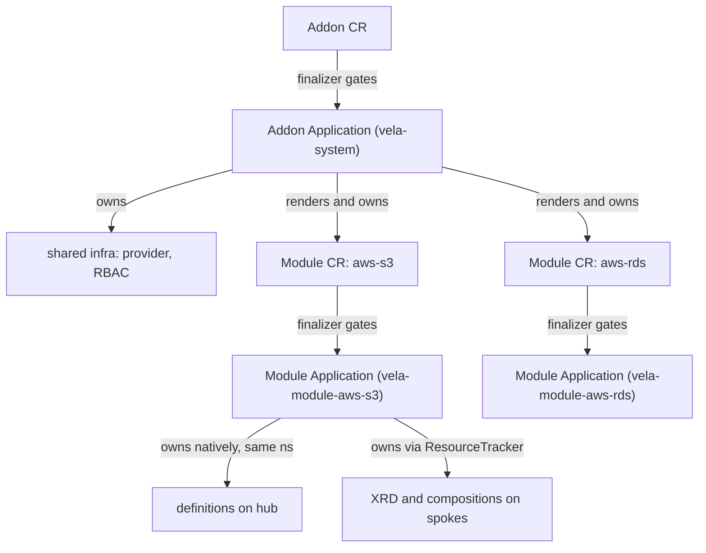
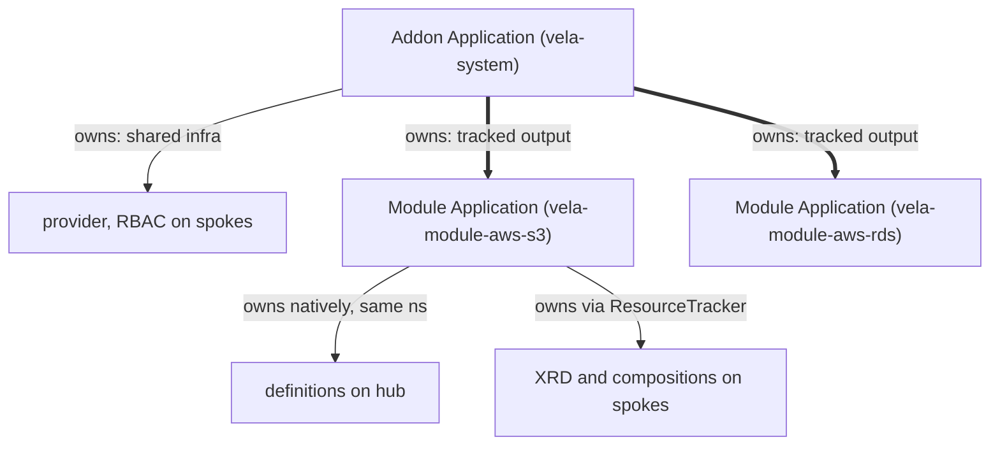

# Design 01: Module CRD, Registry Publishing & Module-Owned Application

**Status:** In Progress

Describes the **CR + controller** approach to Modules (the
original design and the baseline here). Its counterpart is the **component** approach in
[KEP-2.13 Design 03](../../2.13-addons/design/03-cuex-components-instead-of-crs.md); the two
are the two sides of one fork. Builds on
[KEP-2.13 Design 01](../../2.13-addons/design/01-per-component-topology-placement.md) (per-component
placement, implemented in #7213) and
[KEP-2.13 Design 02](../../2.13-addons/design/02-application-managed-resources.md)
("everything is an Application").

**Companion to:** [KEP-2.20](../README.md), [KEP-2.13](../../2.13-addons/README.md)

> **TL;DR**
> - A **Module** is an independently installable, publishable API unit: just definitions + the
>   auxiliary resources that back them (no Schemas/ConfigTemplates/Views, no infrastructure).
>   Simpler than an Addon; needs no user-authored install ordering.
> - Each module gets its own namespace (`vela-module-<name>`); definitions are named
>   `<apiLine>-<definition>` (e.g. `v1-bucket`) and referenced as `<module>/<apiLine>/<definition>`.
> - Lines are published **through** the module (`vela module publish-line`), never standalone,
>   so validation runs with whole-module knowledge.
> - This note is the **CR + controller** baseline. The **component** approach (KEP-2.13 Design 03)
>   may be preferable for the same reasons as addons; Module should follow whatever Addon adopts.
>   Model-agnostic content is marked; CR-specific content is called out.

## What a Module is

A **Module** is an independently installable, publishable, versioned platform
capability: `aws-s3`, `postgres`, `redis`, `kafka`. It bundles just two things: the
X-Definitions that express a capability's API, and the auxiliary resources that implement
them (the workload and implementation resources a capability needs at runtime). That is the
whole of a module; it does not include Schemas, ConfigTemplates, or Views.

**A Module is a deliberately simpler concept than an Addon.** The two differ in scope, and
that difference is what makes a module lightweight:

- **Addon = bundle / aggregator / platform substrate.** It installs broad, shared
  *infrastructure* (a Crossplane provider, shared CRDs, operators, cluster-wide RBAC) and
  declares the set of modules that make up a platform capability set. Standing up
  infrastructure requires real orchestration (ordered rollout, health gates between the
  operator and what depends on it, workflow), and that orchestration need is what mandates
  the full Application structure.
- **Module = an independently installable API unit.** It deploys a narrower subset: the
  X-Definitions that form one capability's API, plus the auxiliary resources that back them. A module can be installed directly, without an umbrella Addon, as long as its dependencies (for example the Crossplane AWS provider) are already satisfied.

**A module is the strict, simple end of the spectrum.** The lean is that a module needs no
user-defined install ordering: whatever ordering it needs (auxiliary resources before the
definitions that depend on them; hub-vs-spoke placement) is *prescribed by the controller and
the render*, so the controller may own both the hub and spoke phases and the module exposes no
user-authored workflow. If a capability genuinely needs bespoke orchestration or installs
infrastructure, that is a signal it is an Addon, not a Module. This simplicity is what lets a
module be delivered cleanly as a component (see
[KEP-2.13 Design 03](../../2.13-addons/design/03-cuex-components-instead-of-crs.md)).

This is the current lean, not a settled rule. The precise author-versus-controller split per
layer (how much of the workflow the controller owns for a Module versus an Addon) is being
worked out in the spike flagged in KEP-2.13 Design 03; the module is expected to sit at the
strict end, but that is subject to that spike's outcome.

A Module is delivered the same way every other capability is delivered in this design:
it is backed by an `Application` that is its deployment engine (KEP-2.13 Design 02).
The Module controller resolves source, renders, composes the Application, reconciles
it, and surfaces status. It owns intent and lifecycle; the Application owns deployment.

To be precise about the CR <-> Application relationship (it is easy to over-read "owns"): the
Module CR does **not** own the Application via a Kubernetes owner reference. The controller
creates an Application of a fixed name/namespace and re-renders it in place on each reconcile;
a **finalizer** on the Module CR gates the Application's deletion (matching the Addon CR
pattern in KEP-2.13). So the relationship is create-render-and-finalizer-gate, not ownerRef
GC — which is what the ownership diagram below shows.

### CR baseline vs component alternative

This note describes the **CR + controller** approach: a `Module` CR reconciled by a Module
controller that manages the module-owned Application. That is the baseline.

The **component approach** may well be preferable, for the **same reasons it is for addons**:
a CueX-backed component can resolve and render the module without a dedicated CR or
controller, removing code to build, test, and maintain, and taking "everything is an
Application" to its base case. That argument, the nested-Application mechanics, the
health-aware `application` component, and the full investigation are made in
[KEP-2.13 Design 03](../../2.13-addons/design/03-cuex-components-instead-of-crs.md) and are
not repeated here.

**Addon and Module should share the decision.** The rationale is identical at both layers, so
if addons adopt the component-only approach, modules should follow suit; deciding the two
differently would be inconsistent. Accordingly, much of what follows is **model-agnostic** (it
holds whether or not a CR wraps the module); those parts are marked. The parts that are
specific to the CR model (the CR finalizer and the controller reconcile loop) are also called
out, with a pointer to their component-model equivalent in KEP-2.13 Design 03.

## Module Identity

The minimal identity contract this note relies on:

- A Module's identity is its **module name** (for example `aws-s3`), carried by its namespace
  (`vela-module-aws-s3`).
- Definitions are named `<apiLine>-<definition>` (for example `v1-bucket`) within that
  namespace; the name does not repeat the module prefix.
- A definition's **API line affinity is carried by `spec.apiVersion`** on the definition
  itself (a first-class field in KEP-2.20; the `<apiLine>` name prefix is derived from it, not
  the source of truth). This is what lets the system know which line a definition belongs to —
  e.g. to mark a whole line deprecated, or to compose a line's definitions under Option B in
  the [API Line investigation](./03-api-line-investigation.md).
- Module-backed references take the form `<module>/<apiLine>/<definition>` (for example
  `aws-s3/v1/bucket`); legacy unqualified references (`bucket`) remain supported for
  non-module definitions.

How references resolve to a definition (the namespace mapping, the `vela-system` coexistence
invariant, and the divergence from KEP-2.20's published naming convention) is covered in
[Design 02](./02-namespace-and-tenancy.md). The full identity/resolution model is deferred to a
dedicated identity/resolution design (a document that still needs to be written). To keep that
deferral from being empty, the decisions already made — which that design must carry forward —
and the parts still open are recorded here.

**Decided, to be carried forward:**

- **Two reference forms only: exactly one segment or exactly three.** One segment (`bucket`) is
  the legacy, non-module form. Three segments (`aws-s3/v1/bucket`) is the canonical module form.
  **There is no two-segment `v1/bucket` form** (the module is never discovered/inferred; it is
  always explicit or absent).
- **Custom implementations use a distinct Module identity; no transparent shadowing.** A team
  overriding a capability publishes it under its own module rather than silently replacing
  another module's canonical identity. For example `aws-s3/v1/bucket` (upstream),
  `internal-aws-s3/v1/bucket`, and `acme-aws-s3/v1/bucket` are three distinct, non-colliding
  identities; none shadows another.
- **Built-in APIs live under a reserved `vela` module,** with maturity encoded in the API line:
  stable under `vela/v1`, experimental under `vela/v1alpha1`, and `v1beta1` as a potential
  intermediate maturity level.

**Still open, for the identity design proper:** ambiguity handling, the definition-lock
mechanics, the full override model, and the detailed `vela`-module built-in behaviour.

### The Module is the "Platform API" publishing boundary

One scoping decision is settled: **API lines are published only *through* their module, never
independently.** The **Module** is the "Platform API" and the publishing boundary. A line is a
publishable unit — you can ship a new `v2` without republishing everything else — but the
publish operation goes via the module (illustratively `vela module publish-line <line>`), not a
standalone `vela api-line publish`. There is no path to publish a line outside its module.

This module-mediated publishing is deliberate, for two reasons:

- **Validation with full module knowledge.** Because publishing a line is a *module* operation,
  breaking-change checks within the line, cross-line consistency, and dependency validation all
  run with the whole module in scope. A standalone line-publish could not see the rest of the
  module and so could not validate against it.
- **Confinement.** Routing publication through the module structurally prevents a line from
  escaping the module boundary; a line always exists in the context of, and is validated
  against, its module.

**What this settles vs. what stays open.** This decides the *publishing* axis (a line is a
publishable unit, but module-mediated and module-validated). It does **not** settle the
*runtime lifecycle* axis: whether an API line needs an independently reconciled, durable
lifecycle identity (its own status, deprecation lifecycle, downstream-definition
reconciliation, and a durable object that persists while deprecated). "Publishable through the
module" and "needs its own runtime lifecycle object" are different questions. If anything, a
line being a validated, publishable unit is mild evidence *toward* some independent identity;
but that runtime question is the largest open architectural question in this design and is
deliberately **not** decided here. It is the subject of
[Design 03: API Line investigation](./03-api-line-investigation.md), which asks a single
question, encapsulate the line in the Module or give it its own durable identity, without
pre-judging the outcome (and delegates the CR-vs-component *form* of an own-identity line to the
Addon/Module directional decision). For the purposes of the Module design, this note treats an
API line as a naming/identity segment and defers its runtime lifecycle model to that
investigation.

## Namespace-per-module

A Module gets its own namespace (`vela-module-<module>`, e.g. `vela-module-aws-s3`) holding
the module-owned Application, the module's namespaced definitions, and (in the CR model) the
`Module` CR. Because X-Definitions are namespaced, the Application owns them natively when
co-located, and a reference like `aws-s3/v1/bucket` resolves deterministically within that
namespace.

The full model, why namespaced definitions make this clean, tenancy/RBAC, bootstrap and
reclamation, and `vela-system` coexistence, is owned by
[Design 02](./02-namespace-and-tenancy.md) and not repeated here.

## The module-owned Application: what a rendered Module looks like

> *Model-agnostic:* the module-owned Application and its rendered contents are the same under
> either model. The only difference is *what composes it*, a Module controller (CR model) or a
> `module` component's CueX provider (component model, KEP-2.13 Design 03).

A Module renders into an Application whose components are split by placement using the
KEP-2.13 Design 01 primitive: the definition (the API) goes to the hub/local topology; the
auxiliary resources that back it (the XRD and Composition) go to the spokes where Claims are
actually reconciled.

Illustrative rendered Module Application for `aws-s3` (non-normative; component
grouping and exact placement syntax are rendering details):

```yaml
apiVersion: core.oam.dev/v1beta1
kind: Application
metadata:
  name: module-aws-s3
  namespace: vela-module-aws-s3          # namespace-per-module
spec:
  components:
    # --- definition (the API): hub/local only ---
    - name: bucket-definition            # ComponentDefinition v1-bucket (in vela-module-aws-s3)
      type: k8s-objects
      properties: { objects: [ /* ComponentDefinition */ ] }

    # --- auxiliary resources (the implementation): all spokes ---
    - name: s3-xrd                        # module-wide Crossplane XRD (shared by all lines)
      type: k8s-objects
      properties: { objects: [ /* CompositeResourceDefinition */ ] }
    - name: bucket-composition            # v1 Composition
      type: k8s-objects
      properties: { objects: [ /* Composition */ ] }

  workflow:
    steps:
      - name: deploy-definition
        type: deploy-components           # illustrative; see #7213
        properties:
          components: [bucket-definition]
          policies: [local]               # hub / local cluster only

      - name: deploy-auxiliary
        type: deploy-components           # illustrative; see #7213
        properties:
          components: [s3-xrd, bucket-composition]
          policies: [all-spokes]          # every registered spoke
```

The two topology policies referenced above are ordinary KubeVela policies (a `local`
topology selecting the hub, an `all-spokes` topology selecting registered clusters).
Nothing about placement is bespoke to the Module controller; it is expressed in the
Application and executed by the Application controller.

## What a rendered Addon looks like

One layer up, an Addon also renders into an Application. That Application carries the
addon's shared infrastructure and *declares the modules it installs* as `Module`
components. Installing/updating the Addon Application creates or updates those Module
CRs; deleting it removes them (inline ownership, below).

Illustrative rendered Addon Application for an `aws` platform addon (non-normative):

```yaml
apiVersion: core.oam.dev/v1beta1
kind: Application
metadata:
  name: addon-aws
  namespace: vela-system
spec:
  components:
    # --- shared platform infrastructure (spokes) ---
    - name: crossplane-aws-provider
      type: k8s-objects
      properties: { objects: [ /* Provider + ProviderConfig */ ] }
    - name: shared-rbac
      type: k8s-objects
      properties: { objects: [ /* ClusterRole / bindings */ ] }

    # --- modules this addon installs (Module CRs) ---
    - name: aws-s3
      type: module                        # renders a Module CR
      properties:
        version: v1.2.0
        # source, parameters, dependsOn, etc.
    - name: aws-rds
      type: module
      properties:
        version: v2.1.0

  workflow:
    steps:
      - name: deploy-infrastructure
        type: deploy-components
        properties:
          components: [crossplane-aws-provider, shared-rbac]
          policies: [all-spokes]
      - name: install-modules
        type: deploy-components
        properties:
          components: [aws-s3, aws-rds]   # Module CRs land on the hub
          policies: [local]
```

The `module` component type is the mechanism by which an Addon declares modules;
it renders a `Module` CR the same way the `addon` component type in KEP-2.13 renders
an `Addon` CR. The Addon controller does not manage the modules' internal resources;
it manages the Addon Application, which owns the Module CRs, and each Module controller
takes it from there.

## Ownership and cleanup

Ownership follows the same "everything is an Application" principle at each layer, and
uses only mechanisms KubeVela already has. **How the module owns its resources (below) is
model-agnostic**; what differs is only the object at the top of the chain, the `Module` CR
(CR model, shown here) or the parent Application's `module` component (component model, whose
nested-Application ownership chain is detailed in
[KEP-2.13 Design 03](../../2.13-addons/design/03-cuex-components-instead-of-crs.md)).

The ownership chain in the **CR model**, from the Addon down to the module's resources:



The **component model** reaches the same layering with the intermediate CRs removed: there is
no Addon CR and no Module CR, so no finalizer-gates. Each Application owns the next one down as
an ordinary tracked component output (see KEP-2.13 Design 03 for the mechanics):



The difference between the two is only the layer at the top of each ownership link: a `Module
CR` gated by a finalizer (CR model), or a `module` component whose rendered Application is a
tracked output of its parent (component model). The Application-owns-resources part below is
identical in both.

Inline modules are owned by the Addon Application (in the CR model the Module CR is one of its
components; in the component model the `module` component is); standalone modules have no Addon
above them. Either way, each layer's Application owns its resources.

**Module owns its resources natively.** The module-owned Application lives in the
module namespace alongside the definitions and namespaced resources it deploys, so it
owns them by ordinary owner references. Cross-cluster runtime resources (Compositions,
XRDs on spokes) are tracked and reclaimed by the ResourceTracker, exactly as for any
Application's dispatched resources. Deleting the module-owned Application therefore
reclaims the module's resources through existing machinery; the Module controller does
not run its own apply/track/GC loop.

**Module CR gates its Application's lifecycle** *(CR model only).* Mirroring the Addon CR
pattern in KEP-2.13, the Module CR carries a finalizer and a deletion policy. The finalizer
gates deletion of the module-owned Application (and hence, via reclamation, the module's
resources). A `Protect`-style policy can block removal while consumers still reference the
module's definitions; this reuses the same reference-scan approach KEP-2.13 defines for
addons. *In the component model there is no CR: the parent Application owns the module's child
Application as a tracked output, and deletion/retention is handled by garbage-collect /
retention policies on the parent (see KEP-2.13 Design 03); the finalizer role does not exist.*

**Inline vs standalone modules** *(CR model framing).*

- **Inline module** (declared inside an Addon via a `module` component): the Module CR
  is a component of the Addon Application, so the Addon Application owns it. Deleting or
  updating the Addon cascades to the Module CR through the Addon Application's normal
  reconciliation and reclamation. An inline module's lifecycle is therefore bound to
  its parent Addon: remove the module from the Addon source and the Addon Application
  no longer renders that Module component, so it is reclaimed.

- **Standalone module** (a `Module` CR created directly, not via an Addon): it is
  independent. No Addon Application owns it; its lifecycle is governed solely by its own
  CR, finalizer, and deletion policy. It survives independently of any addon.

The difference is purely *who owns the Module CR* (the Addon Application, or nobody
above it). The Module controller's behaviour is identical in both cases; it reconciles
whatever Module CRs exist. This keeps a single reconciliation model regardless of how
the module was installed, which is the same "inline is an authoring choice, not a
different runtime model" principle applied to ownership.

*The component model reaches the same inline-vs-standalone distinction without a CR:* an
inline module is a `module` component of the Addon Application (owned by it); a standalone
module is a minimal Application containing a single `module` component. See KEP-2.13 Design 03.

## Registry publishing

A Module is a publishable artifact. It can be published to a registry (OCI or Git) and
installed by reference, or authored inline in an Addon source tree. Publishing is an
authoring/distribution choice; the runtime model is the same either way.

Source resolution is recorded in Module status by digest:

- The Module CR's spec references a source (a registry ref + version range, or inline
  source).
- On reconcile the controller resolves that to a concrete artifact and records the
  resolved digest (OCI manifest digest or Git commit SHA) in status.
- Digest comparison drives change detection between reconciles (unchanged digest => no
  re-render needed), the same pattern KEP-2.13 uses for addons.

**Immutable revision objects are out of scope for this note, but the question is left open,
not closed.** The baseline here is a spec source reference plus a resolved digest in status
(no dedicated revision object). A dedicated `ModuleRevision` — an *immutable resolved-artifact
snapshot* (exact resolved source, digest, normalised CUE, dependency locks, generated
Application input, compatibility metadata), created once per resolved version rather than on
every reconcile — is a plausible future addition, deliberately not introduced here.

The unresolved architectural question to preserve:

> Is digest-addressed external source sufficient for reproducibility, rollback, audit, and
> asynchronous lifecycle reconciliation, or do we eventually need immutable Kubernetes revision
> objects (`ModuleRevision`)?

This question is **primarily live in the CR + controller path.** In the component model much of
the "immutable resolved artifact" concern is already served by the enclosing Application's
existing `ApplicationRevision` plus the source digest, so a bespoke revision CRD is less
obviously needed. **Therefore: if the CR/controller approach is chosen, a separate discussion
on whether dedicated Revision objects (`ModuleRevision`, and `APILineRevision` if API lines
gain first-class status) are required is needed — and that discussion is out of scope for these
documents.** Either way, a revision object could be layered on later without changing the
ownership or deployment model above.

## VelaUX

> *Model-agnostic:* VelaUX visibility follows from the module being backed by an Application,
> which is true in both models.

Because a Module is backed by an Application, VelaUX visualizes it with no new UI
work. VelaUX already renders an Application's health, workflow, resources, events,
drift, and deployment targets; the module-owned Application exposes all of that for the
capability directly. Combined with namespace-per-module, the operational view is:

```
addon-aws                      (Addon Application, vela-system)
  └── aws-s3                   (Module Application, vela-module-aws-s3)
  └── aws-rds                  (Module Application, vela-module-aws-rds)
```

An operator inspects a module the same way they inspect any Application: its resources,
which spokes they landed on, and whether they are healthy and free of drift. The
resource hierarchy is the UI hierarchy.

## Open Discussions & Spikes

- **API Line layer.** Whether an API line is its own CRD, and whether it owns its own
  Application, is an open investigation, deferred until the Module pattern here is
  settled. This note treats API lines only as a naming/identity segment
  (`aws-s3/v1/bucket`); the `v1`/`v2` line lifecycle, coexistence, and deprecation are
  not designed here.
- **Full identity/resolution.** Reference forms, ambiguity handling, locks, the
  override model, and the built-in `vela` module are deferred to the identity design.
  Only the minimal identity contract above is assumed.
- **Revisions.** Baseline is digest-in-status; whether dedicated immutable revision objects
  (`ModuleRevision`, `APILineRevision`) are needed is an open question, primarily live in the
  CR/controller path, and requires a separate discussion out of scope for these documents (see
  Registry publishing above).
- **Dependency model.** How a Module declares and waits on dependencies (a satisfied
  Crossplane provider, another module), including version constraints, resolved-
  dependency locking, and readiness propagation, is not designed here. The examples
  show `dependsOn`-style intent only.
- **Implementation-spec detail is deliberately out of scope for this exploration note.**
  The precise declaration syntax for auxiliary resources, the `Module` status schema
  (conditions, per-line state, spoke-readiness), and the definition-lock mechanics (the
  existing `ApplicationRevision` lock, KEP-2.20) are implementation/KEP-level concerns, not
  gaps — this note fixes the shape, not the field-by-field spec.
- **Namespace, tenancy, and `vela-system` coexistence.** Namespace bootstrap and
  reclamation, RBAC posture, naming constraints, and legacy-reference precedence are
  owned by [Design 02](./02-namespace-and-tenancy.md), not here.
- **KEP prose correction.** KEP-2.13 and KEP-2.20 in places describe
  `ComponentDefinition`/`TraitDefinition` as "cluster-scoped". Per the CRDs they are
  Namespaced. When this design merges back, that prose must be corrected to avoid
  contradiction.
