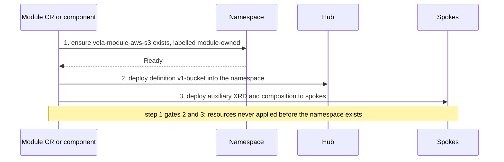
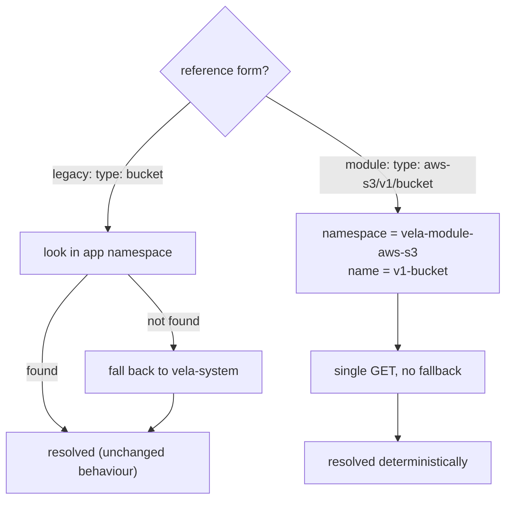

# Design 02: Module Namespaces, Tenancy & `vela-system` Coexistence

**Status:** In Progress

Hub document referenced by
[Design 01](./01-module-crd.md) (Module CRD) and the future identity/resolution
design.

**Companion to:** [KEP-2.20](../README.md), [KEP-2.13](../../2.13-addons/README.md)
**Part of:** the layered lifecycle design exploration.

> **TL;DR**
> - X-Definitions are **Namespaced** (not cluster-scoped), so a per-module namespace
>   (`vela-module-<name>`) is natural.
> - It buys native ownership (Application owns its co-located definitions), deterministic
>   resolution (one GET, no `vela-system` fallback), and a real RBAC/discovery boundary.
> - Legacy `type: bucket` references keep their existing two-step lookup; module references
>   resolve deterministically — the two never compete, so nothing existing breaks.
> - API lines share the module namespace (no per-line namespace); Addon → Module → API Line
>   stays three levels.
> - Key prerequisite: the **local hub needs a cluster-metadata entry** before label-based
>   context works everywhere.

## Scope

This document owns the namespace model for the layered capability design: what a
module namespace is, what it contains, how it is created and reclaimed, how it acts as
a tenancy/RBAC boundary, and how it coexists with the existing `vela-system`
definition namespace during and after migration.

It is a hub. Design 01 and the identity design both depend on the decisions here and
should reference this document rather than re-derive them. Where a decision has a
dependency in another document (notably resolution precedence, owned by the identity
design), this document states the namespace-side constraint and points to the owner.

## The grounding fact: X-Definitions are namespaced

The entire model rests on a fact that is easy to get wrong. All four X-Definition
kinds (`ComponentDefinition`, `TraitDefinition`, `WorkflowStepDefinition`,
`PolicyDefinition`) are **Namespaced**, not cluster-scoped:

- CRDs declare `scope: Namespaced`
  (`charts/vela-core/crds/core.oam.dev_*definitions.yaml`).
- Go types declare `// +kubebuilder:resource:scope=Namespaced`
  (`apis/core.oam.dev/v1beta1/`).

They only *appear* cluster-wide because, by convention, system definitions all live in
`vela-system` and are resolved there. The resolution path is a two-step namespace
search: `GetDefinition` (`pkg/oam/util/helper.go`) tries the Application's own
namespace first, then falls back to `vela-system` (via `oam.SystemDefinitionNamespace`,
`pkg/oam/var.go`). A definition in the app's local namespace therefore *overrides* the
system one; the fallback is a precedence mechanism, not just a search.

Because definitions are already namespaced, putting a module's definitions in a
dedicated namespace is not a new capability or a change to the definition model; it is
using the existing namespacing with a per-module namespace instead of the shared
`vela-system`.

## Namespace-per-module

Each module gets its own namespace, named by convention `vela-module-<module>` (for
example `vela-module-aws-s3`). It holds:

- the `Module` CR;
- the module-owned `Application`;
- the module's namespaced X-Definitions;
- any other namespaced, module-scoped supporting resources (for example a
  ConfigTemplate or Schema that is namespaced).

Runtime resources that must live on spokes (the workload and implementation resources
a capability needs where its workloads run) are placed on the spokes by the module-owned
Application's workflow (KEP-2.13 Design 01/02); they are not confined to the module namespace on
the hub. The module namespace is the hub-side home for the module's control-plane and
metadata resources.

### Advantages of Namespace Isolation

- **Native ownership.** The module-owned Application and the module's definitions share
  the module namespace, so the Application owns the definitions through ordinary
  Kubernetes owner references. There is no cross-scope ownership problem (see
  KEP-2.13 Design 02). The ResourceTracker still tracks everything the Application deploys
  (including spoke resources); definitions simply do not require any special ownership
  path.

- **Deterministic resolution, no fallback search.** A module-backed reference
  `aws-s3/v1/bucket` names the module, and therefore the namespace (`vela-module-aws-s3`)
  and the definition (`v1-bucket`, named without the module prefix since the namespace
  carries it) exactly. Resolution is one deterministic GET; the local-then-`vela-system`
  fallback is not consulted. The explicit reference *removes* an existing lookup step rather
  than adding one. (The full resolution model is owned by the identity design; see precedence
  below.)

- **A real tenancy boundary.** Ownership, RBAC, and discovery all gain a natural
  Kubernetes-native boundary (see Tenancy below).

> **Divergence from the published KEP-2.20 naming convention.** KEP-2.20 names module
> definitions `{module}-{apiVersion}-{definition-name}` (e.g. `aws-s3-v1-bucket`). That prefix
> existed to disambiguate definitions that all share the `vela-system` namespace.
> Namespace-per-module removes that need: the namespace carries the module, so the name drops
> the module prefix (`v1-bucket`). This is an intentional divergence to reconcile on merge-back.

## Tenancy and RBAC

The module namespace is the unit of access control for a capability.

- A team responsible for `aws-s3` can be granted rights scoped to `vela-module-aws-s3`
  (Role + RoleBinding in that namespace) without any rights over other modules or over
  `vela-system`. This is standard Kubernetes namespace RBAC; no bespoke authorization
  layer is needed.
- Creating a `Module` CR causes its controller to install definitions, which change the
  capabilities available to Application authors cluster-wide. As with the Addon CR
  (KEP-2.13 security considerations), the ability to create/modify Module CRs and their
  namespace should be restricted to platform-team service accounts.
- Discovery is a namespace listing: "what does `aws-s3` install?" is answered by listing
  `vela-module-aws-s3`, rather than filtering `vela-system` by label.

## Namespace lifecycle (bootstrap and reclamation)

The module namespace has a lifecycle tied to the module.

**Creation.** When a `Module` CR is installed (whether standalone or inline via an
Addon), its namespace must exist before the module-owned Application and definitions can
be applied. Options, to be decided:

- the Module controller ensures the namespace as the first reconcile step (create if
  absent, label it as module-owned); or
- the namespace is rendered as a resource of the parent (the Addon Application, for
  inline modules) so it is created and reclaimed by the existing Application machinery.

The second option is attractive because it keeps namespace lifecycle inside the
"everything is an Application" model, but it is awkward for standalone modules (there is
no parent Application). A likely resolution: the Module controller ensures the namespace
directly, using a well-known label so ownership is unambiguous. This needs validation.

Whichever option is chosen, the ordering is the same: the namespace is created and Ready
*before* any module resource is deployed into it. The module-owned Application's own workflow
enforces this, so it holds under both the CR and component models (the "actor" below is the
Module controller in the CR model, or the `module` component's CueX-rendered workflow in the
component model).

**Reclamation.** When a module is removed, its namespace and contents should be cleaned
up, but only after the module's resources are safely reclaimed (definitions may still be
referenced; see Design 01's deletion policy and the deprecation lifecycle). Deleting the
namespace prematurely would orphan or force-delete referenced definitions. The safe
order is: finalizer-gated reclamation of the module-owned Application and its resources
first, then namespace deletion. Whether the namespace is deleted at all (versus left
empty) is an open item; an empty module namespace is cheap and avoids race conditions.

**Collision.** Two modules cannot share a namespace under the `vela-module-<module>`
convention because module names are unique. Name-length and DNS-label constraints on
very long module names need a truncation/hash rule consistent with the definition-name
convention in KEP-2.20; flagged for the identity design.

## `vela-system` coexistence and migration

Existing definitions all live in `vela-system` and are referenced by unqualified name
(`type: webservice`). Introducing module namespaces must not break them.

The coexistence rule:

- **Legacy unqualified references (`type: bucket`)** continue to use the existing
  two-step lookup (local namespace, then `vela-system`) and resolve to non-module
  definitions. Their behaviour is unchanged.
- **Module-backed references (`type: aws-s3/v1/bucket`)** resolve deterministically in
  the module namespace and never fall back.

The two reference forms do not compete for the same lookup, so adding module namespaces
cannot silently change how an existing `type: <name>` reference resolves. This is the
invariant the namespace model must preserve; the precise precedence rules, ambiguity
handling, and any migration edge cases (for example a legacy definition and a module
definition that share a bare name) are **owned by the identity design**. This document
states only the constraint: *module namespaces must not alter legacy resolution.*

The two paths side by side, one unchanged, one new and deterministic:

The legacy path (left) is exactly today's two-step lookup, untouched. The module path (right)
derives namespace and name directly from the reference and does one GET, so it neither uses nor
is affected by the `vela-system` fallback.

**Built-in `vela` module.** KubeVela's own first-party definitions are a candidate to
move into a built-in `vela` module over time (`vela/v1/webservice`). Whether the `vela`
module uses a dedicated namespace or remains in `vela-system` for compatibility is a
migration decision for the identity design; the namespace model supports either, since
the `vela` module's references would be explicit (`vela/v1/...`) and therefore
deterministic regardless of which namespace backs them.

## Interaction with the API Line layer

**API lines do not get their own namespace.** All of a module's API lines share the single
module namespace (`vela-module-aws-s3`), regardless of whether an API line later becomes its
own resource (an open investigation in the Module/API Line design). An API line is an identity
segment within the module, not a separate tenancy unit; giving it a namespace would fragment a
capability that is conceptually one unit.

This also keeps the layering comprehensible. **Addon → Module → API Line** is a clear
three-level hierarchy; a per-line namespace would push it to four levels and make the
namespace layout confusing for no benefit. The namespace hierarchy stops at the module.

## Open Discussions & Spikes

- **Bootstrap mechanism.** Controller-ensured namespace vs parent-Application-rendered
  namespace (see Namespace lifecycle).
- **Reclamation policy.** Whether module namespaces are deleted on module removal or
  left empty; ordering against definition reference-safety.
- **Namespace naming constraints.** Truncation/hash rule for long module names, aligned
  with the definition-name convention (identity design).
- **Namespace labelling / quota / network posture.** Whether module namespaces carry
  standard labels and any quota/network policy.
- **Precedence rules.** Full legacy-vs-module resolution precedence is owned by the
  identity design; this document only fixes the non-regression invariant.
- **`vela` module namespace.** Whether the built-in module uses a dedicated namespace or
  stays in `vela-system`.
- **KEP prose correction.** KEP-2.13/2.20 describe definitions as "cluster-scoped" in
  places; per the CRDs they are Namespaced. Correct on merge-back.
