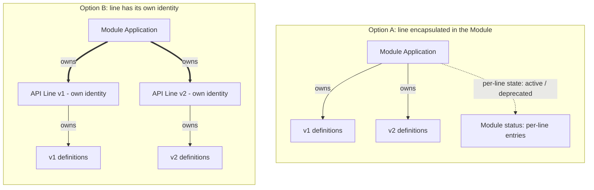
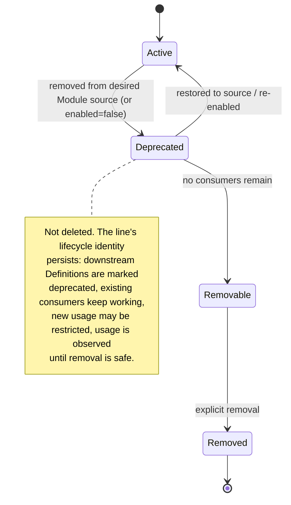

# Design 03: API Line Investigation

**Status:** In Progress 

This is the largest unresolved architectural
question in the layered design. This note lays out the options and comparison dimensions
neutrally and deliberately makes **no recommendation**; it is meant to be decided after
review, not pre-judged here.

**Companion to:** [KEP-2.20](../README.md), [KEP-2.13](../../2.13-addons/README.md)
**Related:** [Design 01](./01-module-crd.md) (Module),
[Design 02](./02-namespace-and-tenancy.md) (namespace/tenancy),
[KEP-2.13 Design 03](../../2.13-addons/design/03-cuex-components-instead-of-crs.md)
(addons/modules as components; deprecation via GC-retention policy).

> **TL;DR**
> - The largest open question, deliberately **not decided** here
> - Right test: not "can a line exist without a module?" (it can't) but **"does a line need an
>   independently reconciled lifecycle identity?"**
> - Two options: **A)** encapsulate the line as state within the Module, or **B)** give it its
>   own durable identity (own status, deprecation lifecycle, downstream reconciliation).
> - The CR-vs-component *form* of Option B is **not** decided here — it follows the Addon/Module
>   directional decision (KEP-2.13 Design 03).
> - Crux: does the line need a durable *object*, or is a status flag enough?

## The Question

It is settled that an API line is **published only through its module** (never standalone) and
always requires a module at runtime (see [Design 01](./01-module-crd.md)). That fact is often
used as a shortcut to conclude the API line should not be a first-class object. It is the wrong
test.

> **The right test is not "can an API line exist without a module?" (it cannot). It is: does
> an API line need an independently reconciled lifecycle identity?**

"Requires a module at runtime" and "lacks an independent lifecycle" are different properties. A
line can be un-installable on its own yet still warrant its own status, its own deprecation
lifecycle, dedicated reconciliation of the definitions it owns, and a durable object that
persists while it is deprecated. This investigation evaluates whether it does, without assuming
the answer.

## Scope: the real question is one axis, not two

The choice reduces to a single axis:

- **Option A — Encapsulate into the Module.** An API line is not a distinct object. It is data
  on the Module: a naming/identity segment plus lifecycle *state* (active / deprecated) tracked
  in the Module's status. Whatever reconciliation a line needs is performed by the Module.
- **Option B — The API line is its own durable, reconciled identity.** The line is a
  first-class thing with its own status, deprecation lifecycle, dedicated reconciliation of the
  definitions it owns, and a durable object that persists while deprecated.

**The CR-vs-component form of Option B is *not* decided here.** Whether "own identity"
manifests as a CRD + controller or as a component that renders a child Application is the same
question being decided for Addons and Modules at large, and API Line follows that directional
decision (see the coupling in
[KEP-2.13 Design 03](../../2.13-addons/design/03-cuex-components-instead-of-crs.md)). Treating
CR-vs-component as a third option here would double-count a decision owned elsewhere. So this
investigation asks only: **encapsulate in the Module, or give the line its own identity?**

The structural difference between the two, at the Application level:

In Option A the Module Application owns the definitions of every line directly, and each line
is only a state entry in the Module's status. In Option B the Module Application owns a
per-line object, which in turn owns that line's definitions and carries the line's own status
and deprecation lifecycle. Whether that per-line object is a CR or a component-rendered child
Application is the delegated form decision (double arrows = ownership; not a commitment to
either form).

## Comparison dimensions

Each dimension is a reason that surfaced for wanting API-line independence. The point is that
the two options are **not equivalent** on them; the value judgement (how much each matters) is
left to the reviewer. Where Option B's realisation would differ by the delegated CR-vs-component
choice, that is noted inline.

| Dimension | Option A: state in Module | Option B: own identity |
|---|---|---|
| Independent status / conditions | No — only Module status, per-line entries | Yes (child Application status, or CR status if CRD form) |
| Durable object while deprecated | No distinct object; state flag only | Yes — a durable object survives absence from source |
| Deprecation lifecycle (see below) | Module-driven state transitions | Line-scoped: retained child App via GC-retention policy, or CR-driven if CRD form |
| Dedicated reconciliation of downstream Definitions | Module reconciles them | Reconciled at the line's own layer |
| RBAC / governance at line granularity | No (module grain only) | Yes (per-CR if CRD form; via the child Application/namespace if component form) |
| VelaUX visibility per line | Via Module only | Yes — the line's own object/Application is visible |
| Usage / render-health reporting per line | Would attach to Module | Attaches to the line's own object/Application |
| Migration semantics (v1→v2) — see KEP-2.20 FE-1 | Not a differentiator — orchestration is Application-controller / consumer-side | Not a differentiator — same |
| Object / reconcile cost | Lowest | Higher (one object/Application per line; exact cost depends on the delegated form) |
| New machinery to build | None | Reuses whatever the Addon/Module directional decision lands on (component model, or a new CRD+controller) |

## Deprecation lifecycle as a first-class dimension

The critique that prompted this investigation is that the deprecation model has been reduced to a
GC-retention policy, which is *one* realisation but not the *only* one, and the two options are
not equivalent. The fuller lifecycle discussed was:

How each option realises this:

- **Option A (state in Module):** the states are fields on the Module's per-line status; the
  Module's reconciliation drives the transitions. There is no separate durable object — the
  "durable deprecation record" is a row in Module status. Simplest, but the line has no
  identity of its own to hang usage/health/finalizers on.
- **Option B (own identity):** the line has its own durable object that survives absence from
  source, so downstream-Definition marking, usage observation, and health all attach to a real
  object. *In the component form* this is a retained child Application (via a GC-retention
  policy on the parent, marked deprecated). *In the CRD form* it is the `APILine` CR, whose
  controller drives the transitions directly. Which of these applies is the delegated
  CR-vs-component decision; either way the line has a durable object, which is what
  distinguishes B from A.

The key comparison: **Option B gives a durable object that survives absence from source;
Option A gives a durable state flag but no object.** Whether "an object, not just a flag" is
required is the crux of the decision.

## What this investigation does not decide

- It does not settle whether per-line RBAC or usage/health reporting are in-scope enough to
  justify their weight; those feed the decision but are themselves partly open (see the
  usage/health notes in
  [KEP-2.13 Design 03](../../2.13-addons/design/03-cuex-components-instead-of-crs.md)).
- **Migration (v1→v2) is future work and is not a differentiator.** The migration vision (a
  line supplying a migration workflow, `migratesFrom`, backup/rollback semantics, a blocked
  direct-update path until migration runs) is already captured as a Future Enhancement in
  KEP-2.20 (**FE-1: Version migration workflows**); this investigation does not re-design it.
  Crucially, **migration orchestration is an Application-controller concern, not a
  Module/line/Addon concern.** It fires when a *consuming* Application changes a component's
  `type` API version (`aws-s3/v1/bucket` → `aws-s3/v2/bucket`); the Application controller
  detects that from the definition-lock version change (KEP-2.20 FE-1) and runs the migration.
  Because detection and execution live consumer-side regardless, migration works the same under
  Option A and Option B and does not argue for either. (An API line may still be a *source* of
  migration metadata, but that is a minor packaging point, not a lifecycle-identity argument.)
- **Immutable revision objects are out of scope, but flagged as a downstream question.** If
  Option B is chosen *and* takes the CR form, whether a dedicated `APILineRevision` (an
  immutable resolved-artifact snapshot per line) is needed is a separate discussion, out of
  scope here — the same open question as `ModuleRevision`, described in
  [Design 01](./01-module-crd.md). The baseline for now is digest-in-status. This does not
  bear on the A-vs-B choice itself; it is a consequence to resolve later if the CR form is
  adopted.
- **Inline API lines follow the same convergence rule as Modules, but the mechanics are
  form-dependent and TBD.** As with modules, inline is an authoring convenience, not a different
  runtime model: an inline line renders *locally* (no registry lookup, source is embedded) but
  should converge on the same runtime shape as a published one. How it converges depends on the
  form: in the **CR** form, an inline line would still materialise an in-line CR to represent it
  (inline → CR → … → Application, same shape as published); in the **component-only** form, the
  parent can bypass the intermediate component and insert the rendered Application directly
  (App → App rather than App → component → App). Preserving this rule as one of the things the
  chosen model must satisfy is the point here; the exact mechanics need further investigation
  *after* the CR-vs-component decision.
- It inherits the settled facts from Design 01 (published only through the module, never
  standalone; always requires a module) and Design 02 (API lines share the module namespace;
  no per-line namespace).

## Decision inputs

The decision should turn on the answer to the framing question — *does an API line need an
independently reconciled, durable lifecycle identity?* — informed by:

1. whether a durable *object* (not just Module status state) is needed while deprecated;
2. how much per-line governance/observability real platform teams need (versus module-grain).

Only the encapsulate-vs-own-identity axis is decided here. If the answer is "own identity,"
its concrete form (a CRD + controller, or a component that renders a child Application) is
**not** chosen here — it follows the Addon/Module directional decision in
[KEP-2.13 Design 03](../../2.13-addons/design/03-cuex-components-instead-of-crs.md), so that
API Line stays consistent with whatever Addons and Modules adopt.

## Open Discussions & Spikes

- **The core decision (this whole doc):** encapsulate the API line in the Module (Option A) or
  give it its own durable identity (Option B)? Keyed on "does a line need an independently
  reconciled, durable lifecycle identity?"
- **Gated on:** the Addon/Module CR-vs-component directional decision
  ([KEP-2.13 Design 03](../../2.13-addons/design/03-cuex-components-instead-of-crs.md)) — that
  decides the *form* of an own-identity line; this doc decides only *whether* it has one.
- **Downstream, only if Option B + CR form:** whether an `APILineRevision` object is needed
  (see [Design 01](./01-module-crd.md) revisions discussion).
- **Deferred, not differentiators:** migration (Application-controller / consumer-side; KEP-2.20
  FE-1), inline-line materialisation mechanics, and per-line RBAC/usage-health weight.
