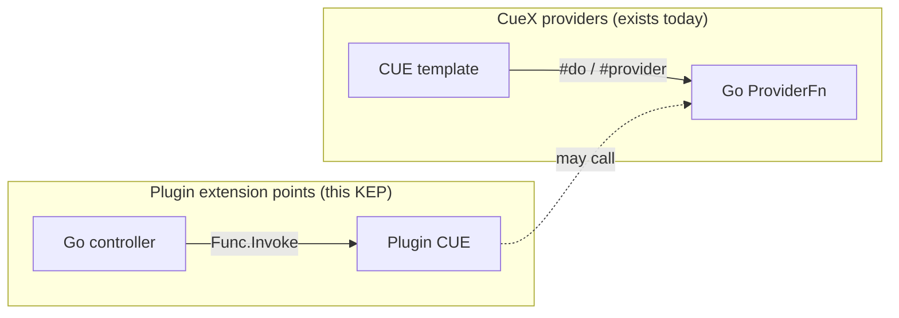
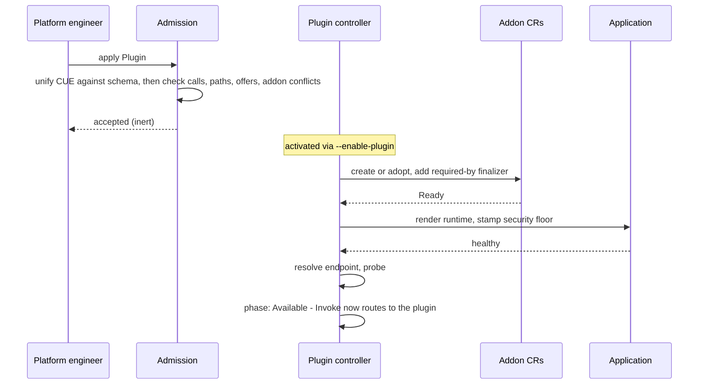

> ⚠️ **Early concept draft.** This KEP is an early-stage exploration. It is **incomplete and may be inaccurate**, its direction is unsettled, and it should not be relied upon for implementation or as a description of committed behaviour. Expect substantial change.

# KEP-2.23: Plugin Extension Points

**Status:** Drafting (Not ready for consumption)
**Parent:** [vNext Roadmap](../README.md)

A `Plugin` lets an organisation replace or extend KubeVela's controller behaviour at
named extension points, without forking vela-core and without a new CRD per feature.

| Layer | Artefact | Author | Responsibility |
|---|---|---|---|
| Extension point | Go registration + embedded CUE schema | KubeVela | Declares a named point, its functions, their types, cardinality, failure policy, and a base implementation |
| Implementation | `Plugin` CR | Platform engineer | Supplies CUE satisfying one or more extension points; optionally a workload and offered packages |
| Activation | `--enable-plugin` flags | Installation owner | Decides which registered plugins are live |
| Invocation | `Func.Invoke` / `.Collect` | KubeVela controllers | Calls the point; never branches on whether a plugin or the base answered |

Today, extending KubeVela means one of three things: forking the controller, waiting for
a feature to be accepted upstream, or minting a bespoke definition CRD for each
extensible surface, as [KEP-2.4](../2.4-dispatchers/README.md) proposes with
`DispatcherDefinition`. CueX already runs one direction, letting a CUE template call out
to Go. What is missing is the inverse: controller code calling out to CUE. This KEP
introduces that direction.

## Motivation

KubeVela's extensibility is real but one-directional.

CueX (`github.com/kubevela/pkg/cue/cuex`) lets a CUE template call out to Go: a template
declares `#do` and `#provider`, and the compiler resolves it against a registered
`ProviderFn`. That one declaration covers both transports. In-process Go is the common
case, either typed and JSON round-tripped (`GenericProviderFn`) or handed the raw
`cue.Value` directly (`NativeProviderFn`), both registered through
`NewInternalPackage`; a remote HTTP endpoint (`ExternalProviderFn`) arrives via a
`Package` CR. The template cannot tell which it got. That is how `base64`, `kube` and
every external `Package` work, and it extends the *vocabulary available to definitions*.

What does not exist is the inverse: a way for controller code to call out to
CUE supplied by an operator. Every place KubeVela wants to be configurable today ends up
either hardcoded, gated behind a flag, or promoted into its own definition kind with its
own CRD, controller wiring, admission rules and lifecycle. That cost is paid per surface,
which is why most surfaces simply are not extensible.

The consequence is visible in the roadmap. [KEP-2.4](../2.4-dispatchers/README.md)
proposes `DispatcherDefinition` to make delivery pluggable, and independently arrives at
named CUE functions with fixed contracts, per-function failure semantics, a `default`
compatibility anchor, and selection precedence. Those are the ingredients of a general
mechanism, discovered bottom-up for one surface. The next extensible surface would
rediscover them again.

### Goals

- One mechanism for extending controller behaviour at any designated point.
- Type-safe contracts: a plugin that does not satisfy its point is rejected at
  admission, not at reconcile.
- Third-party CUE runs confined, with no more reach than its point grants it.
- Every point has a working base implementation, so a plugin is always optional.
- A plugin can be a coherent bundle: implementations, a workload, addons it installs,
  and CUE packages it offers to everyone else.

### Non-Goals

- Replacing addons. Addons are packaging with no controller dependency; a plugin binds
  to controller flow. An addon may ship a `Plugin`; they do not compete.
- Arbitrary workload deployment. The optional runtime tier is deliberately narrow.
- Chained/pipeline extension points. See [Open questions](#open-questions).

## Mental Model

CueX and plugins are mirror images, and they compose.



A controller calls an extension point. The point resolves to a plugin's CUE, or to the
base implementation written in Go. The plugin's CUE may in turn use whatever CueX
vocabulary its point permits, and may call its own service through `#Invoke`.

**Extension point (KubeVela).** A named point, declared in Go with an embedded CUE
schema beside it. The schema is the contract; the Go types are how vela-core's own call
sites stay honest against it.

**Plugin (platform engineer).** A cluster-scoped CR supplying CUE for one or more
points. Creating it is inert.

**Activation (installation owner).** A plugin does nothing until listed in the
`--enable-plugin` flags. Registration and activation are separate permissions.

**Base implementation (KubeVela).** Ordinary Go, shipped in the box, registered
alongside the point. It is what runs when no plugin is active, and the fallback when an
active one fails. Because it is Go, it is not subject to the import allowlist or the
call budget, which is what makes it a trustworthy floor rather than just another
implementation.

## Declaring an Extension Point

The schema and the Go types live side by side as `<package>.cue` and `<package>.go`,
following how CueX providers are laid out today: `base64.cue` beside `base64.go`,
`kube.cue` beside `kube.go`. It is a convention rather than something enforced, and a
larger provider spreads its Go over more files, but the schema stays one file.

The running example throughout is **X-Definition authorization**: deciding whether a
given Application may use a given definition, at Application admission. KubeVela has no
answer to that today beyond RBAC on the definition objects themselves, which governs who
may *read* a definition rather than who may *use* one.

```cue
// pkg/plugin/defauthz/defauthz.cue
#Authorize: {
    // +usage=Decide whether an Application may use an X-Definition
    $params: {
        definition: {
            // +usage=ComponentDefinition, TraitDefinition, PolicyDefinition, WorkflowStepDefinition
            kind: string
            name: string
        }
        application: {name: string, namespace: string}
        // +usage=The authenticated user from the admission request
        user: {name: string, groups: [...string]}
    }
    $returns: {
        allowed: bool
        // +usage=Shown to the user on refusal, so it must say what to do next
        reason: string
    }
}
```

```go
// pkg/plugin/defauthz/defauthz.go
//go:embed defauthz.cue
var schema string

type AuthorizeParams struct {
    Definition  DefinitionRef `json:"definition"`
    Application ObjectRef     `json:"application"`
    User        UserInfo      `json:"user"`
}
type AuthorizeReturns struct {
    Allowed bool   `json:"allowed"`
    Reason  string `json:"reason"`
}

var Extension = plugin.NewExtensionPoint("definition-authorization", schema,
    plugin.Exclusive,
    plugin.WithBudget(500*time.Millisecond),
    plugin.Allow("base64", "cue"))

var Authorize = plugin.ExclusiveFunc[AuthorizeParams, AuthorizeReturns](
    Extension, "#Authorize",
    plugin.Required,
    plugin.OnError(plugin.FallbackToBase),
    plugin.WithBase(allowAll))
```

The base is `allowAll`, which is today's behaviour. A point whose base changes existing
behaviour is not an extension point, it is a breaking change wearing one.

The call site carries no strings and no type assertions:

```go
out, err := defauthz.Authorize.Invoke(ctx, &defauthz.AuthorizeParams{
    Definition:  defauthz.DefinitionRef{Kind: "TraitDefinition", Name: "expose"},
    Application: defauthz.ObjectRef{Name: app.Name, Namespace: app.Namespace},
    User:        userFrom(req),
})
```

This one runs in the Application admission webhook, once per definition an Application
references. That is why its budget is 500ms rather than seconds: admission has a hard
timeout, and a point that overruns it fails the apply rather than degrading quietly.

### Why Go Types Exist

The CUE schema validates values. It cannot validate the controller code that reads
them. Add a field to the schema and, with an untyped `map[string]any` boundary, nothing
in Go breaks: every call site still compiles and the mismatch surfaces on a cluster.
With generated or hand-written types, `go build` reports it everywhere at once.

Hand-writing the types is acceptable because it is once-off per point, provided drift is
caught mechanically. The drift test must **iterate the registry, never enumerate the
points**, or a new point without a test reintroduces exactly the drift it guards against:

```go
func TestSchemaMatchesGoTypes(t *testing.T) {
    for _, p := range plugin.Registry.All() {
        for name, fn := range p.Fns() {
            schema := p.Schema().LookupPath(cue.ParsePath(name + ".$params"))
            got    := cuecontext.New().EncodeType(fn.ParamsType())
            requireSameFieldSet(t, schema, got)
        }
    }
}
```

Two rules for `requireSameFieldSet`:

- **Compatible, not identical.** Narrowing is what CUE is for.
  `port: >0 & <65536` against Go's `int` must pass. Bidirectional subsumption would
  reject it.
- **Check optionality explicitly.** `omitempty` versus `?` is the mismatch that slips
  through, because both sides look correct in isolation and the failure is a nil
  dereference at runtime.

Not all points want types. A dispatcher's output becomes `unstructured` regardless and
is never destructured by the controller, so a generated struct there is friction with no
payoff. The point declares which it wants:

```go
plugin.GenericFn[P, R]{}   // typed boundary
plugin.RawFn{}             // cue.Value in, cue.Value out
```

Both validate against the schema identically.

## The `Plugin` CR

```yaml
apiVersion: plugin.oam.dev/v1alpha1
kind: Plugin
metadata:
  name: opa                       # cluster-scoped
spec:
  schemaVersion: v1

  parameter: |                    # optional, see Parameters
    cpu:      *"100m" | string
    replicas: *2 | int

  implements:
    - extensionPoint: definition-authorization
      cue: |
        #Authorize: {
          $params: _
          _t: #Invoke & {method: "POST", path: "/authorize", body: $params}
          $returns: {
            allowed: _t.body.allowed
            reason:  _t.body.reason
          }
        }
    - extensionPoint: application-context
      cue: |
        #Contribute: {...}

  runtime:                        # optional
    image: ghcr.io/acme/vela-authz:v0.3.1        # never parameterised
    replicas: $(parameter.replicas)
    port: 8443
    secretRefs: [opa-bundle-credentials]
    resources: {requests: {cpu: $(parameter.cpu), memory: 128Mi}}

  addons:                         # optional, installed and owned
    - name: dex                   # resolves user group membership
      version: v1.2.0
      parameters: {imageRegistry: registry.acme.io}

  dependencies:                   # optional, must already exist
    - name: fluxcd                # the platform's, syncs the policy bundles

  offers:                         # optional
    - package: authz              # importable as vela/plugin/authz
      functions: ["#Authorize"]

status:
  phase: Available
  endpoint: https://vela-plugin-opa.vela-system.svc:8443
  offers:
    - package: authz
      path: vela/plugin/authz
```

A plugin at a CUE-only point (application context, health evaluation) is the same CR
with `runtime`, `addons`, `dependencies` and `offers` all absent, and no `#Invoke` in
its CUE. That is the common case: most extension points need no process at all.

Admission is all-or-nothing across `implements`. Partial acceptance yields a CR whose
spec does not describe its behaviour, which is worse than a hard failure.

### Scope

`Plugin` is **cluster-scoped**. The reason matters, because the conclusion
alone invites someone to make it namespaced for multi-tenancy: *namespaces should not
have an impact on application behaviour*. A namespaced plugin would mean two Applications
with identical specs behaving differently based on where they live.

The consequence: cluster-scoped `Plugin` plus activation via controller flags is two
cluster-level grants, neither delegable. A [KEP-2.14](../2.14-tenants/README.md) tenant
cannot bring its own plugin. That is correct for v1, since a tenant-scoped dispatcher
would change delivery for workloads outside the tenant, but it is a decision rather than
an oversight.

## Cardinality

The mode belongs to the extension point, not to the plugin. The question that picks it is
**who chooses the implementation, and when**.

| Mode | Who chooses | When |
|---|---|---|
| `Exclusive` | the operator | once, at install |
| `Named` | the caller, usually the Application author | per call |
| `Accumulate` | nobody, all of them run | n/a |

Underneath, all three are one mechanism: a name-to-implementation map. `Exclusive` does
not expose the selector; `Accumulate` iterates the map instead of resolving one entry.

### Exclusive

At most one active implementation for the whole installation. None active means the base
runs. Use when the behaviour is a property of the *installation*, not the workload.

```go
out, err := defauthz.Authorize.Invoke(ctx, params)
```

The caller cannot tell whether base or a plugin answered, by design. The moment
"did I get base?" appears in a signature, every call site starts branching on it.

| Situation | Behaviour | Status |
|---|---|---|
| Nothing activated | base | Ready |
| Activated but absent or never Available | base | **Degraded**, named in `Plugin.status` and a controller condition |
| Plugin errors | per `OnError` | circuit opens after N consecutive failures |
| Two plugins activated for the point | refused, base runs, **Degraded** | detected at startup and on plugin change; see [Activation](#activation) |

Those first two rows must never look alike. Silently falling back when an activated
plugin is missing is how an installation discovers in production that its credential
plugin was never installed and everything has been running on static secrets.

### Accumulate

Every active implementation contributes; results are unified. There is no base and no
selection. Use when contributions are additive and independent, and several being right
at once is normal rather than a conflict.

```go
fields, err := appcontext.Contribute.Collect(ctx, params)
```

The merge is CUE unification, so no merge logic is written and two implementations
assigning the same field different values is a language-level error rather than
last-writer-wins. Contributions namespace under `context.plugins.<name>`, which makes
collision impossible rather than merely detected.

| Situation | Behaviour |
|---|---|
| Nothing activated | empty contribution, the correct default here |
| One implementation errors | `Fatal` |
| Two declare the same field | rejected at admission on field-name overlap |

`Fatal` is the default and `FallbackToBase` is refused at registration, because there is
no base to fall back *to*: base plus one contributor is not base plus two. Dropping a
contribution silently removes context fields definitions already read, and the resulting
error points at the definition rather than at the plugin.

Field-name overlap is checkable at admission; value conflict is not, since contributions
are dynamic. Accumulate implementations therefore declare their contributed field set.
`pkg/definition/sourceexpr/context.cue` already does exactly this with its groups, and
its drift tests extend to cover plugin-contributed ones.

### Named

Several active simultaneously; the caller supplies a name per call. The base registers
under a name like any other, so "plugin or base" collapses into ordinary resolution.

```go
var Dispatch = plugin.NamedFunc[DispatchParams, DispatchReturns](
    Extension, "#Dispatch",
    plugin.WithNamed("cluster-gateway", clusterGatewayImpl),
    plugin.WithDefaultName("cluster-gateway"))

out, err := Dispatch.Invoke(ctx, step.Properties.Dispatcher, params)  // "" means default
```

| Situation | Behaviour |
|---|---|
| Name unset | the default name |
| Name set and resolves | that implementation |
| **Name set and missing** | **hard error, never falls back** |
| Implementation errors | per `OnError` |

That third row is the one to be strict about. An Application that asked for `ocm` and
silently received cluster-gateway has dispatched to the wrong place and will report
healthy doing it. Checked twice: at Application admission (does the name resolve, and is
this author permitted to use it), and again at call time, since the plugin may have been
deactivated in between.

### Choosing

1. Does the caller need more than one answer at once? → `Accumulate`
2. Does the caller know per call which implementation it wants? → `Named`
3. Otherwise → `Exclusive`

## `#Invoke` and the Capability Boundary

Plugin CUE is third-party code evaluated inside vela-core, in vela-core's network
position and with vela-core's ServiceAccount available to any provider it can reach. The
vocabulary a point grants its implementations is therefore a security boundary, not an
ergonomic choice.

`http.#Do` would let plugin CUE reach anything vela-core can reach: the API server,
internal services, `169.254.169.254`. On EKS with IRSA that is a direct path to the
controller's own credentials. `kube.#Apply` is worse, since it runs with vela-core's
ServiceAccount, which is close to cluster-admin.

So the vocabulary is **default-deny**, declared per point, at either package or function
granularity:

```go
plugin.Allow("base64", "cue")        // whole packages, both pure
plugin.Allow("kube.#Get", "kube.#List")   // read-only; #Apply and #Patch withheld
```

Function granularity is necessary rather than a refinement. The kube provider carries
distinct `#do` values per function (`get`, `list`, `apply`, `patch`), and a point that
needs to read a resource has no reason to be granted `#Apply`, which runs with
vela-core's ServiceAccount. Note also that `kube.#Get` accepts a `cluster` parameter
defaulting to `""`, so granting it permits reads against any registered cluster, not only
the one being rendered for. That is sometimes what you want and should be a deliberate
choice.

The allowlist governs CueX providers, not the CUE standard library. `encoding/json` and
similar are pure computation with no I/O and need no grant.

and the sanctioned way out is `#Invoke`, which is scoped to the plugin's own service:

```cue
_t: #Invoke & {method: "POST", path: "/authorize", body: $params}
```

There is no host field. The controller rendered the workload, so it knows the address and
injects it; the CUE only ever names a path. A plugin cannot point `#Invoke` anywhere
other than itself.

### Exposing Endpoints

The plugin author marks handlers in their own Go, which generates both the
`externalserver` routes and a path manifest shipped with the plugin:

```go
//+expose POST /authorize
func Authorize(ctx context.Context, in *AuthorizeReq) (*AuthorizeResp, error) { ... }
```

A marker is right here, unlike in the extension point registration, because one
declaration must produce two artefacts in a repository KubeVela does not build. Admission
then checks every `#Invoke` path in the CUE against the manifest, so a typo fails on
`kubectl apply` rather than mid-reconcile in someone else's ComponentDefinition.

## Offered Packages

A plugin may contribute CUE vocabulary to the whole installation. This is the one part of
the design that is not about controller flow, and it is opt-in per function: a plugin's
implementations are private unless explicitly offered.

```yaml
offers:
  - package: authz
    functions: ["#Authorize"]
```

Nothing more is needed. The template generates from the extension point's schema, and the
provider function is a `NativeProviderFn` calling straight back into `Invoke`:

```go
fns := map[string]cuexruntime.ProviderFn{
    "Authorize": cuexruntime.NativeProviderFn(defauthz.Authorize.InvokeValue),
}
pkg, _ := cuexruntime.NewInternalPackage("plugin/authz", generateTemplate(...), fns)
compiler.LoadInternalPackages(pkg)
```

No `Package` CR, no second endpoint, no HTTP hop, and no dependency on
`--list-watch-external-cue-package`. Because it routes *through* `Invoke` rather than
around it, a ComponentDefinition importing `vela/plugin/authz` inherits the budget, the
failure policy and the base fallback automatically.

### Path Namespace

Offered packages are always under `vela/plugin/`. The user supplies only the leaf name.

This is a safety property, not a convention. `LoadInternalPackages` performs an
unconditional `Internals.Set(pkg.GetName(), pkg)` with no collision check, so a
configurable prefix would let a plugin offering a package named `kube` silently replace
the built-in `kube` provider for the entire compiler, and every ComponentDefinition in
the cluster calling `kube.#Apply` would be calling the plugin. A fixed `vela/plugin/`
namespace makes that unreachable: a plugin can only ever collide with another plugin.

Two plugins offering the same leaf name is then first-writer-wins, recorded in an
ownership registry, with admission rejecting the second and naming the incumbent.

## The Optional Runtime Tier

Most extension points need no process. When one does, the plugin declares a narrow,
closed shape and the controller renders it. It does **not** accept a free-form
Application spec.

The reason is not ergonomics. Whoever can write a `Plugin` would otherwise deploy an
arbitrary workload into `vela-system`, which vela-core then makes authenticated calls
into and believes the answers from, at a point that may decide who is permitted to use
which definition. A closed schema is webhook-validatable; an arbitrary Application is
not.

Opinionation for convenience and opinionation for security want different homes:

| | Where it lives | Who can change it |
|---|---|---|
| Shape (webservice, probes, service, defaults) | a ComponentDefinition, in CUE | an organisation, per install, no vela-core release |
| Floor (namespace, ServiceAccount, no privileged/hostNetwork/hostPath, resource limits, NetworkPolicy) | applied by the controller after render | nobody |

If the floor lives in the same CUE as the shape, it is a default, not a floor.

### Naming

```
Plugin        opa
Application   vela-plugin-opa          (vela-system)
component     vela-plugin-opa
Deployment    vela-plugin-opa
Service       vela-plugin-opa
endpoint      https://vela-plugin-opa.vela-system.svc:8443
```

`vela-plugin-` is a **reserved prefix**: admission refuses any user-created Application in
`vela-system` matching it. Without that, a pre-created Application can be adopted
unintentionally or conflict permanently with one the controller believes it owns.

The generated component takes the plugin's name rather than something generic. A
`webservice` component named `server` produces a Deployment called `server`, so two
plugins would collide in `vela-system`. Naming it after the plugin is what makes the
endpoint deterministic rather than discovered.

Plugin names are capped, because Service names are DNS-1123 labels at 63 characters and
`vela-plugin-` consumes 12. Without a cap, a legal Plugin name renders an Application
whose Service fails to create, surfacing as a plugin stuck short of Available with a
message nobody connects to the CR name:

```go
// +kubebuilder:validation:MaxLength=40
// +kubebuilder:validation:Pattern=`^[a-z0-9]([-a-z0-9]*[a-z0-9])?$`
```

Anything programmatic (GC, readiness, `vela plugin points`) selects on
`plugin.oam.dev/name`, never on the name prefix.

### Lifecycle

Because the workload is a normal Application, KubeVela's own machinery does the work:
owner references, garbage collection, health checks and ResourceTracker. There is no
imperative `#Create`/`#Shutdown` protocol, which could not be honoured anyway when a
process is SIGKILLed or a CR force-deleted.



Deleting the Plugin cascades the Application via owner references, and calls fall back to
base.

## Addons

A plugin is a packaging unit as well as an extension. It can install a set of addons as
one coherent thing, and it can require addons it must not own. Those are different
relationships, so they are different fields.

| | `addons` | `dependencies` |
|---|---|---|
| Relationship | the plugin installs and owns it | must already be present |
| If absent | created | plugin stays **Blocked**, named and loud |
| If already present | adopted, never rewritten | used as found |
| On plugin deletion | removed per `removalPolicy` | untouched |
| Deletion while in use | blocked | blocked |

```yaml
addons:                          # installed and owned
  - name: dex
    version: v1.2.0              # pinned; see below on constraints
    registry: my-registry
    parameters:
      imageRegistry: registry.acme.io
    removalPolicy: Delete        # Delete (default) | Retain

dependencies:                    # must already exist; never installed
  - name: fluxcd
    version: ">= 1.2.0"
```

The example splits the way real ones do. The plugin brought `dex` and should take it away
again; `fluxcd` belongs to the platform team, several things depend on it, and a plugin
that uninstalled it would be doing damage well outside its own concern.

### Installation Creates `Addon` CRs

The Plugin controller writes [KEP-2.13](../2.13-addons/README.md)'s `Addon` CR and then
waits. It does not render addon Applications, resolve registries, or evaluate version
constraints itself. `Addon` already carries `spec.version` (pinned, or a semver
constraint with `upgradePolicy`), `spec.registry`, `spec.parameters`, `spec.clusters` and
`spec.deletionPolicy`, and addon metadata already declares `Dependencies`, validated by
`validateAddonDependencies` in `pkg/addon`.

That distinction is what keeps installation from producing two divergent addon
lifecycles. The plugin is a declarative *requester* with an owner reference, in the same
position as a human running `vela addon enable`, and everything downstream of the `Addon`
CR is unchanged.

### Why Two Lists

Collapsing the two and inferring ownership from whether the addon happened to exist makes
the plugin's behaviour depend on install order. Apply the plugin to a fresh cluster and it
owns `fluxcd`; apply it to a cluster where a colleague enabled `fluxcd` last week and it
does not. Same manifests, different uninstall behaviour, and no field records which
happened. Declaring the intent removes the question.

### Deletion Protection

A finalizer alone produces the classic bad outcome: `kubectl delete addon fluxcd`
succeeds, sets `deletionTimestamp`, and leaves a permanently Terminating object the
operator cannot exit. They get no error, just a stuck resource.

Two mechanisms doing different jobs:

| Mechanism | Job |
|---|---|
| Validating webhook on DELETE | Rejects immediately with `addon "fluxcd" is required by plugin "opa"`. The object is untouched and the operator gets a real error. |
| Finalizer `plugin.oam.dev/required-by-<plugin>` | Backstop for when the webhook is unavailable or bypassed, so the guarantee is not merely advisory. |

This applies to both lists. An owned addon is protected because deleting it out from
under the plugin that installed it breaks the plugin; a dependency is protected because
the plugin never owned it and cannot recreate it.

Finalizer names are **per plugin**. Two plugins needing `fluxcd` each add their own and
deletion unblocks only when both are gone; a single shared finalizer gives the
last-one-wins bug.

This composes with KEP-2.13's `addon.oam.dev/cleanup` rather than competing with it. That
finalizer gates deletion of the addon's owned Application; the plugin's gates deletion of
the `Addon` CR itself, so the cleanup path is never reached while a plugin requires it.

### Ordering

Addon-to-addon dependencies are already declared in addon metadata and resolved by the
addon system. A `dependsOn` DAG in the `Plugin` CR would duplicate
`validateAddonDependencies` and eventually disagree with it.

Ordering *within* `addons` is the same story: the controller creates every `Addon` CR and
waits for all of them, letting their own declared dependencies sequence the work. It does
not serialise them itself.

The one edge the addon system cannot know is that a plugin's own workload may need what
its addons install, and that dependencies must be satisfied before anything is created at
all. That belongs in the controller's readiness sequence, not in the CR:

```
dependencies present → addons Ready → runtime Application healthy → endpoint probes → phase: Available
```

A missing dependency stops the sequence at the first step, with the plugin **Blocked** and
the missing addon named. It does not proceed to install its own addons on the assumption
that the dependency will turn up.

A case needing ordering between addons that the addons themselves do not declare is a
signal that the addon metadata is wrong. Fixing it there benefits every consumer rather
than one plugin.

### Conflicts, Adoption and Removal

**Conflicts are admission failures, never last-writer-wins.** Two plugins installing
`dex` at different versions, or with different parameter values, is unresolvable, and
silently picking one produces an installation nobody described. Same class as the offered
package name collision, and it gets the same treatment: reject, naming the incumbent. One
plugin installing an addon that another merely depends on is not a conflict.

**Adopt, never overwrite.** An addon named in `addons` may already exist, installed by an
operator before any plugin did. The plugin adds its finalizer and validates that the
existing spec is compatible; it does not rewrite someone else's `Addon` CR to suit
itself.

**An adopted addon is never deleted, whatever `removalPolicy` says.** Ownership is
recorded at creation, in status, and only what the plugin actually created is removable
by it. Without that, `removalPolicy: Delete` on a fresh plugin would uninstall an addon
that predated it and outlives it.

**`removalPolicy` defaults to `Delete` for `addons`.** This reverses an earlier draft.
The argument for `Retain` was that other workloads may have come to depend on the addon,
and leaving a resource behind is recoverable where deleting a live dependency is not.
That argument is now carried by the two rules above: anything else needing the addon
either declares it as a `dependency`, which blocks deletion outright, or the addon was
adopted rather than created, which makes it undeletable. What is left is an addon this
plugin installed and nothing else claims, and a packaging unit that cannot uninstall what
it installed is not a packaging unit. `Retain` stays available for the cautious case.

**Pin rather than constrain, by default.** A plugin whose CUE assumes an addon's
definitions is coupled to that addon's API line, so a semver range means an addon upgrade
can break a plugin with no change to either CR. Whether a plugin should be able to
express a constraint at all, and how it would declare the API line it depends on, belongs
to [KEP-2.20](../2.20-module-versioning/README.md) rather than being solved here.

## Activation

Creating a `Plugin` is inert. That separates two permissions which should not be one: a
platform team (or an addon) may install plugins; only whoever owns the installation turns
them on.

Activation is per plugin, not per implementation. A plugin declares its implementations as
a bundle; someone wanting only part of one can ship two plugins.

### v1: Controller Flags

```
--enable-plugin=opa
--enable-plugin=corp-metadata
```

Repeatable, and `StringArrayVar` rather than `StringSliceVar` so names are not
comma-split behind the operator's back. In practice these are rendered from a Helm value
rather than typed:

```yaml
plugins:
  enabled: [opa, corp-metadata]
```

There is precedent in `--default-dispatcher`. Two behaviours follow from the rules in
[Exclusive](#exclusive):

| Situation | Behaviour |
|---|---|
| Flag names a plugin with no CR | **Degraded**, loud, never silently ignored |
| `Plugin` CR named in no flag | registered and dormant; listed under `OTHERS` in `vela plugin points` |

Changing a flag means patching the Deployment, which is a deliberately high grant,
auditable as a workload change, and impossible to do by accident. Activation is rare and
changes controller behaviour cluster-wide, so a rollout is proportionate. Parameters bind
at startup and take effect on the same restart, so there is one change model rather than
two, and the grant needed to alter controller behaviour does not vary by which field you
alter.

### Rejected: `Plugin.spec.enabled`

The obvious convenience, and it should be rejected explicitly rather than merely
not-built, or it will be added later as a self-evident improvement.

It collapses registration and activation into one grant: anyone able to write a
cluster-scoped `Plugin` could also turn it on. That is a real difference in an
organisation where a broad platform role holds cluster-scoped CR write but not Deployment
write.

### Rejected: A Bootstrap ConfigMap

A single `vela-plugins` ConfigMap listing activations would avoid the restart. It fails
on a non-obvious RBAC detail: `resourceNames` cannot restrict `create`. `update` and
`patch` can be narrowed to one named object, but while the ConfigMap does not yet exist,
anyone with `create` on configmaps in `vela-system` can author it and choose what is
activated. The grant appears narrowed and is not. Avoiding the restart is in any case no
longer an argument in its favour, since parameters bind at startup too.

### Migration to KEP-2.6

[KEP-2.6](../2.6-operator/README.md)'s `KubeVela` CR is the eventual home, matching its
existing `addons: [{name, enabled}]` idiom:

```yaml
kind: KubeVela
spec:
  plugins:
    - name: opa
      enabled: true
      parameters: {cpu: "500m", replicas: 3}
```

That CR does not exist and is not backlogged, so nothing here depends on it. Because the
Plugin controller's only parameter source is the labelled config Secret described below,
the operator becomes a *writer* of a `Config` when it lands rather than a replacement for
it, and no controller code changes.

Two notes for whenever that happens. There is one `KubeVela` CR per cluster, not per
installation, since it carries `role: hub | spoke | standalone`, so "the installation
owner" means whoever owns that cluster's CR. And it is namespaced in `vela-system` while
`Plugin` is cluster-scoped; they do not share a scope.

## Parameters

A plugin declares a parameter schema; the installation supplies values. This is what lets
a shipped `Plugin` be tuned without editing the artefact, which would otherwise drift on
every upgrade.

```yaml
kind: Plugin
metadata: {name: opa}
spec:
  parameter: |
    // +usage=CPU request for the plugin service
    cpu:      *"100m"  | string
    // +usage=Memory request for the plugin service
    memory:   *"128Mi" | string
    replicas: *2 | int
    // +usage=Log level, passed through to the required addon
    logLevel: *"info" | "debug" | "warn" | "error"

  runtime:
    replicas:  $(parameter.replicas)
    resources: {requests: {cpu: $(parameter.cpu), memory: $(parameter.memory)}}

  addons:
    - name: fluxcd
      parameters: {logLevel: $(parameter.logLevel)}
```

Substitution reuses `$( )` rather than inventing a syntax.
[KEP-2.21](../2.21-from-resolution/README.md) exists to own render-time resolution,
admission schema validation and shorthand for that family; a second mechanism would be a
second set of bugs. Whether `$( )` resolves into non-string leaves such as `replicas: int`
is an open question, since the existing examples are all string-valued.

### Values Come From Configs

Parameter values are supplied as KubeVela `Config`s. A rendered `Config` is a Secret in
`vela-system` carrying the config labels, so the controller lists by selector rather than
looking up a fixed name:

```
labels:
  config.oam.dev/catalog: velacore-config
  config.oam.dev/type:    plugin-<name>
  config.oam.dev/scope:   system
annotations:
  config.oam.dev/sensitive: "true" | "false"
```

This reuses config machinery that already exists rather than inventing a parallel one. A
`ConfigTemplate` carries the schema, `vela config` and VelaUX render a validated form
from it, and `sensitive` already governs whether values can be read back through the API.
The template is **generated by the controller from `spec.parameter`**, so the plugin
author still ships one artefact and the schema has one home; a hand-written template
alongside a `Plugin` would be two things to keep in agreement.

**No `parameterSource` field.** A reference field on a cluster-scoped resource is a read
primitive for any object in any namespace, and a plugin has no reason to point anywhere
but at its own. A selector over a fixed namespace grants nothing extra.

**The controller reads the rendered Secret, not the `Config`.** Whatever produced it, the
CLI, GitOps, or an operator writing it by hand, the read path is identical. So this does
not wait on [KEP-2.18](../2.18-config-crds/README.md): today `CreateOrUpdateConfig` is
called only from `references/cli/config.go` and nothing reconciles a `Config` applied by
GitOps. A hand-written Secret skips schema validation, which is a real gap, but it is
2.18's to close and it is no worse than any other hand-written parameter source.

**Labels are discovery, not RBAC.** Kubernetes RBAC cannot scope `get` or `list` by label,
only by `resourceNames`. What confines a plugin to its own parameters is the namespace
plus the controller reading only its own `type`. The labels are not a boundary and should
not be described as one.

**At most one Config per sensitivity class.** Two non-sensitive Configs for the same
plugin is ambiguity, and "which one won" is a bad thing to have to debug, so it is
rejected and surfaced in status rather than resolved by precedence.

A single structured key avoids fighting `map[string]string`:

```yaml
apiVersion: v1
kind: Secret
metadata:
  name: plugin-opa
  namespace: vela-system
  labels:
    config.oam.dev/catalog: velacore-config
    config.oam.dev/type:    plugin-opa
    config.oam.dev/scope:   system
  annotations:
    config.oam.dev/sensitive: "false"
stringData:
  values: |
    cpu: "500m"
    replicas: 3
```

Unified against the `parameter` schema, that yields defaults, type checking and real
error messages from machinery that already exists. `replicas: "3"` fails with a CUE error
naming the field, rather than a silent conversion.

**Creating the Config does not activate the plugin.** Otherwise activation is implicitly
delegated to anyone who can write config Secrets in `vela-system`, which is a far wider
grant than turning on controller behaviour deserves. The flag activates; the Config
configures.

### Parameter Boundaries

**Parameters cannot influence `runtime.image`.** Setting the image is code execution in
`vela-system`, which is why it requires the cluster-scoped `Plugin` write. If a parameter
could reach it, config write access in `vela-system` would become that same code
execution at a much lower grant. Parameters reach `replicas`, `resources`, `env` and the
implementation CUE. The image is fixed by the `Plugin` CR.

**Sensitive parameters reach the workload, never the CUE.** A secret bound into plugin
CUE can flow into `$returns`, into context, and from there into rendered resources and
status. Values from a Config annotated `config.oam.dev/sensitive: "true"` reach the pod as
env or mounts through `runtime.secretRefs` only; the non-sensitive Config is the one that
binds into `parameter` scope for CUE. The annotation is doing the same work the separate
ConfigMap did in an earlier draft, with one storage kind instead of two.

Separately, the closed structural schema on `runtime` is what keeps parameterisation from
leaking hardening: a parameter can raise `cpu` but cannot introduce `privileged`,
`hostPath` or `hostNetwork`, because those fields do not exist in the schema at all.
Parameters substitute into leaves; they cannot widen the shape.

### Change Semantics

**Values bind once, at controller startup.** A change to a Config is validated and
reported immediately, but it does not take effect until the controller restarts.

The reason is the one that already puts activation behind a flag. Applying values live
would let anyone who can write a config Secret in `vela-system` re-render the plugin's
Application or reconfigure a required addon at will, and an addon reconfiguration reaches
workloads beyond this plugin. Binding at startup puts both behind the same Deployment
patch that activation needs: auditable, and hard to do by accident. It also fixes a
plugin's behaviour for the lifetime of the process, so two calls within one reconcile
cannot see different parameters.

The cost is real. Changing a CPU request needs a restart, which will feel heavy to anyone
used to live config. It is accepted because the alternative is two change models in one
design, a high grant for activation and a much lower one for everything parameters reach,
and the second quietly undermines the first.

`Plugin.status.parameters` carries both the **active** values the process is running with
and any **pending** ones, so a change that appears to have done nothing has a visible
explanation. Diagnosing a pod OOMing likewise does not require cross-referencing a Config
and mentally applying schema defaults.

## Validation

| Check | When | Mechanism |
|---|---|---|
| Implementation satisfies the contract | admission | unification against the embedded schema |
| Required functions present | admission | `plugin.Required` on the func |
| Provider calls within the allowlist | admission | `#do`/`#provider` pairs against `plugin.Allow` |
| `#Invoke` paths exist on the service | admission | against the plugin's generated path manifest |
| Offered leaf names unclaimed | admission | ownership registry |
| Two plugins installing one addon agree on version and parameters | admission | reject, naming the incumbent |
| Parameter values conform to the schema | on config Secret change | unification against `spec.parameter` |
| Changed values take effect | controller restart | values bind at startup; pending change surfaced in status |
| At most one Config per sensitivity class | on config Secret change | rejected, surfaced in status |
| No parameter reaches `runtime.image` | admission | `$( )` references refused in that field |
| Addon deletion while a plugin installs or depends on it | admission (DELETE) | validating webhook, finalizer as backstop |
| Declared dependencies present | before any addon is created | plugin held **Blocked**, missing addon named |
| Accumulate field sets disjoint | admission | against the context registry and other plugins |
| Exclusive point claimed once | startup and plugin change | refuse both, run base, report Degraded |
| Named implementation resolves | Application admission | plus authorization to use it |
| Go types match the CUE schema | `go test` | registry-driven drift test |
| Time and cost of a call | runtime | per-point budget |
| Workload healthy, endpoint reachable | runtime | readiness gate on `phase: Available` |

## Failure, Budget and Circuit Breaking

Every point carries a budget. `cuex.Compiler.Resolve` checks only the context deadline:
there is no per-function timeout, no recursion limit and no circuit breaker. That is
tolerable for rendering a definition and not tolerable for a point invoked per
Application per reconcile.

A timeout alone is insufficient. Under `FallbackToBase`, a broken plugin costs the full
budget on *every* call before falling back, so a wedged pod becomes a fleet-wide stall
whose symptom is "KubeVela got slow" rather than "the opa plugin is down". At an
admission-time point that is worse than slow: every Application apply in the cluster
blocks for the budget and then fails on the webhook timeout, which looks like the API
server is broken rather than like one plugin is. The point short-circuits to base after N
consecutive failures, for a cooldown, and says so:

```
$ vela plugin points
POINT                     MODE        ACTIVE                     STATE
definition-authorization  Exclusive   opa                        OpenCircuit (12 failures, retry in 45s)
application-context       Accumulate  opa, corp-metadata         Ready
dispatcher                Named       (default: cluster-gateway) Ready
```

Running on base because nobody configured a plugin, and running on base because the
configured one is broken, must never look alike. This is the same principle as the
activation table, applied at the call rather than at startup.

Which implementation answered is observability, not control flow: a metric labelled by
point, source and outcome, plus a span, since `cuex/runtime` already carries the tracer
and header propagation.

## Interaction With the Context Registry

> **Captured, not solutioned.** The problem and the shape of an answer are recorded here
> so the first `Accumulate` point does not discover them mid-implementation. The design
> is not settled and nothing below should be built from as written.

An `application-context` point contributes fields that Applications then read. KEP-2.16
type-checks `$( )` expressions at admission against
`pkg/definition/sourceexpr/context.cue`, which is deliberately closed: every field is
either in the rules or in `excluded` with a reason, and drift tests enforce that. A
plugin contributing `context.plugins.clustermeta.tier` is a field the registry has never
heard of.

**The easy fix is the one to avoid**: widening the surface to
`context: plugins: [string]: _`. That would make every plugin expression pass admission
and fail at render, converting a closed checked surface into an open one and undoing
precisely what the registry exists for.

### Likely Shape

A separate `schema:` field beside `cue:` gives two declarations that can disagree.
Deriving the schema by inspecting `$returns` is unreliable, since an author writing
`accountId: _meta.accountId` with no constraint yields nothing usable. Unification gives
both from one declaration:

```cue
#Schema: {
  accountId: string
  region:    string
  tier:      "dev" | "staging" | "prod"
}

#Contribute: {
  $params: _
  let p = $params
  _cm:   kube.#Get & {$params: {cluster: p.clusterName, resource: {...}}}
  _meta: json.Unmarshal(_cm.$returns.data["cluster.json"])

  $returns: #Schema & {
    accountId: _meta.accountId
    region:    _meta.region
    tier:      _meta.tier
  }
}
```

Admission reads `#Schema` and composes it into the registry under
`context.plugins.<plugin-name>`; the implementation cannot return a field outside it,
because CUE definitions are closed. Drift is structurally impossible rather than
test-detected, which is the standard `context.cue` already holds itself to.

The `let p = $params` is required, not stylistic: inside `kube.#Get & {$params: {...}}` a
bare `$params` resolves to the provider's, not `#Contribute`'s.

**The plugin declares fields; the extension point declares surfaces.** A plugin should
not claim its contribution is readable where the controller never invokes it.
`context.cue` already records why: `#ClusterIdentity` is separate from
`#DeliveryIdentity` because a component renders per placement while a policy renders once
for the hub, and the policy path briefly rendered `""` for a field it appeared to offer.
A cluster-keyed context provider has that same shape.

### What Is Unresolved

- **The registry becomes dynamic.** `contextRegistry` is parsed once from the embedded
  file today. Plugin activation would rebuild it.
- **Application admission would depend on plugin state.** An Application that validates
  today fails tomorrow if the plugin is deactivated. Probable answer: deactivation is
  refused while a plugin's fields are referenced, naming the referrers, which matches the
  rule for offered packages. Harder with flags than with a CR, since a flag change is not
  admission-checked; it may have to surface as Degraded plus a blocked rollout instead.
- **`ApplicationRevision` would need to snapshot plugin schemas**, as KEP-2.16 snapshots
  the `SourceDefinition`. Otherwise a replayed revision type-checks against a registry
  that has moved.
- **The drift tests stop being total.** They can only cover built-in fields once fields
  arrive dynamically. Plugin fields fall back to admission, which is a weaker guarantee,
  and that should be stated rather than left implied by the existing tests' reputation.
- **Cache keys, unverified.** If a source's cache key can read `context`, plugin
  contributions entering that key mean the plugin's identity and version must be in the
  hash, or clusters with differing plugin state share entries. Whether the key can reach
  `context` has not been traced.
- **No caching story for context providers doing I/O.** A context contributor that reads
  cluster metadata performs a `kube.#Get` per render, per cluster, under `OnError: Fatal`,
  on the path that renders every component of every Application. That metadata changes
  approximately never, so it wants KEP-2.16's TTL cache rather than a live read each
  time. This is the obvious use case for an `Accumulate` point and the design currently
  has no answer for it.

## What Changes in KEP-2.4

[KEP-2.4](../2.4-dispatchers/README.md) independently derived most of this mechanism
from a single surface, delivery:

| KEP-2.4 has | Which is |
|---|---|
| Four named templates with fixed contracts | extension point functions |
| Per-template failure table | per-function `OnError` |
| `default` as compatibility anchor | the base implementation, under a name |
| Step property, then `--default-dispatcher` | `Named` selection with a default |
| Cluster-scoped, RBAC-restricted, reference authorization | the trust boundary |
| "reject malformed templates before they affect runtime paths" | admission unification |

Two independent derivations converging is the strongest evidence available that the
shape is right. What changes is that `DispatcherDefinition` is not minted: dispatchers
become `Plugin`s at a `Named` point, and the next extensible surface does not repeat the
exercise.

The retrofit is not cheap. The baseline `Dispatcher` CR is shipped, `ocm-manifestwork` is
marked Available, there is a compatibility guarantee on `default`, and KEP-2.4 depends on
KEP-2.18 for topology templates. Retrofitting under a partly-shipped feature carrying a
compatibility anchor is the hardest first move available, which is why the recommended
sequence starts elsewhere.

## Recommended Sequence

Each step stands alone and delivers value without the next.

1. **Typed context for the dispatcher surface**, via the existing `sourceexpr` registry.
   No new machinery, and it removes the defensive `!= _|_` chains from dispatcher
   templates today.
2. **Application context as the first extension point.** `Accumulate`, no runtime, no
   endpoint, no lifecycle, and a working prototype already in tree.
3. **Health evaluation as the second.** Forces the ownership question below.
4. **Definition authorization**, which introduces the optional runtime tier.
5. **Revisit KEP-2.4** with three worked points behind it, so the retrofit argument is
   evidence rather than assertion.

Building the framework against one use case would produce the wrong framework. Three
CUE-only points precede any commitment to the runtime tier.

## Prerequisite Fixes in `kubevela/pkg`

Two defects surface once package registration becomes dynamic. Both are small, standalone
PRs to `pkg`, landing before `kubevela` bumps its dependency.

- **`Internals` is keyed inconsistently.** `WithInternalPackage.ApplyTo` sets by
  `GetPath()`, so built-ins land under `vela/kube`. `LoadInternalPackages` sets by
  `GetName()`, so a dynamically added package lands under `kube`. `GetProviders()` keys
  everything by `GetName()`. Nothing calls `LoadInternalPackages` after construction
  today, so it does not currently bite; plugin registration is precisely what would, and
  the failure is a duplicate in `GetPackages()` resolving nondeterministically by map
  iteration order.
- **There is no removal path for internal packages.** `Externals` has
  `delExternalPackage`; `Internals` has no equivalent. A deleted plugin needs one.

Noted rather than fixed: `DefaultClientInsecureSkipVerify` defaults to
`true` for the CueX external provider client. It is flag-controlled, but if plugins
become how organisations inject credential-fetching logic, that default needs revisiting.

## Open Questions

- **Is health evaluation its own extension point, or does it stay inside dispatcher?**
  KEP-2.4 bundles `statusMappingTemplate` and `healthOverrideTemplate` into the
  dispatcher, but that looks like an accident of scope: health override landed there
  because OCM's `ManifestWork` forced it, not because health is a dispatch concern. If
  health is a point in its own right, a dispatcher registers *at* it rather than owning
  it. Cheaper to settle before another backend ships.
- **Is `definition-authorization` `Exclusive` or `Accumulate`?** `Exclusive` gives one
  authority and a clear answer. `Accumulate` with deny-wins lets an organisation layer a
  central policy under a team one, which is how authorization usually ends up being
  wanted, but it inverts the accumulate contract: contributions there are additive and
  independent, whereas here any single refusal decides the outcome. That may mean a
  fourth mode rather than reusing `Accumulate`, which is a reason to settle it early.
- **Does `Chain` ever get built?** Deliberately excluded. Ordering, idempotency and
  debuggability all fail at once, and nothing on the current list needs it.
- **Namespaced versus flat accumulate contributions.** `context.plugins.<name>.field`
  makes collision impossible but costs verbosity at every read site. Flat contribution
  with admission-checked disjoint field sets is friendlier and weaker. This KEP proposes
  namespaced for v1.
- **Does `$( )` resolve into non-string leaves?** Plugin parameters use it for
  `replicas: int` and similar, but every existing example is string-valued. If it is
  string-only, either those fields become strings or the parameter surface stays
  string-typed with the controller converting, and neither is good.
- **Cost of `--list-watch-external-cue-package` at scale.** Offered packages avoid
  depending on it, but if any future work does, its cost should be measured first.

## Verified Versus Asserted

**Verified by reading code in this workspace.** The CueX provider mechanism
(`#do`/`#provider` resolution, `GenericProviderFn`, `ExternalProviderFn`,
`NativeProviderFn`); `NewInternalPackage` and `LoadInternalPackages` signatures and
behaviour; the `Internals` keying inconsistency; the absence of a removal path for
internal packages; `Resolve` checking only the context deadline;
`DefaultClientInsecureSkipVerify` defaulting to `true`;
`EnableExternalPackageWatchForDefaultCompiler` defaulting to `false`; the `Package` CRD
shape; `externalserver.NewServer`; `AppStatus.AppliedResources` as
`[]ClusterObjectReference`; addons rendering into `addon-<name>` Applications in
`vela-system`; the `sourceexpr` context registry and its stated rationale; the kube
provider's function surface (`#Get`, `#List`, `#Apply`, `#Patch` as distinct `#do`
values, each taking an optional `cluster` parameter defaulting to `""`); the existence of
`Dependencies` in addon metadata and `validateAddonDependencies` in `pkg/addon`; the
labels and annotations a rendered `Config` carries (`config.oam.dev/catalog`, `/type`,
`/scope`, `/sensitive`) and that it renders to a Secret rather than a ConfigMap; that
`CreateOrUpdateConfig` is called only from `references/cli/config.go`, so nothing
reconciles a `Config` applied by GitOps.

**Taken from other KEPs' text rather than from code.** The `KubeVela` CR
(`core.oam.dev/v1alpha1`, namespaced in `vela-system`, carrying `role`, `components`,
`features`, `security` and `addons`) is read from KEP-2.6, a 106-line early concept
draft; it is unbuilt and unscheduled, which is why nothing here depends on it. The
`Addon` CR's field set
(`version`, `upgradePolicy`, `registry`, `parameters`, `clusters`, `deletionPolicy`) and
the `addon.oam.dev/cleanup` finalizer's role are read from KEP-2.13, which is itself a
draft describing intended rather than shipped behaviour. The characterisation of
KEP-2.4's shipped state is likewise from that KEP rather than its implementation branch.

**Asserted, not verified.** Every API in this document is proposed, not implemented:
`plugin.NewExtensionPoint`, `ExclusiveFunc`, `AccumulateFunc`, `NamedFunc`, `#Invoke`,
the `Plugin` CRD, and the `//+expose` marker. The DNS-1123 label limit and ReplicaSet
suffix arithmetic behind the 40-character name cap are from general Kubernetes knowledge.
Performance claims about budget and circuit breaking are reasoned, not measured. The RBAC
claim that `resourceNames` cannot restrict `create`, which is the argument against a
bootstrap ConfigMap of activations, is from general Kubernetes knowledge and should be
confirmed before it is relied on. Whether `$( )` resolves into non-string leaves is
recorded as an open question precisely because it has not been checked.
