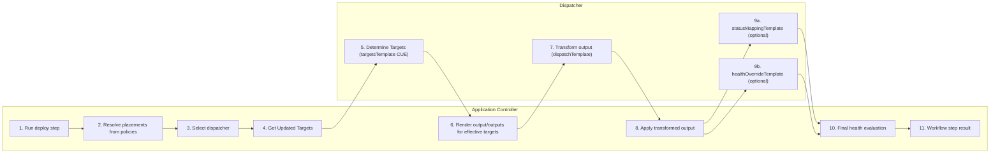
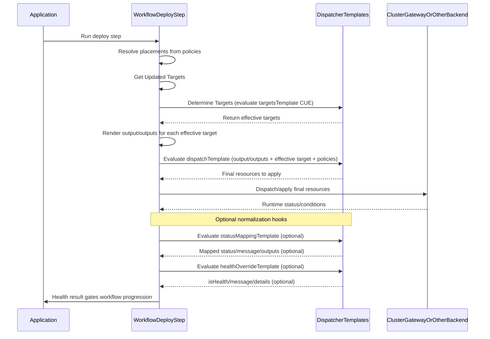
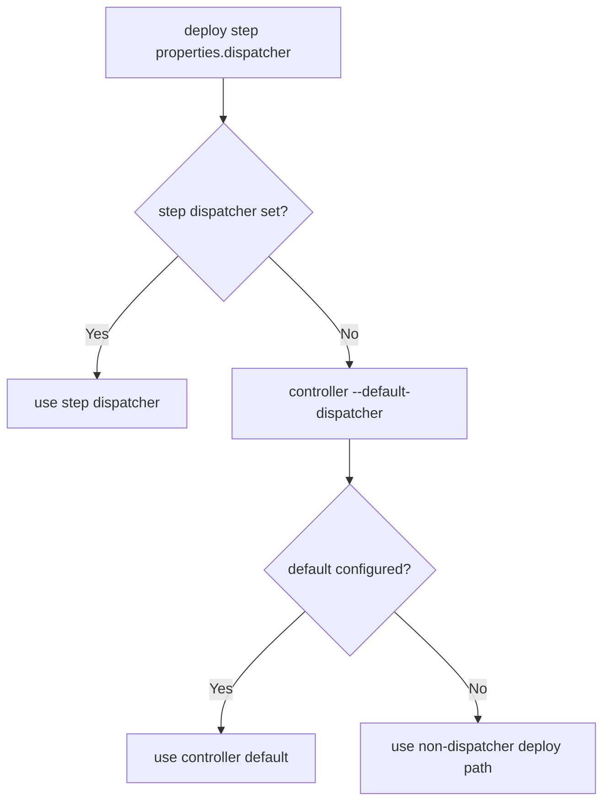
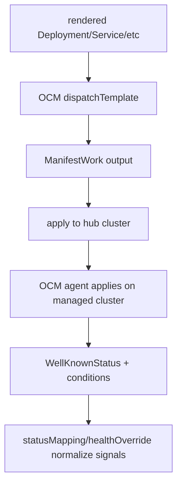

> ⚠️ **Early concept draft.** This KEP is an early-stage exploration. It is **incomplete and may be inaccurate**, its direction is unsettled, and it should not be relied upon for implementation or as a description of committed behaviour. Expect substantial change.

# KEP-2.4: Dispatcher Implementations

**Status:** Drafting (Not ready for consumption)  
**Parent:** [vNext Roadmap](../README.md)

A `Dispatcher` is the pluggable delivery mechanism the hub application-controller uses to place rendered resources onto target clusters. Each Dispatcher implementation handles a different cluster connectivity model.

This KEP defines the dispatcher feature contract first, then maps it to current baseline behavior and planned architecture.

## Feature Scope

Dispatcher defines **how** rendered application resources are delivered to target clusters, independently from:

- component authoring (`what`)
- policy/topology intent (`where`)
- workflow step orchestration (`when`)

Core feature responsibilities:

- resolve concrete targets from placement/topology inputs
- transform rendered workload/trait resources into dispatchable objects
- optionally map backend status into application-facing status
- optionally override health assessment when backend-specific signals are required

## Feature Contract (Current Baseline)

Current baseline uses a `Dispatcher` CR with CUE templates evaluated at runtime by the deploy workflow step.

Contracted template fields:

- `targetsTemplate`
- `dispatchTemplate`
- `statusMappingTemplate` (optional)
- `healthOverrideTemplate` (optional)

Contracted runtime behavior:

- `targetsTemplate` resolves cluster placement via `targets` (legacy `resolveTargets` remains accepted for compatibility).
- `dispatchTemplate` transforms rendered `output`/`outputs` into objects to apply.
- `statusMappingTemplate` can map transformed/live status back to component context.
- `healthOverrideTemplate` can directly set health/message/details and supersede default component health logic when provided.
- If `statusMappingTemplate` evaluation fails, health collection falls back to normal component health (non-fatal behavior).

## Architecture flow (code-informed)

The diagrams below describe the dispatcher flow as implemented in the reference implementation branch, and the code surface typically touched to evolve it.

### Dispatcher-enabled flow

Conceptually, the dispatcher-enabled path is:

1. **Application** owns the workflow.
2. Workflow executes the **deploy** step.
3. Deploy resolves **placement** from policies.
4. Deploy asks **Dispatcher** to resolve effective targets from baseline placements.
5. Deploy renders resources (`output`/`outputs`) for each effective target.
6. Deploy passes rendered resources + target context into **Dispatcher** for packaging/transform.
7. Deploy applies final resources through the delivery backend (for example cluster-gateway path).
8. Health/status gating returns to deploy/workflow progression.



#### Ownership boundary

- **Core controller/runtime responsibilities**
  - placement resolution from policies
  - component rendering
  - applying objects
  - health-gating workflow progression
- **Dispatcher responsibilities**
  - target interpretation via `targetsTemplate`
  - backend-specific packaging/dispatch object shape via `dispatchTemplate`
  - optional backend-aware status normalization via `statusMappingTemplate`
  - optional backend-aware health signals via `healthOverrideTemplate`

### Responsibility map (compact)

| Layer | Owns |
|---|---|
| Application controller | placement resolution, component rendering, applying returned objects, final workflow health gating |
| Dispatcher templates | target interpretation (`targetsTemplate`), object packaging (`dispatchTemplate`), optional status/health normalization |
| Delivery backend | object persistence/execution and backend-native status signals (for example direct API, cluster-gateway, OCM) |

### Routed sequence (handoff points)



### Dispatcher selection precedence



### OCM packaging path



### Change surface (implementation-oriented)

When evolving dispatcher behavior, changes usually span these areas:

- **Runtime selection and execution:** deploy workflow provider path that selects dispatcher, resolves targets, transforms output, and performs health gating.
- **Health/status integration:** application health collection path that consumes mapped status/override health without breaking default health behavior.
- **Controller defaults/config:** controller args/flags and bootstrapping logic that sets default dispatcher behavior.
- **Template/runtime packages:** internal CUE package registration exposed to dispatcher template evaluation (for example transform or multicluster helper functions).
- **Examples and docs:** dispatcher CR examples, deploy workflow examples, and environment setup guides used for validation and onboarding.

### Policy context and loose coupling

Dispatcher templates are evaluated with policy-derived context (for example `context.policies` and resolved placement/target inputs).
This creates an intentional loose coupling between policy design and dispatch implementation:

- policies define intent and backend-specific knobs
- dispatcher templates consume those values from context
- the controller runtime remains generic

As a result, dispatchers can start using new policy properties by updating CUE templates, without requiring underlying controller code changes for each policy evolution.

This keeps platform extensibility high while maintaining a stable dispatch runtime contract.

## Dispatcher Selection

### Current precedence

Dispatcher used by deploy workflow step:

1. Step-level dispatcher override in `deploy` step properties
2. Controller-level default dispatcher (`--default-dispatcher`, default `default`)

### Planned extensions

- Operator-level dispatcher type model on `KubeVela` CR
- Per-Application override annotations for migration
- Component-level dispatcher preference (future enhancement candidate)

## Compatibility and migration guarantees

### Default behavior compatibility

The `default` dispatcher is the compatibility anchor for migration.

- Controller default dispatcher remains `default` unless explicitly overridden.
- `default` must retain like-for-like behavior with current dispatch semantics.
- Switching to dispatcher-based routing should not change behavior for users who stay on `default`.

### Impact boundaries

- New behavior should only come from selecting a non-default dispatcher.
- Non-default dispatcher authoring/testing responsibility belongs to the dispatcher authoring team.
- Existing applications that do not opt into alternate dispatchers should see no behavioral impact.

### Guardrails

- Platform should enforce guardrails so `default` is treated as protected baseline behavior.
- Admission/policy validation should prevent direct unsafe mutation of `default` in production environments.
- Dispatcher validation should reject malformed templates before they can affect runtime paths.

## Failure semantics (current baseline)

| Stage | Failure behavior | Fallback |
|---|---|---|
| `targetsTemplate` evaluation | Dispatcher path fails for that step | none (explicit dispatcher contract failure) |
| `dispatchTemplate` evaluation | Dispatcher path fails for that step | none (cannot produce dispatch objects) |
| `statusMappingTemplate` evaluation | Non-fatal for health collection | default component health path continues |
| `healthOverrideTemplate` evaluation | Override not applied | default component health path continues |

For target resolution specifically, an empty dispatcher target result may fall back to baseline resolved placements, preserving progress where possible.

## Security and trust boundaries

Dispatcher templates can influence:

- target selection,
- dispatched object shape/content,
- status/health interpretation.

Therefore, dispatcher management is a platform-trust operation.

### Scope and ownership

- Dispatchers should be cluster-scoped in the target model.
- Creation/update rights should be limited to platform engineering (or equivalent trusted groups).

### RBAC and access control

- RBAC must restrict who can create/update dispatchers.
- Application create/update should be policy-checked so users can only reference dispatchers they are authorized to use (similar to protected definition usage patterns).
- Auditability should be maintained for dispatcher changes and application-to-dispatcher references.

## Non-goals (this KEP scope)

- Full verbatim parity of backend-native status objects for all resource types.
- Automatic correctness of custom dispatcher logic authored by end users.
- Component-level automatic dispatcher preference resolution (future extension).
- Full DispatcherDefinition + topology template lifecycle completion in this phase.

## Target Architecture (Planned): DispatcherDefinition CRD

Each dispatcher is planned to become a `DispatcherDefinition` custom resource (similar extensibility model to `ComponentDefinition` and `TraitDefinition`), with behavior expressed in CUE and loaded dynamically.

```yaml
apiVersion: core.oam.dev/v1beta1
kind: DispatcherDefinition
metadata:
  name: cluster-gateway
spec:
  # CUE template evaluated for dispatch/delete behavior.
  dispatchTemplate: |
    context: {
      component: {...}
      target: {
        clusterName: string
        namespace:   string
      }
      operation: "dispatch" | "delete"
    }
    output: {...}

  # CUE template evaluated to resolve topology config to targets.
  topologyResolveTemplate: |
    context: {
      config: {...}
    }
    targets: [...{
      clusterName: string
      namespace:   string
    }]

  # Name of the topology ConfigTemplate registered by this dispatcher.
  topologyConfigTemplate: cluster-gateway-topology
```

## Topology Schema Registration (Planned)

Each DispatcherDefinition is planned to ship a `topology.cue` schema that the operator registers as a `ConfigTemplate`. Teams then create named `Config` instances from those templates.

```
cluster-gateway-dispatcher/
  metadata.cue
  template.cue
  topology.cue
```

Planned topology template variants remain:

- `cluster-gateway-topology`
- `ocm-topology`
- `local-topology`

The migration objective remains unchanged: swap topology template + properties while keeping Application spec shape and `fromDependency` semantics stable.

## Relationship to KEP-2.17 (fromDependency)

The long-term contract remains: topology resolution should be dispatcher-agnostic, so hub dependency ordering can call a dispatcher-owned resolver to map named topology groups to target clusters before waiting on cross-cluster exports.

The current baseline partially prepares this path (dispatcher-driven target resolution via templates), while full `ResolveTopologyGroup` + ConfigTemplate-backed topology remains planned.

## Relationship to KEP-2.18 (ConfigTemplate & Config CRDs)

This KEP still depends on KEP-2.18 for the full dispatcher-owned topology template lifecycle. In the target design, the operator ensures required topology templates exist before dispatcher processing proceeds, and surfaces degraded conditions when required topology templates are missing.

## OCM rationale and examples

### Why dispatcher abstraction matters for OCM

OCM does not natively accept an arbitrary KubeVela `Component` object as the delivery unit.  
Its primary delivery contract is `ManifestWork`, which carries a list of Kubernetes manifests plus OCM-specific control/status fields.

That means an OCM delivery path currently requires wrapping rendered workload/trait resources into a `ManifestWork` envelope before dispatch.

Without a dispatcher abstraction, this often forces one of two poor outcomes:

- coupling component definitions directly to OCM resource shape, or
- creating separate OCM-specific component definitions.

The dispatcher model avoids this by keeping component definitions transport-agnostic and moving backend-specific packaging into dispatcher templates.

### Example: same component, different dispatch packaging

Given a single `webservice` component:

- default dispatcher path can dispatch rendered `Deployment`/`Service` directly
- OCM dispatcher path can transform the same rendered resources into one `ManifestWork`

So the application author keeps one component contract while platform teams choose delivery backend by dispatcher selection.

### OCM-specific dispatch shape (illustrative)

```yaml
apiVersion: work.open-cluster-management.io/v1
kind: ManifestWork
metadata:
  name: vela-ocm-web-<cluster>
  namespace: <ocm-work-namespace>
spec:
  workload:
    manifests:
      - <rendered Deployment>
      - <rendered Service>
  manifestConfigs:
    - resourceIdentifier: ...
      feedbackRules:
        - type: WellKnownStatus
```

In this model, OCM concerns (work namespace, naming, feedback rules, condition interpretation) stay in dispatcher logic, not in component definitions.

### Health/status implication

When dispatch target is `ManifestWork`, native workload health (`Deployment` status, etc.) is not always directly available in the same shape expected by default component health templates.

Dispatcher-level status mapping and health override exist to bridge this gap:

- `statusMappingTemplate` can normalize backend status into component-facing context
- `healthOverrideTemplate` can express pragmatic health using backend conditions (for example OCM applied/available signals)

This preserves one logical component definition while allowing backend-aware health semantics when needed.

### Lessons learned from OCM status mapping

During implementation, we attempted to map OCM `ManifestWork` feedback back into KubeVela status/health context in a way that preserved native workload semantics.
Two practical constraints emerged:

1. **Verbatim underlying workload status is hard to recover reliably**
   - OCM exposes status through `ManifestWork` condition/feedback abstractions rather than a guaranteed full passthrough of each underlying resource status object.
   - Different resource kinds expose different status shapes, and some kinds have little/no well-known feedback fields.
   - As a result, reconstructing "exact underlying status as if directly dispatched" is not consistently achievable.

2. **JSONPath-based extraction does not scale with flexible CUE outputs**
   - KubeVela component/trait rendering is highly flexible and may produce varied object graphs across definitions.
   - OCM feedback JSONPaths must be authored against concrete, stable field paths.
   - At scale, defining/maintaining JSONPaths for all required fields across diverse CUE-generated resources becomes brittle and high-cost.

Because of these constraints, the current pragmatic approach is:

- use OCM `WellKnownStatus` and condition signals as baseline backend truth,
- normalize useful feedback into dispatcher `details` where available,
- use dispatcher `healthOverrideTemplate` for explicit backend-aware health semantics,
- avoid assuming full, verbatim underlying status parity for all resource types.

This keeps dispatcher behavior predictable while preserving the long-term option to improve fidelity as backend capabilities evolve.

## Examples (Non-normative)

The following examples illustrate the contract, but are not the feature definition itself:

| Example Dispatcher | Mechanism | Topology resolution | Status |
|---|---|---|---|
| `local` | Direct API server write (same cluster) | Namespace selector only | Planned |
| `default` (cluster-gateway style) | Direct/cluster-gateway dispatch templates | Policy-derived placements via `targetsTemplate` | Available |
| `ocm-manifestwork` | OCM `ManifestWork` API | Hub target + OCM policy properties | Available |

### Example: custom dispatcher with `internal-topology` policy groups

This example shows how a platform team can:

1. create a custom dispatcher that understands internal cluster groups,
2. pass group intent via policy context,
3. set that dispatcher as the controller default so applications do not need per-step dispatcher overrides.

#### 1) Define an `internal-groups` dispatcher

```yaml
apiVersion: core.oam.dev/v1beta1
kind: Dispatcher
metadata:
  name: internal-groups
  namespace: vela-system
spec:
  schematic:
    cue:
      targetsTemplate: |
        // Read internal-topology policy from context.policies.
        _internal: [for p in context.policies if p.type == "internal-topology" {p}]
        _group: *"dev" | string
        if len(_internal) > 0 && _internal[0].properties != _|_ && _internal[0].properties.group != _|_ {
          _group: _internal[0].properties.group
        }

        // Example static group -> cluster mapping (illustrative).
        _clustersByGroup: {
          dev:  ["cluster-dev-1", "cluster-dev-2"]
          prod: ["cluster-prod-1", "cluster-prod-2"]
        }
        _clusters: _clustersByGroup[_group]

        targets: [
          for c in _clusters {
            cluster: c
            namespace: "default"
          },
        ]

      dispatchTemplate: |
        // Direct pass-through dispatch shape.
        output:  context.output
        outputs: context.outputs
```

#### 2) Use `internal-topology` policy in Application

```yaml
apiVersion: core.oam.dev/v1beta1
kind: Application
metadata:
  name: app-internal-groups
  namespace: default
spec:
  components:
    - name: web
      type: webservice
      properties:
        image: nginx
        ports:
          - port: 80
  policies:
    - name: internal-topology-prod
      type: internal-topology
      properties:
        group: prod
  workflow:
    steps:
      - name: deploy
        type: deploy
        properties:
          policies: ["internal-topology-prod"]
          # dispatcher omitted intentionally
```

#### 3) Set as controller default dispatcher

Set controller flag:

```bash
--default-dispatcher=internal-groups
```

With this default:

- applications can omit `workflow.steps[].properties.dispatcher`,
- deploy still routes through dispatcher logic,
- policy inputs (`internal-topology` group) stay loosely coupled from controller code and are consumed in CUE.

## Acceptance criteria

- Existing applications using the `default` dispatcher preserve current dispatch behavior without user-facing regressions.
- Dispatcher-enabled deploy supports target resolution, transform, apply, and health gating through dispatcher templates.
- OCM dispatcher can package rendered resources into `ManifestWork` while preserving one component definition contract.
- Status mapping failure does not hard-fail default health collection path.
- Controller-level default dispatcher selection works when step-level dispatcher is omitted.

## Open follow-ups

- Formalize transition from `Dispatcher` baseline CR to `DispatcherDefinition` target model.
- Define lifecycle and validation model for dispatcher-owned topology templates (`ConfigTemplate` integration).
- Specify protected-baseline policy for `default` dispatcher mutation prevention in production installs.
- Evaluate component-level dispatcher preference model and precedence contract.
