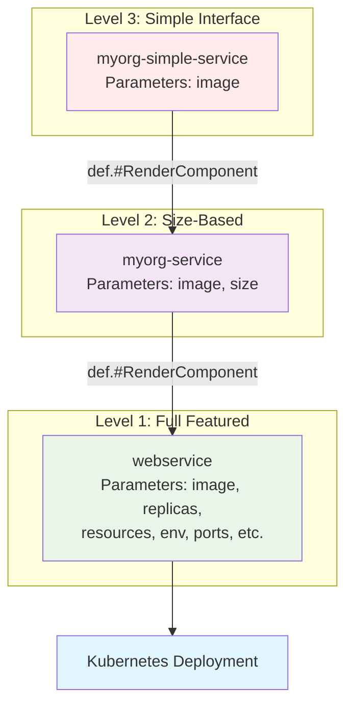
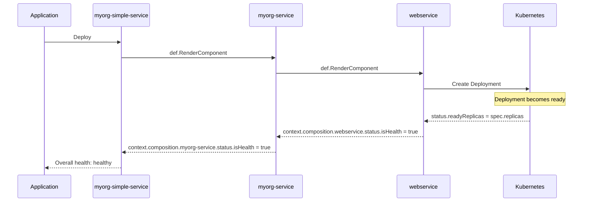

# Nested Definition Rendering

## Summary

Enable ComponentDefinitions (and eventually other X-Definitions) to reference and render other definitions through a new `def.#RenderComponent` function, allowing multi-layered abstraction and composition without code duplication.

## Background

Currently, KubeVela definitions cannot compose or reference other definitions, leading to significant code duplication when building layered abstractions. While traits help segregate optional functionality and cross-cutting concerns from core components, they don't address the need for multiple component variants with different interfaces and defaults. 

KubeVela ships with well-designed built-in components (webservice, worker, task, etc.) that contain effective logic for deploying applications. However, these components often expose too many configuration options for end users, creating confusion and potential for misconfiguration. Platform teams need to restrict these interfaces but currently must copy the entire component definition just to hide, preset, or simplify certain parameters.

For example, when using the built-in webservice component:
- **Advanced users** need access to all configuration options (replicas, resources, probes, etc.)
- **Standard users** need a simplified interface with just image and size (small/medium/large)
- **New users** need an even simpler "just give me a URL for my container" interface

Each interface level requires duplicating the core webservice logic rather than simply wrapping and restricting the existing component.

This limitation prevents:
- **Code reuse**: Every abstraction layer must duplicate the entire template with slight variances
- **Consistent updates**: Changes must be propagated manually across all copies
- **Progressive disclosure**: No way to wrap complex definitions with simpler interfaces
- **Composition patterns**: Cannot build definitions from existing building blocks

## Goals

- Enable definition composition where one definition can reference and render another (or multiple)
- Support parameter transformation between abstraction layers
- Maintain health status aggregation across composed definitions
- Preserve backward compatibility with existing definitions
- Enable RBAC-controlled abstraction through abstract definitions
- This should be flexible & developer-friendly functionality that fits naturally into existing template workflows, not a complex & prescriptive configuration framework. 

## Non-Goals

- Replace the existing definition system
- Support circular references between definitions
- Adding resource dependency orchestration; resources within components will still render and dispatch as a whole.

## Proposal

### Core Design

Introduce a `def.#RenderComponent` CUE function that allows definitions to reference and render other definitions:

```cue
template: {
  _rendered: def.#RenderComponent & {
    definition: "base-component"  // Name of definition to render
    properties: {                 // Parameters to pass
      // Transform parameters to pass to the base definition
    }
  }
  
  output: _rendered.output        // simple pass-through
  outputs: _rendered.outputs      // simple pass-through
}
```

### Implementation Details

#### 1. CUE Provider Package
Create a new `def` provider in `pkg/cue/def/` that:
- Leverages the CueX provider framework recently made available to components/traits (previously only accessible to workflows)
- Loads referenced ComponentDefinitions using `util.GetDefinition`
- Evaluates templates with provided parameters
- Returns rendered output as CUE values

#### 2. Composition Context Tracking
Track composition hierarchy through process context to enable:
- **Health Status Aggregation**: Parent definitions can access `context.composition.{name}.status.isHealth`
- **Status Message Propagation**: Custom status messages flow up through layers
- **Metadata Access**: Components know their composition hierarchy

**TODO**: Investigate exposing all rendered status fields (not just isHealth and message) to enable richer composition scenarios where parent definitions can access detailed status information from composed definitions - as compositions will not always do simple pass-throughs.

**ISSUE**: Multi-component compositions present challenges for health aggregation. When a definition composes multiple components (each with their own `output` and `outputs`), it becomes unclear which component's `output` should be considered the "primary" for health evaluation purposes. The current single-component composition model works well, but multi-component scenarios need further exploration to determine:
- How to aggregate health across multiple composed components
- Which component's output should be the primary health indicator  
- How to handle conflicting health states between composed components
- Whether parent definitions should define explicit health aggregation logic

**Potential Solution**: Modify `def.#RenderComponent` to return only `outputs` with the rendered `output` mapped to `outputs.$primary`. This would:
- Provide consistent structure for both single and multi-component compositions
- Allow parent definitions to access all composed components via `outputs.{name}`
- Leave health aggregation logic to the parent definition's discretion
- Require more complex health assessment logic but provide greater flexibility

This limitation should be addressed in future phases to support more complex composition patterns.

Context structure:
```
context.composition.{definitionName}: {
  name: string       // Instance name
  type: string       // Definition type
  namespace: string  // Namespace
  status: {
    isHealth: bool   // Aggregated health
    message: string  // Status message
    details: {...}   // Additional details
  }
}
```

#### 3. Abstract Definitions
Definitions marked as abstract in their CUE template:
```cue
// Abstract base component - too complex for direct use
"crossplane-rds": {
  attributes: {
    abstract: true  // This definition cannot be used directly
  }
  type: "component"
}
template: {
  parameter: {
    region: string
    engine: "postgres" | "mysql" | "mariadb"
    engineVersion: string
    instanceClass: string
    allocatedStorage: int
    storageType: "gp2" | "gp3" | "io1"
    iops: int
    multiAZ: bool
    publiclyAccessible: bool
    vpcSecurityGroupIds: [...string]
    dbSubnetGroupName: string
    backupRetentionPeriod: int
    backupWindow: string
    maintenanceWindow: string
    kmsKeyId: string
    enablePerformanceInsights: bool
    tags: [...{key: string, value: string}]
    // ... more configurations
  }
  // lots of templating logic
  output: {...}
  outputs: {...}
}

// Concrete implementation wrapping the abstract base
"tenant-database": {
  type: "component"
}
template: {
  _rds: def.#RenderComponent & {
    definition: "crossplane-rds"
    properties: {
      region: "us-west-2"  // Preset for compliance
      engine: "postgres"
      engineVersion: "14.7"
      instanceClass: parameter.size == "small" ? "db.t3.micro" : "db.t3.small"
      allocatedStorage: parameter.size == "small" ? 20 : 100
      storageType: "gp3"
      multiAZ: parameter.environment == "production"
      publiclyAccessible: false
      vpcSecurityGroupIds: ["sg-platform-rds"]
      dbSubnetGroupName: "platform-db-subnet"
      backupRetentionPeriod: parameter.environment == "production" ? 30 : 7
      backupWindow: "03:00-04:00"
      maintenanceWindow: "sun:04:00-sun:05:00"
      enablePerformanceInsights: parameter.environment == "production"
      tags: [
        {key: "Tenant", value: parameter.tenant}
        {key: "Environment", value: parameter.environment}
        {key: "ManagedBy", value: "Platform"}
      ]
      // All complex RDS options preset with secure defaults
    }
  }
  
  output: _rds.output
  parameter: {
    tenant: string
    environment: "development" | "staging" | "production"
    size: "small" | "large"
    // Only 3 simple parameters exposed to tenants
  }
}
```
- Cannot be instantiated directly in Applications
- Only accessible through `def.#RenderComponent`
- Enable hiding complex base definitions from end users
- Runtime validation prevents direct usage in Applications

### Technical Approach

1. **Avoid Circular Dependencies**: Create standalone `pkg/cue/def` package
2. **Compiler Modifications**: 
   - Modify the CUE compiler to accept workflow/process context during compilation
   - Ensure persistent CUE context across multiple compilation tasks to avoid "values not from same runtime" errors
   - Pass process context through compiler context for provider access
3. **Health Evaluation**: Extend `getTemplateContext()` to include composition data

## Examples

### Rendering Process Flow

```mermaid
flowchart LR
    A["User deploys<br/>myorg-simple-service<br/>image: nginx"] --> B["KubeVela evaluates<br/>template"]
    
    B --> C["Calls def.#RenderComponent"]
    
    subgraph S1 ["def.#RenderComponent Execution"]
        direction TB
        C --> D["1. Lookup myorg-service<br/>ComponentDefinition"]
        D --> E["2. Load CUE template"]
        E --> F["3. Create parameter context<br/>image: nginx<br/>size: m default"]
        F --> G["4. Compile and evaluate<br/>CUE template"]
        G --> H["5. Return rendered<br/>output and outputs"]
    end
    
    H --> I["Continue with<br/>myorg-service template<br/>execution"]
    
    I --> J["Generate final<br/>Kubernetes manifests"]
    
    style A fill:#e1f5fe
    style J fill:#c8e6c9
    style C fill:#fff3e0
    style S1 fill:#f5f5f5
```



### Composition Hierarchy



### Health Status Aggregation



### Three-Layer Composition

**Level 1: Base Component (webservice)**
```cue
webservice: {
  attributes: {
    status: {
      healthPolicy: #"""
        isHealth: context.output.status.readyReplicas == context.output.spec.replicas
      """#
    }
  }
  type: "component"
}
template: {
  output: {
    apiVersion: "apps/v1"
    kind: "Deployment"
    // Full deployment specification
  }
  parameter: {
    image: string
    replicas: int
    resources: {...}
    // All configuration options
  }
}
```

**Level 2: Size-Based Abstraction (myorg-service)**
```cue
"myorg-service": {
  attributes: {
    status: {
      healthPolicy: #"""
        isHealth: context.composition.webservice.status.isHealth
      """#
    }
  }
  type: "component"
}
template: {
  let sizeConfig = {
    s: {cpu: "100m", memory: "128Mi", replicas: 1}
    m: {cpu: "200m", memory: "256Mi", replicas: 2}
    l: {cpu: "500m", memory: "512Mi", replicas: 3}
  }
  
  _webservice: def.#RenderComponent & {
    definition: "webservice"
    properties: {
      image: parameter.image
      replicas: sizeConfig[parameter.size].replicas
      resources: {...}
    }
  }
  
  output: _webservice.output
  parameter: {
    image: string
    size: *"m" | "s" | "m" | "l"
  }
}
```

**Level 3: Minimal Interface (myorg-simple-service)**
```cue
"myorg-simple-service": {
  type: "component"
}
template: {
  _webapp: def.#RenderComponent & {
    definition: "myorg-service"
    properties: {
      image: parameter.image
      size: "m"  // Default everything
    }
  }
  
  output: _webapp.output
  parameter: {
    image: string  // Only required parameter
  }
}
```

### Use Cases

1. **Multi-Cloud Delegation**: Single "database" definition delegates to aws-rds, azure-sql, or gcp-cloudsql
2. **Interface Simplification**: Complex definitions wrapped with progressively simple interfaces
3. **Multi-component Services**: API gateway composing ingress + service + middleware
4. **Governance Wrappers**: Organization definitions wrapping base definitions with policies

## Progress / Timeline / Milestones

### Phase 1: Core Implementation (POC Phase)
- [x] `def.#RenderComponent` CUE function
- [x] Basic definition loading and rendering
- [x] Parameter transformation
- [x] Composition context tracking
- [x] Health status aggregation

### Phase 2: Production Readiness (v1.11)
- TBC

## Implementation Status

**POC Validation (2024-11-19)**:
- ✅ Working `def.#RenderComponent` implementation
- ✅ Three-layer composition demonstration (myorg-simple-service → myorg-service → webservice)
- ✅ Health status propagation working
- ✅ Process and template context integration

**Key Findings from POC**:
- Complex functionality can be achieved through the building blocks already provided by KubeVela and CueX
- Circular dependencies can be avoided through standalone package design
- Health evaluation needs template context extension
- Composition data must persist between rendering and health evaluation phases

## Breaking Changes

None - this is purely additive functionality. Existing definitions continue to work unchanged.

## Alternatives Considered

1. **Configurable Compositions**: More complex configuration-based system, less flexible than CueX functions, harder to maintain
2. **External Templating (Helm/Kustomize)**: Breaks unified CUE system, loses parameter validation, requires addons
3. **CueX Packages**: Work for reusable functions but not aimed at entire template encapsulation, can't handle definition lifecycle
4. **Status Quo**: Continue with code duplication - unmaintainable at scale