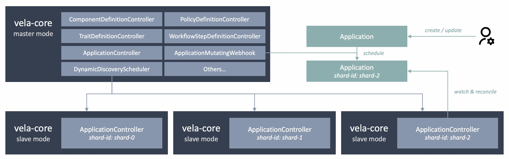

# Application Controller Sharding

### Background

As many adopters start to choose KubeVela to manage thousands of Applications in production, the performance issue becomes increasingly critical.

The typical Kubernetes controller usually run one controller to manage all related custom resources. The operator reconciliation is designed to be relatively lightweight. In KubeVela, to support customized delivery process and manage lifecycles of tens of resources in one application makes the reconciliation process heavier compared to typical controllers.

Although multiple replicas of KubeVela controller could provide high availability, in avoid of multiple concurrent reconciliation for the same application (which could lead to conflict problems), only one replica could work and this is achieved by acquiring the same leader-election lock.

So usually, users add more resources to KubeVela controller (more CPUs, Memory...) and set up more threads and larger rate limiter to support more applications in the system. This can lead to potential problems in different cases:
1. There are limitations for the growth of resources for a single KubeVela controller. If the Kubernetes cluster of the control plane uses lots of small machines, a single KubeVela controller can only run one of them, instead of spreading out.
2. The failure of the single KubeVela controller could block all the delivery process of applications. The failure could be caused by various reasons and some frequently seen reasons (like OOM or Crash due to some weird application input) are not recoverable by restarting controller.
3. In multi-tenancy scenario, there is no fairness that could be guaranteed if some users have a huge number of applications. They could make the controller run slow and users with a small number of applications could also be affected, due to the sharing of the single KubeVela controller.

Therefore, this KEP proposes to support dividing a single large KubeVela controller into multiple small application controllers for run.

### Proposal



When running with `--enable-sharding` arg in KubeVela core controller, the KubeVela core controller will run in sharding mode.
- If the `--shard-id` arg is set to `master`, this one will run in **master** mode.
- If the `--shard-id` arg is set to some other value, like `shard-0`, this one will run in **slave** mode.

#### master mode

The **master** mode will enable all the controllers, such as ComponentDefinitionController, TraitDefinitionController, ApplicationController, Webhooks, etc.

The application controller will only handle applications with the label `controller.core.oam.dev/scheduled-shard-id: master`, and only the applications, applicationrevisions and resourcetrackers that carries this label will be watched and cached.

By default, it will watch the pods within the same namespace as it runs. The pods with labels `app.kubernetes.io/name: vela-core` and carries `controller.core.oam.dev/shard-id` label key will be selected and their health status will be recorded. The selected ready pods will be registered as schedulable shards. The mutating Webhook will automatically assign shard-id for non-assigned applications when requests come in.

#### slave mode

The **slave** mode controller will only start the ApplicationController and will not enable others like Webhook or ComponentDefinitionController. It is dedicated to applications that carries the matched labels `controller.core.oam.dev/scheduled-shard-id=<shard-id>`.

### Example

First, install KubeVela with sharding enabled. This will let the KubeVela core controller deployed in **master** mode.

```shell
helm install kubevela kubevela/vela-core -n vela-system --set sharding.enabled=true
```

Second, deploy **slave mode** application controller.

There are different ways to do it.
1. Use addons for installation. `vela addon enable vela-core-shard-manager nShards=3`. Supported by https://github.com/kubevela/catalog/pull/606
2. Use kubectl to copy the deployment of **master** and modify it. `kubectl get deploy kubevela-vela-core -oyaml -n vela-system | sed 's/schedulable-shards=/shard-id=shard-0/g' | sed 's/instance: kubevela/instance: kubevela-shard/g' | sed 's/shard-id: master/shard-id: shard-0/g' | sed 's/name: kubevela/name: kubevela-shard/g' | kubectl apply -f -` This will create a copy of the **master** vela-core and run a **slave** replica with shard-id as *shard-0*.
3. Just create a new deployment and set the labels to match the above mentioned requirements.

> In the case you do not want dynamic discovery for available application controller, you can specify what shards are schedulable by add arg `--schedulable-shards=shard-0,shard-1` to the **master mode** vela-core.

### Future Work

This Webhook implemented will only schedule applications when
1. The application is going to be mutated (create or update).
2. The application has not been scheduled yet (no `controller.core.oam.dev/scheduled-shard-id` label).
3. There is available controller to assign (the **master mode** controller will not be automatically schedulable in order to divide the burden of handling application into **slave mode** controllers).

So it cannot handle re-schedule scenario and cannot make automatic scheduling for previous application.

For the next step, we can support:
1. `vela up <app-name> --shard-id <shard-id>` Use vela CLI to help user manually reschedule application. NOTE: reschedule application not only need to reset the label of that application but also need to reset the labels of related applicationrevisions and resourcetrackers.
2. Support a background scheduler or a scheduling script to make schedule for all unscheduled application.
3. Support `DisableAutoSchedule` for the case where user wants to disable the automatic schedule for the mutating webhook.
4. Observability tools (Prometheus, Loki, Grafana) should be able to collect data from all vela-core controllers in sharding mode.

### Extend Usage
1. The sharding package could potentially be moved to `kubevela/pkg` if later we find it also helpful for other controller like `kubevela/workflow`.
2. It is possible to let different shards to use different vela-core version so as to handle applications in multiple versions by different controller.
3. It is possible to let different tenant to use different vela-core controller to help improve fairness and reduce the damage scope when one controller fails.
4. The original multi-replica KubeVela core controller for high availability is deferred to each shard's deployment, which means each shard could have multiple replicas (and only one can work for one time, but multiple shards can be parallelized).

### Tech Details
1. Since the cache of Application/ApplicationRevision/ResourceTracker are divided into multiple shards, the memory consumption of each controller is expected to be divided as well. Other resources like `ConfigMap` (used by Workflow Context) are not divided.
2. The validating webhook needs to read ApplicationRevision when `publish-version` is set in application, but since ApplicationRevision is sharded, therefore the cache of the vela-core in **master mode** will not hold the ApplicationRevision. So here we use native Kubernetes API request to read ApplicationRevision. This may lead to performance drop for validating webhook and this is disabled by default when sharding enabled.

### FAQ

Q: What will happen when the master one is down?
A: If the webhook is enabled, the webhook will be down if the master one is down. Then the mutating webhook and validating webhook will fail so no new application creation or change will be accepted. Old applications that are scheduled to master will not be processed anymore. Others that are scheduled to other shards will not be affected. If the webhook is not enabled, then only applications scheduled to master shard will be affected. Users can still create or change applications in this case.

Q: What will happen when a slave mode controller is down?
A: For applications that are not scheduled to that shard, nothing will happen. For applications that are scheduled to the broken shard, succeeded applications will not run state-keep or gc but the delivered resources will not be touched. For applications that are still running workflow, they will not be handled but can be recovered instantly when the controller is restarted.

Q: What will happen if one user delete the sharding label while the application is already in running state?
A: If the webhook is enabled, this behaviour will be prevented. The sharding label will inherit the original one. If the webhook is not enabled, the application will not be handled anymore (no state-keep, no gc and no update).
