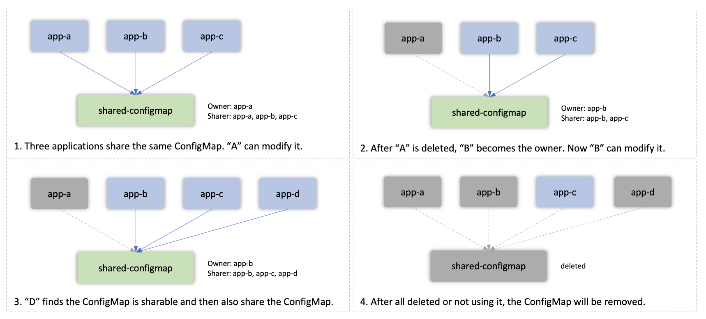
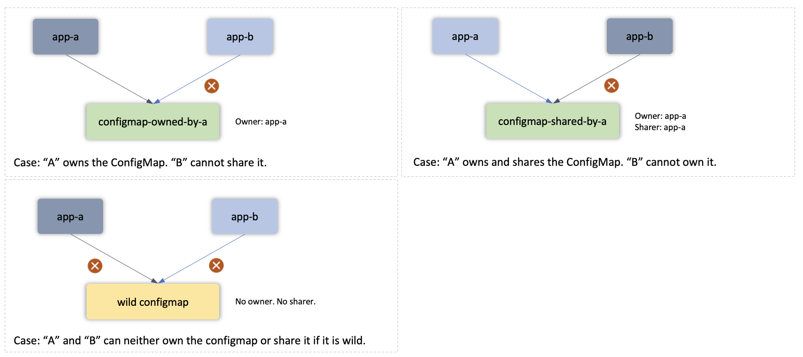

# Shared Resource

### Background

In KubeVela, by default, application **owns** resources.
It means that resources create by the application should only be controlled by the application that creates it.

So there are basically two requirements for application creating resources:
1. The resource must not exist before the application creating it. It exists, there will be a resource conflict error.
2. The resource is expected to be only manageable through its creator. "Others" should not be able to modify it or edit it.

While dispatching resources, the application will
1. Check if resource exists. If exists, check its labels. 
If "app.oam.dev/name" and "app.oam.dev/namespace" equals to the application's name and namespace, it means this resource is previously created by the same application and the dispatching operation now will become an update operation.
The two labels identify the owner of the resource.
2. If resource exists, but no label found, then this resource is created before this application. At this time, the application will report a resource conflict error.
3. If resource exists, and the labels point to another application, then this resource is managed by other applications. At this time, the current application will also report a resource conflict error.

With these checks, different applications cannot manage the same resource. 

### Usage

However, there are scenarios that these two requirements are not met. One of the scenarios is sharing across different Applications.
For example, each application wants to create a ConfigMap, but their ConfigMaps are the same.

To achieve that, KubeVela application could utilize the `shared-resource` policy to make it possible.

#### create

When one resource is created as sharing resource, one special annotation `app.oam.dev/shared-by` will be added to the resource.
It will record the "sharer" of the resource in time order. The application that firstly creates the resource will set its owner labels to itself.
Then it will add itself to the sharer annotation.

#### share

When another application comes and wants to share the resource, it will check if the resource is sharable, aka there is at least one sharer in the sharer annotation.
If it is sharable, it will add itself to the sharer annotation, but not modify the content of the resource.

#### delete

With this mechanism, only the owner of the resource can modify the resource (including updating and state-keeping). Other sharer can only see that resource.
When the owner of the resource is gone (application is deleted or do not use this resource anymore), it will give the owner of the application to the next sharer. If no sharer exists, it will finally delete that resource.

See the following figures for details.

