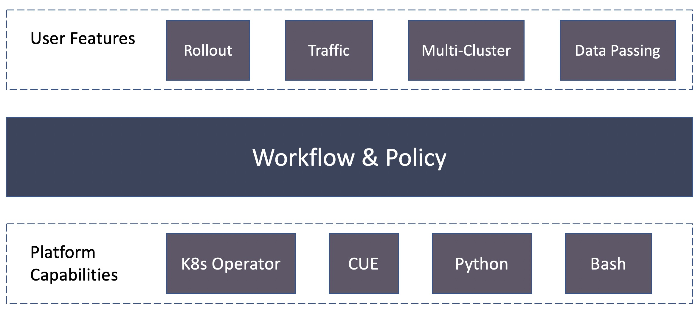
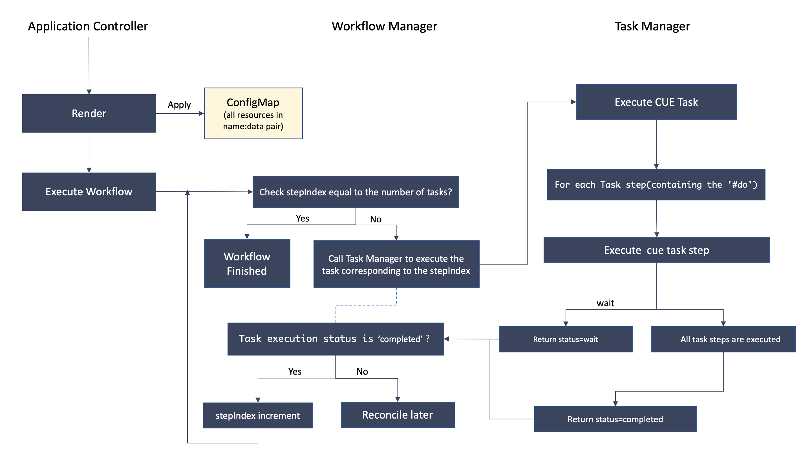

# Application-Level Policies and Customized Control-Logic Workflow Design

## Background

The current model consists of mainly Components and Traits.
While this enables the Application object to plug-in operational capabilities, it is still not flexible enough.
Specifically, it has the following limitations:

- The current control logic could not be customized. Once the Vela controller renders final k8s resources, it simply applies them without any extension points. In some scenarios, users want to do more complex operations like:
  - Blue-green style upgrade of the app.
  - User interaction like manual approval/rollback.
  - Distributing workloads across multiple clusters.
  - Actions to enforce policies and audit.
  - Pushing final k8s resources to other config store (e.g. Git repos).
- There is only per-component config, but no application-level policies. In some scenarios, users want to define policies like:
  - Security: RBAC rules, audit settings, secret backend types.
  - Insights: app delivery lead time, frequence, MTTR.

Here is an overview of the features we want to expose and the capabilities we want to plug in:



## Proposal

To resolve the aforementioned problems, we propose to add app-level policies and customizable workflow to the Application CRD:

```yaml
kind: Application
spec:
  components: ...

  # Policies are rendered after components are rendered but before workflow are started
  policies:
    - type: security
      name: my-rule
      properties:
        rbac: enabled
        audit: enabled
        secretBackend: vault

    - type: deployment-insights
      name: my-deploy-insight
      properties:
        leadTime: enabled
        frequency: enabled
        mttr: enabled

  # workflow is used to customize the control logic.
  # If workflow is specified, Vela won't apply any resource, but provide rendered resources in a ConfigMap, referenced via AppRevision.
  # workflow steps are executed in array order, and each step:
  # - will have a context in annotation.
  # - should mark "finish" phase in status.conditions.
  workflow:

    # suspend can manually stop the workflow and resume. it will also allow suspend policy for workflow.
    suspend:
      manual: true

    steps:

    # blue-green rollout
    - type: blue-green-rollout
      stage: post-render # stage could be pre/post-render. Default is post-render.
      properties:
        partition: "50%"

    # traffic shift
    - type: traffic-shift
      properties:
        partition: "50%"

    # promote/rollback
    - type: rollout-promotion
      properties:
        manualApproval: true
        rollbackIfNotApproved: true
```

This also implicates we will add two Definition CRDs -- `PolicyDefinition` and `WorkflowStepDefinition`.

PolicyDefinition looks like below:

```yaml
apiVersion: core.oam.dev/v1beta1
kind: PolicyDefinition
spec:
  schematic:
    cue:
      template: |
        parameters: {
          frequency: *"enabled" | "disabled"
        }
        output: {
          apiVersion: app.oam.dev/v1
          kind: Insight
          spec:
            frequency: parameters.frequency
        }
```

### CUE-Based Workflow Task

Outputing a CR object to complete a task in workflow requires users to implement an Operator which incurs heavy overhead.
To simplify it, especially for users with simple use cases, we decide to provide lightweight CUE based workflow task.

```yaml
apiVersion: core.oam.dev/v1beta1
kind: WorkflowStepDefinition
metadata:
  name: apply
spec:
  schematic:
    cue:
      template: |
        import "vela/op"

        parameters: {
          image: string
        }

        apply: op.#Apply & {
          resource: context.workload
        }

        wait: op.#ConditionalWait & {
          continue: apply.status.ready == true
        }

        export: op.#Export & {
          secret: apply.status.secret
        }
```

### Stability mechanism

#### Backoff Time

Sometimes a workflow step can take a long time, so we need a backoff time for workflow reconciliation.

If the status of workflow step is `waiting` or `failed`, the workflow will be reconciled after a backoff time like below:

```
int(0.05 * 2^(n-1))
```

Based on the above formula, we will take `1s` and `600s` as our min and max time.

For example, if the workflow is `waiting`, the first ten reconciliation will be like:

| Times | 2^(n-1) | 0.05*2^(n-1) | Requeue After(s) |
| ------ | ------ | ------ | ------ |
| 1 | 1 | 0.05 | 1 |
| 2 | 2 | 0.1 | 1 |
| 3 | 4 | 0.2 | 1 |
| 4 | 8 | 0.4 | 1 |
| 5 | 16 | 0.8 | 1 |
| 6 | 32 | 1.6 | 1 |
| 7 | 64 | 3.2 | 3 |
| 8 | 128 | 6.4 | 6 |
| 9 | 256 | 12.8 | 12 |
| 10 | 512 | 25.6 | 25 |
| ... | ... | ... | ... |

#### Failed Workflow Steps

If the workflow step is `failed`, it means that there may be some error in the workflow step, like some cue errors.

> Note that if the workflow step is unhealthy, the workflow step will be marked as `wait` but not `failed` and it will wait for healthy.

For this case, we will retry the workflow step 10 times, and if the workflow step is still `failed`, we will suspend this workflow, and it's message will be `The workflow suspends automatically because the failed times of steps have reached the limit(10 times)`.

After the workflow is suspended, we can change the workflow step to make it work, and then use `vela workflow resume <workflow-name>` to resume it.

## Implementation

In this section we will discuss the implementation details for supporting policies and workflow tasks.

Here's a diagram of how workflow internals work:




### 1. Application Controller

Here are the steps in Application Controller:

- On reconciling an Application event, Application Controller will render out all resources from components, traits, policies.
  It will also put rendered resources into a ConfigMap, and reference the ConfigMap name in AppRevision as below:

  ```yaml
  kind: ApplicationRevision
  spec:
    ...
    resourcesConfigMap:
      name: my-app-v1
  ---

  kind: ConfigMap
  metadata:
    name: my-app-v1
  data:
    mysvc: |
      {
        "apiVersion": "apps/v1",
        "kind": "Deployment",
        "metadata": {
            "name": "mysvc"
        },
        "spec": {
            "replicas": 1
        }
      }
    ...more name:data pairs...
  ```

- After render, Application Controller will execute `spec.workflow`.
  This will basically call Workflow Manager to execute workflow tasks starting from scratch or last-run step on retry.


### 2. Workflow Manager

Here are the steps in Workflow Manager:

- The Workflow Manager will get the current workflow step via `status.workflow.stepIndex`.
- If stepIndex is equal to the length of the all steps, it indicates that workflow is all done and return immediately.
- If there are workflow tasks left, they will be run step by step. For each step, Workflow Manager will call Task Manager to handle it.
- On return from calling Task Manager, Workflow Manager checks the return result:
  - If `status = completed`, Workflow Manager will increment `status.workflow.stepIndex`, and continue to run next step if any.
  - Otherwise, it will retry later.

### 3. Task Manager

Here are the steps in Task Manager:

- A workflow task will be executed synchronously which requires that the steps of a task should be non-blocking.
- A workflow task will be parsed with its properties first to retrieve the full CUE data.
- Task manager will get all do-able steps from the CUE data. This is done by analyzing if the step has a `#do` field.
  Here is an example:

  ```
  apply: op.#Apply & {
    resource: ...
  }
  ```

  The `op.#Apply` contains a [hidden field][2] `#do`:

  ```yaml
  #Apply: {
    #do: "apply"
    ...
  }
  ```

  This will inject the `#do` field to the `apply` step.

- All do-able steps will be executed one by one by Task Manager.


### 4. CUE Step Execution

- Task Manager will keep a map of actions.
  An action follows this interface:

  ```go
  type TaskAction interface {
    // cueValue is the parsed CUE value for this action
    Run(cueValue interface{}) (TaskStatus, error)
  }
  ```

- Task Manager will use the `#do` field of the CUE step as the key to find an action to run.

- An action returns a status indicating what to do next:
  - continue: continue to run the next action.
  - wait: makes the workflow manager to retry later.
  - break: makes the workflow manager to stop the entire workflow.

- Task Manager will change status as needed based on the returned TaskStatus, e.g. change to wait. 


## Task Action

These are the task actions to be supported in `vela/op` CUE lib:


- Load: loads the rendered component resources

  ```
  #Load: {
    #do: "load"
    component?: string
  }
  ```

- KubeRead: reads a k8s resource object

  ```
  #Read: {
    #do: "read"
    apiVersion: string
    kind: string
    namespace: string
    name: string
  }
  ```

- Apply: applies a k8s resource object

  ```
  #Apply: {
    #do: "apply"
    resource: string
  }
  ```

- Wait: waits until the `continue` condition is ready, otherwise makes the controller to reconcile later.

  ```
  #Wait: {
    #do: "wait"
    continue: bool
  }
  ```

- Break: breaks from the workflow, and reports reasoning message.

  ```
  #Break: {
    #do: "break"
    message: string
  }
  ```


- Export: exports the data into context for other workflow tasks to reuse

  ```
  #Export: {
    #do: "export"
    type: "patch" | *"var"
    if type == "patch" {
      component: string
    }
    value: _
  }
  ```

## Workflow Operation

These are the operations that users can use to control the workflow at global level.

### 1. Terminate Workflow

If the execution of the workflow does not meet expectations, it may be necessary to terminate the workflow

There are two ways to achieve that:

1. Modify the `workflow.terminated` field in status

```yaml
  kind: Application
  metadata:
    name: foo
  status:
    phase: runningWorkflow
    workflow:
      stepIndex: 1
      terminated: true
      steps:
      - name: ...
```


2. Use `op.#Break` in workflowStep definition. When the task is executed, the op.#Break can be captured and then report terminated status

```yaml
if job.status == "failed"{
  break: op.#Break & {
      message: "job failed: "+ job.status.message
  }
}
```

### 2. Pause Workflow

1. Modify the value of the `workflow.suspend` field to true to pause the workflow

```yaml
kind: Application
metadata:
  name: foo
status:
  phase: runningWorkflow
  workflow:
    stepIndex: 1
    suspend: true
    steps:
    - name: ...
```

2. The built-in suspend task support pause workflow, the example as follow

```yaml
kind: Application
spec:
  components: ...
workflow:
  steps:
  - name: manual-approve
    type: suspend
```

The `workflow.suspend` field will be set to true after the suspend-type task is started

### 3. Resume Workflow

Modify the value of the `workflow.suspend` field to false to resume the workflow

```yaml
kind: Application
metadata:
  name: foo
status:
  phase: runningWorkflow
  workflow:
    stepIndex: 1
    suspend: false
    steps:
    - name: ...
 ```

### 4. Restart Workflow

The workflow will be restarted in the following two cases:

1. Modify the value of the `status.phase` field to "runningWorkflow" and clear the status of the workflow

```yaml
kind: Application
metadata:
  name: foo
status:
  phase: runningWorkflow
  workflow: {}
 ```


2. The application spec changes

The spec change also means that the application needs to be re-executed, and the application controller will clear the status of application includes workflow status.


## Operator Best Practice

Each workflow task has similar interactions with Task Manager as follows:

- The Task Manager will apply the workflow object with annotation `app.oam.dev/workflow-context`. This annotation will pass in the context marshalled in json defined as the following:
  ```go
  type WorkflowContext struct {
    AppName string
    AppRevisionName string
    StepIndex int
  }
  ```

- The workflow object's status condition should turn to be `True` status and `Succeeded` reason, and `observedGeneration` to match the resource's generation per se.
  This is to solve the [issue of passing data from the old generation][1].
  We will provide CUE op library to check this condition to decide whether to wait.

  ```yaml
  kind: SomeTask
  metadata:
    generation: 2
  status:
    observedGeneration: 2
    conditions:
      - type: workflow-progress
        status: 'True'
        reason: 'Succeeded'
  ```

## Use Cases

In this section we will walk through how we implement workflow solutions for the following use cases.

### Case 1: Multi-cluster

In this case, users want to distribute workflow to multiple clusters. The dispatcher implementation is flexible and could be based on [open-cluster-management](https://open-cluster-management.io/) or other methods.

```yaml
workflow:
  steps:
  - type: open-cluster-management
    properties:
      placement:
        - clusterSelector:
            region: east
          replicas: "70%"
        - clusterSelector:
            region: west
          replicas: "20%"
```

The process goes as:

- During infra setup, the Cluster objects are applied and agents are setup in each cluster to manage lifecycle of k8s clusters.
- Once the Application is applied, the OCM controller can retrieve all rendered resources from AppRevision. It will apply a ManifestWork object including all resources. Then the OCM agent will execute the workload creation in each cluster.

### Case 2: Blue-green rollout

In this case, users want to rollout a new version of the application components in a blue-green rolling upgrade style.

```yaml
workflow:
  steps:
  # blue-green rollout
  - type: blue-green-rollout
    properties:
      partition: "50%"

  # traffic shift
  - type: traffic-shift
    properties:
      partition: "50%"

  # promote/rollback
  - type: rollout-promotion
    properties:
      manualApproval: true
      rollbackIfNotApproved: true
```

The process goes as:

- By default, each modification of the Application object will generate an AppRevision object. The rollout controller will get the current revision from the context and retrieve the previous revision via kube API.
- Then the rollout controller will do the operation to rollings replicas between two revisions (the actual behavior depends on the workload type, e.g. Deployment or CloneSet).
- Once the rollover is done, the rollout controller can shift partial traffic to the new revision too.
- The rollout controller will wait for the manual approval. In this case, it is in the status of Rollout object:
  ```yaml
  kind: Rollout
  status:
    pause: true # change this to false
  ```

  The reference to the rollout object will be in the Application object:
  ```yaml
  apiVersion: core.oam.dev/v1beta1
  kind: Application
  status:
    workflow:
      steps:
      - type: rollout-promotion
        resourceRef:
          kind: Rollout
          name: ...
  ```

### Case 3: Data Passing

In this case, users want to deploy a database component first, wait the database to be up and ready, and then deploy the application with database connection secret.

```yaml
components:
  - name: my-db
    type: mysql
    properties:

  - name: my-app
    type: webservice


workflow:
  steps:
  - type: apply-component
    properties:
      name: my-db

  # Wait for the MySQL object's status.connSecret to have value.
  - type: conditional-wait
    properties:
      resourceRef:
        apiVersion: database.example.org/v1alpha1
        kind: MySQLInstance
        name: my-db
      conditions:
        - field: status.connSecret
          op: NotEmpty

  # Patch my-app Deployment object's field with the secret name
  # emitted from MySQL object. And then apply my-app component.
  - type: apply-component
    properties:
      name: my-app
      patch:
        to:
          field: spec.containers[0].envFrom[0].secretRef.name
        valueFrom:
          apiVersion: database.example.org/v1alpha1
          kind: MySQLInstance
          name: my-db
          field: status.connSecret

```

### Case 4: GitOps rollout

In this case, users just want Vela to provide final k8s resources and push them to Git, and then integrate with ArgoCD/Flux to do final rollout. Users will setup a GitOps workflow like below:

```yaml
workflow:
  steps:
  - type: gitops # This part configures how to push resources to Git repo
    properties:
      gitRepo: git-repo-url
      branch: branch
      credentials: ...
```

The process goes as:

- Everytime an Application event is triggered, the GitOps workflow controller will push the rendered resources to a Git repo. This will trigger ArgoCD/Flux to do continuous deployment.

### Case 5: Template-based rollout

In this case, a template for Application object has already been defined. Instead of writing the `spec.components`, users will reference the template and provide parameters/patch to it.

```yaml
workflow:
  steps:
  - type: helm-template
    stage: pre-render
    properties:
      source: git-repo-url
      path: chart/folder/path
      parameters:
        image: my-image
        replicas: 3
---
workflow:
  steps:
  - type: kustomize-patch
    stage: pre-render
    properties:
      source: git-repo-url
      path: base/folder/path
      patch:
        spec:
          components:
            - name: instance
              properties:
                image: prod-image
```

The process goes as:

- On creating the application, app controller will apply the HelmTemplate/KustomizePatch objects, and wait for its status.
- The HelmTemplate/KustomizePatch controller would read the template from specified source, render the final config. It will compare the config with the Application object -- if there is difference, it will write back to the Application object per se.
- The update of Application will trigger another event, the app controller will apply the HelmTemplate/KustomizePatch objects with new context. But this time, the HelmTemplate/KustomizePatch controller will find no diff after the rendering. So it will skip this time.

## Considerations

### Comparison with Argo Workflow/Tekton

The workflow defined here are k8s resource based and very simple one direction workflow. It's mainly used to customize Vela control logic to do more complex deployment operations.

While Argo Workflow/Tekton shares similar idea to provide workflow functionalities, they are container based and provide more complex features like parameters sharing (using volumes and sidecars). More importantly, these projects couldn't satisfy our needs. Otherwise we can just use them in our implementation.

[1]: https://github.com/crossplane/oam-kubernetes-runtime/issues/222
[2]: https://cuetorials.com/overview/scope-and-visibility/#hidden-fields-and-values