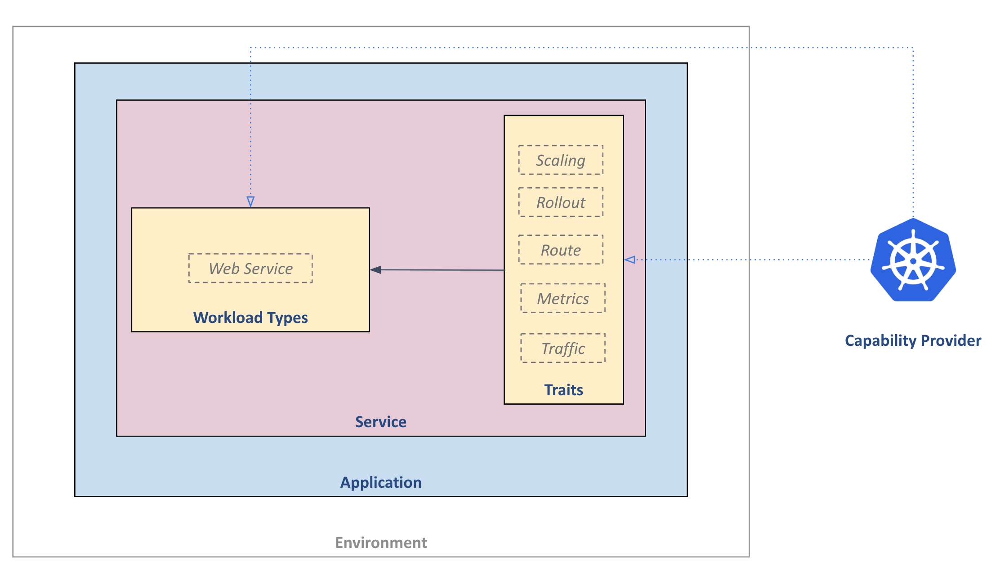

# Concepts and Glossaries

This documentation lists and explains technical terms used in KubeVela, such as "applications", "services", "workload types", "traits" etc., in the point of view of an application developer. The goal is to clarify their meanings in the context of KubeVela.

## Overview

## Capability
A Capability is a functionality provided by the runtime infrastructure (i.e. Kubernetes) that can support to run and operate your application. "Workload types" and "traits" are two typical categories of capabilities defined in KubeVela.

## Workload Type
The workload type declares the characteristics that directs the runtime infrastructure to properly support your code to run. The typical workload type could be a "long running service", or a "one-time off task" that can all be instantiated as part of your applications.

## Trait
A trait represents a piece of optional configurations that attaches to the instance of workload type. Traits augment workload type with operational features such as load balancing policy, network ingress routing, circuit breaking, rate limiting, auto-scaling policies, upgrade strategies, and more.

## Service
A service represents runtime configurations (i.e. workload type and traits settings) to make your code up and running on Kubernetes. Service is the descriptor of a basic deployable unit in KubeVela.

## Application
An Application in KubeVela is a collection of services and the high level description of the software you're trying to build and ship. An example could be an application named "website" which is composed by two services "frontend" and "backend", or, a "wordpress" application which is composed by "php-server" and "database".

An application is defined by `vela.yaml` in KubeVela.

## Environment
Before releasing an application to production, it's important to be able to test the code in n testing/staging workspaces. In KubeVela we describe these workspaces as "deployment environments" or "environments" for short. Each environment can have its own name and configuration (e.g., domain, Kubernetes namespace, configuration data, access control policy etc.) allowing you to create different deployment environments such as "test" and "production". 
