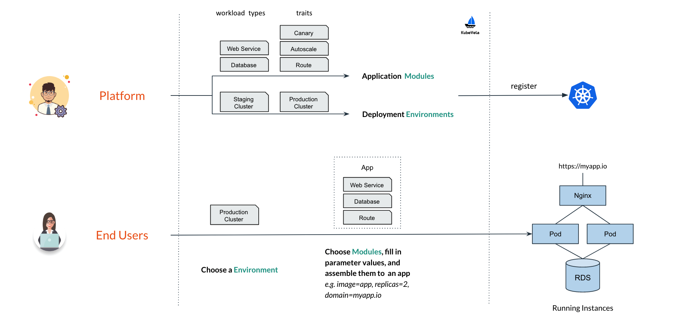
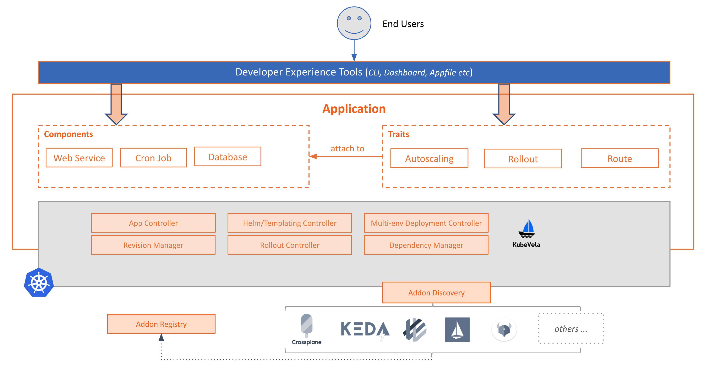

*"KubeVela is a scalable way to create PaaS-like experience on Kubernetes"*

In this documentation, we will explain the core idea of KubeVela and clarify some technical terms that are widely used in the project.

## Overview

First of all, KubeVela introduces a workflow with separate of concerns as below:
- **Platform Team**
  - Defining templates for deployment environments and reusable capability modules to compose an application, and registering them into the cluster.
- **End Users**
  - Choose a deployment environment, model and assemble the app with available modules, and deploy the app to target environment.

Below is how this workflow looks like:



This template based workflow make it possible for platform team enforce best practices and deployment confidence with a set of Kubernetes CRDs, and give end users a *PaaS-like* experience (*i.e. app-centric, higher level abstractions, self-service operations etc*) by natural.


Below are the core building blocks in KubeVela that make this happen.

## `Application`
The *Application* is the core API of KubeVela. It allows developers to work with a single artifact to capture the complete application definition with simplified primitives.

### Why Choose `Application` as the Main Abstraction

Having an "application" concept is important to any developer-centric platform to simplify administrative tasks and can serve as an anchor to avoid configuration drifts during operation. Also, as an abstraction object, `Application` provides a much simpler path for on-boarding Kubernetes capabilities without relying on low level details. For example, a developer will be able to model a "web service" without defining a detailed Kubernetes Deployment + Service combo each time, or claim the auto-scaling requirements without referring to the underlying KEDA ScaleObject.

### Example

An example of `website` application with two components (i.e. `frontend` and `backend`) could be modeled as below:

```yaml
apiVersion: core.oam.dev/v1beta1
kind: Application
metadata:
  name: website
spec:
  components:
    - name: backend
      type: worker
      properties:
        image: busybox
        cmd:
          - sleep
          - '1000'
    - name: frontend
      type: webservice
      properties:
        image: nginx
      traits:
        - type: autoscaler
          properties:
            min: 1
            max: 10
        - type: sidecar
          properties:
            name: "sidecar-test"
            image: "fluentd"
```

## Building the Abstraction

Unlike most of the higher level platforms, the `Application` abstraction in KubeVela is fully extensible and does not even have fixed schema. Instead, it is composed by building blocks (app components and traits etc.) that allow you to onboard platform capabilities to this application definition with your own abstractions.

The building blocks to abstraction and model platform capabilities named `ComponentDefinition` and `TraitDefinition`.

### ComponentDefinition

You can think of `ComponentDefinition` as a *template* for workload type. It contains template, parametering and workload characteristic information as a declarative API resource. 

Hence, the `Application` abstraction essentially declares how users want to **instantiate** given component definitions. Specifically, the `.type` field references the name of installed `ComponentDefinition` and `.properties` are the user set values to instantiate it. 

Some typical component definitions are *Long Running Web Service*, *One-time Off Task* or *Redis Database*. All component definitions expected to be pre-installed in the platform, or provided by component providers such as 3rd-party software vendors.

### TraitDefinition

Optionally, each component has a `.traits` section that augments the component instance with operational behaviors such as load balancing policy, network ingress routing, auto-scaling policies, or upgrade strategies, etc.

You can think of traits as operational features provided by the platform. To attach a trait to component instance, the user will use `.type` field to reference the specific `TraitDefinition`, and `.properties` field to set property values of the given trait. Similarly, `TraitDefiniton` also allows you to define *template* for operational features.

We also reference component definitions and trait definitions as *"capability definitions"* in KubeVela. 

## Environment
Before releasing an application to production, it's important to test the code in testing/staging workspaces. In KubeVela, we describe these workspaces as "deployment environments" or "environments" for short. Each environment has its own configuration (e.g., domain, Kubernetes cluster and namespace, configuration data, access control policy, etc.) to allow user to create different deployment environments such as "test" and "production".

Currently, a KubeVela `environment` only maps to a Kubernetes namespace, while the cluster level environment is work in progress.

### Summary

The main concepts of KubeVela could be shown as below:


## Architecture

The overall architecture of KubeVela is shown as below:



Specifically, the application controller is responsible for application abstraction and encapsulation (i.e. the controller for `Application` and `Definition`). The rollout controller will handle progressive rollout strategy with the whole application as a unit. The multi-env deployment engine (*currently WIP*) is responsible for deploying the application across multiple clusters and environments. 
