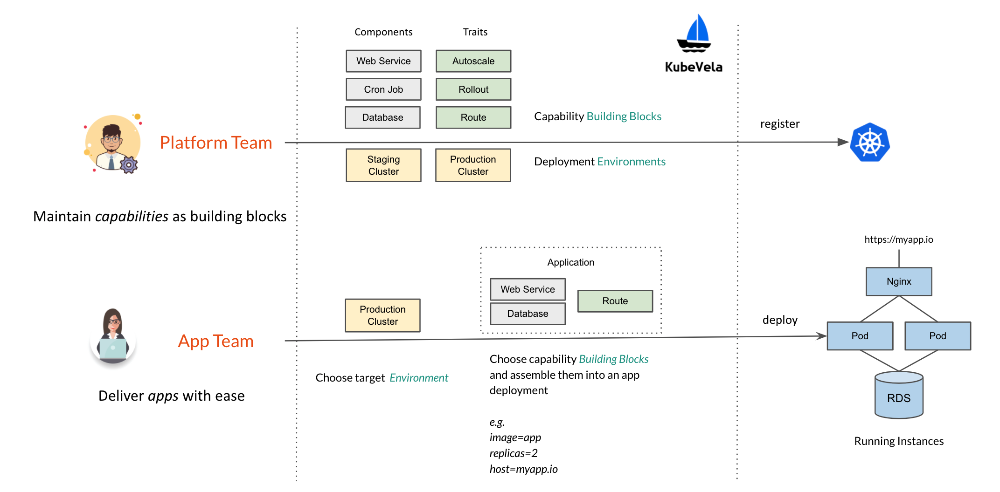
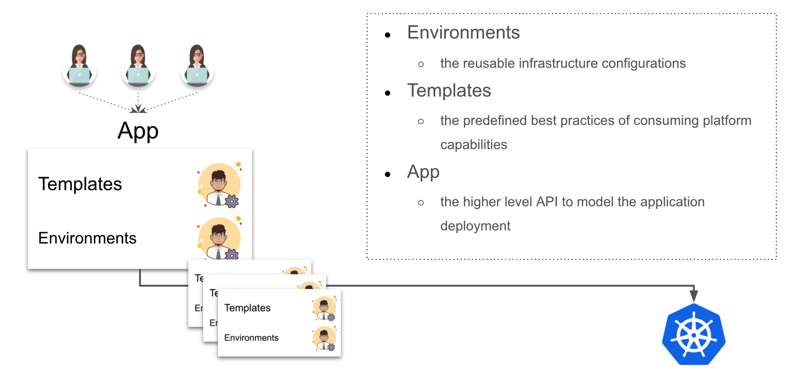
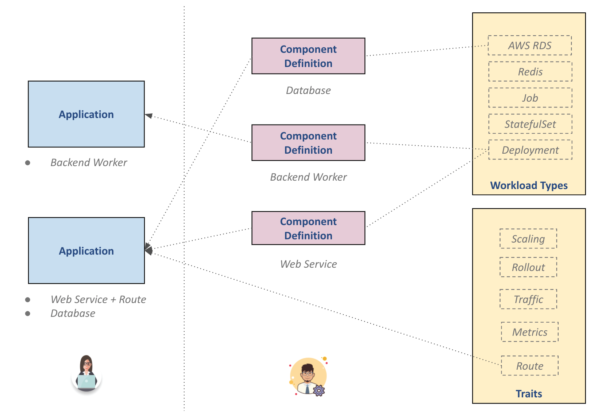
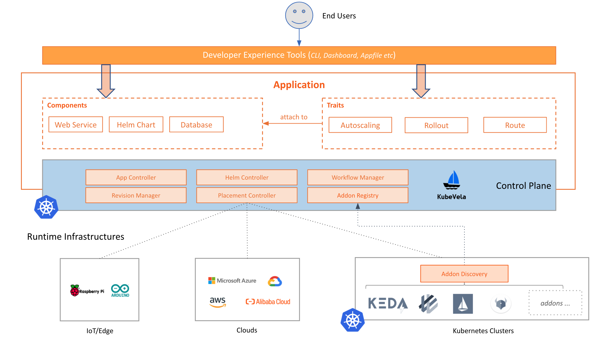

In this documentation, we will explain the core idea of KubeVela and clarify some technical terms that are widely used in the project.

## Overview

First of all, KubeVela introduces a workflow with separate of concerns as below:
- **Platform Team**
  - Model and manage platform capabilities as components or traits, together with deployment environment configurations.
- **End Users**
  - Choose a deployment environment, assemble the app with available components and traits per needs, and then deploy the app to target environment.

Below is how this workflow looks like:



This design make it possible for platform team to enforce best practices by *coding* platform capabilities into reusable building blocks, and leverage them to expose a *PaaS-like* experience (*i.e. app-centric abstractions, self-service workflow etc*) to end users.

Also, as programmable components, all capabilities in KubeVela can be updated or extended easily per your needs at any time.



In the model layer, KubeVela leverages [Open Application Model (OAM)](https://oam.dev) to make above design happen.

## `Application`

The *Application* is the core API of KubeVela. It allows developers to work with a single artifact to capture the complete application deployment with simplified primitives.

In application delivery platform, having an "application" concept is important to simplify administrative tasks and can serve as an anchor to avoid configuration drifts during operation. Also, it provides a much simpler path for on-boarding Kubernetes capabilities to end users without relying on low level details. For example, a developer will be able to model a "web service" without defining a detailed Kubernetes Deployment + Service combo each time, or claim the auto-scaling requirements without referring to the underlying KEDA ScaleObject.

### Example

An example of `website` application with two components (i.e. `frontend` and `backend`) could be modeled as below:

```yaml
apiVersion: core.oam.dev/v1beta1
kind: Application
metadata:
  name: website
spec:
  components:
    - name: backend
      type: worker
      properties:
        image: busybox
        cmd:
          - sleep
          - '1000'
    - name: frontend
      type: webservice
      properties:
        image: nginx
      traits:
        - type: autoscaler
          properties:
            min: 1
            max: 10
        - type: sidecar
          properties:
            name: "sidecar-test"
            image: "fluentd"
```

The `Application` resource in KubeVela is a LEGO-style entity and does not even have fixed schema. Instead, it is composed by several building blocks (app components and traits etc.) that gives you full flexibility to model platform capabilities around the application's needs.

These building blocks named `ComponentDefinition` and `TraitDefinition`.

### `ComponentDefinition`

`ComponentDefinition` is an object that models a deployable entity in your platform, for example, a *Long Running Web Service*, a *Helm chart* or a *Alibaba Cloud RDS*. A typical `ComponentDefinition` carries workload type description (i.e. `WorkloadDefinition`) of this component, and the configurable parameter list this component exposed to users.

Hence, components are designed to be shareable and reusable. For example, by referencing the same *Alibaba Cloud RDS* component and setting different parameter values, users could easily provision Alibaba Cloud RDS instances of different sizes in different availability zones.

Users will use the `Application` entity to declare how they want to instantiate and deploy certain component definitions. Specifically, the `.type` field references the name of a `ComponentDefinition` and `.properties` are user provided parameter values to instantiate it. 

All component definitions expected to be provided by component providers such as 3rd-party software vendors, or pre-installed in the system by platform team.

### `TraitDefinition`

Optionally, each component has a `.traits` section that augments the component instance with operational behaviors such as load balancing policy, network ingress routing, auto-scaling policies, or upgrade strategies, etc.

Traits are operational features provided by the platform. To attach a trait to component instance, the user will declare `.type` field to reference the specific `TraitDefinition`, and `.properties` field to set property values of the given trait. Similarly, `TraitDefiniton` also allows you to define *template* for operational features.

We also reference component definitions and trait definitions as *"capabilities"* in KubeVela. 

### Summary

These main concepts of KubeVela could be shown as below:



Essentially:
- Components - deployable/provisionable entities that composed your application
  - e.g. a Helm chart, a stateless workload, a MySQL database, or a AWS S3 bucket
- Traits - attachable operational features per your needs
  - e.g. autoscaling rules, rollout strategies, ingress rules, sidecars, security policies etc
- Application - full description of your application deployment assembled with components and traits
- Environment - the target environments to deploy this application

## Environment
Before releasing an application to production, it's important to test the code in testing/staging workspaces. In KubeVela, we describe these workspaces as "deployment environments" or "environments" for short. Each environment has its own configuration (e.g., domain, Kubernetes cluster and namespace, configuration data, access control policy, etc.) to allow user to create different deployment environments such as "test" and "production".

Currently, a KubeVela `environment` only maps to a Kubernetes namespace, while the cluster level environment is work in progress.

## Architecture

The overall architecture of KubeVela is shown as below:



In nutshell, in *control plane cluster*, the application controller is responsible for application deployment orchestration and the placement controller is responsible for deploying the application across multiple *runtime clusters* with traffic shifting features supported out-of-box. The needed addons in runtime cluster are automatically discovered and installed with leverage of [CRD Lifecycle Management (CLM)](https://github.com/cloudnativeapp/CLM).
