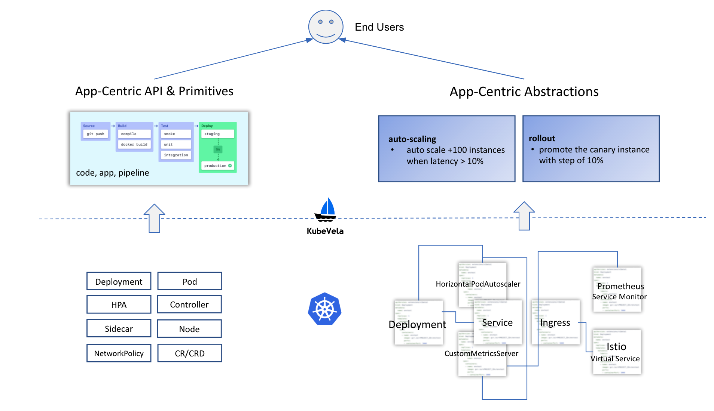
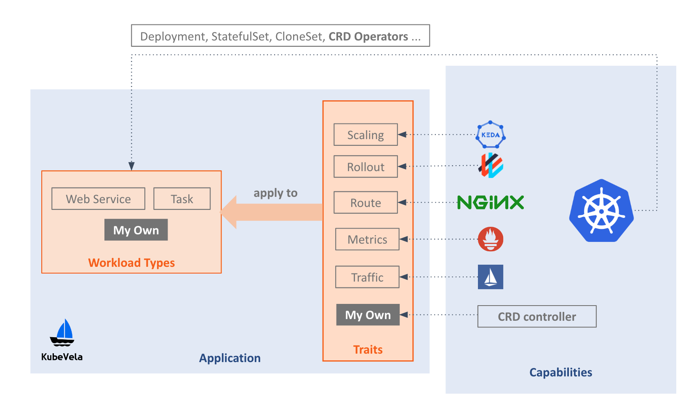

# KubeVela Design

This document presents the detailed design and architecture of KubeVela.

> All the diagrams in this document are available in [this slides](https://docs.google.com/presentation/d/1Y3gnKrd7fUZGgee7Ia9vBsRIYhcZLQwMUCDkk1RJvQc).

## User Stories

As an end user (e.g., application developer or operator) of a platform, I want to focus on implementing my business logic and ship the product to different environments at ease. In other words, my interactions with the platform should be as simple as:
- Here's my source code.
- Here's my application configuration (described from the end user perspective).
- Deploy it in the test environment.
- Deploy it in the production environment.
- Monitoring, debugging, rollout/rollback the application.
- Requiring dockerfile is fine, but please keep the format simple.

As a platform engineer, I want to build an easy-to-use platform for end users. In details, the platform should be:
- Heroku-like (_in terms of both user experience and functionality_).
  - I prefer to building my own version with OSS tools, particularly, with Kubernetes.
- Easy to build.
  - I want to reuse existing capabilities in the Kubernetes community with minimal efforts. Building the platform should be as simple as adding some simple CRD and controllers.
- Powerful and highly extensible.
  - I don't want to lock users with restricted abstractions and capabilities like traditional PaaS or FaaS/Serverless. Hence in terms of capabilities, I hope my platform is fully open and has unlimited possibilities like Kubernetes, rather than another opinionated close system.

## Design Principles

For developers, KubeVela provides an out-of-the-box PaaS-ish experience that exhibits four characteristics: focus, self-service, on-demand, and fast-feedback.

For platform builders, KubeVela works like a special Kubernetes "distro" or an extensible PaaS core. It enables platform builders to integrate existing capabilities in the Kubernetes ecosystems with minimal efforts, and/or develop a new capability in a standard, Kubernetes-native approach.

To achieve the above, Kubevela attempts to meet the following criteria.

## Criteria

### Application Centric

Keywords: _focus_, _self-service_.

KubeVela ensures developers to only think in the scope of an _application_, not a container or an infrastructure. We've seen that lacking application abstraction impacts the developer experience and raises the bar to adopt cloud native technologies. We believe _application_ is the most natural mindset for developers.



Thus, KubeVela chooses to:
1. Introduce _application_ as its first class API.
2. Build the whole system around "application" by modeling Kubernetes capabilities as application configuration in a clear and manageable manner.

#### Solution

One common solution to model "application" in Kubernetes is creating an "application CRD". However, as an extensible PaaS core, KubeVela targets to support any application types and any operation features in the Kubernetes ecosystems. Hence instead of creating an in-house and "monolithic" CRD, KubeVela adopts [Open Application Model (OAM)](https://github.com/oam-dev/spec) as its application definition. This empowers KubeVela with high extensibility since every workload and operation feature in OAM is modeled by independent and extensible definition. OAM defines service application by default, and the operation features are modeled as extra configurations for the application.

### Capability Oriented

Keywords: _on-demand_.

Every capability in KubeVela is designed as a standalone "plug-in" in terms of implementation and configuration. This gives platform builders full flexibility to turn KubeVela into any platform they want (e.g., database PaaS, AI PaaS, etc.).



This loosely coupled design adopts the idea of Capability Oriented Architecture (COA), i.e., instead of creating a close system, KubeVela targets to become an application-centric framework that could expose any underlying infrastructure capability to developers on demand.

#### Solution

KubeVela core is built based on [OAM Kubernetes Runtime](https://github.com/crossplane/oam-kubernetes-runtime) which supports adding standalone controllers as workload type or trait. A set of abstractions and interfaces are defined in this library for KubeVela to assemble various Kubernetes capabilities into a platform with minimal efforts.

For example, there are several "built-in" workload types in KubeVela such as `Web Service` or `Task`. KubeVela discovers them from OAM definition objects, it does **NOT** need to be aware of the specification or the implementation of these workload types regardless they are built-in resources, or CRDs. This means platform builders are free to introduce their own workload types by simply installing a CRD, or just referring to another k8s built-in resource such as `StatefulSet`.

Similarly, all the operation features such as `scaling` or `rollout` (i.e. "traits" in KubeVela) are not tied to particular implementations. In KubeVela, traits are assigned to
a workload type instance following the instance's [characteristic labels](https://github.com/oam-dev/spec/blob/master/4.workload_definitions.md#labels). This enables platform builders to freely add their own traits by simply installing a CRD, or referring to another k8s built-in resource such as `HPA` or `NetworkPolicy`.

KubeVela leverages [OAM definition objects](https://github.com/oam-dev/spec/blob/master/4.workload_definitions.md) to register and discover workloads and traits:


```bash
$ kubectl apply -f workload-definition.yaml # register a new workload type
$ kubectl apply -f trait-definition.yaml # register a new trait
```

Note that the OAM definition objects only define the APIs, not including the controllers. Thus KubeVela provides a **CRD registry** so whenever a new CRD is installed as a workload or a trait, KubeVela would install its controller automatically from the registry. The CRD registry could register a CRD and the Helm chart (which contains the manifest of the controller) together. In fact, we are currently evaluating RedHat's Operator Lifecycle Manager (OLM) capability discovery but have not drawn the final conclusion yet.

For capabilities provided by cloud services, KubeVela will leverage [Crossplane](https://github.com/crossplane/crossplane) core to register and provision them as OAM workload types or traits.


### Extensible User Interface

Keywords: _self-service_, _on-demand_, _fast-feedback_

In the server side, KubeVela components are essentially the [Control Plane Objects](https://github.com/oam-dev/spec/blob/master/2.overview_and_terminology.md#control-plane-objects) defined in OAM specification. On top of those, KubeVela creates a lightweight user facing layer with the following goals:

- Lower the learning curve of new developers. Most of the capabilities in Kubernetes are developed by
companies that run complex workloads. The Kubevela user facing layer provides a much simpler path for on-boarding these capabilities.
- Developers can describe their applications and the behaviors of their components without relying on Kubernetes APIs. For instance, a developer will be able to model the auto-scaling requirements without referring to the underline auto-scaler CRD.
- Provide a single source of truth of the application description. The user facing layer allows developers to work with a single artifact to capture the application definition. It simplifies administrative tasks and also serves as an anchor to avoid configuration drifts during operation.
- To be highly extensible. For example, when a new workload type or trait is installed, the end users could access this new capability directly from the user interface layer, no recompilation or redeployment of KubeVela is required.

#### Solution

In KubeVela, we introduced a docker-compose style "appfile" with high level abstractions as the main user interface of the platform. Developers can define and deploy an application with a single command: `$ vela up`.

In addition, the schema of `appfile` is designed to be "assembled" with independent workload types and traits defined using OAM specification. For example:

```yaml
services:
  frontend:
    type: webservice
    image: oamdev/testapp:v1

    route:
      domain: example.com
      http: # match the longest prefix
        "/": 8080
 ```

This `appfile` is composed of a `frontend` component including workload type of `Web Service` and a `route` trait. Developer fills in the values based on the independent schema documentations for such workload type and trait. KubeVela will check the corresponding definition objects in OAM Kubernetes runtime to validate and generate the final Kubernetes resources. This is how we make the user interface of KubeVela highly extensible.

In order to make building such high level abstractions easier, we adopted [CUElang](https://github.com/cuelang/cue) in the OAM Kubernetes runtime for creating the "last mile" abstractions (i.e., eliminating non user facing fields or merging multiple objects into one). All the abstractions in `appfile` are essentially defined by the CUE templates saved in the OAM Control Plane Objects. The platform builders can modify those templates at any time. The updates will take effect immediately in the schema of the `appfile`.


> In the OAM community, `appfile` is an experimental effort to introduce _User Facing Objects_ alongside with the existing _Control Plane Objects_ in OAM specification. Feel free to check its [design doc](./design/appfile-design.md) for more details.

KubeVela provides a command line to generate `appfile` easily. The dashboard of KubeVela is essentially a GUI version of `appfile`.

## Architecture

Overall, as illustrated in the following figure, KubeVela is composed of **two components**:


### KubeVela User Interfaces
The main user interface of KubeVela is `appfile` (i.e. `Application`), with `cli` and `dashboard` build around this concept.

### KubeVela Core
It is a server side controller which is composed of:
- [Crossplane OAM Kubernetes runtime](https://github.com/crossplane/oam-kubernetes-runtime) which implements OAM control plane specification including `Component` and `Application Configuration` etc.
- Built-in workload and trait implementations which provide core capabilities such as `webservice`, `route` and `rollout` etc.
- A capability manager which manages features of KubeVela as independent add-ons following the design of _Capability Oriented Architecture_ mentioned above.
- A CRD registry which registers and discovers Kubernetes controllers/operators by their CRDs. This enables KubeVela to install dependent controllers/operators automatically when a new CRD based capability is added.
