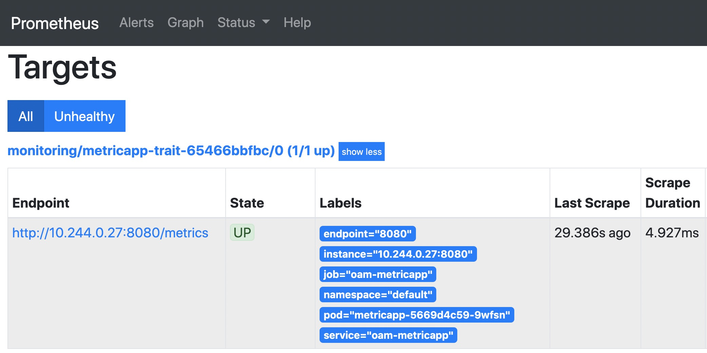

# Monitoring Application

> Note: metrics is one of the extension capabilities [installed from cap center](../cap-center.md),
> please install it if you can't find it in `vela traits`.

If your application has exposed metrics, you can easily tell the platform how to collect the metrics data from your app with `metrics` capability.

Let's run [`christianhxc/gorandom:1.0`](https://github.com/christianhxc/prometheus-tutorial) as an example app.
The app will emit random latencies as metrics.


1. Prepare Appfile:

  ```bash
    $ cat <<EOF > vela.yaml
      name: metricapp
      services:
        metricapp:
          type: webservice
          image: christianhxc/gorandom:1.0
          port: 8080

          metrics:
            enabled: true
            format: prometheus
            path: /metrics
            port: 0
            scheme: http
    EOF
  ```

> The full specification of `metrics` could show up by `$ vela show metrics` or be found on [its reference documentation](../references/traits/metrics.md)

2. Deploy the application:

  ```bash
  $ vela up
  ```

3. Check status:

  ```bash
    $ vela status metricapp
    About:

      Name:      	metricapp
      Namespace: 	default
      Created at:	2020-11-11 17:00:59.436347573 -0800 PST
      Updated at:	2020-11-11 17:01:06.511064661 -0800 PST

    Services:

      - Name: metricapp
        Type: webservice
        HEALTHY Ready: 1/1
        Traits:
          - ✅ metrics: Monitoring port: 8080, path: /metrics, format: prometheus, schema: http.
        Last Deployment:
          Created at: 2020-11-11 17:00:59 -0800 PST
          Updated at: 2020-11-11T17:01:06-08:00
  ```

The metrics trait will automatically discover port and label to monitor if no parameters specified.
If more than one ports found, it will choose the first one by default.


**(Optional) Verify that the metrics are collected on Prometheus**

<details>

Expose the port of Prometheus dashboard:
  
```bash
kubectl --namespace monitoring port-forward `kubectl -n monitoring get pods -l prometheus=oam -o name` 9090
```

Then access the Prometheus dashboard via http://localhost:9090/targets



</details>
