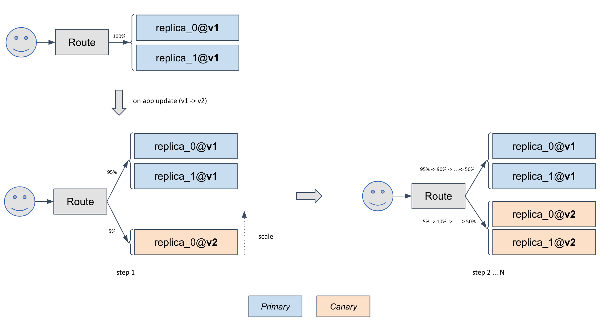

> Note: rollout is one of the extension capabilities [installed from cap center](../cap-center),
> please install it if you can't find it in `vela traits`.

The `rollout` section is used to configure Canary strategy to release your app.

Add rollout config under `express-server` along with a `route`.

```yaml
name: testapp
services:
  express-server:
    type: webservice
    image: oamdev/testapp:rolling01
    port: 80

    rollout:
      replicas: 5
      stepWeight: 20
      interval: "30s"
    
    route:
      domain: "example.com"
```

> The full specification of `rollout` could show up by `$ vela show rollout` or be found on [its reference documentation](../references/traits/rollout)

Apply this `appfile.yaml`:

```bash
$ vela up
```

You could check the status by:

```bash
$ vela status testapp
About:

  Name:      	testapp
  Namespace: 	myenv
  Created at:	2020-11-09 17:34:38.064006 +0800 CST
  Updated at:	2020-11-10 17:05:53.903168 +0800 CST

Services:

  - Name: testapp
    Type: webservice
    HEALTHY Ready: 5/5
    Traits:
      - ✅ rollout: interval=5s
		replicas=5
		stepWeight=20
      - ✅ route: 	Visiting URL: http://example.com	IP: <your-ingress-IP-address>

    Last Deployment:
      Created at: 2020-11-09 17:34:38 +0800 CST
      Updated at: 2020-11-10T17:05:53+08:00
```

Visiting this app by:

```bash
$ curl -H "Host:example.com" http://<your-ingress-IP-address>/
Hello World -- Rolling 01
```

In day 2, assuming we have make some changes on our app and build the new image and name it by `oamdev/testapp:v2`.

Let's update the appfile by:

```yaml
name: testapp
services:
  express-server:
    type: webservice
-   image: oamdev/testapp:rolling01
+   image: oamdev/testapp:rolling02
    port: 80
    rollout:
      replicas: 5
      stepWeight: 20
      interval: "30s"
    route:
      domain: example.com
```

Apply this `appfile.yaml` again:

```bash
$ vela up
```

You could run `vela status` several times to see the instance rolling:

```shell script
$ vela status testapp
About:

  Name:      	testapp
  Namespace: 	myenv
  Created at:	2020-11-12 19:02:40.353693 +0800 CST
  Updated at:	2020-11-12 19:02:40.353693 +0800 CST

Services:

  - Name: express-server
    Type: webservice
    HEALTHY express-server-v2:Ready: 1/1 express-server-v1:Ready: 4/4
    Traits:
      - ✅ rollout: interval=30s
		replicas=5
		stepWeight=20
      - ✅ route: 	 Visiting by using 'vela port-forward testapp --route'

    Last Deployment:
      Created at: 2020-11-12 17:20:46 +0800 CST
      Updated at: 2020-11-12T19:02:40+08:00
```

You could then try to `curl` your app multiple times and and see how the app being rollout following Canary strategy:


```bash
$ curl -H "Host:example.com" http://<your-ingress-ip-address>/
Hello World -- This is rolling 02                                        
$ curl -H "Host:example.com" http://<your-ingress-ip-address>/
Hello World -- Rolling 01                                                                
$ curl -H "Host:example.com" http://<your-ingress-ip-address>/
Hello World -- Rolling 01                                                    
$ curl -H "Host:example.com" http://<your-ingress-ip-address>/
Hello World -- This is rolling 02                                         
$ curl -H "Host:example.com" http://<your-ingress-ip-address>/
Hello World -- Rolling 01                                                  
$ curl -H "Host:example.com" http://<your-ingress-ip-address>/
Hello World -- This is rolling 02
```


**How `Rollout` works?**

<details>

`Rollout` trait implements progressive release process to rollout your app following [Canary strategy](https://martinfowler.com/bliki/CanaryRelease.html).

In detail, `Rollout` controller will create a canary of your app , and then gradually shift traffic to the canary while measuring key performance indicators like HTTP requests success rate at the same time. 




In this sample, for every `10s`, `5%` traffic will be shifted to canary from the primary, until the traffic on canary reached `50%`. At the mean time, the instance number of canary will automatically scale to `replicas: 2` per configured in Appfile.


Based on analysis result of the KPIs during this traffic shifting, a canary will be promoted or aborted if analysis is failed. If promoting, the primary will be upgraded from v1 to v2, and traffic will be fully shifted back to the primary instances. So as result, canary instances will be deleted after the promotion finished.


> Note: KubeVela's `Rollout` trait is implemented with [Weaveworks Flagger](https://flagger.app/) operator.
  
</details>
