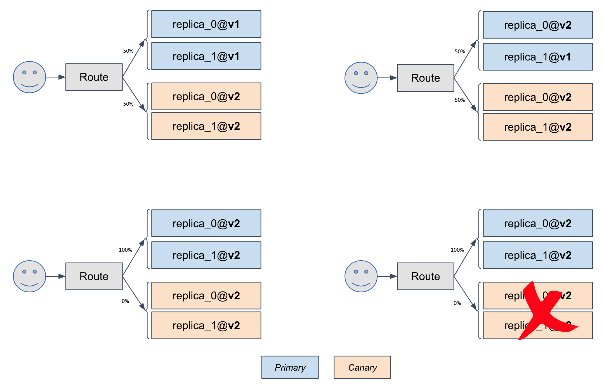

# Rollout

## Description

`Rollout` is used to configure Canary rollout strategy to your application.

## Specification

List of all available properties for a `Rollout` trait.

```yaml
servcies:
  express-server:
    ...

    rollout:
      replica: 2
      stepWeight: 5
      interval: "10s"
```

## Properties

Name | Type | Description | Notes
------------ | ------------- | ------------- | -------------
**replica**** | **string** | total replica for your app | [ default to 5 ]
**stepWeight** | **string** | weight percent of every step for this update | [default to 20 ]
**interval** | **string** | wait interval for every rolling update step | [default to '30s'] 

## How `Rollout` works?

`Rollout` trait implements progressive release process to rollout your app following [Canary strategy](https://martinfowler.com/bliki/CanaryRelease.html).

In detail, `Rollout` controller will create a canary of your app , and then gradually shift traffic to the canary while measuring key performance indicators like HTTP requests success rate at the same time. 


In this sample, for every `10s`, `5%` traffic will be shifted to canary from the primary, until the traffic on canary reached `50%`. At the mean time, the instance number of canary will automatically scale to `replica: 2` per configured in Appfile.


Based on analysis result of the KPIs during this traffic shifting, a canary will be promoted or aborted if analysis is failed. If promoting, the primary will be upgraded from v1 to v2, and traffic will be fully shifted back to the primary instances. So as result, canary instances will be deleted after the promotion finished.



> Note: KubeVela's `Rollout` trait is implemented with [Weaveworks Flagger](https://flagger.app/) operator.