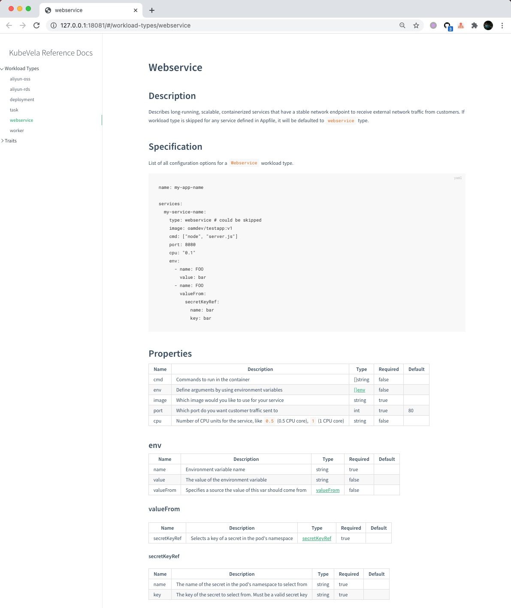
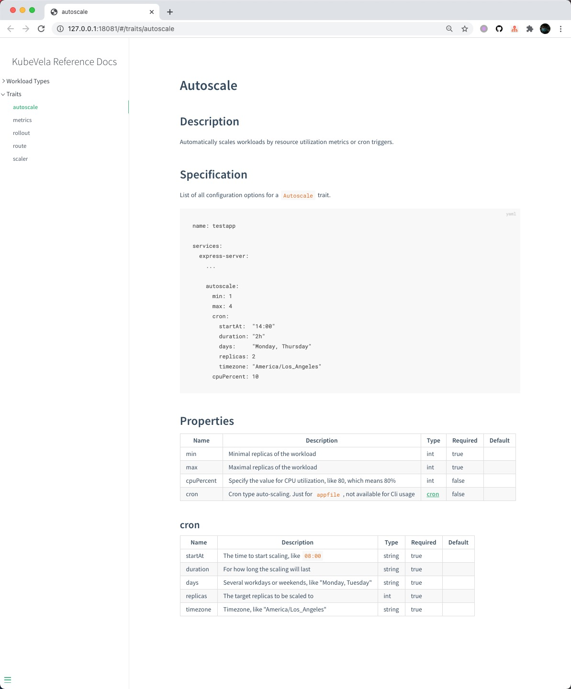

# Writing Appfile

If you have successfully deployed an application with the Appfile in [Learning Appfile Guide](./learn-appfile.md), you may
wonder how to set properties for Workload types and Traits from scratch on your own. 

Let's imagine we'd like to write an Appfile to deploy an application `helloworld` with a service `backend` whose Workload type is `webservice` and
automatically scale it to 4 replicas from 19:00 to 21:00 every Friday. Here are several ways to get going.

## Look up the reference doc in a locally hosted website

Just run `vela show ${workloadType}/${trait}` to start up the properties reference doc for the Workload type or Trait in
a locally hosted website. Let's run `vela show webservice`. Your default web browser is invoked, and a new tab [http://127.0.0.1:18081/#/workload-types/webservice](http://127.0.0.1:18081/#/workload-types/webservice) is automatically created.



In section `Specification`, here is a sample Appfile.

```yaml
name: my-app-name

services:
  my-service-name:
    type: webservice # could be skipped
    image: oamdev/testapp:v1
    cmd: ["node", "server.js"]
    port: 8080
    cpu: "0.1"
    env:
      - name: FOO
        value: bar
      - name: FOO
        valueFrom:
          secretKeyRef:
            name: bar
            key: bar
```

- Set application name

In the first line, we can set the name to `helloworld` as our application name. 

- Set Workload type's properties

For `services`, we change `my-service-name` to `backend` as the service name, and set `services.backend.type` to `webservice`
to mark the Workload type. As the default Workload type in KubeVela is `service`, we can also skip `services.backend.type`.

```yaml
name: helloworld

services:
  backend:
    
```

Now let's set the properties and values for service `backend` in field `services.backend`. Look up section `Properties` in
the website above, which clearly lists all properties for `webservice` and each property contains name, description, type,
required or optional, and default value.

For example, property `cmd` can set the commands to run in the container, and it's in list format, while optional; property `port`
has a default value `80`, which means we can skip setting it if the target port is the same; the format type of property
`env` is complicated, and the struct consists of three sub-property `name`, `value` and `valueFrom`.

Now let's complete field `services.backend`.

```yaml
name: helloworld

services:
  backend:
    image: oamdev/testapp:v1
    cmd: ["node", "server.js"]
    port: 8080
    cpu: "0.1"
    
```

- Set Trait's properties

Trait `autoscale` can automatically scale a service. Let load its reference doc by `vela show autoscale`.



Add a new field `services.backend.autoscale` to set its properties. By checking section `Perperties`, we get to know we can set
`min` to `1` and `max` to `8`. We should also add `service.backend.autoscale.cron` field to set `startAt` to `19:00`, 
`duration` to `2h`, `days` to `Friday`, and `timezone` to your expected timezone, like `America/Los_Angeles`.

Now let's finish the Appfile.

```yaml
name: helloworld

services:
  backend:
    image: oamdev/testapp:v1
    cmd: ["node", "server.js"]
    port: 8080
    cpu: "0.1"

    autoscale:
      min: 1
      max: 8
      cron:
        startAt:  "19:00"
        duration: "2h"
        days:     "Friday"
        replicas: 4
        timezone: "America/Los_Angeles"
```

## Look up the reference doc in a [kubevela.io](https://kubevela.io/#/en/developers/references/)

> Platform team extended Workload type or Trait currently could not display in KubeVela official site. 

If you just want to look up KubeVela built-in Workload types and Traits, directly visiting the official site [https://kubevela.io/#/en/developers/references/](./references/README.md)
is also recommended.

## Show up the properties reference on the Cli console

If you prefer to show the properties reference on the Cli console, just add flag `--no-website` to command `vela show`.

```shell
$ vela show webservice --no-website
# Properties
+-------+----------------------------------------------------------------------------------+---------------+----------+---------+
| NAME  |                                   DESCRIPTION                                    |     TYPE      | REQUIRED | DEFAULT |
+-------+----------------------------------------------------------------------------------+---------------+----------+---------+
| cmd   | Commands to run in the container                                                 | []string      | false    |         |
| env   | Define arguments by using environment variables                                  | [[]env](#env) | false    |         |
| image | Which image would you like to use for your service                               | string        | true     |         |
| port  | Which port do you want customer traffic sent to                                  | int           | true     |      80 |
| cpu   | Number of CPU units for the service, like `0.5` (0.5 CPU core), `1` (1 CPU core) | string        | false    |         |
+-------+----------------------------------------------------------------------------------+---------------+----------+---------+


## env
+-----------+-----------------------------------------------------------+-------------------------+----------+---------+
|   NAME    |                        DESCRIPTION                        |          TYPE           | REQUIRED | DEFAULT |
+-----------+-----------------------------------------------------------+-------------------------+----------+---------+
| name      | Environment variable name                                 | string                  | true     |         |
| value     | The value of the environment variable                     | string                  | false    |         |
| valueFrom | Specifies a source the value of this var should come from | [valueFrom](#valueFrom) | false    |         |
+-----------+-----------------------------------------------------------+-------------------------+----------+---------+


### valueFrom
+--------------+--------------------------------------------------+-------------------------------+----------+---------+
|     NAME     |                   DESCRIPTION                    |             TYPE              | REQUIRED | DEFAULT |
+--------------+--------------------------------------------------+-------------------------------+----------+---------+
| secretKeyRef | Selects a key of a secret in the pod's namespace | [secretKeyRef](#secretKeyRef) | true     |         |
+--------------+--------------------------------------------------+-------------------------------+----------+---------+


#### secretKeyRef
+------+------------------------------------------------------------------+--------+----------+---------+
| NAME |                           DESCRIPTION                            |  TYPE  | REQUIRED | DEFAULT |
+------+------------------------------------------------------------------+--------+----------+---------+
| name | The name of the secret in the pod's namespace to select from     | string | true     |         |
| key  | The key of the secret to select from. Must be a valid secret key | string | true     |         |
+------+------------------------------------------------------------------+--------+----------+---------+
```

# Comparation

Properties reference | Access | Support built-in capability? | Support extended capability? | Include Appfile sample
------------ | ------------- | ------------- | ------------- | ------------- |
Locally hosted website | `vela show ${workloadType}/${trait}` | Yes | Yes | Yes
Official site | [https://kubevela.io/#/en/developers/references/](https://kubevela.io/#/en/developers/references/)  | Yes | No | Yes
Cli console | `vela show ${workloadType}/${trait} --no-website` | Yes | Yes | No 
