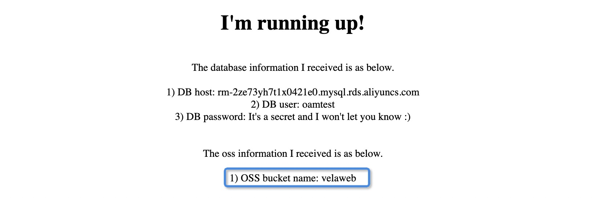

KubeVela provides unified abstraction even for cloud services.

## Should a Cloud Service be a Component or Trait?

The following practice could be considered:
- Use `ComponentDefinition` if:
  - you want to allow your end users explicitly claim a "instance" of the cloud service and consume it, and release the "instance" when deleting the application.
- Use `TraitDefinition` if:
  - you don't want to give your end users any control/workflow of claiming or releasing the cloud service, you only want to give them a way to consume a cloud service which could even be managed by some other system. A `Service Binding` trait is widely used in this case.
	
In this documentation, we will define an Alibaba Cloud's RDS (Relational Database Service), and an Alibaba Cloud's OSS (Object Storage System) as example. This mechanism works the same with other cloud providers.
In a single application, they are in form of Traits, and in multiple applications, they are in form of Components.

## Install and Configure Crossplane

KubeVela uses [Crossplane](https://crossplane.io/) as the cloud service operator. Please Refer to [Installation](https://github.com/crossplane/provider-alibaba/releases/tag/v0.5.0) 
to install Crossplane Alibaba provider v0.5.0.

If you'd like to configure any other Crossplane providers, please refer to [Crossplane Select a Getting Started Configuration](https://crossplane.io/docs/v1.1/getting-started/install-configure.html#select-a-getting-started-configuration).

```
$ kubectl crossplane install provider crossplane/provider-alibaba:v0.5.0

# Note the xxx and yyy here is your own AccessKey and SecretKey to the cloud resources.
$ kubectl create secret generic alibaba-account-creds -n crossplane-system --from-literal=accessKeyId=xxx --from-literal=accessKeySecret=yyy

$ kubectl apply -f provider.yaml
```

`provider.yaml` is as below.

```yaml
apiVersion: v1
kind: Namespace
metadata:
  name: crossplane-system

---
apiVersion: alibaba.crossplane.io/v1alpha1
kind: ProviderConfig
metadata:
  name: default
spec:
  credentials:
    source: Secret
    secretRef:
      namespace: crossplane-system
      name: alibaba-account-creds
      key: credentials
  region: cn-beijing
```

Note: We currently just use Crossplane Alibaba provider. But we are about to use [Crossplane](https://crossplane.io/) as the
cloud resource operator for Kubernetes in the near future.

## Provisioning and consuming cloud resource in a single application v1 (one cloud resource)

### Step 1: Register ComponentDefinition `alibaba-rds` as RDS cloud resource producer

First, register the `alibaba-rds` workload type to KubeVela.

```yaml
apiVersion: core.oam.dev/v1beta1
kind: ComponentDefinition
metadata:
  name: alibaba-rds
  namespace: vela-system
  annotations:
    definition.oam.dev/description: "Alibaba Cloud RDS Resource"
spec:
  workload:
    definition:
      apiVersion: database.alibaba.crossplane.io/v1alpha1
      kind: RDSInstance
  schematic:
    cue:
      template: |
        output: {
        	apiVersion: "database.alibaba.crossplane.io/v1alpha1"
        	kind:       "RDSInstance"
        	spec: {
        		forProvider: {
        			engine:                parameter.engine
        			engineVersion:         parameter.engineVersion
        			dbInstanceClass:       parameter.instanceClass
        			dbInstanceStorageInGB: 20
        			securityIPList:        "0.0.0.0/0"
        			masterUsername:        parameter.username
        		}
        		writeConnectionSecretToRef: {
        			namespace: context.namespace
        			name:      context.outputSecretName
        		}
        		providerConfigRef: {
        			name: "default"
        		}
        		deletionPolicy: "Delete"
        	}
        }
        parameter: {
        	engine:          *"mysql" | string
        	engineVersion:   *"8.0" | string
        	instanceClass:   *"rds.mysql.c1.large" | string
        	username:        string
        }
```

Noted: In application, application developers need to use property `outputSecretName` as the secret name which is used to store all connection
items of cloud resource connections information.

### Step 2: Prepare TraitDefinition `service-binding` to do env-secret mapping

As for data binding in Application, KubeVela recommends defining a trait to finish the job. We have prepared a common
trait for convenience. This trait works well for binding resources' info into pod spec Env.

```yaml
apiVersion: core.oam.dev/v1beta1
kind: TraitDefinition
metadata:
  annotations:
    definition.oam.dev/description: "binding cloud resource secrets to pod env"
  name: service-binding
spec:
  appliesToWorkloads:
    - webservice
    - worker
  schematic:
    cue:
      template: |
        patch: {
        	spec: template: spec: {
        		// +patchKey=name
        		containers: [{
        			name: context.name
        			// +patchKey=name
        			env: [
        				for envName, v in parameter.envMappings {
        					name: envName
        					valueFrom: {
        						secretKeyRef: {
        							name: v.secret
        							if v["key"] != _|_ {
        								key: v.key
        							}
        							if v["key"] == _|_ {
        								key: envName
        							}
        						}
        					}
        				},
        			]
        		}]
        	}
        }

        parameter: {
        	envMappings: [string]: [string]: string
        }
```

With the help of this `service-binding` trait, developers can explicitly set parameter `envMappings` to mapping all environment names with secret key. Here is an example.

```yaml
...
      traits:
        - type: service-binding
          properties:
            envMappings:
              # environments refer to db-conn secret
              DB_PASSWORD:
                secret: db-conn
                key: password                                     # 1) If the env name is different from secret key, secret key has to be set.
              endpoint:
                secret: db-conn                                   # 2) If the env name is the same as the secret key, secret key can be omitted.
              username:
                secret: db-conn
              # environments refer to oss-conn secret
              BUCKET_NAME:
                secret: oss-conn
                key: Bucket
...
```

### Step 3: Create an application to provision and consume cloud resource

Create an application with a cloud resource provisioning component and a consuming component as below.

```yaml
apiVersion: core.oam.dev/v1beta1
kind: Application
metadata:
  name: webapp
spec:
  components:
    - name: express-server
      type: webservice
      properties:
        image: zzxwill/flask-web-application:v0.3.1-crossplane
        ports: 80
      traits:
        - type: service-binding
          properties:
            envMappings:
              # environments refer to db-conn secret
              DB_PASSWORD:
                secret: db-conn
                key: password                                     # 1) If the env name is different from secret key, secret key has to be set.
              endpoint:
                secret: db-conn                                   # 2) If the env name is the same as the secret key, secret key can be omitted.
              username:
                secret: db-conn

    - name: sample-db
      type: alibaba-rds
      properties:
        name: sample-db
        engine: mysql
        engineVersion: "8.0"
        instanceClass: rds.mysql.c1.large
        username: oamtest
        outputSecretName: db-conn

```

Apply it and verify the application.

```shell
$ kubectl get application
NAME     AGE
webapp   46m

$ kubectl port-forward deployment/express-server 80:80
Forwarding from 127.0.0.1:80 -> 80
Forwarding from [::1]:80 -> 80
Handling connection for 80
Handling connection for 80
```


## Provisioning and consuming cloud resource in a single application v2 (two cloud resources)

Based on the section `Provisioning and consuming cloud resource in a single application v1 (one cloud resource)`, register
one more cloud resource workload type `alibaba-oss` to KubeVela.

```yaml
apiVersion: core.oam.dev/v1beta1
kind: ComponentDefinition
metadata:
  name: alibaba-oss
  namespace: vela-system
  annotations:
    definition.oam.dev/description: "Alibaba Cloud RDS Resource"
spec:
  workload:
    definition:
      apiVersion: oss.alibaba.crossplane.io/v1alpha1
      kind: Bucket
  schematic:
    cue:
      template: |
        output: {
        	apiVersion: "oss.alibaba.crossplane.io/v1alpha1"
        	kind:       "Bucket"
        	spec: {
        		name:               parameter.name
        		acl:                parameter.acl
        		storageClass:       parameter.storageClass
        		dataRedundancyType: parameter.dataRedundancyType
        		writeConnectionSecretToRef: {
        			namespace: context.namespace
        			name:      context.outputSecretName
        		}
        		providerConfigRef: {
        			name: "default"
        		}
        		deletionPolicy: "Delete"
        	}
        }
        parameter: {
        	name:               string
        	acl:                *"private" | string
        	storageClass:       *"Standard" | string
        	dataRedundancyType: *"LRS" | string
        }

```

Update the application to also consume cloud resource OSS.

```yaml
apiVersion: core.oam.dev/v1beta1
kind: Application
metadata:
  name: webapp
spec:
  components:
    - name: express-server
      type: webservice
      properties:
        image: zzxwill/flask-web-application:v0.3.1-crossplane
        ports: 80
      traits:
        - type: service-binding
          properties:
            envMappings:
              # environments refer to db-conn secret
              DB_PASSWORD:
                secret: db-conn
                key: password                                     # 1) If the env name is different from secret key, secret key has to be set.
              endpoint:
                secret: db-conn                                   # 2) If the env name is the same as the secret key, secret key can be omitted.
              username:
                secret: db-conn
              # environments refer to oss-conn secret
              BUCKET_NAME:
                secret: oss-conn
                key: Bucket

    - name: sample-db
      type: alibaba-rds
      properties:
        name: sample-db
        engine: mysql
        engineVersion: "8.0"
        instanceClass: rds.mysql.c1.large
        username: oamtest
        outputSecretName: db-conn

    - name: sample-oss
      type: alibaba-oss
      properties:
        name: velaweb
        outputSecretName: oss-conn
```

Apply it and verify the application.

```shell
$ kubectl port-forward deployment/express-server 80:80
Forwarding from 127.0.0.1:80 -> 80
Forwarding from [::1]:80 -> 80
Handling connection for 80
Handling connection for 80
```



## Provisioning and consuming cloud resource in different applications

In this section, cloud resource will be provisioned in one application and consumed in another application.

### Provision Cloud Resource

Instantiate RDS component with `alibaba-rds` workload type in an [Application](../application.md) to provide cloud resources.

As we have claimed an RDS instance with ComponentDefinition name `alibaba-rds`. 
The component in the application should refer to this type.

```yaml
apiVersion: core.oam.dev/v1beta1
kind: Application
metadata:
  name: baas-rds
spec:
  components:
    - name: sample-db
      type: alibaba-rds
      properties:
        name: sample-db
        engine: mysql
        engineVersion: "8.0"
        instanceClass: rds.mysql.c1.large
        username: oamtest
        outputSecretName: db-conn
```

Apply the application to Kubernetes and a RDS instance will be automatically provisioned (may take some time, ~2 mins).

A secret `db-conn` will also be created in the same namespace as that of the application.

```shell
$ kubectl get application
NAME       AGE
baas-rds   9h

$ kubectl get rdsinstance
NAME           READY   SYNCED   STATE     ENGINE   VERSION   AGE
sample-db-v1   True    True     Running   mysql    8.0       9h

$ kubectl get secret
NAME                                              TYPE                                  DATA   AGE
db-conn                                           connection.crossplane.io/v1alpha1     4      9h

$ ✗ kubectl get secret db-conn -o yaml
apiVersion: v1
data:
  endpoint: xxx==
  password: yyy
  port: MzMwNg==
  username: b2FtdGVzdA==
kind: Secret
```

### Consuming the Cloud Resource

In this section, we will show how another component consumes the RDS instance.

> Note: we recommend defining the cloud resource claiming to an independent application if that cloud resource has 
> standalone lifecycle.

#### Step 1: Define a ComponentDefinition with Secret Reference

```yaml
apiVersion: core.oam.dev/v1beta1
kind: ComponentDefinition
metadata:
  name: webconsumer
  annotations:
    definition.oam.dev/description: A Deployment provides declarative updates for Pods and ReplicaSets
spec:
  workload:
    definition:
      apiVersion: apps/v1
      kind: Deployment
  schematic:
    cue:
      template: |
        output: {
        	apiVersion: "apps/v1"
        	kind:       "Deployment"
        	spec: {
        		selector: matchLabels: {
        			"app.oam.dev/component": context.name
        		}

        		template: {
        			metadata: labels: {
        				"app.oam.dev/component": context.name
        			}

        			spec: {
        				containers: [{
        					name:  context.name
        					image: parameter.image

        					if parameter["cmd"] != _|_ {
        						command: parameter.cmd
        					}

        					if parameter["dbSecret"] != _|_ {
        						env: [
        							{
        								name:  "username"
        								value: dbConn.username
        							},
        							{
        								name:  "endpoint"
        								value: dbConn.endpoint
        							},
        							{
        								name:  "DB_PASSWORD"
        								value: dbConn.password
        							},
        						]
        					}

        					ports: [{
        						containerPort: parameter.port
        					}]

        					if parameter["cpu"] != _|_ {
        						resources: {
        							limits:
        								cpu: parameter.cpu
        							requests:
        								cpu: parameter.cpu
        						}
        					}
        				}]
        		}
        		}
        	}
        }

        parameter: {
        	// +usage=Which image would you like to use for your service
        	// +short=i
        	image: string

        	// +usage=Commands to run in the container
        	cmd?: [...string]

        	// +usage=Which port do you want customer traffic sent to
        	// +short=p
        	port: *80 | int

        	// +usage=Referred db secret
        	// +insertSecretTo=dbConn
        	dbSecret?: string

        	// +usage=Number of CPU units for the service, like `0.5` (0.5 CPU core), `1` (1 CPU core)
        	cpu?: string
        }

        dbConn: {
        	username: string
        	endpoint: string
        	password: string
        }

```

The key point is the annotation `//+insertSecretTo=dbConn`, KubeVela will know the parameter is a K8s secret, it will parse
the secret and bind the data into the CUE struct `dbConn`.

Then the `output` can reference the `dbConn` struct for the data value. The name `dbConn` can be any name. 
It's just an example in this case. The `+insertSecretTo` is keyword, it defines the data binding mechanism.

Now create the Application to consume the data.

```yaml
apiVersion: core.oam.dev/v1beta1
kind: Application
metadata:
  name: webapp
spec:
  components:
    - name: express-server
      type: webconsumer
      properties:
        image: zzxwill/flask-web-application:v0.3.1-crossplane
        ports: 80
        dbSecret: db-conn
```

```shell
$ kubectl get application
NAME       AGE
baas-rds   10h
webapp     14h

$ kubectl get deployment
NAME                READY   UP-TO-DATE   AVAILABLE   AGE
express-server-v1   1/1     1            1           9h

$ kubectl port-forward deployment/express-server 80:80
```

We can see the cloud resource is successfully consumed by the application.


