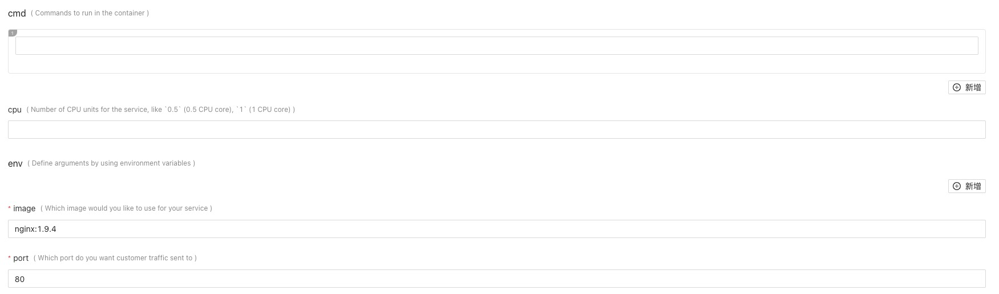

# Auto-generated OpenAPI v3 JSON Schema for Capability

For any installed capability, KubeVela will automatically generate OpenAPI v3 JSON Schema for it.

## Why?

In definition objects, [parameter](https://kubevela.io/#/en/platform-engineers/workload-type?id=_4-define-template) section are expected to be set by developers when creating `Application` object.
While there is another GUI way for developers to input all parameter fields by rendering `parameter` section to [OpenAPI v3 Specification](https://github.com/OAI/OpenAPI-Specification/blob/master/versions/3.0.2.md#format).

For example,  after you created a definition object, KubeVela will generate OpenAPI v3 JSON Schema from `parameter` of Workload Type [webservice](https://kubevela.io/#/en/developers/references/workload-types/webservice).

```json
{
	"properties": {
		"cmd": {
			"description": "Commands to run in the container",
			"items": {
				"type": "string"
			},
			"title": "cmd",
			"type": "array"
		},
		"cpu": {
			"description": "Number of CPU units for the service, like `0.5` (0.5 CPU core), `1` (1 CPU core)",
			"title": "cpu",
			"type": "string"
		},
		"env": {
			"description": "Define arguments by using environment variables",
			"items": {
				"properties": {
					"name": {
						"description": "Environment variable name",
						"title": "name",
						"type": "string"
					},
					"value": {
						"description": "The value of the environment variable",
						"title": "value",
						"type": "string"
					},
					"valueFrom": {
						"description": "Specifies a source the value of this var should come from",
						"properties": {
							"secretKeyRef": {
								"description": "Selects a key of a secret in the pod's namespace",
								"properties": {
									"key": {
										"description": "The key of the secret to select from. Must be a valid secret key",
										"title": "key",
										"type": "string"
									},
									"name": {
										"description": "The name of the secret in the pod's namespace to select from",
										"title": "name",
										"type": "string"
									}
								},
								"required": ["name", "key"],
								"title": "secretKeyRef",
								"type": "object"
							}
						},
						"required": ["secretKeyRef"],
						"title": "valueFrom",
						"type": "object"
					}
				},
				"required": ["name"],
				"type": "object"
			},
			"title": "env",
			"type": "array"
		},
		"image": {
			"description": "Which image would you like to use for your service",
			"title": "image",
			"type": "string"
		},
		"port": {
			"default": 80,
			"description": "Which port do you want customer traffic sent to",
			"title": "port",
			"type": "integer"
		}
	},
	"required": ["image", "port"],
	"type": "object"
}
```

You can render the schema by [form-render](https://github.com/alibaba/form-render) or [React JSON Schema form](https://github.com/rjsf-team/react-jsonschema-form). A web form can be as below.



## How to use the generated JSON Schema of definition

When a platform builder applies a WorkloadDefinition or TraitDefinition, a ConfigMap will be created in a namespace same
as the definition (by default it will be in `vela-system` namespace) and labeled with `definition.oam.dev=schema`.

```shell
$ kubectl get cm -n vela-system -l definition.oam.dev=schema
NAME                DATA   AGE
schema-ingress      1      19s
schema-scaler       1      19s
schema-task         1      19s
schema-webservice   1      19s
schema-worker       1      20s
```

The ConfigMap name is in the format `schema-$definitionName`, and the key of ConfigMap data is `openapi-v3-json-schema`.
For example, we can use the following command to get the JSON Schema of `webservice`.

```shell
$ kubectl get cm schema-webservice -n vela-system -o yaml
apiVersion: v1
data:
  openapi-v3-json-schema: '{"properties":{"cmd":{"description":"Commands to run in
    the container","items":{"type":"string"},"title":"cmd","type":"array"},"cpu":{"description":"Number
    of CPU units for the service, like `0.5` (0.5 CPU core), `1` (1 CPU core)","title":"cpu","type":"string"},"env":{"description":"Define
    arguments by using environment variables","items":{"properties":{"name":{"description":"Environment
    variable name","title":"name","type":"string"},"value":{"description":"The value
    of the environment variable","title":"value","type":"string"},"valueFrom":{"description":"Specifies
    a source the value of this var should come from","properties":{"secretKeyRef":{"description":"Selects
    a key of a secret in the pod''s namespace","properties":{"key":{"description":"The
    key of the secret to select from. Must be a valid secret key","title":"key","type":"string"},"name":{"description":"The
    name of the secret in the pod''s namespace to select from","title":"name","type":"string"}},"required":["name","key"],"title":"secretKeyRef","type":"object"}},"required":["secretKeyRef"],"title":"valueFrom","type":"object"}},"required":["name"],"type":"object"},"title":"env","type":"array"},"image":{"description":"Which
    image would you like to use for your service","title":"image","type":"string"},"port":{"default":80,"description":"Which
    port do you want customer traffic sent to","title":"port","type":"integer"}},"required":["image","port"],"type":"object"}'
kind: ConfigMap
metadata:
  name: schema-webservice
  namespace: vela-system
```

If you adopt [KubeVela API Server](https://github.com/oam-dev/kubevela/tree/master/references/apiserver), you can get the
schema by API [/api/definitions/{definitionName}](https://kubevela.io/en/developers/references/restful-api/index.html#api-Definitions-getDefinition).
