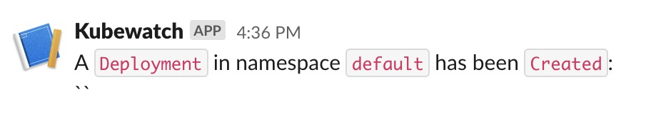

# Extending Traits in KubeVela

In the following tutorial, you will learn how to add a new trait and expose it to users via Appfile.

## Add A New Trait

Prerequisites:

- [helm v3](https://helm.sh/docs/intro/install/)
- [kubectl](https://kubernetes.io/docs/tasks/tools/install-kubectl/)

### Step 1: Install KubeWatch

```bash
$ helm repo add vela-demo https://wonderflow.info/kubewatch/archives/
$ helm install kubewatch vela-demo/kubewatch --version 0.1.0
```

### Step 2: Add Trait Definition with CUE template

```bash
$ cat << EOF | kubectl apply -f -
apiVersion: core.oam.dev/v1alpha2
kind: TraitDefinition
metadata:
  name: kubewatch
  annotations:
    definition.oam.dev/description: "Add a watch for resource"
spec:
  appliesToWorkloads:
    - "*"
  workloadRefPath: spec.workloadRef
  definitionRef:
    name: kubewatches.labs.bitnami.com
  extension:
    template: |
      output: {
        apiVersion: "labs.bitnami.com/v1alpha1"
        kind:       "KubeWatch"
        spec: handler: webhook: url: parameter.webhook
      }
      parameter: {
        webhook: string
      }
EOF
```

That's it! Once you have applied the definition file the feature will be automatically registered in Vela Server and exposed to users.

### Step 3: Verify Kubewatch Trait Installed

```bash
$ vela traits
Synchronizing capabilities from cluster⌛ ...
Sync capabilities successfully ✅ Add(1) Update(0) Delete(0)
TYPE      	CATEGORY	DESCRIPTION
+kubewatch	trait   	Add a watch for resource

Listing trait capabilities ...

NAME     	DESCRIPTION                       	APPLIES TO
kubewatch	Add a watch for resource
...
```

### Step 4: Adding Kubewatch Trait to The App

Write an Appfile:

```bash
$ cat << EOF > vela.yaml
name: testapp
services:
  testsvc:
    type: webservice
    image: crccheck/hello-world
    port: 8000
    route:
      domain: testsvc.example.com
EOF
```

Deploy it:

```bash
$ vela up
...
✅ App has been deployed 🚀🚀🚀
    Port forward: vela port-forward testapp
             SSH: vela exec testapp
         Logging: vela logs testapp
      App status: vela status testapp
  Service status: vela status testapp --svc testsvc
```

#### Verify

You can now add `kubewatch` config to Appfile to attach the newly added kubewatch trait to the App:

```bash
$ cat << EOF >> vela.yaml
    kubewatch:
      webhook: https://hooks.slack.com/<your-token>
EOF
```

Deploy it:

```
$ vela up
```

Check your Slack channel to verify the nofitications:



