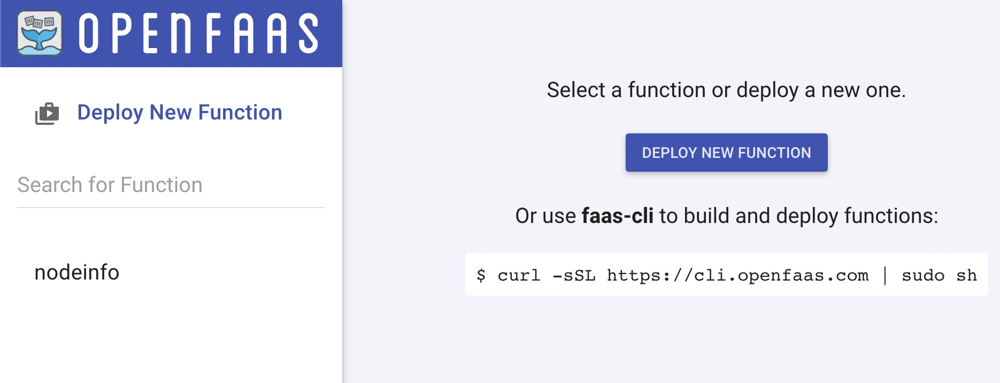

# Extending Traits in KubeVela

In the following tutorial, you will learn how to add a new workload and expose it to users via Appfile.

## Add A New Workload

### Step 1: Install OpenFaaS via Cap Center

Add cap center that contains OpenFaaS:

```bash
$ vela cap center config my-center https://github.com/oam-dev/catalog/tree/master/registry
$ vela cap center config my-center https://github.com/oam-dev/catalog/tree/openfaas/registry
successfully sync 2/2 from my-center remote center
Successfully configured capability center my-center and sync from remote

$ vela cap center sync my-center
successfully sync 2/2 from my-center remote center
sync finished
```

Create namespace and secret for OpenFaaS:

```bash
# generate a random password
$ PASSWORD=$(head -c 12 /dev/urandom | shasum| cut -d' ' -f1)

$ kubectl -n openfaas create secret generic basic-auth \
    --from-literal=basic-auth-user=admin \
    --from-literal=basic-auth-password="$PASSWORD"

$ kubectl apply -f https://raw.githubusercontent.com/openfaas/faas-netes/master/namespaces.yml
```

Install OpenFaaS:

```bash
$ vela cap install my-center/openfaas
Installing workload capability openfaas
2020/11/13 15:50:07 [debug] creating 24 resource(s)
Successfully installed chart (openfaas) with release name (openfaas)
Successfully installed capability openfaas from my-center
```

### Step 2: Verify OpenFaaS Workload Added


```bash
$ vela workloads
Automatically discover capabilities successfully ✅ Add(1) Update(0) Delete(0)
TYPE      	CATEGORY	DESCRIPTION
*openfaas 	workload	OpenFaaS function workload
NAME      	DESCRIPTION
openfaas  	OpenFaaS function workload
task      	One-time task/job
webservice	Long running service with network routes
worker    	Backend worker without ports exposed
```

### Step 3: Deploy OpenFaaS Workload via Appfile

Write an Appfile:

```bash
$ cat << EOF > vela.yaml
name: testapp
services:
  nodeinfo:
    type: openfaas
    image: functions/nodeinfo
    handler: "node main.js"
EOF
```

Deploy it:

```bash
$ vela up
```

Then you could find functions have been created:

```
$ kubectl get functions
NAME      AGE
nodeinfo   33s
```

Port-forward the OpenFaaS Gateway:

```
kubectl port-forward -n openfaas svc/gateway 31112:8080
```

Now you can visit OpenFaas dashboard via http://127.0.0.1:31112 .

Here is the login credential. Username is `admin`, and the password is set in previous step via `PASSWORD` env.
```
username: admin
password: $(echo $PASSWORD)
```

Then you can see the dashboard as below. The `nodeinfo` function is shown as well:


