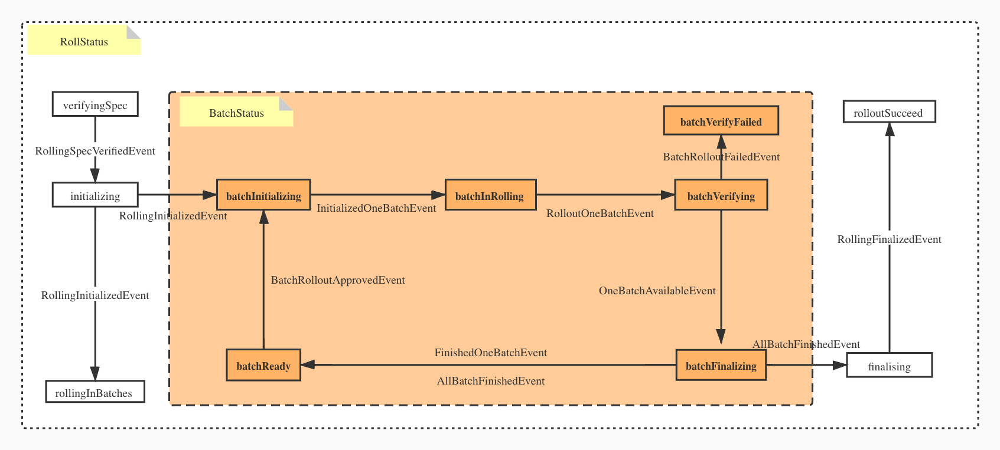

`Rollout` or `Upgrade` is one of the most essential "day 2" operation on any application
. KubeVela, as an application centric platform, definitely needs to provide a customized solution
to alleviate the burden on the application operators.

## Overview 
There are several attempts at solving this problem in the cloud native community. However, none 
of them provide a true rolling style upgrade. For example, flagger supports Blue/Green, Canary 
and A/B testing. Therefore, we decide to add support for batch based rolling upgrade as 
our first style to support in KubeVela.

### Design Principles and Goals
We design KubeVela rollout solutions with the following principles in mind
- First, we want all flavors of rollout controllers share the same core rollout
  related logic. The trait and application related logic can be easily encapsulated into its own
  package.
- Second, the core rollout related logic is easily extensible to support different type of
  workloads, i.e. Deployment, CloneSet, Statefulset, DaemonSet or even customized workloads.
- Thirdly, the core rollout related logic has a well documented state machine that
  does state transition explicitly.
- Finally, the controllers can support all the rollout/upgrade needs of an application running
  in a production environment including Blue/Green, Canary and A/B testing.


## AppRollout
Here is a simple `AppRollout` that upgrade an application from v1 to v2 in three batches. The 
first batch contains only 1 pod while the rest of the batches split the rest.

```yaml
apiVersion: core.oam.dev/v1beta1
kind: AppRollout
metadata:
  name: rolling-example
spec:
  sourceAppRevisionName: test-rolling-v1
  targetAppRevisionName: test-rolling-v2
  componentList:
    - metrics-provider
  rolloutPlan:
    rolloutStrategy: "IncreaseFirst"
    rolloutBatches:
      - replicas: 1
      - replicas: 50%
      - replicas: 50%
    batchPartition: 1
```

## User Workflow
Here is the end to end user experience based on [CloneSet](https://openkruise.io/en-us/docs/cloneset.html)

1. Install CloneSet and its `ComponentDefinition`.

  Since CloneSet is an customized workload for Kubernetes, we need to install its controller and component definition manually to KubeVela platform.

  ```shell
  helm install kruise https://github.com/openkruise/kruise/releases/download/v0.7.0/kruise-chart.tgz
  ```

  ```shell
  kubectl apply -f https://raw.githubusercontent.com/oam-dev/kubevela/master/docs/examples/cloneset-rollout/clonesetDefinition.yaml
  ```

2. Deploy application to the cluster
  ```yaml
  apiVersion: core.oam.dev/v1beta1
  kind: Application
  metadata:
    name: test-rolling
    annotations:
      "app.oam.dev/rolling-components": "metrics-provider"
      "app.oam.dev/rollout-template": "true"
  spec:
    components:
      - name: metrics-provider
        type: clonesetservice
        properties:
          cmd:
            - ./podinfo
            - stress-cpu=1
          image: stefanprodan/podinfo:4.0.6
          port: 8080
          updateStrategyType: InPlaceIfPossible
          replicas: 5
  ```

3. Attach the following rollout plan to upgrade the application to v1
  ```yaml
  apiVersion: core.oam.dev/v1beta1
  kind: AppRollout
  metadata:
    name: rolling-example
  spec:
    # application (revision) reference
    targetAppRevisionName: test-rolling-v1
    componentList:
      - metrics-provider
    rolloutPlan:
      rolloutStrategy: "IncreaseFirst"
      rolloutBatches:
        - replicas: 10%
        - replicas: 40%
        - replicas: 50%
  ```
  Use can check the status of the ApplicationRollout and wait for the rollout to complete.

4. User can continue to modify the application image tag and apply
  ```yaml
  apiVersion: core.oam.dev/v1beta1
  kind: Application
  metadata:
    name: test-rolling
    annotations:
      "app.oam.dev/rolling-components": "metrics-provider"
      "app.oam.dev/rollout-template": "true"
  spec:
    components:
      - name: metrics-provider
        type: clonesetservice
        properties:
          cmd:
            - ./podinfo
            - stress-cpu=1
          image: stefanprodan/podinfo:5.0.2
          port: 8080
          updateStrategyType: InPlaceIfPossible
          replicas: 5
  ```

5. Apply the application rollout that upgrade the application from v1 to v2
  ```yaml
  apiVersion: core.oam.dev/v1beta1
  kind: AppRollout
  metadata:
    name: rolling-example
  spec:
    # application (revision) reference
    sourceAppRevisionName: test-rolling-v1
    targetAppRevisionName: test-rolling-v2
    componentList:
      - metrics-provider
    rolloutPlan:
      rolloutStrategy: "IncreaseFirst"
      rolloutBatches:
        - replicas: 1
        - replicas: 2
        - replicas: 2
  ```
  User can check the status of the ApplicationRollout and see the rollout completes, and the
  ApplicationRollout's "Rolling State" becomes `rolloutSucceed`

## State Transition
Here is the high level state transition graph



## Roadmap

Our recent roadmap for progressive rollout is [here](./roadmap).
