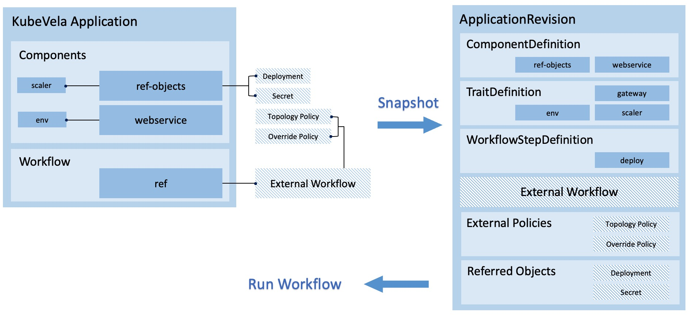

# Managing KubeVela Application Versions



In KubeVela, ApplicationRevision keeps the snapshot of application and all its runtime dependencies such as ComponentRevision, external Policy or referred objects.
This revision can be used review the application changes and rollback to past configurations.

In KubeVela v1.3, for application which uses the `PublishVersion` feature, we support viewing the history revisions, checking the differences across revisions, and rolling back to the latest succeeded revision.

For application with the `app.oam.dev/publishVersion` annotation, the workflow runs are strictly controlled.
The annotation, which is noted as *publishVersion* in the following paragraphs, is used to identify a static version of the application and its dependencies.

When the annotation is updated to a new value, the application will generate a new revision no matter if the application spec or the dependencies are changed. 
It will then trigger a fresh new run of workflow after terminating the previous run.

During the running of workflow, all related data are retrieved from the ApplicationRevision, which means the changes to the application spec or the dependencies will not take effects until a newer `publishVerison` is annotated.

Fo example, let's start with an application with has referred objects, external workflow and policies.

```yaml
apiVersion: core.oam.dev/v1beta1
kind: Application
metadata:
  name: nginx-publish-version
  namespace: examples
  annotations:
    app.oam.dev/publishVersion: alpha1
spec:
  components:
    - name: nginx-publish-version
      type: ref-objects
      properties:
        objects:
          - resource: deployment
  workflow:
    ref: make-release-in-hangzhou
---
apiVersion: core.oam.dev/v1alpha1
kind: Policy
metadata:
  name: topology-hangzhou-clusters
  namespace: examples
type: topology
properties:
  clusterLabelSelector:
    region: hangzhou
---
apiVersion: core.oam.dev/v1alpha1
kind: Workflow
metadata:
  name: make-release-in-hangzhou
  namespace: examples
steps:
  - name: deploy-hangzhou
    type: deploy
    properties:
      policies: ["topology-hangzhou-clusters"]
```

This application should be successful after a while. 
Now if we edit the referred deployment and set its image to an invalid value, such as `nginx:1.200`. 
The application will not re-run the workflow to make this change take effect automatically.
But since the dependencies of this application changes, it means the next workflow run will update the deployment image.

Now let's run `vela live-diff nginx-publish-version -n examples` to check this diff
```bash
$ vela live-diff nginx-publish-version -n examples
* Application (nginx-publish-version) has no change
* External Policy (topology-hangzhou-clusters) has no change
* External Workflow (make-release-in-hangzhou) has no change
* Referred Object (apps/v1 Deployment examples/nginx-publish-version) has been modified(*)
  apiVersion: apps/v1
  kind: Deployment
  metadata:
    annotations:
-     deployment.kubernetes.io/revision: "1"
+     deployment.kubernetes.io/revision: "2"
    labels:
      app: nginx-publish-version
    name: nginx-publish-version
    namespace: examples
  spec:
    progressDeadlineSeconds: 600
    replicas: 1
    revisionHistoryLimit: 10
    selector:
      matchLabels:
        app: nginx-publish-version
    strategy:
      rollingUpdate:
        maxSurge: 25%
        maxUnavailable: 25%
      type: RollingUpdate
    template:
      metadata:
        creationTimestamp: null
        labels:
          app: nginx-publish-version
      spec:
        containers:
-       - image: nginx
+       - image: nginx:1.200
          imagePullPolicy: Always
          name: nginx
          resources: {}
          terminationMessagePath: /dev/termination-log
          terminationMessagePolicy: File
        dnsPolicy: ClusterFirst
        restartPolicy: Always
        schedulerName: default-scheduler
        securityContext: {}
        terminationGracePeriodSeconds: 30
```

We can see all the changes of the application spec and the dependencies. 
Now let's make this change take effects. 
Update the `publishVersion` annotation in the application to `alpha2` to trigger the re-run of workflow.
We will find the application stuck at `runningWorkflow` as the deployment cannot finish the update progress due to the invalid image.

Now we can run `vela revision list nginx-publish-version -n examples` to list all the available revisions.
```bash
$ vela revision list nginx-publish-version -n examples
NAME                            PUBLISH_VERSION SUCCEEDED       HASH                    BEGIN_TIME              STATUS          SIZE   
nginx-publish-version-v1        alpha1          true            d428eff1f0a7918         2022-03-28 20:54:25     Succeeded       8.1 KiB
nginx-publish-version-v2        alpha2          false           4f04da8827d87922        2022-03-28 21:01:25     Executing       8.1 KiB
```

Before rolling back, we need to suspend the workflow of the application first. Run `vela workflow suspend nginx-publish-version -n examples`. 
After the application workflow is suspended, run `vela workflow rollback nginx-publish-version -n examples`, the workflow will be rolled back and the application resources will restore to the succeeded state.
```bash
$ vela workflow suspend nginx-publish-version -n examples 
Successfully suspend workflow: nginx-publish-version
$ vela workflow rollback nginx-publish-version -n examples
Find succeeded application revision nginx-publish-version-v1 (PublishVersion: alpha1) to rollback.
Application spec rollback successfully.
Application status rollback successfully.
Application rollback completed.
Application outdated revision cleaned up.
```
