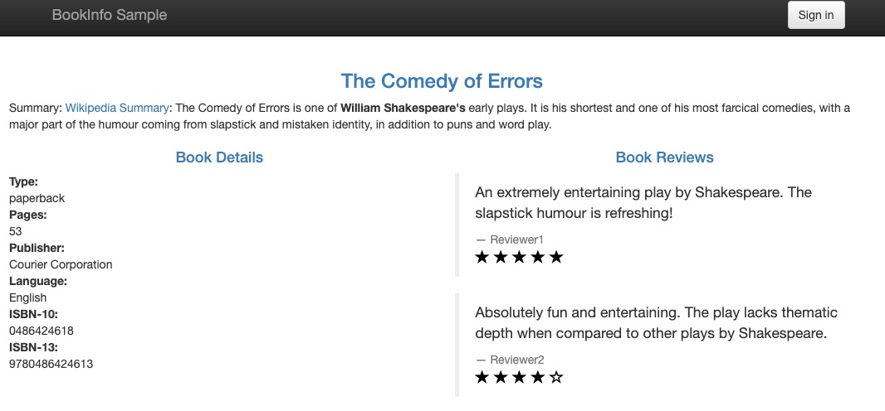
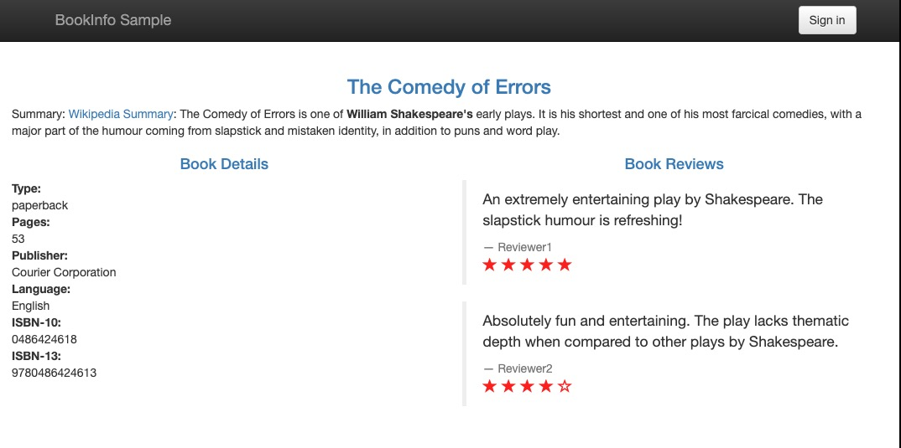

# Canary rollout use case

This chapter will introduce how to define a canary rollout workflow to implement [bookinfo demo](https://istio.io/latest/docs/examples/bookinfo/?ie=utf-8&hl=en&docs-search=Canary) by leverage [istio](https://istio.io/latest/)

## Prerequisite

enable istio addon in you cluster
```shell
vela addon enable istio
```

enable label istio injection in `default namespace`

```shell
kubectl label namespace default istio-injection=enabled
```

## First deployment

```shell
kubectl apply -f first-deploy.yaml
```

Wait a few minutes until all pods are ready. Use kubectl port-forward map gateway's service port to localhost.
```shell
kubectl port-forward service/istio-ingressgateway -n istio-system 19082:80
```

Request http://127.0.0.1:19082/productpage in your browser will see webpage like this.


## Canary Rollout

Update the Application to define a canary rollout workflow.
This workflow will suspend after rolling the first batch of new `reviews` pods and shift 10% traffic to new revision.
It waits for user to do manual-check.

```shell
kubectl apply -f rollout-v2.yaml
```

Wait a few minutes new revision pods ready. Request http://127.0.0.1:19082/productpage in your browser again several times. Will see almost 90% chance see previous the webpage and 10% chance see the new webpage whose reviews will display red starts like this.



### Rollout rest batches and traffic

resume workflow to continue rollout rest replicas and shift all traffic to new revision.

```shell
vela workflow reumse book-info
```

Request again. You will always see the new webpage

### Rollback to the first deployment

If you find some problems after manual-check and want to revert to previous revision, you can rollback to the first deployment.

```shell
kubectl apply -f rollback.yaml
```

By request again. You will always see the old webpage


