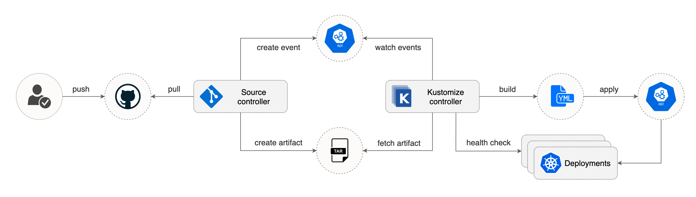
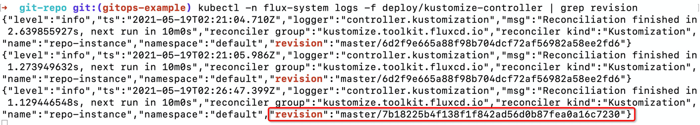
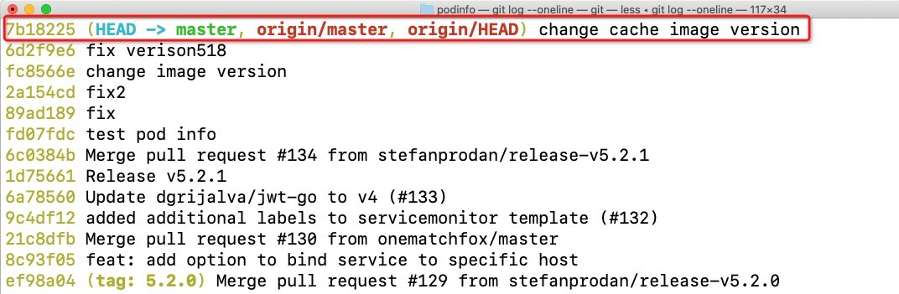

## Usage 
This example is modified on the basis of kustomized controller provided by flux.
The kustomize-controller is part of a composable GitOps toolkit and depends on source-controller 
to acquire the Kubernetes manifests from Git repositories and S3 compatible storage buckets.

### 1. Install toolkit controllers
Download the flux CLI:
```shell
curl -s https://fluxcd.io/install.sh | sudo bash
```
Install the toolkit controllers in the flux-system namespace
```shell
flux install
```

### 2. Define a Git repository source
Create a source object that points to a Git repository containing Kubernetes and Kustomize manifests.
Cause we want to verify the continuous delivery logic through git commit && git push to our own repository,
we need to fork the official warehouse to our own warehouse.

```shell
# fork  https://github.com/stefanprodan/podinfo  to your own repository
git clone https://github.com/$(yourgithubname)/podinfo
---
# edit in  ./gitrepo-kind.yaml and 
# change "url: https://github.com/stefanprodan/podinfo" with "url: https://github.com/$(yourgithubname)/podinfo"
---
kubectl apply -f gitrepo-kind.yaml
```
You can wait for the source controller to assemble an artifact from the head of the repo master branch with:
```shell
kubectl wait gitrepository/podinfo --for=condition=ready
```
The source controller will check for new commits in the master branch every minute. You can force a git sync with:
```shell
kubectl annotate --overwrite gitrepository/podinfo reconcile.fluxcd.io/requestedAt="$(date +%s)"
```

### 3. Define a kustomization component
Create a kustomization component that uses the git repository defined above and apply the application.
```shell
kubectl apply -f kustomization-comp.yaml
# Wait for the kustomization kind generation. 
# And apply the application and deploy a group of YAML files from a git repo
kubectl apply -f app.yaml
```
You can wait for the kustomize controller to complete the deployment with:
```shell
kubectl wait kustomization/podinfo-monitored --for=condition=ready
```
When the controller finishes the reconciliation, it will log the applied objects
```shell
kubectl -n flux-system logs -f deploy/kustomize-controller
```


### 4. Deploy a group of YAML files from a git repo and verify
First we have applied the application we defined above,
and we should make changes to the deploy yaml. 
```shell
# localpath: the path where you clone the https://github.com/$(yourgithubname)/podinfo
cd localpath
---
# change the image verison
# edit in ./deploy/bases/cache/deployment.yaml
# change "image: redis:6.0.13" with "image: redis:6.2"
---
git add .
git commit -m "change cache image version"
git push -f origin ## your own repository
```
This push will trigger the continuous delivery process, you can see by using:
```shell
kubectl -n flux-system logs -f deploy/kustomize-controller | grep revision
```


And you can compare the commit tag_id with the one get from your local podinfo path.
```shell
git log --oneline  
```


You can also use the instruction to see the cache pod is restart.
```shell
kubectl get pods -n dev
```


