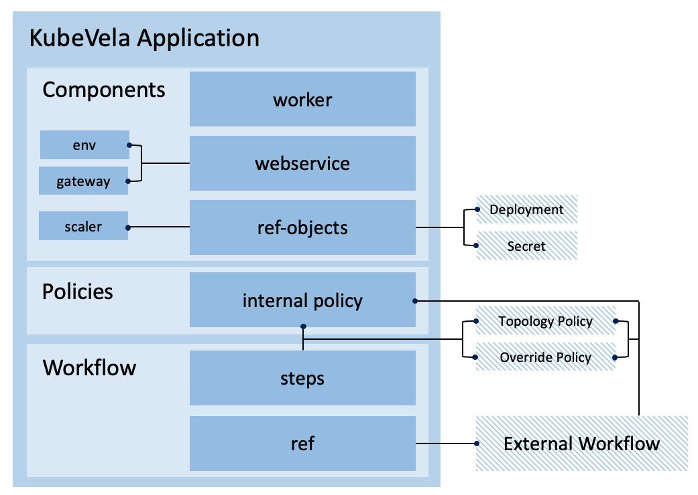

# Advanced examples for multi-cluster deployment

The below features are introduced in KubeVela v1.3.



## Topology Policy

Topology policy is a policy used to describe the location where application component should be deployed and managed.

The most straight forward way is directly specifying the names of clusters to be deployed.
In the following example, the nginx webservice will be deployed to the `examples` namespace in both `hangzhou-1` and `hangzhou-2` clusters concurrently.
After nginx in both clusters are ready, the application will finish running workflow and becomes healthy. 

```yaml
apiVersion: core.oam.dev/v1beta1
kind: Application
metadata:
  name: basic-topology
  namespace: examples
spec:
  components:
    - name: nginx-basic
      type: webservice
      properties:
        image: nginx
  policies:
    - name: topology-hangzhou-clusters
      type: topology
      properties:
        clusters: ["hangzhou-1", "hangzhou-2"]
```

The clusters in the topology can also be selected by labels instead of names.

```yaml
apiVersion: core.oam.dev/v1beta1
kind: Application
metadata:
  name: label-selector-topology
  namespace: examples
spec:
  components:
    - name: nginx-label-selector
      type: webservice
      properties:
        image: nginx
  policies:
    - name: topology-hangzhou-clusters
      type: topology
      properties:
        clusterLabelSelector:
          region: hangzhou
```

If you want to deploy application components into the control plane cluster, you can use the `local` cluster.
Besides, you can also deploy your application components in another namespace other than the application's namespace.

```yaml
apiVersion: core.oam.dev/v1beta1
kind: Application
metadata:
  name: local-ns-topology
  namespace: examples
spec:
  components:
    - name: nginx-local-ns
      type: webservice
      properties:
        image: nginx
  policies:
    - name: topology-local
      type: topology
      properties:
        clusters: ["local"]
        namespace: examples-alternative
```

## Deploy WorkflowStep

By default, if you declare multiple topology policies in the application, the application components will be deployed in all destinations following the order of the policies.

If you want to manipulate the process of deploying them, for example, changing the order or adding manual-approval, you can use the `deploy` workflow step explicitly in the workflow to achieve that.

```yaml
apiVersion: core.oam.dev/v1beta1
kind: Application
metadata:
  name: deploy-workflowstep
  namespace: examples
spec:
  components:
    - name: nginx-deploy-workflowstep
      type: webservice
      properties:
        image: nginx
  policies:
    - name: topology-hangzhou-clusters
      type: topology
      properties:
        clusterLabelSelector:
          region: hangzhou
    - name: topology-local
      type: topology
      properties:
        clusters: ["local"]
        namespace: examples-alternative
  workflow:
    steps:
      - type: deploy
        name: deploy-local
        properties:
          policies: ["topology-local"]
      - type: deploy
        name: deploy-hangzhou
        properties:
          # require manual approval before running this step
          auto: false
          policies: ["topology-hangzhou-clusters"]
```

You can also deploy application components with different topology policies concurrently, by filling these topology policies in on `deploy` step.

```yaml
apiVersion: core.oam.dev/v1beta1
kind: Application
metadata:
  name: deploy-concurrently
  namespace: examples
spec:
  components:
    - name: nginx-deploy-concurrently
      type: webservice
      properties:
        image: nginx
  policies:
    - name: topology-hangzhou-clusters
      type: topology
      properties:
        clusterLabelSelector:
          region: hangzhou
    - name: topology-local
      type: topology
      properties:
        clusters: ["local"]
        namespace: examples-alternative
  workflow:
    steps:
      - type: deploy
        name: deploy-all
        properties:
          policies: ["topology-local", "topology-hangzhou-clusters"]
```

## Override Policy

Override policy helps you to customize the application components in different clusters. For example, using a different container image or changing the default number of replicas. The override policy should be used together with the topology policy in the `deploy` workflow step.

```yaml
apiVersion: core.oam.dev/v1beta1
kind: Application
metadata:
  name: deploy-with-override
  namespace: examples
spec:
  components:
    - name: nginx-with-override
      type: webservice
      properties:
        image: nginx
  policies:
    - name: topology-hangzhou-clusters
      type: topology
      properties:
        clusterLabelSelector:
          region: hangzhou
    - name: topology-local
      type: topology
      properties:
        clusters: ["local"]
        namespace: examples-alternative
    - name: override-nginx-legacy-image
      type: override
      properties:
        components:
          - name: nginx-with-override
            properties:
              image: nginx:1.20
    - name: override-high-availability
      type: override
      properties:
        components:
          - type: webservice
            traits:
              - type: scaler
                properties:
                  replicas: 3
  workflow:
    steps:
      - type: deploy
        name: deploy-local
        properties:
          policies: ["topology-local"]
      - type: deploy
        name: deploy-hangzhou
        properties:
          policies: ["topology-hangzhou-clusters", "override-nginx-legacy-image", "override-high-availability"]
```

The override policy has many advanced capabilities, such as adding new component or selecting components to use.
The following example will deploy `nginx:1.20` to local cluster. `nginx` and `nginx:stable` will be deployed to hangzhou clusters.

```yaml
apiVersion: core.oam.dev/v1beta1
kind: Application
metadata:
  name: advance-override
  namespace: examples
spec:
  components:
    - name: nginx-advance-override-legacy
      type: webservice
      properties:
        image: nginx:1.20
    - name: nginx-advance-override-latest
      type: webservice
      properties:
        image: nginx
  policies:
    - name: topology-hangzhou-clusters
      type: topology
      properties:
        clusterLabelSelector:
          region: hangzhou
    - name: topology-local
      type: topology
      properties:
        clusters: ["local"]
        namespace: examples-alternative
    - name: override-nginx-legacy
      type: override
      properties:
        selector: ["nginx-advance-override-legacy"]
    - name: override-nginx-latest
      type: override
      properties:
        selector: ["nginx-advance-override-latest", "nginx-advance-override-stable"]
        components:
          - name: nginx-advance-override-stable
            type: webservice
            properties:
              image: nginx:stable
  workflow:
    steps:
      - type: deploy
        name: deploy-local
        properties:
          policies: ["topology-local", "override-nginx-legacy"]
      - type: deploy
        name: deploy-hangzhou
        properties:
          policies: ["topology-hangzhou-clusters", "override-nginx-latest"]
```

## Ref-object Component

Sometimes, you may want to copy resources from one place to other places, such as copying secrets from the control plane cluster into managed clusters.
You can use the `ref-object` typed component to achieve that.

```yaml
apiVersion: core.oam.dev/v1beta1
kind: Application
metadata:
  name: ref-objects-example
  namespace: examples
spec:
  components:
    - name: image-pull-secrets
      type: ref-objects
      properties:
        objects:
          - resource: secret
            name: image-credential-to-copy
  policies:
    - name: topology-hangzhou-clusters
      type: topology
      properties:
        clusterLabelSelector:
          region: hangzhou
```

You can also select resources by labels and duplicate them from one cluster into another cluster.

```yaml
apiVersion: core.oam.dev/v1beta1
kind: Application
metadata:
  name: ref-objects-duplicate-deployments
  namespace: examples
spec:
  components:
    - name: duplicate-deployment
      type: ref-objects
      properties:
        objects:
          - resource: deployment
            cluster: hangzhou-1
            # select all deployment in the `examples` namespace in cluster `hangzhou-1` that matches the labelSelector
            labelSelector:
              need-duplicate: "true"
  policies:
    - name: topology-hangzhou-2
      type: topology
      properties:
        clusters: ["hangzhou-2"]
```

You can also form a component by multiple referenced resources and even attach traits to the main workload.

```yaml
apiVersion: core.oam.dev/v1beta1
kind: Application
metadata:
  name: ref-objects-multiple-resources
  namespace: examples
spec:
  components:
    - name: nginx-ref-multiple-resources
      type: ref-objects
      properties:
        objects:
          - resource: deployment
          - resource: service
      traits:
        - type: scaler
          properties:
            replicas: 3
  policies:
    - name: topology-hangzhou-clusters
      type: topology
      properties:
        clusterLabelSelector:
          region: hangzhou
```

## External Policies and Workflow

Sometimes, you may want to use the same policy across multiple applications or reuse previous workflow to deploy different resources.
To reduce the repeated code, you can leverage the external policies and workflow and refer to them in your applications.

> NOTE: you can only refer to Policy and Workflow within your application's namespace.

```yaml
apiVersion: core.oam.dev/v1alpha1
kind: Policy
metadata:
  name: topology-hangzhou-clusters
  namespace: examples
type: topology
properties:
  clusterLabelSelector:
    region: hangzhou
---
apiVersion: core.oam.dev/v1alpha1
kind: Policy
metadata:
  name: override-high-availability-webservice
  namespace: examples
type: override
properties:
  components:
    - type: webservice
      traits:
        - type: scaler
          properties:
            replicas: 3
---
apiVersion: core.oam.dev/v1alpha1
kind: Workflow
metadata:
  name: make-release-in-hangzhou
  namespace: examples
steps:
  - type: deploy
    name: deploy-hangzhou
    properties:
      auto: false
      policies: ["override-high-availability-webservice", "topology-hangzhou-clusters"]
```

```yaml
apiVersion: core.oam.dev/v1beta1
kind: Application
metadata:
  name: external-policies-and-workflow
  namespace: examples
spec:
  components:
    - name: nginx-external-policies-and-workflow
      type: webservice
      properties:
        image: nginx
  workflow:
    ref: make-release-in-hangzhou
```

> NOTE: The internal policies will be loaded first. External policies will only be used when there is no corresponding policy inside the application. In the following example, we can reuse `tology-hangzhou-clusters` policy and `make-release-in-hangzhou` workflow but modify the `override-high-availability-webservice` by injecting the same-named policy inside the new application.

```yaml
apiVersion: core.oam.dev/v1beta1
kind: Application
metadata:
  name: nginx-stable-ultra
  namespace: examples
spec:
  components:
    - name: nginx-stable-ultra
      type: webservice
      properties:
        image: nginx:stable
  policies:
    - name: override-high-availability-webservice
      type: override
      properties:
        components:
          - type: webservice
            traits:
              - type: scaler
                properties:
                  replicas: 5
  workflow:
    ref: make-release-in-hangzhou
```