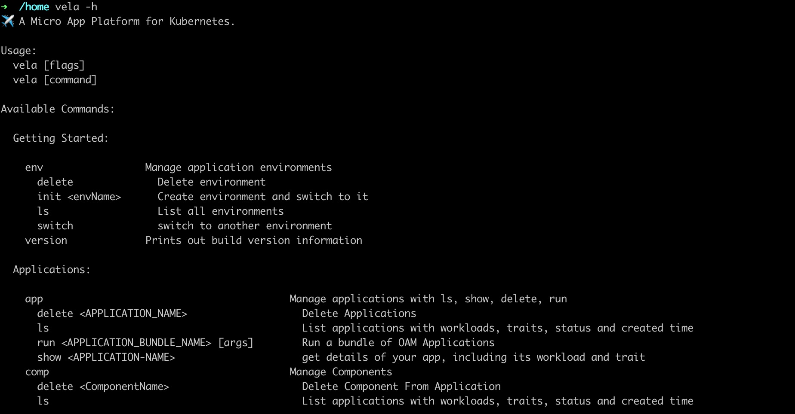

## Overview

For developers and operators, KubeVela, as a out-of-box Cloud Native Application Management Platform, provides numerous
workloads and operation toolings for application defining, deployment, scaling, traffic, rollout, routing, monitoring,
logging, alerting, CICD and so on.

For platform builders, KubeVela, as a highly extensible PaaS/Serverless Core, provides pluginable capabilities, an elegant
way to integrate any Workloads and Traits.

## Get Started

Check out [Get Started](https://github.com/oam-dev/kubevela) to try KubeVela.

Explore [Cli docs](https://github.com/oam-dev/kubevela/tree/master/documentation/cli) to get a quick glance
of the power of KubeVela.

## Community

## Support or Contact

Having trouble with KubeVela? File an [issue](https://github.com/oam-dev/kubevela/issues), or contact us directly [Twitter](https://twitter.com/oam_dev) or [Gitter](https://gitter.im/oam-dev/)
