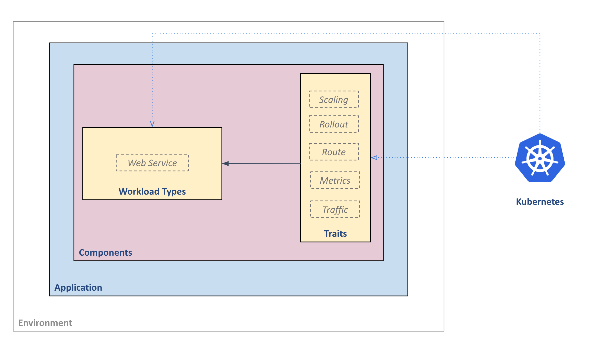

*"KubeVela 是一个面向平台构建者基于 Kubernetes 构建易用可拓展的云原生应用平台的引擎。"*

在本部分中，我们会对 KubeVela 的核心思想进行详细解释，并进一步阐清一些在本项目中被广泛使用的技术术语。

## 综述

首先，KubeVela 引入了下面所述的带有关注点分离思想的工作流：
- **平台团队**
  - 通过给部署环境和可重复使用的能力模块编写模板来构建应用，并将他们注册到集群中。
- **业务用户**
  - 选择部署环境、模型和可用模块来组装应用，并把应用部署到目标环境中。

工作流如下图所示:


这种基于模板的工作流使得平台团队能够在一系列的 Kubernetes CRD 之上，引导用户遵守他们构建的最佳实践和 部署经验，并且可以很自然地为业务用户提供 PaaS 级别的体验（比如：“以应用为中心”，“高层次的抽象”，“自助式运维操作”等等）。


下面开始介绍 KubeVela 的核心概念

## `Application`

应用（*Application*），是 KubeVela 的核心 API。它使得业务开发者只需要基于一个单一的制品和一些简单的原语就可以构建完整的应用。

在应用交付平台中，有一个 *Application* 的概念尤为重要，因为这可以很大程度上简化运维任务，并且作为一个锚点避免操作过程中产生配置漂移的问题。同时，它也帮助应用交付过程中引入 Kubernetes的能力提供了一个更简单的、且不用依赖底层细节的途径。 举个例子，开发者能够不需要每次都定义一个详细的 Kubernetes Deployment + Service 的组合来建模一个 web service ，或者不用依靠底层的 KEDA ScaleObject 来获取自动扩容的需求。

### 举例

一个需要两个组件（比如 `frontend` 和 `backend` ）的 `website` 应用可以如下建模：

```yaml
apiVersion: core.oam.dev/v1beta1
kind: Application
metadata:
  name: website
spec:
  components:
    - name: backend
      type: worker
      properties:
        image: busybox
        cmd:
          - sleep
          - '1000'
    - name: frontend
      type: webservice
      properties:
        image: nginx
      traits:
        - type: autoscaler
          properties:
            min: 1
            max: 10
        - type: sidecar
          properties:
            name: "sidecar-test"
            image: "fluentd"
```

## 构建抽象

不像大多数的高层次的抽象，KubeVela 中的 `Application` 资源是一种积木风格的对象，而且它甚至没有固定的 schema。相反，它由构建模块，比如app components（应用组件）和 traits（运维能力）等，构成。这种构建模块允许开发者通过自己定义的抽象来集成平台的能力到此应用定义。

定义抽象和建模平台能力的构建模块是 `ComponentDefinition` 和 `TraitDefinition` 。

### ComponentDefinition

`ComponentDefinition` ，组件定义，是一个预先定义好的，用于可部署的工作负载的*模板*。它包括了模板，参数化的和工作负载特性的信息作为一种声明式API资源。

因此，`Application` 抽象本质上定义了在目标集群中，用户想要如何来**实例化**给定 component definition。特别地，`.type` 字段引用安装了的 `ComponentDefinition` 的名字; `.properties` 字段是用户设置的用来实例化它的值。

一些主要的 component definition 有：长期运行的 web service、一次性的 task 和 Redis数据库。所有的 component definition 均应在平台提前安装，或由组件提供商，比如第三方软件供应商，来提供。

### TraitDefinition

可选的，每一个组件都有一个 `.traits` 部分。这个部分通过使用操作类行为，比如负载均衡策略、网络入口路由、自动扩容策略，和升级策略等，来增强组件实例。

*Trait*，运维能力，是由平台提供的操作性质的特性。为了给组件实例附加运维能力，用户需要声明 `.type` 字段来引用特定的 `TraitDefinition` 和 `.properties` ，以此来设置给定运维能力的属性值。相似的，`TraitDefiniton` 同样允许用户来给这些操作特性定义*模板*。

在 KubeVela 中，我们还将 component definition 和 trait definitions 定义称为 *“capability definitions”* 。

## Environment
在将应用发布到生产环境之前，在 testing/staging workspace 中测试代码很重要。在 KubeVela，我们将这些 workspace 描述为 “deployment environments”，部署环境，或者简称为 “environments”，环境。每一个环境都有属于自己的配置（比如说，domain，Kubernetes集群，命名空间，配置数据和访问控制策略等）来允许用户创建不同的部署环境，比如 “test”，和 “production”。

到目前为止，一个 KubeVela 的 `environment` 只映射到一个 Kubernetes 的命名空间。集群级环境正在开发中。

### 总结

KubeVela的主要概念由下图所示：



## 架构

KubeVela的整体架构由下图所示：


特别的，application controller 负责应用的抽象和封装（比如负责 `Application` 和 `Definition` 的 controller ）。Rollout contoller 负责以整个应用为单位处理渐进式 rollout 策略。多集群部署引擎，在流量切分和 rollout 特性的支持下，负责跨多集群和环境部署应用。
